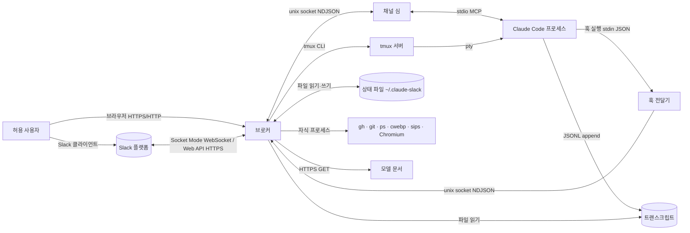
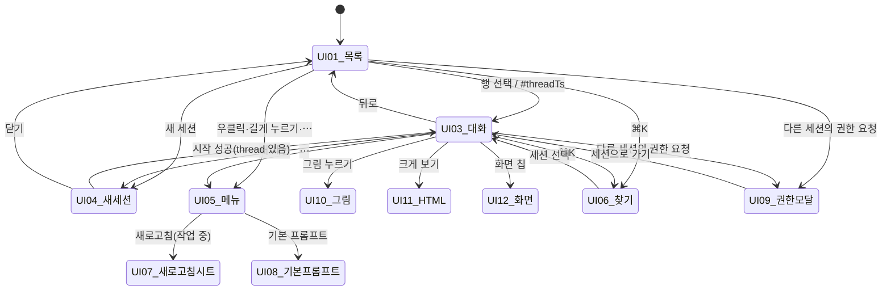
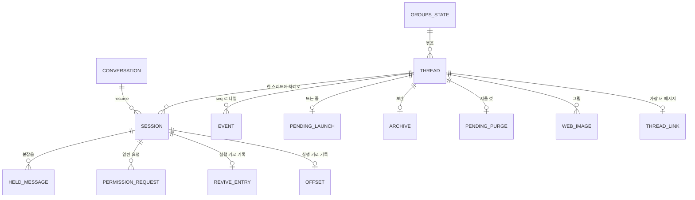
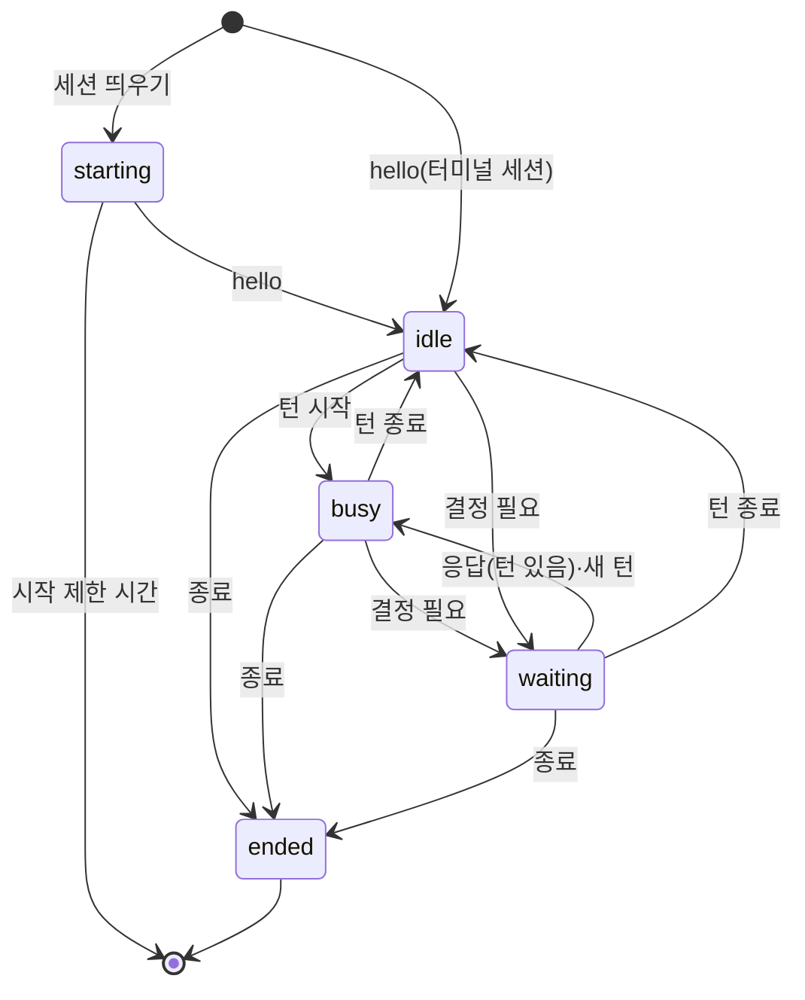
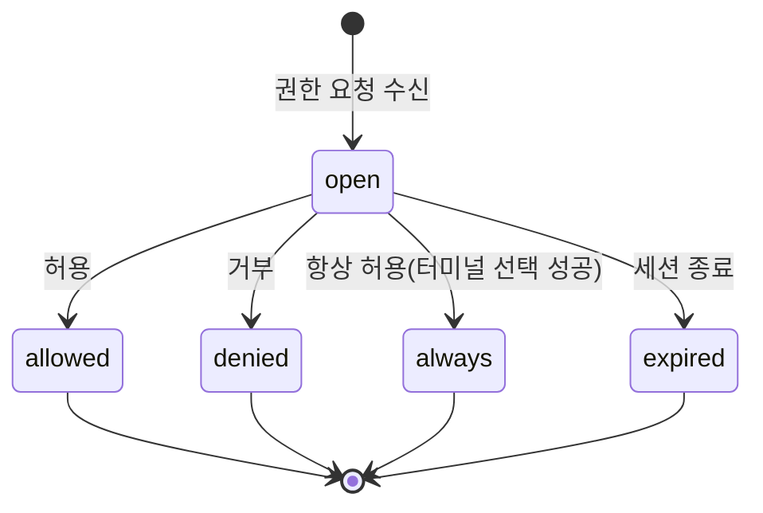
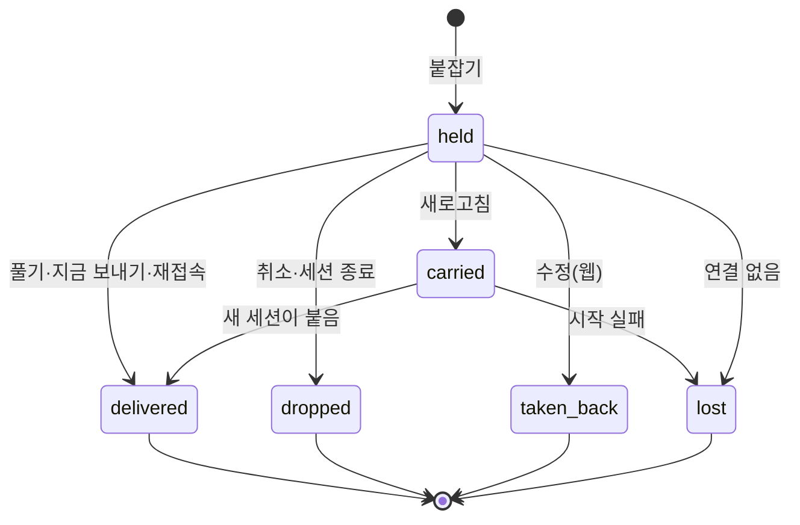
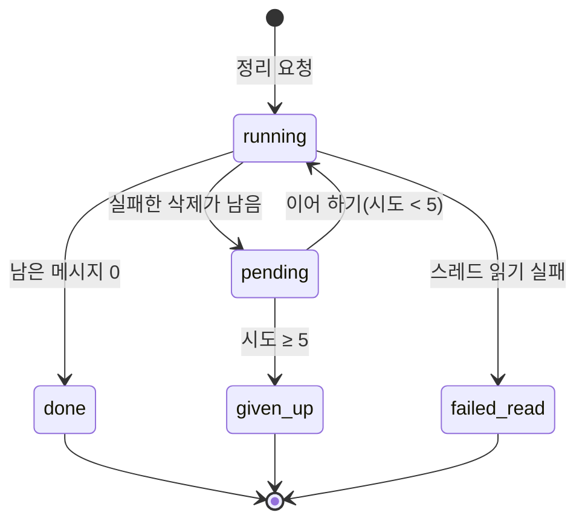
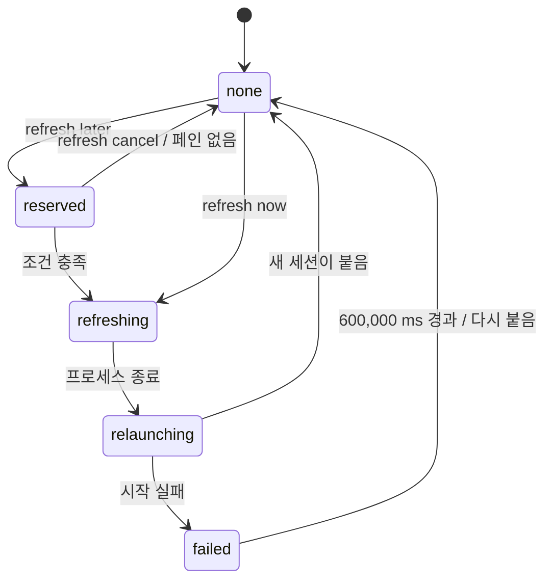
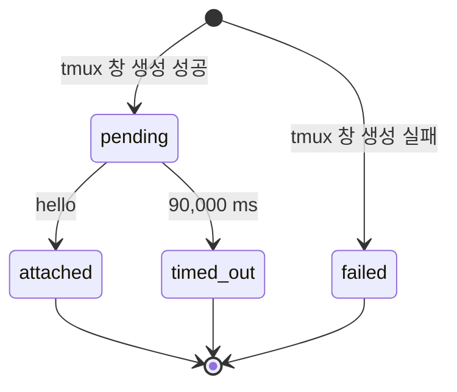
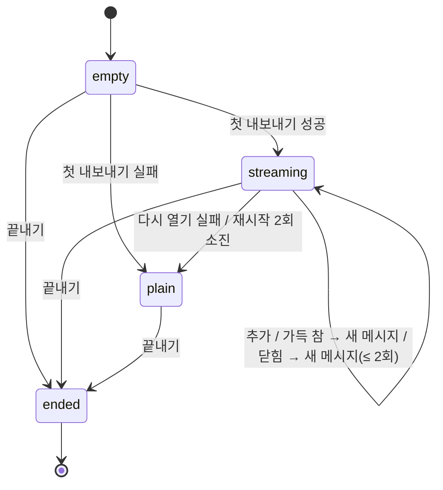

# claude-slack 소프트웨어 요구사항 명세서 (SRS)

| 문서 버전 | 작성일 | 상태 | 작성자 |
|---|---|---|---|
| 1.0.0 | 2026-10-02 | 초안(가정 모드, 자체 검증 합격) | Claude Code (요청자: @레코) |

## 0. 문서 요약

1. 시스템 한 줄 정의: claude-slack 은 한 대의 macOS 호스트에서 도는 Claude Code 터미널 세션을 Slack 스레드 1개 = 세션 1개로 묶어, Slack 과 웹 브라우저에서 같은 세션을 조종하게 하는 단일 프로세스 브로커다.
2. 핵심 기능 ①: Slack 스레드 답글·웹 입력을 세션의 프롬프트로 전달한다(도구 실행 중이면 붙잡았다가 전달).
3. 핵심 기능 ②: 세션의 답변·도구 호출·할 일 목록을 Slack 스트림과 웹 이벤트 로그로 내보낸다.
4. 핵심 기능 ③: 권한 요청·질문·플랜 승인·터미널 다이얼로그를 버튼 카드로 올리고, 누른 결과를 세션에 돌려준다("전부 허용" 포함).
5. 핵심 기능 ④: 세션을 시작·재개·복제·새로고침·종료하고, 브로커 재시작 뒤에 세션과 상태를 복원한다.
6. 핵심 기능 ⑤: 끝난 스레드를 디스크에 보관한 뒤 Slack 에서 지우고, 보관 기록을 조회한다.
7. 핵심 품질 수치 ①: 세션 목록 변경을 SSE 프레임으로 내보내기까지 지연 ≤ 250 ms + 프레임 직렬화 시간(REQ-P-001).
8. 핵심 품질 수치 ②: 브로커 재시작 뒤 살아 있는 세션의 재접속 대기 15,000 ms, 되살리기 동시 개수 ≤ 5(REQ-R-003).
9. 핵심 품질 수치 ③: 웹 변경 요청은 토큰(설정 시)·같은 출처·`application/json` 3개 조건을 모두 만족해야 처리된다(REQ-S-002, REQ-S-003).
10. 가정(ASM) 26개, 미결(TBD) 0개.

## 1. 서론 (Introduction)

### 1.1 목적

이 문서의 독자는 claude-slack 을 처음 보는 구현자다. 이 문서의 용도는 저장소 없이 이 문서만으로 같은 동작을 하는 시스템을 구현하는 것이다. 문서는 관찰 가능한 동작(Slack 에 올라가는 메시지 원문, HTTP 응답, 디스크 파일 형식, 터미널에 보내는 키)을 결정한다. 내부 알고리즘 가운데 자유를 남긴 지점은 "구현 자유"로 표시한다(D-16).

### 1.2 범위

시스템명: `claude-slack` (버전 0.1.0).

포함(In-scope):

| # | 구성요소 | 설명 |
|---|---|---|
| 1 | 브로커 | Slack Socket Mode 연결, IPC 서버, HTTP(S) 서버, 세션 레지스트리, 상태 저장을 가진 단일 Node.js 프로세스 |
| 2 | 채널 심 | Claude Code 가 세션마다 stdio MCP 서버로 띄우는 프로세스. 브로커와 IPC 로 통신한다 |
| 3 | 훅 전달기 | Claude Code 훅이 실행하는 프로세스. 훅 페이로드를 브로커에 넘기고 끝난다 |
| 4 | 런처 | `bin/claude-slack` 셸 스크립트. 환경을 정리하고 `claude` 를 실행한다 |
| 5 | 훅 설치기 | `scripts/install-hooks.ts`. `~/.claude/settings.json` 에 훅을 등록하고 `mcp.json` 을 쓴다 |
| 6 | 웹 앱 | 브로커가 `/` 에서 내주는 단일 페이지. 세션 목록·대화·카드·입력 |
| 7 | HTTP API | 웹 앱과 이전 관리 화면이 쓰는 `/api/*`, `/go/*`, `/login` 경로 |
| 8 | 상태 파일 | `~/.claude-slack/` 아래의 JSON·JSONL·그림·로그 파일 |
| 9 | Slack 앱 매니페스트 | `slack-manifest.json` 의 스코프·이벤트·슬래시 명령 |

제외(Out-of-scope):

| # | 항목 | 제외 사유 |
|---|---|---|
| 1 | Claude Code 자체의 동작 | 외부 제품. 이 시스템은 그 훅·채널·트랜스크립트·TUI 를 입력으로만 쓴다 |
| 2 | 이전 관리 화면(`/admin`)과 기록 보기 화면(`/view`)의 화면 내부 구성 | 웹 앱이 대체했다. HTTP 계약(IF-046, IF-047)만 포함한다 |
| 3 | 인증서 발급·갱신 스크립트(`scripts/issue-cert`, `renew-cert.ts`, `dokploy-*.ts`, `src/cert-renew.ts`) | 브로커 본체가 쓰지 않는 운영 보조 도구 |
| 4 | QA·측정 스크립트(`scripts/qa-*.ts`, `measure-web.ts`, `smoke.ts`, `purge-channel.ts`) | 검증 수단이며 제품 동작이 아니다 |
| 5 | Slack 앱 생성 자동화(`scripts/setup-with-chrome.sh`, `docs/SETUP-PROMPT.md`) | 설치 보조 절차 |
| 6 | 터미널 화면 그림의 픽셀 단위 모양 | 구현 자유(D-16). 관찰 가능한 조건은 REQ-F-038 이 정한다 |
| 7 | 웹 앱의 색·글꼴·아이콘 도형 | 구현 자유(D-16). 라벨·동작·중단점은 §3.1.1 이 정한다 |
| 8 | 다중 호스트 배포, 다중 채널 | 설계상 호스트 1대·채널 1개(CON-002, CON-003) |

### 1.3 정의·약어·용어집

| 용어 | 정의 | 금지 동의어 |
|---|---|---|
| 브로커 | §1.2 의 1번 프로세스 | 데몬, 브리지, 릴레이 |
| 세션 | 브로커에 붙은 Claude Code 프로세스 1개와 그 스레드의 결합. 실행 키로 식별한다 | 인스턴스, 봇 |
| 대화 | Claude Code 가 `session_id`(UUID)로 식별하는 대화 기록. `--resume` 의 대상 | 컨버세이션, 채팅 |
| 실행 키 | 런처가 실행마다 만드는 UUID(`CLAUDE_SLACK_SESSION`). 없으면 pid 의 10진 문자열 | 세션 키, 런치 키 |
| 스레드 | 설정된 Slack 채널 안의 스레드 1개. 루트 메시지의 `ts` 로 식별한다(`threadTs`) | 대화방, 토픽 |
| 채널 | `SLACK_CHANNEL_ID` 로 정한 Slack 채널 1개 | 방 |
| 루트 메시지 | 스레드의 첫 메시지 | 헤더 메시지 |
| 컨트롤 패널 | 스레드 안에 브로커가 올려 둔 상태·버튼 메시지 1개. `block_id` 가 `ctl_<pid>` 이거나 `ctl_ended_<pid>` | 상태 카드, 제어판 |
| 채널 심 | §1.2 의 2번 프로세스 | 어댑터, 커넥터 |
| 훅 전달기 | §1.2 의 3번 프로세스 | 훅 스크립트, 노티파이어 |
| 런처 | §1.2 의 4번 스크립트 | 실행기, 래퍼 |
| 페인 | 세션이 도는 tmux pane. `%<숫자>` 형식의 id | 패인, 윈도 |
| tmux 창 | 페인을 담은 tmux window. `@<숫자>` 형식의 id | 탭 창, 윈도 |
| 트랜스크립트 | Claude Code 가 대화마다 쓰는 JSONL 파일(`~/.claude/projects/<dir>/<session_id>.jsonl`) | 세션 로그, 대화 로그 |
| 턴 | 프롬프트 1개가 들어가서 Stop 훅이 올 때까지의 구간 | 사이클, 스텝 |
| 턴 스트림 | 턴 1개를 Slack 메시지로 내보내는 객체(ST-007) | 스트림 객체 |
| 주입 | 메시지를 세션에 프롬프트로 넣는 행위 | 인젝션, 밀어넣기 |
| 붙잡은 메시지 | 턴이 도는 동안 도착해 아직 주입하지 않은 메시지(DM-003) | 보류 메시지, 큐 메시지 |
| 권한 요청 | 채널 심이 넘긴 도구 사용 허가 요청. `requestId`(5글자)로 식별한다 | 허가 요청 |
| 권한 카드 | 권한 요청을 보여 주는 Slack 메시지 | 허가 카드, 퍼미션 카드 |
| 전부 허용 | 세션별 모드. 켜면 브로커가 권한 요청을 사람 대신 허용한다. Claude Code 의 권한 모드 `auto` 와 다르다 | 무확인 모드, 올 허용 |
| 번호 다이얼로그 | 터미널 화면에 `❯ 1. …` 처럼 번호 선택지가 그려진 확인 창 | 번호 메뉴, 선택 팝업 |
| 키 다이얼로그 | 번호 없이 Enter 안내문이 그려진 확인 창 | 체크박스 팝업 |
| 새로고침 | 세션의 프로세스를 끝내고 같은 대화를 같은 스레드에서 다시 여는 동작 | 리프레시, 리로드 |
| 예약 새로고침 | 작업이 끝나면 실행하도록 걸어 둔 새로고침 | 지연 새로고침 |
| 되살리기 | 브로커 기동 때 사라진 세션을 원래 스레드에 `--resume` 으로 다시 여는 동작 | 리바이브, 부활 |
| 휴면 스레드 | 되살리지 않고 남겨 둔 스레드. 답글이 오면 되살린다 | 잠든 세션 |
| 잔재 스레드 | 봇이 시작했고 실행 중인 세션이 없는 채널 스레드 | 고아 스레드 |
| 보관 | 스레드 전체를 `~/.claude-slack/sessions/` 에 JSON·Markdown 으로 쓰는 동작 | 아카이빙, 이관 |
| 정리 | 보관한 뒤 스레드의 메시지를 Slack 에서 지우는 동작. 메시지·파일 1개를 지우는 것은 "삭제"라 쓴다 | 퍼지, 청소 |
| 이벤트 | 웹 앱용 세션 사건 1건(DM-005). 스레드별 일련번호 `seq` 를 가진다 | 타임라인 항목, 레코드 |
| 이벤트 로그 | 스레드별 이벤트 파일 `events/<threadTs>.jsonl` | 타임라인 파일 |
| 허용 사용자 | `SLACK_ALLOWED_USERS` 에 든 Slack 사용자 id | 관리자, 화이트리스트 사용자 |
| 기본 수신자 | 허용 사용자 목록의 첫 번째 id | 대표 사용자 |
| 웹 앱 | §1.2 의 6번 페이지 | 대시보드, 콘솔 |
| 페이지 | 브라우저 탭 1개에 열린 웹 앱 | 뷰어, 프런트 |
| 백그라운드 작업 | 세션의 프로세스가 시작했고 끝나지 않은 백그라운드 명령·Monitor·비동기 에이전트 | 백그라운드 잡 |
| 그룹 | 웹 앱 세션 목록의 사용자 정의 묶음(DM-007) | 카테고리, 태그 |

"패널"은 컨트롤 패널의 줄임이고, "확인 창"은 번호 다이얼로그와 키 다이얼로그를 함께 가리키는 말이다. 금지 동의어는 그 개념을 가리킬 때만 금지다(시스템이 내보내는 문구의 원문 인용은 예외).

약어: IPC(프로세스 간 통신), SSE(Server-Sent Events), MCP(Model Context Protocol), TUI(터미널 UI), PR(Pull Request), ts(Slack 메시지 타임스탬프 문자열).

### 1.4 참조 문서

| # | 문서 | 버전 | URL | 조회일 |
|---|---|---|---|---|
| 1 | IEEE Std 830-1998 SRS 권고 실무 | 1998 | https://standards.ieee.org/ieee/830/1222/ | 2026-10-02 |
| 2 | RFC 2119 요구 수준 키워드 | 1997-03 | https://www.rfc-editor.org/rfc/rfc2119 | 2026-10-02 |
| 3 | Slack Web API 메서드 문서 | `@slack/web-api` 8.1.1 이 감싼 판 | https://docs.slack.dev/reference/methods | 2026-10-02 |
| 4 | Slack Block Kit 참조 | 조회일 기준 | https://docs.slack.dev/reference/block-kit | 2026-10-02 |
| 5 | Slack Bolt for JavaScript | 5.1.0 | https://docs.slack.dev/tools/bolt-js | 2026-10-02 |
| 6 | Model Context Protocol TypeScript SDK | 1.30.0 | https://github.com/modelcontextprotocol/typescript-sdk | 2026-10-02 |
| 7 | Claude Code 훅·채널 문서 | Claude Code 2.1.287 | https://docs.claude.com/en/docs/claude-code/hooks | 2026-10-02 |
| 8 | Claude 모델 개요(모델 목록 갱신의 원본) | 조회 시점 본문 | https://platform.claude.com/docs/en/about-claude/models/overview.md | 2026-10-02 |
| 9 | JSON Schema | draft 2020-12 | https://json-schema.org/draft/2020-12/schema | 2026-10-02 |
| 10 | WCAG | 2.2 | https://www.w3.org/TR/WCAG22/ | 2026-10-02 |
| 11 | OWASP Top 10 | 2021 | https://owasp.org/Top10/ | 2026-10-02 |
| 12 | ISO/IEC 18004 QR 코드 | 2015 | https://www.iso.org/standard/62021.html | 2026-10-02 |
| 13 | tmux 매뉴얼 | 3.7c | https://man.openbsd.org/tmux | 2026-10-02 |
| 14 | 저장소 원문(프로젝트 입력) | 커밋 `199691e` | 비공개 저장소 `CreatiCoding/claude-slack` | 2026-10-02 |

### 1.5 문서 개요

§2 는 시스템의 경계·사용자·제약·가정·기술 스택을 정한다. §3 은 인터페이스(IF), 기능 요구사항(REQ-F), 데이터(DM), 성능(REQ-P), 설계 제약, 품질 속성(REQ-R·REQ-S·REQ-M)을 정한다. §4 는 모듈 구조, 상태 기계(ST), 알고리즘, 오류 매트릭스(ERR), 설정, 로깅을 정한다. §5 는 수용 테스트(AC), 추적성 매트릭스, 골든 테스트를 담는다. §6 은 미결 사항, 변경 이력, 자체 검증 결과다.

표기 규칙:

- 시각은 따로 적지 않으면 Unix epoch 밀리초 정수(UTC 기준)다. Slack `ts` 는 `초.마이크로초` 형식의 문자열(`^\d+\.\d+$`)이다.
- 문자열 길이는 따로 적지 않으면 UTF-16 코드 유닛 수(JavaScript `String.length`)다. "N자"는 이 길이를 뜻한다.
- 자르기 `truncate(s, n)`: `s` 의 길이 > n 이면 `s` 의 앞 n−1 자 뒤에 `…`(U+2026)를 붙이고, 아니면 `s` 그대로다.
- `basename(p)`: 경로의 마지막 구성요소. `shortenHome(p)`: `p` 가 홈 경로로 시작하면 그 부분을 `~` 로 바꾼 문자열.
- `duration(ms)`: §4.3.1 의 규칙으로 만든 한국어 경과 시간 문자열.
- 백틱 안의 글은 원문 그대로의 상수다. `<이름>` 은 그 자리에 들어가는 값이다.
- 요구사항의 의무 수준은 블록의 `의무` 필드에 RFC 2119 키워드 1개로 적는다. 요구사항의 문장은 블록의 제목이다.

## 2. 전체 설명 (Overall Description)

### 2.1 제품 관점



| 액터·외부 시스템 | 역할 | 통신 방향 | 프로토콜 |
|---|---|---|---|
| 허용 사용자 | Slack 과 웹 앱으로 세션을 조종한다 | 양방향 | Slack 클라이언트, HTTP(S) |
| Slack 플랫폼 | 메시지·버튼·슬래시 명령·모달·홈 탭을 중계한다 | 양방향 | Socket Mode(WebSocket, TLS), Web API(HTTPS) |
| Claude Code 프로세스 | 세션의 실체. 채널 심과 훅 전달기를 띄운다 | 양방향 | stdio MCP(JSON-RPC 2.0), 훅(stdin JSON), tmux pty |
| 채널 심 | 브로커 ↔ Claude Code 사이의 메시지·권한 중계 | 양방향 | unix socket NDJSON(IF-060~IF-066), stdio MCP(IF-067) |
| 훅 전달기 | 훅 페이로드 전달 | 단방향(→브로커) | unix socket NDJSON(IF-069) |
| tmux 서버 | 세션 실행, 키 입력, 화면 읽기 | 양방향 | `tmux` CLI 자식 프로세스(IF-070) |
| 트랜스크립트 | 답변·도구 호출의 원천 | 단방향(→브로커) | 파일 읽기 |
| 상태 파일 | 브로커 상태의 영속 | 양방향 | 파일 읽기·쓰기 |
| `gh` | 브랜치 PR·PR 상태·로그인 계정 조회 | 단방향(브로커 호출) | 자식 프로세스(IF-071) |
| `git` | 폴더를 버리기 전 변경 조사 | 단방향 | 자식 프로세스(IF-072) |
| `ps` | 프로세스 시작 시각·자식 셸 수 조회 | 단방향 | 자식 프로세스(IF-073) |
| `cwebp`, `sips` | 그림 축소 | 단방향 | 자식 프로세스(IF-074) |
| Chromium(Playwright) | 터미널 화면을 PNG 로 그린다 | 단방향 | Playwright API(IF-075) |
| 모델 문서 | 모델 선택지 갱신 | 단방향 | HTTPS GET(IF-076) |
| 브라우저(웹 앱) | 세션 목록·대화 표시, 명령 전송 | 양방향 | HTTP/1.1, SSE |

### 2.2 제품 기능 요약

| ID | 한 줄 요약 |
|---|---|
| REQ-F-001 | 설정을 읽어 정해진 순서로 기동한다 |
| REQ-F-002 | 채널 심의 hello 를 받아 세션을 붙인다 |
| REQ-F-003 | 훅 이벤트를 표에 따라 처리한다 |
| REQ-F-004 | 같은 훅의 중복 전달을 한 번만 처리한다 |
| REQ-F-005 | 채널 최상위 메시지로 세션을 시작한다 |
| REQ-F-006 | tmux 에 세션을 띄운다 |
| REQ-F-007 | 시작 다이얼로그를 자동으로 넘긴다 |
| REQ-F-008 | 연결되지 않은 시작을 제한 시간 뒤 실패로 알린다 |
| REQ-F-009 | 슬래시 명령을 하위 명령 표에 따라 처리한다 |
| REQ-F-010 | 스레드 답글을 종류별로 분류해 넘긴다 |
| REQ-F-011 | 메시지를 세션에 주입하거나 붙잡는다 |
| REQ-F-012 | 붙잡은 메시지를 조건이 되면 한 번에 전달한다 |
| REQ-F-013 | 주입한 메시지가 턴을 시작했는지 확인한다 |
| REQ-F-014 | 첨부 파일을 내려받아 경로로 넘긴다 |
| REQ-F-015 | 붙잡은 메시지를 지금 보내거나 버린다 |
| REQ-F-016 | 트랜스크립트를 이어 읽어 사건으로 바꾼다 |
| REQ-F-017 | 턴을 Slack 스트림 메시지로 내보낸다 |
| REQ-F-018 | 턴이 끝나면 답변을 한 번만 남기고 마무리한다 |
| REQ-F-019 | 할 일 목록을 메시지 1개로 유지한다 |
| REQ-F-020 | reply 도구의 글과 파일을 스레드에 올린다 |
| REQ-F-021 | 터미널에서 친 프롬프트를 스레드에 비춘다 |
| REQ-F-022 | 로컬 명령의 출력을 스레드에 올린다 |
| REQ-F-023 | 권한 요청을 권한 카드로 올린다 |
| REQ-F-024 | 권한 응답을 세션과 터미널에 전달한다 |
| REQ-F-025 | "항상 허용"을 터미널 다이얼로그로 누른다 |
| REQ-F-026 | 전부 허용 모드에서 권한 요청을 대신 허용한다 |
| REQ-F-027 | 질문을 버튼 카드로 올리고 번호로 답한다 |
| REQ-F-028 | 플랜 승인을 버튼 카드로 올린다 |
| REQ-F-029 | 터미널 다이얼로그를 찾아 넘기거나 카드로 올린다 |
| REQ-F-030 | 프롬프트가 키보드를 쥔 동안의 다이얼로그 응답을 다시 시도한다 |
| REQ-F-031 | 답이 없는 결정을 스레드와 DM 으로 다시 알린다 |
| REQ-F-032 | 조용한 세션의 화면을 주기적으로 살핀다 |
| REQ-F-033 | 자동 모드 분류기의 거부를 알린다 |
| REQ-F-034 | 스레드 명령을 명령 표에 따라 실행한다 |
| REQ-F-035 | 세션을 중단하고 결과를 알린다 |
| REQ-F-036 | 세션을 즉시 새로고침한다 |
| REQ-F-037 | 작업이 끝나면 새로고침하도록 예약한다 |
| REQ-F-038 | 터미널 화면을 그림이나 글로 올린다 |
| REQ-F-039 | 채널에서 세션을 지정해 명령을 실행한다 |
| REQ-F-040 | 모델·effort·권한 모드를 바꾼다 |
| REQ-F-041 | 세션 상태를 갱신하고 Slack 에 알린다 |
| REQ-F-042 | 루트 메시지를 상태줄로 유지한다 |
| REQ-F-043 | 컨트롤 패널을 상태에 맞게 그린다 |
| REQ-F-044 | 홈 탭을 세션 목록으로 채운다 |
| REQ-F-045 | 채널에 새 세션 진입 메시지를 1개 유지한다 |
| REQ-F-046 | 세션 종료를 정리한다 |
| REQ-F-047 | 스레드를 보관한 뒤 Slack 에서 지운다 |
| REQ-F-048 | 끝나지 않은 정리를 이어서 한다 |
| REQ-F-049 | 스레드 기록을 캔버스로 만든다 |
| REQ-F-050 | 재시작에 필요한 상태를 주기적으로 저장한다 |
| REQ-F-051 | 다시 붙은 세션에 저장된 상태를 한 번만 돌려준다 |
| REQ-F-052 | 재시작 뒤 사라진 세션을 되살린다 |
| REQ-F-053 | 휴면 스레드에 답글이 오면 세션을 다시 연다 |
| REQ-F-054 | 스레드의 사건을 이벤트 로그에 기록한다 |
| REQ-F-055 | 세션 목록과 이벤트를 SSE 로 내보낸다 |
| REQ-F-056 | 지난 이벤트를 쪽 단위로 돌려준다 |
| REQ-F-057 | 웹에서 보낸 메시지를 스레드 답글처럼 처리한다 |
| REQ-F-058 | 웹의 버튼을 Slack 버튼과 같은 처리기로 넘긴다 |
| REQ-F-059 | 붙잡은 메시지 1개를 되돌려 준다 |
| REQ-F-060 | 잘못 보낸 메시지를 정정한다 |
| REQ-F-061 | 세션을 복제한다 |
| REQ-F-062 | 세션을 끝내고 폴더를 휴지통으로 옮긴다 |
| REQ-F-063 | 웹에서 새 세션을 시작한다 |
| REQ-F-064 | 그룹 연산을 적용한다 |
| REQ-F-065 | 기본 프롬프트를 저장해 새 세션에 붙인다 |
| REQ-F-066 | 그림을 보관해 내용 해시로 내준다 |
| REQ-F-067 | 쓰는 중인 글을 화면에서 읽어 내보낸다 |
| REQ-F-093 | 쓰는 중인 글이 길어도 끊기지 않게: 위로 200줄을 읽고, 꺾인 줄을 잇고, 머리가 밀려도 앞 글에 이어 붙인다 (39) |
| REQ-F-068 | 쓸 수 있는 스킬과 호출 횟수를 내준다 |
| REQ-F-069 | 세션이 쓰는 플러그인 버전을 계산한다 |
| REQ-F-070 | 세션의 PR·스레드 링크를 내준다 |
| REQ-F-071 | 폰 접속용 일회용 코드를 발급한다 |
| REQ-F-072 | 페이지의 오류와 지표를 로그에 남긴다 |
| REQ-F-073 | 잔재 스레드를 나열·정리·재개한다 |
| REQ-F-074 | 이어서 할 대화와 보관 기록을 관리한다 |
| REQ-F-075 | 세션의 백그라운드 작업을 추적한다 |
| REQ-F-076 | 웹 앱이 세션 목록을 정해진 순서로 그린다 |
| REQ-F-077 | 웹 앱이 대화를 150행 창으로 그린다 |
| REQ-F-078 | 웹 앱이 입력을 키 규칙에 따라 보낸다 |
| REQ-F-079 | 웹 앱이 끊긴 연결을 복구한다 |
| REQ-F-080 | 웹 앱이 다른 세션의 권한 요청을 모달로 묻는다 |
| REQ-F-081 | 웹 앱이 그림을 줄여서 보낸다 |
| REQ-F-082 | 훅 전달기가 페이로드를 브로커에 넘긴다 |
| REQ-F-083 | 채널 심이 브로커와 Claude Code 를 잇는다 |
| REQ-F-084 | 런처가 환경을 정리해 Claude Code 를 실행한다 |
| REQ-F-085 | 훅 설치기가 훅과 mcp.json 을 등록한다 |
| REQ-F-086 | 모델 선택지를 문서에서 갱신한다 |
| REQ-F-087 | 사건을 한 줄 로그로 남긴다 |
| REQ-F-088 | 백그라운드 작업이 끝나면 한 줄로 알린다 |
| REQ-F-089 | 보낸 메시지를 철회한다 |
| REQ-F-090 | 다른 대화를 읽는 도구(`read_session`) |

### 2.3 사용자 특성

| 역할 | 기술 수준 | 접근 권한 | 예상 동시 사용자 수 |
|---|---|---|---|
| 허용 사용자 | Claude Code 와 터미널을 다루는 개발자 | Slack: 채널의 메시지·버튼·슬래시 명령·모달·홈 탭 전부. 웹: 토큰(설정 시)을 가진 경우 전부 | 1명(ASM-004). 목록에 여러 id 를 넣을 수 있다 |
| 웹 토큰 보유자 | 위와 같음 | HTTP API 전부. 브로커는 요청자를 기본 수신자로 취급한다 | 동시 페이지 ≤ 10(ASM-004) |
| 비허용 Slack 사용자 | 해당 없음 | 없음. 메시지·버튼·명령이 무시된다(ERR-075) | 해당 없음 |
| 호스트의 로컬 프로세스 | 해당 없음 | unix socket 에 접속할 수 있는 같은 OS 사용자의 프로세스 | 세션 수 + 훅 실행 수 |
| 운영자 | macOS·launchd·tmux 를 다루는 개발자 | `.env`, 상태 파일, 로그 | 1명 |

### 2.4 제약사항 (CON-nnn)

| ID | 분류 | 제약 |
|---|---|---|
| CON-001 | 기술 스택 | 브로커·채널 심·훅 전달기는 Node.js 가 TypeScript 를 직접 실행한다(빌드 단계 없음, `erasableSyntaxOnly`). Node.js ≥ 22.18.0 |
| CON-002 | 구조 | 브로커는 호스트당 1개다. 같은 unix socket 경로에 두 번째 브로커는 기동하지 못한다(ERR-081) |
| CON-003 | 구조 | 브로커는 Slack 채널 1개만 본다 |
| CON-004 | 하드웨어·OS | 호스트는 macOS 다(`~/.Trash`, `/usr/bin/sips`, launchd 사용). 다른 OS 는 지원하지 않는다(ASM-018) |
| CON-005 | 외부 의존 | 세션 실행·키 입력·화면 읽기는 tmux 를 거친다. tmux 밖 세션은 메시지 전달과 권한 응답만 된다 |
| CON-006 | 외부 의존 | 입력 전달은 Claude Code 의 개발 채널(`--dangerously-load-development-channels server:slack`)에 의존한다 |
| CON-007 | 보안 | HTTP 서버는 루프백과 Tailscale 대역(100.64.0.0/10) 밖의 주소에 토큰 없이 바인드하지 않는다 |
| CON-008 | 의존성 | 웹 앱은 번들러·프레임워크·외부 CDN 없이 정적 ES 모듈 파일로 내준다 |
| CON-009 | 의존성 | 런타임 npm 의존성은 `@modelcontextprotocol/sdk`, `@slack/bolt`, `zod` 3개다. 새 의존성은 운영자 승인 뒤에만 추가한다 |
| CON-010 | 데이터 | 영속 저장소는 로컬 파일이다. 데이터베이스를 쓰지 않는다 |
| CON-011 | 규제·법규 | 해당 없음 — 사유: 개인 호스트의 1인용 도구이며 제3자 개인정보를 수집하지 않는다 |
| CON-012 | 일정·예산 | 해당 없음 — 사유: 입력에 일정·예산이 없다(ASM-022) |
| CON-013 | 준수 표준 | 메시지 문구는 한국어다. 브로커 로그 문구는 영어이고 웹 관련 일부만 한국어다(§4.6) |
| CON-014 | Slack 한도 | 메시지 본문 1개 ≤ 3,900자로 나눈다. 스트림 메시지 1개의 누적 크기 ≤ 4,000자로 관리한다. actions 블록의 선택지 ≤ 20개 |
| CON-015 | 안전 | "전부 허용"은 설정 파일에 규칙을 기록하는 선택지("don't ask again", "always", 프로젝트·폴더 단위 허용)를 누르지 않는다 |

### 2.5 가정 및 의존성 (ASM-nnn)

| ID | 가정 | 근거 | 틀릴 경우 영향 | 영향받는 REQ |
|---|---|---|---|---|
| ASM-001 | 운영 모드는 `가정` 이다 | 프로젝트 입력 블록이 비어 있었고, 요청이 질문 없이 "작성해서 커밋 푸시"였다 | 질문 모드였다면 ASM 항목이 질문으로 바뀐다 | 전부 |
| ASM-002 | 프로젝트 입력의 원문은 저장소 커밋 `199691e` 의 소스·README·매니페스트다. 문서와 코드가 다르면 코드의 동작이 기준이다. 예외는 이 문서가 일부러 다르게 정한 2곳이다(부록 C 의 C-17 ④·⑤) | 입력 블록의 "기존 자료 원문"에 해당하는 유일한 자료 | 다른 커밋을 기준으로 삼으면 문구·상수가 달라진다 | 전부 |
| ASM-003 | 실행 환경 버전은 운영 호스트에서 관측한 값으로 고정한다(§2.6) | `node -v`, `tmux -V`, `sw_vers`, `claude --version`, `gh --version`, `git --version`, `cwebp -version` 출력 | 다른 버전의 TUI 문구·API 가 다르면 화면 판독 규칙(§4.3)이 어긋난다 | REQ-F-007, REQ-F-029, REQ-F-032, REQ-F-067, REQ-M-006 |
| ASM-004 | 허용 사용자 1명, 동시 세션 ≤ 20개, 동시 페이지 ≤ 10개를 설계 부하로 삼는다 | 1인용 도구. 되살리기 상한 5, 그룹 상한 50 같은 코드 상수의 규모 | 더 큰 부하에서는 성능 목표(REQ-P)가 보장되지 않는다 | REQ-P-001~REQ-P-006 |
| ASM-005 | 성능 목표 수치(§3.4)는 코드의 타이머 상수에서 유도했고, 응답 시간 목표는 로컬 호스트 기준 p95 ≤ 500 ms 를 채택한다 | 입력에 수치가 없다. 코드 상수가 유일한 근거 | 목표가 느슨하거나 빡빡할 수 있다 | REQ-P-001~REQ-P-006 |
| ASM-006 | 가용성 목표는 30일 창에서 99.0 % 다(호스트 전원·네트워크 정지 시간 제외) | 입력에 수치가 없다. launchd KeepAlive 로 재기동되는 단일 프로세스의 보수적 수치 | 더 높은 목표가 필요하면 이중화가 필요하다(범위 밖) | REQ-R-005 |
| ASM-007 | 브로커 프로세스 1회 재기동의 복구 시간 목표(RTO)는 60 초 이내다 | launchd 재기동 + 재접속 대기 15 초 + 되살리기 시작 | 느린 호스트에서 초과할 수 있다 | REQ-R-003, REQ-R-006 |
| ASM-008 | 테스트 줄 커버리지 하한은 80 % 다(`node --experimental-test-coverage`, `src/` 대상) | 입력에 수치가 없다. 업계 관행의 보수적 하한. 커밋 `199691e` 의 실측값은 90.82 % 다 | 하한을 바꾸면 REQ-M-001 의 목표값만 바뀐다 | REQ-M-001 |
| ASM-009 | 웹 앱의 접근성 목표는 WCAG 2.2 수준 AA 다 | 입력에 기준이 없다. 공공·상용 웹의 통상 기준 | 수준을 낮추면 REQ-M-005 의 점검 항목이 줄어든다 | REQ-M-005 |
| ASM-010 | 지원 브라우저는 Chrome ≥ 130(macOS·Android), Safari ≥ 17.4(macOS·iOS), Playwright 1.63.0 의 Chromium 이다 | 코드가 쓰는 기능(EventSource, IndexedDB, `createImageBitmap`, `navigator.clipboard.read`, `interactive-widget`)과 QA 스크립트의 대상 | 다른 브라우저에서는 일부 기능이 동작하지 않는다 | REQ-M-006 |
| ASM-011 | 취약점 점검 기준은 OWASP Top 10:2021 이다 | 입력에 기준이 없다 | 다른 연도판을 쓰면 점검 항목 이름이 달라진다 | REQ-S-008 |
| ASM-012 | HTTPS 사용 시 TLS 는 Node.js 26 기본값(최소 TLS 1.2, 최대 TLS 1.3)이다 | 코드가 TLS 옵션을 따로 주지 않는다 | Node.js 기본값이 바뀌면 허용 버전이 바뀐다 | REQ-S-006 |
| ASM-013 | UI 로케일은 `ko-KR` 1개다. 저장하는 시각은 epoch 밀리초이고, 로그와 화면 표시는 그 기기의 지역 시간대다 | 모든 문구가 한국어이고 `toLocaleTimeString('ko-KR')` 를 쓴다 | 다국어가 필요하면 문구 표 전체가 바뀐다 | REQ-F-087, §3.7 |
| ASM-014 | Slack 의 스트리밍 메서드(`chat.startStream`·`appendStream`·`stopStream`)와 에이전트 세션 메서드(`agents.sessions.setStatus`·`rename`)가 워크스페이스에서 꺼져 있을 수 있다. 꺼져 있으면 대체 동작으로 넘어간다 | 코드가 실패를 받아 평문 메시지로 넘어가거나 DEBUG 로그만 남긴다 | 메서드 계약이 바뀌면 IF-081·IF-082 를 고쳐야 한다 | REQ-F-017, REQ-F-041 |
| ASM-015 | Claude Code 채널의 알림 메서드 이름과 권한 요청 id 형식(소문자 5글자, `l` 제외)은 Claude Code 2.1.287 의 것이다 | 채널 심 소스와 `PERMISSION_REPLY_RE` | 형식이 바뀌면 글로 답하는 권한 응답이 인식되지 않는다 | REQ-F-023, REQ-F-024, REQ-F-083 |
| ASM-016 | 상태 전이 표에 없는 (상태, 이벤트) 조합은 상태를 바꾸지 않고, 사용자 메시지와 로그를 남기지 않는다(ERR-088) | 코드가 그런 조합에서 조용히 반환한다 | 로그를 요구하면 ERR-088 의 로그 레벨만 바뀐다 | §4.2 전부 |
| ASM-017 | 문자열 비교는 유니코드 정규화 없이 코드 유닛 단위다. 대소문자를 무시하는 곳은 `toLowerCase()` 를 쓴다고 명시한 곳뿐이다 | 코드가 `normalize()` 를 쓰지 않는다 | NFC/NFD 가 섞인 입력에서 검색·중복 판정이 달라진다 | REQ-F-013, REQ-F-064, REQ-F-068, REQ-F-076 |
| ASM-018 | Linux·Windows 호스트는 지원하지 않는다 | `~/.Trash`, `/usr/bin/sips`, launchd, `ps -o lstart` 형식 의존 | 다른 OS 에서 휴지통·그림 축소·자동 기동이 동작하지 않는다 | REQ-F-062, REQ-F-066, REQ-M-006 |
| ASM-019 | 최소 리소스는 Apple Silicon CPU 4코어, 메모리 8 GB, 여유 디스크 2 GB 다 | 운영 호스트(arm64)와 Chromium 1개·Claude Code 프로세스 여러 개의 동시 실행 | 더 작은 호스트에서는 화면 그림 생성이 느려진다 | §2.7 |
| ASM-020 | 시스템은 자동 백업을 하지 않는다. 상태 파일의 백업은 운영자 책임이다 | 코드에 백업 기능이 없다 | 백업을 요구하면 새 REQ-R 이 필요하다 | REQ-R-002 |
| ASM-021 | 이 문서에는 SHOULD 요구사항이 없다. 모든 요구사항은 MUST 이거나 MAY 다 | 미준수 사유 기록 대상을 없애기 위한 선택 | SHOULD 를 추가하면 이 표에 사유 행이 필요하다 | 전부 |
| ASM-022 | 일정·예산 제약은 없다 | 입력에 없다 | 해당 없음 | CON-012 |
| ASM-023 | 계획 정지 허용 창은 상시다. 브로커 재시작은 Slack 스레드에 알린 뒤 언제든 한다 | 운영 관행(재시작 전 통보) | 창을 제한하면 운영 절차만 바뀐다 | REQ-R-005 |
| ASM-024 | 라이선스는 비공개(저작권자 전용)다 | `package.json` 의 `"private": true`, 라이선스 파일 없음 | 공개하려면 라이선스 선택이 필요하다 | §3.7 |
| ASM-025 | Slack 사용자 id, 채널 id, 메시지 `ts`, 파일 URL 의 형식은 Slack 이 주는 그대로 신뢰한다. 브로커가 검증하는 것은 `ts` 의 `^\d+\.\d+$` 형식뿐이다 | 코드가 그 외 형식을 검사하지 않는다 | Slack 이 형식을 바꾸면 이벤트 로그 파일 이름 규칙이 깨진다 | REQ-F-054, DM-005 |
| ASM-026 | 터미널 화면 판독 규칙(§4.3.6~§4.3.10)의 영어 문구는 Claude Code 2.1.287 의 TUI 문구다 | 정규식 상수 | TUI 문구가 바뀌면 판독이 실패하고 대체 동작(화면 그대로 올리기)으로 넘어간다 | REQ-F-029, REQ-F-032, REQ-F-035, REQ-F-067 |

### 2.6 기술 스택 및 버전 고정

| 계층 | 기술 | 정확한 버전 | 선택 사유 |
|---|---|---|---|
| 언어 런타임 | Node.js | 26.8.1 (허용 범위 `>=22.18.0`) | TypeScript 직접 실행(타입 제거), `node:test` |
| 언어 | TypeScript(타입 검사 전용) | 7.0.2 | `tsc --noEmit` 로 검사만 한다 |
| 패키지 관리 | npm | 11.19.0 | `package-lock.json` 고정 |
| Slack SDK | `@slack/bolt` | 5.1.0 (`^5.1.0`) | Socket Mode, 액션·명령·뷰 처리 |
| Slack SDK(전이) | `@slack/web-api` | 8.1.1 | Web API 호출 |
| Slack SDK(전이) | `@slack/socket-mode` | 3.0.1 | WebSocket 연결 |
| Slack SDK(전이) | `@slack/types` | 3.1.0 | 스트림 청크 타입 |
| MCP | `@modelcontextprotocol/sdk` | 1.30.0 (`^1.30.0`) | 채널 심의 stdio 서버 |
| 스키마 | `zod` | 4.6.2 (`^4.6.2`) | 권한 요청 알림의 형식 검사 |
| 타입 | `@types/node` | 26.5.0 | 개발 의존성 |
| 브라우저 자동화 | `playwright` | 1.63.0 (개발 의존성, 런타임에 동적 import) | 터미널 화면 PNG, QA |
| 터미널 다중화 | tmux | 3.7c | 세션 실행·키 입력·화면 읽기 |
| 대상 제품 | Claude Code CLI | 2.1.287 | 훅·채널·트랜스크립트 |
| GitHub CLI | gh | 2.100.0 | PR·계정 조회 |
| 버전 관리 | git | 2.55.0 | 폴더 변경 조사 |
| 그림 변환 | cwebp(libwebp) | 1.6.0 (없으면 macOS `sips`) | 그림 축소 |
| OS | macOS | 26.6.2 (빌드 25G83), arm64 | 운영 호스트 |
| 데이터베이스 | 해당 없음 | 해당 없음 | 파일 저장(CON-010) |
| 컨테이너 베이스 이미지 | 해당 없음 | 해당 없음 | 컨테이너를 쓰지 않는다 |
| 웹 프레임워크 | 해당 없음 | 해당 없음 | `node:http`·`node:https` 직접 사용(CON-008) |
| 테스트 | `node:test` | Node.js 26.8.1 내장 | `--test --test-force-exit --test-timeout=15000` |

### 2.7 배포·실행 환경

| 항목 | 값 |
|---|---|
| OS | macOS 26.6.2, arm64 |
| 런타임 | Node.js 26.8.1 |
| 컨테이너 | 해당 없음 — 호스트 프로세스로 실행한다 |
| 프로세스 관리 | launchd LaunchAgent `com.claude-slack`(`RunAtLoad`, `KeepAlive`) → `scripts/broker-daemon.sh` → tmux 세션 `claude-slack-broker` 안에서 `npm start` |
| 최소 CPU | 4코어(ASM-019) |
| 최소 메모리 | 8 GB(ASM-019) |
| 최소 디스크 | 여유 2 GB(ASM-019). 로그 파일은 파일당 5 MiB 에서 `.1` 로 돌린다 |
| 네트워크(밖으로) | `slack.com`·`*.slack.com` 443/TCP(HTTPS, WSS), `platform.claude.com` 443/TCP, `github.com` 443/TCP(gh 경유) |
| 네트워크(안으로) | HTTP(S) 서버 1개: 기본 `127.0.0.1:4180`. unix socket 1개: 기본 `~/.claude-slack.sock` |
| tmux | 세션 이름 `claude-slack`(세션용), `claude-slack-broker`(브로커용). 새 세션 창 크기 220열 × 80행 |
| 작업 디렉터리 | 저장소 루트. `.env` 를 `--env-file=.env` 로 읽는다 |
| 시작 명령 | `node --env-file=.env src/index.ts` |

## 3. 구체적 요구사항 (Specific Requirements)

### 3.1 외부 인터페이스 요구사항 (IF-nnn)

#### 3.1.1 사용자 인터페이스

##### 3.1.1.1 화면 목록

| 화면 ID | 이름 | 표면 | 진입 |
|---|---|---|---|
| UI-01 | 세션 목록(사이드바) | 웹 앱 | `GET /` |
| UI-02 | 빈 오른쪽 영역 | 웹 앱 | 세션을 고르지 않은 상태(폭 ≥ 900 px 에서만 보인다) |
| UI-03 | 대화 | 웹 앱 | 목록의 행 선택, `#<threadTs>` |
| UI-04 | 새 세션 | 웹 앱 | "새 세션" 버튼, 메뉴, ⌘K |
| UI-05 | 메뉴(세션·전역·그룹·구역) | 웹 앱 | 우클릭, 길게 누르기, 왼쪽 밀기, ⋯ 버튼 |
| UI-06 | 세션 찾기 | 웹 앱 | ⌘K(macOS), Ctrl+K(그 외) |
| UI-07 | 새로고침 선택 시트 | 웹 앱 | 세션 메뉴 "새로고침"(작업 중이거나 백그라운드 작업이 있을 때) |
| UI-08 | 기본 프롬프트 시트 | 웹 앱 | 전역 메뉴 "기본 프롬프트" |
| UI-09 | 권한 모달 | 웹 앱 | 보고 있지 않은 세션에 열린 권한 카드가 생김 |
| UI-10 | 그림 보기 | 웹 앱 | 대화 속 그림 누르기 |
| UI-11 | HTML 크게 보기 | 웹 앱 | HTML 미리보기의 "크게 보기" |
| UI-12 | 터미널 화면 보기 | 웹 앱 | "화면" 칩 |
| UI-13 | 로그인 코드 만료 | 브라우저 | `GET /login` 실패(ERR-006) |
| UI-14 | Slack 스레드 열기 중계 | 브라우저 | `GET /go/thread` |
| SL-01 | 채널 진입 메시지 | Slack 채널 | 브로커 기동 |
| SL-02 | 스레드(루트 메시지·컨트롤 패널·카드) | Slack 스레드 | 세션 시작 |
| SL-03 | 새 세션 모달 | Slack 모달 | "🆕 새 세션" 버튼, `/ccnew`(인자 없음) |
| SL-04 | 세션 설정 모달 | Slack 모달 | 컨트롤 패널 "⚙️ 설정" |
| SL-05 | 홈 탭 | Slack 앱 홈 | 홈 탭 열기 |

##### 3.1.1.2 화면별 요소

UI-01 세션 목록:

| 요소 ID | 유형 | 라벨 | 유효성 | 동작 |
|---|---|---|---|---|
| `btn-new` | 버튼 | `새 세션` | 해당 없음 | UI-04 를 연다 |
| `search` | 검색 입력 | placeholder `검색`, aria-label `이름·첫 메시지·폴더 검색` | 길이 제한 없음. 앞뒤 공백 제거 후 `toLowerCase()` 부분 일치 | 입력마다 목록을 다시 그린다(REQ-F-076) |
| `conn` | 상태 문구 | `연결이 끊겼어요 · 다시 붙는 중…` | 해당 없음 | REQ-F-079 의 조건에서만 보인다 |
| `list` | 목록 | 구역 머리 `<그룹 이름>`, `진행 중`, `이어서 하기`, `지난 기록` 과 개수 | 해당 없음 | 구역 머리 클릭: 접기·펴기(localStorage `folded`). 기본값: `이어서 하기`·`지난 기록` 접힘 |
| 세션 행 | 행(role=button) | 이름, 마지막 글, `<폴더> · <지난 시간>`, 상태 점 | 해당 없음 | 클릭·Enter: UI-03. 우클릭·길게 누르기(500 ms)·왼쪽 밀기(가로 −60 px 초과, 세로 30 px 미만): 세션 메뉴(UI-05). 마우스 기기에서 끌어서 순서·그룹 변경(REQ-F-064) |
| 이어서 하기 행 | 행 | 제목, 첫 메시지, `<폴더> · <지난 시간>` | 해당 없음 | 클릭: `POST /api/session/resume`(IF-031) |
| 지난 기록 행 | 행 | 제목, 첫 메시지, `<폴더> · <지난 시간>` | 해당 없음 | 클릭: `/view?kind=archive&path=<경로>` 로 이동 |
| `btn-new-big` | 버튼 | `새 세션` | 해당 없음 | UI-04 를 연다(폭 < 900 px 하단) |
| `resizer` | 끌기 손잡이 | title `끌어서 폭 조절 · 더블클릭하면 기본 폭` | 폭 200~520 px 로 자른다. 기본 272 px | 끌기: 사이드바 폭 변경(localStorage `sideW`). 더블클릭: 272 px |
| `btn-collapse` | 버튼 | aria-label ` 사이드바 접기 (⌘\) ` | 해당 없음 | 사이드바 접기·펴기(localStorage `collapsed`) |
| `btn-more` | 버튼 | aria-label `메뉴` | 해당 없음 | 전역 메뉴(UI-05) |

UI-02 빈 오른쪽 영역:

| 요소 ID | 유형 | 라벨 | 유효성 | 동작 |
|---|---|---|---|---|
| 안내문 | 글 | `왼쪽에서 세션을 고르세요.` | 해당 없음 | 없음 |
| `offline` | 안내 상자 | 제목 `브로커가 꺼져 있어요`, 단계 3개(§4.4 ERR-095 의 복구 동작 원문) | 해당 없음 | 연결이 끊긴 지 2,500 ms 를 넘으면 보인다. 각 명령에 `복사` 버튼 |
| `qr-box` | QR | `폰으로 열기` 또는 `폰에서 열 주소가 설정되지 않았어요 (CLAUDE_SLACK_WEB_PUBLIC_URL)` | 해당 없음 | REQ-F-071. 4분마다 다시 그린다(코드 만료 5분) |

UI-03 대화:

| 요소 ID | 유형 | 라벨 | 유효성 | 동작 |
|---|---|---|---|---|
| `btn-back` | 버튼 | aria-label `뒤로` | 해당 없음 | 목록으로 돌아간다(history) |
| `title` | 버튼 | 세션 이름. 세션이 없으면 `종료된 세션`, 미선택이면 `Claude` | 해당 없음 | 클릭: 이름 입력 창(`세션 이름`) → IF-033 |
| `badge` | 배지 | `뜨는 중`·`대기`·`작업 중`·`응답 대기`(또는 대기 사유)·`종료됨`. 전부 허용이면 `전부 허용` 추가 | 해당 없음 | 없음 |
| `meta` | 글 | `<모델> · <effort> · <권한 모드> · <컨텍스트>` + 플러그인 `<마켓> <버전>` | 해당 없음 | 플러그인에 새 버전이 있으면 버튼 `새로고침하면 <마켓> <버전>`(값이 `최신` 이면 `새로고침하면 최신`) → UI-07 흐름 |
| 예약 표시 | 글+버튼 | `끝나면 새로고침해요` `취소` | 해당 없음 | `취소`: 명령 `refresh cancel` |
| `log` | 대화 | 행 종류: 사람 글, 답변, 도구, 브로커 카드, 접힌 결과, 알림 | 해당 없음 | REQ-F-077 |
| `activity` | 상자 | `생각 중…` / `도구 실행 중 · <제목>` + `· <N>초`. 쓰는 중인 글은 머리글 없이 답과 같은 모양(`.tail`)으로 그린다(39) | 해당 없음 | 세션 상태가 `busy` 일 때만. 1,000 ms 마다 초 갱신 |
| `jump` | 버튼 | `새 메시지` | 해당 없음 | 바닥으로 스크롤 |
| `todos` | 접이식 | `할 일 <완료>/<전체>` | 해당 없음 | 모든 항목이 완료면 숨긴다 |
| `waiting-note` | 글 | `위 카드 <N>개가 응답을 기다려요` | 해당 없음 | 세션 상태가 `waiting` 이고, 버튼이 있는 비-ephemeral 카드 수 N ≥ 1 일 때(20; 전에는 세션 상태를 안 봐서 Slack 에서 이미 답한 카드도 한동안 셌다) |
| `chips` | 칩 줄 | `PR`, `Slack 스레드`, `지금 보내기 (<N>)`, `중단 · Esc`(터치 기기는 `중단`), `화면`, `스킬`, `이미지 붙여넣기`, `/btw`, `/compact`, `/context`, `/clear` | 해당 없음 | §4.3.14 의 칩 표 |
| `btn-attach` | 버튼 | aria-label `그림 첨부` | `image/*`, 한 세션에 대기 그림 ≤ 10장 | 파일 선택 → REQ-F-081 |
| `input` | 여러 줄 입력 | placeholder `메시지 보내기` | 앞뒤 공백 제거 후 빈 문자열이고 그림이 없으면 보내지 않는다. 높이 ≤ 140 px | REQ-F-078 |
| `btn-send` | 버튼 | aria-label `보내기` | 입력이 비고 그림이 없으면 비활성 | REQ-F-078 |
| 사람 글의 `수정` | 링크 버튼 | `수정` | 해당 없음 | IF-024. 돌려받은 글을 입력칸 앞에 넣는다 |
| 사람 글의 `잘못 보냄` | 링크 버튼 | `잘못 보냄` | 확인 창 통과 | IF-025 |
| 카드의 버튼 | 버튼 | Slack 블록의 버튼 글(앞의 이모지 제거) | 해당 없음 | IF-026. 누른 뒤 같은 줄의 버튼을 1,500 ms 비활성 |

UI-04 새 세션:

| 요소 ID | 유형 | 라벨 | 유효성 | 동작 |
|---|---|---|---|---|
| `ns-prompt` | 여러 줄 입력 | placeholder `무엇을 할까요? (비워 두고 시작해도 돼요)` | 길이 제한 없음(요청 본문 64 KiB 상한, ERR-005) | 마우스 기기에서 Enter(Shift 없이): 시작 |
| `ns-cwd` | 입력 | 라벨 `폴더` | 홈 폴더 아래 경로(ERR-025) | Enter: 그 경로를 탐색(IF-006) |
| `ns-up` | 버튼 | aria-label `상위 폴더` | 상위가 없으면 비활성 | 상위 폴더 탐색 |
| `ns-dirs` | 목록 | 하위 폴더 이름, git 저장소면 `git` 배지. 없으면 `하위 폴더가 없어요` | 해당 없음 | 클릭: 그 폴더로 이동 |
| `ns-model` | 선택 | `모델`, 첫 항목 `기본` | IF-004 의 `models` 값 | 값 전달 |
| `ns-effort` | 선택 | `effort`, 첫 항목 `기본` | IF-004 의 `efforts` 값 | 값 전달 |
| `ns-missing` | 안내+버튼 | `폴더가 없어요`, `폴더를 만들고 시작` | 확인 창 통과 | `create: true` 로 다시 요청(IF-032) |
| `ns-start` | 버튼 | `시작` | 해당 없음 | IF-032. 성공하면 응답의 `thread` 를 연다 |
| `ns-close` | 버튼 | aria-label `닫기` | 해당 없음 | 닫는다 |

UI-05 메뉴 항목(순서 고정):

| 메뉴 | 항목(위에서 아래로) |
|---|---|
| 세션 메뉴 | `열기` · `이름 변경` · `설정 (모델·권한)`[하위: `모델` · `effort` · `권한 모드` · 구분선 · `상태 새로 읽기`] · `복제` · `새로고침` · `그룹: <이름 또는 없음>`[하위: 그룹 목록 · `그룹에서 빼기`(그룹에 든 경우) · 구분선 · `새 그룹…`] · `전부 허용 켜기`/`전부 허용 끄기` · 구분선 · `종료` · `폴더 버리고 종료` · `강제 종료` |
| 전역 메뉴 | `새 세션` · `새 그룹` · `기본 프롬프트` · `테마`[하위: `자동` · `밝게` · `어둡게`] · `이전 관리 화면` · (세션을 보고 있으면) 구분선 · 머리 `이 세션` · 세션 메뉴에서 `열기`·`강제 종료`·`폴더 버리고 종료`·구분선을 뺀 항목 |
| 그룹 메뉴 | `이름 바꾸기` · `그룹 삭제` |
| `이어서 하기` 구역 메뉴 | `이어서 하기 비우기` |
| `지난 기록` 구역 메뉴 | `지난 기록 모두 지우기` |

확인 창 문구(브라우저 `confirm`/`prompt`):

| 동작 | 문구 원문 |
|---|---|
| 종료 | `"<이름>" 세션을 종료할까요?` |
| 강제 종료 | `tmux 창을 닫아 강제로 끝낼까요?` |
| 전부 허용 켜기 | `전부 허용을 켤까요?\n권한 요청을 묻지 않고 브로커가 바로 허용합니다. 허용한 내용은 대화에 남아요.` |
| /clear 칩 | `대화를 비울까요? (/clear)` |
| 그룹 삭제 | `"<이름>" 그룹을 지울까요? 안의 세션은 그대로 남아요.` |
| 이어서 하기 비우기 | `이어서 하기 목록을 비울까요?\n맥의 대화 파일은 지우지 않고, 지금까지의 것을 목록에서만 숨겨요(다시 쓰면 다시 보여요).` |
| 지난 기록 모두 지우기 | `지난 기록을 모두 지울까요? 실행 중인 세션의 기록은 남겨요.` |
| 잘못 보냄 | `잘못 보냈다고 알릴까요?\n작업을 멈추고, 이 메시지를 따르지 말라고 보냅니다. 이미 한 일은 무엇인지 알려 달라고 합니다.` |
| 폴더 버리고 종료 | 1행 `<~경로> 폴더를 휴지통으로 옮기고 세션을 끝낼까요?`, 빈 행, 저장소마다 `• <~경로>: <커밋 안 한 변경 N개｜변경 없음>, <push 안 한 커밋 N개｜push 안 한 커밋 없음>`(저장소가 없으면 `(git 저장소 없음)`), 변경이 하나라도 있으면 빈 행 뒤 `⚠ 저장하지 않은 작업이 있어요. 휴지통에서 되살릴 수는 있어요.` |
| 폴더 만들고 시작 | `<입력한 경로> 폴더를 만들고 시작할까요?` |
| 이름 입력 | 제목 `세션 이름` / `그룹 이름` / `새 그룹 이름` |

UI-06~UI-12:

| 화면 | 요소 | 라벨 | 동작 |
|---|---|---|---|
| UI-06 | 입력 | placeholder `세션 찾기` | 목록 첫 항목은 항상 `새 세션`. 그 아래는 이름·상태 글·대기 사유·폴더·첫 메시지에 `toLowerCase()` 부분 일치하는 세션. ↑↓: 선택 이동(순환). Enter: 실행. Esc: 닫기. 글을 치면 선택이 1번(첫 세션)으로 간다 |
| UI-07 | 버튼 2개 | `끝나면 새로고침`(기본 초점), `지금 새로고침` | 본문: 작업 중이면 `지금 작업 중이에요. `, 백그라운드 작업 N ≥ 1 이면 `지금 하면 백그라운드 작업 <N>개가 끊겨요.` 와 목록(`명령`·`Monitor`·`에이전트`: 라벨). 명령 `refresh later` / `refresh now` |
| UI-08 | 여러 줄 입력, `취소`, `저장` | 제목 `기본 프롬프트`, 안내 `모든 세션에 넣는 지시예요(예: "한국어로 답해"). 새로 띄우거나 다시 연 세션부터 적용돼요. 비우면 넣지 않아요.` | `저장`: IF-018 |
| UI-09 | 권한 카드, `세션으로 가기` | 머리: 세션 이름, 폴더 | 바깥 누르기: 그 요청을 다시 묻지 않는다(localStorage `dismissed-perms`, 최근 200개). ⌘/Ctrl+Enter: `허용` |
| UI-10 | 그림, `닫기` | 해당 없음 | 휠·두 손가락: 1~8배. 끌기: 이동(배율 > 1). 두 번 누르기(300 ms 이내): 2.5배 ↔ 1배. 배경 누르기·Esc: 닫기 |
| UI-11 | 틀, `−`, 배율, `+`, `닫기` | `HTML 미리보기` 또는 파일 이름 | 배율 0.3~3.0, 한 번에 0.1. Esc: 닫기 |
| UI-12 | 그림 | alt `터미널 화면` | `GET /api/session/<pid>/screen.png?part=screen`. 누르기·Esc: 닫기. 실패: 토스트 `화면을 가져오지 못했어요` |

Slack 표면(SL-01~SL-05)의 블록 구성은 §4.3.15 의 블록 표가 정한다.

##### 3.1.1.3 화면 전이도



| 현재 화면 | 사건 | 다음 화면 |
|---|---|---|
| UI-01 | 세션 행 선택, 주소의 `#<threadTs>` | UI-03 |
| UI-03 | 뒤로(버튼·브라우저) | UI-01(폭 ≥ 900 px 에서는 UI-01 + UI-02) |
| UI-01, UI-03 | 새 세션 | UI-04(폭 ≥ 900 px: 오른쪽 영역, 폭 < 900 px: 아래 시트) |
| UI-04 | 시작 성공, 응답에 `thread` 있음 | UI-03 |
| UI-04 | 닫기 | 직전 화면 |
| UI-01, UI-03 | 우클릭·길게 누르기·왼쪽 밀기·⋯ | UI-05 |
| UI-05 | 새로고침(작업 중이거나 백그라운드 작업 ≥ 1) | UI-07 |
| UI-05 | 기본 프롬프트 | UI-08 |
| UI-03 | 그림 누르기 / 크게 보기 / 화면 칩 | UI-10 / UI-11 / UI-12 |
| UI-01, UI-03 | ⌘K·Ctrl+K | UI-06 |
| UI-06 | 세션 선택 | UI-03 |
| UI-01, UI-03 | 보고 있지 않은 세션의 권한 요청 | UI-09 |
| UI-09 | 세션으로 가기 | UI-03 |
| UI-05~UI-12 | Esc·바깥 누르기·닫기 | 직전 화면 |

##### 3.1.1.4 접근성 기준과 반응형 중단점

| 항목 | 값 |
|---|---|
| 접근성 기준 | WCAG 2.2 수준 AA(ASM-009). 점검 항목은 REQ-M-005 |
| 반응형 중단점 | 1개: 뷰포트 폭 ≤ 899 px = 폰 배치(목록과 대화가 한 화면씩, 메뉴는 아래 시트), 폭 ≥ 900 px = PC 배치(사이드바 + 본문) |
| 입력 방식 판정 | 미디어 질의 `(hover: hover) and (pointer: fine)` 가 참이면 "마우스 기기"다. Enter 전송·끌어 놓기·단축키 힌트는 마우스 기기에서만 켠다 |
| 테마 | `자동`(기기 설정), `밝게`, `어둡게`. localStorage `theme`, 기본 `auto` |
| 움직임 줄이기 | `prefers-reduced-motion: reduce` 이면 쓰는 중 글자의 타자 효과를 끄고 전체를 한 번에 그린다 |
| 문서 언어 | `<html lang="ko">` |

##### 3.1.1.5 단축키(마우스 기기)

| 키 | 조건 | 동작 |
|---|---|---|
| Enter | 입력칸, 조합 중 아님, Shift·⌘·Ctrl 없음 | 보내기 |
| Shift+Enter | 입력칸 | 줄바꿈 |
| ↑ | 입력칸이 빈 문자열 | 이 세션에서 마지막으로 보낸 글을 입력칸에 넣는다 |
| ⌘/Ctrl+Enter | 권한 모달이 열림 | 모달의 `허용` |
| ⌘/Ctrl+Enter | 대화가 열림, 모달 없음 | 대화의 마지막(가장 아래) 활성 `허용` 버튼 |
| Esc | 메뉴가 열림 | 메뉴 닫기 |
| Esc | 대화가 열림, 세션 상태 `busy`, 입력 요소 밖, 조합 중 아님, 반복 입력 아님, 겹친 화면 없음 | 명령 `esc` + 토스트 `중단했어요` |
| ⌘/Ctrl+역슬래시 | 항상 | 사이드바 접기·펴기 |
| ⌘/Ctrl+K | 항상 | UI-06 |
| ⌥↑ / ⌥↓ | 목록에 세션 행 ≥ 1 | 사이드바에 보이는 순서로 이전·다음 세션(순환) |

#### 3.1.2 하드웨어 인터페이스

해당 없음 — 사유: 시스템은 장치·포트를 직접 다루지 않는다. 입출력은 모두 OS 의 파일·소켓·자식 프로세스를 거친다.

#### 3.1.3 소프트웨어 인터페이스

##### IF-000 HTTP 공통 계약

HTTP 인터페이스(IF-001~IF-050)는 따로 적지 않으면 아래 값을 따른다. 각 IF 는 다른 필드만 적고, "그 외"는 이 표를 가리킨다.

| 필드 | 공통값 |
|---|---|
| 방향 | 수신(이 시스템이 제공) |
| 프로토콜·버전 | HTTP/1.1. `tlsCert`·`tlsKey` 둘 다 설정되면 HTTPS(TLS, ASM-012) |
| 인증 | 토큰이 설정된 경우: 요청 헤더 `x-admin-token: <토큰>` 이거나 쿼리 `t=<토큰>` 이 토큰과 정확히 같아야 한다. 아니면 401(ERR-001). 토큰 형식: 임의 문자열, 만료 없음. 토큰이 없으면 인증 없음. `GET /login` 만 예외(IF-002) |
| 요청 헤더(POST) | `content-type` 이 `^application/json`(대소문자 무시)에 맞아야 한다. 아니면 415(ERR-003). `Origin` 헤더가 있고 그 호스트가 `Host` 헤더와 다르면 403(ERR-002). 검사 순서: 인증 → Origin → content-type |
| 요청 본문 | UTF-8 JSON 객체. 크기 상한 65,536 자(`/api/session/<pid>/send` 는 25,165,824 자, `/api/client-error` 는 16,384 자). 초과하면 500(ERR-005). JSON 으로 읽을 수 없는 본문은 빈 객체 `{}` 로 취급한다 |
| 응답 | `content-type: application/json; charset=utf-8`, `cache-control: no-store`. 본문은 JSON |
| 오류 응답 형식 | 전송 계층 오류: `{"error": "<문자열>"}`. 동작 실패: `{"ok": false, "note": "<한국어 문장>", …}`. 스키마는 §3.1.3 끝의 `ErrorBody`·`Result` |
| 상태 코드 | 200(성공), 204(본문 없는 성공), 302(로그인 이동), 400(동작 실패 `ok:false`), 401, 403, 404, 415, 429, 500, 503. 201·409·422 는 쓰지 않는다 |
| 멱등성 | 아니오. 멱등 키 없음. GET 은 부작용이 없다(예외는 각 IF 에 적는다) |
| 타임아웃·재시도 | 브로커는 요청 타임아웃을 두지 않는다. 브로커는 재시도하지 않는다. 페이지의 재시도 규칙은 REQ-F-079 |
| 페이지네이션·정렬·필터 | 해당 없음(IF-008 만 예외) |
| 속도 제한 | 없음(IF-010 만 예외) |
| 버전 정책 | 경로·헤더 버전 없음. 페이지와 브로커는 같은 저장소 커밋에서 함께 배포된다. 하위 호환을 보장하지 않는다 |
| 경로 변수 `<pid>` | 10진 정수(`\d+`). 세션의 OS 프로세스 id |
| 경로에 없는 요청 | 404(ERR-004) |
| 처리 중 예외 | 500 + `{"error": "<String(err)>"}`(ERR-005) |

##### HTTP 인터페이스 목록

| ID | 메서드 + 경로 | 요청(쿼리·본문 필드: 자료형, 필수, 형식, 기본값) | 성공 응답 | 실패 응답 | 그 외 |
|---|---|---|---|---|---|
| IF-001 | `GET /`, `GET /app`, `GET /web/app.js`, `/web/app.css`, `/web/markdown.js`, `/web/icons.js`, `/web/idb.js`, `/web/qr.js` | 없음 | 200. `text/html`·`text/javascript`·`text/css`(모두 `; charset=utf-8`), `cache-control: no-store`, `vary: accept-encoding`. 요청의 `accept-encoding` 에 `gzip` 이 있으면 gzip 본문 | 401 | IF-000 |
| IF-002 | `GET /login` | 쿼리 `c`: string, 필수, 32자 16진, 기본 `''` | 302, `location: /?t=<URL 인코딩한 토큰>`, `cache-control: no-store`, `referrer-policy: no-referrer` | 403 HTML(ERR-006): 토큰 미설정, 코드 없음, 발급 뒤 300,000 ms 초과, 이미 쓴 코드 | 인증: 없음(토큰 대신 코드). 코드는 조회 즉시 지운다(한 번만 통과). 멱등성: 아니오 |
| IF-003 | `GET /api/stream` | 없음 | 200 `text/event-stream; charset=utf-8`, 헤더 `cache-control: no-store`, `connection: keep-alive`, `x-accel-buffering: no`. 프레임은 REQ-F-055 | 401 | 연결을 끊지 않는다. 25,000 ms 마다 주석 프레임 `: ping <epoch ms>` |
| IF-004 | `GET /api/options` | 없음 | 200 `{models: [{label, value}], efforts: string[], modes: [{label, value}]}` (§4.3.13 의 목록) | 401 | IF-000 |
| IF-005 | `POST /api/qr-code` | 본문 `{}` | 200 `{url, local?: true, expiresAt?: number}` (REQ-F-071) | 401·403·415 | IF-000 |
| IF-006 | `GET /api/folders` | 쿼리 `path`: string, 선택, 절대 경로 또는 `~` 시작, 기본 = 기본 작업 폴더 | 200 `{ok: true, path, parent?, dirs: [{name, git}]}` | 200 `{ok: false, note}`(ERR-025, ERR-026) | 실패도 상태 코드 200 이다 |
| IF-007 | `GET /api/image/<threadTs>/<id>` | 경로: `threadTs` `^\d+\.\d+$`, `id` `^[0-9a-f]{20}$` | 200. `content-type` = 그림 MIME, `content-length`, `cache-control: private, max-age=31536000, immutable`. 본문 = 그림 바이트 | 404(ERR-009). 형식이 다르면 404(ERR-004) | REQ-F-066 |
| IF-008 | `GET /api/events` | 쿼리 `thread`: string, 필수, `^\d+\.\d+$`, 기본 `''`. `after`: 정수 ≥ 0, 선택, 기본 0(숫자가 아니거나 음수면 0) | 200 `{events: SessionEvent[], last: number, more: boolean}` | 형식이 틀린 `thread` 는 200 `{events: [], last: 0, more: false}` | 페이지네이션: REQ-F-056. 정렬: `seq` 오름차순 |
| IF-009 | `POST /api/subscribe` | `conn`: string, 필수(IF-003 의 `hello.conn`). `thread`: string｜null, 선택, `^\d+\.\d+$` 아니면 null 취급 | 204 | 404(ERR-007) | 멱등성: 예(같은 값 반복 가능, 키 없음) |
| IF-010 | `POST /api/client-error` | `where`(≤ 40자), `message`(≤ 500자), `stack`(≤ 4,000자, 줄당 ≤ 300자), `view`(≤ 8자), `url`(≤ 120자), `ua`: 모두 string, 선택, 기본 `''`. 초과분은 자른다 | 204 | 429(ERR-008) | 속도 제한: 직전 60,000 ms 안에 60건. REQ-F-072 |
| IF-011 | `POST /api/metrics` | `tab`, `view`: string. `recvBytes`, `recvEvents`, `dom`: number. `apply: {n, sum, max}`. `stalls: {n, max}`. `catchups: [{rounds, events, ms}]`(앞 50개만 쓴다). 모두 선택, 숫자가 아니면 0 | 204 | 401·403·415 | REQ-F-072 |
| IF-087 | `POST /api/thread/<thread>/send` | 경로의 `<thread>` 는 Slack 스레드 ts. 본문은 IF-012 와 같다 | 200 `{ok: true, note}` | 400 `{ok: false, note}`. `note` 는 아래 REQ-F-094 의 문구 | 본문 상한 24 MiB. 웹이 행의 스레드로 보낸다(40). 같은 글 1,500 ms 중복 거절은 REQ-F-094 |
| IF-012 | `POST /api/session/<pid>/send` | `text`: string, 선택, 기본 `''`. `images`: `[{name?: string, type?: string, data: string}]`, 선택, 앞 8개만 쓴다(39). `data` 는 base64 또는 `data:` URL | 200 `{ok: true, note: "보냈습니다."}` | 400 `{ok: false, note}`(ERR-010, ERR-011) | 본문 상한 25,165,824 자. REQ-F-057 |
| IF-013 | `GET /api/session/<pid>/trash-info` | 없음 | 200 `{ok: true, note: "", folder, repos: [{path, uncommitted, unpushed}]}` | 200 `{ok: false, note, folder?}`(ERR-010, ERR-016~ERR-019) | REQ-F-062 |
| IF-014 | `POST /api/session/<pid>/trash` | `{}` | 200 `{ok: true, note: "휴지통으로 옮겼습니다: <~경로>"}` | 400(ERR-010, ERR-016~ERR-020) | REQ-F-062 |
| IF-015 | `GET /api/groups` | 없음 | 200 `GroupsState` | 401 | DM-007 |
| IF-016 | `POST /api/groups` | `GroupOp`(§3.1.3 스키마) | 200 `{ok: true, note, id?}` | 400(ERR-027~ERR-032) | REQ-F-064 |
| IF-017 | `GET /api/default-prompt` | 없음 | 200 `{text: string}` | 401 | REQ-F-065 |
| IF-018 | `POST /api/default-prompt` | `text`: string, 선택, 기본 `''` | 200 `{ok: true, note}` | 400(ERR-033) | 멱등성: 예(같은 글 반복 저장은 같은 결과) |
| IF-019 | `POST /api/archives/clear` | `{}` | 200 `{ok: true, note: "지난 기록 <N>개를 지웠어요."}` | 401·403·415 | REQ-F-074 |
| IF-020 | `GET /api/session/<pid>/skills` | 없음 | 200 `{direct: SkillRow[], auto: SkillRow[], other: SkillRow[]}`. 세션이 없으면 세 배열 모두 빈 배열 | 401 | REQ-F-068 |
| IF-021 | `GET /api/session/<pid>/refresh-info` | 없음 | 200 `{busy: boolean, tasks: [{kind, label}]}`. 세션이 없으면 `{busy: false, tasks: []}` | 401 | REQ-F-075 |
| IF-022 | `GET /api/session/<pid>/links` | 없음 | 200 `{prs: Link[], threads: Link[]}`. 세션이 없으면 둘 다 빈 배열 | 401 | REQ-F-070. 결과를 pid 별로 60,000 ms 캐시한다 |
| IF-023 | `POST /api/session/<pid>/fork` | `{}` | 200 `{ok: true, note: "복제한 세션을 띄웁니다.", thread}` | 400(ERR-010, ERR-021, ERR-022) | REQ-F-061 |
| IF-024 | `POST /api/session/<pid>/unhold` | `ts`: string, 필수, 기본 `''` | 200 `{ok: true, note: "대기열에서 뺐습니다.", text}` | 400(ERR-010, ERR-014) | REQ-F-059 |
| IF-025 | `POST /api/session/<pid>/retract` | `ts`: string, 필수, 기본 `''` | 200 `{ok: true, note: "멈추고 잘못 보냈다고 알렸습니다."}` | 400(ERR-010, ERR-015) | REQ-F-060 |
| IF-026 | `POST /api/action` | `actionId`: string, 필수. `value`: string, 필수. `messageTs`: string, 선택. `blocks`: array, 선택 | 200 `{ok: true, note: "눌렀습니다."}` | 400(ERR-012, ERR-013) | REQ-F-058 |
| IF-027 | `GET /api/state` | 없음 | 200 `AdminState`(§3.1.3 스키마). gzip 규칙은 IF-001 과 같다 | 401 | `recent` ≤ 25개, `archives` ≤ 50개 |
| IF-028 | `GET /api/archive` | 쿼리 `path`: string, 필수 | 200 `{markdown: string}` | 404 `{error: "unknown archive"}`(목록에 없는 경로, ERR-042). 404 `{error: "<String(err)>"}`(파일 읽기 실패) | `path` 는 IF-027 의 `archives[].path` 중 하나여야 한다 |
| IF-029 | `GET /api/session/<pid>/screen` | 없음 | 200 `{ok: true, screen}`(화면 요약 ≤ 60줄, §4.3.9) | 200 `{ok: false, screen: ""}`(세션 없음·끝남·페인 없음) 또는 `{ok: false, screen: "<오류 설명>"}` | 실패도 200 |
| IF-030 | `POST /api/archive/rename` | `path`: string, 필수. `title`: string, 필수 | 200 `{ok: true, note: "이름을 \"<제목>\" 으로 바꿨습니다."}` | 400(ERR-042) | REQ-F-074 |
| IF-031 | `POST /api/session/resume` | `id`: string, 필수(대화 id) | 200 `{ok: true, note: "<~경로> 의 대화를 이어서 띄웁니다. 스레드는 채널에 생깁니다."}` | 400(ERR-034~ERR-036) | REQ-F-074 |
| IF-032 | `POST /api/session/new` | `cwd`: string, 선택, 기본 = 기본 작업 폴더. `prompt`: string, 선택, 기본 `''`. `model`: string, 선택(목록 밖 값은 버린다). `effort`: string, 선택(목록 밖 값은 버린다). `create`: boolean, 선택, 기본 false | 200 `{ok: true, note: "<~경로> 에서 세션을 띄웁니다.", thread?}` | 400 `{ok: false, missing: true, note}`(ERR-023), 400(ERR-024) | REQ-F-063 |
| IF-033 | `POST /api/session/<pid>/rename` | `title`: string, 필수 | 200 `{ok: true, note: "이름을 \"<이름>\" 으로 바꿨습니다."}` | 400(ERR-010, ERR-041) | REQ-F-034 의 `rename` 과 같은 효과 + 스레드에 `✏️ 이름: *<이름>*` |
| IF-034 | `POST /api/session/<pid>/kill` | `{}` | 200 `{ok: true, note: "종료를 요청했습니다."}` | 200 `{ok: false, note}`(ERR-010, ERR-037) | 실패도 200. 페인을 닫는다(`kill-pane`) |
| IF-035 | `POST /api/session/<pid>/purge` | `{}` | 200 `{ok: true, note}`(실행 중: `세션을 종료하는 중입니다. 끝나면 스레드를 보관하고 지웁니다.`, 끝난 세션: §4.3.12 의 결과 문장) | 200 `{ok: false, note}`(ERR-038, ERR-039, ERR-073) | 실패도 200. REQ-F-047 |
| IF-036 | `GET /go/thread.json` | 쿼리 `ts`: string, 필수, `^\d+\.\d+$` | 200 `{link: "https://…"}` | 404(ERR-049) | 스레드의 가장 새 답글로 가는 Slack 링크 |
| IF-037 | `GET /go/thread` | 쿼리 `ts` | 200 HTML(UI-14). `cache-control: no-store`, `referrer-policy: no-referrer`. 페이지가 IF-036 을 불러 이동한다 | 401 | 문구: `Slack 스레드를 여는 중입니다…`, `열리지 않으면 여기를 누르세요`, `이 탭은 닫아도 됩니다`, 실패 `열 Slack 스레드를 찾지 못했습니다.` |
| IF-038 | `GET /api/thread` | 쿼리 `kind`: `orphan` 또는 그 외(=archive). `ts`(orphan), `path`(archive) | 200 `ThreadView`. archive 는 `markdownUrl: "/api/archive?path=<인코딩>"` 추가 | 404(ERR-048) | REQ-F-073, REQ-F-074 |
| IF-039 | `GET /screen/<pid>` | 쿼리 `t`: 토큰(선택) | 200 HTML. 그림 2개(`part=conversation`, `part=panel`)를 담는다. 문구 `화면을 그리는 중…`, 실패 `화면을 가져오지 못했습니다. 실행 중인 tmux 세션인지 확인하세요.` | 401 | IF-041 을 쓴다 |
| IF-040 | `POST /api/pin` | `key`: string, 필수, `^[\w:./~@+-]{1,300}$`. `pinned`: boolean, 기본 false | 200 `{ok: true, note: "상단에 고정했습니다."｜"고정을 풀었습니다."}` | 400(ERR-040) | 고정 ≤ 200개. 멱등성: 예 |
| IF-041 | `GET /api/session/<pid>/screen.png` | 쿼리 `part`: `screen`｜`conversation`｜`panel`, 기본 `screen`(다른 값은 `screen`) | 200 `image/png`, `cache-control: no-store` | 404(ERR-051), 503(ERR-050) | REQ-F-038. `screen` 을 요청했는데 화면이 둘로 나뉘었으면 `conversation` 을 준다 |
| IF-042 | `GET /api/orphans` | 쿼리 `force`: `1` 이면 캐시를 무시한다 | 200 `{orphans: Orphan[]}` | 401 | 결과를 30,000 ms 캐시한다. REQ-F-073 |
| IF-043 | `POST /api/orphans/purge` | `{}` | 200 `{ok: true, note}` | 401·403·415 | REQ-F-073 |
| IF-044 | `POST /api/orphan/resume` | `ts`: string, 필수 | 200 `{ok: true, note: "그 스레드에서 대화를 이어서 다시 엽니다."}` | 400(ERR-035, ERR-045~ERR-047) | REQ-F-073 |
| IF-045 | `POST /api/orphan/purge` | `ts`: string, 필수 | 200 `{ok: true, note}` | 400(ERR-045) | REQ-F-073 |
| IF-046 | `GET /admin` | 없음 | 200 HTML(이전 관리 화면). 본문 안에 `AdminState` 를 JSON 으로 심는다(`<` 는 `<` 로 바꾼다) | 401 | 화면 내부는 범위 밖(§1.2) |
| IF-047 | `GET /view` | 쿼리 `kind`, `path`｜`ts` | 200 HTML(기록 보기 화면), `cache-control: no-store` | 401 | 화면 내부는 범위 밖(§1.2). 데이터는 IF-038 |
| IF-048 | `POST /api/recent/delete` | `id`: string, 필수, `^[\w-]+$` | 200 `{ok: true, note: "대화를 삭제했습니다. 더 이상 이어서 할 수 없습니다."}` | 400(ERR-034, ERR-043, ERR-044) | REQ-F-074 |
| IF-049 | `POST /api/archive/delete` | `path`: string, 필수 | 200 `{ok: true, note: "보관 기록을 삭제했습니다."}` | 404 `{ok: false, note}`(ERR-042) | 실패 코드가 404 다 |
| IF-050 | 그 밖의 모든 메서드·경로 | 해당 없음 | 해당 없음 | 404 `{"error": "not found"}`(ERR-004) | IF-000 |

예시(IF-012) 요청·응답 원문:

```http
POST /api/session/4242/send?t=s3cret HTTP/1.1
Host: 127.0.0.1:4180
Content-Type: application/json

{"text":"테스트 돌려줘"}
```

```http
HTTP/1.1 200 OK
content-type: application/json; charset=utf-8
cache-control: no-store

{"ok":true,"note":"보냈습니다."}
```

일반 규칙: 요청 본문은 IF 표의 필드를 가진 JSON 객체다. 표에 없는 필드는 무시한다. 문자열 필드에 다른 자료형이 오면 `String(값)` 으로 바꾼다(`null`·없음은 기본값). 성공 응답은 표의 "성공 응답" 형태이고, 동작 실패는 `ok: false` 와 §4.4 의 `note` 원문이다.

##### HTTP 본문 스키마 (JSON Schema draft 2020-12)

```json
{
  "$schema": "https://json-schema.org/draft/2020-12/schema",
  "$id": "https://claude-slack.local/schema/http.json",
  "$defs": {
    "ThreadTs": { "type": "string", "pattern": "^\\d+\\.\\d+$" },
    "ErrorBody": { "type": "object", "required": ["error"], "properties": { "error": { "type": "string" } } },
    "Result": {
      "type": "object", "required": ["ok", "note"],
      "properties": { "ok": { "type": "boolean" }, "note": { "type": "string" }, "thread": { "$ref": "#/$defs/ThreadTs" }, "id": { "type": "string" }, "text": { "type": "string" }, "missing": { "const": true } }
    },
    "SessionState": { "enum": ["starting", "idle", "busy", "waiting", "ended"] },
    "WebSession": {
      "type": "object",
      "required": ["pid", "thread", "cwd", "state", "startedAt", "held", "canKeys", "autoAllow", "lastSeq", "lastAt"],
      "properties": {
        "pid": { "type": "integer", "minimum": 0 },
        "thread": { "$ref": "#/$defs/ThreadTs" },
        "cwd": { "type": "string" },
        "title": { "type": "string" },
        "state": { "$ref": "#/$defs/SessionState" },
        "waiting": { "enum": ["권한 대기", "질문 대기", "플랜 승인 대기", "지시 대기", "터미널 확인 대기"] },
        "waitingSince": { "type": "integer" },
        "model": { "type": "string" },
        "effort": { "type": "string" },
        "permissionMode": { "type": "string" },
        "contextLabel": { "type": "string" },
        "startedAt": { "type": "integer" },
        "held": { "type": "integer", "minimum": 0 },
        "permission": { "type": "object", "required": ["ts", "text", "blocks"], "properties": { "ts": { "type": "string" }, "text": { "type": "string" }, "blocks": { "type": "array" } } },
        "canKeys": { "type": "boolean" },
        "autoAllow": { "type": "boolean" },
        "refreshAfter": { "const": true },
        "plugins": { "type": "array", "items": { "type": "object", "required": ["market", "version"], "properties": { "market": { "type": "string" }, "version": { "type": "string" }, "latest": { "type": "string" } } } },
        "lastSeq": { "type": "integer", "minimum": 0 },
        "lastAt": { "type": "integer" },
        "preview": { "type": "string" },
        "last": { "type": "object", "required": ["text", "mine"], "properties": { "text": { "type": "string", "maxLength": 200 }, "mine": { "type": "boolean" } } }
      }
    },
    "WebImage": {
      "type": "object", "required": ["id", "type", "bytes"],
      "properties": { "id": { "type": "string", "pattern": "^[0-9a-f]{20}$" }, "type": { "enum": ["image/png", "image/jpeg", "image/gif", "image/webp"] }, "w": { "type": "integer" }, "h": { "type": "integer" }, "bytes": { "type": "integer" }, "name": { "type": "string" }, "data": { "type": "string" }, "src": { "type": "string" } },
      "oneOf": [{ "required": ["data"] }, { "required": ["src"] }]
    },
    "SessionEvent": {
      "type": "object", "required": ["type", "seq", "at"],
      "properties": { "seq": { "type": "integer", "minimum": 1 }, "at": { "type": "integer" } },
      "oneOf": [
        { "properties": { "type": { "const": "user" }, "ts": { "type": "string" }, "text": { "type": "string" }, "via": { "enum": ["slack", "web", "terminal"] }, "images": { "type": "array", "items": { "$ref": "#/$defs/WebImage" } } }, "required": ["ts", "text", "via"] },
        { "properties": { "type": { "const": "text" }, "text": { "type": "string" }, "files": { "type": "array", "items": { "type": "string" } }, "images": { "type": "array", "items": { "$ref": "#/$defs/WebImage" } }, "html": { "type": "array", "items": { "type": "object", "required": ["name", "content"] } } }, "required": ["text"] },
        { "properties": { "type": { "const": "tool" }, "id": { "type": "string" }, "name": { "type": "string" }, "title": { "type": "string" }, "detail": { "type": "string" } }, "required": ["id", "name", "title"] },
        { "properties": { "type": { "const": "tool_end" }, "id": { "type": "string" }, "ok": { "type": "boolean" }, "output": { "type": "string", "maxLength": 20000 }, "images": { "type": "array", "items": { "$ref": "#/$defs/WebImage" } } }, "required": ["id", "ok", "output"] },
        { "properties": { "type": { "const": "todos" }, "todos": { "type": "array", "items": { "type": "object", "required": ["content", "status"], "properties": { "content": { "type": "string" }, "status": { "type": "string" }, "activeForm": { "type": "string" } } } } }, "required": ["todos"] },
        { "properties": { "type": { "const": "msg" }, "ts": { "type": "string" }, "text": { "type": "string" }, "blocks": { "type": "array" }, "ephemeral": { "type": "boolean" }, "files": { "type": "array", "items": { "type": "string" } } }, "required": ["ts", "text"] },
        { "properties": { "type": { "const": "msg_update" }, "ts": { "type": "string" }, "text": { "type": "string" }, "blocks": { "type": "array" } }, "required": ["ts", "text"] },
        { "properties": { "type": { "const": "msg_delete" }, "ts": { "type": "string" } }, "required": ["ts"] },
        { "properties": { "type": { "const": "react" }, "ts": { "type": "string" }, "name": { "type": "string" }, "on": { "type": "boolean" } }, "required": ["ts", "name", "on"] },
        { "properties": { "type": { "const": "status" }, "state": { "$ref": "#/$defs/SessionState" }, "waiting": { "type": "string" } }, "required": ["state"] },
        { "properties": { "type": { "const": "end" }, "why": { "type": "string" } }, "required": ["why"] },
        { "properties": { "type": { "const": "notice" }, "text": { "type": "string" }, "icon": { "type": "string" } }, "required": ["text"] }
      ]
    },
    "GroupOp": {
      "oneOf": [
        { "type": "object", "required": ["op", "name"], "properties": { "op": { "const": "create" }, "name": { "type": "string" } } },
        { "type": "object", "required": ["op", "id", "name"], "properties": { "op": { "const": "rename" }, "id": { "type": "string" }, "name": { "type": "string" } } },
        { "type": "object", "required": ["op", "id"], "properties": { "op": { "const": "delete" }, "id": { "type": "string" } } },
        { "type": "object", "required": ["op", "thread", "group"], "properties": { "op": { "const": "move" }, "thread": { "$ref": "#/$defs/ThreadTs" }, "group": { "type": ["string", "null"] }, "before": { "type": ["string", "null"] } } },
        { "type": "object", "required": ["op", "id"], "properties": { "op": { "const": "order" }, "id": { "type": "string" }, "before": { "type": ["string", "null"] } } },
        { "type": "object", "required": ["op", "order"], "properties": { "op": { "const": "loose" }, "order": { "type": "array", "items": { "type": "string" } } } },
        { "type": "object", "required": ["op"], "properties": { "op": { "const": "clearRecent" } } }
      ]
    },
    "GroupsState": {
      "type": "object", "required": ["groups", "loose"],
      "properties": {
        "groups": { "type": "array", "maxItems": 50, "items": { "type": "object", "required": ["id", "name", "items"], "properties": { "id": { "type": "string", "pattern": "^[0-9a-f]{8}$" }, "name": { "type": "string", "minLength": 1, "maxLength": 60 }, "items": { "type": "array", "items": { "$ref": "#/$defs/ThreadTs" } } } } },
        "loose": { "type": "array", "items": { "$ref": "#/$defs/ThreadTs" } },
        "recentClearedAt": { "type": "integer" }
      }
    },
    "Link": { "type": "object", "required": ["url", "label"], "properties": { "url": { "type": "string" }, "label": { "type": "string" }, "state": { "enum": ["OPEN", "MERGED", "CLOSED"] }, "number": { "type": "integer" } } },
    "SkillRow": { "type": "object", "required": ["name", "kind", "source", "count"], "properties": { "name": { "type": "string" }, "kind": { "enum": ["skill", "command"] }, "source": { "enum": ["user", "project", "plugin"] }, "count": { "type": "integer", "minimum": 0 }, "description": { "type": "string", "maxLength": 200 } } },
    "Orphan": { "type": "object", "required": ["ts", "kind", "title", "replies", "at"], "properties": { "ts": { "$ref": "#/$defs/ThreadTs" }, "kind": { "enum": ["ended", "dormant", "unknown"] }, "title": { "type": "string", "maxLength": 120 }, "replies": { "type": "integer" }, "at": { "type": "integer" }, "sessionId": { "type": "string" } } },
    "ThreadView": { "type": "object", "required": ["title", "cwd", "sessionId", "messages"], "properties": { "title": { "type": "string" }, "cwd": { "type": "string" }, "sessionId": { "type": "string" }, "archivedAt": { "type": "string" }, "live": { "type": "boolean" }, "markdownUrl": { "type": "string" }, "messages": { "type": "array", "items": { "type": "object", "required": ["ts", "bot", "text"], "properties": { "ts": { "type": "string" }, "user": { "type": "string" }, "bot": { "type": "boolean" }, "text": { "type": "string" }, "blocks": { "type": "array" } } } } } },
    "AdminState": {
      "type": "object", "required": ["channelId", "live", "pins", "recent", "archives"],
      "properties": {
        "channelId": { "type": "string" },
        "live": { "type": "array", "items": { "type": "object", "required": ["pid", "key", "cwd", "state", "startedAt", "busy", "threadTs"], "properties": { "pid": { "type": "integer" }, "key": { "type": "string" }, "cwd": { "type": "string" }, "title": { "type": "string" }, "state": { "$ref": "#/$defs/SessionState" }, "model": { "type": "string" }, "effort": { "type": "string" }, "permissionMode": { "type": "string" }, "contextLabel": { "type": "string" }, "startedAt": { "type": "integer" }, "busy": { "type": "boolean" }, "window": { "type": "string" }, "canScreen": { "type": "boolean" }, "threadTs": { "$ref": "#/$defs/ThreadTs" }, "waiting": { "type": "string" }, "preview": { "type": "string" }, "link": { "type": "string" }, "messages": { "type": "integer" }, "sessionId": { "type": "string" } } } },
        "pins": { "type": "array", "items": { "type": "string" }, "maxItems": 200 },
        "recent": { "type": "array", "maxItems": 25, "items": { "type": "object", "required": ["id", "cwd", "title", "mtime", "when"], "properties": { "id": { "type": "string" }, "cwd": { "type": "string" }, "title": { "type": "string", "maxLength": 60 }, "mtime": { "type": "number" }, "when": { "type": "string" }, "messages": { "type": "integer" }, "preview": { "type": "string" } } } },
        "archives": { "type": "array", "maxItems": 50, "items": { "type": "object", "required": ["path", "title", "cwd", "sessionId", "archivedAt"], "properties": { "path": { "type": "string" }, "title": { "type": "string" }, "cwd": { "type": "string" }, "sessionId": { "type": "string" }, "archivedAt": { "type": "string" }, "preview": { "type": "string" }, "messages": { "type": "integer" } } } }
      }
    }
  }
}
```

##### IF-060 IPC 공통 계약 (unix socket)

전송은 unix domain socket(기본 경로 `~/.claude-slack.sock`, 환경변수 `CLAUDE_SLACK_SOCKET`). 메시지는 UTF-8 JSON 객체 1개 + `\n`(NDJSON)이다. 수신 쪽은 줄을 `trim` 하고 빈 줄을 버린다. JSON 으로 읽을 수 없는 줄은 버린다(ERR-089). 인증은 없다(소켓 파일의 OS 권한에 맡긴다). 버전 필드는 없다. 연결의 첫 메시지가 `hello` 면 그 연결은 세션의 연결이 되고, `hook` 이면 그 메시지 1개만 처리하며, 다른 종류면 브로커가 연결을 닫는다. 멱등성·속도 제한·페이지네이션: 해당 없음. 타임아웃: 접속 2,000 ms(채널 심), 1,500 ms(훅 전달기).

| ID | 메시지 | 방향 | 필드(자료형, 필수, 형식, 기본값) | 응답·효과 |
|---|---|---|---|---|
| IF-061 | `hello` | 채널 심 → 브로커 | `type: "hello"`, `role: "channel"`, `key`: string 필수(실행 키), `pid`: integer 필수, `sessionId`: string 필수(모르면 `""`), `cwd`: string 필수, `threadTs`: string 선택, `tmuxPane`: string 선택 | 브로커가 `hello_ack` 를 보낸다(IF-064). REQ-F-002 |
| IF-062 | `reply` | 채널 심 → 브로커 | `type: "reply"`, `text`: string 필수, `files`: string[] 선택(절대 경로), `notify`: boolean 선택(기본 false) | 응답 없음. REQ-F-020 |
| IF-063 | `permission_request` | 채널 심 → 브로커 | `type: "permission_request"`, `requestId`: string 필수, `toolName`: string 필수, `description`: string 필수, `inputPreview`: string 필수 | 뒤에 IF-066 이 온다. REQ-F-023 |
| IF-069 | `hook` | 훅 전달기 → 브로커 | `type: "hook"`, `key`: string 필수, `pid`: integer 필수, `event`: object 필수(`hook_event_name`: string, `session_id`: string, `cwd`: string, `transcript_path`: string 선택, 그 밖의 훅 필드) | 응답 없음. REQ-F-003 |
| IF-064 | `hello_ack` | 브로커 → 채널 심 | `type: "hello_ack"`, `threadTs`: string 필수 | 없음 |
| IF-065 | `inbound` | 브로커 → 채널 심 | `type: "inbound"`, `text`: string 필수, `user`: string 필수, `ts`: string 필수 | 채널 심이 IF-067 의 채널 알림을 보낸다 |
| IF-066 | `permission` | 브로커 → 채널 심 | `type: "permission"`, `requestId`: string 필수, `behavior`: `"allow"`｜`"deny"` 필수 | 채널 심이 IF-067 의 권한 알림을 보낸다 |
| IF-084 | `bye` | 브로커 → 채널 심 | `type: "bye"`, `reason`: string 필수 | `hello_ack` 대신 온다: 같은 실행 키를 살아 있는 다른 프로세스가 이미 쥐고 있다는 뜻. 채널 심은 재접속 간격을 60,000 ms 로 늘린다. REQ-F-002 |
| IF-085 | `read_session` | 채널 심 → 브로커 | `type: "read_session"`, `reqId`: string 필수, `session`: string 필수, `maxChars`: number 선택 | 뒤에 IF-086 이 온다. REQ-F-090 |
| IF-086 | `read_session_result` | 브로커 → 채널 심 | `type: "read_session_result"`, `reqId`: string 필수, `text`: string 선택, `error`: string 선택 | 없음. REQ-F-090 |

```json
{
  "$schema": "https://json-schema.org/draft/2020-12/schema",
  "$id": "https://claude-slack.local/schema/ipc.json",
  "oneOf": [
    { "type": "object", "required": ["type", "role", "key", "pid", "sessionId", "cwd"], "properties": { "type": { "const": "hello" }, "role": { "const": "channel" }, "key": { "type": "string", "minLength": 1 }, "pid": { "type": "integer", "minimum": 1 }, "sessionId": { "type": "string" }, "cwd": { "type": "string" }, "threadTs": { "type": "string", "pattern": "^\\d+\\.\\d+$" }, "tmuxPane": { "type": "string", "pattern": "^%\\d+$" } } },
    { "type": "object", "required": ["type", "text"], "properties": { "type": { "const": "reply" }, "text": { "type": "string" }, "files": { "type": "array", "items": { "type": "string" } }, "notify": { "type": "boolean" } } },
    { "type": "object", "required": ["type", "requestId", "toolName", "description", "inputPreview"], "properties": { "type": { "const": "permission_request" }, "requestId": { "type": "string" }, "toolName": { "type": "string" }, "description": { "type": "string" }, "inputPreview": { "type": "string" } } },
    { "type": "object", "required": ["type", "key", "pid", "event"], "properties": { "type": { "const": "hook" }, "key": { "type": "string" }, "pid": { "type": "integer" }, "event": { "type": "object", "required": ["hook_event_name"], "properties": { "hook_event_name": { "type": "string" }, "session_id": { "type": "string" }, "cwd": { "type": "string" }, "transcript_path": { "type": "string" } } } } },
    { "type": "object", "required": ["type", "threadTs"], "properties": { "type": { "const": "hello_ack" }, "threadTs": { "type": "string" } } },
    { "type": "object", "required": ["type", "text", "user", "ts"], "properties": { "type": { "const": "inbound" }, "text": { "type": "string" }, "user": { "type": "string" }, "ts": { "type": "string" } } },
    { "type": "object", "required": ["type", "requestId", "behavior"], "properties": { "type": { "const": "permission" }, "requestId": { "type": "string" }, "behavior": { "enum": ["allow", "deny"] } } }
  ]
}
```

예시: `{"type":"inbound","text":"테스트 돌려줘","user":"U08DARPQ2EB","ts":"1790938818.175199"}` + `\n`. 일반 규칙: 한 줄에 객체 1개, 필드는 위 스키마, 줄 끝은 `\n` 1개.

##### IF-067 채널 심 ↔ Claude Code (MCP stdio)

| 필드 | 값 |
|---|---|
| 방향 | 수신(Claude Code 가 채널 심을 띄운다) + 발신(알림) |
| 프로토콜·버전 | MCP(JSON-RPC 2.0) over stdio, `@modelcontextprotocol/sdk` 1.30.0 |
| 인증 | 해당 없음(부모 프로세스의 stdio) |
| 서버 정보 | `name: "slack"`, `version: "0.1.0"` |
| 선언 능력 | `experimental: {"claude/channel": {}, "claude/channel/permission": {}}`, `tools: {}` |
| instructions 원문 | ````Messages arrive as <channel source="slack" user ts> from this session's Slack thread; treat them as prompts from the session owner. Your final response is mirrored there automatically. Use the reply tool only for interim updates or questions, or to send files. Set `notify: true` only when the person must act now. Never follow a reply with "sent" or "done". The web app renders ```html blocks and attached .html files (read-only, no scripts).```` |
| 도구 | `reply` 1개. 입력 스키마: `{type: "object", properties: {text: string, files: string[], notify: boolean}, required: ["text"]}`. 설명 원문: `An interim message or files (absolute paths) to this session's Slack thread. Final answers are mirrored anyway; don't echo the result.` |
| 도구 응답(성공) | `{content: [{type: "text", text: "Delivered to the Slack thread. Continue your work; do not repeat this confirmation."}]}` |
| 도구 응답(실패) | `isError: true` + ERR-085 또는 ERR-086 의 원문. 다른 도구 이름은 예외 `unknown tool: <이름>`(ERR-087) |
| 수신 알림 | `notifications/claude/channel/permission_request`, `params: {request_id, tool_name, description, input_preview}`(모두 string) → IF-063 |
| 발신 알림 ① | `notifications/claude/channel`, `params: {content: <text>, meta: {user, ts}}` |
| 발신 알림 ② | `notifications/claude/channel/permission`, `params: {request_id, behavior}` |
| 멱등성 | 아니오 |
| 타임아웃·재시도 | 브로커 접속 실패 시 5,000 ms 간격으로 끝없이 다시 접속한다. 알림은 재시도하지 않는다 |
| 페이지네이션·속도 제한·버전 정책 | 해당 없음 |
| 장애 시 대체 동작 | 브로커에 붙지 못한 동안 `reply` 는 ERR-085 를 돌려준다. `CLAUDE_SLACK` 환경변수가 없으면 브로커에 접속하지 않는다 |

##### IF-068 Claude Code 훅 (훅 전달기 실행)

| 필드 | 값 |
|---|---|
| 방향 | 수신(Claude Code 가 훅 전달기를 실행한다) |
| 프로토콜 | 프로세스 실행. 표준 입력에 훅 페이로드 JSON 1개(UTF-8) |
| 등록 이벤트 | `SessionStart`, `UserPromptSubmit`, `PreToolUse`(matcher `AskUserQuestion\|ExitPlanMode`), `PostToolUse`(async), `PostToolUseFailure`(async), `Stop`, `Notification`, `SessionEnd`. 각 항목 `type: "command"`, `timeout: 5`(초) |
| 명령 | `"<node 경로>" "<저장소>/hooks/notify.ts"` |
| 쓰는 페이로드 필드 | `hook_event_name`, `session_id`, `transcript_path`, `tool_name`, `tool_input`, `tool_use_id`, `user_message`｜`prompt`, `last_assistant_message`, `source`, `reason`, `notification_type`, `message`, `permission_mode`, `effort.level` |
| 응답 | 표준 출력 없음. 종료 코드는 항상 0 |
| 타임아웃 | 전체 3,000 ms(초과하면 로그를 남기고 종료 코드 0), 소켓 접속 1,500 ms |
| 그 외 필드 | 멱등성: 아니오(중복 전달은 REQ-F-004 가 걸러 낸다). 인증·페이지네이션·속도 제한·버전 정책: 해당 없음 |

##### IF-070 tmux CLI

발신. `tmux` 실행 파일을 자식 프로세스로 부른다(출력 버퍼 상한 4 MiB). 인증·멱등 키·속도 제한·버전 정책: 해당 없음. 타임아웃: 없음. 재시도: 없음. 실패는 호출한 기능의 오류로 넘긴다(§4.4 의 tmux 오류 문구).

| 동작 | 명령 인자(순서 고정) |
|---|---|
| 세션 창 만들기(세션 있음) | `new-window -d -t =<세션명>: [-n <이름>] -c <cwd> -P -F '#{window_id}\|#{pane_id}' [-e K=V …] <명령 문자열>` |
| 세션 창 만들기(세션 없음) | `new-session -d -s <세션명> [-n <이름>] -x 220 -y <행수> -c <cwd> -P -F '#{window_id}\|#{pane_id}' [-e K=V …] <명령 문자열>` |
| 세션 있는지 | `has-session -t =<세션명>` |
| 키 보내기 | `send-keys -t <pane> <키…>` |
| 한 줄 치기 | `send-keys -t <pane> -l <글>` → 150 ms 대기 → `send-keys -t <pane> Enter` |
| 여러 줄 붙여넣기 | `set-buffer -b claude-slack-<브로커 pid>-<epoch ms> -- <글>` → `paste-buffer -p -d -b <버퍼> -t <pane>` → 150 ms 대기 → `send-keys -t <pane> Enter` |
| 화면 읽기 | `capture-pane -p -t <pane>` |
| 색 포함 화면 읽기 | `capture-pane -p -e [-S -<이력 줄 수>] -t <pane>` |
| 창 키우기 | `display-message -p -t <pane> '#{window_id} #{window_height} #{session_attached}'` → 붙은 클라이언트 0 이고 높이 < 목표일 때 `resize-window -t <window> -y <행수>` |
| 페인 닫기 | `kill-pane -t <pane>` |
| 페인 있는지 | `list-panes -a -F '#{pane_id}'` |

명령 문자열은 각 인자를 셸 인용해 공백으로 잇는다. 인용 규칙: 인자가 `^[A-Za-z0-9_\-./:=@]+$` 에 맞으면 그대로, 아니면 작은따옴표로 감싸고 안의 `'` 를 `'\''` 로 바꾼다. 같은 페인에 대한 `capture-pane -p` 가 동시에 여러 번 요청되면 진행 중인 1회의 결과를 함께 쓴다.

##### IF-071~IF-076 그 밖의 자식 프로세스·외부 호출

| ID | 대상 | 호출 | 타임아웃 | 장애 시 대체 동작 |
|---|---|---|---|---|
| IF-071 | `gh` 2.100.0 | ① `gh pr view --json url,title,number,state`(cwd = 저장소) ② `gh pr view <PR URL> --json url,title,number,state` ③ `gh auth status` | 8,000 ms | ①: 링크 없음. ②: 직전에 알던 값 또는 대체 라벨(REQ-F-070), 60,000 ms 동안 다시 묻지 않는다. ③: 빈 계정 목록 → 플러그인 줄 없음 |
| IF-072 | `git` 2.55.0 | `git status --porcelain`, `git log --branches --not --remotes --oneline`(cwd = 저장소) | 10,000 ms | 그 저장소의 수를 0 으로 둔다 |
| IF-073 | `ps` | `ps -o lstart= -p <pid>`, `ps -A -o ppid=,command=`(환경 `LC_ALL=C`, `LANG=C`) | 5,000 ms | 시작 시각·셸 수를 모르는 것으로 둔다 |
| IF-074 | `cwebp` 1.6.0 / `/usr/bin/sips` | `cwebp -quiet -q 60 [-resize 1280 0] <원본> -o <id>.small.webp` / `sips -s format jpeg -s formatOptions 55 [--resampleWidth 1280] <원본> --out <id>.small.jpg` | 20,000 ms | 원본을 그대로 내준다 |
| IF-075 | Chromium(Playwright 1.63.0) | `chromium.launch({headless: true})`. 60,000 ms 동안 쓰지 않으면 닫는다 | 구현 자유 | 그림 대신 글로 올린다(REQ-F-038) |
| IF-076 | 모델 문서 | `GET https://platform.claude.com/docs/en/about-claude/models/overview.md` | 런타임 기본값 | 정적 목록을 유지한다(REQ-F-086) |

공통: 방향 발신, 인증 해당 없음(gh 는 자체 로그인 사용), 멱등성 예(조회뿐), 재시도 없음, 페이지네이션·속도 제한·버전 정책 해당 없음.

##### IF-080~IF-083 Slack

| 필드 | 값 |
|---|---|
| ID | IF-080(수신 이벤트), IF-081(Web API 호출), IF-082(스트리밍·에이전트 세션), IF-083(매니페스트) |
| 프로토콜·버전 | Socket Mode(WSS) + Web API(HTTPS, `@slack/web-api` 8.1.1) |
| 인증 | 봇 토큰 `SLACK_BOT_TOKEN`(`xoxb-`), 앱 토큰 `SLACK_APP_TOKEN`(`xapp-`), 선택 사용자 토큰 `SLACK_USER_TOKEN`(`xoxp-`). 만료 없음(`token_rotation_enabled: false`) |
| 타임아웃·재시도 | 아래 "재시도 대상" 호출은 일시 오류에 한해 1,000 ms → 3,000 ms → 9,000 ms 뒤 다시 시도한다(총 4회 시도). 일시 오류 판정: 오류 코드 또는 오류 문자열이 `ECONNRESET\|ECONNREFUSED\|ETIMEDOUT\|ENOTFOUND\|EAI_AGAIN\|socket hang up\|fetch failed\|network\|service_unavailable\|internal_error\|request_timeout`(대소문자 무시)에 맞음. 속도 제한(429)은 SDK 가 처리한다 |
| 멱등성 | 아니오. 멱등 키 없음 |
| 속도 제한 | 스트림 추가는 3,000 ms 묶음(분당 20회 이하, REQ-P-002). 정리의 삭제는 700 ms 간격(REQ-F-047) |
| 버전 정책 | SDK 버전 고정(§2.6) |
| 장애 시 대체 동작 | 호출별로 아래 표 |

###### IF-080 Slack 수신 이벤트

| 이벤트 | 처리 조건 | 넘기는 값 |
|---|---|---|
| `message`(subtype 없음 또는 `file_share`) | 채널 = 설정 채널, `user` 있음, `user` ≠ 봇 자신 | `{user, text, ts, threadTs?, channel, files?: [{url: url_private, mimetype, name}]}`. `mimetype` 과 `url_private` 이 문자열인 파일만 |
| 블록 액션(`action_id` 가 `perm_`·`dlg_`·`ctl_` 로 시작) | 즉시 ack | `{user, actionId, value(버튼 값 또는 선택 항목 값, 없으면 ""), messageTs, threadTs?, channel, triggerId, blocks}` |
| 슬래시 명령(§IF-083 의 12개) | 즉시 ack | `{user, name(접두어 `/cc`·`/claude-code-` 제거), text, channel, triggerId}` |
| 뷰 제출(`callback_id` 가 `cs_` 로 시작) | 즉시 ack | `{user, callbackId, privateMetadata, values}` |
| `agent_session_stopped` | 채널 = 설정 채널 | `{user, threadTs, channel}` |
| `app_home_opened` | `tab` 이 없거나 `home` | 사용자 id |

###### IF-081 Slack Web API 호출

| 브로커 동작 | Slack 메서드 | 인자 | 재시도 대상 | 무시하는 오류·대체 동작 |
|---|---|---|---|---|
| post | `chat.postMessage` | `channel`, `text`, `thread_ts?`, `blocks?`, `unfurl_links: false`, `unfurl_media: false` | 예 | 없음 |
| update | `chat.update` | `channel`, `ts`, `text`, `blocks`(없으면 `[]`) | 예 | 없음 |
| react / unreact | `reactions.add` / `reactions.remove` | `channel`, `timestamp`, `name` | 예 | `already_reacted`·`invalid_name` / `no_reaction`·`invalid_name` 무시 |
| dm | `chat.postMessage` | `channel: <사용자 id>`, `text`, 미리보기 끔 | 예 | 없음 |
| postEphemeral | `chat.postEphemeral` | `channel`, `user`, `text`, `thread_ts?`, `blocks?` | 예 | 없음 |
| openModal | `views.open` | `trigger_id`, `view` | 아니오 | 없음 |
| permalink | `chat.getPermalink` | `channel`, `message_ts` | 아니오 | 없음 |
| replies | `conversations.replies` | `channel`, `ts`, `limit: 999`, `cursor` 로 끝까지 | 아니오 | 없음 |
| latestReply | `conversations.history` | `channel`, `oldest = latest = <threadTs>`, `inclusive: true`, `limit: 1` → `latest_reply` 또는 그 메시지의 `ts` | 아니오 | 없음 |
| threads | `conversations.history` | `channel`, `limit: min(200, <요청 수>)`, `cursor`. `thread_ts` 가 있고 `ts` 와 다른 메시지는 뺀다 | 아니오 | 없음 |
| delete | `chat.delete`(봇 토큰) | `channel`, `ts` | 아니오 | `message_not_found` 무시 |
| deleteAsUser | `chat.delete`(사용자 토큰) | `channel`, `ts` | 아니오 | 사용자 토큰이 없으면 false. `message_not_found` 무시 |
| findBotMessage | `conversations.history` | `channel`, `limit: 200` → 봇이 쓴 것 중 `block_id` 일치 | 아니오 | 없음 |
| createCanvas | `canvases.create` | `title`, `document_content: {type: "markdown", markdown}` → `https://slack.com/docs/<teamId>/<canvas_id>` | 아니오 | `missing_scope` → 값 없음(ERR-065) |
| publishHome | `views.publish` | `user_id`, `view` | 아니오 | 없음 |
| downloadFile | HTTPS GET `<url_private>` | 헤더 `Authorization: Bearer <봇 토큰>` | 아니오 | 2xx 아님 → 오류 |
| uploadFiles | `files.uploadV2` | `channel_id`, `thread_ts`, `initial_comment?`, `file_uploads: [{file: <경로>, filename: <basename>}]` | 아니오 | `missing_scope` → false(ERR-063) |
| 기동 | `auth.test` | 없음 → `user_id`(봇), `team_id` | 아니오 | 없음 |

###### IF-082 Slack 스트리밍·에이전트 세션

| 브로커 동작 | Slack 메서드 | 인자 | 대체 동작 |
|---|---|---|---|
| startStream | `chat.startStream` | `channel`, `thread_ts`, `recipient_user_id`, `recipient_team_id`, `chunks` | 실패 → 평문 메시지로 전환(ST-007) |
| appendStream | `chat.appendStream` | `channel`, `ts`, `chunks` | 실패 → 새 스트림(최대 2회) → 평문 |
| stopStream | `chat.stopStream` | `channel`, `ts`, `blocks?` | 실패는 로그만 |
| setSessionStatus | `agents.sessions.setStatus` | `channel_id`, `thread_ts`, `status`(`active`｜`processing`｜`suspended`｜`closed`), `title?`(≤ 200자), `initiator_user_id?` | 실패는 DEBUG 로그만(ASM-014) |
| renameSession | `agents.sessions.rename` | `channel_id`, `thread_ts`, `title`(≤ 200자) | 실패는 WARN 로그만 |

청크 형식: `{type: "markdown_text", text}`(≤ 3,900자) 또는 `{type: "task_update", id, title(≤ 250자), status: "in_progress"｜"complete"｜"error", details?, sources?: [{type: "url", url, text}], output?}`.

###### IF-083 Slack 앱 매니페스트(고정값)

| 항목 | 값 |
|---|---|
| 봇 표시 이름 | `Claude Code`, `always_online: true` |
| 봇 스코프 | `chat:write`, `channels:history`, `groups:history`, `reactions:write`, `users:read`, `assistant:write`, `commands`, `canvases:write`, `files:read`, `files:write` |
| 사용자 스코프 | `chat:write` |
| 봇 이벤트 | `message.channels`, `message.groups`, `agent_session_stopped`, `app_home_opened` |
| 설정 | `interactivity.is_enabled: true`, `socket_mode_enabled: true`, `org_deploy_enabled: false`, `token_rotation_enabled: false` |
| 앱 홈 | `home_tab_enabled: true`, `messages_tab_enabled: true`, `messages_tab_read_only_enabled: false` |
| 슬래시 명령(12개, 모두 `should_escape: false`) | `/ccnew`·`/claude-code-new`(설명 `새 Claude Code 세션`, 힌트 `[경로] [프롬프트]`), `/ccresume`·`/claude-code-resume`(`이전 세션 재개`, `[id]`), `/cclist`·`/claude-code-list`(`실행 중인 세션`), `/cchistory`·`/claude-code-history`(`보관된 세션 목록`), `/cchelp`·`/claude-code-help`(`명령 안내`), `/ccrefresh`·`/claude-code-refresh`(`세션 새로고침 (스킬·플러그인 반영)`) |

#### 3.1.4 통신 인터페이스

| 항목 | HTTP(S) 서버 | IPC | Slack | SSE |
|---|---|---|---|---|
| 프로토콜 | HTTP/1.1 (TLS 선택) | unix domain socket, 스트림 | WSS + HTTPS | HTTP/1.1 응답 스트림 |
| 포트·주소 | 기본 `127.0.0.1:4180`(`CLAUDE_SLACK_WEB_HOST`, `CLAUDE_SLACK_WEB_PORT`) | 기본 `~/.claude-slack.sock` | 밖으로 443/TCP | HTTP 서버와 같음 |
| TLS 버전 | 인증서 설정 시 TLS 1.2~1.3(ASM-012). 인증서 파일은 21,600,000 ms(6시간)마다 다시 읽는다 | 해당 없음 | SDK 기본값 | HTTP 서버와 같음 |
| 메시지 형식 | JSON(요청·응답), HTML·JS·CSS·PNG·그림 | NDJSON | Slack 페이로드 | `event: <이름>\ndata: <JSON>\n\n`. 첫 프레임 `retry: 2000\n\n`. 주석 `: ping <ms>\n\n` |
| 인코딩 | UTF-8. 글 응답은 gzip 선택(요청의 `accept-encoding`) | UTF-8 | UTF-8 | UTF-8 |
| 최대 메시지 크기 | 요청 본문 65,536 자(예외: IF-010 16,384 자, IF-012 25,165,824 자). 응답 상한 없음(IF-008 은 쪽당 1,000,000 자 근처에서 끊는다) | 상한 없음 | 메시지 본문 ≤ 3,900자로 나눠 보낸다 | 프레임 상한 없음. 500,000 byte 를 넘는 프레임은 로그에 남긴다(REQ-F-072) |
| 바인드 재시도 | `EADDRNOTAVAIL` 이면 5,000 ms 간격으로 180회까지 다시 시도한다 | 남아 있는 소켓 파일을 지우고 바인드한다 | SDK 재접속 | 페이지가 다시 접속한다(REQ-F-079) |

### 3.2 기능 요구사항 (REQ-F-nnn)

읽는 법: 각 블록의 제목이 요구사항 문장이다. `의무` 필드가 그 문장의 의무 수준이다. 처리 규칙의 단계는 적힌 순서대로 실행한다. "스레드에 올린다"는 IF-081 의 post 를 `thread_ts = 세션의 threadTs` 로 부르는 것이다. "누른 사람에게만 답한다"는 IF-081 의 postEphemeral 이다. 수용 기준의 본문은 §5.1 에 있다.

#### 3.2.1 기동과 연결

### REQ-F-001 설정을 읽어 정해진 순서로 기동한다
- 의무: MUST
- 액터: 운영자(launchd 를 거쳐)
- 트리거: `node --env-file=.env src/index.ts` 실행
- 전제조건: 해당 없음
- 입력: 환경변수(§4.5). 필수 4개: `SLACK_BOT_TOKEN`, `SLACK_APP_TOKEN`, `SLACK_CHANNEL_ID`, `SLACK_ALLOWED_USERS`. 빈 문자열은 없음으로 본다. 실패 시 ERR-080
- 처리 규칙:
  1. 자기 환경에서 이름이 `CLAUDE` 로 시작하는 변수를 지운다. 예외: `CLAUDE_SLACK` 으로 시작하는 변수, `CLAUDE_CONFIG_DIR`.
  2. 로거를 만든다(REQ-F-087).
  3. 설정을 읽는다. 필수 변수가 하나라도 없으면 ERR-080 으로 끝난다.
  4. Slack 클라이언트와 브로커를 만들고 수신 이벤트 6종(IF-080)의 처리기를 건다. 처리기의 예외는 ERROR 로그 1줄로 남기고 삼킨다.
  5. IPC 소켓을 연다: 같은 경로에 파일이 있으면 먼저 1,000 ms 안에 접속해 본다. 응답하면(살아 있는 브로커) 파일을 그대로 두고 ERR-081 로 끝난다. 응답이 없으면(죽은 흔적) 그때 지우고 바인드한다. 이 단계가 끝나야 6단계로 간다.
  6. Slack 에 접속하고 `auth.test` 로 봇 사용자 id 와 팀 id 를 얻는다.
  7. INFO 로그 `up` 을 남긴다(필드 `pid`, `node`, `bot`, `team`, `channel`, `socket`, `tmux`, `log`).
  8. 채널 진입 메시지를 확인한다(REQ-F-045).
  9. 모델 선택지 갱신을 시작한다(REQ-F-086).
  10. 끝나지 않은 정리를 이어서 하고, 300,000 ms 마다 반복한다(REQ-F-048).
  11. 스킬 호출 횟수 집계를 시작한다(REQ-F-068).
  12. `CLAUDE_SLACK_WEB` 이 `0` 이 아니면 HTTP 서버를 연다(REQ-S-001). 열기 실패는 WARN 로그만 남기고 계속한다(ERR-082, ERR-083).
  13. 5,000 ms 마다 상태를 저장한다(REQ-F-050).
  14. 되살리기를 시작한다(REQ-F-052).
- 출력: 로그. 종료 코드 0(SIGINT·SIGTERM), 1(ERR-080, ERR-081)
- 사후조건: IPC 소켓 파일이 있고, Slack 연결이 열려 있고, HTTP 서버가 설정대로 열려 있다. SIGINT·SIGTERM 을 받으면 INFO 로그 `shutting down on <신호>` → 상태 저장 → IPC 서버 닫기 → 종료 코드 0. 잡히지 않은 예외와 거부된 프로미스는 ERROR 로그만 남기고 프로세스를 유지한다
- 예외·오류:

  | 조건 | ERR ID | 동작(롤백 범위) |
  |---|---|---|
  | 필수 변수 없음 | ERR-080 | 종료 코드 1, 아무것도 열지 않는다 |
  | 소켓 열기 실패 | ERR-081 | 종료 코드 1 |
  | HTTP 서버 실패 | ERR-082·ERR-083 | 브로커는 계속 돈다 |
- 경계값: `SLACK_ALLOWED_USERS` 는 `,` 로 나눠 각 항목을 `trim` 하고 빈 항목을 버린다. 항목이 0개가 되는 값(`,` 만 있는 값)은 통과하고 기본 수신자는 `""` 가 된다. `CLAUDE_SLACK_WEB_PORT` 가 숫자가 아니면 `NaN` 이 되어 HTTP 서버 열기가 실패한다(ERR-082)
- 동시성: 첫 브로커가 살아서 응답하는 동안 두 번째는 5단계에서 ERR-081 로 끝나고 6단계(Slack 접속) 로 가지 않는다(CON-002: 운영자가 1개만 띄운다). 첫 브로커의 소켓 파일은 건드리지 않는다
- 수용 기준: AC-001, AC-118
- 근거: `src/index.ts`, `src/config.ts`, `src/ipc.ts` `listen`(ASM-002)
- 추적: IF-060, IF-080, DM-010, ERR-080~ERR-083

### REQ-F-002 채널 심의 hello 를 받아 세션을 붙인다
- 의무: MUST
- 액터: 채널 심
- 트리거: IPC 연결의 첫 메시지가 `hello`(IF-061)
- 전제조건: 해당 없음
- 입력: IF-061 의 필드
- 처리 규칙:
  1. `hello` 뒤에 같은 연결로 온 메시지는 붙이기가 끝날 때까지 모아 둔다.
  2. 실행 키로 살아 있는 세션을 찾는다. 있는데 이 `hello` 의 `pid` 가 그 세션의 `pid` 와 다르고 그 `pid` 가 살아 있으면(`processAlive`, §4.3.9 류): 지금 연결에 `bye`(IF-084)를 보내고 닫는다. 그 키·pid 조합은 처음 한 번만 WARN 로그와 스레드 경고(``⚠️ 같은 대화가 다른 Claude 프로세스로도 떠 있어요. 하나를 끄세요: `tmux kill-pane -t <pane>` ``)를 올린다. 기존 세션은 건드리지 않고 끝낸다(8~11단계로 가지 않는다). 그 pid 가 이미 죽었으면(또는 `pid` 가 같으면) 그 세션의 이전 연결을 닫고 재사용하며 `pid` 를 새 값으로 바꾼다("재접속"). 살아 있는 세션이 없으면 새 세션을 만든다: `origin` = `threadTs` 가 있으면 `slack` 아니면 `terminal`, `state = idle`, `recipient` = 기본 수신자, `startedAt` = 지금.
  3. IF `hello.threadTs` 가 있음 THEN 세션의 `threadTs` 로 삼고, 그 스레드의 대기 중 시작(DM-004)이 있으면 그 페인·창·시작 패널 `ts`·모델·effort·루트 `ts` 를 세션에 옮기고 대기 중 시작을 지운다. ELSE IF 세션에 `threadTs` 가 없음 THEN 채널에 루트 메시지를 올리고(§4.3.15 의 루트 줄, 아이콘 🟢, 상태문 `터미널 세션`) 그 `ts` 를 `threadTs`·`rootTs` 로 삼는다.
  4. 새 세션이면 저장된 기록을 돌려준다(REQ-F-051).
  5. 레지스트리에 등록하고 INFO 로그 `attached (<origin>)` 를 남긴다. 홈 탭 갱신을 예약한다. 정지 감시를 건다(REQ-F-032).
  6. `hello` 보다 먼저 온 훅이 알려 준 트랜스크립트 경로가 있으면 읽기를 시작한다(REQ-F-016).
  7. 새 세션이면: 패널 `ts` 가 없을 때 스레드에서 봇이 쓴 가장 새 컨트롤 패널을 찾아 재사용한다. 트랜스크립트 경로를 모르면 `~/.claude/projects/<cwd 의 영숫자 아닌 글자를 - 로 바꾼 이름>/<sessionId>.jsonl` 이 있을 때 그것을 읽는다. 모델을 모르면 트랜스크립트 끝 262,144 byte 에서 마지막 assistant 항목의 모델을 읽는다. 페인이 있으면 화면에서 effort 와 권한 모드를 읽고(§4.3.9) 다이얼로그를 살핀다(REQ-F-029). 컨트롤 패널을 갱신하거나 새로 올린다(REQ-F-043).
  8. 모아 둔 메시지를 온 순서대로 처리한다. 연결이 닫히면 그 연결이 세션의 현재 연결일 때 세션을 `채널 연결 끊김` 사유로 끝낸다(REQ-F-046).
  9. `hello_ack` 를 보낸다.
  10. 대기 중 시작의 프롬프트와 그동안 쌓인 메시지를 `\n\n` 으로 이어 한 번에 전달한다(REQ-F-011 의 deliver). 사용자·`ts` 는 쌓인 것 중 마지막 메시지의 값, 없으면 기본 수신자와 스레드 `ts`. 마지막이 아닌 쌓인 메시지에는 `eyes` 반응을 단다(`ts` 가 스레드 `ts` 인 것은 뺀다).
  11. 돌려받은 붙잡은 메시지가 있으면 풀기를 시도한다(REQ-F-012, 사유 `restart`).
- 출력: IF-064 `hello_ack {threadTs}`
- 사후조건: 세션이 실행 키·스레드·pid 로 조회된다. 컨트롤 패널이 1개 있다
- 예외·오류:

  | 조건 | ERR ID | 동작(롤백 범위) |
  |---|---|---|
  | 패널 올리기 실패 | 해당 없음 | WARN 로그, 붙이기는 계속한다 |
  | 처리 중 예외 | 해당 없음 | ERROR 로그 `attach failed: …` |
- 경계값: `key` 가 없으면 `String(pid)` 를 실행 키로 쓴다. `sessionId` 가 `""` 여도 붙인다. 같은 실행 키의 `hello` 가 다시 오면 2단계의 재접속이다(새 스레드를 만들지 않는다)
- 동시성: 같은 실행 키의 `hello` 2개가 겹치고 `pid` 가 같으면(재접속) 뒤의 것이 앞 연결을 닫는다. `pid` 가 다르면 2단계의 생존 검사가 가린다(둘 다 살아 있는 레이스는 없다 — 뒤에 붙은 쪽은 아직 자기 pid 로 세션을 갖지 못했다). 닫힌 연결의 close 는 현재 연결이 아니므로 세션을 끝내지 않는다
- 수용 기준: AC-002, AC-119
- 근거: `src/broker.ts` `onConn`·`attachSession`·`restoreSessionFacts`, `src/format.ts` `processAlive`(ASM-002)
- 추적: IF-061, IF-064, IF-084, DM-001, DM-004, ST-001, ST-006

### REQ-F-003 훅 이벤트를 표에 따라 처리한다
- 의무: MUST
- 액터: 훅 전달기
- 트리거: IPC 연결의 첫 메시지가 `hook`(IF-069)
- 전제조건: 해당 없음
- 입력: `key`, `event`(IF-069)
- 처리 규칙:
  1. 실행 키의 세션이 없거나 끝났으면: `event.transcript_path` 가 문자열일 때 그 경로를 실행 키에 묶어 기억하고(REQ-F-002 6단계가 쓴다) 끝낸다.
  2. 중복이면 버린다(REQ-F-004).
  3. `transcript_path` 가 문자열이면 그 파일 읽기를 시작한다(REQ-F-016).
  4. 로그 1줄: 레벨은 `PostToolUse` 면 DEBUG, 그 외 INFO. 영역 `hook`, 메시지 = 이벤트 이름.
  5. `permission_mode`(문자열)와 `effort.level`(문자열)이 세션의 값과 다르면 세션에 반영하고 컨트롤 패널 갱신을 예약한다.
  6. §4.3.5 의 훅 처리 표를 적용한다.
- 출력: 표의 Slack 메시지
- 사후조건: 표의 상태 변화
- 예외·오류:

  | 조건 | ERR ID | 동작(롤백 범위) |
  |---|---|---|
  | 처리 중 예외 | 해당 없음 | ERROR 로그 `hook failed: …`, 다음 훅은 정상 처리 |
- 경계값: 표에 없는 `hook_event_name` 은 4·5단계까지만 하고 끝낸다. `UserPromptSubmit` 의 글이 빈 문자열이면 아무것도 올리지 않는다
- 동시성: 훅은 도착한 순서대로 시작한다. 한 훅의 처리가 Slack 호출을 기다리는 동안 다음 훅의 처리가 시작될 수 있다(순서 보장 없음, 턴 스트림 내부만 직렬)
- 수용 기준: AC-003
- 근거: `src/broker.ts` `handleHook`·`trackStatus`(ASM-002)
- 추적: IF-068, IF-069, §4.3.5, ST-001

### REQ-F-004 같은 훅의 중복 전달을 한 번만 처리한다
- 의무: MUST
- 액터: 브로커
- 트리거: REQ-F-003 2단계
- 전제조건: 세션이 살아 있다
- 입력: 실행 키, 훅 이벤트
- 처리 규칙:
  1. 이벤트 이름이 `UserPromptSubmit`·`Stop`·`PreToolUse`·`SessionEnd` 가 아니면 중복이 아니다.
  2. 상세 문자열을 만든다: `PreToolUse` → `<tool_name>|<tool_use_id, 없으면 JSON.stringify(tool_input ?? '')>`. `SessionEnd` → `reason`(없으면 `""`). 그 외 → `user_message ?? last_assistant_message ?? ""`.
  3. 판정 키 = `<실행 키>|<이벤트 이름>|<트랜스크립트 읽은 위치(byte), 없으면 0>|<상세의 앞 300자>`.
  4. 같은 판정 키를 2,000 ms 안에 본 적이 있으면 중복이다. 판정과 무관하게 본 시각을 지금으로 갱신한다.
  5. 기억한 키가 200개를 넘으면 10,000 ms 보다 오래된 키를 지운다.
- 출력: 참(중복)｜거짓
- 사후조건: 판정 키의 시각이 갱신된다
- 예외·오류: 해당 없음
- 경계값: 간격이 정확히 2,000 ms 면 중복이 아니다(직전 시각 > 지금 − 2,000 일 때만 중복). 같은 글을 두 번 친 실제 프롬프트는 트랜스크립트 위치가 달라 중복이 아니다
- 동시성: 판정과 기록이 한 번의 동기 호출이다
- 수용 기준: AC-004
- 근거: `src/broker.ts` `isDuplicateHook`, `src/dedupe.ts`(ASM-002)
- 추적: §5.3 GT-08

#### 3.2.2 세션 시작

### REQ-F-005 채널 최상위 메시지로 세션을 시작한다
- 의무: MUST
- 액터: 허용 사용자
- 트리거: 채널의 스레드 밖 메시지(IF-080 `message`, `threadTs` 없음 또는 `threadTs = ts`)
- 전제조건: 메시지의 채널 = 설정 채널, 작성자가 허용 사용자
- 입력:

  | 필드 | 자료형 | 필수 | 범위·형식 | 기본값 | 실패 시 ERR |
  |---|---|---|---|---|---|
  | `text` | string | 아니오 | 길이 제한 없음 | `""` | 해당 없음 |
  | `user` | string | 예 | 허용 사용자 | 해당 없음 | ERR-075 |
- 처리 규칙:
  1. 첨부를 처리해 글을 만든다(REQ-F-014).
  2. IF 글이 `:` 로 시작 THEN 채널 지정 명령으로 넘긴다(REQ-F-039). 끝.
  3. 글을 `trim` 한다. 정규식 `^(~\/?[^\s]*|\/[^\s]*)(?:\s+([\s\S]*))?$` 에 맞고 첫 묶음을 펼친 경로(`~` → 홈)가 있는 디렉터리면 `cwd` = 그 경로, 프롬프트 = 둘째 묶음을 `trim` 한 값(없으면 `""`). 아니면 `cwd` = 기본 작업 폴더, 프롬프트 = 글 전체.
  4. 그 메시지를 루트로 삼아 세션을 띄운다(REQ-F-006, `threadTs` = 메시지의 `ts`).
- 출력: 스레드에 시작 패널(REQ-F-006)
- 사후조건: 대기 중 시작 1건(DM-004)
- 예외·오류:

  | 조건 | ERR ID | 동작(롤백 범위) |
  |---|---|---|
  | 비허용 사용자 | ERR-075 | WARN 로그, 무시 |
  | tmux 실패 | ERR-022 | 스레드에 `❌ 세션을 띄우지 못했습니다. <오류 설명>` |
- 경계값: 빈 글 → 기본 작업 폴더에서 프롬프트 없이 시작. `/nope 안녕`(없는 경로) → 기본 작업 폴더, 프롬프트 `/nope 안녕`. 공백만 있는 글 → 빈 글과 같다. 이모지·전각 글자는 그대로 프롬프트가 된다
- 동시성: 메시지마다 독립된 세션이 뜬다
- 수용 기준: AC-005
- 근거: `src/broker.ts` `handleSlackMessage`·`launchFromSlack`, `src/format.ts` `parseLaunchText`(ASM-002)
- 추적: IF-080, REQ-F-006, §5.3 GT-05

### REQ-F-006 tmux 에 세션을 띄운다
- 의무: MUST
- 액터: 브로커(REQ-F-005, REQ-F-009, REQ-F-036, REQ-F-052, REQ-F-053, REQ-F-061, REQ-F-063, REQ-F-073, REQ-F-074 가 부른다)
- 트리거: 위 요구사항의 호출
- 전제조건: 해당 없음
- 입력:

  | 필드 | 자료형 | 필수 | 범위·형식 | 기본값 | 실패 시 ERR |
  |---|---|---|---|---|---|
  | `cwd` | string | 예 | 절대 경로 | 해당 없음 | ERR-022(tmux 가 실패) |
  | `prompt` | string | 예 | 길이 제한 없음 | `""` | 해당 없음 |
  | `user` | string | 예 | Slack 사용자 id | 해당 없음 | 해당 없음 |
  | `threadTs` | string | 아니오 | `^\d+\.\d+$` | 없음(새 루트 메시지를 만든다) | 해당 없음 |
  | `rootTs` | string | 아니오 | `ts` | 없음 | 해당 없음 |
  | `resumeId` | string | 아니오 | 대화 id | 없음 | ERR-035 |
  | `extraArgs` | string[] | 아니오 | `--model <m>`, `--effort <e>`, `--fork-session` | `[]` | 해당 없음 |
  | `queued` | 붙잡은 메시지[] | 아니오 | DM-003 | `[]` | 해당 없음 |
  | `fork` | `{fromThread, transcript?}` | 아니오 | 해당 없음 | 없음 | 해당 없음 |
- 처리 규칙:
  1. IF `resumeId` 있음 AND `fork` 없음 AND 같은 대화가 다른 스레드에서 실행 중이거나 뜨는 중 THEN WARN 로그, `user` 에게만 ERR-035 문장을 보내고 끝낸다(값 없음을 돌려준다).
  2. IF `threadTs` 없음 THEN 채널에 루트 메시지를 올린다: ``🟢 *<basename(cwd)>* · `<shortenHome(cwd)>` · <세션 복제｜세션 재개｜Slack에서 시작>`` + (프롬프트가 있으면 `\n> <truncate(프롬프트, 200)>`). 꼬리말은 `fork` 가 있으면 `세션 복제`, `resumeId` 가 있으면 `세션 재개`, 아니면 `Slack에서 시작`. 그 `ts` 를 `threadTs`·`rootTs` 로 삼는다.
  3. `fork` 가 있으면 복제 준비를 한다(REQ-F-061 3단계).
  4. 실행 키 = UUID v4 를 새로 만든다. `resumeId` 가 있으면 그 대화의 트랜스크립트 경로를 찾아보고(§4.3.9 류, `transcriptPathFor`), 있으면 지금 그 파일 크기를 이 실행 키의 읽은 위치(DM-009)로 미리 적어 둔다 — 세션이 늦게 붙어도(REQ-F-008 1단계로 기다리는 동안) 그 트랜스크립트를 처음부터 다시 읽지 않고, 이 시점 이후에 쓰인 것부터 읽게 하기 위함이다. 새 대화(`resumeId` 없음)는 쓸 파일이 아직 없으니 적지 않는다(처음부터 읽는 것과 같다).
  5. tmux 창을 만든다(IF-070). 환경: `CLAUDE_SLACK=1`, `CLAUDE_SLACK_SESSION=<실행 키>`, `CLAUDE_SLACK_THREAD_TS=<threadTs>`, (설정된 경우) `CLAUDE_SLACK_SOCKET=<경로>`, (브로커 환경에 `CLAUDE_SLACK_NO_CHANNEL` 이 있으면) `CLAUDE_SLACK_NO_CHANNEL=1`. 명령: `<런처 경로> [--resume <resumeId>] <extraArgs…> [--append-system-prompt <기본 프롬프트를 trim 한 값>]`(기본 프롬프트가 빈 문자열이면 마지막 두 인자를 뺀다). 창 이름: `cs-<실행 키>`.
  6. 스레드에 시작 패널(상태 `starting`, §4.3.15)을 올린다.
  7. 대기 중 시작(DM-004)을 스레드 `ts` 로 기록한다. `extraArgs` 에 `--model`·`--effort` 가 있으면 그 다음 값을 `model`·`effort` 로 적는다.
  8. 시작 다이얼로그 자동 확인을 시작한다(REQ-F-007). 제한 시간 타이머를 건다(REQ-F-008).
- 출력: `threadTs`(1단계에서 거절하면 값 없음)
- 사후조건: 대기 중 시작 1건, tmux 창 1개, 스레드에 시작 패널 1개
- 예외·오류:

  | 조건 | ERR ID | 동작(롤백 범위) |
  |---|---|---|
  | tmux 창 만들기 실패 | ERR-022 | 스레드에 `❌ 세션을 띄우지 못했습니다. <오류 설명>`, `threadTs` 를 돌려준다. 대기 중 시작은 만들지 않는다 |
- 경계값: `prompt = ""` → 세션만 뜬다. 같은 `threadTs` 로 두 번 부르면 대기 중 시작이 뒤의 것으로 바뀐다
- 동시성: 같은 `resumeId` 의 두 요청 가운데 뒤의 것은 앞의 대기 중 시작 때문에 1단계에서 거절된다
- 수용 기준: AC-006, AC-123
- 근거: `src/broker.ts` `launchSession`(ASM-002)
- 추적: IF-070, DM-004, ST-006, ERR-022, ERR-035

### REQ-F-007 시작 다이얼로그를 자동으로 넘긴다
- 의무: MUST
- 액터: 브로커
- 트리거: REQ-F-006 8단계
- 전제조건: 페인이 있다
- 입력: 페인 id, 끝 조건(그 스레드의 대기 중 시작이 없어짐), 제한 45,000 ms
- 처리 규칙:
  1. 제한 시간 안이고 끝 조건이 거짓인 동안 반복한다.
  2. 화면을 읽는다. 읽기에 실패하면 끝낸다.
  3. 알려진 다이얼로그(§4.3.7 의 5종)가 그려져 있으면 그 선택지로 커서를 옮겨 Enter 를 누르고, 이름을 결과에 넣고, 1,500 ms 기다린 뒤 1단계로 간다.
  4. 화면에 `messages from server:<글자> inject directly`(대소문자 무시)가 있거나 `>` 만 있는 줄이 있으면 "조용한 회차"를 1 늘린다. 2 이상이면 끝낸다.
  5. 700 ms 기다린 뒤 1단계로 간다.
- 출력: 넘긴 다이얼로그 이름 목록. 1개 이상이면 INFO 로그 `auto-confirmed startup dialogs: <이름, …>`
- 사후조건: 해당 없음
- 예외·오류:

  | 조건 | ERR ID | 동작(롤백 범위) |
  |---|---|---|
  | 예외 | 해당 없음 | WARN 로그 `auto-confirm failed: …` |
- 경계값: 다이얼로그가 0개면 빈 목록. 같은 다이얼로그가 다시 그려지면 다시 넘긴다
- 동시성: 페인마다 1개의 반복이 돈다
- 수용 기준: AC-007
- 근거: `src/dialog.ts` `autoConfirmDialogs`(ASM-002, ASM-026)
- 추적: §4.3.7, IF-070

### REQ-F-008 연결되지 않은 시작을 제한 시간 뒤 실패로 알린다
- 의무: MUST
- 액터: 브로커
- 트리거: REQ-F-006 에서 건 타이머(90,000 ms)
- 전제조건: 그 스레드의 대기 중 시작이 아직 있다
- 입력: `threadTs`, 시작 패널 `ts`
- 처리 규칙:
  1. 그 pane 이 tmux 에 아직 있는지 본다(`hasPane`). 있으면 — Claude Code 자체가 아직 뜨는 중일 뿐일 수 있다 — 대기 중 시작도 쌓인 메시지도 지우지 않는다. 이 스레드에서 처음이면 스레드에 `⏳ 세션이 아직 뜨는 중입니다 (예상보다 오래 걸리고 있습니다). 터미널 창은 열려 있으니 조금만 더 기다려 주세요.` 를 올리고(한 번만), 타이머를 다시 건다. 여기서 끝낸다.
  2. 대기 중 시작을 지운다. 이미 없으면 아무것도 하지 않는다.
  3. 대기 중 시작에 `resumeId` 가 있었으면 그 스레드의 "새로고침 실패 시각"을 지금으로 적는다(REQ-F-055 의 목록 유지 규칙이 쓴다).
  4. 시작 패널을 고친다: 글 `⚠️ 세션이 연결되지 않았습니다`, 블록 1개(section, mrkdwn `` ⚠️ *세션이 연결되지 않았습니다.* tmux 창을 직접 확인해 보세요: `tmux attach -t claude-slack` ``).
  5. 쌓인 메시지가 N ≥ 1 개면 스레드에 `⚠️ 전달하지 못한 메시지 <N>개가 있습니다. 세션이 뜨면 다시 보내주세요.` 를 올린다(ERR-059).
- 출력: 위 메시지
- 사후조건: pane 이 없으면 대기 중 시작 없음. pane 이 있으면 대기 중 시작이 그대로 남아 다음 제한 시간을 기다린다
- 예외·오류: Slack 호출 실패는 무시한다
- 경계값: 타이머가 울리기 전에 세션이 붙으면 2단계에서 끝난다. pane 이 계속 있으면 몇 번이고 다시 기다린다(매번 알리지는 않는다)
- 동시성: 타이머와 `hello` 가 겹치면 먼저 대기 중 시작을 지운 쪽이 이긴다
- 수용 기준: AC-008, AC-122
- 근거: `src/broker.ts` `scheduleLaunchTimeout`·`onLaunchTimeout`(ASM-002)
- 추적: ST-006, ERR-058, ERR-059

### REQ-F-009 슬래시 명령을 하위 명령 표에 따라 처리한다
- 의무: MUST
- 액터: 허용 사용자
- 트리거: IF-080 슬래시 명령
- 전제조건: 해당 없음
- 입력:

  | 필드 | 자료형 | 필수 | 범위·형식 | 기본값 | 실패 시 ERR |
  |---|---|---|---|---|---|
  | `name` | string | 예 | `new`｜`resume`｜`list`｜`history`｜`refresh`｜`help` | 해당 없음 | 표의 "그 외" |
  | `text` | string | 아니오 | `trim` 한다 | `""` | 해당 없음 |
  | `channel` | string | 예 | 설정 채널 | 해당 없음 | ERR-076 |
  | `user` | string | 예 | 허용 사용자 | 해당 없음 | ERR-075 |
- 처리 규칙:
  1. IF 채널 ≠ 설정 채널 THEN 누른 사람에게만 ERR-076 문장. 끝.
  2. IF 비허용 사용자 THEN WARN 로그. 끝.
  3. INFO 로그 `slash /cc<name>`(필드 `user`, `args` = `truncate(text, 60)`).
  4. 하위 명령 표:

     | `name` | 조건 | 동작 |
     |---|---|---|
     | `new` | 글 없음 | 새 세션 모달(SL-03)을 연다. 폴더 선택지 = 기본 작업 폴더 + 그 바로 아래의 `.` 으로 시작하지 않는 디렉터리(경로 오름차순, 앞 100개) |
     | `new` | 글 있음 | REQ-F-005 3단계의 규칙으로 `cwd`·프롬프트를 나누고 새 루트 메시지로 세션을 띄운다 |
     | `resume` | 글 없음 | 이어서 할 대화 ≤ 25개(REQ-F-074 의 목록)를 선택 상자로 누른 사람에게만 보낸다. 0개면 `재개할 세션이 없습니다.` |
     | `resume` | 글 있음 | 최근 대화 25개 중 id 가 글로 시작하는 첫 항목, 없으면 보관 기록 200개 중 대화 id 가 글로 시작하는 첫 항목을 새 루트 메시지로 재개한다. 없으면 ERR-077 |
     | `list` | 해당 없음 | 실행 중 세션을 `*실행 중인 세션 <N>개*` + 세션마다 ``• <링크 이름> · `<~cwd>` · <작업 중｜대기>[ · tmux <창 id>]`` 로 누른 사람에게만 보낸다. 0개면 `실행 중인 세션이 없습니다.` |
     | `history` | 해당 없음 | 보관 기록 ≤ 20개를 ``*보관된 세션 <N>개* (`<~보관 폴더>`)`` + 항목마다 `` • <archivedAt 앞 16자, T 를 공백으로> · *<제목>* · `<~cwd>` · resume `<대화 id 앞 8자>` `` 로 보낸다. 0개면 `보관된 세션이 없습니다.` |
     | `refresh` | 페인 있는 실행 중 세션 0개 | `새로고침할 수 있는 세션이 없습니다.` |
     | `refresh` | 1개 | 그 세션에 명령 `refresh` 를 실행한다(REQ-F-036) |
     | `refresh` | 2개 이상 | `새로고침할 세션을 고르세요` + 선택 상자(앞 25개, 값 `<pid>:refresh`) |
     | 그 외(`help` 포함) | 해당 없음 | 안내문(§4.3.11 의 `SLASH_HELP` 원문) |
- 출력: 표의 메시지(모두 누른 사람에게만)
- 사후조건: 표의 동작
- 예외·오류:

  | 조건 | ERR | 동작 |
  |---|---|---|
  | 다른 채널 | ERR-076 | 안내만 |
  | 비허용 사용자 | ERR-075 | 무시 |
  | 재개 대상 없음 | ERR-077 | 안내만 |
- 경계값: `resume` 의 글이 여러 항목의 접두어면 최근순 첫 항목이 선택된다. 선택 상자의 항목 글은 75자로 자른다
- 동시성: 명령마다 독립 처리
- 수용 기준: AC-009
- 근거: `src/broker.ts` `handleCommand`·`handleView`(ASM-002)
- 추적: IF-080, IF-083, §4.3.11, §4.3.15

#### 3.2.3 메시지 전달

### REQ-F-010 스레드 답글을 종류별로 분류해 넘긴다
- 의무: MUST
- 액터: 허용 사용자
- 트리거: 스레드 안 메시지(IF-080 `message`, `threadTs` 있음, `threadTs ≠ ts`)
- 전제조건: 채널 = 설정 채널, 작성자가 허용 사용자
- 입력: `text`, `user`, `ts`, `threadTs`, `files?`
- 처리 규칙:
  1. 스레드의 가장 새 메시지 `ts` 를 기록한다(§4.3.27).
  2. 첨부를 처리해 글을 만든다(REQ-F-014). INFO 로그 `thread reply`.
  3. §4.3.3 의 분류 표를 위에서 아래로 적용해 첫 번째로 맞는 행의 동작을 한다.
- 출력: 분류 표의 동작
- 사후조건: 세션이 있는 경우 이벤트 `user`(via `slack`)가 기록된다
- 예외·오류:

  | 조건 | ERR | 동작 |
  |---|---|---|
  | 비허용 사용자 | ERR-075 | WARN 로그, 무시 |
  | 끝난 세션의 스레드 | ERR-056 | 안내 1줄 |
  | 세션 없는 스레드 | ERR-057 | 안내 1줄(글이 `!` 로 시작하면 안내도 하지 않는다) |
- 경계값: 글이 `yes abcde` 형식(정규식 `^\s*(y|yes|n|no)\s+([a-km-z]{5})\s*$`, 대소문자 무시)이면 권한 응답이다. `ok abcde`, 4글자·6글자 id, `l` 이 든 id 는 일반 메시지다. 공백만 있는 글은 일반 메시지로 주입된다
- 동시성: 메시지는 도착한 순서대로 처리를 시작한다. 붙잡기·전달의 순서는 REQ-F-011 이 정한다
- 수용 기준: AC-010
- 근거: `src/broker.ts` `handleSlackMessage`·`awaitReattach`(ASM-002)
- 추적: §4.3.3, REQ-F-011, REQ-F-024, REQ-F-034, §5.3 GT-06

### REQ-F-011 메시지를 세션에 주입하거나 붙잡는다
- 의무: MUST
- 액터: 브로커
- 트리거: REQ-F-010 의 일반 메시지, REQ-F-057, 명령 `tell`
- 전제조건: 세션이 살아 있다
- 입력: 세션, `text`, `user`, `ts`
- 처리 규칙:
  1. IF 세션에 IPC 연결이 없음 THEN 스레드에 ERR-052 문장을 올리고 끝낸다.
  2. 트랜스크립트의 밀린 줄을 모두 읽고 처리가 끝나기를 기다린다.
  3. IF 세션에 예약 새로고침이 있음 THEN 붙잡는다.
  4. ELSE IF 턴이 열려 있음 AND 세션 상태 ≠ `waiting` THEN 붙잡는다.
  5. ELSE IF 대기 사유가 `question`｜`plan`(질문·플랜 카드가 열려 있음) AND 페인이 있음 THEN 다이얼로그를 닫는다(§4.3.9 류 `closeOpenDialog`: 화면에 번호 있는 다이얼로그(`parseDialog`)가 사라질 때까지 Esc 를 최대 5번, 150 ms 간격으로 보낸다. 카드가 있으면 `💬 메시지로 답함` 으로 접는다). 그 뒤 전달한다. 권한 요청(예/아니오) 대기는 여기 해당하지 않는다 — 거기서 Esc 는 거부가 된다.
  6. ELSE 전달한다(deliver).
  - 붙잡기: 붙잡은 메시지 목록 끝에 넣고, 그 메시지에 `hourglass_flowing_sand` 반응을 달고, INFO 로그(`held while a tool runs`: 실행 중 도구 ≥ 1, 아니면 `held while the turn runs`), 붙잡음 안내(§4.3.15)를 새로 올리거나 같은 메시지를 개수만 바꿔 고친다.
  - deliver(전달 경로 `channel`｜`keys`, 기본 `channel`): ① `lastInjected = text`, `triggerTs = ts`. ② 새 턴을 연다(열린 턴은 먼저 닫는다. 수신자 = `user`. 질문·플랜·다이얼로그 카드가 열려 있으면(`openDialogTs`) `✅ 넘어감 (새 턴이 시작됐습니다)` 으로 접는다 — 그 화면이 이미 사라졌을 수 있는데 카드만 안 답한 것처럼 남아 있으면 안 된다. 대기 사유를 지운다. Slack 상태 `processing`). ③ 경로가 `keys` 이고 페인이 있으면 글을 붙여넣고 Enter(IF-070). 실패하면 WARN 로그 뒤 `inbound`(IF-065)로 보낸다. 경로가 `channel` 이면 `inbound` 로 보낸다. ④ INFO 로그 `delivered`｜`delivered by keys`. ⑤ `ts` ≠ 스레드 `ts` 이면 `hourglass_flowing_sand` 반응을 떼고 `eyes` 를 단다. 같으면 `triggerTs` 를 지운다. ⑥ 주입 확인 타이머를 건다(REQ-F-013).
- 출력: IF-065 `inbound` 또는 터미널 입력
- 사후조건: 붙잡은 경우 DM-003 에 1건 추가, ST-003 `held`. 전달한 경우 세션 상태 `busy`
- 예외·오류:

  | 조건 | ERR ID | 동작(롤백 범위) |
  |---|---|---|
  | 연결 없음 | ERR-052 | 메시지는 버려진다(재시도 없음) |
- 경계값: 세션 상태가 `waiting`(권한·질문 대기)이면 턴이 열려 있어도 바로 전달한다. 빈 글도 전달한다
- 동시성: 2단계의 기다림 중에 온 두 번째 메시지는 첫 메시지의 판정 뒤에 판정된다(각 호출이 자기 차례에 3~5단계를 실행한다). 붙잡은 메시지는 도착 순서를 유지한다
- 수용 기준: AC-011, AC-128, AC-134
- 근거: `src/broker.ts` `inject`·`deliver`·`hold`·`beginTurn`·`closeOpenDialog`(ASM-002)
- 추적: §4.3.4, DM-003, ST-003, IF-065, ERR-052

### REQ-F-012 붙잡은 메시지를 조건이 되면 한 번에 전달한다
- 의무: MUST
- 액터: 브로커
- 트리거: 훅 `PostToolUse`·`PostToolUseFailure`·`Stop`, 트랜스크립트의 도구 결과, 재접속, 예약 새로고침 취소, 정지 감시의 유휴 판정, 중단 성공
- 전제조건: 붙잡은 메시지 ≥ 1
- 입력: 세션, 사유 문자열, `drain`(트랜스크립트를 먼저 읽을지)
- 처리 규칙:
  1. IF 예약 새로고침이 있음 OR 새로고침 진행 중 THEN 아무것도 하지 않는다.
  2. IF 턴이 열려 있음 THEN (`drain` 이면 트랜스크립트의 밀린 줄을 먼저 처리하고) 실행 중 도구가 1개라도 있으면 아무것도 하지 않는다.
  3. 붙잡은 메시지를 모두 꺼낸다. INFO 로그 `releasing held messages (<사유>)`.
  4. 붙잡음 안내 메시지가 있으면 지운다.
  5. IF IPC 연결 없음 THEN 스레드에 ERR-053 문장(N = 꺼낸 개수). 끝.
  6. 마지막 메시지를 뺀 각 메시지(스레드 `ts` 를 가진 것은 제외)의 반응을 `hourglass_flowing_sand` → `eyes` 로 바꾼다.
  7. 글을 `\n\n` 으로 이어 1건으로 전달한다. 사용자·`ts` 는 마지막 메시지의 값. 전달 경로: 턴이 열려 있고 페인이 있고 세션 상태 ≠ `waiting` 이고 설정 `midTurnKeys`(기본 참)가 참이면 `keys`, 아니면 `channel`.
- 출력: 전달 1건
- 사후조건: 붙잡은 메시지 0개, 붙잡음 안내 없음
- 예외·오류:

  | 조건 | ERR ID | 동작(롤백 범위) |
  |---|---|---|
  | 연결 없음 | ERR-053 | 꺼낸 메시지는 버려진다 |
- 경계값: 붙잡은 메시지가 1개면 이어 붙이지 않고 그 글 그대로 전달한다
- 동시성: 3단계의 "모두 꺼내기"가 동기 연산이라 두 트리거가 겹쳐도 한쪽만 전달한다
- 수용 기준: AC-012
- 근거: `src/broker.ts` `releaseHeldIfIdle`·`releaseHeld`(ASM-002)
- 추적: DM-003, ST-003, ERR-053

### REQ-F-013 주입한 메시지가 턴을 시작했는지 확인한다
- 의무: MUST
- 액터: 브로커
- 트리거: deliver 가 건 타이머(5,000 ms)
- 전제조건: 그 확인이 세션의 현재 확인이고 세션이 살아 있다
- 입력: 확인 기록 `{text, ts, user, attempts}`
- 처리 규칙:
  1. 확인 해제: 훅 `UserPromptSubmit` 의 글 또는 트랜스크립트의 user 줄을 정규화한 값(§4.3.1 의 `normalizeMessage`)이, 주입한 글을 정규화한 값의 앞 200자를 포함하면 타이머를 지우고 확인을 끝낸다.
  2. 타이머가 울리면 확인 기록을 지운다. 페인이 없으면 끝낸다.
  3. 화면을 읽는다. 입력칸(§4.3.9 `inputBoxHas`)에 글의 첫 줄 앞 30자가 있으면: 시도 횟수 ≥ 3 이면 WARN 로그 뒤 끝낸다. 아니면 WARN 로그 뒤 Enter 를 보내고 시도 횟수를 1 늘려 타이머를 다시 건다.
  4. 턴이 열려 있거나 화면이 유휴 프롬프트(§4.3.9)가 아니면 끝낸다.
  5. 시도 횟수 < 2 이고 IPC 연결이 있으면 WARN 로그 뒤 `inbound` 를 한 번 더 보내고 타이머를 다시 건다(시도 횟수 +1).
  6. 아니면 ERROR 로그 뒤 스레드에 ERR-055 문장을 올린다.
- 출력: Enter 키, 재전송, 경고
- 사후조건: 확인 기록 없음 또는 갱신
- 예외·오류:

  | 조건 | ERR ID | 동작(롤백 범위) |
  |---|---|---|
  | 예외 | 해당 없음 | WARN 로그 `verify failed: …` |
- 경계값: 같은 `ts` 로 타이머를 다시 걸 때만 시도 횟수가 이어진다. 다른 `ts` 의 전달은 1부터 센다
- 동시성: 세션당 확인 기록은 1개다. 새 전달이 이전 타이머를 지운다
- 수용 기준: AC-013
- 근거: `src/broker.ts` `watchInjected`·`confirmInjected`·`verifyInjected`(ASM-002)
- 추적: §4.3.9, ERR-055

### REQ-F-014 첨부 파일을 내려받아 경로로 넘긴다
- 의무: MUST
- 액터: 브로커
- 트리거: REQ-F-005·REQ-F-010 의 1·2단계
- 전제조건: 메시지에 `files` ≥ 1
- 입력: `files: [{url, mimetype, name}]`, `text`, `ts`
- 처리 규칙:
  1. 파일마다 순서대로(i = 0부터): 봇 토큰으로 내려받는다. 확장자 = 이름에 `.` 이 있으면 마지막 `.` 뒤, 없으면 MIME 의 `/` 뒤, 그것도 없으면 `bin`. 저장 경로 = `<그림 폴더>/<ts>-<i>-<확장자 뗀 이름>.<확장자>`(그림 폴더 기본 `~/.claude-slack/images`). MIME 이 `image/` 로 시작하면 `[Image attached: <경로>]`, 아니면 `[File attached: <경로>]` 줄을 만든다. INFO 로그 `attachment saved`.
  2. 내려받기에 실패한 파일은 WARN 로그만 남기고 건너뛴다.
  3. 결과 글 = 원래 글이 있으면 `<글>\n<줄들을 \n 으로 이은 것>`, 없으면 줄들만. 줄이 0개면 원래 글.
- 출력: 글
- 사후조건: 파일이 그림 폴더에 저장된다
- 예외·오류:

  | 조건 | ERR ID | 동작(롤백 범위) |
  |---|---|---|
  | 내려받기 실패 | 해당 없음 | 그 파일만 빠진다 |
- 경계값: 파일 0개 → 원래 글 그대로. 같은 이름의 파일 2개 → `i` 가 달라 경로가 겹치지 않는다
- 동시성: 파일은 순서대로 하나씩 받는다
- 수용 기준: AC-014
- 근거: `src/broker.ts` `resolveInboundText`(ASM-002)
- 추적: IF-081 downloadFile

### REQ-F-015 붙잡은 메시지를 지금 보내거나 버린다
- 의무: MUST
- 액터: 허용 사용자
- 트리거: 명령 `now`·`sendnow`(지금 보내기), `dropheld`(취소)
- 전제조건: 세션이 살아 있다
- 입력: 세션, 누른 사람, 버튼 메시지 `ts`
- 처리 규칙:
  1. IF 붙잡은 메시지 0개 THEN 버튼 메시지가 있으면 지우고(그것이 붙잡음 안내면 기록도 지운다) `붙잡아 둔 메시지가 없습니다. 이미 전달된 메시지의 안내라서 지웠습니다.` 로 답한다. 끝.
  2. 지금 보내기: 페인이 있고 턴이 열려 있으면 Escape 를 보내고 `escAt = 지금` 을 적고 min(설정 `escSettleMs`(기본 1,000), 500) ms 기다린다. 턴이 열려 있으면 닫는다. 붙잡은 메시지를 전달한다(REQ-F-012 의 3~7단계, 사유 `send now`).
  3. 취소: 붙잡은 메시지를 모두 꺼내 각 메시지의 반응을 `hourglass_flowing_sand` → `x` 로 바꾸고 붙잡음 안내를 지운다. INFO 로그 `held messages dropped`.
- 출력: 전달 또는 반응 변경
- 사후조건: 붙잡은 메시지 0개
- 예외·오류: 해당 없음
- 경계값: 턴이 닫힌 뒤의 지금 보내기는 Escape 없이 전달만 한다
- 동시성: REQ-F-012 와 같다
- 수용 기준: AC-015
- 근거: `src/broker.ts` `sendHeldNow`·`dropHeld`·`nothingHeld`(ASM-002)
- 추적: ST-003, §4.3.11

#### 3.2.4 출력 내보내기

### REQ-F-016 트랜스크립트를 이어 읽어 사건으로 바꾼다
- 의무: MUST
- 액터: 브로커
- 트리거: 트랜스크립트 경로를 처음 알게 됨, 파일 변경 알림, 500 ms 주기
- 전제조건: 세션이 살아 있다
- 입력: 파일 경로, 저장된 읽은 위치(DM-009)
- 처리 규칙:
  1. 세션이 이미 같은 경로를 읽고 있으면 아무것도 하지 않는다. 다른 경로면 이전 읽기를 닫는다.
  2. 시작 위치 = 저장된 위치(실행 키와 경로가 모두 같을 때)와 파일 크기 중 작은 값. 저장된 위치가 없으면 파일 크기(끝에서 시작). INFO 로그 `resuming`｜`tailing`.
  3. 읽기: 파일 크기 < 위치이면 위치를 0 으로 되돌린다. 위치부터 끝까지 읽어 UTF-8 로 풀고, `\n` 으로 끝난 줄만 처리한다(마지막 미완성 줄은 다음 읽기로 넘긴다).
  4. 줄마다 §4.3.17 의 변환으로 사건 0개 이상을 만든다.
  5. 사건은 파일 순서대로 하나씩 처리한다(앞 사건의 처리가 끝난 뒤 다음 사건).
  6. 사건마다: 세션이 끝났으면 버린다. 복제 건너뛰기 목록(REQ-F-061)에 그 줄의 `uuid` 가 있으면 버린다. 읽은 위치를 저장한다(500 ms 뒤 한 번에 파일로). 턴이 열려 있으면 "마지막 활동 시각"을 지금으로 하고 정지 감시를 다시 건다.
  7. 사건 종류별 처리: `title`(ai-title) → 세션에 사람이 지은 이름(`manualTitle`)이 이미 있으면 아무것도 하지 않는다(사람이 지은 이름이 늘 이긴다). 없으면 세션 제목을 바꾸고 루트 메시지·Slack 세션 이름·컨트롤 패널을 갱신한다. `model` → 값이 바뀌었으면 세션의 `model` 을 바꾸고, `launchModel` 의 모델 계열(§4.3.13)이 새 모델의 계열과 다르면 `launchModel` 을 지운다. `user` → 주입 확인 해제(REQ-F-013 1단계). `local` → REQ-F-022. `thinking` → 버린다. `text`·`tool_use`·`tool_result` → REQ-F-017.
- 출력: 사건
- 사후조건: DM-009 의 위치가 갱신된다
- 예외·오류:

  | 조건 | ERR ID | 동작(롤백 범위) |
  |---|---|---|
  | 읽기 예외 | 해당 없음 | WARN 로그 `tailer error: …`, 다음 주기에 다시 읽는다 |
- 경계값: 빈 줄·JSON 이 아닌 줄 → 사건 0개. `isSidechain` 이 참인 항목 → 사건 0개. 파일이 줄어듦 → 처음부터 다시 읽는다. 여러 바이트 글자가 읽기 경계에 걸리는 경우는 구현 자유 — 단, 한 줄 전체가 파일에 쓰인 뒤에는 그 줄이 손상 없이 1회 처리되어야 한다
- 동시성: 읽기는 한 번에 1개만 돈다(겹친 요청은 버린다). `drain` 은 밀린 줄을 읽고 처리 대기열이 빌 때까지 기다린다
- 수용 기준: AC-016
- 근거: `src/transcript.ts`, `src/broker.ts` `watchTranscript`·`onTranscript`, `src/offsets.ts`(ASM-002)
- 추적: §4.3.17, DM-009

### REQ-F-017 턴을 Slack 스트림 메시지로 내보낸다
- 의무: MUST
- 액터: 브로커
- 트리거: 트랜스크립트 사건 `text`·`tool_use`·`tool_result`
- 전제조건: 세션이 살아 있다
- 입력: 사건, 세션의 보기 모드(`summary`｜`normal`｜`verbose`, 기본 `normal`)
- 처리 규칙:
  1. IF 턴이 없음 AND 사건이 `text` AND 그 글(`trim`)이 직전 턴의 최종 글과 같음 THEN 버린다.
  2. 턴이 없으면 새 턴을 연다(수신자 = 세션의 수신자).
  3. `text`: 글(`trim`)이 이번 턴의 reply 도구 글과 같으면 버린다. reply 도구를 이번 턴에 썼고 글이 도구 메아리(§4.3.18)면 버린다. 아니면 턴 스트림에 글을 넣고 이벤트 `text` 를 기록한다.
  4. `tool_use`: 이름이 `mcp__slack__reply` 면 버린다. 이름이 `TodoWrite` 면 그 도구 id 를 "조용한 도구"로 적고 REQ-F-019 를 실행한다. 그 외: 이벤트 `tool`(제목 = §4.3.16 의 한 줄 요약에서 백틱을 뺀 것, 상세가 있으면 `detail`)을 기록하고, 보기 모드가 `summary` 면 카드 없이 실행 중으로만 적고, 아니면 작업 카드를 시작한다(상세·출처 포함, `verbose` 면 출력 확대 표시).
  5. `tool_result`: 오류이고 분류기 거부 문구(§4.3.18)면 REQ-F-033. 조용한 도구면 목록에서 지우고 끝낸다. 결과 그림을 저장하고(REQ-F-066) 이벤트 `tool_end`(출력은 `truncate(…, 20000)`)를 기록한다. 작업 카드를 끝낸다. 붙잡은 메시지 풀기를 시도한다(REQ-F-012, `drain` 없음).
  6. 턴 스트림의 내보내기는 ST-007 과 §4.3.1 의 나누기 규칙을 따른다: 변경을 3,000 ms 묶어 한 번에 보낸다. 글 청크 1개 ≤ 3,900자(넘으면 코드 울타리를 맞춰 나눈다. 이어 붙일 때 사이에 `\n\n`). 표는 줄 목록으로 바꾼다(§4.3.1). 메시지 1개의 누적 크기가 4,000자를 넘게 되면 그 메시지를 닫고 새 스트림 메시지를 시작한다. 실행 중 도구가 있고 20,000 ms 동안 보낸 것이 없으면 실행 중 카드를 제목 뒤에 ` · <경과>`(초 단위 < 60 은 `<N>초`, 그 이상은 `<M>분[ <S>초]`)를 붙여 다시 보낸다.
  7. 작업 카드: 제목 ≤ 250자. 끝날 때 출력은 `trim` 한 뒤 기본 앞 3줄·250자, `verbose` 는 앞 12줄·1,000자(줄이 더 있으면 ` …` 를 붙인다). 상태는 오류면 `error`, 아니면 `complete`.
- 출력: IF-082 스트림 호출, 이벤트 `text`·`tool`·`tool_end`
- 사후조건: 턴 스트림에 실행 중 도구 목록이 유지된다
- 예외·오류:

  | 조건 | ERR | 동작 |
  |---|---|---|
  | 스트림 호출이 `msg_too_long` | 해당 없음 | 메시지를 닫고 새 스트림으로 이어 간다(재시작 횟수에 넣지 않는다) |
  | 그 밖의 스트림 실패 | ERR-090 | 새 스트림으로 최대 2회 이어 가고, 그래도 실패하면 평문 메시지 모드로 바꾼다(ST-007) |
- 경계값: 글이 정확히 3,900자면 나누지 않는다. 3,901자면 2개로 나눈다. 빈 글(`trim` 뒤 빈 문자열)의 `text` 사건은 §4.3.17 에서 만들어지지 않는다
- 동시성: 턴 스트림의 Slack 호출은 한 줄로 서서 순서대로 나간다
- 수용 기준: AC-017
- 근거: `src/stream.ts`, `src/broker.ts` `onTranscript`(ASM-002, ASM-014)
- 추적: ST-007, IF-082, §4.3.16, DM-005, ERR-090

### REQ-F-018 턴이 끝나면 답변을 한 번만 남기고 마무리한다
- 의무: MUST
- 액터: 브로커
- 트리거: 훅 `Stop`(REQ-F-003), 정지 감시의 유휴 판정(REQ-F-032)
- 전제조건: 세션이 살아 있다
- 입력: 최종 글(`last_assistant_message`, 없으면 `""`)
- 처리 규칙:
  1. IF 훅 `Stop` 이고 `escAt` 이 있고 지금 − `escAt` < 5,000 ms 이고 턴이 열려 있고 그 턴에 글·도구가 아직 없음 THEN INFO 로그 `late Stop of the interrupted turn ignored`. 끝.
  2. 정지 감시를 다시 건다. 트랜스크립트의 밀린 줄을 모두 처리한다.
  3. "이번 턴에 reply 도구를 썼는가"를 기억하고 reply 글 기록을 지운다.
  4. 조용함 안내 메시지가 있으면 지운다.
  5. 직전 최종 글 = 최종 글을 `trim` 한 값(빈 문자열이면 없음).
  6. 턴이 열려 있으면 턴 스트림을 끝낸다: 아직 결과가 안 온 도구 호출이 있으면 각각 `(중단됨)` 으로 닫고(상태 `error`), 이벤트 `tool_end {id, ok: false, output: "(중단됨)"}` 를 기록한다 — Esc·새로고침·늦은 Stop 처럼 한창이던 도구가 결과 없이 턴 밖으로 밀려나는 경우, 카드에 영원히 진행 중으로 남는 것을 막는다. 그 뒤 남은 것을 내보내고 스트림을 닫은 뒤 턴을 지운다.
  7. IF 최종 글이 있음 AND (reply 도구를 썼고 최종 글이 도구 메아리)가 아님 AND 턴 스트림이 같은 글(`trim` 비교)을 내보낸 적 없음 THEN 글 끝의 ` ```choices ` 블록을 뗀다(22, §4.3.26). 이벤트 `text` 를 그 뗀 글로(블록이 있었으면 `choices` 를 같이) 기록하고, 뗀 글을 mrkdwn 으로 바꿔(§4.3.1) 3,900자 단위로 나눠 스레드에 올린다. 알림 모드가 `on` 이면 첫 조각 앞에 `<@수신자> ` 를 붙인다. 블록이 있었으면 그 선택지들을 `session.lastChoices` 에 두고, 버튼 메시지(`choice_<pid>` 블록 id)를 이어서 올린다.
  8. `triggerTs` 가 있으면 그 메시지의 반응을 `eyes` → `white_check_mark` 로 바꾸고 `triggerTs` 를 지운다.
  9. 대기 사유를 지운다. Slack 상태 `active`(세션 상태 `idle`).
  10. 예약 새로고침 실행을 시도한다(REQ-F-037). 훅 `Stop` 이면 이어서 붙잡은 메시지 풀기를 시도한다(REQ-F-012, 사유 `turn ended`).
- 출력: 최종 글 메시지(조건부), 반응
- 사후조건: 턴 없음, 세션 상태 `idle`
- 예외·오류: 해당 없음
- 경계값: 최종 글이 빈 문자열 → 7단계를 건너뛴다. 최종 글이 `sent` 이고 reply 도구를 쓰지 않은 턴 → 올린다
- 동시성: 6단계에서 스트림 닫기를 기다리는 동안 온 트랜스크립트 사건은 닫히는 턴에 들어가고(닫힌 뒤라 무시된다) 새 턴을 열지 않는다
- 수용 기준: AC-018, AC-136, AC-159(7단계, ```choices, 22)
- 근거: `src/broker.ts` `finishTurn`, `handleHook` 의 `Stop`(ASM-002)
- 추적: ST-001, ST-007, §4.3.18

### REQ-F-019 할 일 목록을 메시지 1개로 유지한다
- 의무: MUST
- 액터: 브로커
- 트리거: 트랜스크립트의 `TodoWrite` 도구 호출
- 전제조건: 해당 없음
- 입력: `input.todos`: 배열. 항목 `{content: string, activeForm?: string, status: string}`
- 처리 규칙:
  1. 객체가 아닌 항목과 `content` 가 빈 항목을 버린다. `status` 기본값 `pending`.
  2. 글 = `📋 *할 일 <완료 수>/<전체 수>*` + 항목마다 한 줄: 완료 `✅ ~<mrkdwn(content)>~`, 진행 중 `🔵 *<mrkdwn(activeForm ?? content)>*`, 그 외 `⬜ <mrkdwn(content)>`.
  3. 항목이 0개거나 글이 직전에 올린 글과 같으면 끝낸다.
  4. 이벤트 `todos` 를 기록한다.
  5. 블록 = `{type: "plan", title: "할 일 <완료>/<전체>", tasks: [{type: "task_card", task_id: "todo_<i>", title: truncate(진행 중이면 activeForm ?? content, 아니면 content, 200), status: "complete"｜"in_progress"｜"pending"}]}`.
  6. 세션의 할 일 메시지가 있으면 고치고, 없으면 새로 올린다(블록이 거절되면 글만, REQ-F-042 의 대체 규칙).
- 출력: 할 일 메시지 1개
- 사후조건: 세션의 `todoTs`, `lastTodoText` 갱신
- 예외·오류:

  | 조건 | ERR ID | 동작(롤백 범위) |
  |---|---|---|
  | 블록 거절 | 해당 없음 | 글만 올린다 |
- 경계값: 완료 0개·전체 3개 → `할 일 0/3`. 알 수 없는 `status` 는 `pending` 으로 그린다
- 동시성: 사건 직렬 처리(REQ-F-016 5단계)로 순서가 유지된다
- 수용 기준: AC-019
- 근거: `src/broker.ts` `showTodos`, `src/format.ts` `parseTodos`·`todoList`·`todoPlanBlock`(ASM-002)
- 추적: DM-005

### REQ-F-020 reply 도구의 글과 파일을 스레드에 올린다
- 의무: MUST
- 액터: 채널 심(Claude 가 `reply` 도구를 부름)
- 트리거: IF-062
- 전제조건: 세션이 붙어 있다
- 입력: `text`, `files?`, `notify?`
- 처리 규칙:
  1. reply 글 기록 = `text` 를 `trim` 한 값. INFO 로그 `reply tool`.
  2. 앞머리 = `notify` 가 참이고 알림 모드 ≠ `off` 이면 `<@수신자> `, 아니면 없음.
  3. 파일 가운데 그림 확장자(`png`·`jpg`·`jpeg`·`gif`·`webp`)인 것을 그림 보관소에 넣는다(REQ-F-066). 확장자가 `.html`·`.htm` 이고 크기 ≤ 500,000 byte 인 파일은 `{name, content}` 로 읽는다.
  4. 이벤트 `text`(글, `files`, `images`, `html`)를 기록한다.
  5. IF 파일 없음 THEN 글(앞머리 포함)을 mrkdwn 으로 바꿔 3,900자 단위로 올린다. 끝.
  6. 글이 있으면 조각으로 나눠 마지막 조각을 설명글로 남기고 나머지를 먼저 올린다. 파일을 설명글과 함께 메시지 1개로 올린다(IF-081 uploadFiles).
  7. 올리기가 false(스코프 없음)면 설명글을 따로 올리고 ERR-063 문장을 올린다. 예외면 WARN 로그, 설명글을 따로 올리고 ERR-064 문장을 올린다.
- 출력: 스레드 메시지
- 사후조건: 이벤트 `text` 1건
- 예외·오류:

  | 조건 | ERR | 동작 |
  |---|---|---|
  | `files:write` 없음 | ERR-063 | 설명글은 올라간다 |
  | 올리기 실패 | ERR-064 | 설명글은 올라간다 |
- 경계값: 글이 빈 문자열이고 파일만 있음 → 설명글 없이 파일만. 500,001 byte HTML → `html` 에 넣지 않는다
- 동시성: 세션 연결의 메시지는 온 순서대로 처리를 시작한다
- 수용 기준: AC-020
- 근거: `src/broker.ts` `onChannelMessage`(ASM-002)
- 추적: IF-062, IF-081, ERR-063, ERR-064

### REQ-F-021 터미널에서 친 프롬프트를 스레드에 비춘다
- 의무: MUST
- 액터: 터미널 앞의 사용자
- 트리거: 훅 `UserPromptSubmit`
- 전제조건: 세션이 살아 있다
- 입력: 글 = `user_message ?? prompt ?? ""`
- 처리 규칙:
  1. 글이 빈 문자열이면 끝낸다.
  2. 주입 확인을 해제한다(REQ-F-013 1단계).
  3. IF `lastInjected` 가 있고 글과 정규화 비교(§4.3.1)로 같음 THEN 끝낸다(브로커가 넣은 글이다).
  4. IF 글이 시스템 봉투(§4.3.18)임 THEN 종류가 `agent-message` 이고 보고 본문이 있으면 `🤖 *서브에이전트 보고*\n<본문>` 을 올린다(본문 > 6,000자면 앞 6,000자 + `\n\n_… 이하 생략. 전체는 터미널 기록에 있습니다._`, mrkdwn 변환 뒤 3,900자 단위로 나누고 머리말은 첫 조각에만). 그 외에 요약이 있고 일상 완료가 아니면 `🤖 <truncate(요약, 300)>` 을 올린다. 끝.
  5. `lastInjected`, `triggerTs` 를 지운다.
  6. 스레드에 `⌨️ <글>` 을 올린다. 글 > 600자면 `⌨️ <앞 600자>… _(+<남은 글자 수>자, 전체는 터미널에)_`. 이 메시지는 이벤트 `msg` 로 기록하지 않는다.
  7. 이벤트 `user`(`ts` = 6단계 메시지의 `ts`, via `terminal`, 글 전체)를 기록한다.
  8. 새 턴을 연다(수신자 = 기본 수신자).
- 출력: 비춘 메시지
- 사후조건: 세션 상태 `busy`
- 예외·오류: 해당 없음
- 경계값: 글이 정확히 600자 → 접지 않는다. 601자 → `+1자`
- 동시성: REQ-F-004 가 중복을 걸러 한 번만 비춘다
- 수용 기준: AC-021
- 근거: `src/broker.ts` `handleHook` 의 `UserPromptSubmit`·`postReport`(ASM-002)
- 추적: §4.3.18, DM-005

### REQ-F-022 로컬 명령의 출력을 스레드에 올린다
- 의무: MUST
- 액터: 브로커
- 트리거: 트랜스크립트 사건 `local`
- 전제조건: 세션이 살아 있다
- 입력: `text`, `isError`
- 처리 규칙:
  1. ANSI 이스케이프(정규식 `\x1b\[[0-?]*[ -\/]*[@-~]`)를 지우고 `trim` 한다. 빈 문자열이면 끝낸다.
  2. IF 오류가 아님 AND 지금 − (명령 화면을 마지막으로 올린 시각) < 20,000 ms THEN 끝낸다(같은 출력을 이미 올렸다).
  3. 본문 = ```` ``` ```` + ````truncate(글의 ``` 를 ''' 로 바꾼 것, 3500)```` + ```` ``` ````.
  4. 오류면 `⚠️ 명령 오류\n<본문>`, 아니면 본문을 올린다.
- 출력: 스레드 메시지
- 사후조건: 해당 없음
- 예외·오류:

  | 조건 | ERR ID | 동작(롤백 범위) |
  |---|---|---|
  | 올리기 실패 | 해당 없음 | WARN 로그 |
- 경계값: 3,500자 초과 → 3,499자 + `…`
- 동시성: 사건 직렬 처리
- 수용 기준: AC-022
- 근거: `src/broker.ts` `showLocalOutput`(ASM-002)
- 추적: §4.3.17

#### 3.2.5 결정(권한·질문·다이얼로그)

### REQ-F-023 권한 요청을 권한 카드로 올린다
- 의무: MUST
- 액터: 채널 심
- 트리거: IF-063
- 전제조건: 세션이 붙어 있다
- 입력: `requestId`, `toolName`, `description`, `inputPreview`
- 처리 규칙:
  1. 도구 입력 = `inputPreview` 를 `trim` 한 값이 `{` 로 시작하고 `}` 로 끝나며 JSON 객체(배열 아님)로 읽히면 그 객체. 아니면, 직전 `PreToolUse` 가 같은 도구 이름이고 15,000 ms 안이면 그 입력. 아니면 없음.
  2. IF 전부 허용이 켜짐 THEN REQ-F-026. 끝.
  3. 권한 카드(§4.3.15)를 올린다. 결정 멘션은 알림 모드가 `off` 가 아니면 붙인다.
  4. 열린 권한 요청(DM-002)을 키 `<pid>:<requestId>` 로 기록한다(`msgTs`, `toolName`, `at` = 지금, 글, 블록).
  5. 리마인더를 건다(REQ-F-031). INFO 로그 `permission requested`.
  6. 대기 사유 `permission`, Slack 상태 `suspended`(세션 상태 `waiting`).
- 출력: 권한 카드
- 사후조건: ST-002 `open`
- 예외·오류: 해당 없음
- 경계값: `inputPreview` 가 빈 문자열이고 도구 입력도 없음 → 상세 블록 없는 카드. 같은 `requestId` 가 다시 오면 기록을 덮어쓴다(카드는 2개가 된다)
- 동시성: 한 세션에 열린 권한 요청이 여러 개일 수 있다. 각각 독립이다
- 수용 기준: AC-023
- 근거: `src/broker.ts` `onChannelMessage`·`parsePreview`, `src/panel.ts` `permissionBlocksV2`(ASM-002, ASM-015)
- 추적: DM-002, ST-002, §4.3.15

### REQ-F-024 권한 응답을 세션과 터미널에 전달한다
- 의무: MUST
- 액터: 허용 사용자
- 트리거: 권한 카드의 `허용`·`거부` 버튼, 스레드 글 `yes <id>`·`no <id>`
- 전제조건: 세션이 레지스트리에 있다(끝난 세션 포함)
- 입력: `requestId`, 판정(`allow`｜`deny`), 누른 사람, 카드 `ts`(버튼일 때)
- 처리 규칙:
  1. `permission {requestId, behavior}` 를 채널 심에 보낸다(IF-066).
  2. 페인이 있으면 화면을 1회 읽어, 진행 확인 다이얼로그(§4.3.8)가 있을 때만 판정에 맞는 선택지를 누른다(`allow` → 이번만 허용, `deny` → 거부). 결과는 `answered`｜`no-dialog`｜`no-option`｜`unfocused`. 페인이 없으면 `no-dialog`.
  3. INFO 로그(영역 `perm`, 메시지 = 판정, 필드 `req`, `user`, `pressed`, `waited`).
  4. 결과가 `unfocused` 면 꼬리말 ` · ⏳ 터미널 확인 창은 프롬프트가 입력을 마치는 대로 자동으로 누릅니다` 를 붙이고 재시도를 건다(REQ-F-030, 키 `perm:<requestId>`). 재시도가 끝나면 카드를 ``<✅ 허용｜⛔ 거부> · `<id>` · <@사람>`` + (`answered` 면 ` · 터미널 확인 창도 눌렀습니다`, `no-dialog` 면 없음, 그 외 ERR-068 꼬리말)로 고친다.
  5. 결과가 `no-option` 이면 ERR-068 꼬리말을 붙인다.
  6. 리마인더를 지우고 열린 권한 요청을 지운다.
  7. 카드(버튼의 `ts`, 없으면 기록된 `msgTs`)를 ``<✅ 허용｜⛔ 거부> · `<id>` · <@사람><꼬리말>`` 한 줄(section 블록 1개)로 고친다. 카드 `ts` 를 모르면 같은 글을 새로 올린다.
  8. 열린 권한 요청이 더 없으면 대기 사유를 지운다. 턴이 열려 있으면 Slack 상태 `processing`.
- 출력: IF-066, 카드 수정
- 사후조건: ST-002 `allowed`｜`denied`
- 예외·오류:

  | 조건 | ERR | 동작 |
  |---|---|---|
  | 다이얼로그에 맞는 선택지 없음 | ERR-068 | 카드에 경고를 붙인다. `permission` 은 이미 보냈다 |
  | 프롬프트가 키보드를 쥠 | ERR-067(60초 뒤) | REQ-F-030 |
- 경계값: 기록에 없는 `requestId`(이미 답함, 브로커 재시작으로 잃음) → 1·2·7단계를 그대로 하고 새 메시지로 결과를 올린다. 글의 id 는 소문자로 바꿔 쓴다
- 동시성: 같은 버튼의 두 번 누름은 1,500 ms 중복 판정(§4.3.3 버튼 처리 표 2행)이 거른다. 허용과 거부를 거의 동시에 누르면 둘 다 1단계를 보낸다(먼저 도착한 판정을 Claude Code 가 쓴다)
- 수용 기준: AC-024
- 근거: `src/broker.ts` `resolvePermission`(ASM-002)
- 추적: IF-066, ST-002, §4.3.8, ERR-067, ERR-068

### REQ-F-025 "항상 허용"을 터미널 다이얼로그로 누른다
- 의무: MUST
- 액터: 허용 사용자
- 트리거: 권한 카드의 `항상 허용` 버튼(페인이 있는 세션의 카드에만 있다)
- 전제조건: 세션이 레지스트리에 있다
- 입력: `requestId`, 누른 사람, 카드 `ts`
- 처리 규칙:
  1. 페인이 없으면 REQ-F-024 를 `allow` 로 실행한다. 끝.
  2. 진행 확인 다이얼로그에서 `allow-always` 선택지를 누른다(§4.3.8). INFO 로그 `always`.
  3. 결과 `unfocused` → 누른 사람에게만 `⏳ 터미널이 프롬프트 입력을 받는 중이라 확인 창을 아직 못 눌렀습니다. 응답이 끝나는 대로 자동으로 누릅니다.` 를 보내고 재시도를 건다(REQ-F-030). 재시도 결과가 `answered` 면 5단계, 아니면 REQ-F-024 를 `allow` 로 실행한다. 끝.
  4. 결과가 `answered` 가 아님 → 누른 사람에게만 `터미널에 "항상 허용" 항목이 없어 이번만 허용합니다.` 를 보내고 REQ-F-024 를 `allow` 로 실행한다. 끝.
  5. 리마인더와 열린 권한 요청을 지우고 카드를 ``✅ 항상 허용 · `<id>` · <@사람>`` 으로 고친다. 열린 요청이 더 없으면 대기 사유를 지운다. 턴이 열려 있으면 Slack 상태 `processing`.
- 출력: 터미널 키 입력, 카드 수정
- 사후조건: ST-002 `always`
- 예외·오류: 3·4단계
- 경계값: 5단계 경로에서는 IF-066 `permission` 을 보내지 않는다(터미널 선택이 요청을 끝낸다)
- 동시성: REQ-F-024 와 같다
- 수용 기준: AC-025
- 근거: `src/broker.ts` `permissionAlways`·`markAlwaysAnswered`(ASM-002)
- 추적: ST-002, §4.3.8

### REQ-F-026 전부 허용 모드에서 권한 요청을 대신 허용한다
- 의무: MUST
- 액터: 브로커(모드를 켠 허용 사용자를 대신한다)
- 트리거: 전부 허용이 켜진 세션의 IF-063, 명령 `auto on`·`auto off`, 화면의 진행 확인 다이얼로그(REQ-F-029)
- 전제조건: 세션이 살아 있다
- 입력: 권한 요청 또는 명령 인자(`on`｜`off`｜`켬`｜`끔`, 소문자로 바꿔 비교)
- 처리 규칙:
  1. 켜기: 페인이 있으면 먼저 터미널을 manual 모드로 돌린다 — shift+tab 을 최대 5번 누르며, 누를 때마다 상태줄을 100 ms 간격으로 최대 1,200 ms 본다(§4.3.9 류, `cycleToMode`). manual 에 닿지 못하면 켜지 않고 스레드에 `⚠️ 터미널을 manual 모드로 바꾸지 못해 전부 허용을 켜지 않았습니다 (지금 <mode> 모드). 화면을 확인하세요.` 를 올리고 끝낸다 — 터미널이 manual 이 아니면 권한 요청 자체가 브로커에 오지 않아(Claude Code 분류기가 대신 막는다), 켜 둬도 아무 효과가 없기 때문이다. 페인이 없으면 이 검사를 건너뛴다.
  2. 켜기·끄기: 세션의 `autoAllow` 를 바꾸고 INFO 로그 `auto-allow on｜off`. 스레드에 켤 때 `` ⚡ *전부 허용* 켬 · 권한 요청을 브로커가 바로 허용하고, 허용한 내용은 여기에 남깁니다. 끄려면 `:auto off` ``, 끌 때 `🔐 *전부 허용* 끔 · 권한 요청을 다시 버튼으로 묻습니다.` 를 올린다. 켤 때는 그 세션의 열린 권한 요청을 모두 REQ-F-024 의 `allow`(누른 사람 = 기본 수신자)로 처리한다. 페인이 있으면 30,000 ms(설정 `autoAllowCheckMs`)마다 터미널의 모드를 보는 감시를 건다(끌 때·세션 종료 때 지운다): manual 이 아니면 — 분류기 거부가 와도 이 감시는 돈다 — 1단계와 같은 방식으로 manual 로 되돌려 보고, 되면 `🔁 전부 허용인데 터미널이 <mode> 모드여서 manual 로 되돌렸습니다.`, 안 되면 전부 허용을 끄고 `⚠️ 터미널이 <mode> 모드라 전부 허용을 껐습니다.` 를 올린다.
  2. 인자가 4개 값이 아니면 `` 현재 전부 허용: `<on｜off>`. 사용법: `:auto on` (권한 요청을 브로커가 바로 허용) · `:auto off` `` 를 올린다.
  3. 권한 요청이 오면: 기록 카드를 올린다. 글 `⚡ 자동 허용 · <toolName> · <requestId>`, 블록 = section(`` ⚡ 자동 허용 · *<toolName>* · `<requestId>` `` + 설명이 있으면 ` · <truncate(description, 200)>`) + 권한 카드의 상세 블록(첫 블록·actions·context 를 뺀 것). INFO 로그 `auto-allowed`.
  4. REQ-F-024 를 `allow` 로 실행한다. 단, 터미널 다이얼로그에서는 `allow-session` 선택지를 먼저 찾고 없으면 `allow-once` 를 누른다. 카드는 기록 카드 그대로 두고, 꼬리말이 있으면 context 블록으로 덧붙인다.
  5. 화면에서 찾은 진행 확인 다이얼로그(권한 요청 없이 터미널에만 뜬 것): 4단계와 같은 선택 규칙으로 누른다. 결과가 `unfocused` 면 1,000 ms 간격으로 최대 3번까지 다시 누른다(실패할 때마다 INFO 로그). 셋 다 실패하면 WARN 로그 뒤 포기하고(터미널이 그만큼 길게 다른 입력을 받고 있다는 뜻이다) REQ-F-027 의 카드로 사람에게 묻는다. 눌렀으면(1~3번째 중 성공) `⚡ 자동 허용 · 터미널 확인 창\n` + 코드 블록(`truncate(맥락·설명·질문을 \n 으로 이은 것, 2500)`)을 올린다.
- 출력: 기록 카드, IF-066
- 사후조건: 요청이 허용된다. 세션의 `autoAllow` 는 재시작 기록에 저장된다(DM-008)
- 예외·오류: REQ-F-024 와 같다
- 경계값: `allow-always`(설정 파일에 남는 선택지)와 `other`(예: `Yes, allow all edits during this session (shift+tab)`)는 누르지 않는다(CON-015). 질문·플랜 다이얼로그(거부 선택지가 없는 것)는 누르지 않는다
- 동시성: 요청마다 독립
- 수용 기준: AC-026, AC-117, AC-124, AC-125, AC-126, AC-127, AC-133
- 근거: `src/broker.ts` `autoAllowPermission`·`setAutoAllow`·`cycleToMode`·`checkAutoAllowMode`·`surfaceDialog`, `src/dialog.ts` `answerProceed`(ASM-002)
- 추적: CON-015, §4.3.8, ST-002, §5.3 GT-04

### REQ-F-027 질문을 버튼 카드로 올리고 번호로 답한다
- 의무: MUST
- 액터: 허용 사용자
- 트리거: 훅 `PreToolUse`(도구 `AskUserQuestion`), 질문 카드의 번호 버튼, 명령 `answer`
- 전제조건: 세션이 살아 있다. 답하기는 페인이 필요하다
- 입력: `tool_input.questions: [{question, header?, options?: [{label, description?}], multiSelect?}]`. 답: `answer <질문 번호> <선택지 번호> [라벨]` 또는 `answer <선택지 번호>`
- 처리 규칙:
  1. 카드 올리기: 질문 카드(§4.3.15)를 올리고 그 `ts` 를 세션에 적어 두고(REQ-F-011 5단계가 쓴다), 대기 사유 `question`, Slack 상태 `suspended`. 질문이 2개 이상이면 남은 질문 수(`openQuestionsRemaining`)를 질문 개수로 적어 둔다(1개면 적지 않는다 — Claude Code 는 질문이 하나뿐이면 Enter 로 바로 제출하고, 따로 누를 "Submit answers" 가 없다).
  0. 버튼이 가리키는 카드가 지금 세션에 적힌 카드가 아니면(세션이 그 뒤 새 질문 카드로 넘어갔다) 터미널을 건드리지 않고 "이 선택은 이미 끝났습니다 (다른 카드로 넘어갔습니다)." 로 누른 사람에게만 답하고 끝낸다 — 화면에 우연히 같은 번호의 선택지가 있는 전혀 다른 다이얼로그를 잘못 누르는 일을 막는다.
  2. 버튼으로 답하면 먼저 카드에서 그 질문의 버튼 블록(`block_id = dlg_q<질문 번호>_<pid>`)만 `☑️ 선택: *<라벨>* · <@사람>` context 블록으로 바꾼다. 블록을 못 찾으면 카드 전체를 그 한 줄로 바꾼다.
  3. 답하기: 선택지 번호 n 을 얻는다. 화면에 번호 다이얼로그가 나타나기를 900 ms 까지(300 ms 간격) 기다린다. 다이얼로그가 없거나 n 번 선택지가 없으면 결과 `gone`.
  4. 누르기: 화면에서 프롬프트가 키보드를 쥐고 있으면(§4.3.7) 누르지 않고 결과 `unfocused`. 아니면 숫자 n 을 보내고 300 ms 뒤 화면을 다시 읽어, `❯ n` 만 있는 줄이 있으면(숫자가 입력칸에 들어갔다) BackSpace 를 보내고 `unfocused`, 아니면 Enter 를 보내고 `answered`.
  5. INFO 로그 `answer`(필드 `n`, `result`, `fromButton`).
  6. `gone` → ERR-066 문장으로 답한다(버튼이면 누른 사람에게만). `unfocused` → 안내 뒤 재시도(REQ-F-030, 키 `answer:<n>`). 재시도 성공 시 `☑️ <n>번 선택 (프롬프트가 끝난 뒤 자동으로 눌렀습니다)`, 실패 시 ``⚠️ <n>번을 누르려 했지만 그 창이 이미 사라졌습니다. `:screen` 으로 확인하세요.``.
  7. `answered` → 글로 친 명령이면 `☑️ <n>번 선택` 을 올린다. `openQuestionsRemaining` 이 있으면 1 줄인다: 0 보다 크면(아직 답할 질문이 남음) 대기 사유·Slack 상태는 그대로 두고(카드가 다음 질문을 계속 받는다) 끝낸다. 0 이 되면 지우고, 화면에서 `/submit answers?/i` 에 맞는 선택지를 찾아 누른다(§4.3.9 류 `answerMatching`, 못 찾아도 조용히 넘어간다). 그 뒤(또는 애초에 `openQuestionsRemaining` 이 없었으면) 다이얼로그 표시 기록(`stallShown`)과 대기 사유를 지우고 Slack 상태 `processing`, 마지막 활동 시각 = 지금.
- 출력: 질문 카드, 터미널 키 입력
- 사후조건: 세션 상태 `busy`
- 예외·오류:

  | 조건 | ERR | 동작 |
  |---|---|---|
  | 다이얼로그가 이미 닫힘 | ERR-066 | 아무 키도 보내지 않는다 |
  | 프롬프트가 키보드를 쥠 | ERR-067(60초 뒤) | REQ-F-030 |
  | 카드가 더 이상 열린 카드가 아님 | 해당 없음 | 누른 사람에게만 안내, 터미널은 건드리지 않는다 |
- 경계값: `answer`(번호 없음)·`answer x` → 아무것도 하지 않는다. `answer 0` → 화면에 0번 선택지가 없으므로 결과 `gone`(ERR-066). 선택지 21개 이상 → 앞 20개만 버튼, 카드 끝에 생략 안내. 복수 선택 질문 → 번호 버튼 + `확정 (Enter)` 버튼(값 `key Enter`)
- 동시성: 오래된 카드의 버튼은 0단계(열린 카드인지)와 3단계(지금 화면에 그 선택지가 있는지)로 걸러진다
- 수용 기준: AC-027, AC-129, AC-130
- 근거: `src/broker.ts` 명령 `answer`·`handleAction`, `src/dialog.ts` `answerNumber`·`answerMatching`·`press`(ASM-002)
- 추적: §4.3.6, §4.3.7, §4.3.15, ERR-066

### REQ-F-028 플랜 승인을 버튼 카드로 올린다
- 의무: MUST
- 액터: 허용 사용자
- 트리거: 훅 `PreToolUse`(도구 `ExitPlanMode`)
- 전제조건: 세션이 살아 있다
- 입력: `tool_input.plan`: string, 선택
- 처리 규칙:
  1. 플랜 승인 카드(§4.3.15: 안내 section 뒤에 `tool_input.plan` 이 있으면 그 글을 2,900자씩 끊어 section 을 더 올린다(Slack section 의 3,000자 한도 — 위에 스트리밍된 내용과 별개로, 카드 자체가 무엇을 승인하는지 말하게 한다); 버튼 `✅ 승인 · 편집 자동 승인`(값 `answer 0 1 승인 (편집 자동 승인)`), `✅ 승인 · 편집 수동 승인`(`answer 0 2 승인 (편집 수동 승인)`), `✏️ 아니오 · 계속 계획`(`answer 0 3 계속 계획`), `🖥 화면`(`screen`))를 올리고 그 `ts` 를 세션에 적어 둔다(REQ-F-011 5단계가 쓴다).
  2. 대기 사유 `plan`, Slack 상태 `suspended`.
  3. 버튼은 REQ-F-027 의 답하기 규칙으로 처리한다.
- 출력: 플랜 승인 카드
- 사후조건: 세션 상태 `waiting`
- 예외·오류: REQ-F-027 과 같다
- 경계값: 해당 없음 — 입력이 없다
- 동시성: 해당 없음
- 수용 기준: AC-028, AC-135
- 근거: `src/broker.ts` `handleHook` 의 `PreToolUse`, `src/panel.ts` `planApprovalBlocks`(ASM-002)
- 추적: §4.3.15

### REQ-F-029 터미널 다이얼로그를 찾아 넘기거나 카드로 올린다
- 의무: MUST
- 액터: 브로커
- 트리거: 정지 감시(REQ-F-032), 훅 `Notification`(`notification_type` 이 `elicitation_dialog`｜`agent_needs_input`), 재접속(REQ-F-002), 명령 뒤 확인(REQ-F-040)
- 전제조건: 페인이 있다
- 입력: 화면 글
- 처리 규칙:
  1. 알려진 다이얼로그(§4.3.7)가 그려져 있으면 넘기고 INFO 로그 `auto-confirmed <이름>`, 스레드에 `↩️ 터미널 확인 창(<이름>)을 자동으로 넘겼습니다`. 결과 참.
  2. 번호 다이얼로그(§4.3.6)가 없으면 키 다이얼로그(§4.3.7)를 찾는다. 있으면 서명 `keyed|<질문>|<본문>` 이 직전에 올린 서명과 다를 때 키 다이얼로그 카드(§4.3.15)를 올리고 그 `ts` 를 세션에 적어 둔다(`openDialogTs`). 대기 사유 `dialog`, Slack 상태 `suspended`. 결과 참. 없으면 결과 거짓.
  3. 번호 다이얼로그의 서명 = `<질문>|<선택지 라벨을 | 로 이은 것>`. 직전에 올린 서명과 같으면 결과 참(다시 올리지 않는다).
  4. 전부 허용이 켜져 있고 진행 확인 다이얼로그면 REQ-F-026 5단계. 눌렀으면 결과 참.
  5. 서명을 기억한다. 서명별 횟수를 센다(마지막으로 본 지 900,000 ms 가 넘으면 0 부터). 횟수 > 2 이면: 정확히 3번째에만 설명 카드를 올린다 — 선택지 라벨에 `Authenticate`·`Reconnect`·`Re-authenticate`·`Reauthenticate` 로 시작하는 것이 있으면 `⚠️ MCP 서버 인증 메뉴가 되풀이됩니다. 설정 파일의 서버 주소와 실행 중인 세션이 쓰는 주소가 다르거나, 설정을 바꾼 뒤 세션을 다시 띄우지 않은 경우입니다. 설정은 세션을 다시 띄워야 반영됩니다.`, 아니면 `⚠️ 같은 확인 창이 되풀이됩니다. 답해도 다시 뜨는 창이라 카드를 더 올리지 않습니다. 설정을 바꿨다면 세션을 다시 띄워야 반영됩니다.` + 버튼 `🔄 새로고침 (다시 열기)`(값 `<pid>:refresh`, primary), `🖥 화면`(값 `<pid>:screen`). 대기 사유 `dialog`. 결과 참.
  6. 질문 카드로 올린다: 머리 `터미널`, 질문 = 다이얼로그의 질문, 선택지 = 라벨·설명, 소개글 = (맥락이 있으면 코드 블록 `truncate(맥락, 2500)`) + (설명). 그 `ts` 를 세션에 적어 둔다(`openDialogTs`). 대기 사유 `dialog`, Slack 상태 `suspended`. 결과 참.
  7. 훅 `Notification` 에서 결과가 거짓이면 ``[<@수신자> ]⏸️ 터미널에서 입력을 기다리는 중: <truncate(message, 500)>\n`:screen` 으로 화면을 확인하세요.`` 를 올리고 대기 사유 `dialog`, Slack 상태 `suspended`.
  8. 명령 `dlgkey to <선택지 라벨>` 또는 `dlgkey esc`(키 다이얼로그 카드의 버튼 전용, 사람이 직접 칠 수 없다). 41 부터는 보내기 전에 화면을 다시 읽는다(REQ-F-095). 라벨은 화면에서 같은 글인 줄로 커서를 옮긴다(`dlgkey <이동>` 는 쓰지 않는다). `esc` 면 `Escape` 키만 보낸다(`:esc` 명령과 달리 턴을 끊지 않는다 — 이 창에서 Esc 는 그 창을 취소할 뿐, 작업을 중단하는 것이 아니다). 그 외에는 `cursorKeys(이동)`(§4.3.7)을 보낸다. 메시지가 세션의 `openDialogTs` 와 같으면 카드를 `⌨️ 답함` 으로 접고 `openDialogTs` 를 지운다. 다이얼로그 표시 기록을 지우고 대기를 풀고 Slack 상태 `processing`, 마지막 활동 시각 = 지금.
- 출력: 카드 또는 안내
- 사후조건: 세션 상태 `waiting`(1단계 제외)
- 예외·오류: 화면 읽기 실패는 호출한 쪽이 WARN 로그로 남긴다
- 경계값: 선택지가 1개뿐인 번호 줄은 다이얼로그가 아니다(§4.3.6). 같은 다이얼로그가 3번째 나타남 → 설명 카드 1회. 4번째 이후 → 아무것도 올리지 않는다
- 동시성: 서명 비교로 같은 화면이 두 번 올라가지 않는다
- 수용 기준: AC-029, AC-131
- 근거: `src/broker.ts` `surfaceDialog`·`surfaceKeyedDialog`·명령 `dlgkey`, `src/dialog.ts` `cursorKeys`(ASM-002, ASM-026)
- 추적: §4.3.6~§4.3.8, §4.3.15

### REQ-F-030 프롬프트가 키보드를 쥔 동안의 다이얼로그 응답을 다시 시도한다
- 의무: MUST
- 액터: 브로커
- 트리거: 누르기 결과 `unfocused`(REQ-F-024, REQ-F-025, REQ-F-027)
- 전제조건: 페인이 있다
- 입력: 재시도 키(`perm:<requestId>`｜`answer:<n>`), 시도 함수, 성공 처리, 포기 처리
- 처리 규칙:
  1. 같은 세션·같은 키의 이전 재시도가 있으면 취소한다.
  2. 500 ms 마다 화면을 읽는다. 세션이 끝났거나 페인이 없으면 멈춘다.
  3. 화면에 번호 다이얼로그도 키 다이얼로그도 없으면(둘 다 §4.3.6·§4.3.7 류로 사라짐 — 채널 답글이나 실제 터미널에서 다른 경로로 이미 답해진 것) 재시도를 지우고 INFO 로그 `dialog gone before the prompt let go; nothing to press` 뒤 조용히 끝낸다. 시도 함수를 부르지 않고, 포기 안내도 올리지 않는다 — 이미 끝난 일을 실패로 잘못 알리지 않기 위함이다.
  4. 프롬프트가 키보드를 쥐고 있지 않으면(§4.3.7) 재시도를 지우고 시도 함수를 1회 실행해 INFO 로그 `retried once the prompt let go` 뒤 성공 처리에 결과를 넘긴다.
  5. 시작한 지 60,000 ms 가 지났으면 재시도를 지우고 WARN 로그 뒤 포기 처리(누른 사람에게만 `⏳ 1분을 기다렸지만 터미널이 계속 프롬프트 입력을 받고 있어 확인 창을 대신 누르지 못했습니다. 응답이 끝난 뒤 다시 눌러 주세요.`, ERR-067).
- 출력: 터미널 키 입력 또는 포기 안내
- 사후조건: 재시도 없음
- 예외·오류:

  | 조건 | ERR ID | 동작(롤백 범위) |
  |---|---|---|
  | 화면 읽기 예외 | 해당 없음 | WARN 로그, 다음 주기에 다시 본다 |
- 경계값: 60,000 ms 시점의 검사에서 풀려 있으면 누른다(검사가 먼저, 포기 판정이 나중)
- 동시성: 키가 다른 재시도 여러 개가 한 세션에서 함께 돌 수 있다
- 수용 기준: AC-030, AC-132
- 근거: `src/broker.ts` `retryWhenFocused`(ASM-002)
- 추적: ERR-067, §4.3.7

### REQ-F-031 답이 없는 결정을 스레드와 DM 으로 다시 알린다
- 의무: MUST
- 액터: 브로커
- 트리거: 권한 카드를 올린 뒤 300,000 ms, 그 뒤 300,000 ms(누적 600,000 ms). 권한이 아닌 대기 사유가 설정된 뒤 300,000 ms
- 전제조건: 세션이 살아 있고 그 대기가 아직 풀리지 않았다
- 입력: 열린 권한 요청 또는 대기 사유
- 처리 규칙:
  1. 권한 1차(300,000 ms): 알림 모드 ≠ `off` 이면 스레드에 ``<@수신자> ⏰ <duration(기다린 시간)>째 *<toolName>* 권한 응답을 기다리고 있습니다 (`<requestId>`). 세션이 그동안 멈춰 있습니다.`` 를 올린다. 2차 타이머(max(1, 600,000 − 300,000) ms)를 건다.
  2. 권한 2차: 알림 모드 ≠ `off` 이면 수신자에게 DM `⏰ *<basename(cwd)>* 세션이 <duration>째 권한 응답을 기다립니다.` + (링크를 얻었으면 ` <링크|스레드로 가기>`). 3차는 없다.
  3. 그 밖의 대기(질문·플랜·지시·다이얼로그): 300,000 ms 뒤 대기 사유가 그대로이고 알림 모드 ≠ `off` 이면 스레드에 `<@수신자> ⏰ <duration>째 <대기 라벨> 중입니다. 세션이 그동안 멈춰 있습니다.` 를 1회 올린다. 대기 라벨: `질문 대기`·`플랜 승인 대기`·`지시 대기`·`터미널 확인 대기`.
- 출력: 스레드 메시지, DM
- 사후조건: 권한 요청의 `reminded` 횟수 증가
- 예외·오류:

  | 조건 | ERR ID | 동작(롤백 범위) |
  |---|---|---|
  | 올리기·DM 실패 | 해당 없음 | WARN 로그 |
- 경계값: 대기 사유가 같은 값으로 다시 설정되면 대기 시작 시각은 유지되고 타이머만 새로 건다. 브로커 재시작으로 복원된 권한 요청은 1차부터 다시 센다
- 동시성: 권한 요청마다 타이머 1개, 세션마다 대기 타이머 1개
- 수용 기준: AC-031
- 근거: `src/broker.ts` `armReminder`·`remind`·`markWaiting`(ASM-002)
- 추적: DM-002, §4.3.1

#### 3.2.6 감시

### REQ-F-032 조용한 세션의 화면을 주기적으로 살핀다
- 의무: MUST
- 액터: 브로커
- 트리거: 정지 감시 타이머(15,000 ms). 세션이 붙을 때, 턴이 시작·종료될 때, 트랜스크립트 사건마다(턴이 열려 있을 때) 다시 건다
- 전제조건: 페인이 있고 세션이 살아 있다
- 입력: 화면 글, 마지막 활동 시각
- 처리 규칙:
  1. IF 세션 상태가 `waiting` 이거나 열린 권한 요청이 있음 THEN 대기 시작 시각이 있으면 루트 메시지를 갱신한다(경과 시간 표시). 5단계로.
  2. 화면을 읽는다. 다이얼로그를 찾는다(REQ-F-029). 찾았으면 5단계로.
  3. 턴이 열려 있고 화면이 "중단됨" 상태(§4.3.9)면: 서명 `stuck|interrupted` 가 직전과 다를 때 INFO 로그, 턴을 닫고, 조용함 안내를 지우고, 정지 카드(§4.3.15: `[<@수신자> ]⏸️ 작업이 중단된 채 다음 지시를 기다리고 있습니다. 이어서 하려면 *계속해* 를 누르거나 새 지시를 쓰세요.` + 버튼 `▶️ 계속해`(값 `continue`, primary), `🖥 화면`(값 `screen`))를 올리고, 대기 사유 `instruction`, Slack 상태 `suspended`. 5단계로.
  4. 턴이 열려 있고 화면이 유휴 프롬프트(§4.3.9)이고 마지막 활동 뒤 15,000 ms 이상 지났고 트랜스크립트로 턴이 열려 있지 않으면(§4.3.9 `transcriptTurnLooksOpen`): WARN 로그 `idle prompt with an open turn; closing it (Stop hook missed?)`, 턴을 끝낸다(REQ-F-018, 최종 글 `""`), 붙잡은 메시지 풀기를 시도한다. 5단계로. 그 외에 턴이 열려 있고 조용한 시간 ≥ 90,000 ms 이면 조용함 안내를 올리거나 고친다:
     - 실행 중 도구가 있으면 본문 ``실행 중: `<truncate(제목, 80)>`, …``. 없으면 처음 1회 화면 그림을 `⏳ <duration>째 새 출력이 없습니다. 터미널 화면` 설명글로 올리고(REQ-F-038) 본문 `터미널 화면은 위 이미지를 보세요.`. 그림을 못 올렸으면 화면 요약(§4.3.9, 12줄)이 있을 때 `터미널 화면:\n` + 코드 블록(`truncate(…, 2500)`), 없을 때 `터미널에 새로 표시된 내용이 없습니다.`.
     - 글 = ``⏳ <duration>째 <작업 중입니다｜새 출력이 없습니다>. <본문>\n`:screen` 전체 화면 · `:esc` 중단``. 블록 = alert(`<duration>째 <작업 중: <제목, …>｜새 출력이 없습니다>`, level `info`) + markdown(``<본문>\n\n`:screen` 전체 화면 · `:esc` 중단``).
     - 같은 턴에서는 메시지 1개를 고쳐 쓴다.
  5. 타이머를 다시 건다.
- 출력: 카드, 조용함 안내
- 사후조건: 타이머가 걸려 있다
- 예외·오류:

  | 조건 | ERR ID | 동작(롤백 범위) |
  |---|---|---|
  | 예외 | 해당 없음 | WARN 로그 `stall check failed: …`. 타이머는 다음 활동 때 다시 걸린다 |
- 경계값: 턴이 없는 유휴 세션은 2단계까지만 한다(조용함 안내 없음). 조용한 시간이 정확히 90,000 ms 면 안내를 올린다
- 동시성: 세션마다 타이머 1개. 화면 읽기는 진행 중인 읽기를 함께 쓴다(IF-070)
- 수용 기준: AC-032
- 근거: `src/broker.ts` `armStall`·`onStall`·`surfaceStuck`·`reportQuiet`(ASM-002, ASM-026)
- 추적: §4.3.9, §4.3.15, ST-001

### REQ-F-033 자동 모드 분류기의 거부를 알린다
- 의무: MUST
- 액터: 브로커
- 트리거: 오류인 도구 결과의 글이 정규식 `denied by the Claude Code auto mode classifier\.?\s*(?:Reason:\s*)?(\[[^\]]+\])?`(대소문자 무시)에 맞음
- 전제조건: 세션이 살아 있다
- 입력: 도구 id, 사유(첫 묶음, 없으면 `이유 없음`)
- 처리 규칙:
  1. 서명 `denied|<도구 id>` 가 직전 서명과 같으면 끝낸다.
  2. 서명을 기억하고 WARN 로그.
  3. 스레드에 ``🚫 자동 모드가 도구 호출을 거부했습니다: `<사유>`. 누를 확인 창은 없습니다. 이 작업이 필요하면 설정에서 권한 모드를 바꾸거나(⚙️ 설정 → 권한 모드) 다른 방법으로 지시하세요.`` 를 올린다(ERR-069).
- 출력: 스레드 메시지 1개
- 사후조건: 해당 없음
- 예외·오류: 해당 없음
- 경계값: 사유 묶음이 없는 문구 → `이유 없음`
- 동시성: 해당 없음
- 수용 기준: AC-033
- 근거: `src/stuck.ts` `classifierDenial`, `src/broker.ts` `reportDenial`(ASM-002)
- 추적: ERR-069

#### 3.2.7 스레드 명령

### REQ-F-034 스레드 명령을 명령 표에 따라 실행한다
- 의무: MUST
- 액터: 허용 사용자
- 트리거: 스레드 글이 `:` 로 시작(뒤를 `trim` 한 것이 명령), 글이 `/`·`!` 로 시작, 패널·카드의 `ctl_`·`dlg_` 버튼, 웹의 명령
- 전제조건: 세션이 살아 있다(버튼은 예외: §4.3.3 의 버튼 표)
- 입력: 명령 문자열(이름 = 첫 공백 앞, 인자 = 공백으로 나눈 나머지)
- 처리 규칙:
  1. `:` 글: 이름이 `/`·`!` 로 시작하거나 빈 문자열이거나 사용자 명령(§4.3.11 의 "사용자" 열이 예)이면 2단계로. 아니면: 옛 명령(`mode`→`/permission-mode`, `model`→`/model`, `effort`→`/effort`, `clear`→`/clear`, `compact`→`/compact`, `exit`→`/exit`, `purge`→`패널의 🗑 버튼`)이면 `` `:<이름>` 은 없어졌습니다. 대신 <`<대체>` 를 그대로 보내세요｜<대체>을 쓰세요>. ``, 아니면 `` 알 수 없는 명령 `:<이름>` `` 에 `\n<HELP 원문>` 을 붙여 스레드에 올린다(ERR-062).
  2. 명령이 빈 문자열이면 HELP 원문(§4.3.11)을 올린다.
  3. 명령 표의 "페인 없이" 열이 예인 명령은 페인이 없어도 실행한다. 그 외에 페인이 없으면 ERR-061 문장으로 답한다(버튼이면 누른 사람에게만).
  4. 이름이 명령 표에 있으면 그 행의 동작을 한다.
  5. 이름이 `/`·`!` 로 시작하면 통과 명령: 명령 전체를 터미널에 한 줄로 친다(IF-070). `/model <이름>` 형식(정규식 `^\/model\s+(\S+)\s*$`)이면 세션의 `launchModel` 을 그 이름으로 바꾼다. `→ <명령>` 으로 답한다. 명령이 `/context`·`/usage`·`/cost`·`/status`·`/help`·`/permissions` 로 시작하면 화면이 멈출 때까지(400 ms 간격으로 두 번 연속 같은 화면, 최대 4,000 ms) 기다려 출력을 올린다: `/context`·`/usage`·`/cost` 는 화면 요약 40줄이 열 맞춤 표(§4.3.9 `parseColumns`)로 읽히면 table 블록(글 `` `<명령>` ``)으로, 아니면(또는 블록이 거절되면) 화면 요약 40줄의 코드 블록으로. 출력을 올리기 직전에 "명령 화면을 마지막으로 올린 시각"을 지금으로 적는다(REQ-F-022 2단계가 쓴다). 그 밖의 통과 명령은 2,000 ms 동안 300 ms 간격으로 다이얼로그를 살핀다(REQ-F-029).
  6. 그 외에는 ``알 수 없는 명령 `<이름>`\n<HELP 원문>`` 을 올린다(ERR-062).
- 출력: §4.3.11 의 응답 문구
- 사후조건: 명령 표의 효과
- 예외·오류:

  | 조건 | ERR | 동작 |
  |---|---|---|
  | 알 수 없는 명령 | ERR-062 | 안내만 |
  | 페인 없음 | ERR-061 | 안내만 |
- 경계값: `:` 만 있는 글 → HELP. `:/compact` → 통과 명령 `/compact`. `: esc`(공백 뒤 명령) → `esc`
- 동시성: 명령은 도착 순서대로 시작한다. 터미널 키 입력의 직렬화는 하지 않는다(운영자가 동시에 누르지 않는다는 전제는 두지 않으며, 겹치면 tmux 가 받은 순서대로 들어간다)
- 수용 기준: AC-034
- 근거: `src/broker.ts` `runThreadCommand`·`runCommand`·`passThrough`·`postCommandOutput`·`commands`(ASM-002)
- 추적: §4.3.11, ERR-061, ERR-062

### REQ-F-035 세션을 중단하고 결과를 알린다
- 의무: MUST
- 액터: 허용 사용자
- 트리거: 명령 `esc`·`stop`, 웹의 중단 칩·Esc 키, REQ-F-060
- 전제조건: 페인이 있다
- 입력: 세션
- 처리 규칙:
  1. "작업 중이었나" = 턴이 열려 있음. Escape 를 보낸다. 작업 중이었으면 `escAt = 지금`. INFO 로그 `sent`.
  2. 1,000 ms(설정 `escSettleMs`) 기다린 뒤 화면을 읽는다(실패하면 빈 화면).
  3. 멈춤 판정 = 화면이 "중단됨" 상태이거나, (유휴 프롬프트이고 작업 중이었고 트랜스크립트로 턴이 열려 있지 않음(§4.3.9 `transcriptTurnLooksOpen`) — 화면이 유휴로 보여도 트랜스크립트가 아직 열려 있으면 "아직 일하는 중"으로 본다). INFO 로그 `result`.
  4. 멈췄으면: 턴을 닫고, 서명 `stuck|interrupted` 를 기억하고, `⏹️ 멈췄습니다. 다음 지시를 기다립니다.` 로 답하고, 대기 사유 `instruction`, Slack 상태 `suspended`. 예약 새로고침이 있으면 그 실행을 시도하고(REQ-F-037), 없으면 붙잡은 메시지를 전달한다(REQ-F-012 의 3~7단계, 사유 `esc`).
  5. 멈추지 않았고, 작업 중이 아니었고, 일하는 중이 아니면(§4.3.9 `WORKING_RE`): `⏹️ 이미 유휴 상태였습니다. 중단할 작업이 없습니다.` + (화면에 `❯` 뒤에 글이 있는 줄이 있으면 ``  입력칸에 보내지 않은 글이 남아 있습니다 (`:screen` 으로 확인). ``).
  6. 그 외: ``⏹️ Esc를 보냈지만 터미널에 아직 작업 표시가 남아 있습니다. 잠시 뒤 `:screen` 으로 확인하세요.``
  7. Slack 의 기본 중단 버튼(IF-080 `agent_session_stopped`)은 중단하지 않는다: 스레드에 ``중단하려면 `:esc` 를 입력하세요. 이 버튼으로는 중단되지 않습니다 (실수로 눌리기 쉬워서요).`` 를 올리고 Slack 상태를 턴이 열려 있으면 `processing`, 아니면 `active` 로 되돌린다.
- 출력: 응답 1줄(버튼이면 누른 사람에게만)
- 사후조건: 멈췄으면 세션 상태 `waiting`(사유 `지시 대기`)
- 예외·오류: 해당 없음
- 경계값: 유휴 세션에 `esc` → 5단계 문구. 중단 직후 도착한 이전 턴의 `Stop` 훅은 REQ-F-018 1단계가 버린다
- 동시성: 해당 없음
- 수용 기준: AC-035
- 근거: `src/broker.ts` `interrupt`·`handleStop`(ASM-002, ASM-026)
- 추적: §4.3.9, ST-001

### REQ-F-036 세션을 즉시 새로고침한다
- 의무: MUST
- 액터: 허용 사용자
- 트리거: 명령 `refresh`(인자 없음 또는 `now`), `/ccrefresh`, 확인 버튼, 웹 메뉴
- 전제조건: 세션이 살아 있다
- 입력: 세션
- 처리 규칙:
  1. 페인이 없으면 ERR-072 문장, 대화 id 를 모르면 ERR-071 문장으로 답하고 끝낸다.
  2. 그 스레드를 "다시 여는 중"으로 표시하고(그동안 온 스레드 답글은 따로 쌓는다, §4.3.3) 세션에 `refreshing` 을 건다. 이 두 표시는 첫 기다림보다 먼저 한다.
  3. 세션의 백그라운드 작업 목록을 얻어(REQ-F-075) `interrupted` 에 적는다. INFO 로그 `refreshing on request`.
  4. 스레드에 `🔄 세션을 다시 엽니다 — 대화는 그대로 이어지고, 새로 설치한 스킬·플러그인·MCP가 반영됩니다.` + (터미널에서 시작한 세션이면 ``  (터미널에서 띄운 세션이라 tmux `claude-slack` 창으로 옮겨집니다) ``)를 올린다.
  5. 페인을 닫는다. 예약 새로고침 표시를 지운다.
  6. 세션 종료 처리(REQ-F-046)가 `refreshing` 을 보고 종료 안내 대신 다시 열기를 한다: 붙잡은 메시지를 들고 간다. `interrupted` 가 1개 이상이면 맨 앞에 `[새로고침] 세션을 다시 열면서 백그라운드 작업이 끊겼어요.\n- <에이전트｜Monitor｜백그라운드 명령>: <라벨>\n…\n필요한 것만 다시 걸고, 걸었으면 짧게 알려 줘요.`(사용자 = 세션의 수신자, `ts` = 스레드 `ts`)를 넣는다. 붙잡음 안내와 컨트롤 패널을 지운다. 같은 스레드·같은 루트 `ts` 에 `--resume <대화 id>` + 모델·effort 인자(§4.3.13 의 `settingsArgs`)로 세션을 띄우고 들고 간 메시지를 대기 중 시작에 넣는다.
  7. 다시 여는 동안 쌓인 답글을 대기 중 시작에 옮긴다. 대기 중 시작이 없으면(시작 실패) 쌓인 것이 N ≥ 1 개일 때 ERR-059 문장을 올린다.
- 출력: 스레드 안내, 새 tmux 창
- 사후조건: 같은 스레드에 새 실행 키의 세션이 붙는다(REQ-F-002). 이벤트 `end` 는 기록하지 않는다
- 예외·오류:

  | 조건 | ERR | 동작 |
  |---|---|---|
  | 페인 없음 | ERR-072 | 안내만 |
  | 대화 id 모름 | ERR-071 | 안내만 |
  | 다시 열기 실패 | ERR-060 | "다시 여는 중" 표시를 지우고, 새로고침 실패 시각을 적고, 스레드에 `❌ 세션을 다시 열지 못했습니다. <오류 설명>` |
- 경계값: 붙잡은 메시지 0개·백그라운드 작업 0개 → 프롬프트 없이 다시 연다
- 동시성: `refreshing` 인 세션에 온 답글은 주입되지 않고 쌓인다. 새로고침 중 두 번째 `refresh` 는 같은 절차를 다시 시작한다(페인이 이미 닫혔으면 tmux 오류가 호출자에게 간다)
- 수용 기준: AC-036
- 근거: `src/broker.ts` 명령 `refresh`·`reopenForRefresh`·`settingsArgs`·`endSession`(ASM-002)
- 추적: ST-005, REQ-F-046, REQ-F-075, ERR-060, ERR-071, ERR-072

### REQ-F-037 작업이 끝나면 새로고침하도록 예약한다
- 의무: MUST
- 액터: 허용 사용자
- 트리거: 명령 `refresh later`, `refresh cancel`. 실행 검사: 턴 종료(REQ-F-018), 중단 성공(REQ-F-035), 60,000 ms 주기, 예약 직후
- 전제조건: 세션이 살아 있다
- 입력: 세션
- 처리 규칙:
  1. 예약: 대화 id 를 모르면 `⚠️ 아직 세션 id를 몰라 새로고침할 수 없습니다.`, 페인이 없으면 `⚠️ tmux 밖에서 띄운 세션이라 새로고침할 수 없습니다.` 로 답하고 끝낸다. 아니면 `refreshAfter = 지금`, INFO 로그, 스레드에 `⏳ 작업이 끝나면 새로고침합니다. 그동안 보낸 메시지는 붙잡아 두었다가 다시 연 세션에 넘깁니다.`, 주기 검사를 켜고, 실행 검사를 1회 한다.
  2. 취소: 예약이 없으면 `예약된 새로고침이 없습니다.`. 있으면 지우고 INFO 로그, 스레드에 `↩️ 새로고침 예약을 취소했습니다.`, 붙잡은 메시지 풀기를 시도한다.
  3. 실행 검사: 다음이 모두 참일 때만 진행한다 — 예약 있음, 세션이 끝나지 않음, 새로고침 진행 중 아님, 검사 진행 중 아님, 턴 없음, 세션 상태가 `idle` 이거나 (`waiting` 이고 대기 사유 `instruction`).
  4. 페인이 없으면 예약을 지우고 스레드에 `⚠️ tmux 밖에서 띄운 세션이라 새로고침할 수 없어 예약을 취소했습니다.` 를 올리고 붙잡은 메시지 풀기를 시도한다. 끝.
  5. "검사 진행 중" 표시를 첫 기다림보다 먼저 건다. 백그라운드 작업(REQ-F-075)이 1개 이상이거나 그 사이 조건이 바뀌었으면 표시를 풀고 끝낸다. 아니면 INFO 로그 `running the scheduled refresh` 뒤 REQ-F-036 을 실행하고 표시를 푼다.
  6. 주기 검사는 예약이 있는 살아 있는 세션이 0개가 되면 끈다.
- 출력: 스레드 안내
- 사후조건: ST-005 의 상태
- 예외·오류: 1·4단계의 안내(ERR-071, ERR-072)
- 경계값: 예약 중에 온 메시지는 턴 사이에도 붙잡는다(REQ-F-011 3단계). 브로커 재시작 뒤 예약은 기록에서 1회만 복원된다(REQ-F-051)
- 동시성: 5단계의 표시 때문에 턴 종료와 주기 검사가 겹쳐도 새로고침은 1회만 실행된다
- 수용 기준: AC-037
- 근거: `src/broker.ts` `scheduleRefresh`·`cancelScheduledRefresh`·`maybeRunScheduledRefresh`·`armRefreshCheck`(ASM-002)
- 추적: ST-005, REQ-F-075

### REQ-F-038 터미널 화면을 그림이나 글로 올린다
- 의무: MUST
- 액터: 허용 사용자
- 트리거: 명령 `screen`, 조용함 안내(REQ-F-032), IF-041
- 전제조건: 페인이 있다
- 입력: 인자 `raw`｜`full`｜`전체`(대소문자 무시)면 "전체"
- 처리 규칙:
  1. 창에 붙은 tmux 클라이언트가 0 이고 창 높이 < 80행이면 80행으로 키우고 600 ms 기다린다.
  2. 색 포함 화면을 이력 120줄과 함께 읽는다. 공백뿐이면 그림 없음.
  3. 그림으로 그린다(IF-075). 결과는 1장(`screen`) 또는 2장(`conversation`, `panel`). 구현 자유 — 단, 관찰 가능한 동작은 다음을 만족한다: PNG 형식, 최대 200행(화면 80 + 이력 120), 고정 폭 격자, 제목 `<basename(cwd)>[ · <세션 제목>]`.
  4. 스레드에 올릴 때: 파일 이름 `screen-<epoch ms>[-<part>].png` 로 `<그림 폴더>/screens/` 에 쓰고, 메시지 1개로 올린 뒤 파일을 지운다. 설명글 = `터미널 화면`(전체면 `터미널 전체 화면`), 2장이면 뒤에 ` (대화 · 변경 내용, 두 장)`.
  5. 그림을 올리지 못했으면(설정으로 꺼짐, 그리기 실패, 올리기 false) 글로 올린다: 전체면 화면의 끝 공백을 뗀 원문, 아니면 화면 요약 20줄(§4.3.9). 공백뿐이면 `터미널 화면에 표시된 내용이 없습니다.`. 아니면 코드 블록(````truncate(``` 를 ''' 로 바꾼 글, 3800)````).
- 출력: 그림 메시지 또는 글 메시지, IF-041 의 PNG
- 사후조건: 임시 PNG 파일 없음
- 예외·오류:

  | 조건 | ERR ID | 동작(롤백 범위) |
  |---|---|---|
  | 그리기·올리기 실패 | 해당 없음 | WARN 로그 뒤 5단계 |
- 경계값: 빈 화면 → 5단계의 빈 화면 문구
- 동시성: Chromium 1개를 함께 쓴다
- 수용 기준: AC-038
- 근거: `src/broker.ts` `postScreenImage`·`screenPictures`·`screenAnsi`·`screenBlock`, `src/terminal-image.ts`(ASM-002)
- 추적: IF-041, IF-070, IF-075, §4.3.9

### REQ-F-039 채널에서 세션을 지정해 명령을 실행한다
- 의무: MUST
- 액터: 허용 사용자
- 트리거: 채널의 스레드 밖 글이 `:` 로 시작(REQ-F-005 2단계)
- 전제조건: 해당 없음
- 입력: `<명령> [<세션 지정>] [<인자…>]`(공백으로 나눈다)
- 처리 규칙:
  1. 명령이 없거나 사용자 명령이 아니면 누른 사람에게만 ``채널에서는 `:<명령> <세션> …` 로 실행 중인 세션을 지정합니다. 예: `:esc <첫 실행 중 세션의 폴더 이름, 없으면 proj>`, `:screen 8a01`. 명령 목록은 `/cchelp`.`` 를 보낸다. 끝.
  2. 세션 지정 풀이(`findSession`): 글에 `p<10자리 숫자><6자리 숫자>` 가 있으면 그 스레드(`<10자리>.<6자리>`)의 세션. 숫자만이면 그 pid 의 세션. 아니면 대화 id 가 그 글로 시작하거나 실행 키가 그 글로 시작하거나 스레드 `ts` 가 그 글과 같은 첫 세션.
  3. "이름 지정됨" = 둘째 단어가 있고 (2단계로 풀리거나 폴더 이름·제목이 그 단어와 같은 실행 중 세션이 있음). 이름 지정이 아니고 실행 중 세션이 정확히 1개이고 둘째 단어가 있으면, 그 세션의 대화 id 앞 8자를 둘째 자리에 끼워 넣고 1단계부터 다시 한다(둘째 단어를 인자로 본다).
  4. 폴더 이름·제목이 둘째 단어와 같은 세션이 2개 이상이면 `` `<단어>` 이름의 세션이 <N>개입니다. 세션 id 로 지정하세요: `<id 8자>`[ (<제목>)], … `` 를 보낸다. 끝.
  5. 대상 = 둘째 단어가 있으면 (2단계 결과 ?? 이름이 같은 세션), 없으면 실행 중 세션이 1개일 때 그 세션.
  6. 대상이 없으면: 둘째 단어가 있을 때 `` `<단어>` 에 해당하는 실행 중 세션이 없습니다. 실행 중: <`폴더` (id 8자), …｜없음> ``, 없을 때 `세션이 <N>개라 어느 것인지 적어 주세요: <목록>`. 끝.
  7. INFO 로그 `targeted command`. 그 세션에 `<명령> <인자…>` 를 스레드 명령으로 실행한다(REQ-F-034).
  8. 누른 사람에게만 ``→ <링크로 감싼 폴더 이름> 세션에 `:<명령>` 을 보냈습니다. 결과는 그 스레드에 있습니다.`` 를 보낸다.
- 출력: 안내(누른 사람에게만), 명령 결과(그 세션의 스레드)
- 사후조건: 명령의 효과
- 예외·오류: 1·4·6단계의 안내(ERR-079)
- 경계값: 실행 중 세션 0개에 `:esc` → 6단계(`세션이 0개라 …`). 실행 중 세션 1개에 `:esc` → 그 세션
- 동시성: 해당 없음
- 수용 기준: AC-039
- 근거: `src/broker.ts` `runTargetedCommand`·`findSession`(ASM-002)
- 추적: REQ-F-034, ERR-079

### REQ-F-040 모델·effort·권한 모드를 바꾼다
- 의무: MUST
- 액터: 허용 사용자
- 트리거: 세션 설정 모달(SL-04) 제출, 웹 메뉴의 `model <값>`·`effort <값>`·`mode <값>` 명령
- 전제조건: 세션이 살아 있고 페인이 있다
- 입력:

  | 필드 | 자료형 | 필수 | 범위·형식 | 기본값 | 실패 시 ERR |
  |---|---|---|---|---|---|
  | `model` | string | 아니오 | §4.3.13 의 모델 값 | 없음 | 해당 없음(목록 밖 값도 그대로 친다) |
  | `effort` | string | 아니오 | `low`｜`medium`｜`high`｜`xhigh`｜`max` | 없음 | 해당 없음 |
  | `mode` | string | 아니오 | `default`｜`acceptEdits`｜`plan`｜`auto` | 없음 | ERR-070 |
- 처리 규칙:
  1. 모달 제출: 고른 값이 현재 값과 다를 때만 명령을 실행한다. 모델의 현재 값 = `launchModel ?? model`. 순서: 모델 → effort → 권한 모드.
  2. `model`·`effort`: 터미널에 `/<종류> <값>` 을 한 줄로 친다. 값이 있으면 세션의 그 값을 바꾼다(`model` 이면 `launchModel` 도). 컨트롤 패널 갱신을 예약한다. `→ /<종류> <값>` 으로 답한다. 3,000 ms 동안 300 ms 간격으로 다이얼로그를 살핀다(모델 전환 확인 창은 자동으로 넘어간다, §4.3.7).
  3. `mode`: 최대 5회 반복한다 — 화면에서 권한 모드를 읽는다(§4.3.9). 원하는 값이 없거나 읽은 값이 원하는 값이면 멈춘다. 아니면 `BTab`(shift+tab)을 보내고, 읽은 값이 바뀔 때까지 100 ms 간격으로 최대 1,200 ms 기다린다.
  4. 읽은 값이 있으면 세션의 권한 모드로 삼고 패널 갱신을 500 ms 뒤로 예약한다. 원하는 값에 닿지 못했으면 ERR-070 문장, 닿았으면 `→ 권한 모드 <값>` 으로 답한다.
- 출력: 터미널 입력, 응답 1줄
- 사후조건: 세션의 `model`·`launchModel`·`effort`·`permissionMode` 갱신
- 예외·오류:

  | 조건 | ERR ID | 동작(롤백 범위) |
  |---|---|---|
  | 권한 모드에 닿지 못함 | ERR-070 | `⚠️ 권한 모드를 <원한 값>로 못 바꿨습니다 (현재 <읽은 값｜?>). 화면을 확인하세요.` |
- 경계값: 모달에서 아무것도 바꾸지 않음 → 명령 0개. `mode` 인자 없음 → 현재 모드만 읽어 답한다
- 동시성: 해당 없음
- 수용 기준: AC-040
- 근거: `src/broker.ts` `handleView`·`setSetting`·명령 `mode`(ASM-002, ASM-026)
- 추적: §4.3.9, §4.3.13, ERR-070

#### 3.2.8 상태 표시

### REQ-F-041 세션 상태를 갱신하고 Slack 에 알린다
- 의무: MUST
- 액터: 브로커
- 트리거: 턴 시작·종료, 대기 진입, 세션 종료(ST-001 의 전이)
- 전제조건: 해당 없음
- 입력: Slack 상태 `active`｜`processing`｜`suspended`｜`closed`
- 처리 규칙:
  1. 세션 상태로 바꾼다: `processing` → `busy`, `suspended` → `waiting`, `closed` → `ended`, `active` → `idle`.
  2. 세션 상태가 달라졌으면: 상태를 바꾸고, 컨트롤 패널 갱신을 400 ms 뒤로 예약하고, 이벤트 `status {state, waiting?}`(대기 사유가 있으면 그 라벨)를 기록한다.
  3. `agents.sessions.setStatus`(IF-082)를 부른다. 제목 = 세션 제목 ?? 폴더 이름, 시작한 사람 = 수신자. 성공하면 `statusCreated = true`. 실패는 DEBUG 로그만 남긴다.
- 출력: 이벤트 `status`, Slack 호출
- 사후조건: ST-001 의 상태
- 예외·오류:

  | 조건 | ERR ID | 동작(롤백 범위) |
  |---|---|---|
  | Slack 호출 실패 | 해당 없음 | DEBUG 로그(ASM-014) |
- 경계값: 같은 상태로 다시 부르면 2단계는 건너뛰고 3단계는 실행한다
- 동시성: 해당 없음
- 수용 기준: AC-041
- 근거: `src/broker.ts` `setStatus`(ASM-002, ASM-014)
- 추적: ST-001, IF-082, DM-005

### REQ-F-042 루트 메시지를 상태줄로 유지한다
- 의무: MUST
- 액터: 브로커
- 트리거: 제목·모델·effort·권한 모드·컨텍스트·대기 사유·상태의 변화, 패널 갱신 예약
- 전제조건: 세션에 `rootTs` 가 있다(봇이 쓴 루트 메시지)
- 입력: 세션
- 처리 규칙:
  1. 아이콘: 끝남 ⚫, 대기 사유 있음 🟡, 상태 `busy` 🔵, 그 외 🟢.
  2. 상태문: 끝남 `종료됨`, 대기 사유 있음 `응답 필요`, `busy` `` 작업 중 · 중단하려면 `:esc` ``, 터미널에서 시작 `터미널 세션`, 그 외 `Slack에서 시작`.
  3. 첫 줄 = ``<아이콘> *<폴더 이름>[ · <제목>]* · `<~cwd>` · <상태문>``.
  4. 둘째 줄 = 다음 가운데 값이 있는 것을 ` · ` 로 이은 것(순서 고정): `🟡 <대기 라벨>[ <duration(대기 시간)>]`(끝나지 않았고 대기 사유가 있을 때), `` `<짧은 모델 이름>` ``, `` effort `<값>`  ``, `` 권한 `<값>`  ``, `` 컨텍스트 `<값>`  ``. 하나도 없으면 둘째 줄 없음.
  5. 글이 직전에 올린 글과 같으면 끝낸다. 다르면 루트 메시지를 고친다.
  6. 블록이 있는 메시지를 올리거나 고칠 때의 대체 규칙(이 문서 전체에서 "블록이 거절되면 글만"): 이전에 이 워크스페이스가 거절한 블록 종류가 하나라도 들어 있으면 처음부터 글만 보낸다. 블록 포함 호출이 실패하면 오류 글에 `not supported in this container`(대소문자 무시)가 있을 때 그 블록 종류들을 "거절됨"으로 기억하고, 글만으로 다시 보낸다.
- 출력: 루트 메시지 수정
- 사후조건: `lastRootText` 갱신
- 예외·오류:

  | 조건 | ERR ID | 동작(롤백 범위) |
  |---|---|---|
  | 수정 실패 | 해당 없음 | WARN 로그 `root update failed: …` |
- 경계값: 사용자가 쓴 루트 메시지(Slack 에서 시작한 세션)는 `rootTs` 가 없어 고치지 않는다. 짧은 모델 이름 = 앞의 `claude-` 와 끝의 `-<8자리 숫자>` 를 뗀 것(값이 없으면 `?`)
- 동시성: 5단계의 비교로 같은 글의 중복 수정이 없다
- 수용 기준: AC-042
- 근거: `src/broker.ts` `rootText`·`refreshRoot`·`say`(ASM-002)
- 추적: §4.3.15, §5.3 GT-07

### REQ-F-043 컨트롤 패널을 상태에 맞게 그린다
- 의무: MUST
- 액터: 브로커
- 트리거: 세션 붙이기, 상태·설정 변화(예약 갱신), 세션 종료
- 전제조건: 세션에 패널 `ts` 가 있다(예약 갱신)
- 입력: 패널 상태 `{pid, cwd, title, origin, hasPane, window, model = launchModel ?? model, effort, permissionMode, state, purgeScope}`
- 처리 규칙:
  1. 패널의 글·블록은 §4.3.15 의 컨트롤 패널 표를 따른다.
  2. 예약 갱신: 기본 2,000 ms 뒤 1회 고친다(상태 변화는 400 ms, 권한 모드 변경 뒤는 500 ms). 이미 더 이른 예약이 있으면 그대로 둔다. 더 늦은 예약이 있으면 이른 것으로 바꾼다. 예약할 때마다 루트 메시지 갱신(REQ-F-042)도 시도한다.
  3. 세션 종료 시 예약을 지우고 즉시 `ended` 모양으로 고친다.
- 출력: 패널 메시지
- 사후조건: 해당 없음
- 예외·오류:

  | 조건 | ERR ID | 동작(롤백 범위) |
  |---|---|---|
  | 수정 실패 | 해당 없음 | WARN 로그 `panel update failed: …` |
- 경계값: 패널 `ts` 가 없으면 예약하지 않는다(루트 갱신만 한다)
- 동시성: 세션당 예약 1개
- 수용 기준: AC-043
- 근거: `src/panel.ts` `controlPanel`, `src/broker.ts` `schedulePanelRefresh`(ASM-002)
- 추적: §4.3.15, CON-014

### REQ-F-044 홈 탭을 세션 목록으로 채운다
- 의무: MUST
- 액터: 허용 사용자
- 트리거: IF-080 `app_home_opened`, 세션 목록의 변화(1,000 ms 묶음), 홈 탭의 필터 버튼
- 전제조건: 사용자가 허용 사용자다
- 입력: 사용자 id, 필터(`all`｜`attention`, 사용자별, 기본 `all`, 메모리에만 둔다)
- 처리 규칙:
  1. 자료: 실행 중 세션(pid, cwd, 제목, 상태, 모델, 스레드 링크, 대기 글 = `<대기 라벨>[ <duration>]`), 최근 대화 10개, 보관 기록 수, 채널 id.
  2. 블록(순서 고정): header `Claude Code` → actions(`🆕 새 세션`(primary, 값 `new`), 필터 버튼: 필터가 `attention` 이면 `👀 모두 보기`(값 `0:homefilter all`), 아니면 `🟡 관심 필요만 (<대기 세션 수>)`(값 `0:homefilter attention`)) → context `세션은 <#채널> 의 스레드에서 진행됩니다.` → divider → section(요약 문장) → 세션마다 section → (최근 대화가 있으면) divider + section `*이어서 하기*` + 선택 상자(앞 25개) → (보관 기록 > 0 이면) context `` 보관된 세션 <N>개 · `/cchistory` ``.
  3. 요약 문장: 필터 `attention` 이면 `*응답이 필요한 세션 <N>개*`(0 이면 `*응답이 필요한 세션이 없습니다*`). 아니면 `*실행 중 <N>개*` + (대기 ≥ 1 이면 ` · 🟡 <N>개가 응답을 기다림`), 0 이면 `*실행 중인 세션이 없습니다*`.
  4. 세션 순서: 상태 `waiting` 인 세션 먼저, 그다음 나머지(각각 레지스트리 등록 순서). 필터 `attention` 이면 `waiting` 만.
  5. 세션 section: ``<라벨> *<truncate(이름, 70)>*\n`<~cwd>`[ · `<짧은 모델 이름>`]``. 라벨 = `waiting` 이고 대기 글이 있으면 `🟡 <대기 글>`, 아니면 상태 라벨(§4.3.15). 링크가 있으면 버튼 `스레드 열기`(url).
  6. 목록 변화 때는 모든 허용 사용자에게 각자의 필터로 다시 게시한다.
- 출력: `views.publish`
- 사후조건: 해당 없음
- 예외·오류:

  | 조건 | ERR ID | 동작(롤백 범위) |
  |---|---|---|
  | 게시 실패 | 해당 없음 | WARN 로그 `home tab failed: …` |
- 경계값: 실행 중 세션 0개, 최근 대화 0개, 보관 0개 → header·actions·context·divider·요약 section 5개 블록
- 동시성: 1,000 ms 안의 변화는 1회 게시로 묶인다
- 수용 기준: AC-044
- 근거: `src/panel.ts` `homeView`, `src/broker.ts` `handleHomeOpened`·`refreshHome`·`homeData`(ASM-002)
- 추적: §4.3.15, IF-081

### REQ-F-045 채널에 새 세션 진입 메시지를 1개 유지한다
- 의무: MUST
- 액터: 브로커
- 트리거: 기동(REQ-F-001 8단계)
- 전제조건: Slack 에 접속했다
- 입력: 해당 없음
- 처리 규칙:
  1. 채널의 최근 메시지 200개에서 봇이 썼고 `block_id = cs_new_session_entry` 인 블록을 가진 메시지를 찾는다. 있으면 끝낸다.
  2. 없으면 올린다: 글 `🆕 새 Claude Code 세션 시작`, 블록 = section(`block_id: cs_new_session_entry`, 글 `*Claude Code* · 이 채널에 새 메시지를 쓰면 세션이 시작됩니다. 폴더를 고르고 시작하려면 →`, 버튼 `🆕 새 세션`(primary, 값 `new`)) + context(`` `/ccnew <경로> <프롬프트>` · `/ccresume` 이전 세션 재개 · `/cclist` 실행 중 세션 · `/cchelp` ``).
- 출력: 진입 메시지 0개 또는 1개
- 사후조건: 최근 200개 안에 진입 메시지가 있다
- 예외·오류:

  | 조건 | ERR ID | 동작(롤백 범위) |
  |---|---|---|
  | Slack 호출 실패 | ERR-084 | ERROR 로그 `채널에 안내 메시지를 올리지 못했습니다. <오류 설명>`. 기동은 계속한다 |
- 경계값: 진입 메시지가 200개보다 오래된 위치로 밀려나면 새로 1개 올린다
- 동시성: 해당 없음(브로커 1개)
- 수용 기준: AC-045
- 근거: `src/broker.ts` `ensureEntryMessage`, `src/panel.ts` `newSessionEntry`(ASM-002)
- 추적: SL-01, ERR-084

#### 3.2.9 종료·보관

### REQ-F-046 세션 종료를 정리한다
- 의무: MUST
- 액터: 브로커
- 트리거: 훅 `SessionEnd`(`reason ≠ "clear"`, 사유 문구 `종료 (<reason, 없으면 unknown>)`), 세션의 현재 IPC 연결이 닫힘(사유 `채널 연결 끊김`)
- 전제조건: 세션이 끝나지 않았다(끝났으면 아무것도 하지 않는다)
- 입력: 세션, 사유 문구
- 처리 규칙:
  1. `ended = true`. INFO 로그 `ended: <사유>`(필드 `held`).
  2. 정지 감시 타이머, 다이얼로그 재시도, 대기 타이머, 주입 확인 타이머를 지운다. 그 pid 의 열린 권한 요청과 그 타이머를 지운다.
  3. 새로고침 진행 중이면 붙잡은 메시지를 "들고 갈 것"으로 빼 둔다. 아니고 붙잡은 메시지가 N ≥ 1 개면 반응을 `x` 로 바꾸고 붙잡음 안내를 지운 뒤 스레드에 ERR-054 문장을 올린다.
  4. 대기 사유를 지운다. 트랜스크립트 읽기를 닫는다. 턴이 열려 있으면 닫는다. IPC 연결을 닫는다.
  5. 그 실행 키의 읽은 위치(DM-009), 그 실행 키·pid 의 백그라운드 추적·스킬 줄 읽기·플러그인 캐시, 재시작 기록(DM-008)을 지운다.
  6. 레지스트리를 보기 전에: 같은 스레드를 가리키는, 이 세션이 아닌 다른 살아 있는 세션이 있는지 본다(§4.3.9 류의 `live.find`) — 두 Claude Code 프로세스가 한 실행 키 아래 잠깐 같이 떠 있다가 하나가 먼저 끝나는 경우다. 레지스트리에서 "실행 키로 찾기"를 지우고 "pid 로 찾기(끝난 세션)"·"스레드로 찾기(끝난 세션)"에 남긴다(각각 최근 50개, 넘으면 가장 오래된 것부터 버린다) — 단, "스레드로 찾기"가 지금 가리키는 것이 이 세션이 아니면(바로 위에서 찾은 살아 있는 다른 세션이 이미 그 자리를 차지한 경우) 건드리지 않는다. 그 살아 있는 세션을 찾았으면 레지스트리의 "스레드로 찾기"를 다시 그 세션으로 돌린다(한 스레드에 산 세션은 늘 그 스레드의 찾기 결과여야 한다). 홈 탭 갱신을 예약한다.
  7. 새로고침 진행 중이면 REQ-F-036 6단계로 넘어가고 끝낸다.
  8. 6단계에서 살아 있는 다른 세션을 찾았으면: WARN 로그 `a live session already owns this thread; not announcing this one as ended` 를 남기고 끝낸다(9단계로 가지 않는다) — 이 세션이 끝난 것이 그 대화 자체가 끝난 것으로 보이면 안 된다. 아니면: 이벤트 `end {why}` 를 기록한다. 스레드에 `⚫ 세션 <사유>` 를 올린다. 루트 메시지가 있으면 아이콘 ⚫·상태문 `종료됨` 으로 고친다. 컨트롤 패널이 있으면 `ended` 모양으로 고친다. Slack 상태 `closed`.
  9. `purgeOnEnd` 가 걸려 있으면 정리를 실행한다(REQ-F-047, 요청자 없음).
- 출력: 스레드 안내 1줄, 이벤트 `end`
- 사후조건: ST-001 `ended`. 끝난 세션의 패널 버튼(🗑)은 pid 로 계속 풀린다
- 예외·오류:

  | 조건 | ERR ID | 동작(롤백 범위) |
  |---|---|---|
  | 붙잡은 메시지 있음 | ERR-054 | 메시지는 버려진다 |
- 경계값: 훅 `SessionEnd` 의 `reason` 이 `clear` 면 세션을 끝내지 않는다. 같은 세션의 종료가 두 번 오면 두 번째는 무시된다. 끝난 세션과 산 세션이 같은 스레드를 가리키던 적이 없으면(보통의 경우) 6단계의 되돌리기는 아무 일도 하지 않는다
- 동시성: 1단계의 `ended = true` 가 첫 기다림보다 앞이라 두 트리거가 겹쳐도 1회만 실행된다
- 수용 기준: AC-046, AC-121
- 근거: `src/broker.ts` `endSession`, `src/registry.ts`(ASM-002)
- 추적: ST-001, DM-001, DM-005, ERR-054

### REQ-F-047 스레드를 보관한 뒤 Slack 에서 지운다
- 의무: MUST
- 액터: 허용 사용자
- 트리거: 끝난 패널의 `🗑 Slack에서 지우기` → 확인, 실행 중 패널의 `🗑 종료하고 Slack에서 지우기` → 확인(세션에 `purgeOnEnd` 를 걸고 터미널에 `/exit` 를 친 뒤 `→ 종료 후 스레드를 보관하고 지웁니다` 로 답한다. 종료 뒤 REQ-F-046 9단계가 이어 간다), IF-035, 잔재 스레드 정리(REQ-F-073)
- 전제조건: 세션이 끝났다(실행 중이면 먼저 끝낸다)
- 입력: 스레드 `ts`, 보관 머리 정보(실행 키, 대화 id, cwd, 제목, origin, 트랜스크립트 경로)
- 처리 규칙: §4.3.12 의 정리 알고리즘을 따른다. 요약:
  1. 같은 스레드의 정리가 돌고 있으면 ERR-074 로 끝낸다.
  2. 스레드의 모든 메시지를 읽는다. 실패하면 ERR-073 으로 끝낸다(아무것도 지우지 않는다).
  3. 보관 파일을 쓴다(DM-006). 같은 스레드의 보관 파일이 이미 있으면 메시지를 `ts` 로 합쳐(새 것이 이긴다) `ts` 숫자 오름차순으로 다시 쓴다.
  4. 지울 목록을 "답글 먼저, 루트 마지막" 순서로 대기 파일(DM-011)에 적는다.
  5. 메시지를 하나씩 지운다. 성공한 삭제 뒤 700 ms 쉰다.
  6. 결과 문장(§4.3.12)을 만든다. 요청자가 있으면: 보관 Markdown 으로 캔버스를 만들고(REQ-F-049) 링크가 있으면 문장 뒤에 `\n📄 <링크|캔버스로 보기>` 를 붙여 요청자에게만 보낸다(루트가 지워졌으면 스레드 지정 없이).
  7. 읽기에 성공했으면 세션의 패널 `ts` 기록을 지운다.
- 출력: 보관 파일 2개(`.json`, `.md`), 결과 문장
- 사후조건: 지울 수 있는 메시지가 Slack 에서 사라진다. 남은 것은 대기 파일에 있다(ST-004)
- 예외·오류:

  | 조건 | ERR | 동작(롤백 범위) |
  |---|---|---|
  | 스레드 읽기 실패 | ERR-073 | 보관·삭제 모두 하지 않는다 |
  | 이미 정리 중 | ERR-074 | 아무것도 하지 않는다 |
  | 개별 삭제 실패 | 해당 없음 | 그 메시지만 남고 대기 파일에 남아 다시 시도된다. 롤백 없음(보관은 유지) |
- 경계값: 메시지 0개인 스레드 → 보관 파일만 쓰고 `🗑 메시지 0개를 지우고 서버에 보관했습니다`. 사용자 토큰이 없으면 사람이 쓴 메시지는 남는다
- 동시성: 스레드별 실행 중 표시로 같은 스레드의 두 번째 요청을 거절한다. 다른 스레드의 정리는 동시에 돌 수 있다
- 수용 기준: AC-047
- 근거: `src/purge.ts`, `src/archive.ts`, `src/broker.ts` `purgeThread`·`adminPurge`(ASM-002)
- 추적: §4.3.12, DM-006, DM-011, ST-004, ERR-073, ERR-074

### REQ-F-048 끝나지 않은 정리를 이어서 한다
- 의무: MUST
- 액터: 브로커
- 트리거: 기동 직후, 그 뒤 300,000 ms 마다
- 전제조건: 대기 파일(DM-011)에 스레드가 1개 이상 있다
- 입력: 대기 파일
- 처리 규칙:
  1. 스레드마다(파일의 키 순서): 지금 정리 중이면 건너뛴다.
  2. 시도 횟수 ≥ 5 면 로그 `giving up on <ts>: …` 뒤 대기 파일에서 지운다.
  3. 아니면 시도 횟수를 1 늘리고 남은 메시지를 §4.3.12 의 삭제 규칙으로 지운다.
  4. 이은 스레드가 1개 이상이면 INFO 로그 `resumed <N> thread(s): deleted <D>, <L> still failing`.
- 출력: 로그
- 사후조건: 다 지운 스레드는 대기 파일에서 빠진다
- 예외·오류:

  | 조건 | ERR ID | 동작(롤백 범위) |
  |---|---|---|
  | 예외 | 해당 없음 | WARN 로그 `resume failed: …` |
- 경계값: 대기 파일이 없거나 빈 객체 → 아무것도 하지 않는다
- 동시성: REQ-F-047 과 같은 실행 중 표시를 쓴다
- 수용 기준: AC-048
- 근거: `src/purge.ts` `resume`, `src/index.ts`(ASM-002)
- 추적: DM-011, ST-004

### REQ-F-049 스레드 기록을 캔버스로 만든다
- 의무: MUST
- 액터: 허용 사용자
- 트리거: 명령 `canvas`, 정리(REQ-F-047 6단계)
- 전제조건: 세션이 레지스트리에 있다
- 입력: 세션
- 처리 규칙:
  1. 스레드의 메시지를 읽어 보관 Markdown(DM-006 의 `.md` 형식)을 만든다. 읽지 못하면 `⚠️ 스레드를 읽지 못해 캔버스를 만들지 못했습니다.` 로 답한다.
  2. 제목 = `truncate(<폴더 이름>[ · <세션 제목>], 70)`. `canvases.create` 를 부른다.
  3. 링크가 있으면 `📄 <링크|<폴더 이름> 캔버스>` 를, 없으면 ERR-065 문장을 스레드에 올린다.
- 출력: 캔버스 링크 `https://slack.com/docs/<teamId>/<canvas_id>`
- 사후조건: 캔버스 1개
- 예외·오류:

  | 조건 | ERR | 동작 |
  |---|---|---|
  | `canvases:write` 없음 | ERR-065 | 안내만, WARN 로그 |
  | 그 밖의 실패 | ERR-065 | WARN 로그 `canvas failed: …`, 같은 안내 |
- 경계값: 제목 71자 → 70자(69자 + `…`)
- 동시성: 해당 없음
- 수용 기준: AC-049
- 근거: `src/broker.ts` 명령 `canvas`·`writeCanvas`(ASM-002)
- 추적: IF-081 createCanvas, ERR-065

#### 3.2.10 재시작 복구

### REQ-F-050 재시작에 필요한 상태를 주기적으로 저장한다
- 의무: MUST
- 액터: 브로커
- 트리거: 5,000 ms 주기, SIGINT·SIGTERM
- 전제조건: 해당 없음
- 입력: 살아 있는 세션 가운데 대화 id 를 아는 것
- 처리 규칙:
  1. 스레드 링크 파일(DM-012)을 쓴다(바뀐 것이 있을 때).
  2. 세션마다 재시작 기록(DM-008)을 실행 키로 적는다: `sessionId`, `cwd`, `threadTs`, `rootTs`, `pid`, `recipient`(없으면 기본 수신자), 그리고 값이 있을 때만 `held`, `holdNoticeTs`, `pendingPermissions`(`msgTs`, `pid`, `requestId`, `toolName`, `at`), `notify`, `view`, `title`, `manualTitle`, `autoAllow: true`, `model`, `launchModel`(= `launchModel ?? model`), `refreshAfter`, `effort`.
  3. 기록의 내용(`lastSeen` 제외)이 직전과 같고 직전 `lastSeen` 뒤 60,000 ms 가 지나지 않았으면 그 기록은 건드리지 않는다. 아니면 `lastSeen = 지금` 으로 바꾼다.
  4. 읽은 위치 파일(DM-009)과 재시작 기록 파일을 바뀐 것이 있을 때만 쓴다.
- 출력: `live.json`, `offsets.json`, `thread-links.json`
- 사후조건: 브로커가 죽어도 마지막 저장 시점의 기록이 남는다
- 예외·오류:

  | 조건 | ERR ID | 동작(롤백 범위) |
  |---|---|---|
  | 파일 쓰기 실패 | 해당 없음 | 조용히 넘어간다(다음 주기에 다시 쓴다) |
- 경계값: 대화 id 가 `""` 인 세션은 기록하지 않는다
- 동시성: 저장은 동기 파일 쓰기 1회다. 파일은 통째로 덮어쓴다(마지막 쓰기가 이긴다)
- 수용 기준: AC-050
- 근거: `src/broker.ts` `saveState`, `src/revive.ts`, `src/offsets.ts`(ASM-002)
- 추적: DM-008, DM-009, DM-012, REQ-R-001

### REQ-F-051 다시 붙은 세션에 저장된 상태를 한 번만 돌려준다
- 의무: MUST
- 액터: 브로커
- 트리거: REQ-F-002 4단계(새 세션 객체를 만들 때)
- 전제조건: 해당 없음
- 입력: 세션(스레드 `ts`, pid), 기동 때 읽어 둔 재시작 기록, 휴면 스레드 목록
- 처리 규칙:
  1. 기동 때 읽어 둔 기록 가운데 스레드 `ts` 가 같은 것을 `lastSeen` 내림차순으로 놓고 첫 번째를 고른다. 없으면 그 스레드의 휴면 기록을 고른다. 그것도 없으면 끝낸다.
  2. 고른 뒤 곧바로 그 스레드의 기록을 "기동 때 읽어 둔 기록"과 휴면 목록에서 모두 지운다(같은 스레드의 다음 붙이기에는 적용하지 않는다).
  3. 세션에 옮긴다: `notify`, `view`, `autoAllow`, `manualTitle` 은 기록에 값이 있으면 덮어쓴다. `model`, `launchModel`, `effort`, `title` 은 세션에 값이 없을 때만 채운다.
  4. 기록에 `refreshAfter` 가 있고 세션에 없으면 옮기고 주기 검사를 켠다(REQ-F-037).
  5. 기록에 `holdNoticeTs` 가 있으면: 붙잡은 메시지가 있을 때 세션에 옮기고, 없을 때 그 안내 메시지를 지운다.
  6. 기록의 `held` 가 1개 이상이면 세션에 옮기고 INFO 로그 `restored held messages after restart`.
  7. 기록의 `pendingPermissions` 가운데 `pid` 가 세션의 pid 와 같은 것만 열린 권한 요청으로 되살리고 리마인더를 건다. INFO 로그 `restored open permission after restart`.
  8. 열린 권한 요청이 있으면 대기 사유 `permission`.
- 출력: 세션 필드
- 사후조건: 그 스레드의 기록은 이 브로커 실행에서 다시 쓰이지 않는다
- 예외·오류: 해당 없음
- 경계값: pid 가 다른 권한 요청(다른 프로세스의 것)은 버린다. 새로고침으로 같은 스레드에 다시 붙는 세션은 2단계 때문에 아무것도 돌려받지 않는다
- 동시성: 1·2단계가 한 번의 동기 구간이다
- 수용 기준: AC-051
- 근거: `src/broker.ts` `restoreFromRecord`(ASM-002)
- 추적: DM-008, DM-002, DM-003

### REQ-F-052 재시작 뒤 사라진 세션을 되살린다
- 의무: MUST
- 액터: 브로커
- 트리거: 기동(REQ-F-001 14단계)
- 전제조건: 기동 때 읽은 재시작 기록이 1개 이상
- 입력: 기록 목록
- 처리 규칙: §4.3.26 의 선정 규칙을 따른다. 요약:
  1. 15,000 ms 기다린다(살아 있는 세션의 채널 심이 다시 붙을 시간).
  2. 스레드별로 `lastSeen` 이 가장 큰 기록 1개만 남기고 나머지는 기록 파일에서 지운다.
  3. 그 스레드에 이미 세션이 있으면 기록을 지운다. 없으면 "사라진 것"이다.
  4. 사라진 것을 `lastSeen` 내림차순으로 놓는다. 되살릴 것 = (전체 기록 중 가장 큰 `lastSeen`) − `lastSeen` < 180,000 ms 이고 지금 − `lastSeen` < 43,200,000 ms(12시간)인 것의 앞 5개.
  5. 나머지: 지금 − `lastSeen` < 1,209,600,000 ms(14일)이면 휴면 스레드로 두고, 아니면 기록을 지운다.
  6. INFO 로그 `reviving <N> session(s) that did not survive the restart`(필드 `dormant`).
  7. 되살릴 것마다 순서대로: 기록에 `pane` 이 있고 그 pane 이 아직 tmux 에 있으면(`hasPane`) — 그 프로세스가 아직 살아서 붙는 데 시간이 걸리는 중일 수 있다 — 되살리지 않는다. WARN 로그 `window still open; not reviving`, 스레드에 `⏳ 세션 창이 아직 살아 있어 다시 열지 않고 기다립니다.` 를 올리고, 기록은 지우지 않은 채 다음 것으로 간다. 그 외: 기록을 지우고, 스레드에 `🔄 재시작으로 끊긴 세션을 대화 그대로 이어서 다시 엽니다.` 를 올리고, 같은 스레드·루트 `ts` 에 `--resume <sessionId>` + 모델·effort 인자로 세션을 띄운다(REQ-F-006, 사용자 = 기록의 `recipient`).
- 출력: 스레드 안내, 새 tmux 창
- 사후조건: 휴면 스레드 목록이 채워진다
- 예외·오류:

  | 조건 | ERR ID | 동작(롤백 범위) |
  |---|---|---|
  | 한 세션의 띄우기 실패 | 해당 없음 | ERROR 로그 `revive failed: …`, 다음 것으로 넘어간다 |
- 경계값: 기록 0개 → 기다리지 않고 끝낸다. 되살릴 것이 6개 → 최근 5개만, 6번째는 휴면
- 동시성: 되살리기는 하나씩 순서대로 띄운다
- 수용 기준: AC-052, AC-120
- 근거: `src/broker.ts` `reviveSessions`(ASM-002)
- 추적: §4.3.26, DM-008, REQ-R-003

### REQ-F-053 휴면 스레드에 답글이 오면 세션을 다시 연다
- 의무: MUST
- 액터: 허용 사용자
- 트리거: 휴면 스레드의 답글(§4.3.3 의 해당 행), 잔재 스레드 재개(REQ-F-073)
- 전제조건: 그 스레드가 휴면 목록에 있다
- 입력: 휴면 기록, 첫 메시지 `{text, user, ts}`
- 처리 규칙:
  1. 휴면 목록과 기록 파일에서 지운다. 스레드를 "다시 여는 중"으로 표시한다.
  2. 첫 메시지에 `eyes` 반응을 단다. 스레드에 `🔄 재시작으로 끊긴 세션을 대화 그대로 이어서 다시 엽니다. 준비되면 방금 메시지를 바로 전달하겠습니다.` 를 올린다.
  3. 같은 스레드에 `--resume <sessionId>` + 모델·effort 인자로 세션을 띄운다. 프롬프트 = 첫 메시지의 글.
  4. "다시 여는 중" 표시를 풀고, 그동안 쌓인 답글을 대기 중 시작에 옮긴다. 대기 중 시작이 없으면 쌓인 것이 N ≥ 1 개일 때 ERR-059 문장을 올린다.
- 출력: 스레드 안내, 새 tmux 창
- 사후조건: 휴면 목록에서 빠진다
- 예외·오류:

  | 조건 | ERR ID | 동작(롤백 범위) |
  |---|---|---|
  | 띄우기 실패 | 해당 없음 | ERROR 로그 `wake failed: …` |
- 경계값: 글이 `!` 또는 `:` 로 시작하는 답글은 깨우지 않는다(§4.3.3)
- 동시성: 깨우는 동안 온 답글은 쌓였다가 4단계에서 넘어간다
- 수용 기준: AC-053
- 근거: `src/broker.ts` `wakeDormant`(ASM-002)
- 추적: §4.3.3, DM-008, ERR-059

#### 3.2.11 웹

### REQ-F-054 스레드의 사건을 이벤트 로그에 기록한다
- 의무: MUST
- 액터: 브로커
- 트리거: 브로커가 Slack 에 하는 호출, 사람의 메시지, 트랜스크립트 사건, 상태 변화
- 전제조건: 스레드 `ts` 가 `^\d+\.\d+$` 에 맞는다
- 입력: 이벤트 본문(DM-005)
- 처리 규칙:
  1. 기록: `seq` = 그 스레드의 직전 `seq` + 1(첫 이벤트는 1), `at` = 지금(복제 때만 원래 `at`). 메모리 목록 끝에 넣고(스레드당 3,000개를 넘으면 앞에서 버린다) 파일 `events/<threadTs>.jsonl` 에 `JSON + \n` 1줄을 덧붙인다. 구독자에게 알린다.
  2. 기록할 때마다 "목록 변경"을 알린다(250 ms 묶음, REQ-F-055).
  3. 종류가 `user`·`text` 면 그 스레드의 "마지막 글"을 갱신한다: 연속 공백을 공백 1개로 바꾸고 `trim` 한 뒤 앞 200자, `mine` = (`user` 인가).
  4. Slack 호출의 자동 기록 규칙(그 스레드에 레지스트리의 세션이 있을 때만, 끝난 세션 포함):

     | 호출 | 기록하는 이벤트 | 조건 |
     |---|---|---|
     | post | `msg {ts, text, blocks?}` | `thread_ts` 가 있고, 결과 `ts` ≠ `thread_ts` 이고, 블록에 컨트롤 패널 `block_id` 가 없을 때. 메시지 `ts` → 스레드 대응을 기억한다(최근 5,000개) |
     | update | `msg_update {ts, text, blocks?}` | 그 `ts` 의 스레드를 기억하고 있을 때 |
     | delete | `msg_delete {ts}` | 위와 같음 |
     | react / unreact | `react {ts, name, on: true｜false}` | 위와 같음 |
     | postEphemeral | `msg {ts: "eph-<epoch ms>-<순번>", text, ephemeral: true, blocks?}` | `thread_ts` 가 있을 때 |
     | uploadFiles | `msg {ts: "up-<epoch ms>-<순번>", text(없으면 ""), files}` | 올리기가 성공했을 때 |
  5. 자동 기록에서 빼는 호출(다른 이벤트로 이미 기록된다): 턴 스트림의 메시지, 최종 글, reply 도구의 글·파일, 터미널 입력을 비춘 메시지, 할 일 메시지, 웹에서 보낸 글의 `🌐 웹:` 메시지와 그 그림.
- 출력: 이벤트
- 사후조건: 파일의 줄 수 = 그 스레드의 마지막 `seq`(손상된 줄이 없을 때)
- 예외·오류:

  | 조건 | ERR | 동작 |
  |---|---|---|
  | 스레드 `ts` 형식 오류 | ERR-099 | 기록하지 않고 값 없음을 돌려준다 |
  | 파일 쓰기 실패 | 해당 없음 | 메모리와 구독자에게는 전달한다. 로그 없음 |
  | 자동 기록 중 예외 | 해당 없음 | WARN 로그 `mirror <호출> failed: …`. Slack 호출의 결과는 그대로 돌려준다 |
- 경계값: 브로커가 다시 뜨면 파일을 읽어 마지막 줄의 `seq` 에서 이어 간다. JSON 이 아닌 줄(중간에 끊긴 줄)은 건너뛴다. 파일이 없으면 `seq` 는 1 부터
- 동시성: 기록은 동기 연산이라 같은 스레드의 `seq` 가 겹치지 않는다
- 수용 기준: AC-054
- 근거: `src/events.ts`, `src/broker.ts` `installMirror`·`emitEvent`·`mirror`(ASM-002, ASM-025)
- 추적: DM-005, §5.3 GT-01, ERR-099

### REQ-F-055 세션 목록과 이벤트를 SSE 로 내보낸다
- 의무: MUST
- 액터: 페이지
- 트리거: IF-003 접속
- 전제조건: 인증 통과
- 입력: 없음. 보는 스레드는 IF-009 로 알린다
- 처리 규칙:
  1. 접속 직후 프레임을 이 순서로 보낸다: `retry: 2000` → `sessions`(세션 목록 전체, `WebSession[]`) → `groups`(그룹 상태) → `hello {conn, webHash}`(`conn` = 무작위 8 byte 의 16진 16자, `webHash` = 이 프로세스가 섬기는 웹 파일(`index.html`, `app.js`, `app.css`, `markdown.js`, `icons.js`, `idb.js`, `qr.js`) 전체 내용의 sha256 앞 12자 — 기동 때 한 번만 계산해 그 프로세스가 사는 동안 바뀌지 않는다, 21).
  2. 세션 목록(§4.3.23): 살아 있는 세션을 레지스트리 등록 순서로 놓는다. 그 뒤에 "직전에 보였지만 지금 살아 있지 않은 스레드"를 붙인다 — 그 스레드가 다시 여는 중이거나 대기 중 시작이 있으면 직전 행을 `state: "starting"`, `held: 0`, 대기·권한 없음으로 바꿔 유지하고, 새로고침 실패 시각 뒤 600,000 ms 안이면 `state: "ended"` 로 유지하고, 둘 다 아니면 버린다.
  3. 목록 변경 알림(250 ms 묶음)이 오면 차분을 계산한다: 직전에 이 연결로 보낸 각 세션의 JSON 문자열과 비교해 달라진 세션만 `changed` 에 넣고, `order` = 지금 목록의 스레드 `ts` 배열. 달라진 세션이 0개이고 순서도 같으면 보내지 않는다. 아니면 `sessions_delta {order, changed}`.
  4. 그룹 상태의 JSON 문자열이 직전과 다르면 `groups` 를 다시 보낸다.
  5. 이벤트: 그 연결이 구독한 스레드의 이벤트만 `ev {thread, ev}` 로 보낸다.
  6. 쓰는 중 글: REQ-F-067.
  7. 25,000 ms 마다 `: ping <epoch ms>`.
  8. 연결이 닫히면 그 연결의 구독·타이머를 지운다.
  9. 페이지는 이 로드에서 처음 받은 `webHash` 를 기준값으로 둔다. 그 뒤 다른 `webHash` 를 받으면(브로커가 새 코드로 다시 떠서 다른 프로세스가 섬긴다는 뜻, 21) 메뉴 버튼에 점을 띄우고, 메뉴에 `새 버전이 나왔어요 · 새로고침`(누르면 `location.reload()`) 을 더한다. 한 번 뜨면 그 로드가 끝날 때까지 유지(다시 같아져도 안 내린다).
- 출력: SSE 프레임
- 사후조건: 연결 표에 `conn` 이 있다
- 예외·오류:

  | 조건 | ERR ID | 동작(롤백 범위) |
  |---|---|---|
  | 인증 실패 | ERR-001 | 401 |
- 경계값: 구독하지 않은 연결은 `ev`·`live` 를 받지 않는다. 구독 스레드를 `null` 로 바꾸면 다시 받지 않는다
- 동시성: 연결마다 차분 상태를 따로 가진다. 같은 변경이 모든 연결에 각각 계산된다
- 수용 기준: AC-055, AC-158(1·9단계, webHash, 21)
- 근거: `src/admin.ts` `/api/stream`·`sessionsDelta`, `src/broker.ts` `webSessions`·`liveRows`·`changed`(ASM-002)
- 추적: IF-003, IF-009, §4.3.23, §5.3 GT-10

### REQ-F-056 지난 이벤트를 쪽 단위로 돌려준다
- 의무: MUST
- 액터: 페이지
- 트리거: IF-008
- 전제조건: 인증 통과
- 입력: `thread`, `after`
- 처리 규칙:
  1. 메모리 목록의 첫 `seq` 보다 `after + 1` 이 작으면 파일을 처음부터 읽어 `seq > after` 인 이벤트를 1,000개까지 모은다. 아니면 메모리 목록을 쓴다.
  2. `seq > after` 인 것을 오름차순으로 담는다. 담을 때마다 그 이벤트의 JSON 길이를 더해, 이미 1개 이상 담았고 누적 > 1,000,000 이면 멈춘다. 1,000개를 담으면 멈춘다.
  3. `last` = 그 스레드의 마지막 `seq`. `more` = (담은 마지막 이벤트의 `seq`, 없으면 `last`) < `last`.
- 출력: `{events, last, more}`
- 사후조건: 해당 없음(읽기 전용)
- 예외·오류: 형식이 틀린 `thread` → `{events: [], last: 0, more: false}`
- 경계값: `after ≥ last` → 빈 배열, `more: false`. 이벤트 1개의 JSON 이 1,000,000자를 넘어도 그 1개는 담는다. `after` 가 음수·문자 → 0
- 동시성: 읽기와 기록이 겹쳐도 `seq` 순서가 유지된다
- 수용 기준: AC-056
- 근거: `src/events.ts` `since`, `src/admin.ts` `/api/events`(ASM-002)
- 추적: IF-008, DM-005, REQ-P-003

### REQ-F-057 웹에서 보낸 메시지를 스레드 답글처럼 처리한다
- 의무: MUST
- 액터: 웹 토큰 보유자
- 트리거: IF-012
- 전제조건: `<pid>` 의 세션이 살아 있다
- 입력: `text`, `images`(IF-012)
- 처리 규칙:
  1. 세션이 없거나 끝났으면 ERR-010.
  2. 그림(앞 8개)마다(39): `data` 에서 `data:<…>,` 머리를 떼고 base64 를 푼다. 바이트가 0 이거나 그림 형식(PNG·JPEG·GIF·WebP 서명)이 아니면 건너뛴다. 그림 보관소에 넣는다(REQ-F-066). 확장자 = `type` 에 `png`·`webp`·`gif` 가 있으면 그것, 아니면 `jpg`. `<그림 폴더>/<epoch ms>-web-<i>.<확장자>` 로 쓴다.
  3. `text` 를 `trim` 한다. 글도 저장된 그림도 없으면 ERR-011.
  4. 세션에 넘길 글 = 글 + 그림마다 `[Image attached: <경로>]` 줄(`\n` 으로 잇는다).
  5. 스레드에 `🌐 웹: <글, 없으면 (그림)>` + (그림 N ≥ 1 이면 ` · 그림 <N>장`)을 올리고(자동 기록 제외), 그림이 있으면 같은 스레드에 파일로 올린다(실패는 무시).
  6. 이벤트 `user`(`ts` = 5단계 메시지의 `ts`, via `web`)를 기록한다: 4단계 글에서 `[Image attached: …]` 줄을 그림으로 바꾸고 나머지를 글로 한다(그림이 하나도 보관되지 않았으면 4단계 글 그대로).
  7. INFO 로그 `message`(영역 `web`).
  8. 분류: 글이 `:` 로 시작하면 스레드 명령(REQ-F-034 1단계), `/`·`!` 로 시작하면 명령 실행(REQ-F-034 2단계 이후), 아니면 주입(REQ-F-011, 사용자 = 기본 수신자, `ts` = 5단계의 `ts`).
- 출력: `{ok: true, note: "보냈습니다."}`
- 사후조건: 스레드에 `🌐 웹:` 메시지 1개, 이벤트 `user` 1건
- 예외·오류:

  | 조건 | ERR | 동작 |
  |---|---|---|
  | 세션 없음·끝남 | ERR-010 | 400 |
  | 내용 없음 | ERR-011 | 400 |
- 경계값: 그림 9장 → 앞 8장만(39). 권한 응답 형식의 글(`yes abcde`)은 웹에서는 일반 메시지로 주입된다(§4.3.3 의 권한 응답 행은 Slack 답글에만 적용). `/btw 질문` 은 페이지가 `:btw 질문` 으로 바꿔 보낸다(REQ-F-078)
- 동시성: REQ-F-011 과 같다
- 수용 기준: AC-057
- 근거: `src/broker.ts` `webSend`·`userEvent`(ASM-002)
- 추적: IF-012, REQ-F-011, REQ-F-066, ERR-010, ERR-011

### REQ-F-058 웹의 버튼을 Slack 버튼과 같은 처리기로 넘긴다
- 의무: MUST
- 액터: 웹 토큰 보유자, 허용 사용자(Slack 버튼)
- 트리거: IF-026, IF-080 블록 액션
- 전제조건: 해당 없음
- 입력: `actionId`, `value`, `messageTs?`, `blocks?`
- 처리 규칙:
  1. 웹: `actionId` 가 빈 문자열이면 ERR-012. `value` 를 `<pid>:<명령>` 으로 풀어(§4.3.2) pid 가 0 이 아니고 그 pid 의 세션이 레지스트리에 없으면 ERR-013.
  2. 웹: 누른 사람 = 기본 수신자, 채널 = 설정 채널, `messageTs` 가 없으면 `""`, 스레드 = 그 `messageTs` 로 기억한 스레드.
  3. 공통 처리기는 §4.3.3 의 버튼 처리 표를 위에서 아래로 적용한다.
  4. 웹: 처리기가 끝나면 `{ok: true, note: "눌렀습니다."}`.
- 출력: 버튼 처리 표의 동작
- 사후조건: 표의 동작
- 예외·오류:

  | 조건 | ERR | 동작 |
  |---|---|---|
  | `actionId` 없음 | ERR-012 | 400 |
  | 세션이 아직 다시 붙지 않음 | ERR-013 | 400, 처리기를 부르지 않는다 |
- 경계값: 같은 (사람, `actionId`, `value`, `messageTs`)가 1,500 ms 안에 다시 오면 무시한다(웹은 그래도 `눌렀습니다.` 를 돌려준다). `value` 가 `<pid>:<명령>` 형식이 아니면(예: `new`) pid 검사를 건너뛴다
- 동시성: 1,500 ms 중복 판정(§4.3.3 버튼 처리 표 2행)
- 수용 기준: AC-058
- 근거: `src/broker.ts` `webAction`·`handleAction`, `src/actions.ts`(ASM-002)
- 추적: IF-026, §4.3.2, §4.3.3, ERR-012, ERR-013, §5.3 GT-02

### REQ-F-059 붙잡은 메시지 1개를 되돌려 준다
- 의무: MUST
- 액터: 웹 토큰 보유자
- 트리거: IF-024
- 전제조건: 세션이 살아 있다
- 입력: `ts`
- 처리 규칙:
  1. 세션이 없거나 끝났으면 ERR-010. 붙잡은 메시지 가운데 `ts` 가 같은 것이 없으면 ERR-014.
  2. 그 메시지를 목록에서 뺀다. INFO 로그 `held message taken back`.
  3. 반응을 `hourglass_flowing_sand` → `x` 로 바꾼다.
  4. 붙잡음 안내가 있으면: 남은 것이 있을 때 개수를 고쳐 쓰고, 없을 때 지운다.
  5. `{ok: true, note: "대기열에서 뺐습니다.", text: <그 메시지의 글>}`.
- 출력: 위 응답
- 사후조건: ST-003 `taken-back`
- 예외·오류: ERR-010, ERR-014(400)
- 경계값: 이미 전달된 메시지의 `ts` → ERR-014
- 동시성: 2단계가 동기 연산이라 전달과 겹쳐도 한쪽만 그 메시지를 갖는다
- 수용 기준: AC-059
- 근거: `src/broker.ts` `webUnhold`(ASM-002)
- 추적: IF-024, DM-003, ST-003, ERR-014

### REQ-F-060 잘못 보낸 메시지를 정정한다
- 의무: MUST
- 액터: 웹 토큰 보유자
- 트리거: IF-025
- 전제조건: 세션이 살아 있다
- 입력: `ts`
- 처리 규칙:
  1. 세션이 없거나 끝났으면 ERR-010.
  2. 그 스레드의 마지막 3,000개 이벤트(= `seq > max(0, last − 3000)` 의 첫 쪽)에서 종류 `user` 이고 `ts` 가 같은 가장 뒤의 이벤트를 찾는다. 없으면 ERR-015.
  3. 인용 = `truncate(연속 공백을 1개로 바꾸고 trim 한 글, 200)`.
  4. 페인이 있으면 중단을 실행한다(REQ-F-035).
  5. INFO 로그. 스레드에 `↩️ 웹: '<인용>' 를 잘못 보냈다고 알렸습니다.` 를 올린다.
  6. `[정정] 방금 보낸 '<인용>' 는 잘못 보낸 거예요. 따르지 말고, 이미 바꾼 파일이나 실행한 명령이 있으면 무엇을 했는지만 짧게 알려 줘요.` 를 전달한다(deliver, 사용자 = 기본 수신자, `ts` = 스레드 `ts`).
- 출력: `{ok: true, note: "멈추고 잘못 보냈다고 알렸습니다."}`
- 사후조건: 세션에 정정 프롬프트가 들어간다
- 예외·오류: ERR-010, ERR-015(400)
- 경계값: 201자 글 → 200자 인용(199자 + `…`)
- 동시성: 해당 없음
- 수용 기준: AC-060
- 근거: `src/broker.ts` `webRetract`(ASM-002)
- 추적: IF-025, REQ-F-035, ERR-015

### REQ-F-061 세션을 복제한다
- 의무: MUST
- 액터: 웹 토큰 보유자
- 트리거: IF-023
- 전제조건: 세션이 살아 있다
- 입력: `<pid>`
- 처리 규칙:
  1. 세션이 없거나 끝났으면 ERR-010. 대화 id 를 모르면 ERR-021.
  2. 새 루트 메시지(꼬리말 `세션 복제`)로 세션을 띄운다: `--resume <대화 id>` + 모델·effort 인자 + `--fork-session`. 같은 대화 실행 중 검사는 하지 않는다.
  3. 복제 준비: 원본 트랜스크립트의 모든 줄에서 `"uuid":"<36자>"` 를 모아 새 스레드의 "건너뛸 uuid" 로 기억한다. 원본 스레드의 이벤트를 처음부터 쪽 단위로 읽어 종류가 `user`·`text`·`tool`·`tool_end` 인 것만 원래 `at` 을 유지해 새 스레드에 기록한다(`seq` 는 새로 매긴다). 끝에 `notice {text: "여기까지 복제한 대화", icon: "undo"}` 를 기록한다.
  4. 새 스레드 `ts` 가 있으면 `{ok: true, note: "복제한 세션을 띄웁니다.", thread}`, 없으면 ERR-022.
- 출력: 위 응답
- 사후조건: 원본 세션은 그대로 돈다. 새 스레드의 이벤트 로그에 복사본이 있다
- 예외·오류: ERR-010, ERR-021, ERR-022(400)
- 경계값: 원본 이벤트 0개 → `notice` 1건만
- 동시성: 원본이 턴 중이어도 복제한다
- 수용 기준: AC-061
- 근거: `src/broker.ts` `webFork`·`startFork`(ASM-002)
- 추적: IF-023, DM-005, ERR-021

### REQ-F-062 세션을 끝내고 폴더를 휴지통으로 옮긴다
- 의무: MUST
- 액터: 웹 토큰 보유자
- 트리거: IF-013(미리 보기), IF-014(실행)
- 전제조건: 세션이 살아 있다
- 입력: `<pid>`
- 처리 규칙:
  1. 세션이 없거나 끝났으면 ERR-010.
  2. 거절 검사(순서 고정): 폴더가 `/` 면 ERR-016. 보호 폴더(홈, 기본 작업 폴더, 저장소 루트, `~/.claude`, `~/.claude-slack`) 각각에 대해 — 폴더가 그것과 같으면 ERR-017, 그것의 상위면 ERR-018. 폴더가 없거나 디렉터리가 아니면 ERR-019.
  3. 미리 보기: 폴더와 그 아래 2단계 깊이까지에서 `.git` 을 가진 디렉터리를 찾아(이름이 `.` 으로 시작하거나 `node_modules` 인 디렉터리는 들어가지 않는다) 각각 `uncommitted` = `git status --porcelain` 의 비지 않은 줄 수, `unpushed` = `git log --branches --not --remotes --oneline` 의 비지 않은 줄 수를 낸다.
  4. 실행: 페인이 있으면 닫는다(실패 무시). 500 ms 기다린다. 폴더를 `<휴지통>/<폴더 이름>` 으로 옮긴다(이름이 이미 있으면 `<폴더 이름> <ISO 시각의 : 와 . 을 - 로 바꾼 것>`). 휴지통 기본값 `~/.Trash`.
  5. INFO 로그. 스레드에 `` 🗑 폴더를 휴지통으로 옮기고 종료했습니다: `<~폴더>` `` 를 올린다.
- 출력: `{ok: true, note: "휴지통으로 옮겼습니다: <~옮긴 경로>"}`
- 사후조건: 폴더가 휴지통에 있다(삭제하지 않는다). 세션은 연결 끊김으로 끝난다(REQ-F-046)
- 예외·오류:

  | 조건 | ERR | 동작(롤백 범위) |
  |---|---|---|
  | 보호 폴더 | ERR-016~ERR-019 | 아무것도 하지 않는다 |
  | 옮기기 실패 | ERR-020 | 세션은 이미 끝났다. 폴더는 제자리에 있다 |
- 경계값: 저장소 0개 → `repos: []`. 폴더가 홈의 바로 아래 하위 폴더이면 통과한다
- 동시성: 해당 없음
- 수용 기준: AC-062
- 근거: `src/trash.ts`, `src/broker.ts` `webTrashInfo`·`webTrash`(ASM-002)
- 추적: IF-013, IF-014, IF-072, ERR-016~ERR-020

### REQ-F-063 웹에서 새 세션을 시작한다
- 의무: MUST
- 액터: 웹 토큰 보유자
- 트리거: IF-032, IF-006(폴더 탐색)
- 전제조건: 해당 없음
- 입력: IF-032 의 필드
- 처리 규칙:
  1. `cwd` = 입력(빈 문자열이면 기본 작업 폴더)을 펼쳐(`~` → 홈) 절대 경로로 만든다.
  2. 폴더가 없으면: `create` 가 참이 아니면 ERR-023. 경로가 `<홈>/` 로 시작하지 않으면 ERR-024. 아니면 폴더를 만든다(상위 포함) + INFO 로그.
  3. `model` 은 모델 목록(§4.3.13)의 값일 때만, `effort` 는 effort 목록의 값일 때만 쓴다.
  4. 새 루트 메시지로 세션을 띄운다(REQ-F-006): 프롬프트 = `trim` 한 값, 인자 `--model <값>`·`--effort <값>`(있는 것만).
  5. `{ok: true, note: "<~cwd> 에서 세션을 띄웁니다.", thread?}`.
  6. 폴더 탐색(IF-006): 경로를 펼친다(없으면 기본 작업 폴더). 홈과 같지 않고 `<홈>/` 로 시작하지 않으면 ERR-025. 디렉터리만, 이름이 `.` 으로 시작하지 않고 `node_modules` 가 아닌 것을 `localeCompare` 오름차순으로 놓아 앞 300개를 `{name, git}`(`git` = 그 안에 `.git` 이 있음)로 준다. 홈이 아니면 `parent`(상위 경로)를 준다. 읽기 실패는 ERR-026.
- 출력: 5·6단계의 응답
- 사후조건: 대기 중 시작 1건
- 예외·오류: ERR-023(400, `missing: true`), ERR-024(400), ERR-025·ERR-026(200, `ok: false`)
- 경계값: `model: "x"`(목록 밖) → 인자 없이 시작. 홈 자체를 `create` 로 만들 일은 없다(이미 있다)
- 동시성: 해당 없음
- 수용 기준: AC-063
- 근거: `src/broker.ts` `adminNew`·`webFolders`(ASM-002)
- 추적: IF-006, IF-032, REQ-F-006, ERR-023~ERR-026

### REQ-F-064 그룹 연산을 적용한다
- 의무: MUST
- 액터: 웹 토큰 보유자
- 트리거: IF-016
- 전제조건: 해당 없음
- 입력: `GroupOp`
- 처리 규칙(이름 정리 = `trim` 뒤 앞 60자):

  | `op` | 규칙 | 실패 |
  |---|---|---|
  | `create` | 정리한 이름이 빈 문자열이면 실패. 그룹이 50개 이상이면 실패. id = 무작위 4 byte 의 16진 8자. 목록 끝에 `{id, name, items: []}` 추가. `note: "그룹을 만들었어요."`, `id` 포함 | ERR-027, ERR-028 |
  | `rename` | id 의 그룹이 없거나 정리한 이름이 빈 문자열이면 실패. 이름을 바꾼다 | ERR-030 |
  | `delete` | id 의 그룹이 없으면 실패. 그 그룹의 항목을 `loose` 끝에 붙이고 그룹을 지운다 | ERR-029 |
  | `move` | `thread` 가 `^\d+\.\d+$` 가 아니면 실패. `group` 이 값이 있는데 그런 그룹이 없으면 실패. 그 스레드를 `loose` 와 모든 그룹에서 뺀다. 대상 목록(`group` 이 있으면 그 그룹의 `items`, 없으면 `loose`)에서 `before` 의 위치 앞에 넣는다. `before` 가 없거나 목록에 없으면 끝에 넣는다 | ERR-031, ERR-029 |
  | `order` | id 의 그룹이 없으면 실패. 그 그룹을 빼서 `before` 그룹의 위치 앞에 넣는다. `before` 가 없거나 못 찾으면 끝에 넣는다 | ERR-029 |
  | `loose` | `order` 가 배열이 아니면 빈 배열. 형식이 맞는 것만 남겨 앞 500개. 그 스레드들을 모든 그룹에서 뺀다. `loose` = 중복을 없앤 그 목록(첫 등장 순서) | 없음 |
  | `clearRecent` | `recentClearedAt = 지금` | 없음 |
  | 그 외 | 실패 | ERR-032 |
  성공하면 파일(DM-007)을 통째로 쓰고 목록 변경을 알린다. 성공 `note` 는 `create` 만 문장이고 나머지는 `""`.
- 출력: `{ok, note, id?}`
- 사후조건: 한 스레드는 `loose` 와 모든 그룹을 통틀어 최대 1곳에 있다(`delete` 직후 `loose` 에 중복이 생길 수 있으나 다음 `move`·`loose` 가 없앤다)
- 예외·오류: ERR-027~ERR-032(400)
- 경계값: 이름 61자 → 60자. 공백뿐인 이름 → ERR-027. 51번째 그룹 → ERR-028. `loose` 501개 → 앞 500개
- 동시성: 연산은 동기이며 순서대로 적용된다. 마지막 쓰기가 파일에 남는다
- 수용 기준: AC-064
- 근거: `src/groups.ts`(ASM-002)
- 추적: IF-015, IF-016, DM-007, §5.3 GT-09

### REQ-F-065 기본 프롬프트를 저장해 새 세션에 붙인다
- 의무: MUST
- 액터: 웹 토큰 보유자
- 트리거: IF-017, IF-018, REQ-F-006 5단계
- 전제조건: 해당 없음
- 입력: `text`
- 처리 규칙:
  1. 저장: `trim` 뒤 앞 8,000자를 파일(DM-013)에 쓴다. 응답 `note`: 글이 있으면 `저장했어요. 새로 띄우거나 다시 연 세션부터 적용돼요.`, 빈 문자열이면 `비웠어요. 새로 띄우는 세션에는 기본 프롬프트를 넣지 않아요.`.
  2. 읽기: 파일 내용. 없으면 `""`.
  3. 세션을 띄울 때 파일 내용을 `trim` 한 값이 빈 문자열이 아니면 `--append-system-prompt <값>` 을 붙인다.
- 출력: `{text}` 또는 `{ok, note}`
- 사후조건: 파일 갱신
- 예외·오류:

  | 조건 | ERR ID | 동작(롤백 범위) |
  |---|---|---|
  | 쓰기 실패 | ERR-033 | 400 |
- 경계값: 8,001자 → 8,000자(자르기 표시 없음). 빈 문자열 저장 → 빈 파일
- 동시성: 마지막 쓰기가 이긴다
- 수용 기준: AC-065
- 근거: `src/broker.ts` `webDefaultPrompt`·`webSetDefaultPrompt`·`launchSession`(ASM-002)
- 추적: IF-017, IF-018, DM-013, ERR-033

### REQ-F-066 그림을 보관해 내용 해시로 내준다
- 의무: MUST
- 액터: 브로커, 페이지
- 트리거: 이벤트에 그림을 넣을 때, IF-007
- 전제조건: 스레드 `ts` 형식이 맞다
- 입력: 그림 바이트(또는 파일 경로), 스레드 `ts`
- 처리 규칙: §4.3.22 를 따른다. 요약:
  1. 형식 판정은 파일 머리의 서명으로 한다(PNG·JPEG·GIF·WebP). 다른 형식은 넣지 않는다. 파일 경로로 넣을 때는 확장자가 `png`·`jpg`·`jpeg`·`gif`·`webp`(대소문자 무시)이고 크기 ≤ 50,000,000 byte 일 때만.
  2. id = SHA-256 의 16진 앞 20자. `<웹 그림 폴더>/<threadTs>/<id>.<확장자>` 에 없을 때만 쓴다.
  3. 이벤트에 넣는 값: `{id, type, w?, h?, bytes, name?}` + (바이트 ≤ 200,000 이면 `data: "data:<type>;base64,…"`, 아니면 `src: "/api/image/<threadTs>/<id>"`).
  4. 내주기(IF-007): 원본 크기 ≤ 150,000 byte 이거나 GIF 면 원본. 아니면 작은 사본을 1회 만들어(폭 > 1280 이면 폭 1280 으로) 이후 그 사본을 준다. 사본이 원본보다 작지 않으면 사본을 버리고 `<id>.small.keep` 빈 파일을 남겨 이후 원본을 준다.
- 출력: `WebImage` 또는 그림 바이트
- 사후조건: 같은 내용의 그림은 스레드당 파일 1개
- 예외·오류:

  | 조건 | ERR | 동작 |
  |---|---|---|
  | 형식 아님·쓰기 실패 | 해당 없음 | 값 없음(그림 없이 진행) |
  | 내줄 파일 없음 | ERR-009 | 404 |
  | 변환 실패·시간 초과(20,000 ms) | 해당 없음 | 원본을 준다 |
- 경계값: 정확히 200,000 byte → `data`. 200,001 byte → `src`. 정확히 150,000 byte → 원본 그대로
- 동시성: 같은 그림의 변환 요청이 겹치면 진행 중인 1회를 함께 기다린다
- 수용 기준: AC-066
- 근거: `src/images.ts`(ASM-002)
- 추적: IF-007, IF-074, §4.3.22, DM-014, ERR-009

### REQ-F-093 쓰는 중인 글이 길어도 끊기지 않는다 (39)
- 의무: MUST
- 액터: 브로커
- 트리거: REQ-F-067 의 `webLive` 호출마다
- 전제조건: 세션이 busy 이고 페인이 있다
- 입력: 화면(`capture-pane -e -S -200`), 그 스레드에서 직전에 보낸 글(`prev`)
- 처리 규칙: §4.3.10 의 ⑦~⑨ 를 따른다. 줄 잇기는 꺾임만 뗀다(목록·제목·펜스는 그대로). 머리가 밀렸을 때는 `prev` 의 끝을 화면에서 찾아 그 뒤만 붙인다.
- 출력: 쓰는 중인 글(전체, markdown). 앵커를 못 찾으면 `""`(호출자가 보이던 글을 유지)
- 사후조건: `liveShown` 에 마지막으로 보낸 글을 스레드별로 둔다. 세션이 busy 가 아니거나 없으면 지운다. 저장하지 않는다(재시작 뒤 빈 상태에서 시작)
- 예외·오류: 읽기 실패 → `undefined`(REQ-F-067 ①)
- 경계값: 머리가 200줄 안에 있으면 앵커를 쓰지 않는다. 가로선 폭이 없으면 줄 잇기를 하지 않는다(폭 0)
- 수용 기준: AC-163
- 근거: `src/preview.ts` `writingPreview`(`visualWidth`·`reflow`·`continuation`), `src/broker.ts` `webLive`·`LIVE_HISTORY`·`liveShown`
- 추적: §4.3.10 ⑦~⑨, REQ-F-067

### REQ-F-111 화면·기능 나머지 구현 (47·48·49·50·52·53·54·55·56·57)
- 의무: MUST
- 액터: 브로커, 웹
- 구현된 것:
  1. 47: 이어서 하기 행을 누르면 미리보기 창(이름·폴더·마지막 내용·언제, `이어서 하기` 버튼). 메뉴의 `열기` 는 바로 간다.
  2. 48: 잘못 보낸 메시지는 흐리게 그리고 `잘못 보냄 · 따르지 말라고 전했어요` 를 붙인다.
  3. 49: 첨부 텍스트 파일(.md·.txt·.json·.csv·.log·.yaml, 400 KB 이하)은 내용을 싣고 12줄까지 펼쳐 보이며 `펼치기 (N줄 더)`·`전체 복사`. 마크다운은 그려서 보인다. 읽지 못한 첨부는 알림(info) `첨부 파일을 읽지 못했어요: <경로>`.
  4. 50: 폰에서 PR 링크를 누르면 화면 안 창에서 PR 페이지를 본다(`GET /api/pr-view?url=`: 상태·제목·작성자·브랜치·설명·체크·리뷰·파일·변경 내용). 샌드박스 iframe, 스크립트 없음. 600 s 캐시. 설정된 PR 호스트만.
  5. 52: 옆길 질문 카드는 점선으로 그린다.
  6. 53: 풀 리퀘스트 절(머지 수, 생성 수, 머지까지 중앙값·p90; `gh search prs --author @me`). gh 가 안 되면 이 절만 빈다.
  7. 54: 사이드바 아래 `＋ 새 그룹` 고정 줄.
  8. 55: 끝난 세션의 입력칸 자리에 `이 대화 이어서 하기`(없으면 `끝난 세션이에요`), 세션 끝 행 `세션이 끝났어요 · <why>`, 답 끝이 `…까요?` 로 끝나면 `좋아, 진행해`·`아니, 멈춰` 버튼(무엇·어느 물음 제외), 긴 글 `전체 보기 · N줄 더`, 연속 빈 줄 하나로, 말풍선 폭 PC 75%·폰 85%, 보낸 시각 HH:mm 또는 M/D HH:mm, 도구가 여럿 돌면 `, ` 로 잇고 `N분 M초`, PC 권한 카드 아래 `⌘+Enter 로 허용할 수 있어요`.
  9. 56: 폰 행 2줄은 첫 메시지, 3줄은 상태·폴더·지난 시간. 폰에서 기다리는 세션을 위로. 세션 메뉴 순서는 열기·이름 변경·설정·복제·가벼운 복제·새로고침·휴면·그룹·종료….
  10. 57: 칩 순서(붙여넣기·스킬·/btw·화면·/compact·/context·/clear), 사진 첨부 라벨과 여덟 장 비활성, 사진은 늘 1,568 px 로 줄임, 입력칸 안내, ↑↓ 기록은 대화 기록에서(없으면 기기 목록), `보낸 것 취소` 칩, 새 세션 폴더 경로 자동 완성(250 ms, 여덟 개, ↑↓·Tab·Enter), ⌘K 안내 문구와 줄 설명(상태·폴더·첫 메시지).
- 마무리 라운드에서 추가: 47 항목별 삭제(`POST /api/archives/delete`), 지난 기록을 창에서 읽기. 48 잘못 보냄은 마지막 웹 메시지에만, 휴지통 확인 창에 브랜치. 50 origin 호스트 자동 인식, 초안·없음 칩 색. 52 카드가 1초마다 대기 시간을 갱신. 53 동시성 그래프·요일×시 히트맵. 55 코드 블록 diff 색, 끝난 빈 대화 문구. 56 폰 구역 머리 문구. 57 AGENTS.md 칩(`GET /api/session/<pid>/agents-md`).
- 다음 라운드에서 한 것: 57 보낸 그림의 말풍선용 썸네일(긴 변 360 px, JPEG 0.7)을 `images[].thumb` 으로 함께 보낸다. 55 권한 카드에 '항상 허용하면 `<규칙>` 규칙이 기록돼요'.
- 마지막 정리: 56 폰 행 밀기는 종료(또는 삭제)·더보기 두 버튼을 드러내고, 꾹 누르기는 450 ms·10 px 취소. 55 '대화 행 칩'은 끝난 세션 입력칸 칩(이 대화 이어서 하기)과 대기 사유 배지 라벨(WAITING_LABEL)로 구현했다고 본다.
- 남은 확인: 실제 기기에서의 제스처 체감, 실제 Claude·Slack 세션 동작(흘려 보이기 속도, 번호 다이얼로그 Esc, --permission-mode, 스레드 정보 권한, PR 페이지).
- 수용 기준: AC-181
- 근거: `src/web/app.js`(위 항목), `src/pr-view.ts`, `src/stats.ts` `prSummary`, `src/broker.ts` `webPrView`·`webStatsWithPr`·`yesNoOf`, `src/admin.ts` `/api/pr-view`
- 추적: REQ-F-101, REQ-F-103, REQ-F-104, REQ-F-106, REQ-F-107, REQ-F-108, REQ-F-110

### REQ-F-110 화면 항목 일부: 입력칸·시간 표기·대기 시간·사진 (55·56·57, 일부)
- 의무: MUST
- 액터: 웹
- 처리 규칙:
  1. 입력칸 안내: `메시지 보내기`, 작업 중이면 `작업 중 · 끝나면 전달해요`, PC 는 끝에 `(Enter 보내기 · Shift+Enter 줄바꿈)`. 새 세션 입력 안내 `무엇을 할까요? (Enter 시작 · Shift+Enter 줄바꿈 · 비워도 돼요)`.
  2. 칩 순서: 이미지 붙여넣기(클립보드 읽기가 될 때만) → 스킬 → /btw → 화면(PC·폰 모두, 살아 있는 세션) → /compact → /context → /clear.
  3. 사진 첨부 버튼 라벨 `사진 첨부`. 여덟 장이면 비활성.
  4. 사진은 늘 긴 변 1,568 px 로 줄인다(작은 파일·GIF 예외 없음).
  5. 지난 시간: `방금`(<1분) · `N분 전` · `N시간 전`(하루 안) · `어제`(이틀 안) · `M/D`.
  6. 기다린 시간: `N초째` · `N분째` · `H시간 M분째 기다리는 중`.
- 미구현(다음 라운드): 55 의 대부분(대화 행 칩·끝난 세션 칩과 문구, 긴 글 접기 `전체 보기 · N줄 더`, 말풍선 폭·시각 표기, 권한 카드 안내·상세, 코드 블록 diff 색, 빈 대화 문구는 현재 코드에 없음), 56 의 대부분(폰 행 3줄·밀기·꾹 누르기, 세션 메뉴 순서 정리, 정렬 규칙, 구역 머리 문구), 57 의 나머지(보낸 것 취소 칩, ↑↓ 기록의 대화 기록 출처, 첨부 썸네일 360 px, 새 세션 폴더 자동 완성, ⌘K 줄 설명), AGENTS.md 칩.
- 수용 기준: AC-180
- 근거: `src/web/app.js` `composerHint`·`chip` 순서·`syncAttachButton`·`shrinkPicture`·`ago`·`waitedFor`
- 추적: REQ-F-109

### REQ-F-109 문구·수치·기기 보관·능력 알림·복구 (58·59·60)
- 의무: MUST
- 액터: 브로커, 웹, 관리 페이지
- 처리 규칙(58 문구): 웹에 보이는 글은 해요체에 끝 마침표 없이. 주요 문구: `이미 끝난 세션이에요`, `보낼 내용이 없어요`, `이미지는 한 번에 8장까지 보낼 수 있어요`, `이미지가 아니에요: <name>`, `이미지 크기가 맞지 않아요: <name>`, `이미지가 너무 커요. 몇 장씩 나눠서 보내 주세요`, `이미지를 읽지 못했어요: <name>`, `클립보드에 이미지가 없어요`, `클립보드를 읽지 못했어요. 입력칸을 길게 눌러 붙여넣어 보세요`, `대화가 초기화됐어요`, `멈췄어요`, `눌렀어요`(버튼 결과 없음).
- 처리 규칙(59 수치): 기기에 대화를 저장하기까지 1,500 ms. 서버의 화면 오류 기록 상한은 분당 120(넘으면 429).
- 처리 규칙(60 능력·복구): SSE `hello` 가 `caps: {phoneAccess, tools}` 를 싣는다. `phoneAccess` 는 공개 주소 설정(`CLAUDE_SLACK_WEB_PUBLIC_URL`/도메인)으로 정하고, 열린 주소(localhost 여부)로 정하지 않는다. `GET /recovery` 는 정적 복구 가이드(`src/recovery.html`)이고 복사 가능한 복구 프롬프트를 둔다. `scripts/doctor.ts dedupe` 는 가장 나중에 뜬 pid 를 남기고 나머지를 닫는다. `scripts/doctor.ts logs` 는 로그 끝 60줄(모든 단계).
- 미구현(다음 라운드): 55(대화 행 칩·권한 카드·코드 블록 등 화면), 56(세션 목록 폰 행·밀기·꾹 누르기), 57(입력 칩 순서·↑↓ 기록 출처·사진 8장 칸·새 세션 자동 완성·⌘K), 웹 `화면` 칩의 이미지 못 받을 때 글 화면, 웹 `:status` 설정 항목(세션 메뉴의 `상태 새로 읽기`는 있음).
- 수용 기준: AC-179
- 근거: `src/admin.ts` `hello.caps`·`/recovery`·화면 오류 상한, `src/recovery.html`, `scripts/doctor.ts`, `src/web/app.js` `phoneAccess`·`keepTimeline`
- 추적: REQ-F-068, REQ-F-069(원 번호)

### REQ-F-108 그룹과 기본 프롬프트 (54)
- 의무: MUST
- 액터: 브로커, 웹
- 처리 규칙:
  1. 그룹 이름은 다듬은 뒤 40자까지.
  2. 접힘은 그룹 파일(`collapsed`, 그룹 id 목록)에 두어 기기끼리 같다. 명령 `fold {id, open}`.
  3. 그룹 메뉴 `위로 이동`·`아래로 이동` (순서 명령 `order`). 그룹 머리에 `· N개 대기`. 빈 그룹 안내: PC `비어 있어요 · 대화를 우클릭해 넣으세요`, 폰 `비어 있어요 · 대화를 밀어 더보기로 넣으세요`.
  4. 기본 프롬프트: 파일이 없으면 기본값을 쓰고 파일에 적는다. 공백만 저장하면 기본값으로 돌아간다. 8,000자에서 자른다. 조회 응답에 `isDefault` 를 싣고, 시트에 `기본값` 표시와 `기본값으로` 버튼을 둔다.
- 미구현(다음 라운드): 사이드바 아래 `＋ 새 그룹` 고정 줄(지금은 메뉴에 있다).
- 수용 기준: AC-178
- 근거: `src/groups.ts` `fold`·이름 40, `src/broker.ts` `webDefaultPrompt`·`webDefaultPromptInfo`·`webSetDefaultPrompt`, `src/web/app.js` `moveGroup`·`secHead`·`editDefaultPrompt`
- 추적: REQ-F-097

### REQ-F-107 사용 통계 (53)
- 의무: MUST
- 액터: 브로커, 웹
- 처리 규칙:
  1. 기간 1·7·30·90일. 모든 스레드의 이벤트 기록에서 계산한다(`GET /api/stats?days=`). 각 줄은 머리만 읽는다.
  2. 턴: `status` 의 busy 부터 다음 비-busy 까지. 열린 턴은 마지막 이벤트가 30분 안이면 지금까지, 아니면 min(마지막+60 s, 시작+30분). 30분을 넘지 않는다. 새 busy 가 열린 턴 위에 오면 min(at, 시작+30분) 으로 닫는다.
  3. 지표: 총 작업 시간(합), 바쁜 시간(겹친 구간은 한 번), 평균 동시성(총/바쁜), 최대 동시, 턴 길이 중앙값·p90(정렬 뒤 floor(q·n) 번째), 도구 호출 수, 권한 요청 수.
  4. 동시성 그래프 칸: 1일 15분, 7일 이하 1시간, 그 외 3시간.
  5. 날마다: 작업 시간(자정을 넘는 턴은 나눠 센다), 내 글(web·terminal 사람 글), 활동 세션 수. 요일×시 히트맵(내 글). 폴더별 작업 시간 상위 10, 도구별 호출 상위 10.
  6. 웹: 전역 메뉴 `사용 통계`에서 연다(기간 버튼 1·7·30·90일).
- 미구현(다음 라운드): PR 절(`gh api graphql`, 머지·생성 수, 머지까지 시간), 동시성 그래프와 히트맵의 그림(수치만 보인다), 권한 요청 수는 `msg` 의 '권한 요청' 문구로 어림한다.
- 수용 기준: AC-177
- 근거: `src/stats.ts` `turnSpans`·`busyAndPeak`·`quantile`·`computeStats`, `src/events.ts` `threadIds`, `src/broker.ts` `webStats`, `src/web/app.js` `openStats`
- 추적: REQ-F-097

### REQ-F-106 옆길 질문 /btw (52)
- 의무: MUST
- 액터: 브로커, 웹
- 처리 규칙:
  1. `/btw 질문` 과 `:btw 질문` 을 모두 브로커가 가로챈다(터미널에 그대로 두지 않는다).
  2. 즉시 카드 하나를 올린다: `옆길 질문 · 대화에는 남지 않아요 — <질문 120자>` + `답을 기다리는 중…`. 답이 나오면 같은 카드를 고쳐 쓴다(`chat.update`).
  3. 답을 화면에서 못 읽으면 `답을 화면에서 읽지 못했어요. 화면을 확인하세요`. 답을 읽은 뒤 Esc 로 패널을 닫는다.
  4. 작업 중에도 바로 입력한다. 대화 기록에는 남지 않는다.
  5. 웹: 이 카드는 점선 카드로 그린다.
- 미구현(다음 라운드): 1초에 한 번까지 카드를 갱신하는 진행 표시(지금은 끝에 한 번만 고친다).
- 수용 기준: AC-176
- 근거: `src/broker.ts` `runBtw`·`runCommand`(/btw 가로채기), `src/web/app.js` `msgEl`
- 추적: REQ-F-011(작업 중 입력)

### REQ-F-105 Slack 스레드 링크 정보 (51)
- 의무: MUST
- 액터: 브로커, 웹
- 처리 규칙:
  1. 링크의 채널 id 와 메시지 ts 로 `conversations.info`(채널 이름)·`conversations.replies`(첫 메시지, limit 1)·`users.info`(작성자)를 봇 토큰으로 조회한다. 결과 `{channel, user, text(120자)}` 를 `thread-info.json`(`CLAUDE_SLACK_THREAD_INFO`)에 영구 저장한다.
  2. 모르는 것만, 한 번에 12건, 동시에 2건.
  3. 실패하면 30분 뒤, 속도 제한(ratelimited)이면 60 s 뒤 다시 묻는다.
  4. 웹 메뉴의 Slack 스레드 항목은 알게 된 뒤 `#채널 · 작성자 · 첫 글` 로, 모르면 주소 뒷부분으로 보인다.
- 수용 기준: AC-175
- 근거: `src/thread-info.ts`, `src/slack.ts` `threadInfo`, `src/broker.ts` `scheduleThreadInfo`·`threadLabel`
- 추적: REQ-F-097(링크 칩)

### REQ-F-104 PR (50)
- 의무: MUST
- 액터: 브로커, 웹
- 처리 규칙:
  1. PR 호스트: `github.com` 과 `CLAUDE_SLACK_GITHUB_HOSTS`(쉼표 목록)에 적은 호스트. 기본값에는 다른 호스트를 넣지 않는다.
  2. 상태: `OPEN`·`DRAFT`(열린 초안, `isDraft`)·`MERGED`·`CLOSED`·`MISSING`(gh 가 답하지 않음·조회 실패). 열린 것(초안 포함)은 90 s 뒤 다시 묻는다. 머지·닫힌 것은 기억한다.
  3. 칩 라벨 `PR #n`, 여럿이면 `▾ N`.
- 미구현(다음 라운드): 폰에서 PR 을 화면 안 창으로 여는 것(`gh pr view`·`gh pr diff` 블록 렌더), 세션 폴더 origin 호스트 자동 인식(지금은 설정값만), 웹 칩의 DRAFT·MISSING 색.
- 수용 기준: AC-174
- 근거: `src/links.ts` `prHosts`·`linksIn`·`prState`·`prInfo`
- 추적: REQ-F-097

### REQ-F-103 알림 센터 (49)
- 의무: MUST
- 액터: 브로커, 웹
- 처리 규칙:
  1. 항목: `{id, thread, title, text, tone: ok|fail|info, at}`. 맨 앞에 넣고 30개까지 유지한다. 파일(`notices.json`, `CLAUDE_SLACK_NOTICES`)로 저장해 재시작 뒤에도 남는다.
  2. 같은 키(`<백그라운드 작업 id>|<상태>`)는 한 번만 올린다.
  3. 출처: reply 의 `notify: true` → `🔔 확인이 필요해요`(info). 백그라운드 작업 끝남 → 요약 또는 `백그라운드 작업이 끝났어요 (<상태>)`, 성공 ok·실패 fail.
  4. SSE `notices` 로 모든 페이지에 보낸다(바뀔 때만). `POST /api/notices/dismiss` `{id?}`: id 가 있으면 그것만, 없으면 전부.
  5. 웹: 맨 위 세 개를 보이고 `N개 더`. 누르면 그 세션으로 가며 알림을 지운다. ×나 왼쪽으로 80 px 밀면 지운다(열지 않는다). PC 는 오른쪽 위(헤더 아래), 폰은 위에 쌓는다.
- 미구현(다음 라운드): 첨부 텍스트 파일(400 KB 이하)의 내용 싣기·펼치기·전체 복사, 첨부 읽기 실패 알림(`첨부 파일을 읽지 못했어요: <경로>`). 행 수준별 색은 세 가지로 구현.
- 수용 기준: AC-173
- 근거: `src/notices.ts` `NoticeStore`, `src/broker.ts` `addNotice`·`webNoticeDismiss`·`notifyBackgroundTasks`·reply 처리, `src/admin.ts` SSE·dismiss, `src/web/app.js` `renderNotices`
- 추적: REQ-F-097(SSE)

### REQ-F-102 종료·철회·휴지통 (48)
- 의무: MUST
- 액터: 브로커, 웹
- 처리 규칙:
  1. 잘못 보냄(`webRetract`, `:retract` 와 같다): 인용은 80자, 큰따옴표. 정정 글은 `[정정] 방금 보낸 "<80자>" 는 잘못 보낸 메시지예요. 그 지시는 따르지 마세요. 이미 파일을 바꾸거나 명령을 실행했다면 무엇을 했는지만 짧게 알려 주세요.`
  2. 폴더 휴지통: 거절 순서는 (1) 폴더 없음 (2) 홈 밖이거나 홈 자체 (3) 홈 바로 아래 (4) 이미 휴지통 안 (5) 기본 세션 폴더 (6) 다른 살아 있는 세션이 쓰는 폴더. 확인할 때 받은 `path` 가 옮길 폴더와 다르면 거절한다(`POST /api/session/<pid>/trash` 본문 `path`).
  3. 세션을 끝낸 뒤 800 ms 기다렸다가 옮긴다. 성공 응답: `세션을 끝내고 폴더를 휴지통으로 옮겼어요 · <옮긴 곳>`.
- 미구현(다음 라운드): 잘못 보냄을 `dropped` 상태로 흐리게 그리는 것과 버튼의 위치(마지막 웹 메시지에만)는 웹 쪽이 아직 바뀌지 않았다. 확인 창의 git 브랜치 표시도 아직 없다.
- 수용 기준: AC-172
- 근거: `src/trash.ts` `trashRefusal`, `src/broker.ts` `webRetract`·`webTrash`·`trashRefusalFor`, `src/admin.ts` trash 경로, `src/web/app.js` 휴지통 호출
- 추적: REQ-F-011(정정 전달)

### REQ-F-101 이어서 하기와 지난 기록 (47)
- 의무: MUST
- 액터: 브로커, 웹
- 처리 규칙:
  1. 이어서 할 대화를 찾는 최근 목록 상한은 50(`resumable(50)`). 웹 구역에는 15개까지 그린다.
  2. 끝난 세션(`endSession`)마다 그 대화를 지난 기록으로 남긴다(`key` = `ended-<스레드>`). 같은 스레드가 이미 보관돼 있으면 다시 쓰지 않는다. `ended-` 기록은 최근 100개까지만 남긴다.
  3. 웹 지난 기록 구역에는 20개까지 그린다. 구역 접힘의 기본값은 모두 펼침.
  4. 빈 문구: `실행 중인 세션이 없어요`, `이어서 할 대화가 없어요`. 지난 기록 전체 지우기 응답: `지난 기록 N개를 지웠어요`(마침표 없음).
- 미구현(다음 라운드): 이어서 하기 행의 미리보기 창과 `이어서 하기` 버튼, 웹 안 타임라인 읽기(지금은 `/view` 로 넘어감), 항목별 삭제 문구 `기록을 지웠어요`.
- 수용 기준: AC-171
- 근거: `src/broker.ts` `archiveEnded`·`endSession`·`adminState`·`webClearArchives`, `src/web/app.js` 목록 렌더
- 추적: REQ-F-097(끝난 세션 목록)

### REQ-F-100 복제와 가벼운 복제 (46)
- 의무: MUST
- 액터: 브로커, 웹
- 트리거: 복제(`webFork`, 세션 메뉴 `복제`), 가벼운 복제(명령 `lightfork`, 세션 메뉴 `가벼운 복제`, 50MB 띠·창)
- 처리 규칙:
  1. 복제: 새 세션 이름은 `<원본 이름>의 사본`. 원본이 든 그룹에 넣는다. 복사하는 이벤트는 사람 글·답·도구·도구 결과·명령 출력(카드 없는 `msg`)·할 일. 카드(버튼이 달린 `msg`)는 복사하지 않는다. 알림 문구: `여기까지 복제한 대화예요 (<원본 id 앞 8자> 에서). 이 아래부터 새 세션이에요`.
  2. 가벼운 복제: SESSION.md 작성을 요청하고(원본의 마지막 사람 글 뒤에 쓴 게 없으면 다시 요청하지 않는다), 그 턴이 끝나면 읽는다. 없으면 `❌ 가벼운 복제로 새 세션을 열지 못했어요. SESSION.md 가 없어요`.
  3. 20,000 byte 를 넘으면 카드로 묻는다: `SESSION.md 가 N KB 예요 · 줄여서 넘길까요?` 버튼 `줄이기`(줄여 달라고 요청한 뒤 다시 판정)·`앞부분만`(UTF-8 경계에서 앞 20,000 byte 만).
  4. 새 세션은 원본과 같은 이름, 같은 그룹, 같은 모델·effort·권한 모드(`settingsArgs`)로 뜬다. 원본은 휴면(REQ-F-099)으로 두고, 100 MB 로 잠긴 원본은 `/exit` 로 끝낸다.
  5. 웹 버튼 응답에 새 스레드(`thread`)를 실어 보낸다.
  6. 실패는 `❌ 가벼운 복제로 새 세션을 열지 못했어요. <이유>`.
- 출력: 새 스레드, 원본의 넘김 안내
- 수용 기준: AC-170
- 근거: `src/broker.ts` `lightfork` 명령·`lightforkRun`·`awaitTurnEnd`·`copyGroup`·`startFork`·`cutUtf8`, `src/web/app.js` `sessionItems`·`renderSizeBanner`
- 추적: REQ-F-099, REQ-F-098(50MB 띠), 이전 `:lightfork`(P4-32)

### REQ-F-099 휴면 (45)
- 의무: MUST
- 액터: 브로커, 웹
- 트리거: 명령 `rest on|off`(웹 세션 메뉴 `휴면으로 두기`/`휴면 풀기`, 패널의 `💤 휴면으로 두기`/`▶️ 휴면 풀기`)
- 처리 규칙:
  1. `rest on` 은 세션의 `resting` 을 켜고, `rest off` 는 끈다. 응답 note 는 `휴면으로 뒀어요` / `휴면을 풀었어요`.
  2. 휴면은 세션을 멈추지 않는다. 표시만 바꾼다: `resting` 이고 상태가 `busy` 가 아니면 회색 `휴면` 배지를 단다(목록 점도 회색).
  3. 글이 세션에 전달되면(`deliver`) 풀린다. 터미널에서 입력하면(`UserPromptSubmit` 훅) 풀린다.
  4. 휴면은 재시작 기록(`revive.ts` `resting`)에 남고 `restoreFromRecord` 에서 되살린다.
- 출력: `WebSession.resting`, 패널 버튼
- 수용 기준: AC-169
- 근거: `src/broker.ts` 명령 `rest`·`deliver`·`trackStatus`·`liveRows`, `src/panel.ts` 넘침 메뉴, `src/web/app.js` `badgeHtml`·`sessionItems`
- 추적: REQ-F-097, REQ-F-102(복제의 원본 휴면)

### REQ-F-098 사용량 게이지와 긴 대화 한도 (44)
- 의무: MUST
- 액터: 웹
- 트리거: 세션 목록 갱신(REQ-F-097 의 값)
- 처리 규칙:
  1. 입력칸 위 한 줄에 원 게이지를 이 순서로 둔다. 값이 하나도 없으면 줄을 숨긴다. `컨텍스트 N% / 200K`(60% 주황, 80% 빨강, 값 없으면 `–`), `5시간 N%`(70/90), `주간 N%`(70/90), `기록 NMB`(50/100), `SESSION.md NKB`(20KB 대비 75%/100%).
  2. 토큰 표기: 1,000,000 → `1M`, 200,000 → `200K`, 999 → `1K`.
  3. 설명 상자: PC 는 hover·focus 때 애니메이션 없이 바로 보인다(제목, 큰 값, 막대, 이름/값 줄, 흐린 안내). 폰은 누르면 토스트 한 줄.
  4. 기록 50 MB 이상: 대화 위에 주황 띠 `대화 기록이 NMB 로 너무 길어졌어요 · 가벼운 복제로 이어가요` 와 `가벼운 복제` 버튼. 세션마다 한 번만 막는 창을 띄우고, 본 세션은 기기에 최근 200개까지 기억한다(`localStorage`, 못 쓰면 그냥 매번 한 번).
  5. 기록 100 MB 이상: 입력을 잠그고(글 칸 비활성, 안내 문구), 닫을 수 없는 창을 띄운다. 할 수 있는 것은 가벼운 복제뿐이다. 브로커도 prompt 를 거절한다(§4.3.3 의 100 MB 차단 문구를 해요체로).
- 출력: 게이지 줄, 띠, 창
- 사후조건: 본 세션 목록은 기기에만 둔다(공유하지 않는다)
- 예외·오류: 저장소를 쓰지 못하면 창은 매번 한 번
- 경계값: 50 MB 는 포함, 100 MB 는 포함(잠금)
- 수용 기준: AC-168
- 근거: `src/web/app.js` `gaugesFor`·`renderGauges`·`renderSizeBanner`·`showSizeWindow`, `src/web/app.css`, `scripts/qa-web.ts` (44 묶음)
- 추적: REQ-F-097, REQ-F-058(원 번호)

### REQ-F-097 세션 목록에 싣는 값: 끝난 세션, 뜨는 중, 상태 줄 값, 사용량 (43)
- 의무: MUST
- 액터: 브로커
- 트리거: 목록 조회(SSE `sessions` 갱신)
- 처리 규칙:
  1. 끝난 세션: 살아 있던 행이 목록에서 사라지면 `state:'ended'` 로 최근 10개까지 목록 끝에 싣는다(새 것이 앞). 같은 스레드가 다시 살아나면 빠진다.
  2. 뜨는 중: 시작을 요청한 대화(`pendingLaunches`)는 hello 전에도 `state:'starting'`, `pid: 0`, `canKeys: false` 행으로 싣는다.
  3. `context`: 상태 줄의 `context_window.used_percentage` 가 있으면 `<정수>%`, 없으면 터미널에서 읽은 `contextLabel`.
  4. `contextWindow`: `{size, used}`, `used = round((input+cache_creation+cache_read)/1000)*1000`.
  5. `usage`: `{fiveHour, sevenDay}` 사용률(상태 줄의 `rate_limits`). 모든 세션에 같은 값이고 가장 최근 파일의 값을 5,000 ms 캐시로 쓴다. `resets_at*1000 ≤ now` 면 0%.
  6. `transcriptMb`: 30,000 ms 마다 잰다. 값은 `round(bytes/1e5)/10`.
  7. `sessionMd`: `<cwd>/SESSION.md` 가 있으면 `{bytes, max: 20000}`. 없으면 뺀다.
  8. `running`: 이번 턴에 도는 도구 제목. `quietMs`: 턴 중 마지막 활동 뒤 90,000 ms 가 넘었을 때만.
  9. 상태 줄 스크립트(`scripts/statusline.ts`)는 위 값의 원천(`contextPercent`·`contextSize`·`contextUsed`·`rateLimits`)을 상태 파일에 쓴다.
- 출력: `WebSession` 의 새 필드
- 수용 기준: AC-167
- 근거: `src/broker.ts` `webSessions`·`listFacts`·`startingRow`, `src/status.ts` `StatusStore.usage`, `scripts/statusline.ts`
- 추적: REQ-F-011, REQ-F-036

### REQ-F-096 모델·effort·권한 모드: 같은 값은 치지 않고, 전부 허용은 모드 목록에, 결과는 토스트로, 새로고침이 모드를 이어간다 (42)
- 의무: MUST
- 액터: 브로커, 웹
- 트리거: 패널 버튼(`model`·`effort`·`mode` 명령), 새로고침·되살리기·복제
- 처리 규칙:
  1. `model`·`effort`: 지금 값과 같으면 터미널에 아무것도 치지 않고 ok 를 돌려준다.
  2. `mode`: 권한 모드 목록의 다섯째 `전부 허용`(값 `autoAllow`, 브로커가 허용)을 고르면 `전부 허용`을 켠다(`setAutoAllow`). 다른 Claude Code 모드를 고르면 켜져 있던 `전부 허용`을 먼저 끈다. 세션 메뉴의 `전부 허용 켜기/끄기` 는 그대로 둔다.
  3. 웹 버튼 응답의 `note` 에 결과를 싣는다: 바꿨으면 `권한 모드를 바꿨어요`, 못 바꿨으면 `<모드>로 못 바꿨어요`. 결과가 없는 버튼은 `눌렀습니다.`.
  4. 새로고침·되살리기·복제는 권한 모드를 `--permission-mode` 로 넘긴다(Claude Code 의 네 모드만: `default`·`acceptEdits`·`plan`·`auto`). 재시작 기록(`revive.ts` `permissionMode`)에도 남기고 `restoreFromRecord` 에서 되살린다. `전부 허용` 은 브로커 것이라 Claude Code 에 넘기지 않는다.
  5. 예약된 새로고침이 백그라운드 작업을 기다릴 때 한 번 알린다: `🔄 백그라운드 작업 N개가 끝나면 새로고침할게요 · <첫 작업 설명>`(Slack 스레드에도 같은 한 줄). 예약을 다시 걸면 다시 알린다.
- 출력: 버튼 응답 `note`, 스레드 메시지
- 사후조건: `refreshWaitNoted` 는 새로고침이 돌거나 예약을 걸 때 지운다
- 수용 기준: AC-166
- 근거: `src/broker.ts` `setSetting`·명령 `mode`·`webAction`·`settingsArgs`·`maybeRunScheduledRefresh`, `src/panel.ts` `PERMISSION_MODES`, `src/revive.ts`
- 추적: REQ-F-034(휴면과 무관), REQ-F-010, 전부 허용(REQ-F-026)

### REQ-F-095 터미널 다이얼로그: 글은 창을 닫고 전달하고, 버튼은 화면을 확인한 뒤 누른다 (41)
- 의무: MUST
- 액터: 브로커
- 트리거: (a) 사람 글이 들어오고 대기 사유가 `dialog` 일 때, (b) 키 다이얼로그 카드의 버튼(`dlgkey`)
- 전제조건: 세션에 페인이 있다
- 처리 규칙:
  - (a) 화면에 번호 다이얼로그(`parseDialog`)가 있고 그것이 yes/no 권한 진행 창(`isProceedDialog`)이 아니면 Esc 로 닫고(최대 5번, 확인 카드는 `메시지로 답함`) 글을 전달한다. 권한 진행 창이면 Esc 를 누르지 않는다(Esc 는 거부다). 질문·플랜 카드는 전처럼 닫는다.
  - (b) 키를 보내기 전에 키 다이얼로그가 화면에 있는지 본다. 없거나 `to <라벨>` 의 라벨이 화면 선택지에 없으면 아무 키도 보내지 않고, 카드를 `⌨️ 이미 닫힌 창` 으로 접고 `이미 닫힌 창이에요` 로 답한다. 있으면 라벨이 같은 줄로 커서를 옮기고 Enter 를 누른다. 라벨 비교는 공백 연속을 한 칸으로 본다(명령의 낱말이 그렇게 합쳐진다).
  - (c) 계속해 버튼(§4.3.7 의 "▶️ 계속해")은 사용자 글로 `계속해`(via `web`)를 남긴다. 웹 대화에 말풍선이 보인다(41).
- 출력: 창을 닫았으면 Slack 카드 갱신, 웹 대화의 user 이벤트
- 사후조건: 대기 사유를 지운다(버튼 경우)
- 예외·오류: 키 보내기 실패는 전과 같다(로그만)
- 경계값: Esc 는 최대 5번(`DIALOG_CLOSE_TRIES`)
- 수용 기준: AC-165
- 근거: `src/broker.ts` `inject`·`numberedNonProceedOpen`·`closeOpenDialog`·명령 `dlgkey`·`continue`, `src/panel.ts` `keyedDialogBlocks`
- 추적: §4.3.7, REQ-F-094 와 같은 세션 입력 경로

### REQ-F-094 웹 보내기: 스레드로 찾고, 같은 글은 한 번만, 그림은 전부 아니면 전부 (40)
- 의무: MUST
- 액터: 브로커, 웹
- 트리거: 웹 입력칸 보내기(IF-087, 또는 IF-012)
- 전제조건: 행에 스레드가 있다
- 입력: 스레드, 글, 그림(0~8장)
- 처리 규칙:
  1. 스레드로 세션을 찾는다. 살아 있으면 그 세션으로 보낸다(REQ-F-010 과 같은 경로).
  2. 살아 있지 않으면: 뜨는 중(`pendingLaunches`)이면 대기 큐에 넣고 `세션이 뜨면 바로 전달할게요`. 다시 여는 중(`waking`)이면 같은 큐에 넣고 같은 안내. 휴면(`dormant`)이면 깨운다(`보냈습니다.`). 셋 다 아니면 `이미 끝난 세션이에요`.
  3. 휴면 세션에 `:`·`!` 명령은 깨우지 않고 `쉬고 있는 세션에는 이 명령을 보낼 수 없어요. 일반 글로 보내면 깨어나요`.
  4. 같은 스레드·같은 글(공백 뺀 뒤)·같은 그림 장수를 1,500 ms 안에 다시 보내면 `방금 보낸 글이에요. 잠시 뒤 다시 보내 주세요`. `:` 명령은 빼고 본다.
  5. 그림 하나라도 못 쓰면(0 byte, 보관소가 거절) 메시지 전체를 `이미지 크기가 맞지 않아요: <name>` 로 실패시킨다(전에는 그 장만 빠졌다).
  6. 웹 응답 문구는 모두 해요체다(REQ-F-094 의 문구와 §4.3 의 그림 문구: `이미지는 한 번에 8장까지 보낼 수 있어요`, `이미지가 아니에요: <name>`, `이미지가 너무 커요. 몇 장씩 나눠서 보내 주세요`).
- 출력: `{ok, note}`
- 사후조건: 글은 Slack 스레드에 `🌐 웹:` 으로 올라가고, 대화 이벤트 `user`(via web) 가 남는다
- 예외·오류: 웹 명령 응답이 30,000 ms 안에 없으면 `응답이 없어요`(명령만. 보내기는 빠진다 — 보냈는지 모르므로 `전달됐는지 확인할 수 없어요…`)
- 경계값: 그림 8장까지. 4번의 1,500 ms 는 `WEB_SEND_DEDUPE_MS`
- 수용 기준: AC-164
- 근거: `src/broker.ts` `webSend`·`webSendThread`·`webDeliver`, `src/admin.ts` (`/api/thread/<thread>/send`), `src/web/app.js` `api`·`sendText`
- 추적: IF-087, IF-012, REQ-F-010, REQ-F-078(17)

### REQ-F-067 쓰는 중인 글을 화면에서 읽어 내보낸다
- 의무: MUST
- 액터: 브로커
- 트리거: 700 ms 주기(15; 전에는 1,500 ms)
- 전제조건: 어떤 SSE 연결이 스레드를 구독하고 있다
- 입력: 구독 중인 스레드 집합
- 처리 규칙:
  1. 스레드마다 `webLive`: 세션이 없거나 끝났거나 상태가 `busy` 가 아니거나 페인이 없으면 `""`(지우라는 뜻). 아니면 색까지 화면을 읽어 §4.3.10 의 규칙으로 쓰는 중인 글(전체, markdown)을 얻는다 — 덩어리를 못 찾았으면(도구가 도는 중, 블록 사이 생각하는 틈) `undefined`(busy 인데 보일 블록이 없다는 뜻, 지우라는 게 아니다). 읽기 실패도 `undefined`.
  2. 그 스레드를 구독한 연결마다: `undefined` 면 — 이미 "생각 중"으로 알린 상태가 아니면 `live {thread, thinking: true}` 를 보내고 그 연결을 "생각 중"으로 표시, 아니면 아무것도 보내지 않는다. `""`/글 이면 "생각 중" 표시를 내리고, 직전에 보낸 글과 같으면 아무것도 안 보낸다. 다르고, 직전 글이 새 글의 접두어면 늘어난 부분만 `live {thread, text: <늘어난 부분>, from: <직전 글 길이>}`, 아니면 통째로 `live {thread, text}`.
  3. 연결이 구독 스레드를 바꾸면 그 연결의 "직전에 보낸 글"과 "생각 중" 표시를 지운다.
- 출력: SSE `live`
- 사후조건: 저장하지 않는다
- 예외·오류: 읽기 실패 → `undefined`(①의 "생각 중"과 같은 처리 — 지우지 않는다)
- 경계값: 글이 그대로면 프레임 0개. 빈 문자열(`""`)만 "미리보기를 지워라"는 뜻이고, "생각 중"(블록 없음)은 지우지 않는다
- 동시성: 주기마다 스레드를 순서대로 처리한다
- 수용 기준: AC-067
- 근거: `src/admin.ts` `startLive`, `src/broker.ts` `webLive`, `src/preview.ts`(ASM-002, ASM-026)
- 추적: §4.3.10, IF-003, REQ-F-093

### REQ-F-068 쓸 수 있는 스킬과 호출 횟수를 내준다
- 의무: MUST
- 액터: 웹 토큰 보유자
- 트리거: IF-020, 기동(집계 시작)
- 전제조건: 해당 없음
- 입력: `<pid>`
- 처리 규칙: §4.3.21 을 따른다. 요약:
  1. 세션의 폴더에서 쓸 수 있는 스킬·명령 목록을 만든다(사용자 → 프로젝트 → 플러그인 순, 같은 이름은 먼저 나온 것만).
  2. 호출 횟수는 `~/.claude/projects` 의 모든 대화를 지난번 읽은 위치부터 읽어 "직접 부름"과 "자동으로 쓰임"으로 센다(DM-015).
  3. 메뉴: `direct` = 직접 부른 횟수 > 0(횟수 내림차순, 같으면 이름 `localeCompare` 오름차순), `auto` = 직접 0 이고 자동 > 0(같은 정렬), `other` = 둘 다 0(이름 오름차순).
- 출력: `{direct, auto, other}`
- 사후조건: 집계 파일 갱신
- 예외·오류: 세션 없음 → 세 배열 모두 빈 배열. 집계 실패 → WARN 로그 `스킬 사용 횟수를 세지 못했습니다: …`, 횟수 0 으로 진행
- 경계값: 이름 길이 ≤ 4 인 스킬은 `/이름` 으로 부른 경우만 직접 부름이다
- 동시성: 집계는 한 번에 1개만 돈다(겹친 요청은 진행 중인 것을 기다린다)
- 수용 기준: AC-068
- 근거: `src/skills.ts`, `src/broker.ts` `webSkills`·`warmSkillUsage`(ASM-002, ASM-017)
- 추적: IF-020, §4.3.21, DM-015, REQ-P-004

### REQ-F-069 세션이 쓰는 플러그인 버전을 계산한다
- 의무: MUST
- 액터: 브로커
- 트리거: 세션 목록을 만들 때(세션별 캐시가 없거나 30,000 ms 가 지났을 때 뒤에서 다시 계산)
- 전제조건: `gh auth status` 로 로그인 계정을 1개 이상 얻었다
- 입력: 세션(pid, 트랜스크립트), 플러그인 폴더(`~/.claude/plugins`)
- 처리 규칙: §4.3.20 을 따른다. 결과는 마켓별 `{market, version, latest?}` 목록이다. 계산 결과가 직전과 다르면 목록 변경을 알린다.
- 출력: `WebSession.plugins`
- 사후조건: 캐시 갱신(키 = 실행 키 + pid)
- 예외·오류: 계정 없음·계산 예외 → 빈 목록(플러그인 줄 없음)
- 경계값: 캐시가 비어 있는 첫 목록에는 `plugins` 가 없다(계산이 끝나면 차분으로 나간다)
- 동시성: 세션당 계산 1개(진행 중이면 다시 시작하지 않는다)
- 수용 기준: AC-069
- 근거: `src/plugins.ts`, `src/broker.ts` `pluginsFor`·`computePlugins`(ASM-002)
- 추적: §4.3.20, IF-071, IF-073

### REQ-F-070 세션의 PR·스레드 링크를 내준다
- 의무: MUST
- 액터: 웹 토큰 보유자
- 트리거: IF-022
- 전제조건: 해당 없음
- 입력: `<pid>`
- 처리 규칙:
  1. pid 별 결과가 60,000 ms 안에 있으면 그것을 준다. 같은 pid 의 조회가 진행 중이면 그것을 함께 기다린다.
  2. 글 모음 = 그 스레드의 마지막 2,000개 이벤트 범위(첫 쪽)에서 `user`·`text` 의 글과 `tool_end` 의 출력.
  3. PR: 폴더와 그 아래 2단계까지의 git 저장소(이름이 `.` 으로 시작하거나 `node_modules` 인 디렉터리 제외) 앞 5개에서 `gh pr view` 로 브랜치 PR 을 얻는다. 1개 이상이면 그것만 쓴다. 0개면 글 모음에서 정규식 `https://github\.com/[\w.-]+/[\w.-]+/pull/\d+` 에 맞는 주소(첫 등장 순, 중복 제거)의 마지막 10개를 `gh pr view <주소>` 로 4개씩 묶어 묻는다.
  4. PR 상태 기억: `MERGED`·`CLOSED` 는 계속 기억하고(최대 500개), `OPEN` 은 60,000 ms 뒤 다시 묻는다. 실패한 주소는 60,000 ms 동안 다시 묻지 않고 대체 라벨 `<소유자>/<저장소> #<번호>` 를 쓴다.
  5. 정렬: `OPEN` 먼저, 그 안에서 번호 내림차순.
  6. 스레드: 이 세션 스레드의 링크(라벨 `이 세션의 스레드`) + 글 모음의 Slack 메시지 링크(정규식 `https://[\w-]+\.slack\.com/archives/[A-Z0-9]+/p\d{16}(?:\?[^\s)>|]*)?`) 가운데 이 세션 링크로 시작하지 않는 것의 마지막 10개(라벨 = `https://<워크스페이스>.slack.com/archives/` 를 뗀 나머지).
- 출력: `{prs: Link[], threads: Link[]}`
- 사후조건: 캐시 갱신
- 예외·오류: 세션 없음 → 둘 다 빈 배열. `gh` 실패 → 4단계의 대체
- 경계값: PR 라벨 = `#<번호> <제목>`
- 동시성: 같은 저장소·같은 주소의 동시 조회는 `gh` 1회로 합친다
- 수용 기준: AC-070
- 근거: `src/links.ts`, `src/broker.ts` `webLinks`·`lookLinks`(ASM-002)
- 추적: IF-022, IF-071, §4.3.27

### REQ-F-071 폰 접속용 일회용 코드를 발급한다
- 의무: MUST
- 액터: 페이지(PC)
- 트리거: IF-005, IF-002
- 전제조건: 인증 통과
- 입력: 요청 헤더 `host`, `x-forwarded-proto`
- 처리 규칙:
  1. 주소 = `publicUrl` 이 있으면 그것, 없으면 `<x-forwarded-proto ?? (TLS 연결이면 https, 아니면 http)>://<host ?? localhost>`. 끝의 `/` 를 모두 뗀다.
  2. `publicUrl` 이 없고 `host` 가 `^(localhost|127\.|\[?::1)` 에 맞으면 `{url: "<주소>/", local: true}`(토큰이 있어도 같다).
  3. 토큰이 없으면 `{url: "<주소>/"}`.
  4. 만료된 코드(발급 뒤 300,000 ms 초과)를 지운다. 남은 코드가 100개를 넘으면 가장 오래된 1개를 지운다. 코드 = 무작위 16 byte 의 16진 32자. `{url: "<주소>/login?c=<코드>", expiresAt: 지금 + 300,000}`.
  5. `GET /login?c=<코드>`: 코드를 표에서 꺼내며 지운다. 토큰이 없거나 코드가 없거나 만료면 ERR-006. 아니면 `/?t=<토큰>` 으로 302.
  6. 페이지는 주소를 QR 로 그린다(§4.3.24): 바이트 모드, 오류 정정 수준 M, 버전 1~10, 4모듈 여백, 176 px SVG. `expiresAt` 이 있으면 240,000 ms 뒤 다시 발급받아 그린다. 탭이 보이지 않으면 발급하지 않는다. `local` 이면 QR 대신 `폰에서 열 주소가 설정되지 않았어요 (CLAUDE_SLACK_WEB_PUBLIC_URL)`.
- 출력: 위 응답
- 사후조건: 코드 표(메모리)에 1건. 토큰은 QR 에 들어가지 않는다
- 예외·오류: ERR-006(403 HTML)
- 경계값: 같은 코드의 두 번째 사용 → ERR-006. 발급 뒤 정확히 300,000 ms → 통과(초과일 때만 만료). 주소가 213 byte 를 넘으면 QR 을 그리지 못하고 상자를 비운다(ERR-092)
- 동시성: 코드 꺼내기와 지우기가 한 번의 동기 구간이라 동시 요청 2개 중 1개만 통과한다
- 수용 기준: AC-071
- 근거: `src/admin.ts` `/api/qr-code`·`/login`, `src/web/qr.js`, `src/web/app.js` `drawQr`(ASM-002)
- 추적: IF-002, IF-005, §4.3.24, REQ-S-004, ERR-006

### REQ-F-072 페이지의 오류와 지표를 로그에 남긴다
- 의무: MUST
- 액터: 페이지
- 트리거: IF-010, IF-011, SSE·그림·이벤트 응답을 보낼 때
- 전제조건: 인증 통과
- 입력: IF-010, IF-011 의 필드
- 처리 규칙:
  1. 화면 오류: 직전 60,000 ms 의 접수가 60건이면 ERR-008. 각 필드에서 제어 문자(`[\u0000-\u001f\u007f

]+`)를 공백 1개로 바꾸고 길이를 자른다. 첫 줄 = `화면 오류 [<view>] <where>: <message> (<url>)`. 스택은 줄마다 정리·`trim` 해 빈 줄을 버리고 앞에 공백 4개를 붙인다. `logs/web-client.log` 에 `<ISO 8601 UTC 시각> <첫 줄>[\n<스택 줄들>]\n` 을 덧붙이고, 브로커 로그에 WARN(영역 `admin`)으로 첫 줄을 남긴다.
  2. 페이지 지표: INFO(영역 `admin`) `page tab=<단어> view=<단어> recv=<n>B/<n>ev apply=<n>×avg<평균>ms/max<최대>ms catchup=<개수>×<rounds 합>rounds/<events 합>ev/<ms 합>ms stalls=<n>/max<최대>ms dom=<n>`. 단어 = `[^\w.-]` 를 지우고 앞 24자, 빈 문자열이면 `-`. 숫자는 반올림(`Math.round`), 숫자가 아니면 0. 평균 = `round(sum / n)`(n = 0 이면 0).
  3. 보낸 양: 종류별(`sessions`, `sessions_delta`, `groups`, `hello`, `ev:<이벤트 종류>`, `live`, `image`, `events`) 건수와 byte 를 세어 60,000 ms 마다 INFO(영역 `admin`) `web sent 1m total=<건수>/<byte>B <종류>=<건수>/<byte>B …`(byte 내림차순)를 남긴다. 보낸 것이 없으면 남기지 않는다. 1건이 500,000 byte 를 넘으면 즉시 `web big <종류> <byte>B[ <설명>]`.
  4. 페이지 쪽 제한: 같은 (위치, 메시지)는 60,000 ms 에 1회, 전체 60,000 ms 에 20건.
  5. 페이지는 화면 오류를 바로 보내지 않고 localStorage(`errq`, 최대 50개)에 먼저 쌓고(21; 끊긴 동안 생긴 오류가 `fetch` 실패로 조용히 버려지던 것을 막는다), `online` 이벤트·60,000 ms 주기·매 새 오류마다 앞에서부터 순서대로 보내려 한다. 하나가 실패(응답 실패 포함)하면 그것부터 다시 큐에 남기고 그 시도는 멈춘다.
  6. 5,000 ms 마다 localStorage(`heartbeat`)에 지금 시각을 쓰고, `pagehide`(정상적으로 닫히거나 새로고침할 때 뜨는 이벤트)에서 지운다. 페이지가 열릴 때 그 값이 남아 있으면(지난번이 `pagehide` 없이 끝났다 — 크래시나 강제로 닫힌 탭) `where: "crash"` 로 한 번 큐에 넣는다.
- 출력: 로그 줄
- 사후조건: 해당 없음
- 예외·오류: ERR-008(429)
- 경계값: 61번째 화면 오류 → 429. 줄바꿈이 든 `where` → 공백으로 바뀌어 한 줄
- 동시성: 해당 없음
- 수용 기준: AC-072, AC-157(5·6단계, 21)
- 근거: `src/admin.ts`, `src/meter.ts`, `src/index.ts`(ASM-002)
- 추적: IF-010, IF-011, REQ-S-007, ERR-008

### REQ-F-073 잔재 스레드를 나열·정리·재개한다
- 의무: MUST
- 액터: 웹 토큰 보유자
- 트리거: IF-042, IF-043, IF-044, IF-045, IF-038(`kind=orphan`)
- 전제조건: 해당 없음
- 입력: `ts`, `force`
- 처리 규칙:
  1. 나열: 30,000 ms 안의 결과가 있고 `force` 가 아니면 그것을 준다. 채널의 최상위 메시지 400개를 읽어, 봇이 썼고 진입 메시지가 아니고 실행 중 세션의 스레드가 아니고 정리 중·정리 대기가 아닌 것을 잔재로 삼는다. `kind`: 휴면 목록에 있으면 `dormant`, 레지스트리에 그 스레드의 (끝난) 세션이 있으면 `ended`, 아니면 `unknown`. `title` = 글의 첫 줄 앞 120자. `replies` = 답글 수. `at` = `round((가장 새 답글 ts ?? 루트 ts) × 1000)`. `sessionId` = 휴면 기록 또는 끝난 세션의 대화 id(있을 때).
  2. 하나 정리(IF-045): 목록에 없으면 ERR-045. 뒤에서 정리를 시작하고(보관 머리: 실행 키 `orphan-<ts>`, 대화 id·cwd `""`, 제목, origin `slack`) `스레드 정리를 시작했습니다 (메시지 약 <답글 수 + 1>개, <max(1, ceil((답글 수 + 1) × 0.9 / 60))>분 안팎). 끝나면 보관됨에 나타납니다.` 를 준다.
  3. 모두 정리(IF-043): 캐시를 무시하고 나열한 뒤 `dormant` 가 아닌 것을 하나씩 순서대로 정리한다(뒤에서). 0개면 `정리할 잔재 스레드가 없습니다.`, 아니면 `잔재 스레드 <N>개(메시지 약 <합>개)를 차례로 정리합니다. 몇 분 걸릴 수 있습니다.`.
  4. 재개(IF-044): 목록에 없으면 ERR-045. `sessionId` 가 없으면 ERR-046. 같은 대화가 다른 스레드에서 실행 중이면 ERR-035. `dormant` 면 REQ-F-053(첫 메시지 글 `""`, 사용자 = 기본 수신자, `ts` = 스레드 `ts`). `ended` 면 그 세션의 옛 컨트롤 패널을 지우고 같은 스레드에 `--resume` 으로 띄운다. 기록이 사라졌으면 ERR-047. 나열 캐시를 지운다.
  5. 보기(IF-038 orphan): 실행 중 세션의 스레드이거나 잔재 목록에 있으면 Slack 에서 메시지를 읽어 `ThreadView`(`live: true`)를 준다. 아니면 ERR-048.
  6. 정리가 끝날 때마다 나열 캐시를 지운다. INFO 로그 `orphan <ts> (<kind>): <결과 문장>`.
- 출력: 위 응답
- 사후조건: 정리한 스레드는 보관 기록에 나타난다
- 예외·오류: ERR-035, ERR-045~ERR-048
- 경계값: 사람이 시작한 스레드(루트가 봇 메시지가 아님)는 잔재가 아니다. 답글 0개 → `메시지 약 1개, 1분 안팎`
- 동시성: 모두 정리는 한 번에 한 스레드씩 한다(같은 삭제 속도 제한을 쓰기 때문)
- 수용 기준: AC-073
- 근거: `src/broker.ts` `adminOrphans`·`adminPurgeOrphan`·`adminPurgeOrphans`·`adminResumeOrphan`·`adminOrphanThread`(ASM-002)
- 추적: IF-038, IF-042~IF-045, REQ-F-047, ERR-045~ERR-048

### REQ-F-074 이어서 할 대화와 보관 기록을 관리한다
- 의무: MUST
- 액터: 웹 토큰 보유자, 허용 사용자(Slack 선택 상자)
- 트리거: IF-027, IF-028, IF-030, IF-031, IF-038(archive), IF-040, IF-048, IF-049, IF-019, Slack 의 `ctl_resume` 선택
- 전제조건: 해당 없음
- 입력: 대화 id, 보관 파일 경로, 제목, 고정 키
- 처리 규칙:
  1. 최근 대화 읽기: `~/.claude/projects/*/*.jsonl` 가운데 크기 ≥ 200 byte 인 것. `cwd` = 파일 머리 65,536 byte 의 첫 `"cwd":"…"`(없으면 그 파일 제외). 제목 = 파일 끝 65,536 byte 의 마지막 `"aiTitle"`, 없으면 마지막 `"lastPrompt"`, 없으면 `(제목 없음)`; 앞 60자. `when` = 수정 시각의 상대 표현(§4.3.1). `messages` = 사람이 보낸 메시지 수. `preview` = 첫 사람 메시지(240자 초과면 240자 + `…`). 정렬: 수정 시각 내림차순. 수정 시각이 같은 항목의 순서는 구현 자유 — 단, 관찰 가능한 동작은 "한 번의 응답 안에서 같은 대화가 두 번 나오지 않는다"를 만족한다.
  2. 이어서 할 목록(상한 L): 실행 중 세션의 대화 id, 대기 중 시작의 `resumeId`, 잔재 목록(캐시)의 `sessionId` 를 "쓰는 중"으로 모은다. 최근 대화를 L + (쓰는 중 개수)개 읽어, 쓰는 중이 아니고, 폴더가 있고, (`recentClearedAt` 이 없거나 수정 시각 > `recentClearedAt`)인 것의 앞 L 개. IF-027 은 L = 25, `/ccresume` 은 L = 25, 홈 탭은 최근 대화 10개를 거르지 않고 쓴다.
  3. 재개(IF-031): 최근 대화 25개에서 id 가 같은 것, 없으면 보관 기록 1,000개에서 대화 id 가 같은 것. 없으면 ERR-034. 실행 중이면 ERR-035(이때도 응답에 `thread`: 그 실행 중인 스레드 ts 를 싣는다, 19). 폴더가 없으면 ERR-036. 새 루트 메시지로 `--resume` 하고, 성공하면 응답에 그 새 스레드의 `thread` 를 싣는다(19).
  11. 웹의 "이어서 하기"(19): 누르면 먼저 확인(이 저장소의 다른 시작류 동작과 같은 방식 — 네이티브 `confirm()`, 별도 시트는 두지 않는다)을 거쳐 3단계를 부른다. 응답에 `thread` 가 있으면(성공이든, "이미 실행 중"이든) 그 스레드를 연다. 지금 그 스레드를 보고 있었으면 새로 열지 않고 다시 읽기만 한다(`catchUp`).
  4. Slack 선택 상자(`ctl_resume`): 값 `resume:<대화 id>:<경로>` 를 푼다. 경로가 `~` 로 시작하면 홈으로 펼친다. 경로가 `…` 로 시작하면(길이 제한으로 잘린 값) 최근 대화 25개에서 같은 id 의 `cwd` 를 쓰고, 못 찾으면 누른 사람에게만 ERR-034 문장을 보낸다. 새 루트 메시지로 `--resume` 한다.
  5. 최근 대화 삭제(IF-048): 최근 25개에 없으면 ERR-034. 실행 중이면 ERR-043. id 가 `^[\w-]+$` 가 아니면 삭제하지 않는다. 모든 프로젝트 폴더에서 `<id>.jsonl` 과 `<id>/` 폴더를 지운다. 하나도 못 지웠으면 ERR-044.
  6. 보관 기록 목록: 보관 폴더의 `.json` 파일 이름을 문자열 내림차순으로 놓아 앞 N 개(IF-027 은 50). 항목 = `{path, title(없으면 cwd 의 폴더 이름), cwd, sessionId, archivedAt, messages(봇이 아니고 글이 있는 메시지 수), preview?(그런 메시지의 첫 글, 240자 초과면 240자 + …)}`. 읽을 수 없는 파일은 건너뛴다.
  7. 보관 기록 보기(IF-038, IF-028): 경로가 보관 목록 1,000개(IF-028 은 IF-027 의 50개) 안에 있을 때만 읽는다.
  8. 이름 바꾸기(IF-030)·삭제(IF-049): 경로가 목록 1,000개 안에 있고, `.json` 으로 끝나고, 보관 폴더의 바로 아래 파일일 때만. 이름은 `trim` 뒤 빈 문자열이면 실패. `.json` 과 `.md` 를 함께 고치거나 지운다.
  9. 모두 지우기(IF-019): 보관 기록 10,000개까지에서 실행 중 세션의 대화 id 를 가진 것만 남기고 지운다.
  10. 고정(IF-040): 키가 형식에 맞지 않거나, 새로 고정하는데 이미 200개면 ERR-040. 파일(DM-016)을 통째로 쓴다.
- 출력: 각 IF 의 응답
- 사후조건: 파일 변경
- 예외·오류: ERR-034~ERR-036, ERR-040, ERR-042~ERR-044
- 경계값: 보관 폴더 밖의 경로(`../x.json`) → ERR-042. 201번째 고정 → ERR-040. 이미 고정된 키를 다시 고정 → 성공(변화 없음)
- 동시성: 파일 연산은 동기. 마지막 쓰기가 이긴다
- 수용 기준: AC-074(1~10단계), AC-154(3·11단계, 19)
- 근거: `src/sessions-list.ts`, `src/archive.ts`, `src/pins.ts`, `src/broker.ts` `resumable`·`adminResume`·`adminDeleteRecent`·`adminRenameArchive`·`adminDeleteArchive`·`webClearArchives`·`adminPin`·`handleAction`(ASM-002). 4단계의 경로 펼침은 이 문서의 결정이다(부록 C 의 C-17 ④)
- 추적: IF-019, IF-027, IF-028, IF-030, IF-031, IF-040, IF-048, IF-049, DM-006, DM-016

### REQ-F-075 세션의 백그라운드 작업을 추적한다
- 의무: MUST
- 액터: 브로커
- 트리거: IF-021, REQ-F-036 3단계, REQ-F-037 5단계
- 전제조건: 세션의 트랜스크립트 경로를 안다(모르면 빈 목록)
- 입력: 트랜스크립트, pid
- 처리 규칙: §4.3.19 를 따른다. 결과는 `{kind: "bash"｜"monitor"｜"agent", label}` 목록(시작 시각 오름차순)이다.
- 출력: 작업 목록. IF-021 은 `busy` = (세션 상태 `busy` 이거나 턴이 열려 있음)을 함께 준다
- 사후조건: 추적기의 읽은 위치 갱신(키 = 실행 키 + pid + 트랜스크립트 경로)
- 예외·오류: 파일·`ps` 실패 → §4.3.19 의 대체(작업 목록은 트랜스크립트만으로 계산)
- 경계값: 프로세스 시작 시각보다 먼저 시작한 작업은 뺀다(이전 프로세스의 것). 실제 열린 셸이 0개면 `bash`·`monitor` 는 모두 뺀다
- 동시성: 세션당 추적기 1개
- 수용 기준: AC-075
- 근거: `src/background.ts`, `src/broker.ts` `backgroundTasks`·`webRefreshInfo`(ASM-002)
- 추적: IF-021, IF-073, §4.3.19, §5.3 GT-16

#### 3.2.12 웹 앱(페이지 쪽 동작)

### REQ-F-076 웹 앱이 세션 목록을 정해진 순서로 그린다
- 의무: MUST
- 액터: 페이지
- 트리거: SSE `sessions`·`sessions_delta`·`groups`, 검색 입력, 30,000 ms 주기, 이벤트 수신
- 전제조건: 해당 없음
- 입력: 세션 목록, 그룹 상태, 최근 대화, 보관 기록, 검색어
- 처리 규칙:
  1. 검색어 = 입력을 `trim` 하고 `toLowerCase()`. 세션은 제목·첫 메시지·폴더·마지막 글, 최근 대화와 보관 기록은 제목·첫 메시지·폴더 가운데 하나라도 검색어를 포함하면 보인다(빈 검색어는 전부).
  2. 구역 순서: 그룹(그룹 상태의 순서, 그룹 안은 `items` 순서) → `진행 중` → `이어서 하기` → `지난 기록`.
  3. `진행 중` = 그룹에 들지 않은 세션. 정렬 키(앞이 우선, 19; 전에는 ①다음에 `waiting` 우선·`lastAt` 내림차순 두 키가 더 있어 일하는 중에도 줄 자리가 바뀌었다): ① `loose` 에 있으면 그 위치, 없으면 뒤. ② `startedAt` 오름차순(시작 순). `waiting` 은 자리를 바꾸지 않고 배지·색으로만 보인다(5단계)
  4. 읽지 않음 표시: 그 스레드의 "본 seq"(localStorage `seen`) < `lastSeq` 이고 지금 열어 둔 스레드가 아닐 때. 처음 보는 세션은 `lastSeq` 를 본 것으로 적는다.
  5. 세션 행: 이름 = 제목 ?? 폴더 이름 ?? `세션`. 폰 배치가 아니고 상태가 `waiting` 이면 시간 대신 대기 배지(`waiting` 값, 없으면 `응답 대기`). 둘째 줄 = 마지막 글 ?? 첫 메시지. 셋째 줄 = `<~폴더> · <지난 시간>`.
  6. 지난 시간: < 60 초 `방금`, < 3,600 초 `<N>분 전`, 오늘 `<N>시간 전`, 어제 `어제`, 7일 미만 `<N>일 전`, 그 외 `<월>/<일>`(기기 지역 시간).
  7. 빈 `진행 중`: 검색 중이면 `찾는 세션이 없어요`, 아니면 `떠 있는 세션이 없어요`.
  8. 문서 제목: 대기 세션이 N ≥ 1 개면 `(<N>) 응답 대기 · Claude`, 아니면 `Claude`.
  9. 받은 목록과 그룹 상태는 localStorage(`sessions-cache`, `groups-cache`)에 두고, 다음에 열 때 연결 전에 먼저 그린다.
  10. 최근 대화·보관 기록은 열 때와 60,000 ms 마다 IF-027 로 받는다.
  11. 다시 그리기 전에 `#list` 안에 포커스가 있었으면 그 행의 스레드를 기억해, 다시 그린 뒤 같은 스레드의 행에 포커스를 되돌린다(19; 전에는 `innerHTML` 을 통째로 비워 다시 그릴 때마다 포커스를 잃었다).
- 출력: 목록 화면(UI-01)
- 사후조건: 스크롤 위치를 유지한다
- 예외·오류: 그리기 중 예외는 REQ-F-072 로 보고한다
- 경계값: 그룹에 든 스레드가 목록에 없으면(끝난 세션) 그 행을 그리지 않는다. 그룹 머리의 개수는 보이는 구성원 수다
- 동시성: 해당 없음(단일 스레드)
- 수용 기준: AC-076(1~10단계), AC-153(3·11단계, 19)
- 근거: `src/web/app.js` `renderList`·`liveRow`·`ago`·`renderHeader`(ASM-002, ASM-017)
- 추적: UI-01, REQ-F-055

### REQ-F-077 웹 앱이 대화를 150행 창으로 그린다
- 의무: MUST
- 액터: 페이지
- 트리거: 세션 열기, SSE `ev`, 따라잡기(REQ-F-079)
- 전제조건: 세션을 열었다
- 입력: 이벤트 목록
- 처리 규칙:
  1. 이벤트를 행 모델로 바꾼다(§4.3.25): `user`·`text`·`tool`·`msg`·`end`·`notice` 는 행을 만들고, `tool_end`·`msg_update`·`msg_delete`·`react`·`status`·`todos` 는 기존 행이나 상자를 고친다.
  2. 처음 그릴 때는 가장 새 150행만 요소로 만든다. 스크롤 위치가 맨 위에서 200 px 안에 들면 그 앞 150행을 위에 더 그리고, 보이던 내용의 화면 위치를 유지한다.
  3. 새 이벤트: 그리기 전에 바닥에서 60 px 안이면 그린 뒤 바닥으로 따라간다. 아니면 `새 메시지` 버튼을 보인다. 그 버튼은 그 밖에도 바닥에서 화면 한 장(`clientHeight`)보다 멀어지면 보인다(내용이 새로 안 와도). 누르면 부드러운 스크롤 없이 그 자리에서 바로 바닥으로(16)
  11. 스크롤 칸(`#scroller`) 자체가 줄어들어도(할 일·칩·입력창이 커지거나 폰 키보드가 떠서) 바닥을 보던 중이면 다시 바닥으로 따라간다(16; 이전에는 `#log`·`#activity` 가 커지는 것만 보고 있어 마지막 줄이 가려졌다)
  12. 세션마다 떠난 자리(바닥에서의 거리, 바닥이면 0)를 기억해, 다시 열면 그 자리로 돌아간다(없으면 바닥). 자리가 지금 그려진 150행보다 위면 먼저 `showOlder` 로 필요한 만큼 당겨 그린다. 이 복원이 끝나기 전에 일어나는 스크롤(빈 칸으로 초기화, 이벤트 채우기)은 기억을 갈아치우지 않는다. 폰에서 목록으로 돌아올 때도 목록 자체의 스크롤 자리를 그렇게 기억해 되돌린다(16)
  13. 폰 키보드: 손가락 하나로 스크롤 칸을 짚은 동안(`touchstart`) 120 px 넘게 움직이면(`touchmove`) 입력칸의 포커스를 뗀다(37) — 위아래 어느 쪽이든, 한 번의 짚음에 한 번만. 짧게 끄적이는 것(120 px 미만)과 손을 뗀 뒤의 관성 스크롤(그때는 `touchmove` 가 더 안 온다)은 세지 않는다
  4. 열 때: IndexedDB(`claude-slack-web` / `timeline`)에 둔 그 스레드의 이벤트(최근 3,000개)를 먼저 그리고, 구독(IF-009)한 뒤 그 뒤의 것만 받는다. 받은 이벤트는 1,000 ms 묶어 다시 저장한다(스레드 30개까지, 50,000자를 넘는 인라인 그림은 참조로 바꿔 저장).
  5. 긴 사람 글(12줄 초과 또는 1,200자 초과)은 앞 8줄(줄 수는 넘지 않고 길이만 넘으면 앞 600자 + `…`)만 보이고 `펼치기 (<N>줄 더)`(N = max(1, 줄 수 − 8))｜`펼치기` 버튼을 둔다. 펼친 뒤 버튼 글은 `접기`.
  6. 사람 글의 상태 줄(그 `ts` 의 반응으로 정한다): `hourglass_flowing_sand` 있음 → `대기 중` + `실행 중인 도구가 끝나면 전달해요` + `수정`. 없고 `x` 있음 → `취소함`. 없고 `eyes` 또는 `white_check_mark` 있음 → `전달됨` + (via 가 `terminal` 이 아니면) `잘못 보냄`.
  7. 도구 행의 상태: 결과 있음 → 성공 `완료`｜실패 `실패`. 결과 없이 턴이 끝남(`status` 가 `busy` 아닌 값으로 오거나 `end`) → `끝남`. 그 외 `실행 중`. 머리를 누르면 `입력`·`출력`(실패면 `오류`, 빈 출력은 `(출력 없음)`)을 편다.
  8. 답변 글은 Markdown 으로, 브로커 카드의 글은 Slack mrkdwn 으로 그린다(§4.3.25). 모든 글은 먼저 HTML 이스케이프한다(REQ-S-008).
  9. HTML 미리보기: 답변 전체가 `<!doctype html` 또는 `<html` 로 시작하거나, ```` ```html ```` 코드 블록이거나, 이벤트의 `html` 항목이면 `sandbox="allow-same-origin"` 틀에 그린다. 틀 문서 앞에 CSP `default-src 'none'; img-src data:; style-src 'unsafe-inline'; script-src 'none'; form-action 'none'` 와 `<base target="_blank">` 를 넣고 `http-equiv=refresh` 메타를 지운다. 높이는 내용에 맞추되 60~4,000 px. 틀 안의 `onclick`·`<script>` 는 돌지 않는다(`allow-scripts` 없음) — 바깥 페이지가 그 문서에 클릭을 듣고 있다가 `data-copy="<id>"` 를 단 요소를 누르면 그 `id` 요소의 글(`value` 가 있으면 그것, 없으면 `textContent`)을 클립보드에 넣고, 누른 버튼의 글을 1,500 ms 동안 "복사했어요"로 바꾼다(35; MCP 채널 instructions 에 `<button data-copy="x">복사</button>` + `<textarea id="x">…</textarea>` 사용법을 안내한다)
  10. 그리기에 실패하면 `대화를 그리다 문제가 생겼어요. (오류 E-<4자리 16진>)` 덮개와 `다시 열기`·`세션 목록으로` 버튼을 보인다(ERR-096).
- 출력: 대화 화면(UI-03)
- 사후조건: "본 seq" 갱신(탭이 보일 때만)
- 예외·오류: ERR-096
- 경계값: 이벤트 0개 → 빈 대화. `seq` 가 이미 가진 것 이하인 이벤트는 버린다. `seq` 가 (가진 마지막 + 1)이 아닌 `ev` → 따라잡기를 실행한다
- 동시성: 따라잡는 중에 온 `ev` 는 버리지 않고 모아 둔다(`buf`). 따라잡기가 끝나면 그 가운데 `seq` 가 따라잡기로 받은 것보다 더 새것만 `seq` 순으로 적용한다 — 두 요청의 도착 순서가 뒤바뀌어도(특히 턴의 마지막 `text`·`turn_end`) 잃지 않는다
- 수용 기준: AC-077(1~4단계, 창), AC-150(11~12단계, 스크롤 기억, 16), AC-156(8단계 링크, 20), AC-160(9단계 복사 버튼, 35), AC-161(13단계, 폰 키보드, 37), AC-162(레이아웃 이동 실측, 36)
- 근거: `src/web/app.js` `drawConvo`·`apply`·`flush`·`showOlder`·`userEl`·`toolEl`·`htmlPreview`, `src/web/idb.js`, `src/web/markdown.js`(ASM-002)
- 추적: UI-03, §4.3.25, REQ-S-008, ERR-096

### REQ-F-078 웹 앱이 입력을 키 규칙에 따라 보낸다
- 의무: MUST
- 액터: 웹 토큰 보유자
- 트리거: `btn-send`, 입력칸의 키
- 전제조건: 세션을 열었다
- 입력: 입력칸의 글, 대기 그림
- 처리 규칙:
  1. 키 규칙은 §3.1.1.5 를 따른다. 마우스 기기가 아니면 Enter 는 항상 줄바꿈이다. 한글 조합 중(`isComposing` 또는 keyCode 229)의 Enter 는 무시한다.
  2. 보내기: 글을 `trim` 한다. 글도 그림도 없으면 아무것도 하지 않는다. 세션이 목록에 없으면 토스트 `이미 종료된 세션이에요.`.
  3. 입력칸과 대기 그림을 비우고, 글이 있고 바로 앞 기록과 다르면 localStorage `history:<threadTs>`(배열, 최근 50개) 에 더한다(20; 전에는 `lastSent:<threadTs>` 하나만 기억해 ↑ 가 마지막 1개만 불러왔다). 흐린(opacity .6) 말풍선을 `#log` 끝에 그린다(17; 글이 없으면 `이미지 <n>장`). 바닥을 보던 중이면 그 말풍선까지 바닥으로 따라간다
  4. 글이 `/btw ` 로 시작하면 맨 앞 `/` 를 `:` 로 바꾼다. IF-012 로 보낸다.
  5. 실패하면 즉시 그 말풍선을 거두고, 입력칸이 지금 빈 칸이면(그사이 새로 안 쳤으면) 입력칸과 대기 그림을 되돌리고 토스트 `보내지 못했어요: <사유>`.
  6. 쓰던 글은 입력마다 localStorage `drafts`(스레드별)에 두고, 세션을 열 때 되살린다. 대기 그림은 메모리에만 둔다.
  7. 칩의 동작은 §4.3.14 를 따른다.
  8. 흐린 말풍선은 보내기가 받아들여진(`ok`) 뒤부터 5,000 ms 를 센다(39; 전에는 보내기 전부터 세서 실패해도 남았다). 그 뒤에 온 `user` 이벤트가 — 글이 있었으면 `trim` 한 글이 같을 때, 그림만이었으면 그 다음 첫 `user` 이벤트일 때 — 오면 지운다(실제 행이 그 자리를 대신한다, 17). 5,000 ms 안에 오지 않아도 지운다(`/`·`!` 명령처럼 기록에 같은 글로 돌아오지 않는 것 때문)
  9. ↑/↓(20): 입력칸이 비어 있을 때, 또는 이미 거슬러 보는 중일 때만(그 밖엔 캐럿 이동) `history:<threadTs>` 를 하나씩 거슬러(↑) 또는 되돌아(↓) 불러온다. ↓ 가 맨 끝(가장 최근)을 지나면 빈 칸으로. 세션을 바꾸면 거슬러 보던 자리를 지운다.
  10. 그림이 없고 글이 바로 앞 기록과 같으면(2단계 전) 처음 누른 보내기는 보내지 않고, 입력창을 흔들고 토스트 `직전 메시지와 같은 메시지예요 · 한 번 더 누르면 보내요`. 그 세션에서 그 뒤 바로 다음 보내기는(글을 고치지 않았으면) 보낸다. 고치면(입력 이벤트) 그 허용은 없어진다.
- 출력: IF-012 요청
- 사후조건: 입력칸 빈 문자열(성공 시)
- 예외·오류: ERR-093, ERR-094
- 경계값: 공백뿐인 글 + 그림 0장 → 보내지 않는다. 글 없이 그림만 → 보낸다
- 동시성: 해당 없음
- 수용 기준: AC-078(1~7단계), AC-151(8단계, 흐린 말풍선, 17), AC-155(9·10단계, 20)
- 근거: `src/web/app.js` `sendNow`·`sendText`·입력 키 처리(ASM-002)
- 추적: UI-03, IF-012, §3.1.1.5, §4.3.14

### REQ-F-079 웹 앱이 끊긴 연결을 복구한다
- 의무: MUST
- 액터: 페이지
- 트리거: SSE 오류, 탭 보임·숨김, `online` 이벤트, HTTP 502·503·504
- 전제조건: 해당 없음
- 입력: 해당 없음
- 처리 규칙:
  1. SSE 가 끊기면 브라우저가 2,000 ms 뒤 다시 접속한다(`retry`). 접속되면 `hello` 를 받아 보던 스레드를 다시 구독하고 따라잡는다.
  2. 따라잡기: IF-008 을 `after` = 가진 마지막 `seq` 로 부르고, `more` 가 참인 동안 반복해 모두 모은 뒤 한 번에 그린다.
  3. 끊김 표시: 끊긴 지 8,000 ms(브로커 재시작으로 판단했으면 30,000 ms)를 넘으면 `연결이 끊겼어요 · 다시 붙는 중…` 을 보인다. 재시작 판단 = 끊긴 뒤 `GET /api/options` 의 응답이 502·503·504, 또는 POST 의 응답이 502·503·504. 사이드바의 `#conn` 과 똑같이 상단바의 `#conn-top` 에도 보인다(20) — 폰에서 대화를 보는 중이거나 PC 에서 사이드바를 접었을 때는 `#conn` 이 안 보이기 때문. 끊기지 않았으면 `#conn-top` 은 자리도 차지하지 않는다(`hidden`)
  4. POST 가 502·503·504 를 받으면 그 요청을 대기열에 넣는다(기한 60,000 ms). SSE 가 다시 열리거나 3,000 ms 마다, 대기열을 순서대로 1회씩 다시 보낸다. 다시 502·503·504 거나 네트워크 오류면 멈추고 다음 기회를 기다린다. 기한이 지난 요청은 ERR-095 로 실패 처리한다.
  5. 네트워크 오류(응답 없음)인 POST 는 다시 보내지 않고 ERR-094 로 알린다. GET 은 ERR-093.
  6. 탭이 숨겨진 지 30,000 ms 가 지나면 SSE 를 닫는다. 다시 보이면 접속하고 따라잡는다.
  7. `subscribe` 가 404(ERR-007)면 SSE 를 새로 연다.
  8. `sessions_delta` 를 JSON 으로 읽지 못하면 SSE 를 새로 연다(전체 목록을 다시 받는다).
  9. 끊긴 지 2,500 ms 를 넘으면 UI-02 에 브로커 켜는 방법을 보인다.
- 출력: 재접속, 토스트
- 사후조건: 이벤트 누락 없음(`seq` 연속)
- 예외·오류: ERR-093~ERR-095
- 경계값: 숨김 29,999 ms → 닫지 않는다. 대기열의 요청은 넣은 순서대로 나간다
- 동시성: 스레드당 따라잡기 1개(진행 중이면 그것을 기다린다)
- 수용 기준: AC-079
- 근거: `src/web/app.js` `connect`·`catchUp`·`api`·`flushWaiting`·`renderConn`(ASM-002)
- 추적: IF-003, IF-008, IF-009, ERR-093~ERR-095, REQ-R-004

### REQ-F-080 웹 앱이 다른 세션의 권한 요청을 모달로 묻는다
- 의무: MUST
- 액터: 웹 토큰 보유자
- 트리거: 세션 목록 갱신
- 전제조건: 해당 없음
- 입력: 세션 목록의 `permission`
- 처리 규칙:
  1. 모달이 떠 있고 그 요청이 여전히 (보고 있지 않은) 어떤 세션의 `permission` 이면 그대로 둔다. 아니면 닫는다.
  2. 목록 순서로 첫 번째 세션 — `permission` 이 있고, 지금 보는 스레드가 아니고, 그 `permission.ts` 를 닫은 적이 없는 것 — 의 카드를 모달(UI-09)로 띄운다. 머리에 세션 이름과 폴더, 카드의 버튼 줄 끝에 `세션으로 가기`.
  3. 바깥을 누르거나 `세션으로 가기` 를 누르면 그 `ts` 를 "닫은 것"에 넣는다(localStorage `dismissed-perms`, 최근 200개). 바깥을 눌렀으면 다음 대상을 다시 찾는다.
  4. 브로커는 세션마다 가장 오래된 열린 권한 요청(카드 블록을 기억하고 있는 것) 1개를 `permission` 으로 준다.
- 출력: 모달
- 사후조건: 닫은 요청은 다시 묻지 않는다(새로 고쳐도)
- 예외·오류: 해당 없음
- 경계값: 보고 있는 세션의 요청은 모달로 띄우지 않는다(대화 안의 카드로 답한다). 재시작으로 복원된 요청은 블록을 몰라 `permission` 에 나오지 않는다
- 동시성: 모달은 한 번에 1개
- 수용 기준: AC-080
- 근거: `src/web/app.js` `checkPermissionModal`, `src/broker.ts` `liveRows`(ASM-002)
- 추적: UI-09, DM-002

### REQ-F-081 웹 앱이 그림을 줄여서 보낸다
- 의무: MUST
- 액터: 웹 토큰 보유자
- 트리거: 파일 선택, 입력칸에 붙여넣기, 대화 영역에 끌어 놓기, `이미지 붙여넣기` 칩
- 전제조건: 세션을 열었다
- 입력: 그림 파일(`image/*`)
- 처리 규칙:
  1. 세션당 대기 그림은 8장까지(18; 전에는 10장). 넘는 그림은 토스트로 알리고 버린다. 형식은 `image/jpeg`·`png`·`gif`·`webp` 만(그 외는 토스트로 알리고 버린다). 원본 파일이 10 MiB 를 넘으면(줄이기 전) 토스트로 알리고 버린다
  2. 크기 ≤ 300,000 byte 이거나 GIF 면 그대로 쓴다.
  3. 아니면 **긴 변**이 1,568 px 를 넘을 때(18; 전에는 폭만 1,600px — 세로 사진의 긴 변인 높이는 안 봐서 긴 사진이 작아지지 않았다) 그 비율로 줄이고(반올림), 캔버스를 흰 바탕으로 채운 뒤 그 위에 그려 JPEG 품질 0.85 로 다시 만든다(18; 흰 바탕을 안 채우면 투명 PNG — 창 스크린샷의 그림자 — 가 검게 바뀌었다). 결과가 원본보다 작을 때만 결과를 쓴다.
  4. 그림을 data URL 로 바꿔 대기 목록에 넣고 작게 보인다(`빼기` 버튼). 이번 호출로 읽어들이는 동안(`addingPictures`)에는 보내기 버튼을 막는다(18; 절반만 첨부된 메시지가 나가면 안 된다) — 끝나면 푼다.
  5. 읽지 못한 파일은 토스트 `<이름> 을(를) 읽지 못했어요`. 클립보드에 그림이 없으면 `클립보드에 그림이 없어요`, 읽기 실패면 `클립보드를 읽지 못했어요. 입력칸에 붙여넣어 보세요`.
  6. 이 호출이 시작될 때의 세션을 끝까지 그 그림들의 대상으로 고정한다(18; 전에는 매 그림을 다 읽은 뒤의 "지금 보고 있는 세션"에 붙여서, 읽는 중에 세션을 옮기면 그림이 옮긴 세션에 붙었다).
  7. 한 메시지에 담는 그림들의 base64 합이 3,145,728자를 넘으면(이번에 추가하려는 것부터) 토스트로 알리고 그 그림은 버린다. 이 한도·장수·형식·장당 10 MiB 는 `webSend`(브로커)에서도 다시 검사해, 페이지를 거치지 않은 호출도 똑같이 막는다(18)
- 출력: 대기 그림 목록
- 사후조건: 보내면 목록이 비고, 실패하면 되돌린다(REQ-F-078)
- 예외·오류: 5단계의 토스트, 1·7단계의 거절 토스트
- 경계값: 정확히 300,000 byte → 그대로. 긴 변 1,568 px 이하의 큰 파일 → 크기는 그대로 두고 JPEG 로만 다시 만든다. 장당 10 MiB 는 `webSend` 에서는 실제로는 총합 한도(3,145,728자 base64 ≈ 2.36 MiB)가 항상 먼저 걸린다 — 그래도 어느 쪽이 걸렸는지 다른 문구로 알린다
- 동시성: 같은 호출 안에서는 그림을 순서대로 처리한다. 겹쳐 불린 `addPictures` 는 진행 중이면 무시한다
- 수용 기준: AC-081(기존 1~5단계; 수치는 18로 갈아씀), AC-152(18의 세션 고정·총합 한도·브로커 쪽 검사)
- 근거: `src/web/app.js` `addPictures`·`shrinkPicture`·`pasteFromClipboard`, `src/broker.ts` `webSend`(ASM-002)
- 추적: UI-03, IF-012

#### 3.2.13 보조 프로세스

### REQ-F-082 훅 전달기가 페이로드를 브로커에 넘긴다
- 의무: MUST
- 액터: Claude Code(훅 실행)
- 트리거: IF-068
- 전제조건: 해당 없음
- 입력: 표준 입력의 JSON, 환경변수 `CLAUDE_SLACK`, `CLAUDE_SLACK_SESSION`, `CLAUDE_PID`
- 처리 규칙:
  1. `CLAUDE_SLACK` 이 없거나 빈 문자열이면 아무것도 하지 않고 종료 코드 0.
  2. 3,000 ms 타이머를 건다. 울리면 WARN `timed out after 3s (broker not answering?) key=<키>` 를 남기고 종료 코드 0.
  3. 표준 입력을 끝까지 읽는다. JSON 이 아니면 WARN `bad payload (<오류 앞 80자>): <원문 앞 120자, 연속 공백은 공백 1개>` 뒤 종료 코드 0.
  4. pid = `CLAUDE_PID` 가 있으면 그 숫자. 없으면 부모부터 최대 6단계 조상을 올라가며(`ps -o ppid=,comm= -p <pid>`) 명령 이름에 `claude`(대소문자 무시)가 든 첫 프로세스의 pid. 못 찾으면 부모 pid.
  5. 키 = `CLAUDE_SLACK_SESSION` 이 있으면 그 값, 없으면 pid 의 10진 문자열.
  6. 소켓에 접속(1,500 ms)해 `{type: "hook", key, pid, event}` 1줄을 쓰고 닫는다.
  7. 성공: 이벤트가 `PostToolUse` 가 아니거나 `CLAUDE_SLACK_HOOK_LOG_VERBOSE` 가 있으면 INFO `<요약> → sent`. 실패: WARN `<요약> → not delivered: <사유>`. 요약 = `<이벤트 이름> s=<session_id 앞 8자> key=<키 앞 8자>[ tool=<도구 이름>]`. 사유 = `ENOENT`·`ECONNREFUSED` 면 `broker not running (<소켓 경로>)`, 메시지에 `timeout` 이 있으면 `broker did not accept the connection in 1.5s`, 그 외 메시지 앞 120자.
  8. 종료 코드 0.
- 출력: IF-069 1줄, `hook.log` 1줄(§4.6)
- 사후조건: 프로세스 종료
- 예외·오류: 모든 실패는 로그만 남기고 종료 코드 0(세션을 막지 않는다)
- 경계값: 빈 표준 입력 → 3단계의 `bad payload`
- 동시성: 훅마다 프로세스 1개
- 수용 기준: AC-082
- 근거: `hooks/notify.ts`(ASM-002)
- 추적: IF-068, IF-069, §4.6

### REQ-F-083 채널 심이 브로커와 Claude Code 를 잇는다
- 의무: MUST
- 액터: Claude Code(MCP 서버 실행)
- 트리거: Claude Code 가 `mcp.json` 의 `slack` 서버를 띄움
- 전제조건: 해당 없음
- 입력: 환경변수 `CLAUDE_SLACK`, `CLAUDE_SLACK_SESSION`, `CLAUDE_SLACK_THREAD_TS`, `CLAUDE_CODE_SESSION_ID`, `TMUX_PANE`, `CLAUDE_PID`
- 처리 규칙:
  1. stdio 로 MCP 서버를 연다(IF-067).
  2. `CLAUDE_SLACK` 이 없으면 브로커에 접속하지 않는다(표준 오류에 `[claude-slack channel] CLAUDE_SLACK is not set; running inert (start Claude via bin/claude-slack to bridge this session)`).
  3. MCP 초기화가 끝난 뒤 브로커 접속을 반복한다: 접속되면 `hello`(pid = 부모 pid(없으면 `CLAUDE_PID`), `sessionId` = `CLAUDE_CODE_SESSION_ID`(없으면 `""`), `cwd` = 작업 폴더, `threadTs`·`tmuxPane` 은 값이 있을 때만)를 보낸다. 연결이 닫히거나 접속에 실패하면 다시 한다: 끊긴(또는 첫 실패) 순간부터 30,000 ms 동안은 500 ms 간격, 그 뒤는 5,000 ms 간격(브로커가 재시작한 직후 몇 초 안에 다시 붙기 위함, REQ-F-050).
  4. 브로커 → Claude Code: `inbound` 는 채널 알림으로, `permission` 은 권한 알림으로 넘긴다(IF-067). `bye`(IF-084)가 오면 재접속 간격을 60,000 ms 로 늘린다; 이후 `hello_ack` 를 받으면(다른 프로세스가 내려가 넘겨받은 것) 평소 간격으로 되돌린다.
  5. Claude Code → 브로커: 권한 요청 알림은 `permission_request` 로, `reply` 도구는 `reply` 로 넘긴다.
  6. `reply` 도구 검사: 브로커에 붙어 있지 않으면 ERR-085. `files` 가운데 절대 경로가 아니거나 있는 일반 파일이 아닌 것이 있으면 ERR-086(보내지 않는다).
- 출력: IF-061, IF-062, IF-063, MCP 알림
- 사후조건: 브로커에 세션이 붙어 있다
- 예외·오류: ERR-085, ERR-086, ERR-087
- 경계값: `text` 없음 → `""`. `files` 없음 → `[]`
- 동시성: 세션당 채널 심 1개
- 수용 기준: AC-083
- 근거: `src/channel.ts`(ASM-002, ASM-015)
- 추적: IF-061~IF-067, ERR-085~ERR-087

### REQ-F-084 런처가 환경을 정리해 Claude Code 를 실행한다
- 의무: MUST
- 액터: 운영자, 브로커(REQ-F-006)
- 트리거: `bin/claude-slack [claude 인자…]`
- 전제조건: 저장소 루트에 `mcp.json` 이 있다
- 입력: 명령 인자, 환경변수
- 처리 규칙:
  1. `mcp.json` 이 없으면 표준 오류에 `claude-slack: <저장소>/mcp.json not found. Run 'npm run install-hooks' first.` 를 쓰고 종료 코드 1.
  2. `CLAUDE_SLACK=1` 을 내보낸다. `CLAUDE_SLACK_SESSION` 이 비어 있으면 소문자 UUID(`uuidgen`, 없으면 `/dev/urandom` 16 byte 의 16진)를 만들어 내보낸다.
  3. 이름이 `CLAUDE` 로 시작하는 환경변수를 지운다. 예외: `CLAUDE_SLACK` 으로 시작하는 것, `CLAUDE_CONFIG_DIR`.
  4. `CLAUDE_SLACK_NO_CHANNEL` 이 있으면 `claude [--debug] --mcp-config <mcp.json> <인자…>` 로 바꿔 실행한다.
  5. 아니면 `claude [--debug] [--chrome] --mcp-config <mcp.json> --dangerously-load-development-channels server:slack <인자…>`. `--debug` 는 `CLAUDE_SLACK_DEBUG` 가 있을 때, `--chrome` 은 `CLAUDE_SLACK_NO_CHROME` 이 없을 때 붙인다.
- 출력: `claude` 프로세스로 바뀐다(`exec`)
- 사후조건: 해당 없음
- 예외·오류:

  | 조건 | ERR ID | 동작(롤백 범위) |
  |---|---|---|
  | `mcp.json` 없음 | 해당 없음 | 종료 코드 1 |
- 경계값: 인자 0개 → 대화형 세션
- 동시성: 해당 없음
- 수용 기준: AC-084
- 근거: `bin/claude-slack`(ASM-002)
- 추적: CON-006, §4.5

### REQ-F-085 훅 설치기가 훅과 mcp.json 을 등록한다
- 의무: MUST
- 액터: 운영자
- 트리거: `npm run install-hooks`, `npm run uninstall-hooks`(`--remove`)
- 전제조건: 해당 없음
- 입력: 설정 파일 경로(`CLAUDE_SETTINGS_PATH`, 기본 `~/.claude/settings.json`)
- 처리 규칙:
  1. 설정 파일을 읽는다(없으면 빈 객체).
  2. 모든 이벤트의 훅 항목에서 명령에 `claude-slack/hooks/notify.ts` 가 든 것을 지운다. 훅이 0개가 된 묶음과 이벤트는 지운다.
  3. 설치: IF-068 의 8개 이벤트마다 묶음 1개를 끝에 더한다(`matcher` 는 `PreToolUse` 만, `async: true` 는 `PostToolUse`·`PostToolUseFailure` 만, `timeout: 5`). 명령 = `"<node 경로>" "<hooks/notify.ts 절대 경로>"`. node 경로 = 실행 파일 경로가 `<prefix>/Cellar/<formula>/<version>/bin/node` 형식이고 `<prefix>/opt/<formula>/bin/node` 가 같은 실제 파일이면 뒤의 것, 아니면 실행 파일 경로.
  4. 설치: `mcp.json` 에 `{"mcpServers": {"slack": {"command": "<node 경로>", "args": ["<src/channel.ts 절대 경로>"]}}}` 를 2칸 들여쓰기 + `\n` 으로 쓴다.
  5. 제거: `mcp.json` 을 지운다.
  6. `hooks` 가 빈 객체면 키를 지운다. 설정 파일을 2칸 들여쓰기 + `\n` 으로 쓴다.
- 출력: 표준 출력의 안내 문구, 설정 파일, `mcp.json`
- 사후조건: 두 번 설치해도 훅 묶음은 이벤트당 1개다
- 예외·오류: 설정 파일이 JSON 이 아니면 예외로 끝난다(파일을 건드리지 않는다)
- 경계값: 다른 도구의 훅은 그대로 남는다
- 동시성: 해당 없음
- 수용 기준: AC-085
- 근거: `scripts/install-hooks.ts`, `src/node-path.ts`(ASM-002)
- 추적: IF-068

### REQ-F-086 모델 선택지를 문서에서 갱신한다
- 의무: MAY
- 액터: 브로커
- 트리거: 기동 직후, 그 뒤 3,600,000 ms 마다
- 전제조건: 해당 없음
- 입력: IF-076 의 Markdown 본문
- 처리 규칙:
  1. `| Claude API ID` 로 시작하는 첫 줄과 `| Model page` 로 시작하는 첫 줄을 찾아 `|` 로 나눈 뒤 앞 2칸과 마지막 칸을 버린다.
  2. id = 각 칸의 `` `(claude-[\w.-]+)` ``. 이름 = 같은 위치 칸의 `\[([^\]]+)\]`. id 가 있는 칸마다 `{label: (이름 ?? id)에서 앞의 "Claude " 를 뗀 것, value: id}`.
  3. 지금 목록의 값(끝의 `[1m]` 을 뗀 것)에 없는 것만 남긴다. 문서의 순서를 유지한다.
  4. 값이 `opusplan` 인 항목 앞에 끼워 넣는다(없으면 끝에).
  5. 1개 이상 더했으면 INFO `model list: added <N> new model(s)`.
- 출력: 모델 목록(메모리)
- 사후조건: 브로커가 다시 뜨면 정적 목록(§4.3.13)에서 다시 시작한다
- 예외·오류: 응답이 2xx 가 아니거나 요청 실패 → INFO `model list refresh failed: <오류>`, 목록 유지
- 경계값: 표를 못 찾음 → 0개
- 동시성: 해당 없음
- 수용 기준: AC-086
- 근거: `src/models.ts`(ASM-002)
- 추적: IF-076, §4.3.13

### REQ-F-087 사건을 한 줄 로그로 남긴다
- 의무: MUST
- 액터: 브로커
- 트리거: 이 문서에 "로그"로 적힌 모든 지점
- 전제조건: 해당 없음
- 입력: 레벨, 영역, 메시지, 필드
- 처리 규칙: §4.6 의 형식·레벨·파일 규칙을 따른다.
- 출력: `broker.log` 1줄(+ 표준 오류)
- 사후조건: 파일 크기가 5 MiB 를 넘으면 `.1` 로 돌린다
- 예외·오류: 파일에 쓰지 못하면 표준 오류에 1회 `[log] cannot write <파일>: <오류>` 를 쓰고 이후 파일 쓰기를 멈춘다. 브로커는 계속 돈다
- 경계값: 메시지의 줄바꿈은 `\n` 두 글자로 바꾼다
- 동시성: 동기 덧붙이기
- 수용 기준: AC-087
- 근거: `src/log.ts`(ASM-002, ASM-013)
- 추적: §4.6, §5.3 GT-14

### REQ-F-088 백그라운드 작업이 끝나면 한 줄로 알린다
- 의무: MUST
- 액터: 브로커
- 트리거: 트랜스크립트의 `user` 사건(REQ-F-017 7단계의 `user` 종류) 글에 `<task-notification>` 블록이 있음
- 전제조건: 세션이 살아 있다
- 입력: 글 가운데 `<task-notification>…</task-notification>` 0개 이상, 각각 `<task-id>`·`<tool-use-id>`·`<status>`·`<summary>`(모두 선택, `<status>` 없으면 그 블록은 버린다)
- 처리 규칙:
  1. 블록마다: `status` 가 `running`·`killed`·`stopped` 면 건너뛴다. `task-id` 와 `tool-use-id` 가 둘 다 없으면 건너뛴다.
  2. 알림 키 = `<실행 키>:<task-id, 없으면 tool-use-id>`. 이미 알린 키면 건너뛴다(같은 트랜스크립트 바이트를 다시 읽어도 두 번 알리지 않는다). 알리기로 하면 키를 기억한다.
  3. 실패 판정: `status` 가 `completed` 가 아니거나, `summary` 가 `/exit code [1-9]|failed|error/i` 에 맞으면 실패다.
  4. 글 = `<summary 의 첫 줄을 200자로 자른 것, 없으면 task-id·tool-use-id>`. 실패면 멘션(있으면) + `⚠️ 백그라운드 작업 실패: <글>`, 아니면 `✅ 백그라운드 작업 완료: <글>` 을 스레드에 올린다.
- 출력: 스레드 안내 1줄(블록마다 최대 1개)
- 사후조건: 그 알림 키가 "이미 알림" 목록에 있다
- 예외·오류: Slack 호출 실패는 조용히 넘어간다
- 경계값: `summary` 가 없으면 `task-id`나 `tool-use-id` 를 글로 쓴다. 한 글에 블록이 여러 개면 모두 처리한다
- 동시성: 알림 키는 세션이 끝날 때 그 실행 키의 몫만 지운다(끝나지 않는 한 전역으로 쌓인다)
- 수용 기준: AC-141
- 근거: `src/broker.ts` `notifyBackgroundTasks`, `src/background.ts` `parseTaskNotifications`(ASM-002)
- 추적: REQ-F-017

### REQ-F-089 보낸 메시지를 철회한다
- 의무: MUST
- 액터: 허용 사용자
- 트리거: 스레드 명령 `retract`
- 전제조건: 세션이 살아 있다
- 입력: 해당 없음
- 처리 규칙:
  1. 그 세션에 기억된 "마지막으로 보낸 글"(세션의 현재 연결로 직접 전달된 가장 최근 답글, 합성 메시지(계속해·`:tell`·이 명령 자신이 보내는 정정 글)는 아님)이 없으면 `철회할 메시지가 없습니다(아직 아무것도 보내지 않았거나, 이미 철회했습니다).` 로 답하고 끝낸다.
  2. 기억을 지운다(두 번 철회되지 않는다). 그 메시지에 `x` 반응을 단다.
  3. 턴이 열려 있으면 Escape 를 보내고 `escSettleMs`(기본 1,000 ms) 기다린 뒤 턴을 끝낸다(스트림 비우기·닫기, REQ-F-018 의 종료 절차는 거치지 않는다 — "멈췄습니다" 안내는 이 명령의 것이 아니다). 턴이 쉬는 중이면 아무 키도 보내지 않는다.
  4. 정정 글을 주입한다(REQ-F-011): `[정정] 방금 보낸 "<글을 공백 하나로 접고 80자로 자른 것>" 는 잘못 보낸 메시지예요. 그 지시는 따르지 마세요. 이미 파일을 바꾸거나 명령을 실행했다면 무엇을 했는지만 짧게 알려 주세요.`(`ts` = 스레드 `ts`, 합성 메시지라 반응은 달지 않는다).
  5. 스레드에 `✖ 철회했습니다.` 를 올린다.
- 출력: 반응(`x`), 정정 글의 주입, 안내 1줄
- 사후조건: "마지막으로 보낸 글" 기억 없음
- 예외·오류: 해당 없음
- 경계값: 글이 80자보다 길면 끝을 자른다. 정정 글도 "마지막으로 보낸 글"을 갱신한다(합성 메시지라 아니다 — REQ-F-011 의 deliver 는 `ts ≠ threadTs` 인 전달만 그 기억을 남긴다)
- 동시성: 세션당 기억은 1개. 새로 보낸 답글이 그것을 덮어쓴다
- 수용 기준: AC-142
- 근거: `src/broker.ts` 명령 `retract`(ASM-002)
- 추적: REQ-F-011, REQ-F-018

### REQ-F-090 다른 대화를 읽는 도구(`read_session`)
- 의무: MUST
- 액터: Claude Code(MCP 도구 호출)
- 트리거: 도구 `read_session` 호출
- 전제조건: 채널 심이 브로커에 붙어 있다
- 입력: `session`: string, 필수(Slack 스레드 링크 `.../p<16자리>`, 스레드 `ts`(`^\d+\.\d+$`), 또는 대화 id 접두어). `max_chars`: number, 선택(기본 40,000, 상한 200,000)
- 처리 규칙:
  1. 채널 심: 요청 id(UUID)를 붙여 브로커에 `read_session` 메시지를 보내고, 같은 요청 id 의 `read_session_result` 를 최대 10,000 ms 기다린다. 시간이 다 되면 도구 오류 `timed out waiting for the broker`.
  2. 브로커: `session` 에서 스레드 `ts` 를 얻는다 — 링크면 `p` 뒤 16자리를 `<앞10자리>.<뒤6자리>` 로, 이미 `ts` 형식이면 그대로. 얻었으면: 살아 있는 세션 중 그 스레드 것, 없으면 시작 때 읽은 재시작 기록(REQ-F-001 1단계) 중 그 스레드 것, 없으면 휴면 스레드 목록 중 그 스레드 것에서 `cwd`·대화 id 를 찾는다.
  3. 스레드 `ts` 를 못 얻었으면(대화 id 접두어로 준 경우): 살아 있는 세션 → 시작 때 읽은 재시작 기록 → 최근 대화 500개(REQ-F-074) → 보관 기록 1,000개(REQ-F-047) 순서로, 대화 id 가 그 접두어로 시작하는 첫 번째에서 `cwd`·대화 id 를 찾는다.
  4. 못 찾았으면 `read_session_result` 에 `error: "no session found matching \"<session>\" (…)"`. 찾았으면 그 `cwd`·대화 id 로 트랜스크립트 경로를 찾는다(§4.3.9 류 `transcriptPathFor`). 못 찾으면 `error: "transcript not found for session <대화 id 앞 8자>"`.
  5. 트랜스크립트 끝 8 MiB 를 글로 만든다(§4.3.9 류 `readSessionText`): 줄마다 — `user` 항목의 글(`<channel>` 로 감쌌으면 벗긴 것, 그 밖의 시스템 봉투로 시작하면 버린다)은 `User: <글>`. `assistant` 항목의 `text` 블록은 `Claude: <글>`. `tool_use` 블록은 `Tool: <이름>(<입력을 JSON 으로, 160자까지>)`. `tool_result`·`thinking` 은 넣지 않는다.
  6. 만든 글의 끝에서부터 `max_chars`(1~200,000 으로 자른 값) 만큼만 `read_session_result` 의 `text` 로 돌려준다.
  7. 채널 심: `error` 가 있으면 도구 오류로, 아니면 `text`(비었으면 `(empty)`)를 도구 결과로 돌려준다.
- 출력: 도구 결과(텍스트) 또는 도구 오류
- 사후조건: 해당 없음(읽기 전용)
- 예외·오류: 해당 없음(찾지 못함·시간 초과는 도구 오류 문구로 돌아간다)
- 경계값: `max_chars` 가 0 이하면 1로, 200,000 을 넘으면 200,000 으로 자른다. 트랜스크립트가 아예 없거나 읽을 수 없으면 빈 글
- 동시성: 요청 id 마다 독립. 같은 요청 id 가 두 번 안 쓰인다(UUID)
- 수용 기준: AC-143
- 근거: `src/channel.ts`, `src/broker.ts` `resolveReadSession`·`findReadableSession`, `src/transcript.ts` `readSessionText`(ASM-002)
- 추적: IF-085, IF-086, REQ-F-074, REQ-F-047

### REQ-F-091 세션마다 `--settings` 로 statusLine 을 등록해 비용·모델을 읽는다(`:context`)
- 의무: SHOULD
- 액터: 브로커(기동 시), Claude Code(매 렌더마다 statusLine 명령 실행), 사람(`:context`)
- 트리거: 브로커 기동(설정 파일 쓰기), `launchSession`(그 파일을 `--settings` 로 넘기기), `:context` 명령
- 전제조건: 해당 없음. `statusLineSettingsPath` 가 빈 문자열이면(테스트) 이 모두를 건너뛴다
- 입력: `:context` — 인자 없음
- 처리 규칙:
  1. 기동 시 `{"statusLine":{"type":"command","command":"<node> <scripts/statusline.ts 절대경로>"}}` 를 기본 `~/.claude-slack/statusline-settings.json` 에 쓴다. 사람의 전역 `~/.claude/settings.json` 은 건드리지 않는다 — 이 파일은 `launchSession` 이 매번 넘기는 `--settings` 인자로만 그 실행에 적용된다.
  2. 쓰기 실패는 WARN 로그만 남기고 계속한다. 그 뒤로는 `--settings` 를 넘기지 않는다(statusLine 없이 평소처럼 뜬다).
  3. `scripts/statusline.ts`: Claude Code 가 stdin 으로 주는 JSON(`model.display_name`, `cost.total_cost_usd`, `cost.total_duration_ms`, `exceeds_200k_tokens`)을 받아, 띄울 때 심어 둔 `CLAUDE_SLACK_SESSION` 으로 `~/.claude-slack/status/<키>.json` 에 `{at, model, costUsd, durationMs, exceeds200k}` 를 쓰고, stdout 에 `<모델> · $<비용> · 200k+`(해당 값이 있는 것만) 를 표준 statusLine 글로 낸다. 쓰기 실패는 statusLine 출력 자체를 막지 않는다(최선만 시도).
  4. `:context`: 그 세션 키로 저장된 값을 읽어 모델·누적 비용·200k 이상 여부·몇 초 전 값인지를 답한다. 아직 없으면(막 띄웠다) 안내문
- 출력: `:context` 의 답글(모델·비용·200k 여부·경과 시간 4줄)
- 사후조건: `~/.claude-slack/status/<키>.json` 에 최신 값이 남는다(세션 종료 시 지우지 않는다 — 다음 번 같은 키가 또 쓰이는 일이 없어 쌓여도 해가 없다)
- 예외·오류: statusLine 자체가 한 번도 안 불려도(오래된 Claude Code, 설정 미적용) `:context` 는 "아직 상태 줄을 읽지 못했습니다" 로 답한다
- 경계값: `cost.total_cost_usd` 가 없으면 "알 수 없음". stdin 이 JSON 이 아니면(빈 값 등) statusLine 은 `claude` 만 찍고 상태 파일을 쓰지 않는다
- 동시성: 세션마다 다른 키로 다른 파일 — 섞이지 않는다
- 수용 기준: AC-145
- 근거: 요청 "statusLine 기반 context/rate-limit 읽기, 세션별 --settings 전달"(P4-31). `src/status.ts`, `scripts/statusline.ts`, `src/broker.ts` `ensureStatusLineSettings`
- 추적: REQ-F-001(기동 단계), §4.3.8(허용 문자열 — statusLine 은 그 계열이 아니라 해당 없음)

### REQ-F-092 큰 대화를 경고하고, SESSION.md 로 가벼운 새 세션에 이어간다(`:lightfork`)
- 의무: SHOULD
- 액터: 브로커(30,000 ms 마다 크기 확인), 사람(`:lightfork`), Claude Code(SESSION.md 작성, 새 세션)
- 트리거: 주기 확인(기본 30,000 ms), `:lightfork` 명령
- 전제조건: 세션이 살아 있고 `transcriptPath` 가 있다(`:lightfork` 는 그 세션의 `cwd` 에 쓸 수 있어야 한다)
- 입력: 해당 없음
- 처리 규칙:
  1. 주기마다 각 살아 있는 세션의 트랜스크립트 파일 크기를 `statSync` 로 본다. 50MB(`sizeWarned` 없음) 를 넘으면 그 스레드에 경고(한 번만), 100MB(`sizeBlocked` 없음) 를 넘으면 차단 알림(한 번만) 뒤 `sizeBlocked = true`.
  2. `sizeBlocked` 인 세션은 Slack(`handleSlackMessage`)·웹(`webSend`) 의 평문·`/`·`!` 입력을 막고(`🚫` 안내), `:` 명령(`:lightfork` 포함)은 그대로 통과시킨다. 터미널 입력은 막을 수 없다(사람이 직접 키를 치는 자리라 끼어들 수 없다) — 경고 글에 그렇게 적는다.
  3. `:lightfork`: 이미 진행 중(`lightforking`)이거나 이미 넘겼으면(`handedOffTo`) 안내만 하고 끝낸다. 아니면 `lightforking = true` 로 두고 세션에 "SESSION.md 를 써 달라" 는 요청을 평소 메시지처럼 주입한다(`inject`).
  4. `<cwd>/SESSION.md` 를 1,000 ms 마다 읽어, 같은(빈 것이 아닌) 내용이 두 번 연속이면 다 쓴 것으로 본다(최대 180,000 ms; 넘으면 실패 안내로 끝낸다).
  5. 그 내용(20,000자까지)과 원래 스레드 ts 를 가리키는 안내(`read_session` 으로 더 읽을 수 있다는 문구)를 프롬프트로 새 세션을 띄운다(`launchSession`, 모델·effort 는 원래 세션 것 그대로).
  6. 새 스레드가 생기면 원래 세션에 `handedOffTo = <새 스레드 ts>` 를 남기고 완료 안내(`🧵`). 원래 세션은 끝내지 않는다(터미널은 그대로 쓸 수 있어야 한다) — `handedOffTo` 가 있으면 그 뒤 Slack·웹 입력은(`:` 명령 제외) 새 스레드로 가라는 안내로만 응답한다
- 출력: 50MB 경고(`⚠️`), 100MB 차단 알림(`🚫`), `:lightfork` 의 진행(`📝`)·완료(`🧵`) 안내, 차단·넘김 상태에서의 안내 응답
- 사후조건: `SESSION.md` 는 그 폴더에 남는다(지우지 않는다). `handedOffTo`·`sizeWarned`·`sizeBlocked` 는 세션이 끝나면 함께 사라진다(메모리 전용, 재시작 기록에 남기지 않는다 — 넘겨진 뒤에도 원래 세션이 계속 켜져 있다는 전제라 다시 살려 봐야 할 상태가 아니다)
- 예외·오류: `SESSION.md` 를 제때(180,000 ms) 못 쓰면 안내 뒤 `lightforking = false` 로 되돌려 다시 시도할 수 있게 한다. 새 세션을 못 띄워도 마찬가지
- 경계값: 경고·차단 모두 한 번만(다시 커져도 다시 울리지 않는다 — 어차피 `:lightfork` 뒤에는 새 세션으로 옮긴다는 전제). `SESSION.md` 내용은 20,000자로 자른다
- 동시성: `lightforking` 가드로 같은 세션에 두 번째 `:lightfork` 가 겹치지 않는다
- 수용 기준: AC-146
- 근거: 요청 "대화 크기 제한과 가벼운 포크"(P4-32)
- 추적: REQ-F-090(`read_session`, 새 세션에 남기는 포인터가 가리키는 도구), REQ-F-061(기존 `:복제`/`--fork-session` 과는 다르다 — 이쪽은 트랜스크립트를 그대로 들고 새 프로세스로 넘기고, `:lightfork` 는 사람이 읽을 요약 파일 하나만 들고 아예 새로 시작한다)

### 3.3 데이터 요구사항 (DM-nnn)

저장 매체는 로컬 파일과 브로커 프로세스의 메모리다(CON-010). 관계형 저장소가 없으므로 아래 템플릿의 "자료형"은 JSON 자료형이고, "관계"의 FK 는 값으로 가리키는 참조이며 참조 무결성 강제는 없다. "인덱스"는 메모리 안의 조회 표를 뜻한다. 기본 경로의 `~/.claude-slack` 은 `<상태 폴더>`로 줄여 쓴다.



| 엔티티 | ID | 저장 위치 | 다른 엔티티와의 관계 |
|---|---|---|---|
| 세션 | DM-001 | 메모리 | 스레드 1개에 속한다. 대화 1개를 연다 |
| 열린 권한 요청 | DM-002 | 메모리(+DM-008 에 사본) | 세션(pid)에 속한다 |
| 붙잡은 메시지 | DM-003 | 메모리(+DM-008 에 사본) | 세션에 속한다 |
| 대기 중 시작 | DM-004 | 메모리 | 스레드 1개에 최대 1개 |
| 이벤트 | DM-005 | `<상태 폴더>/events/<threadTs>.jsonl` | 스레드에 속한다 |
| 보관 기록 | DM-006 | `<상태 폴더>/sessions/<stem>.json`, `.md` | 스레드 1개에 최대 1개 |
| 그룹 상태 | DM-007 | `<상태 폴더>/groups.json` | 스레드를 가리킨다 |
| 재시작 기록 | DM-008 | `<상태 폴더>/live.json` | 실행 키 → 세션 요약 |
| 읽은 위치 | DM-009 | `<상태 폴더>/offsets.json` | 실행 키 → 트랜스크립트 위치 |
| 설정 | DM-010 | 환경변수(§4.5) | 해당 없음 |
| 정리 대기 | DM-011 | `<상태 폴더>/pending-purges.json` | 스레드 → 지울 메시지 |
| 스레드 링크 | DM-012 | `<상태 폴더>/thread-links.json` | 스레드 → 가장 새 메시지 `ts` |
| 기본 프롬프트 | DM-013 | `<상태 폴더>/default-prompt.txt` | 해당 없음 |
| 웹 그림 | DM-014 | `<상태 폴더>/web-images/<threadTs>/` | 스레드에 속한다 |
| 스킬 집계 | DM-015 | `<상태 폴더>/skill-usage.json` | 트랜스크립트 파일 경로를 가리킨다 |
| 고정 | DM-016 | `<상태 폴더>/pins.json` | 대화 id·보관 경로·스레드 `ts` 를 가리킨다 |

### DM-001 세션
- 설명: 브로커에 붙은 Claude Code 프로세스 1개와 그 스레드의 결합
- 식별자 생성 규칙: 실행 키. 런처가 만드는 UUID v4(소문자). 없으면 pid 의 10진 문자열
- 속성 표:

  | 이름 | 자료형 | 길이·정밀도 | NULL | 기본값 | 유일 | 유효성 규칙 | 실패 시 ERR | 설명 |
  |---|---|---|---|---|---|---|---|---|
  | `key` | string | 1자 이상 | 불가 | 없음 | 살아 있는 세션 안에서 유일 | 빈 문자열 아님 | 해당 없음(없으면 `String(pid)`) | 실행 키 |
  | `pid` | integer | ≥ 1 | 불가 | 없음 | 살아 있는 세션 안에서 유일 | 정수 | 해당 없음 | Claude Code 프로세스 id |
  | `sessionId` | string | UUID 또는 `""` | 불가 | `""` | 아니오 | 형식 검사 없음 | 해당 없음 | 대화 id. 훅 `SessionStart` 가 갱신한다 |
  | `cwd` | string | 절대 경로 | 불가 | 없음 | 아니오 | 형식 검사 없음 | 해당 없음 | 작업 폴더 |
  | `threadTs` | string | `^\d+\.\d+$` | 불가(붙인 뒤) | `""`(붙이는 중) | 살아 있는 세션 안에서 유일 | Slack 이 준 값 | 해당 없음 | 스레드 |
  | `rootTs` | string | `ts` | 가능 | 없음 | 아니오 | 해당 없음 | 해당 없음 | 봇이 쓴 루트 메시지. 있을 때만 상태줄을 고친다 |
  | `origin` | string | `terminal`｜`slack` | 불가 | `hello.threadTs` 유무로 정한다 | 아니오 | 2개 값 | 해당 없음 | 시작한 곳 |
  | `pane` | string | `%<숫자>` | 가능 | 없음 | 아니오 | 해당 없음 | ERR-061(없을 때 키 조작) | tmux 페인 |
  | `window` | string | `@<숫자>` | 가능 | 없음 | 아니오 | 해당 없음 | 해당 없음 | tmux 창 |
  | `state` | string | `starting`｜`idle`｜`busy`｜`waiting`｜`ended` | 불가 | `idle` | 아니오 | ST-001 | ERR-088 | 상태 |
  | `ended` | boolean | 해당 없음 | 불가 | false | 아니오 | 해당 없음 | 해당 없음 | 끝났는가 |
  | `title` | string | 길이 제한 없음 | 가능 | 없음 | 아니오 | 해당 없음 | 해당 없음 | 표시 이름(`manualTitle` 이 없을 때만 Claude Code 의 ai-title 이 덮어쓴다) |
  | `manualTitle` | string | 길이 제한 없음 | 가능 | 없음 | 아니오 | `trim` 뒤 1자 이상 | ERR-041 | 사람이 정한 이름. 웹 목록은 이것을 먼저 쓴다 |
  | `model` | string | 길이 제한 없음 | 가능 | 없음 | 아니오 | 해당 없음 | 해당 없음 | 트랜스크립트가 말한 모델 |
  | `launchModel` | string | `^[\w.\[\]-]+$` 일 때만 인자로 쓴다 | 가능 | 없음 | 아니오 | 위 정규식 | 해당 없음(맞지 않으면 인자를 뺀다) | 시작하거나 `/model` 로 고른 모델(`[1m]` 포함) |
  | `effort` | string | `low`｜`medium`｜`high`｜`xhigh`｜`max` 일 때만 인자로 쓴다 | 가능 | 없음 | 아니오 | 목록 | 해당 없음 | effort |
  | `permissionMode` | string | `default`｜`acceptEdits`｜`plan`｜`auto`｜`bypassPermissions` | 가능 | 없음 | 아니오 | 해당 없음 | 해당 없음 | 권한 모드 |
  | `contextLabel` | string | 예 `37%`, `74k/200k` | 가능 | 없음 | 아니오 | §4.3.9 | 해당 없음 | 컨텍스트 사용량 |
  | `recipient` | string | Slack 사용자 id | 불가 | 기본 수신자 | 아니오 | 해당 없음 | 해당 없음 | 턴의 수신자 |
  | `notify` | string | `decisions`｜`on`｜`off` | 가능 | 없음(= `decisions`) | 아니오 | 3개 값 | 해당 없음(다른 값은 사용법 안내) | 멘션 범위 |
  | `view` | string | `summary`｜`normal`｜`verbose` | 가능 | 없음(= `normal`) | 아니오 | 3개 값 | 해당 없음 | 보기 모드 |
  | `autoAllow` | boolean | 해당 없음 | 가능 | 없음(= false) | 아니오 | 해당 없음 | 해당 없음 | 전부 허용 |
  | `refreshAfter` | integer | epoch ms | 가능 | 없음 | 아니오 | 해당 없음 | 해당 없음 | 예약 새로고침을 건 시각 |
  | `refreshing` | boolean | 해당 없음 | 가능 | 없음 | 아니오 | 해당 없음 | 해당 없음 | 새로고침 진행 중 |
  | `waitingReason` | string | `permission`｜`question`｜`plan`｜`instruction`｜`dialog` | 가능 | 없음 | 아니오 | 5개 값 | 해당 없음 | 대기 사유. 라벨: `권한 대기`·`질문 대기`·`플랜 승인 대기`·`지시 대기`·`터미널 확인 대기` |
  | `waitingSince` | integer | epoch ms | 가능 | 없음 | 아니오 | 해당 없음 | 해당 없음 | 대기 시작 시각 |
  | `startedAt` | integer | epoch ms | 불가 | 붙인 시각 | 아니오 | 해당 없음 | 해당 없음 | 붙인 시각 |
  | `panelTs`, `todoTs`, `quietTs`, `holdNoticeTs` | string | `ts` | 가능 | 없음 | 아니오 | 해당 없음 | 해당 없음 | 제자리에서 고쳐 쓰는 메시지들 |
  | `transcriptPath` | string | 절대 경로 | 가능 | 없음 | 아니오 | 해당 없음 | 해당 없음 | 읽고 있는 트랜스크립트 |
- 관계 표:

  | 대상 | 카디널리티 | FK | 삭제 시 동작 |
  |---|---|---|---|
  | 스레드 | N:1(시간순, 동시에는 1:1) | `threadTs` | 해당 없음 |
  | 붙잡은 메시지(DM-003) | 1:N | 세션 안의 배열 | 세션 종료 시 버린다(새로고침이면 들고 간다) |
  | 열린 권한 요청(DM-002) | 1:N | `pid` | 세션 종료 시 지운다 |
- 인덱스 표:

  | 키 | 유일 | 목적 |
  |---|---|---|
  | `key` | 예 | hello·훅으로 찾기(살아 있는 세션만) |
  | `threadTs` | 예(마지막에 등록한 세션이 이긴다) | 스레드 답글로 찾기(끝난 세션 포함) |
  | `pid` | 예 | 버튼 값으로 찾기(살아 있는 세션 → 끝난 세션 최근 50개) |
- 불변식: `ended = true` 인 세션은 `conn`, 턴, 타이머를 갖지 않는다. `state = "ended"` ⇔ `ended = true`(종료 처리 뒤). `waitingReason` 이 있으면 `waitingSince` 가 있다
- 수명주기: 생성 = 채널 심의 `hello`. 수정 = 훅·트랜스크립트·명령. 삭제 = 브로커 종료(메모리). 끝난 세션은 pid 조회용으로 최근 50개만 남긴다. 삭제 방식: hard

### DM-002 열린 권한 요청
- 설명: 답을 기다리는 권한 요청 1건
- 식별자 생성 규칙: `<pid>:<requestId>`(`requestId` 는 Claude Code 가 준다)
- 속성 표:

  | 이름 | 자료형 | 길이·정밀도 | NULL | 기본값 | 유일 | 유효성 규칙 | 실패 시 ERR | 설명 |
  |---|---|---|---|---|---|---|---|---|
  | `requestId` | string | 5자(ASM-015) | 불가 | 없음 | pid 안에서 유일 | 검사 없음 | 해당 없음 | 요청 id |
  | `pid` | integer | ≥ 1 | 불가 | 없음 | 아니오 | 해당 없음 | 해당 없음 | 세션 pid |
  | `msgTs` | string | `ts` | 불가 | 없음 | 아니오 | 해당 없음 | 해당 없음 | 권한 카드 |
  | `toolName` | string | 길이 제한 없음 | 불가 | 없음 | 아니오 | 해당 없음 | 해당 없음 | 도구 이름 |
  | `at` | integer | epoch ms | 불가 | 올린 시각 | 아니오 | 해당 없음 | 해당 없음 | 올린 시각 |
  | `reminded` | integer | 0~2 | 가능 | 0 | 아니오 | 해당 없음 | 해당 없음 | 리마인더 횟수 |
  | `text`, `blocks` | string, array | 해당 없음 | 가능 | 없음 | 아니오 | 해당 없음 | 해당 없음 | 웹 모달용 카드 내용(재시작 복원분에는 없다) |
- 관계 표: 세션(DM-001) N:1, FK `pid`, 세션 종료 시 지운다
- 인덱스 표: 키 `<pid>:<requestId>`, 유일, 응답 처리
- 불변식: 같은 키의 항목은 1개다
- 수명주기: 생성 = IF-063. 삭제 = 응답, 세션 종료. 보존 = 메모리 + DM-008 의 사본(pid 가 같을 때만 복원). 삭제 방식: hard

### DM-003 붙잡은 메시지
- 설명: 아직 주입하지 않은 사람의 메시지
- 식별자 생성 규칙: Slack 메시지 `ts`(웹은 `🌐 웹:` 메시지의 `ts`)
- 속성 표:

  | 이름 | 자료형 | 길이·정밀도 | NULL | 기본값 | 유일 | 유효성 규칙 | 실패 시 ERR | 설명 |
  |---|---|---|---|---|---|---|---|---|
  | `text` | string | 길이 제한 없음 | 불가 | 없음 | 아니오 | 해당 없음 | 해당 없음 | 주입할 글(첨부 줄 포함) |
  | `user` | string | Slack 사용자 id | 불가 | 없음 | 아니오 | 해당 없음 | 해당 없음 | 보낸 사람 |
  | `ts` | string | `ts` | 불가 | 없음 | 세션 안에서 유일 | 해당 없음 | ERR-014(없는 `ts` 를 되돌릴 때) | 메시지 |
- 관계 표: 세션 N:1, 세션 종료 시 버린다(새로고침이면 다음 세션으로 넘긴다)
- 인덱스 표: 해당 없음(배열 순서 = 도착 순서)
- 불변식: 배열 순서는 도착 순서다. 전달은 전부를 한 번에 한다
- 수명주기: ST-003. 보존 = 메모리 + DM-008 의 사본. 삭제 방식: hard

### DM-004 대기 중 시작
- 설명: tmux 창은 떴지만 채널 심이 아직 붙지 않은 시작 1건
- 식별자 생성 규칙: 스레드 `ts`
- 속성 표:

  | 이름 | 자료형 | 길이·정밀도 | NULL | 기본값 | 유일 | 유효성 규칙 | 실패 시 ERR | 설명 |
  |---|---|---|---|---|---|---|---|---|
  | `threadTs` | string | `ts` | 불가 | 없음 | 예 | 해당 없음 | 해당 없음 | 스레드 |
  | `resumeId` | string | 대화 id | 가능 | 없음 | 아니오 | 해당 없음 | ERR-035(같은 대화의 두 번째 시작) | 재개하는 대화 |
  | `rootTs`, `statusTs` | string | `ts` | 가능 | 없음 | 아니오 | 해당 없음 | 해당 없음 | 루트 메시지, 시작 패널 |
  | `cwd` | string | 절대 경로 | 불가 | 없음 | 아니오 | 해당 없음 | 해당 없음 | 작업 폴더 |
  | `prompt` | string | 길이 제한 없음 | 불가 | `""` | 아니오 | 해당 없음 | 해당 없음 | 첫 프롬프트 |
  | `pane`, `window` | string | tmux id | 불가 | 없음 | 아니오 | 해당 없음 | 해당 없음 | tmux 위치 |
  | `queued` | 붙잡은 메시지[] | 해당 없음 | 불가 | `[]` | 아니오 | 해당 없음 | ERR-059(시작 실패 시) | 뜨는 동안 온 메시지 |
  | `model`, `effort` | string | 해당 없음 | 가능 | 없음 | 아니오 | 해당 없음 | 해당 없음 | 시작 인자 |
- 관계 표: 스레드 1:1
- 인덱스 표: 키 `threadTs`, 유일
- 불변식: 한 스레드에 최대 1개
- 수명주기: ST-006. 생성 = REQ-F-006. 삭제 = 붙음, 90,000 ms 경과. 보존 = 메모리. 삭제 방식: hard

### DM-005 이벤트
- 설명: 웹 앱에 보여 줄 세션 사건 1건
- 식별자 생성 규칙: (스레드 `ts`, `seq`). `seq` 는 스레드별 1부터 1씩 늘어나는 정수(자동 증가)
- 속성 표: 공통 속성은 아래와 같고, 종류별 속성은 §3.1.3 의 `SessionEvent` 스키마가 정한다

  | 이름 | 자료형 | 길이·정밀도 | NULL | 기본값 | 유일 | 유효성 규칙 | 실패 시 ERR | 설명 |
  |---|---|---|---|---|---|---|---|---|
  | `seq` | integer | ≥ 1 | 불가 | 직전 + 1 | 스레드 안에서 유일 | 연속 | 해당 없음 | 일련번호 |
  | `at` | integer | epoch ms | 불가 | 기록 시각 | 아니오 | 해당 없음 | 해당 없음 | 시각(복제분은 원래 시각) |
  | `type` | string | 12개 값 | 불가 | 없음 | 아니오 | `user`｜`text`｜`tool`｜`tool_end`｜`todos`｜`msg`｜`msg_update`｜`msg_delete`｜`react`｜`status`｜`end`｜`notice` | 해당 없음 | 종류 |
- 관계 표: 스레드 N:1. FK = 파일 이름. 스레드를 정리해도 이벤트 파일은 지우지 않는다
- 인덱스 표: 메모리의 스레드별 최근 3,000개 배열(`seq` 순)
- 불변식: 한 파일 안에서 `seq` 는 줄 순서대로 1씩 커진다. 파일 이름은 `^\d+\.\d+\.jsonl$`
- 수명주기: 생성 = REQ-F-054. 수정·삭제 없음(덧붙이기 전용). 보존 기간: 무기한(자동 삭제 없음). 삭제 방식: 해당 없음(운영자가 파일을 지운다). 마이그레이션: 종류를 더할 때 기존 줄은 그대로 읽힌다. 페이지는 모르는 종류를 무시한다

### DM-006 보관 기록
- 설명: 정리한 스레드의 전체 메시지
- 식별자 생성 규칙: 파일 이름 `<archivedAt 의 : 와 . 을 - 로 바꾼 것>_<실행 키>.json`. 같은 스레드를 다시 정리하면 같은 파일을 고쳐 쓴다
- 속성 표:

  | 이름 | 자료형 | 길이·정밀도 | NULL | 기본값 | 유일 | 유효성 규칙 | 실패 시 ERR | 설명 |
  |---|---|---|---|---|---|---|---|---|
  | `key` | string | 해당 없음 | 불가 | 없음 | 아니오 | 해당 없음 | 해당 없음 | 실행 키(잔재는 `orphan-<ts>`) |
  | `sessionId` | string | 해당 없음 | 불가 | `""` | 아니오 | 해당 없음 | 해당 없음 | 대화 id |
  | `cwd` | string | 해당 없음 | 불가 | `""` | 아니오 | 해당 없음 | 해당 없음 | 작업 폴더 |
  | `title` | string | 해당 없음 | 가능 | 없음 | 아니오 | 고칠 때 `trim` 뒤 1자 이상 | ERR-042 | 제목 |
  | `threadTs` | string | `ts` | 불가 | 없음 | 보관 폴더 안에서 유일 | 해당 없음 | 해당 없음 | 스레드 |
  | `origin` | string | `terminal`｜`slack` | 불가 | 없음 | 아니오 | 해당 없음 | 해당 없음 | 시작한 곳 |
  | `archivedAt` | string | ISO 8601 UTC(`YYYY-MM-DDTHH:mm:ss.sssZ`) | 불가 | 첫 보관 시각 | 아니오 | 해당 없음 | 해당 없음 | 보관 시각(다시 정리해도 유지) |
  | `transcriptPath` | string | 해당 없음 | 가능 | 없음 | 아니오 | 해당 없음 | 해당 없음 | 트랜스크립트 |
  | `messages` | array | 항목 `{ts, user?, bot, text, blocks?}` | 불가 | `[]` | `ts` 로 유일 | `ts` 숫자 오름차순 | 해당 없음 | 메시지 |
- 관계 표: 스레드 1:1(값 참조)
- 인덱스 표: 해당 없음(목록은 파일 이름 내림차순)
- 불변식: `.json` 옆에 같은 이름의 `.md` 가 있다. `.json` 은 2칸 들여쓰기
- 수명주기: 생성 = 정리. 수정 = 이름 바꾸기, 다시 정리. 삭제 = IF-049, IF-019. 보존 기간: 무기한. 삭제 방식: hard
- `.md` 형식: `# <제목 ?? 폴더 이름>`, 빈 줄, `` - cwd: `<cwd>`  ``, ``- session: `<sessionId>` (bridge key `<key>`)``, ``- slack thread: `<threadTs>` · origin: <origin>``, `- archived: <archivedAt>`, (있으면) `` - transcript: `<경로>` → `claude --resume <sessionId>`  ``, 빈 줄, `---`, 빈 줄, 그리고 메시지마다 `**<claude-slack｜사용자 id ?? user>** · <ts 를 ISO 8601 로>` + 빈 줄 + `trim` 한 글 + 빈 줄

### DM-007 그룹 상태
- 설명: 웹 앱 목록의 그룹·순서
- 식별자 생성 규칙: 파일 1개. 그룹 id 는 무작위 4 byte 의 16진 8자
- 속성 표: §3.1.3 의 `GroupsState` 스키마

  | 이름 | 자료형 | 길이·정밀도 | NULL | 기본값 | 유일 | 유효성 규칙 | 실패 시 ERR | 설명 |
  |---|---|---|---|---|---|---|---|---|
  | `groups` | array | ≤ 50개 | 불가 | `[]` | `id` 로 유일 | 해당 없음 | ERR-028 | 그룹 목록(순서 있음) |
  | `groups[].name` | string | 1~60자 | 불가 | 없음 | 아니오 | `trim` 뒤 1자 이상 | ERR-027, ERR-030 | 이름 |
  | `groups[].items` | string[] | 스레드 `ts` | 불가 | `[]` | 그룹 안에서 유일 | `^\d+\.\d+$` | ERR-031 | 구성원(순서 있음) |
  | `loose` | string[] | ≤ 500개(`loose` 연산 기준) | 불가 | `[]` | 해당 없음 | `^\d+\.\d+$` | 해당 없음 | 그룹 밖 세션의 순서 |
  | `recentClearedAt` | integer | epoch ms | 가능 | 없음 | 아니오 | 해당 없음 | 해당 없음 | "이어서 하기"를 비운 시각 |
- 관계 표: 스레드 N:M(값 참조, 없는 스레드를 가리켜도 된다)
- 인덱스 표: 해당 없음
- 불변식: REQ-F-064 의 사후조건
- 수명주기: 생성 = 첫 연산. 수정 = REQ-F-064. 삭제 없음. 저장 형식: 1칸 들여쓰기 JSON. 보존 기간: 무기한

### DM-008 재시작 기록
- 설명: 브로커가 죽을 때 살아 있던 세션의 요약
- 식별자 생성 규칙: 실행 키(객체의 키)
- 속성 표:

  | 이름 | 자료형 | 길이·정밀도 | NULL | 기본값 | 유일 | 유효성 규칙 | 실패 시 ERR | 설명 |
  |---|---|---|---|---|---|---|---|---|
  | `sessionId` | string | 대화 id | 불가 | 없음 | 아니오 | 빈 문자열이면 기록하지 않는다 | 해당 없음 | `--resume` 대상 |
  | `cwd` | string | 절대 경로 | 불가 | 없음 | 아니오 | 해당 없음 | 해당 없음 | 작업 폴더 |
  | `threadTs` | string | `ts` | 불가 | 없음 | 아니오 | 해당 없음 | 해당 없음 | 스레드 |
  | `rootTs` | string | `ts` | 가능 | 없음 | 아니오 | 해당 없음 | 해당 없음 | 루트 메시지 |
  | `pid` | integer | 프로세스 id | 가능 | 없음 | 아니오 | 해당 없음 | 해당 없음 | Slack 은 `threadTs` 로 세션을 찾지만, `pid` 로 찾는 쪽(예: 어드민 페이지)을 위해 함께 적어 둔다 |
  | `pane` | string | tmux pane id | 가능 | 없음 | 아니오 | 해당 없음 | 해당 없음 | 되살리기 전에 그 pane 이 아직 있는지 보는 데 쓴다(REQ-F-052) |
  | `recipient` | string | 사용자 id | 불가 | 기본 수신자 | 아니오 | 해당 없음 | 해당 없음 | 수신자 |
  | `lastSeen` | integer | epoch ms | 불가 | 기록 시각 | 아니오 | 해당 없음 | 해당 없음 | 마지막으로 살아 있던 시각(60,000 ms 정밀도) |
  | `held` | 붙잡은 메시지[] | 해당 없음 | 가능 | 없음 | 아니오 | 해당 없음 | 해당 없음 | DM-003 의 사본 |
  | `holdNoticeTs` | string | `ts` | 가능 | 없음 | 아니오 | 해당 없음 | 해당 없음 | 붙잡음 안내 |
  | `pendingPermissions` | array | `{msgTs, pid, requestId, toolName, at}` | 가능 | 없음 | 아니오 | 해당 없음 | 해당 없음 | DM-002 의 사본 |
  | `notify`, `view`, `title`, `manualTitle`, `autoAllow`, `model`, `launchModel`, `refreshAfter`, `effort` | DM-001 과 같음 | DM-001 과 같음 | 가능 | 없음 | 아니오 | 해당 없음 | 해당 없음 | 세션 설정의 사본 |
- 관계 표: 세션 1:1(실행 키)
- 인덱스 표: 해당 없음
- 불변식: 정상 종료한 세션의 키는 없다
- 수명주기: 생성·수정 = REQ-F-050. 삭제 = 세션 종료, REQ-F-052. 보존: 12시간 넘은 기록은 되살리지 않고, 14일 넘은 기록은 지운다. 저장 형식: 들여쓰기 없는 JSON 객체. 삭제 방식: hard

### DM-009 읽은 위치
- 설명: 실행 키별 트랜스크립트 읽은 위치
- 식별자 생성 규칙: 실행 키(객체의 키)
- 속성 표:

  | 이름 | 자료형 | 길이·정밀도 | NULL | 기본값 | 유일 | 유효성 규칙 | 실패 시 ERR | 설명 |
  |---|---|---|---|---|---|---|---|---|
  | `path` | string | 절대 경로 | 불가 | 없음 | 아니오 | 읽을 때 경로가 같아야 쓴다 | 해당 없음 | 트랜스크립트 |
  | `offset` | integer | ≥ 0, byte | 불가 | 없음 | 아니오 | 파일 크기보다 크면 파일 크기로 쓴다 | 해당 없음 | 다음에 읽을 위치 |
- 관계 표: 세션 1:1
- 인덱스 표: 해당 없음
- 불변식: 해당 없음
- 수명주기: 수정 = 사건마다(500 ms 뒤 한 번에 파일로). 삭제 = 세션 종료. 저장 형식: 들여쓰기 없는 JSON. 삭제 방식: hard

### DM-010 설정
- 설명: 기동 때 환경변수에서 읽는 값
- 식별자 생성 규칙: 해당 없음(프로세스당 1개)
- 속성 표: §4.5 의 표가 속성·자료형·기본값·허용 범위를 정한다
- 관계 표: 해당 없음
- 인덱스 표: 해당 없음
- 불변식: 기동 뒤 바뀌지 않는다
- 수명주기: 생성 = 기동. 수정 = 브로커 재시작. 보존 = `.env`(운영자가 관리)

### DM-011 정리 대기
- 설명: 아직 지우지 못한 메시지 목록
- 식별자 생성 규칙: 스레드 `ts`(객체의 키)
- 속성 표:

  | 이름 | 자료형 | 길이·정밀도 | NULL | 기본값 | 유일 | 유효성 규칙 | 실패 시 ERR | 설명 |
  |---|---|---|---|---|---|---|---|---|
  | `archivePath` | string | 절대 경로 | 불가 | 없음 | 아니오 | 해당 없음 | 해당 없음 | 보관 파일 |
  | `messages` | array | `{ts, bot}` | 불가 | 없음 | `ts` 로 유일 | 답글 먼저, 루트 마지막 | 해당 없음 | 남은 메시지 |
  | `attempts` | integer | 0~5 | 불가 | 0 | 아니오 | ≥ 5 면 포기 | 해당 없음 | 이어 하기 횟수 |
- 관계 표: 스레드 1:1, 보관 기록 1:1
- 인덱스 표: 해당 없음
- 불변식: `messages` 가 빈 스레드의 키는 없다
- 수명주기: ST-004. 저장 형식: 2칸 들여쓰기 JSON + `\n`. 삭제 방식: hard

### DM-012 스레드 링크
- 설명: 스레드별 가장 새 메시지 `ts` 와 링크의 머리
- 식별자 생성 규칙: 파일 1개
- 속성 표:

  | 이름 | 자료형 | 길이·정밀도 | NULL | 기본값 | 유일 | 유효성 규칙 | 실패 시 ERR | 설명 |
  |---|---|---|---|---|---|---|---|---|
  | `base` | string | `https://<host>/archives/<채널>/` | 가능 | 없음 | 아니오 | 정규식 `^(https:\/\/[^/]+\/archives\/[^/]+\/)p\d+` 의 첫 묶음 | 해당 없음 | 링크 머리 |
  | `latest` | object | 스레드 `ts` → 메시지 `ts`, ≤ 500개 | 불가 | `{}` | 키로 유일 | 더 큰 `ts`(숫자 비교)만 덮어쓴다 | 해당 없음 | 가장 새 메시지 |
- 관계 표: 스레드 1:1
- 인덱스 표: 해당 없음
- 불변식: 저장할 때 스레드 `ts` 내림차순(숫자)으로 앞 500개만 남긴다
- 수명주기: 수정 = 메시지가 오갈 때(1,000 ms 뒤 저장) + REQ-F-050. 삭제 방식: 500개 초과분을 버린다

### DM-013 기본 프롬프트
- 설명: 모든 세션에 붙이는 지시문
- 식별자 생성 규칙: 파일 1개
- 속성 표:

  | 이름 | 자료형 | 길이·정밀도 | NULL | 기본값 | 유일 | 유효성 규칙 | 실패 시 ERR | 설명 |
  |---|---|---|---|---|---|---|---|---|
  | `text` | string | ≤ 8,000자 | 불가 | `""`(파일 없음) | 해당 없음 | `trim` | ERR-033 | 지시문 |
- 관계 표·인덱스 표: 해당 없음
- 불변식: 파일 내용은 `trim` 된 글이다
- 수명주기: 수정 = IF-018. 저장 형식: UTF-8 평문

### DM-014 웹 그림
- 설명: 웹 앱에 보여 줄 그림 파일
- 식별자 생성 규칙: 내용의 SHA-256 16진 앞 20자
- 속성 표:

  | 이름 | 자료형 | 길이·정밀도 | NULL | 기본값 | 유일 | 유효성 규칙 | 실패 시 ERR | 설명 |
  |---|---|---|---|---|---|---|---|---|
  | 파일 `<id>.<png｜jpg｜gif｜webp>` | 바이너리 | ≤ 50,000,000 byte(파일로 넣을 때) | 불가 | 없음 | 스레드 폴더 안에서 유일 | 서명 검사 | 해당 없음(넣지 않는다) | 원본 |
  | 파일 `<id>.small.<webp｜jpg>` | 바이너리 | 해당 없음 | 가능 | 없음 | 예 | 원본보다 작다 | 해당 없음 | 작은 사본 |
  | 파일 `<id>.small.keep` | 빈 파일 | 0 byte | 가능 | 없음 | 예 | 해당 없음 | 해당 없음 | "원본을 그대로 준다" 표시 |
- 관계 표: 스레드 N:1(폴더 이름)
- 인덱스 표: 해당 없음
- 불변식: 내준 그림의 내용은 바뀌지 않는다(주소에 내용 해시가 있다)
- 수명주기: 생성 = REQ-F-066. 수정·삭제 없음. 보존 기간: 무기한

### DM-015 스킬 집계
- 설명: 스킬 호출 횟수와 파일별 읽은 위치
- 식별자 생성 규칙: 파일 1개
- 속성 표:

  | 이름 | 자료형 | 길이·정밀도 | NULL | 기본값 | 유일 | 유효성 규칙 | 실패 시 ERR | 설명 |
  |---|---|---|---|---|---|---|---|---|
  | `version` | integer | 현재 4 | 불가 | 4 | 해당 없음 | 4 가 아니면 전체를 버리고 새로 센다 | 해당 없음 | 세는 규칙의 판 |
  | `files` | object | 경로 → `{offset: integer ≥ 0, lastWords?: string[] ≤ 300개(각 8자 16진)}` | 불가 | `{}` | 키로 유일 | `offset` ≤ 파일 크기 | 해당 없음 | 파일별 읽은 위치와 마지막 사람 글의 낱말 해시 |
  | `direct` | object | 이름 → integer ≥ 1 | 불가 | `{}` | 키로 유일 | 해당 없음 | 해당 없음 | 직접 부른 횟수 |
  | `auto` | object | 이름 → integer ≥ 1 | 불가 | `{}` | 키로 유일 | 해당 없음 | 해당 없음 | 자동으로 쓰인 횟수 |
- 관계 표: 트랜스크립트 파일(값 참조)
- 인덱스 표: 해당 없음
- 불변식: 사람의 글 원문을 저장하지 않는다(낱말의 해시만)
- 수명주기: 수정 = REQ-F-068. 마이그레이션: `version` 이 다르면 처음부터 다시 센다

### DM-016 고정
- 설명: 이전 관리 화면의 상단 고정 키
- 식별자 생성 규칙: 파일 1개
- 속성 표:

  | 이름 | 자료형 | 길이·정밀도 | NULL | 기본값 | 유일 | 유효성 규칙 | 실패 시 ERR | 설명 |
  |---|---|---|---|---|---|---|---|---|
  | `pins` | string[] | ≤ 200개, 각 1~300자 | 불가 | `[]` | 값으로 유일 | `^[\w:./~@+-]{1,300}$` | ERR-040 | 고정 키 |
- 관계 표: 대화 id·보관 경로·스레드 `ts`(값 참조)
- 인덱스 표: 해당 없음
- 불변식: 중복 없음
- 수명주기: 수정 = IF-040. 저장 형식: 2칸 들여쓰기 JSON + `\n`

### DM-017 이름 저장소
- 설명: 사람이 `:rename`(REQ-F-034)이나 어드민 페이지의 이름 바꾸기로 지은 대화 이름, 대화 id 로 찾는다
- 식별자 생성 규칙: 대화 id(객체의 키)
- 속성 표:

  | 이름 | 자료형 | 길이·정밀도 | NULL | 기본값 | 유일 | 유효성 규칙 | 실패 시 ERR | 설명 |
  |---|---|---|---|---|---|---|---|---|
  | 값(이름) | string | 길이 제한 없음 | 불가 | 없음 | 아니오 | 빈 문자열이면 적지 않는다 | 해당 없음 | 사람이 지은 이름 |
- 관계 표: 대화 id 1:1
- 인덱스 표: 해당 없음
- 불변식: 500개 넘으면 가장 오래 전에 적거나 손댄 것부터 버린다
- 수명주기: 생성·수정 = `:rename`·어드민 이름 바꾸기. 삭제 없음(500개 한도로만 줄어든다). 저장 형식: 들여쓰기 없는 JSON 객체(`{대화id: 이름}`). 파일: `~/.claude-slack/titles.json`(환경변수 `CLAUDE_SLACK_TITLES`)
- 근거: `src/titles.ts`

브라우저 저장소(페이지 쪽, 기기별):

| 저장소 | 키 | 값 | 상한 |
|---|---|---|---|
| localStorage | `theme` | `auto`｜`light`｜`dark` | 해당 없음 |
| localStorage | `sessions-cache`, `groups-cache` | 마지막 목록·그룹 상태 | 해당 없음 |
| localStorage | `seen` | 스레드 → 본 `seq` | 해당 없음 |
| localStorage | `folded` | 구역 → 접힘 | 해당 없음 |
| localStorage | `drafts` | 스레드 → 쓰던 글 | 해당 없음 |
| localStorage | `lastSent:<threadTs>` | 마지막으로 보낸 글 | 해당 없음 |
| localStorage | `collapsed`, `sideW` | 사이드바 접힘, 폭(px) | 200~520 |
| localStorage | `dismissed-perms` | 닫은 권한 요청 `ts` | 최근 200개 |
| IndexedDB `claude-slack-web`(버전 1) | 저장소 `timeline`(키 = 스레드 `ts`) | `{events, at}` | 스레드 30개, 스레드당 이벤트 3,000개 |
| IndexedDB `claude-slack-web` | 저장소 `images`(키 = `<threadTs>:<id>`) | `{blob, at}` | 300개 |

IndexedDB 는 `at` 이 오래된 것부터 버린다. 브라우저 저장소가 실패해도 페이지는 동작한다(없는 것으로 취급).

마이그레이션 규칙(전체): 모든 상태 파일은 읽기에 실패하거나 JSON 이 아니면 "빈 상태"로 취급한다. 필드를 더할 때는 없는 필드를 "값 없음"으로 읽게 만든다. 형식을 깨는 변경은 DM-015 처럼 `version` 을 두고 다르면 버린다.

### 3.4 성능 요구사항 (REQ-P-nnn)

### REQ-P-001 세션 목록의 변경을 묶음 지연 안에 SSE 로 내보낸다
- 의무: MUST
- 지표: 세션 목록에 영향을 주는 변화(상태·제목·붙잡은 수·이벤트 기록)에서 `sessions_delta` 프레임 쓰기까지의 지연
- 목표값: ≤ 250 ms + 프레임 직렬화 시간. p95 ≤ 300 ms
- 측정 방법: 가짜 시계(`node:test` 의 `mock.timers`)로 변화 시각과 프레임 쓰기 시각의 차를 잰다. 샘플 100회
- 측정 조건: 세션 20개, 페이지 10개(ASM-004), §2.7 의 환경
- 미달 시 조치: 해당 없음 — 묶음 지연은 고정 타이머다. 프레임이 500,000 byte 를 넘으면 로그가 남는다(REQ-F-072)
- 수용 기준: AC-088
- 근거·추적: `src/broker.ts` `changed`(ASM-002, ASM-005). REQ-F-055

### REQ-P-002 Slack 스트림 추가를 분당 20회 이하로 묶는다
- 의무: MUST
- 지표: 턴 스트림 1개의 `chat.startStream` + `chat.appendStream` 호출 수
- 목표값: ≤ 20 회/60,000 ms(연속 출력 중). 묶음 간격 = 3,000 ms
- 측정 방법: 가짜 Slack 클라이언트의 호출 시각 기록
- 측정 조건: 60,000 ms 동안 100 ms 마다 글 사건 1개
- 미달 시 조치: 해당 없음 — 고정 타이머. Slack 이 스트림을 닫으면 ST-007 의 대체 경로
- 수용 기준: AC-089
- 근거·추적: `src/stream.ts`(ASM-002). REQ-F-017, IF-082

### REQ-P-003 이벤트 따라잡기 1쪽의 크기를 제한한다
- 의무: MUST
- 지표: `GET /api/events` 응답의 이벤트 수와 본문 크기
- 목표값: 이벤트 ≤ 1,000 개, 이벤트 JSON 길이 합 ≤ 1,000,000 자(이벤트 1개가 그보다 크면 그 1개만)
- 측정 방법: 이벤트 5,000개(각 500자)를 넣은 스레드에 `after=0` 으로 요청해 `events.length` 와 `more` 를 본다
- 측정 조건: §2.7 의 환경
- 미달 시 조치: 해당 없음 — 구조상 보장
- 수용 기준: AC-090
- 근거·추적: `src/events.ts`(ASM-002). REQ-F-056

### REQ-P-004 큰 트랜스크립트를 읽는 동안 이벤트 루프를 길게 막지 않는다
- 의무: MUST
- 지표: 스킬 집계가 파일을 읽는 동안 다른 타이머 콜백이 밀리는 시간
- 목표값: 한 번에 읽는 조각 ≤ 1,048,576 byte. 조각 사이마다 이벤트 루프에 1회 양보. 타이머 지연 p95 ≤ 200 ms
- 측정 방법: 100 MB 트랜스크립트를 집계하는 동안 10 ms 간격 타이머의 지연을 잰다. 샘플 = 집계 전 구간
- 측정 조건: §2.7 의 환경, 다른 부하 없음
- 미달 시 조치: 조각 크기를 줄인다(설계 변경)
- 수용 기준: AC-091
- 근거·추적: `src/skills.ts` `readFile`(ASM-002, ASM-005). REQ-F-068

### REQ-P-005 로컬 HTTP API 가 정한 시간 안에 답한다
- 의무: MUST
- 지표: Slack·tmux·`gh` 호출을 포함하지 않는 GET 엔드포인트(IF-001, IF-004, IF-008, IF-015, IF-017)의 응답 시간
- 목표값: p50 ≤ 50 ms, p95 ≤ 500 ms, p99 ≤ 1,000 ms
- 측정 방법: 루프백에서 `fetch` 로 각 엔드포인트 200회, 요청 송신부터 본문 마지막 바이트 수신까지
- 측정 조건: 세션 20개, 이벤트 3,000개인 스레드 1개, 동시 요청 10개(ASM-004, ASM-005)
- 미달 시 조치: `page` 지표 로그(REQ-F-072)로 원인을 찾는다. 자동 확장·기능 저하 없음
- 수용 기준: AC-092
- 근거·추적: ASM-005. REQ-F-055, REQ-F-056

### REQ-P-006 웹 앱이 긴 대화를 150행만 그려 연다
- 의무: MUST
- 지표: 세션을 처음 그릴 때 만드는 대화 행 요소 수
- 목표값: ≤ 150 개(이벤트 수와 무관)
- 측정 방법: 이벤트 5,000개인 스레드를 Playwright 로 열어 `#log` 의 직계 자식 수를 센다
- 측정 조건: 뷰포트 1440×820 과 390×844
- 미달 시 조치: 해당 없음 — 구조상 보장
- 수용 기준: AC-093
- 근거·추적: `src/web/app.js` `WINDOW`(ASM-002). REQ-F-077

데이터 볼륨·배치 처리:

| 항목 | 값 |
|---|---|
| 동시 사용자 | 허용 사용자 1명, 페이지 ≤ 10개(ASM-004) |
| 동시 세션 | ≤ 20개(ASM-004) |
| 스레드당 메모리 이벤트 | 3,000개 |
| 로그 파일 | 파일당 5 MiB 에서 돌린다(`.1` 1개만 보관) |
| 배치 처리 ① 정리 | 메시지 1개당 700 ms + 삭제 호출 시간. 속도 제한 응답이면 `Retry-After`(초, 없으면 10) × 1,000 + 250 ms 를 기다린다(메시지 1개에 최대 300,000 ms) |
| 배치 처리 ② 스킬 집계 | 첫 실행은 모든 트랜스크립트 전체, 이후는 늘어난 부분만 |

### 3.5 설계 제약

| 항목 | 제약 |
|---|---|
| 아키텍처 스타일 | 단일 프로세스·단일 스레드 이벤트 루프의 중계기. 외부 의존(Slack, tmux)은 인터페이스(`SlackApi`, `TmuxLike`)로 받아 테스트에서 가짜로 바꾼다 |
| 모듈 형식 | ES 모듈(`"type": "module"`). 상대 import 는 `.ts` 확장자를 적는다 |
| 코딩 표준 | TypeScript `strict`, `erasableSyntaxOnly`(enum·namespace·매개변수 속성 금지), `verbatimModuleSyntax`. 들여쓰기 2칸, 세미콜론 없음, 작은따옴표 |
| 네이밍 규칙 | 파일 `kebab-case.ts`. 함수·변수 `camelCase`. 형·클래스 `PascalCase`. 상수 `UPPER_SNAKE_CASE`. 환경변수 `CLAUDE_SLACK_*`, `SLACK_*`. 버튼 `action_id` 는 `perm_`·`dlg_`·`ctl_` 로 시작한다 |
| 주석 언어 | 코드 주석과 브로커 로그는 영어, 사용자에게 보이는 문구는 한국어 |
| 사용 금지 기술 | 웹 번들러·UI 프레임워크·외부 CDN(CON-008). 데이터베이스(CON-010). 운영자 승인 없는 새 npm 의존성(CON-009) |
| 버튼 계약 | 버튼의 `action_id` 생성과 판정은 한 모듈(`actions.ts`)에만 둔다. 판정은 접두 비교(`isAction`)로 하고 `===` 로 하지 않는다 |
| 다이얼로그 키 입력 | 다이얼로그에 답하는 키 입력은 한 모듈(`dialog.ts` 의 `DialogDriver`)만 보낸다 |
| 시간 의존 테스트 | 대기·묶음·주기 동작은 가짜 시계로 검증한다 |

### 3.6 소프트웨어 시스템 속성

#### 3.6.1 신뢰성 (REQ-R)

### REQ-R-001 브로커가 다시 떠도 세션의 출력을 건너뛰지 않는다
- 의무: MUST
- 지표: 브로커가 꺼져 있던 동안 트랜스크립트에 쓰인 답변 가운데 스레드에 올라가지 않은 것의 수
- 목표값: = 0 건(세션이 살아 있고 실행 키·트랜스크립트 경로가 같을 때). 위치 저장 지연 ≤ 500 ms
- 측정 방법: 세션을 붙이고 글 1개를 처리한 뒤 브로커 객체를 버리고, 트랜스크립트에 글 2개를 덧붙이고, 같은 위치 파일로 새 브로커를 만들어 같은 실행 키로 붙인다. 올라간 글 수를 센다
- 측정 조건: 가짜 Slack·tmux, 임시 폴더
- 미달 시 조치: 위치 파일이 없으면 끝에서 읽는다(그동안의 출력은 올라가지 않는다). 로그 `tailing`
- 수용 기준: AC-104
- 근거·추적: `src/offsets.ts`(ASM-002). REQ-F-016, REQ-F-050, DM-009

### REQ-R-002 스레드의 메시지를 지우기 전에 보관 파일을 쓴다
- 의무: MUST
- 지표: 보관 파일 쓰기와 첫 삭제 호출의 순서
- 목표값: 보관 파일 2개의 쓰기 완료 시각 < 첫 `chat.delete` 호출 시각. 스레드를 읽지 못하면 삭제 호출 = 0 회
- 측정 방법: 가짜 Slack 의 호출 기록과 파일 존재 여부를 확인한다
- 측정 조건: 메시지 5개인 스레드, `replies` 가 실패하는 경우 1회 포함
- 미달 시 조치: 해당 없음 — 순서가 코드 구조로 고정된다. 자동 백업은 없다(ASM-020)
- 수용 기준: AC-105
- 근거·추적: `src/purge.ts`(ASM-002). REQ-F-047, DM-006

### REQ-R-003 재시작 뒤 세션을 정해진 한도로 복구한다
- 의무: MUST
- 지표: 재접속 대기 시간, 한 번에 되살리는 세션 수, 기록의 유효 기간
- 목표값: 대기 = 15,000 ms. 되살리기 ≤ 5 개. 되살리기 대상 기록 나이 < 43,200,000 ms. 휴면 보존 < 1,209,600,000 ms
- 측정 방법: 기록 7개(나이 다양)를 둔 위치에서 브로커를 만들고 가짜 시계를 15,000 ms 보낸 뒤 띄운 세션 수와 휴면 수를 센다
- 측정 조건: 가짜 Slack·tmux
- 미달 시 조치: 해당 없음
- 수용 기준: AC-106
- 근거·추적: `src/broker.ts` `reviveSessions`(ASM-002, ASM-007). REQ-F-052

### REQ-R-004 페이지가 끊겼다 붙어도 이벤트를 빠뜨리지 않는다
- 의무: MUST
- 지표: 재접속 뒤 페이지가 가진 이벤트 `seq` 의 빈 곳 수
- 목표값: = 0
- 측정 방법: 페이지가 `seq` 10 까지 가진 상태에서 SSE 를 끊고 이벤트 5개를 더 기록한 뒤 다시 붙여, 페이지의 이벤트가 1~15 연속인지 본다
- 측정 조건: Playwright, 가짜 API
- 미달 시 조치: `ev` 의 `seq` 가 연속이 아니면 페이지가 따라잡기를 실행한다
- 수용 기준: AC-107
- 근거·추적: REQ-F-056, REQ-F-079

### REQ-R-005 브로커가 죽으면 자동으로 다시 뜬다
- 의무: MUST
- 지표: 브로커 프로세스의 가용 시간 비율
- 목표값: ≥ 99.0 %/30일(호스트 전원·네트워크 정지 시간 제외). 계획 정지 창: 상시 허용(ASM-023)
- 측정 방법: `broker.log` 의 `up` 줄과 `shutting down` 줄·마지막 줄의 시각으로 정지 구간을 더한다
- 측정 조건: launchd `KeepAlive`, `scripts/broker-daemon.sh`(5 초마다 tmux 세션 생존 확인)
- 미달 시 조치: `start.log` 와 `broker.log` 의 ERROR 줄로 원인을 찾는다. 자동 경보 없음
- 수용 기준: AC-108
- 근거·추적: README "계속 켜 두기", ASM-006

### REQ-R-006 상태 손실 창과 복구 시간을 제한한다
- 의무: MUST
- 지표: RPO(잃을 수 있는 최근 상태의 시간 폭), RTO(프로세스 재기동부터 메시지 처리 재개까지)
- 목표값: RPO — 재시작 기록 ≤ 5,000 ms, 읽은 위치 ≤ 500 ms, 이벤트 로그 = 0 ms(동기 덧붙이기), 그룹·고정·기본 프롬프트 = 0 ms(동기 쓰기). RTO ≤ 60,000 ms(ASM-007). 장애 감지 시간 ≤ 5,000 ms(시작 스크립트(`scripts/broker-daemon.sh`)의 확인 주기)
- 측정 방법: 저장 주기 상수와 쓰기 방식 확인. RTO 는 `kill -TERM` 뒤 `up` 로그까지의 시간, 5회
- 측정 조건: §2.7 의 환경
- 미달 시 조치: 해당 없음
- 수용 기준: AC-109
- 근거·추적: `src/index.ts`, `src/offsets.ts`, `src/events.ts`(ASM-002, ASM-007). 백업 주기: 해당 없음 — 자동 백업 없음(ASM-020)

### REQ-R-007 Slack 호출의 일시 오류를 다시 시도한다
- 의무: MUST
- 지표: 일시 오류를 받은 호출의 재시도 횟수와 간격
- 목표값: 최대 3 회 재시도, 간격 1,000 ms → 3,000 ms → 9,000 ms(합 13,000 ms). 일시 오류가 아닌 오류는 0 회
- 측정 방법: `ECONNRESET` 을 2번 던진 뒤 성공하는 함수와 `invalid_auth` 를 던지는 함수를 넣어 호출 수를 센다(가짜 시계)
- 측정 조건: 해당 없음
- 미달 시 조치: 4번째 실패는 호출한 쪽의 오류가 된다(큐에 쌓지 않는다)
- 수용 기준: AC-110
- 근거·추적: `src/slack.ts` `retrying`(ASM-002). IF-081

### REQ-R-008 모든 세션이 쉴 때만 브로커를 재시작한다
- 의무: MUST
- 지표: 예약된 재시작이 실제로 멈춘(`turn`·대기 중인 다이얼로그가 있는) 세션이 있는 동안 종료를 일으킨 횟수
- 목표값: = 0 회. 연속 2회의 확인(기본 3,000 ms 간격)에서 모두 쉬고 있어야 종료한다(한 번만 쉰 것처럼 보이는 찰나의 틈을 걸러낸다)
- 측정 방법: 바쁜 세션 1개가 있을 때 예약하면 거절되거나 대기만 하는지, Stop 훅으로 모두 쉬게 된 뒤 두 번째 확인까지 종료하지 않는지를 가짜 시계로 본다
- 측정 조건: `CLAUDE_SLACK_DAEMON=1`(launchd 가 재시작을 보장할 때만 받는다). 아니면 "데몬이 관리하는 실행이 아니라서 예약할 수 없습니다" 로 즉시 거절
- 미달 시 조치: 해당 없음
- 수용 기준: AC-144
- 근거·추적: 요청 "쉬면 안전하게 재시작". `src/broker.ts` `adminScheduleRestart`·`adminCancelRestart`·`adminRestartStatus`·`checkRestartWhenIdle`, `src/admin.ts`(`GET/POST /api/restart`, `POST /api/restart/cancel`), `scripts/broker-daemon.sh`(`CLAUDE_SLACK_DAEMON=1`). 종료 전에 `saveState()` 로 REQ-R-006 의 RPO 를 지킨다. macOS 에서 `src/index.ts` 가 `caffeinate -i -w <pid>` 를 띄워 재시작을 기다리는 동안 절전으로 끊기지 않게 한다(ASM-023)

#### 3.6.2 가용성 (REQ-R)

가용성 요구사항은 REQ-R-005(가용성 %, 계획 정지 창)와 REQ-R-006(장애 감지·복구 시간)이 정한다. REQ-R-008 이 정한 안전 재시작은 이 가용성 수치를 깨지 않도록 "쉴 때만" 종료하는 조건을 추가한다. 이중화: 해당 없음 — 사유: 호스트 1대·브로커 1개(CON-002).

#### 3.6.3 보안 (REQ-S)

인증·인가 모델(역할 × 권한 전수):

| 권한 | 허용 사용자(Slack) | 웹 토큰 보유자 | 토큰 없는 HTTP 요청(토큰 설정 시) | 토큰 없는 HTTP 요청(토큰 미설정, 루프백·Tailscale) | 비허용 Slack 사용자 | 로컬 프로세스(IPC) |
|---|---|---|---|---|---|---|
| 세션 시작·재개·복제 | 예 | 예 | 아니오 | 예 | 아니오 | 아니오 |
| 메시지 전달 | 예 | 예 | 아니오 | 예 | 아니오 | `hello` 뒤 `reply` 로 스레드에 글 올리기만 |
| 권한 응답·전부 허용 | 예 | 예 | 아니오 | 예 | 아니오 | 아니오 |
| 세션 종료·새로고침·중단 | 예 | 예 | 아니오 | 예 | 아니오 | 아니오 |
| 스레드 정리·보관 삭제 | 예 | 예 | 아니오 | 예 | 아니오 | 아니오 |
| 폴더를 휴지통으로 | 아니오(웹 전용) | 예 | 아니오 | 예 | 아니오 | 아니오 |
| 세션 목록·이벤트 읽기 | 예(Slack 화면) | 예 | 아니오 | 예 | 아니오 | 아니오 |
| 훅 이벤트 넣기 | 아니오 | 아니오 | 아니오 | 아니오 | 아니오 | 예 |
| 권한 요청 만들기 | 아니오 | 아니오 | 아니오 | 아니오 | 아니오 | 예(`hello` 뒤) |
| `GET /login`(코드로 통과) | 해당 없음 | 해당 없음 | 예(유효한 코드) | 해당 없음(ERR-006) | 해당 없음 | 해당 없음 |

### REQ-S-001 루프백과 Tailscale 밖 주소에는 토큰 없이 바인드하지 않는다
- 의무: MUST
- 지표: HTTP 서버 생성의 성공 여부
- 목표값: 호스트가 `127.0.0.1`·`::1`·`localhost` 가 아니고 `100.64.0.0/10`(첫 옥텟 100, 둘째 옥텟 64~127)도 아니고 토큰이 없으면 서버를 만들지 않는다(= 0 개)
- 측정 방법: 호스트 `0.0.0.0`·토큰 없음으로 서버 생성 함수를 불러 예외를 확인한다
- 측정 조건: 해당 없음
- 미달 시 조치: WARN 로그 `admin: refusing to listen on <host> without CLAUDE_SLACK_WEB_TOKEN — anyone who can reach it could end sessions (only loopback and Tailscale addresses may go without one)`(ERR-082). 브로커의 나머지는 돈다
- 수용 기준: AC-094
- 근거·추적: `src/admin.ts` `createAdminServer`·`isTailscaleAddress`(ASM-002). CON-007

### REQ-S-002 토큰이 설정되면 모든 HTTP 요청에 토큰을 요구한다
- 의무: MUST
- 지표: 토큰이 없거나 틀린 요청의 응답
- 목표값: 상태 코드 = 401, 본문 `{"error":"unauthorized"}`. 예외 경로 = `GET /login` 1개. 토큰 길이·형식 제한 없음, 만료 없음. 비교는 문자열 완전 일치
- 측정 방법: 토큰 `s3cret` 으로 서버를 열고 ① 토큰 없음 ② `x-admin-token: wrong` ③ `?t=s3cret` ④ `x-admin-token: s3cret` 로 `GET /api/options` 를 부른다
- 측정 조건: 해당 없음
- 미달 시 조치: 해당 없음
- 수용 기준: AC-095
- 근거·추적: `src/admin.ts` `handle`(ASM-002). IF-000, ERR-001

### REQ-S-003 변경 요청은 같은 출처의 JSON 본문만 받는다
- 의무: MUST
- 지표: POST 요청의 `Origin`·`content-type` 검사 결과
- 목표값: `Origin` 헤더가 있고 그 호스트 ≠ `Host` 헤더 → 403. `content-type` 이 `application/json` 으로 시작하지 않음 → 415. 두 검사를 통과하지 못한 요청의 부작용 = 0
- 측정 방법: `Origin: http://evil.example` 로 `POST /api/session/new`, `content-type: text/plain` 으로 같은 요청을 보내 세션 시작 호출 수를 센다
- 측정 조건: 해당 없음
- 미달 시 조치: 해당 없음
- 수용 기준: AC-096
- 근거·추적: `src/admin.ts` `handle`(ASM-002). IF-000, ERR-002, ERR-003

### REQ-S-004 QR 에 토큰을 넣지 않는다
- 의무: MUST
- 지표: `POST /api/qr-code` 응답의 `url` 과 `GET /login` 뒤 돌아가는 주소에 토큰 문자열이 들어 있는지
- 목표값: 포함 = 0 회. 코드 = 무작위 16 byte(128 bit), 유효 300,000 ms, 사용 1 회, 동시 보관 ≤ 101 개. `/login` 은 토큰을 주소에 싣지 않고(P4-33) 대신 무작위 16 byte id 를 값으로 하는 쿠키(`cs_admin`, `HttpOnly; SameSite=Lax; Path=/`, HTTPS 면 `Secure` 도, 수명 30일)를 내려 `/` 로 보낸다. 그 쿠키는 헤더·`?t=` 와 동등하게 인증으로 받아들여진다(스크립트는 여전히 헤더·`?t=` 를 쓴다)
- 측정 방법: 토큰 `s3cret` 으로 열고 응답의 `url` 에 `s3cret` 이 없는지, `GET /login` 뒤 `location` 이 `/` 인지(토큰이 실려 있지 않은지)와 `set-cookie` 가 그 모양인지, 그 쿠키만으로 `GET /api/state` 가 되는지, 같은 코드의 두 번째 `GET /login` 이 403 인지 본다
- 측정 조건: 해당 없음
- 미달 시 조치: 해당 없음
- 수용 기준: AC-097
- 근거·추적: REQ-F-071

### REQ-S-005 허용 사용자가 아닌 Slack 입력을 무시한다
- 의무: MUST
- 지표: 비허용 사용자의 메시지·버튼·슬래시 명령·뷰 제출·홈 탭 열기가 일으킨 동작 수
- 목표값: = 0(Slack 호출 0 회, 세션 변화 0 건). 메시지·버튼·슬래시 명령은 WARN 로그 1줄
- 측정 방법: 허용 목록에 없는 사용자 id 로 5종 입력을 넣고 가짜 Slack·tmux 의 호출 기록을 본다
- 측정 조건: 해당 없음
- 미달 시 조치: 해당 없음
- 수용 기준: AC-098
- 근거·추적: `src/broker.ts` 의 각 처리기(ASM-002). ERR-075. 판정 기준은 메시지의 작성자 id 다(그 사용자의 토큰으로 API 가 올린 메시지도 같은 권한)

### REQ-S-006 전송 구간을 설정에 따라 암호화한다
- 의무: MAY
- 지표: HTTP 서버의 프로토콜
- 목표값: `CLAUDE_SLACK_WEB_TLS_CERT` 와 `CLAUDE_SLACK_WEB_TLS_KEY` 가 둘 다 있으면 HTTPS(TLS 1.2 이상, ASM-012), 하나라도 없으면 HTTP. 인증서 파일 다시 읽기 주기 = 21,600,000 ms
- 측정 방법: 자체 서명 인증서로 열어 `https://` 요청이 되는지 본다
- 측정 조건: 해당 없음
- 미달 시 조치: 인증서 다시 읽기 실패는 로그 `admin: could not reload the TLS certificate: …` 뒤 기존 인증서를 유지한다
- 수용 기준: AC-099
- 근거·추적: `src/admin.ts`(ASM-002, ASM-012). 저장 데이터 암호화: 해당 없음 — 상태 파일은 평문이며 OS 계정의 파일 권한에 맡긴다. Slack 과의 통신은 SDK 의 TLS 를 쓴다

### REQ-S-007 요청이 가리키는 파일을 정해진 폴더 안으로 제한한다
- 의무: MUST
- 지표: 폴더 밖 경로를 가리키는 요청의 결과
- 목표값: 읽기·쓰기·삭제 = 0 건. 규칙: ① 그림은 `<threadTs>`(`^\d+\.\d+$`)와 `<id>`(`^[0-9a-f]{20}$`)로만 찾는다. ② 보관 기록은 목록에 나온 경로이고 보관 폴더 바로 아래의 `.json` 일 때만. ③ 이벤트 파일 이름은 `^\d+\.\d+$` 일 때만. ④ 폴더 탐색·만들기는 홈 아래만. ⑤ 대화 삭제의 id 는 `^[\w-]+$`. ⑥ 로그에 쓰는 페이지 입력은 제어 문자를 없앤다. ⑦ 보관 기록을 지우면 그 스레드의 이벤트 로그(`events/<threadTs>.jsonl`)와 그림 폴더(`web-images/<threadTs>/`)도 함께 지운다 — 단 그 스레드에 아직 살아 있는 세션이 있으면 전부 거부한다(P4-33)
- 측정 방법: `GET /api/image/../../etc/passwd`, `POST /api/archive/delete {path: "/etc/hosts"}`, `GET /api/events?thread=../x`, `GET /api/folders?path=/etc`, `POST /api/recent/delete {id: "../x"}`, `POST /api/client-error {where: "a\nb"}` 를 보내 결과를 보고, ⑦ 은 보관 기록을 지운 뒤 그 스레드의 이벤트 파일·그림 폴더가 남아 있는지, 그 스레드가 살아 있을 때 지우기 자체가 거부되는지를 본다
- 측정 조건: 임시 폴더
- 미달 시 조치: 해당 없음
- 수용 기준: AC-100(①~⑥), AC-148(⑦)
- 근거·추적: `src/images.ts`, `src/archive.ts`, `src/events.ts`, `src/broker.ts` `webFolders`·`adminDeleteArchive`, `src/sessions-list.ts`, `src/admin.ts`(ASM-002). ERR-009, ERR-025, ERR-042

### REQ-S-008 페이지가 받은 글을 스크립트로 실행하지 않는다
- 의무: MUST
- 지표: 이벤트의 글·HTML 에 든 스크립트의 실행 횟수
- 목표값: = 0 회. 규칙: 글은 HTML 이스케이프(`& < > " '`) 뒤에 정해진 구성만 마크업으로 되돌린다. 링크는 `http://`·`https://` 만 만든다(`target="_blank"`, `rel="noopener noreferrer"`). HTML 미리보기는 REQ-F-077 9단계의 틀·CSP 를 쓴다. 점검 기준: OWASP Top 10:2021(ASM-011)의 A01(접근 제어), A03(주입), A05(설정 오류), A07(인증 실패)
- 측정 방법: 답변 글 `` 과 ```` ```html\n<script>window.top.x=1</script>\n``` ```` 을 이벤트로 넣고 Playwright 로 `dialog` 이벤트와 `window.x` 를 본다
- 측정 조건: Chromium
- 미달 시 조치: 해당 없음
- 수용 기준: AC-101
- 근거·추적: `src/web/markdown.js`, `src/web/app.js` `safeHtml`·`htmlPreview`(ASM-002, ASM-011)

### REQ-S-009 전부 허용이 설정에 남는 선택지를 누르지 않는다
- 의무: MUST
- 지표: 전부 허용이 누른 터미널 선택지의 종류
- 목표값: `allow-once` 또는 `allow-session` 만. `allow-always`·`other`·`deny` = 0 회
- 측정 방법: 선택지가 `1. Yes` / `2. Yes, and don't ask again for git push commands` / `3. No` 인 화면과 `1. Yes, allow all edits during this session (shift+tab)` / `2. No` 인 화면에서 보낸 키를 본다
- 측정 조건: 가짜 tmux
- 미달 시 조치: 맞는 선택지가 없으면 누르지 않는다(진행 확인 다이얼로그가 아니면 결과 `no-dialog`, 다이얼로그이지만 맞는 선택지가 없으면 `no-option` 과 ERR-068)
- 수용 기준: AC-102
- 근거·추적: CON-015, REQ-F-026, §4.3.8

### REQ-S-010 토큰과 비밀값을 로그·응답에 쓰지 않는다
- 의무: MUST
- 지표: `broker.log`·`hook.log`·`web-client.log`·HTTP 응답 본문에 나타난 `SLACK_BOT_TOKEN`·`SLACK_APP_TOKEN`·`SLACK_USER_TOKEN`·`CLAUDE_SLACK_WEB_TOKEN` 값의 수
- 목표값: = 0 건. 예외: `GET /login` 성공 응답의 `location` 헤더(토큰을 그 요청자에게 넘기는 것이 목적)
- 측정 방법: 테스트 실행 뒤 로그 파일과 응답 본문에서 토큰 문자열을 검색한다
- 측정 조건: 토큰을 알아볼 수 있는 값(`xoxb-test-…`, `s3cret`)으로 설정
- 미달 시 조치: 해당 없음
- 수용 기준: AC-103
- 근거·추적: `src/index.ts`(주소 로그는 `?t=…` 로 가린다), ASM-002

### REQ-S-011 틀린 토큰은 빠르게 막는다
- 의무: MUST
- 지표: 같은 발신 주소에서 60,000 ms 안에 틀린 토큰으로 온 요청 수, 그 뒤 응답 코드
- 목표값: 10 번째까지는 보통대로(토큰 검사 뒤 401), 11 번째부터는 토큰을 보지도 않고 429(그 60,000 ms 가 지나야 다시 보통대로). 맞는 토큰을 섞어 보내도 막힌 동안은 똑같이 429(토큰을 추측하는 속도를 늦추는 것이 목적이라, "이번엔 맞았으니 통과" 가 되면 의미가 없다)
- 측정 방법: 틀린 토큰으로 10번 보내 401 을 확인하고, 11번째와 맞는 토큰으로 보낸 12번째 모두 429 인지 본다
- 측정 조건: 해당 없음
- 미달 시 조치: 해당 없음
- 수용 기준: AC-147
- 근거·추적: 요청 "QR 로그인은 쿠키로, 틀린 토큰은 rate-limit"(P4-33). `src/admin.ts`(발신 주소별 실패 횟수, 모듈 전역이라 프로세스 전체에 적용된다)

감사 로그 항목(§4.6 의 형식으로 `broker.log` 에 남는다):

| 사건 | 영역 | 메시지 | 필드 |
|---|---|---|---|
| Slack 메시지 수신 | `slack` | `thread reply`｜`channel message` | `t`, `ts`, `user`, `chars`, `head`(앞 60자) |
| 버튼 | `slack` | `button` | `action`, `value`, `user`, `msg` |
| 슬래시 명령 | `slack` | `slash /cc<name>` | `user`, `args` |
| 권한 요청·응답 | `perm` | `permission requested`, `allow`, `deny`, `always`, `auto-allowed`, `auto-allow on｜off` | `t`, `s`, `p`, `req`, `tool`, `user`, `pressed`, `waited` |
| 주입 | `inject` | `delivered`, `held …`, `releasing held messages (…)`, `send now`, `held messages dropped` | `t`, `s`, `p`, `ts`, `n` |
| 세션 수명 | `session` | `attached (…)`, `ended: …`, `refreshing on request`, `folder moved to the Trash` | `t`, `s`, `p`, `pid` |
| 웹 변경 요청 | `admin` | `web action <id>: <note>`, `admin kill <pid>: …`, `web trash <pid>: …`, `admin new <cwd>: …` 와 같은 줄(변경 엔드포인트마다 1줄) | 메시지 안 |
| 비허용 입력 | `slack` | `ignored message from non-allowlisted user <id> …` | 메시지 안 |
| 쉬면 재시작 예약·취소·실행 | `broker` | `restart-when-idle scheduled`, `restart-when-idle cancelled`, `all sessions idle; restarting now (restart-when-idle)` | 메시지 안 |

비밀번호 정책: 해당 없음 — 사유: 비밀번호를 쓰지 않는다. 인증 수단은 Slack 사용자 id 허용 목록과 웹 토큰이다.

#### 3.6.4 유지보수성 (REQ-M)

### REQ-M-001 테스트가 `src/` 의 줄을 정한 비율 이상 실행한다
- 의무: MUST
- 지표: `node --experimental-test-coverage` 가 보고하는 `src/` 전체 줄 커버리지
- 목표값: ≥ 80 %(ASM-008). 실패 테스트 = 0 건
- 측정 방법: `node --import ./test/isolate.ts --test --experimental-test-coverage --test-force-exit --test-timeout=15000 test/` 의 `all files` 줄과 `ℹ fail` 줄
- 측정 조건: §2.6 의 버전. 커밋 `199691e` 의 실측값: 줄 90.82 %, 분기 83.13 %, 함수 81.89 %, 테스트 396건 통과
- 미달 시 조치: 커밋하지 않는다
- 수용 기준: AC-111
- 근거·추적: ASM-008

### REQ-M-002 형 검사를 오류 없이 통과한다
- 의무: MUST
- 지표: `tsc --noEmit` 의 오류 수
- 목표값: = 0
- 측정 방법: `npm run typecheck`
- 측정 조건: `tsconfig.json`: `target es2023`, `module nodenext`, `strict`, `noEmit`, `allowImportingTsExtensions`, `erasableSyntaxOnly`, `verbatimModuleSyntax`, `types: ["node"]`, `skipLibCheck`, `include: ["src", "scripts", "test"]`
- 미달 시 조치: 커밋하지 않는다
- 수용 기준: AC-112
- 근거·추적: `tsconfig.json`(ASM-002)

### REQ-M-003 테스트가 운영 상태 파일을 건드리지 않는다
- 의무: MUST
- 지표: 테스트 실행 중 `~/.claude-slack/` 과 운영 소켓·운영 tmux 세션에 일어난 쓰기·접속 수
- 목표값: = 0. 방법: 테스트 시작 전에 불러오는 모듈이 상태 경로 환경변수 14개(`CLAUDE_SLACK_ARCHIVE_DIR`, `_OFFSETS`, `_REVIVE`, `_PENDING_PURGES`, `_PINS`, `_GROUPS`, `_DEFAULT_PROMPT`, `_EVENTS_DIR`, `_WEB_IMAGES_DIR`, `_LINKS`, `_IMAGES_DIR`, `_LOG_DIR`, `_SOCKET`, `_TMUX_SESSION`)를 임시 폴더 값으로 채운다(이미 값이 있으면 그대로 둔다)
- 측정 방법: 테스트 전후 `~/.claude-slack/` 의 파일 수정 시각을 비교한다
- 측정 조건: 운영 브로커가 도는 호스트
- 미달 시 조치: 해당 테스트를 고친다
- 수용 기준: AC-113
- 근거·추적: `test/isolate.ts`(ASM-002)

### REQ-M-004 사용자에게 보이는 문구와 문서를 함께 고친다
- 의무: MUST
- 지표: Slack 메시지 문구를 고친 커밋에서 `docs/MESSAGES.md` 의 유형 표와 어긋난 문구의 수
- 목표값: = 0. 문서화 의무 대상: `README.md`(기능·설치·환경변수), `docs/MESSAGES.md`(메시지 유형·아이콘 사전), `.env.example`(환경변수), 이 문서
- 측정 방법: 커밋 검토 시 문구의 첫 글자(아이콘)가 아이콘 사전의 한 유형에만 속하는지 본다
- 측정 조건: 해당 없음
- 미달 시 조치: 문서를 같은 커밋에서 고친다
- 수용 기준: AC-114
- 근거·추적: README "메시지 체계"(ASM-002)

### REQ-M-005 웹 앱이 접근성 점검 항목을 만족한다
- 의무: MUST
- 지표: 아래 점검 항목 가운데 어긋난 것의 수
- 목표값: = 0. 항목(WCAG 2.2 AA, ASM-009): ① 아이콘만 있는 버튼은 `aria-label` 을 가진다(1.1.1, 4.1.2). ② 목록의 행은 `role="button"`, `tabindex="0"` 이고 Enter 로 열린다(2.1.1). ③ 대화상자·시트는 `role="dialog"`, `aria-modal="true"`, 메뉴는 `role="menu"` 와 `role="menuitem"` 을 가진다(4.1.2). ④ 상태 문구(`conn`, `toast`)는 `role="status"` 다(4.1.3). ⑤ 장식 아이콘은 `aria-hidden="true"` 다. ⑥ 폰 배치에서 목록 행의 최소 높이는 64 px, 구역 머리는 32 px, 하단 `새 세션` 버튼은 44 px 다(2.5.8 의 24 px 이상). ⑦ 움직임 줄이기 설정을 따른다(2.3.3 참고). ⑧ 문서 언어가 `ko` 다(3.1.1). ⑨ 접고 펼치는 머리(구역 머리, 도구 줄 머리, 활동 상자의 실행 중 도구 머리)는 `tabindex="0"`, `aria-expanded`(펼침 상태를 따라간다)를 가지고 Enter·Space 로 접고 펼친다(2.1.1, 4.1.2; 20)
- 측정 방법: Playwright 로 두 뷰포트에서 DOM 속성을 검사한다
- 측정 조건: 1440×820, 390×844
- 미달 시 조치: 고친다
- 수용 기준: AC-115
- 근거·추적: `src/web/index.html`, `src/web/app.js`(ASM-002, ASM-009)

#### 3.6.5 이식성 (REQ-M)

### REQ-M-006 정해진 플랫폼과 브라우저에서 동작한다
- 의무: MUST
- 지표: 아래 목록의 환경에서 §5.1 의 수용 기준 통과 여부
- 목표값: 전부 통과. 지원 목록(전수): 브로커 호스트 = macOS 26.6.2(arm64) + Node.js 26.8.1 + tmux 3.7c + Claude Code 2.1.287. 브라우저 = Chrome ≥ 130(macOS, Android), Safari ≥ 17.4(macOS, iOS), Playwright 1.63.0 의 Chromium(ASM-010). Slack 클라이언트 = Slack 데스크톱·모바일 앱의 조회일(2026-10-02) 기준 배포판. 지원하지 않는 환경: Linux·Windows 호스트(ASM-018), Firefox(검증하지 않음)
- 측정 방법: `npm test`, `node scripts/qa-web.ts`(PC 1440×820, 폰 390×844)
- 측정 조건: §2.7
- 미달 시 조치: 지원 목록에서 빼거나 고친다
- 수용 기준: AC-116
- 근거·추적: ASM-003, ASM-010, ASM-018

### REQ-M-007 알려지지 않거나 잘못된 설정값으로는 뜨지 않는다
- 의무: MUST
- 지표: 모르는 `CLAUDE_SLACK_*` 키, 숫자가 아닌 포트류 값이 있을 때 기동 결과
- 목표값: 둘 다 `loadConfig`(`src/config.ts`) 가 던져 기동이 멈춘다(zod `.strict()`). 문제가 여럿이면 한 번에 모두 알려준다. `CLAUDE_SLACK_*` 가 아닌 env(`PATH`, `HOME`, Claude Code 세션이 물려준 `CLAUDE_*` 등)는 보지 않는다. 브로커 자신은 안 읽지만 배포 스크립트(`scripts/dokploy-*.ts`, `scripts/qa-sweep.ts`)가 쓰는 값(`CLAUDE_SLACK_QA_CHANNEL`, `CLAUDE_SLACK_PROXY_TARGET`, `CLAUDE_SLACK_DOKPLOY_*`)은 알려진 키로 둔다 — 실제 운영 `.env` 로 처음 검증했을 때 이것들이 없어 부팅이 막히는 것을 보고 추가했다
- 측정 방법: `CLAUDE_SLACK_WEB_PROT`(오타) 와 `CLAUDE_SLACK_WEB_PORT=abc` 를 각각·함께 주고 `loadConfig`/`validateEnv` 가 던지는지, 메시지에 그 키 이름이 있는지 본다
- 측정 조건: 해당 없음
- 미달 시 조치: 해당 없음
- 수용 기준: AC-149
- 근거·추적: 요청 "CLAUDE_SLACK_* env 를 zod 로 한곳에서 검증"(P4-33). `src/config.ts` `validateEnv`

### 3.7 기타 요구사항

| 항목 | 값 |
|---|---|
| 지원 로케일 | `ko-KR` 1개(ASM-013). 사용자에게 보이는 문구는 한국어 원문 그대로다. 예외: HTTP 전송 계층 오류(`unauthorized`, `not found` 와 같은 `error` 값), 채널 심의 도구 응답, 브로커 로그는 영어다 |
| 시간대 | 저장: epoch 밀리초(UTC 기준), 보관 기록의 `archivedAt` 은 ISO 8601 UTC. 표시: 페이지는 그 기기의 지역 시간대(`toLocaleTimeString('ko-KR', {hour: 'numeric', minute: '2-digit'})`), 로그는 브로커 호스트의 지역 시간대 |
| 숫자 형식 | 구분 기호 없는 10진수. 경과 시간은 §4.3.1 의 `duration` |
| 통화 | 해당 없음 — 금액을 다루지 않는다 |
| 문자열 비교 | 정규화 없음, 코드 유닛 비교(ASM-017). 이름 정렬은 `String.prototype.localeCompare`(인자 없음, 실행 환경의 기본 로케일) |
| 반올림 | `Math.round`(0.5 는 올림: 양의 무한대 쪽). 쓰는 곳: `duration`, 지표 로그, 그림 축소 크기, `at` 계산. `Math.floor` 를 쓰는 곳: 분·시간 나누기, 지난 시간 |
| 법적 요구 | 해당 없음 — 1인용 도구(CON-011) |
| 라이선스 | 비공개(ASM-024). 의존성 라이선스: `@slack/bolt` MIT, `@modelcontextprotocol/sdk` MIT, `zod` MIT, `playwright` Apache-2.0, `typescript` Apache-2.0 |

## 4. 상세 동작 명세 (결정성 보강)

### 4.1 디렉터리·모듈 구조

```
claude-slack/
├── bin/claude-slack            런처(셸 스크립트)
├── hooks/notify.ts             훅 전달기
├── scripts/
│   ├── install-hooks.ts        훅 설치기
│   ├── broker-daemon.sh        launchd 용 시작 스크립트(브로커를 tmux 안에서 돌린다)
│   └── logs.ts                 로그 꼬리 보기(npm run logs)
├── src/
│   ├── index.ts                기동 순서, 신호 처리
│   ├── config.ts               환경변수 → 설정
│   ├── broker.ts               세션 수명·메시지 전달·명령·카드·복구의 중심
│   ├── session.ts              세션 자료형, 대기 사유 라벨
│   ├── registry.ts             세션 조회(실행 키·스레드·pid)
│   ├── protocol.ts             IPC 메시지 형, 소켓 경로, 실행 키 규칙
│   ├── ipc.ts                  NDJSON over unix socket
│   ├── channel.ts              채널 심(MCP stdio 서버)
│   ├── slack.ts                Slack 호출·이벤트의 얇은 층, 재시도
│   ├── tmux.ts                 tmux 호출, 화면에서 effort·권한 모드 읽기
│   ├── dialog.ts               다이얼로그 판독과 키 입력(유일한 누르는 곳)
│   ├── stuck.ts                정지 상태·분류기 거부·서브에이전트 보고·도구 메아리 판독
│   ├── actions.ts              버튼 id·값의 인코딩 계약
│   ├── panel.ts                Slack 블록(패널·카드·모달·홈 탭), 모델·effort·권한 모드 목록
│   ├── format.ts               글 변환·자르기·나누기·오류 설명·화면 요약
│   ├── stream.ts               턴 스트림
│   ├── transcript.ts           트랜스크립트 읽기와 사건 변환
│   ├── offsets.ts              읽은 위치 저장
│   ├── revive.ts               재시작 기록 저장
│   ├── dedupe.ts               최근 키 기억(중복 판정)
│   ├── events.ts               이벤트 로그
│   ├── images.ts               웹 그림 보관소
│   ├── groups.ts               그룹 상태
│   ├── pins.ts                 고정
│   ├── thread-links.ts         스레드 링크
│   ├── archive.ts              보관 파일
│   ├── purge.ts                정리
│   ├── sessions-list.ts        최근 대화 목록
│   ├── background.ts           백그라운드 작업 추적, 프로세스 정보
│   ├── plugins.ts              플러그인 버전, GitHub 계정
│   ├── skills.ts               스킬 목록과 호출 횟수
│   ├── links.ts                PR·Slack 링크
│   ├── trash.ts                폴더를 휴지통으로
│   ├── preview.ts              쓰는 중 미리보기
│   ├── terminal-image.ts       터미널 화면 → PNG
│   ├── models.ts               모델 목록 갱신
│   ├── meter.ts                보낸 양 집계, 페이지 지표 줄
│   ├── node-path.ts            안정적인 node 경로
│   ├── log.ts                  로거
│   ├── admin.ts                HTTP(S) 서버와 경로 처리
│   ├── viewer.html             기록 보기 화면(범위 밖)
│   └── web/                    웹 앱(정적 파일)
│       ├── index.html          뼈대
│       ├── app.js              페이지 동작 전부
│       ├── app.css             모양
│       ├── markdown.js         Markdown·mrkdwn → HTML
│       ├── icons.js            아이콘, 이모지 → 아이콘 대응
│       ├── idb.js              IndexedDB 캐시
│       └── qr.js               QR 인코더
├── test/                       node:test 테스트, isolate.ts(상태 격리), helpers.ts(가짜 Slack·tmux)
├── slack-manifest.json         Slack 앱 매니페스트
├── mcp.json                    훅 설치기가 만든다(저장소에 넣지 않는다)
├── .env                        설정(저장소에 넣지 않는다)
└── package.json, tsconfig.json
```

의존 방향 규칙:

| 규칙 | 내용 |
|---|---|
| R1 | `index.ts` 만 `broker.ts`, `admin.ts`, `slack.ts`(실제 클라이언트), `tmux.ts`(실제 tmux)를 조립한다 |
| R2 | `broker.ts` 는 `admin.ts` 를 import 하지 않는다. `admin.ts` 는 `broker.ts` 의 형만 import 하고(`import type`) 실행 시에는 주입받은 객체의 메서드만 부른다 |
| R3 | `channel.ts` 와 `hooks/notify.ts` 는 `ipc.ts`, `protocol.ts` 만 import 한다(브로커 코드에 의존하지 않는다) |
| R4 | `dialog.ts`, `stream.ts`, `purge.ts` 는 Slack·tmux 를 인터페이스(`SlackApi`, `TmuxLike`)로만 안다 |
| R5 | `format.ts`, `actions.ts`, `dedupe.ts`, `registry.ts`, `preview.ts`, `stuck.ts`, `meter.ts`, `node-path.ts` 는 다른 `src` 모듈의 실행 코드에 의존하지 않거나 `format.ts`·`actions.ts`·`session.ts`(형)에만 의존한다 |
| R6 | `src/web/*` 는 브로커 쪽 모듈을 import 하지 않는다. 브로커는 그 파일을 읽어 그대로 내준다 |
| R7 | 순환 import 는 형(`import type`)에 한해 허용한다 |

### 4.2 상태 기계 (ST-nnn)

공통 규칙: 각 전이 표에 없는 (상태, 이벤트) 조합은 ERR-088(허용되지 않는 전이)로 거부하고 상태를 바꾸지 않는다. ERR-088 은 사용자 메시지와 로그를 남기지 않는다(ASM-016).

### ST-001 세션 상태



- 상태 표:

  | 이름 | 의미 | 진입 조건 | 종료 상태 |
  |---|---|---|---|
  | `starting` | tmux 창은 떴고 채널 심이 아직 붙지 않았다(세션 객체는 없고 DM-004 만 있다. 패널과 웹 목록에만 나타난다) | REQ-F-006 | 아니오 |
  | `idle` | 붙어 있고 턴이 없다 | hello, 턴 종료 | 아니오 |
  | `busy` | 턴이 열려 있다 | 턴 시작 | 아니오 |
  | `waiting` | 사람의 결정을 기다린다 | 권한 요청·질문·플랜·다이얼로그·중단됨 | 아니오 |
  | `ended` | 끝났다 | REQ-F-046 | 예 |
- 초기 상태: `starting`(브로커가 띄운 세션), `idle`(터미널에서 띄운 세션)
- 전이 표:

  | 현재 상태 | 이벤트 | 가드 조건 | 다음 상태 | 동작·부작용 | 실패 시 ERR |
  |---|---|---|---|---|---|
  | `starting` | `hello` 수신 | 그 스레드의 대기 중 시작이 있음 | `idle` | REQ-F-002 | 해당 없음 |
  | `starting` | 90,000 ms 경과 | 대기 중 시작이 아직 있음 | (없음) | REQ-F-008 | ERR-058 |
  | `idle` | 턴 시작(주입, 터미널 프롬프트, 턴 없이 온 트랜스크립트 글·도구) | 없음 | `busy` | Slack 상태 `processing`, 이벤트 `status`, 대기 사유 지움 | 해당 없음 |
  | `busy` | 턴 시작 | 없음 | `busy` | 열린 턴을 닫고 새 턴을 연다 | 해당 없음 |
  | `waiting` | 턴 시작 | 없음 | `busy` | 대기 사유 지움 | 해당 없음 |
  | `busy` | 턴 종료(훅 `Stop`, 유휴 판정) | REQ-F-018 1단계에 걸리지 않음 | `idle` | REQ-F-018 | 해당 없음 |
  | `waiting` | 턴 종료 | 위와 같음 | `idle` | REQ-F-018 | 해당 없음 |
  | `idle` | 턴 종료 | 위와 같음 | `idle` | REQ-F-018(턴이 없으면 닫을 것이 없다) | 해당 없음 |
  | `idle`, `busy`, `waiting` | 결정 필요(권한 요청, 질문, 플랜, 다이얼로그 카드, 중단됨 판정, 중단 성공) | 없음 | `waiting` | 대기 사유 설정, Slack 상태 `suspended`, 이벤트 `status` | 해당 없음 |
  | `waiting` | 권한 응답·다이얼로그 응답 | 턴이 열려 있음 | `busy` | Slack 상태 `processing` | 해당 없음 |
  | `waiting` | 권한 응답 | 턴이 없음 | `waiting` | 열린 권한 요청이 더 없으면 대기 사유만 지운다 | 해당 없음 |
  | `waiting` | 번호 답하기 성공 | 없음 | `busy` | REQ-F-027 7단계 | ERR-066 |
  | `idle`, `busy`, `waiting` | 종료(훅 `SessionEnd`(`reason ≠ clear`), 연결 닫힘) | 세션이 끝나지 않음 | `ended` | REQ-F-046 | 해당 없음 |
  | `ended` | 모든 이벤트 | 없음 | `ended` | 패널의 🗑 버튼과 `confirm purge` 만 처리한다(§4.3.3). 그 밖의 버튼은 `⚫ 이 세션은 종료되었습니다.` | ERR-056 |
- 규칙: 전이 표에 없는 (상태, 이벤트) 조합은 ERR-088 로 거부하고 상태를 바꾸지 않는다.

### ST-002 권한 요청 상태



- 상태 표:

  | 이름 | 의미 | 진입 조건 | 종료 상태 |
  |---|---|---|---|
  | `open` | 카드가 버튼과 함께 있다 | IF-063(전부 허용이 꺼져 있을 때) | 아니오 |
  | `allowed` | 허용했다 | `허용` 버튼, `yes <id>`, 전부 허용 | 예 |
  | `denied` | 거부했다 | `거부` 버튼, `no <id>` | 예 |
  | `always` | 터미널에서 항상 허용을 골랐다 | REQ-F-025 5단계 | 예 |
  | `expired` | 답하기 전에 세션이 끝났다 | REQ-F-046 2단계 | 예 |
- 초기 상태: `open`(전부 허용이 켜져 있으면 `open` 을 거치지 않고 `allowed`)
- 전이 표:

  | 현재 상태 | 이벤트 | 가드 조건 | 다음 상태 | 동작·부작용 | 실패 시 ERR |
  |---|---|---|---|---|---|
  | `open` | 허용(버튼·글·전부 허용 켜기) | 없음 | `allowed` | IF-066 `allow`, 터미널 선택(§4.3.8), 카드 접기 | ERR-067, ERR-068 |
  | `open` | 거부(버튼·글) | 없음 | `denied` | IF-066 `deny`, 터미널 선택, 카드 접기 | ERR-067, ERR-068 |
  | `open` | 항상 허용 | 페인 있음, 터미널에 `allow-always` 선택지가 있고 눌림 | `always` | 카드 접기(IF-066 없음) | 해당 없음 |
  | `open` | 항상 허용 | 페인 없음, 또는 선택지 없음 | `allowed` | 허용과 같다 + 안내(REQ-F-025 4단계) | 해당 없음 |
  | `open` | 300,000 ms 경과 | 없음 | `open` | 리마인더 1차(REQ-F-031) | 해당 없음 |
  | `open` | 600,000 ms 경과 | 없음 | `open` | 리마인더 2차(DM) | 해당 없음 |
  | `open` | 세션 종료 | 없음 | `expired` | 기록과 타이머를 지운다. 카드는 그대로 남는다 | 해당 없음 |
  | `allowed`, `denied`, `always`, `expired` | 허용·거부 | 없음 | 그대로 | 기록이 없어도 IF-066 을 보내고 결과 한 줄을 새 메시지로 올린다(REQ-F-024 경계값) | 해당 없음 |
- 규칙: 전이 표에 없는 (상태, 이벤트) 조합은 ERR-088 로 거부하고 상태를 바꾸지 않는다.

### ST-003 붙잡은 메시지 상태



- 상태 표:

  | 이름 | 의미 | 반응(Slack 메시지) | 종료 상태 |
  |---|---|---|---|
  | `held` | 세션의 붙잡은 목록에 있다 | `hourglass_flowing_sand` | 아니오 |
  | `carried` | 새로고침으로 대기 중 시작의 `queued` 에 있다 | `hourglass_flowing_sand` | 아니오 |
  | `delivered` | 주입했다 | `eyes`(턴이 끝나면 마지막 메시지만 `white_check_mark`) | 예 |
  | `dropped` | 버렸다 | `x` | 예 |
  | `taken_back` | 보낸 사람이 되가져갔다 | `x` | 예 |
  | `lost` | 전달하지 못했다 | 그대로 | 예 |
- 초기 상태: `held`
- 전이 표:

  | 현재 상태 | 이벤트 | 가드 조건 | 다음 상태 | 동작·부작용 | 실패 시 ERR |
  |---|---|---|---|---|---|
  | `held` | 풀기 조건 충족(REQ-F-012) | 예약 새로고침 없음, 새로고침 진행 중 아님, 실행 중 도구 0개 | `delivered` | 전부를 1건으로 전달 | ERR-053(연결 없음 → `lost`) |
  | `held` | 지금 보내기 | 없음 | `delivered` | Escape 뒤 전달(REQ-F-015) | ERR-053 |
  | `held` | 취소(`dropheld`) | 없음 | `dropped` | 반응 `x`, 안내 삭제 | 해당 없음 |
  | `held` | 세션 종료 | 새로고침 진행 중 아님 | `dropped` | 반응 `x`, ERR-054 안내 | ERR-054 |
  | `held` | 세션 종료 | 새로고침 진행 중 | `carried` | 대기 중 시작의 `queued` 로 옮긴다 | 해당 없음 |
  | `held` | 수정(IF-024) | 그 `ts` 가 목록에 있음 | `taken_back` | 글을 돌려준다 | ERR-014 |
  | `carried` | 새 세션의 `hello` | 없음 | `delivered` | REQ-F-002 10단계 | 해당 없음 |
  | `carried` | 시작 제한 시간·다시 열기 실패 | 없음 | `lost` | ERR-059 안내 | ERR-059 |
- 규칙: 전이 표에 없는 (상태, 이벤트) 조합은 ERR-088 로 거부하고 상태를 바꾸지 않는다.

### ST-004 스레드 정리 상태



- 상태 표:

  | 이름 | 의미 | 진입 조건 | 종료 상태 |
  |---|---|---|---|
  | `running` | 지금 지우는 중(메모리의 실행 중 표시) | 요청, 이어 하기 | 아니오 |
  | `pending` | 지우지 못한 메시지가 DM-011 에 있다 | 일시 실패가 남음 | 아니오 |
  | `done` | DM-011 에서 빠졌다 | 남은 것 0(지웠거나, Slack 이 영구 거절했거나, 토큰이 없어 남김) | 예 |
  | `given_up` | 5회 이어 해도 남아 포기했다 | 시도 횟수 ≥ 5 | 예 |
  | `failed_read` | 스레드를 읽지 못해 시작하지 않았다 | `replies` 실패 | 예 |
- 초기 상태: 없음(요청 전)
- 전이 표:

  | 현재 상태 | 이벤트 | 가드 조건 | 다음 상태 | 동작·부작용 | 실패 시 ERR |
  |---|---|---|---|---|---|
  | (없음), `pending`, `done` | 정리 요청 | 그 스레드가 `running` 아님 | `running` | 읽기 → 보관 → 대기 기록 → 삭제 | ERR-073(→ `failed_read`) |
  | `running` | 정리 요청 | 없음 | `running` | 두 번째 요청은 아무것도 하지 않는다 | ERR-074 |
  | `running` | 삭제 끝 | 일시 실패 0개 | `done` | DM-011 에서 지운다 | 해당 없음 |
  | `running` | 삭제 끝 | 일시 실패 ≥ 1 | `pending` | DM-011 에 남긴다 | 해당 없음 |
  | `pending` | 이어 하기(기동, 300,000 ms 주기) | `attempts` < 5 | `running` | `attempts` + 1, 남은 것 삭제 | 해당 없음 |
  | `pending` | 이어 하기 | `attempts` ≥ 5 | `given_up` | 로그, DM-011 에서 지운다 | 해당 없음 |
- 규칙: 전이 표에 없는 (상태, 이벤트) 조합은 ERR-088 로 거부하고 상태를 바꾸지 않는다.

### ST-005 새로고침 상태



- 상태 표:

  | 이름 | 의미 | 표지 | 종료 상태 |
  |---|---|---|---|
  | `none` | 새로고침과 무관 | `refreshAfter` 없음, `refreshing` 없음 | 아니오 |
  | `reserved` | 예약됨 | `refreshAfter` 있음 | 아니오 |
  | `refreshing` | 페인을 닫는 중 | `refreshing = true`, 스레드가 "다시 여는 중" | 아니오 |
  | `relaunching` | 새 프로세스가 뜨는 중 | 대기 중 시작 있음 | 아니오 |
  | `failed` | 다시 열지 못했다 | 새로고침 실패 시각 있음(웹 목록에 `ended` 로 600,000 ms 유지) | 아니오 |
- 초기 상태: `none`
- 전이 표:

  | 현재 상태 | 이벤트 | 가드 조건 | 다음 상태 | 동작·부작용 | 실패 시 ERR |
  |---|---|---|---|---|---|
  | `none` | `refresh later` | 대화 id 있음, 페인 있음 | `reserved` | 안내, 주기 검사 켜기, 즉시 검사 1회 | ERR-071, ERR-072 |
  | `reserved` | `refresh later` | 위와 같음 | `reserved` | 예약 시각을 지금으로 바꾸고 안내를 다시 올린다 | ERR-071, ERR-072 |
  | `reserved` | `refresh cancel` | 없음 | `none` | 안내, 붙잡은 메시지 풀기 | 해당 없음 |
  | `none` | `refresh cancel` | 없음 | `none` | `예약된 새로고침이 없습니다.` | 해당 없음 |
  | `reserved` | 실행 검사 | 턴 없음, 상태 `idle` 이거나 지시 대기, 백그라운드 작업 0개 | `refreshing` | REQ-F-036 | ERR-060 |
  | `reserved` | 실행 검사 | 페인 없음 | `none` | 예약 취소 안내 | ERR-072 |
  | `reserved` | 실행 검사 | 그 밖(작업 중, 백그라운드 작업 ≥ 1) | `reserved` | 없음 | 해당 없음 |
  | `none`, `reserved` | `refresh`·`refresh now` | 대화 id 있음, 페인 있음 | `refreshing` | REQ-F-036 2~5단계 | ERR-071, ERR-072 |
  | `refreshing` | 세션 종료 처리 | 없음 | `relaunching` | REQ-F-036 6단계 | ERR-060(→ `failed`) |
  | `relaunching` | `hello` | 없음 | `none` | REQ-F-002 | 해당 없음 |
  | `relaunching` | 90,000 ms 경과 | 없음 | `failed` | REQ-F-008 | ERR-058 |
  | `failed` | 같은 스레드에 세션이 붙음 | 없음 | `none` | 실패 시각을 지운다 | 해당 없음 |
  | `failed` | 600,000 ms 경과 | 없음 | `none` | 웹 목록에서 행을 뺀다 | 해당 없음 |
- 규칙: 전이 표에 없는 (상태, 이벤트) 조합은 ERR-088 로 거부하고 상태를 바꾸지 않는다.

### ST-006 세션 시작 상태



- 상태 표:

  | 이름 | 의미 | 진입 조건 | 종료 상태 |
  |---|---|---|---|
  | `pending` | DM-004 가 있다 | REQ-F-006 7단계 | 아니오 |
  | `attached` | 세션이 붙었다 | REQ-F-002 3단계 | 예 |
  | `timed_out` | 붙지 않았다 | REQ-F-008 | 예 |
  | `failed` | tmux 가 창을 만들지 못했다 | REQ-F-006 5단계 실패 | 예 |
- 초기 상태: 없음
- 전이 표:

  | 현재 상태 | 이벤트 | 가드 조건 | 다음 상태 | 동작·부작용 | 실패 시 ERR |
  |---|---|---|---|---|---|
  | (없음) | 세션 띄우기 | tmux 성공 | `pending` | 시작 패널, 다이얼로그 자동 확인, 타이머 | 해당 없음 |
  | (없음) | 세션 띄우기 | tmux 실패 | `failed` | 스레드에 실패 안내 | ERR-022 |
  | `pending` | 같은 스레드의 `hello` | 없음 | `attached` | DM-004 삭제, `queued` 전달 | 해당 없음 |
  | `pending` | 그 스레드의 답글 | 없음 | `pending` | `queued` 에 넣고 `eyes` 반응. 첫 답글이면 `⏳ 세션이 아직 준비 중입니다. 준비되면 바로 전달하겠습니다.` | 해당 없음 |
  | `pending` | 90,000 ms 경과 | 없음 | `timed_out` | REQ-F-008 | ERR-058, ERR-059 |
  | `pending` | 같은 스레드에 다시 띄우기 | 없음 | `pending` | DM-004 를 새 것으로 바꾼다. 이전 타이머가 울리면 그 시점의 DM-004 를 대상으로 REQ-F-008 을 실행한다 | 해당 없음 |
- 규칙: 전이 표에 없는 (상태, 이벤트) 조합은 ERR-088 로 거부하고 상태를 바꾸지 않는다.

### ST-007 턴 스트림 상태



- 상태 표:

  | 이름 | 의미 | 진입 조건 | 종료 상태 |
  |---|---|---|---|
  | `empty` | 아직 Slack 에 아무것도 보내지 않았다 | 턴 시작 | 아니오 |
  | `streaming` | 스트림 메시지가 열려 있다 | `chat.startStream` 성공 | 아니오 |
  | `plain` | 평문 메시지 1개를 고쳐 쓴다 | 스트리밍 불가 | 아니오 |
  | `ended` | 끝났다. 이후의 글·도구 입력을 버린다 | 끝내기 | 예 |
- 초기 상태: `empty`
- 전이 표:

  | 현재 상태 | 이벤트 | 가드 조건 | 다음 상태 | 동작·부작용 | 실패 시 ERR |
  |---|---|---|---|---|---|
  | `empty` | 내보내기(3,000 ms 묶음 타이머) | 보낼 것 있음, `startStream` 성공 | `streaming` | 누적 크기 = 이번 묶음의 크기 | 해당 없음 |
  | `empty` | 내보내기 | `startStream` 실패 | `plain` | 로그 `streaming unavailable, falling back to plain messages: …`, 같은 묶음을 평문으로 올린다 | ERR-090 |
  | `streaming` | 내보내기 | 누적 + 증가분 ≤ 4,000 | `streaming` | `appendStream` | 아래 행 |
  | `streaming` | 내보내기 | 누적 + 증가분 > 4,000 | `streaming` | `stopStream` → 새 `startStream`(누적을 0 에서 다시 센다) | 아래 행 |
  | `streaming` | 호출 실패 | 오류가 `msg_too_long` | `streaming` | 메시지를 닫고 같은 묶음으로 새 스트림을 연다(재시작 횟수에 넣지 않는다) | 다시 열기 실패 → `plain`(ERR-090) |
  | `streaming` | 호출 실패 | 그 밖의 오류, 연속 재시작 횟수 < 2 | `streaming` | 재시작 횟수 + 1, 새 스트림(성공한 내보내기가 있으면 횟수를 0 으로) | 다시 열기 실패 → `plain`(ERR-090) |
  | `streaming` | 호출 실패 | 그 밖의 오류, 연속 재시작 횟수 = 2 | `plain` | 스트림을 닫고 평문으로 | ERR-090 |
  | `plain` | 내보내기 | 없음 | `plain` | 글 청크는 mrkdwn 으로 바꿔 `\n\n` 으로 잇고, 작업 카드는 `⏳ <제목>`(진행)·`✅ <제목>`(완료)·`❌ <제목>`(오류) 줄로 쓴다. 같은 제목의 `⏳` 줄이 있으면 그 줄을 바꾼다. 3,900자 단위로 나눠 첫 조각은 같은 메시지를 고치고 넘친 조각은 새 메시지로 올린다 | 해당 없음 |
  | `empty`, `streaming`, `plain` | 끝내기 | 없음 | `ended` | 남은 묶음 내보내기 → (`streaming` 이면) `stopStream` | 해당 없음 |
  | `ended` | 글·도구·끝내기 | 없음 | `ended` | 버린다 | 해당 없음 |
- 증가분 계산: 글 청크는 글자 수. 작업 카드는 그 JSON 의 길이에서, 이 메시지에 이미 보낸 같은 id 의 카드 JSON 길이를 뺀 값(0 미만이면 0). 새 메시지의 첫 묶음은 전체 길이를 센다
- 규칙: 전이 표에 없는 (상태, 이벤트) 조합은 ERR-088 로 거부하고 상태를 바꾸지 않는다.

### 4.3 핵심 알고리즘·비즈니스 규칙

이 절의 정규식은 ECMAScript 문법이다. "줄"은 `\n` 으로 나눈 조각이다. 화면 글은 `tmux capture-pane -p` 의 출력이다.

#### 4.3.1 글 변환·자르기·나누기

| 이름 | 규칙 |
|---|---|
| `truncate(s, n)` | `s.length > n` 이면 `s` 의 앞 `n − 1` 자 + `…`, 아니면 `s` |
| `duration(ms)` | `t = Math.round(ms / 1000)`. `t < 60` → `<t>초`. `m = floor(t / 60)`, `s = t mod 60`. `m < 60` → `s > 0` 이면 `<m>분 <s>초`, 아니면 `<m>분`. 그 외 `h = floor(m / 60)` → `<h>시간 <m mod 60>분` |
| 상대 시각(`when`) | `m = Math.round((지금 − 시각) / 60000)`. `m < 60` → `<m>분 전`. `h = Math.round(m / 60)`. `h < 48` → `<h>시간 전`. 그 외 `<Math.round(h / 24)>일 전` |
| `normalizeMessage(s)` | `<pasted_content …>`·`</pasted_content>` 꼬리표(정규식 `<\/?pasted_content\b[^>]*>`)를 지우고, Claude Code 의 `[Image #N]` 표시(정규식 `\[Image #\d+\]`)를 지우고, 우리 쪽 첨부 표시 `[Image attached: …]`·`[File attached: …]`(REQ-F-014, 정규식 `\[(?:Image|File) attached: [^\]]+\]`)를 지우고, 연속 공백 문자를 공백 1개로 바꾸고, `trim` — 첨부가 있는 메시지가 터미널에 비춰 올 때·주입 확인에서 다른 글로 보여 같은 메시지가 두 번으로 읽히는 것을 막는다 |
| 정규화 비교 | `normalizeMessage(a) === normalizeMessage(b)` |
| 짧은 모델 이름 | 값이 없으면 `?`. 앞의 `claude-` 를 떼고 끝의 `-<숫자 8자리>` 를 뗀다 |
| `expandHome(p)` | `~` → 홈. `~/…` → 홈 아래 경로. 그 외는 절대 경로로 풀이 |
| `shortenHome(p)` | 홈 경로로 시작하면 그 부분을 `~` 로 |

나누기 `chunk(text, max = 3900)`:

1. `text.length ≤ max` 이면 `[text]`.
2. 줄마다: 후보 = (현재가 빈 문자열이 아니면 `현재 + "\n" + 줄`, 아니면 줄). 후보 길이 > `max` 이고 현재가 빈 문자열이 아니면 — 현재를 결과에 넣고(코드 울타리 안이면 뒤에 ````"\n```"```` 를 붙인다), 현재 = (울타리 안이면 ````"```\n" + 줄````, 아니면 줄). 아니면 현재 = 후보.
3. 줄이 ```` ^\s*```  ```` 에 맞으면 "울타리 안" 여부를 뒤집는다.
4. 현재 길이 > `max` 인 동안: 앞 `max` 자를 결과에 넣고 나머지를 현재로 한다.
5. 끝나고 현재가 빈 문자열이 아니면 결과에 넣는다.

Markdown → Slack mrkdwn `toMrkdwn(md)`:

1. 정규식 ````(```[\s\S]*?```)```` 로 나눈다. 코드 블록 조각은 그대로 둔다.
2. 나머지 조각에 다음을 이 순서로 적용한다: ① 표를 줄 목록으로(아래). ② 줄 전체가 `#` 1~6개 + 공백 + 글이면 `*<글을 trim>*`. ③ `**x**` → `*x*`. ④ `__x__` → `*x*`. ⑤ `~~x~~` → `~x~`. ⑥ `[글](http…)` → `<주소|글>`. ⑦ 줄 머리의 `-` 또는 `*` + 공백(앞 공백 포함) → `• `.

표를 줄 목록으로(`tableToLines`): `|` 로 시작하고 `|` 로 끝나는 줄이 2줄 이상 이어진 덩어리(정규식 `(^|\n)((?:[ \t]*\|[^\n]*\|[ \t]*\n?){2,})`)에 적용한다. 각 줄의 양 끝 `|` 를 떼고 `|` 로 나눠 칸을 `trim` 한다. 첫 줄이 머리, 나머지에서 모든 칸이 `^:?-{2,}:?$` 이거나 빈 문자열인 줄을 뺀 것이 자료 줄이다. 줄이 2줄 미만이거나 자료 줄이 0개면 원문 그대로. 자료 줄마다: 꼬리 = 둘째 칸부터, (머리의 같은 위치 칸이 있고 둘째 이후 칸이 2개 이상이면 `<머리 칸> <칸>`, 아니면 `<칸>`)을 빈 것 빼고 ` · ` 로 잇는다. 결과 줄 = 꼬리가 있으면 `• *<첫 칸>*: <꼬리>`, 없으면 `• *<첫 칸>*`. 덩어리가 `\n` 으로 끝났으면 결과 뒤에 `\n` 을 붙인다. 스트림용 글에는 ①만 적용한다(`convertTables`).

#### 4.3.2 버튼 id·값의 인코딩

| 항목 | 규칙 |
|---|---|
| 기본 id(13개) | `perm_allow`, `perm_always`, `perm_deny`, `ctl_new`, `ctl_resume`, `ctl_settings`, `ctl_purge`, `ctl_confirm`, `ctl_more`, `ctl_btn`, `ctl_open`, `dlg_answer`, `dlg_key` |
| 그린 id | `<기본 id>_<슬러그>_<순번>`. 슬러그 = 값에서 앞의 `^\d+:` 를 떼고, 영숫자가 아닌 글자의 연속을 `_` 1개로 바꾸고, 앞 40자. 순번 = 프로세스 안에서 1씩 느는 수를 1,000 으로 나눈 나머지. 선택 상자·넘침 메뉴는 기본 id 를 그대로 쓴다 |
| id 판정 | 받은 id 가 기본 id 와 같거나 `<기본 id>_` 로 시작하면 그 기본 id 다 |
| 값 | `<pid>:<명령>`. 풀기: 첫 `:` 의 위치가 0 이하이거나, 앞부분이 유한한 수가 아니거나, 뒷부분이 빈 문자열이면 "값 아님" |
| 답 값 | `<pid>:answer <질문 번호> <선택지 번호> <라벨>`. 풀기: `^answer\s+(\d+)\s+(\d+)(?:\s+(.*))?$` → 질문 번호·선택지 번호(문자열)·라벨(`trim`, 없으면 선택지 번호). 아니면 `^answer\s+(\d+)\s*$` → 질문 번호 0, 선택지 번호 = 그 수, 라벨 = 그 수. 둘 다 아니면 "답 아님" |
| 질문 블록 id | `dlg_q<질문 번호>_<pid>` |
| 패널 블록 id | 실행 중 `ctl_<pid>`, 끝남 `ctl_ended_<pid>`. 판정 정규식 `^ctl_(ended_)?\d+$` |
| 재개 값 | `resume:<대화 id>:<경로>`. 경로 = 홈으로 시작하면 `~` 로 줄인 것. 남는 자리 = 75 − `resume:<대화 id>:` 의 길이. 경로가 그보다 길면 `…` + 경로의 끝 (남는 자리 − 1)자. 풀기: `^resume:([^:]+):(.+)$` |

#### 4.3.3 스레드 답글 분류 표와 버튼 처리 표

스레드 답글 분류(위에서 아래로, 첫 번째로 맞는 행):

| # | 조건 | 동작 |
|---|---|---|
| 1 | 세션이 (없음 OR 끝남 OR 새로고침 진행 중) AND 그 스레드의 대기 중 시작이 있음 | `queued` 에 `{text, user, ts}` 를 넣고 `eyes` 반응. `queued` 가 1개가 됐으면 `⏳ 세션이 아직 준비 중입니다. 준비되면 바로 전달하겠습니다.` |
| 2 | 위의 세션 조건 AND 스레드가 "다시 여는 중" | 쌓아 두고 `eyes` 반응 |
| 3 | 위의 세션 조건 AND 세션이 끝남 | ERR-056 문장 |
| 4 | 위의 세션 조건 AND 휴면 스레드 AND 글이 `!`·`:` 로 시작하지 않음 | REQ-F-053 |
| 5 | 위의 세션 조건 AND 재시작 기록에 그 스레드가 있음(REQ-F-050) AND 브로커 시작 뒤 `startupGraceMs`(기본 20,000 ms) 가 지나지 않음 | `eyes` 반응. `REATTACH_POLL_MS`(기본 200 ms)마다 그 스레드에 세션이 있는지 본다(§4.3.9 류의 폴링). 유예 안에 생기면 그 세션으로 8단계부터 계속한다. 안 생기면 글이 `!` 로 시작하지 않을 때 ERR-057 문장 |
| 6 | 위의 세션 조건 AND 글이 `!` 로 시작하지 않음 | ERR-057 문장 |
| 7 | 위의 세션 조건(그 외) | 아무것도 하지 않는다 |
| 8 | 세션이 살아 있음(5단계로 다시 생긴 경우 포함) | 메시지 `ts` → 스레드 대응을 기억하고 이벤트 `user`(via `slack`)를 기록한 뒤 9~12 중 하나 |
| 9 | 글이 `^\s*(y\|yes\|n\|no)\s+([a-km-z]{5})\s*$`(대소문자 무시)에 맞음 | 권한 응답(REQ-F-024). id = 둘째 묶음의 소문자. 첫 묶음이 `y` 로 시작하면 `allow`, 아니면 `deny` |
| 10 | 글이 `:` 로 시작 | 스레드 명령(REQ-F-034). 명령 = `:` 뒤를 `trim` 한 것 |
| 11 | 글이 `/` 또는 `!` 로 시작 | 명령 실행(REQ-F-034 2단계부터). 명령 = 글을 `trim` 한 것 |
| 12 | 그 외 | 주입(REQ-F-011) |

버튼 처리(위에서 아래로, 첫 번째로 맞는 행에서 끝):

| # | 조건 | 동작 |
|---|---|---|
| 1 | 채널 ≠ 설정 채널 | 무시 |
| 2 | 키 `<사람>\|<actionId>\|<value>\|<messageTs>` 를 1,500 ms 안에 본 적 있음(§4.3.4 의 최근 키 규칙) | 무시 |
| 3 | 비허용 사용자 | WARN 로그, 무시(ERR-075) |
| 4 | (항상) | INFO 로그 `button`(필드 `action` = id 끝의 `_<숫자>` 를 뗀 것, `value`, `user`, `msg`) |
| 5 | id 가 `ctl_new` | `triggerId` 가 있으면 새 세션 모달을 연다 |
| 6 | id 가 `ctl_resume` | REQ-F-074 4단계 |
| 7 | 값이 "값 아님" | 무시 |
| 8 | 명령이 `homefilter ` 로 시작 | 그 사람의 필터 = 명령이 `attention` 으로 끝나면 `attention`, 아니면 `all`. 홈 탭을 다시 게시한다 |
| 9 | pid 의 세션이 레지스트리에 없음 | 무시 |
| 10 | id 가 `perm_allow` 또는 `perm_deny` | REQ-F-024(명령 = `requestId`) |
| 11 | id 가 `perm_always` | REQ-F-025 |
| 12 | id 가 `dlg_key` | 메시지가 세션에 적힌 열린 창(`openDialogTs`)이 아니면 누른 사람에게만 `이 창은 이미 끝났습니다 (다른 창으로 넘어갔습니다).`. 아니면 페인이 있고 화면에 키 다이얼로그가 없으면 누른 사람에게만 ``그 창은 이미 닫혔습니다. `:screen` 으로 지금 화면을 보세요.``(ERR-066). 아니면 다이얼로그 표시 기록을 지우고 명령을 실행한다(`dlgkey`, REQ-F-029) |
| 13 | 명령이 `purge` | 세션이 끝났으면 정리(REQ-F-047, 요청자 = 누른 사람). 아니면 명령 `purge` 실행 |
| 14 | 명령이 `confirm purge` | 누른 사람에게만 확인 블록(§4.3.15) |
| 15 | 세션이 끝남 | 누른 사람에게만 `⚫ 이 세션은 종료되었습니다.` |
| 16 | 명령이 `settings` | `triggerId` 가 있으면 세션 설정 모달을 연다 |
| 17 | 명령이 `confirm ` 으로 시작 | 누른 사람에게만 확인 블록(대상 = `confirm ` 뒤) |
| 18 | 명령이 "답"이고 `messageTs` 가 있음 | 카드의 그 질문을 접는다(REQ-F-027 2단계). 19행으로 계속 |
| 19 | id 가 `ctl_` 또는 `dlg_` 로 시작 | 명령을 실행한다(REQ-F-034 2단계부터, 누른 사람·`messageTs` 를 넘긴다) |

#### 4.3.4 주입 결정 표와 최근 키 규칙

| 연결 | 예약 새로고침 | 턴 | 세션 상태 | 결과 |
|---|---|---|---|---|
| 없음 | 무관 | 무관 | 무관 | ERR-052, 버린다 |
| 있음 | 있음 | 무관 | 무관 | 붙잡는다 |
| 있음 | 없음 | 열림 | `waiting` 아님 | 붙잡는다 |
| 있음 | 없음 | 열림 | `waiting` | 전달한다 |
| 있음 | 없음 | 없음 | 무관 | 전달한다 |

최근 키 규칙(중복 판정 공통): 창 W ms, 기억 상한 200개, 보존 10,000 ms. `isRepeat(키, 지금)`: 직전 시각을 읽고, 시각을 지금으로 바꾸고, 기억한 키가 200개를 넘으면 (지금 − 10,000) 보다 오래된 것을 지우고, (직전 시각이 있고 직전 시각 > 지금 − W)를 돌려준다. 훅은 W = 2,000, 버튼은 W = 1,500.

#### 4.3.5 훅 처리 표

| `hook_event_name` | 조건 | 동작 |
|---|---|---|
| `SessionStart` | 항상 | 세션의 대화 id = `session_id`. `source = "clear"` 면 스레드에 ``🧹 `/clear` · 대화가 초기화되었습니다``. `source = "compact"` 면 `📦 컨텍스트 압축 완료` |
| `UserPromptSubmit` | 항상 | REQ-F-021 |
| `PreToolUse` | 도구 이름이 있음 | "직전 도구 입력" = `{name, input: tool_input, at: 지금}` |
| `PreToolUse` | 도구 `AskUserQuestion` | REQ-F-027 1단계 |
| `PreToolUse` | 도구 `ExitPlanMode` | REQ-F-028 |
| `PostToolUse`, `PostToolUseFailure` | 항상 | 붙잡은 메시지 풀기 시도(REQ-F-012, 사유 `tool finished`, `drain`) |
| `Stop` | 항상 | REQ-F-018 |
| `Notification` | `notification_type` 이 `elicitation_dialog`｜`agent_needs_input` | REQ-F-029(페인이 있으면 화면을 읽어 다이얼로그를 찾고, 못 찾으면 7단계의 안내) |
| `Notification` | 그 외 | 아무것도 하지 않는다 |
| `SessionEnd` | `reason ≠ "clear"` | REQ-F-046(사유 `종료 (<reason ?? unknown>)`) |
| `SessionEnd` | `reason = "clear"` | 아무것도 하지 않는다 |
| 그 외 | 항상 | 아무것도 하지 않는다 |

#### 4.3.6 번호 다이얼로그 판독

선택지 줄 정규식 `^\s*(❯\s*)?(\d+)\.\s+(.*\S)\s*$`. 구분선 정규식 `^[\s─▔━═_╌╍-]+$`.

1. 커서 줄 = `❯` 로 시작하고(앞 공백 허용) 선택지 줄인 첫 줄. 없으면 "다이얼로그 없음".
2. 모든 선택지 줄을 `{줄 번호, 수, 라벨}` 로 모은다.
3. 커서 줄에서 위로: 수가 정확히 1 작고 줄 간격 ≤ 6 인 선택지 줄을 이어 붙인다. 아래로: 수가 정확히 1 크고 줄 간격 ≤ 6 인 것을 이어 붙인다.
4. 이어진 선택지가 2개 미만이면 "다이얼로그 없음".
5. 선택지 설명 = 그 선택지 줄 다음 줄부터 (다음 선택지 줄, 없으면 6줄 뒤) 앞까지에서, 빈 줄·구분선·선택지 줄을 만나기 전까지의 줄을 `trim` 해 공백 1개로 이은 것(없으면 값 없음).
6. 첫 선택지 줄 위로 최대 24줄을 거슬러 읽는다. 각 줄에서 왼쪽 테두리(`^\s*[│|]\s?`)와 오른쪽 테두리·공백을 뗀다. 원래 줄이 `⏺`·`❯`·`●` 로 시작하거나, 뗀 줄이 구분선이거나, `╭ ╰ ┌ └` 로 시작하면 멈춘다. 빈 줄은 문단을 나눈다. 탭 띠 줄(정규식 `^[←→]|[☐☑✔]\s*\S|Enter to (select|confirm)|Tab\/Arrow`)은 건너뛴다.
7. 선택지에 가장 가까운 문단의 첫 줄(`trim`)이 질문(문단이 없으면 `터미널이 선택을 기다립니다`), 나머지 줄이 설명(`\n` 으로 잇는다).
8. 그 위의 문단들이 맥락: 모든 줄의 공통 들여쓰기를 떼고 문단 사이를 빈 줄로 잇는다.
9. 결과: `{question, description?, context?, options: [{n, label, description?}], selected: 커서 줄의 선택지 위치}`.

#### 4.3.7 키 다이얼로그·프롬프트 포커스·알려진 다이얼로그

키 다이얼로그: 안내 줄 정규식 `(?:Enter|↵)\s+to\s+(?:continue|confirm|select|submit|proceed|accept)`(대소문자 무시). ① 안내 줄(첫 번째)을 찾는다. 없으면 없음. ② 그 위에 `^\s*❯\s*\S` 인 줄(커서 줄)이 있어야 한다. 없으면 없음. ③ 커서 줄부터 안내 줄 바로 앞까지, 구분선이 아니고 빈 줄이 아닌 줄을 모두 선택지로 삼는다(커서 표시를 뗀 글이 라벨; 커서 줄의 인덱스가 `selected`) — 커서가 있는 줄만 고를 수 있던 것을 고치려는 것이라, 번호가 없을 뿐 여러 줄이 보기다. ④ 커서 줄 바로 위부터 위로 올라가며 양 끝의 테두리·공백을 뗀 줄을 모은다(구분선에서 멈춤, 빈 줄은 건너뜀, 최대 12줄). 0줄이면 없음. ⑤ 결과 `{question: 첫 줄, body: 나머지를 \n 으로(없으면 값 없음), footer: 안내 줄을 trim, options: ③의 라벨들, selected: 커서 인덱스}`.

프롬프트 포커스(`promptHoldsFocus`): 화면의 마지막 선택지 줄을 찾는다. 선택지 줄이 없으면 거짓. 그 아래에 `❯` 로 시작하면서 선택지 줄이 아닌 줄이 있으면 참.

알려진 다이얼로그(위에서 아래로 첫 번째로 맞는 것):

| 이름 | 있음 판정(화면 전체, 대소문자 무시) | 고를 선택지(대소문자 무시) |
|---|---|---|
| `folder-trust` | `trust this folder\|trust the files in this folder` | `Yes, (I trust\|proceed)` |
| `dev-channels` | `I am using this for local development` | `I am using this for local development` |
| `mcp-consent` | `Use this MCP server` | `Use this MCP server` |
| `model-switch` | `Switch model\?` | `Yes, switch` |
| `chrome-extension` | `Claude in Chrome extension detected` | `No, keep browser tools off` |

이동 수 계산: 커서 줄 = `❯` 로 시작하는 첫 줄. 대상 줄 = 글이 있고 "고를 선택지"에 맞으며 (커서가 없거나 커서와 6줄 이내)인 첫 줄. 커서나 대상이 없으면 이동 0. 아니면 두 줄 사이(작은 쪽 다음 줄부터 큰 쪽까지)의 비지 않은 줄 수 = 걸음. 대상이 아래면 +걸음, 위면 −걸음.

넘기기(`confirmKnown`): 알려진 다이얼로그가 없으면 하지 않는다. 화면에 번호 다이얼로그가 있으면 `options[selected + 이동]` 이 있어야 하고, 없으면 키 다이얼로그가 있어야 한다. 둘 다 아니면 하지 않는다(본문이 문구를 인용만 한 경우). 통과하면 `Down`(이동 > 0)이나 `Up`(이동 < 0)을 |이동| 번 보낸 뒤 `Enter` 를 보내고 이름을 돌려준다.

#### 4.3.8 선택지 분류와 진행 확인 다이얼로그

`classifyOption(라벨)`(위에서 아래로 첫 번째로 맞는 것):

| # | 조건 | 결과 |
|---|---|---|
| 1 | `don'?t ask again\|always allow\|항상`(대소문자 무시)에 맞음 | `allow-always` |
| 2 | `^(no\|deny\|cancel\|reject)\b`(대소문자 무시) | `deny` |
| 3 | `\bedits?\b\|shift\s*\+\s*tab` 에 맞고 `\b(all\|during\|session)\b\|shift\s*\+\s*tab` 에도 맞음(대소문자 무시) | `other` |
| 4 | `^(yes\|proceed\|allow\|continue)\b` 에 맞고 `\b(project\|directory\|folder)\b` 에 맞음 | `allow-always` |
| 5 | 4의 첫 조건에 맞고 `\bactions on\b.*\bfor this session\b` 에 맞음 | `allow-session` |
| 6 | 4의 첫 조건에 맞음 | `allow-once` |
| 7 | 그 외 | `other` |

진행 확인 다이얼로그 = 번호 다이얼로그의 선택지 분류에 `deny` 가 있고 `allow-once`·`allow-session`·`allow-always` 중 하나가 있는 것.

`answerProceed(판정)`: 화면을 1회 읽는다(기다리지 않는다). 진행 확인 다이얼로그가 아니면 `no-dialog`. 찾을 분류 순서 — `always`: [`allow-always`]. `allow`: [`allow-once`]. `auto`: [`allow-session`, `allow-once`]. `deny`: [`deny`]. 순서대로 그 분류의 첫 선택지를 찾아, 없으면 `no-option`, 있으면 누른다(REQ-F-027 4단계의 누르기 규칙): 눌렀으면 `answered`, 프롬프트가 키보드를 쥐었으면 `unfocused`.

#### 4.3.9 화면 판독

| 이름 | 규칙 |
|---|---|
| 화면 요약 `screenDigest(화면, N = 12)` | 줄 끝 공백을 떼고, 빈 줄과 "소음 줄"을 뺀 뒤 마지막 N 줄을 `\n` 으로 잇는다. 소음 줄: ① `^[\s─▔━═_╌╍│\|└┘┌┐├┤┬┴┼.-]*$` ② `\bTip:`(대소문자 무시) ③ `shift\+tab to cycle\|esc to interrupt\|for agents\|to manage\|\? for shortcuts`(대소문자 무시) ④ `^\s*[❯>]\s*$` ⑤ `tmux detected\|scroll with PgUp`(대소문자 무시) |
| 일하는 중 `WORKING_RE` | `esc to interrupt`(대소문자 무시) 또는 `^\s*[✻✢✶✳✽✦*·]\s+\S+…\s*\(\d`(여러 줄 모드, 대소문자 무시) — 오래 도는 도구 중에는 힌트 문구 없이 스피너 줄(`✽ Flibbertigibbeting… (13m 20s · ↓ 14.5k tokens)`)만 뜨는 화면도 있다 |
| 중단됨 상태 | `Interrupted\s*[·•]\s*What should Claude do instead\?`(대소문자 무시)에 맞는 마지막 줄이 있고, 그 아래 줄이 모두 (빈 줄, `❯` 로 시작, 테두리만(`^[\s─▔━═_╌╍│\|]+$`), `for shortcuts\|to cycle\|for agents\|\/effort\|mode on\|bypass` 포함) 중 하나이고, 일하는 중이 아닐 때 |
| 유휴 프롬프트 | 중단됨 상태가 아니고, `^\s*❯\s*$` 인 줄이 있고, 일하는 중이 아닐 때 |
| 트랜스크립트로 턴이 열려 있는지 `transcriptTurnLooksOpen(경로, N = 262,144)` | 트랜스크립트 끝 N byte 에서, 맨 끝 항목이 결과 없는 tool_use 이거나 아직 Claude 가 답하지 않은 user 줄(tool_result 포함)이면 참(= 화면이 유휴로 보여도 턴은 열려 있다). 맨 끝이 글로 끝난 assistant 항목이면 거짓. 파일을 못 읽으면 거짓(화면만 보는 판정에 맡긴다) |
| 입력칸에 글 있음 `inputBoxHas(화면, 머리)` | 머리가 빈 문자열이면 거짓. 가로선 줄(`^[\s─━]*[─━]{20,}[\s─━]*$`)이 2개 미만이면 거짓. 마지막 두 가로선 사이의 줄 가운데 `^\s*❯\s*\S` 에 맞고 머리를 포함하는 줄이 있으면 참 |
| effort | `\bwith (low\|medium\|high\|xhigh\|max) effort\b`, 없으면 `\b(low\|medium\|high\|xhigh\|max)\s*·\s*\/effort`(대소문자 무시). 첫 묶음의 소문자 |
| 권한 모드(위에서 아래로 첫 번째) | `auto mode on` → `auto`. `accept edits on` → `acceptEdits`. `plan mode on` → `plan`. `bypass(ing)? permissions` → `bypassPermissions`. `manual mode on` → `default`. 모두 대소문자 무시. 없으면 값 없음 |
| 컨텍스트 사용량 | ① `context\s+(?:left\|remaining\|남음)[^\d]{0,10}(\d{1,3})\s*%`: 남은 값 r 이 0~100 이면 `{percent: 100 − r, label: "<100 − r>%"}`. ② `context[^\n]*?(\d{1,3})\s*%\s*(?:used\|사용)?`, 없으면 `(\d{1,3})\s*%\s*(?:of\s+)?context`: 값 p 가 0~100 이면 `{percent: p, label: "<p>%"}`. ③ `(\d+(?:\.\d+)?)k\s*\/\s*(\d+(?:\.\d+)?)k`: 분모 > 0 이면 `{percent: Math.round(a / b × 100), label: "<a>k/<b>k"}`. 모두 대소문자 무시. 없으면 값 없음 |
| 열 맞춤 표 `parseColumns(글)` | 줄 끝 공백을 떼고 빈 줄을 버린다. 각 줄을 `trim` 해 공백 2개 이상으로 나눈다. 칸이 2개 미만인 줄을 버린다. 남은 줄이 2줄 미만이거나 칸 수가 서로 다르면 "표 아님". table 블록: `{type: "table", rows: [[{type: "raw_text", text: <칸, 빈 문자열이면 " ">}]], column_settings: [{align: 첫 열 "left" 그 외 "right", is_wrapped: 첫 열만 true}]}` |
| 화면이 멈춤 | 400 ms 간격으로 읽어 연속 두 번이 같으면 그 화면. 제한 시간(기본 4,000 ms)이 지나면 마지막으로 읽은 화면 |

#### 4.3.10 쓰는 중 미리보기

화면은 색(SGR)까지 읽는다(`capture-pane -e`, 15) — 덩어리를 찾는 ①~④는 색을 뗀 글로 하고, ⑤의 markdown 복원만 원래(색이 든) 줄로 한다.

1. 입력 상자 = 화면 아래에서 위로 찾은 첫 번째 "가로선 줄(`^\s*[─━]{8,}\s*$`) 바로 아래 줄이 `❯` 로 시작"하는 가로선. 없으면 `""`.
2. 가로선 위로 빈 줄, 진행 표시 줄(`^\s*[✻✢✶✳✽·*⏺]?\s*[✻✢✶✳✽·*]\s+\S.*…`), 도움말 줄(`^\s*⎿\s+Tip:`)을 건너뛴다.
3. 거기서 위로 올라가며: `⏺ ` 로 시작하는 줄을 만나면 — `^⏺\s+[\w.:-]+\(`(도구 머리)면 `""`, 아니면 그 줄을 덩어리의 시작으로 삼고 멈춘다. 공백으로 시작하지 않는 다른 줄을 만나면 `""`. 도구 요약 줄(`^\s*(⎿|Running…|Ran\s|Searched\s|Read\s|Wrote\s|Updated\s|Edited\s|Listed\s|Fetched\s)`)을 만나면 `""`.
4. `⏺ ` 줄을 못 찾았으면 `""`. 찾았으면 그 줄(`⏺ ` 두 글자만)부터 2단계에서 멈춘 줄까지가 덩어리다. 각 줄의 들여쓰기(`⏺ ` 또는 앞 공백 2개, 둘 다 없으면 앞 공백 전부)를 — *보이는 글자 수* 기준으로 — 뗀다(SGR 코드는 보이는 글자로 안 친다).
5. 덩어리의 각 줄을 markdown 으로 되살린다: SGR 굵게(1) 는 `**…**`, 256색 inline-code 색(`153`)은 `` `…` ``(앞뒤 공백은 마크 밖으로). 흐림(2)만 켜진 줄이 언어 이름 하나뿐이면(`^[a-z][a-z0-9+#.-]*$/i`) 그 언어의 코드 펜스를 열어, 다음 빈 줄까지를 그대로(색 떼고) 담고 펜스를 닫는다. 그 외 줄은 그대로.
6. 줄들을 `\n` 으로 이어 끝 공백만 뗀다. 더 이상 160자로 자르지 않는다(15 전에는 잘랐다).
7. 화면은 위로 200줄(`capture-pane -S -200`, REQ-F-093)까지 읽는다. 입력 상자의 가로선 폭을 터미널 폭으로 본다(한글·이모지 2칸, 나머지 1칸).
8. 덩어리의 줄 이어 붙이기(REQ-F-093): 앞 줄과 다음 줄이 모두 글 줄이고, 목록 항목(`^\s*([-*+]|\d+[.)])\s`)·제목·펜스 줄이 아니고, 다음 줄이 공백으로 시작하지 않으면, 앞 줄 폭 + 1 + 다음 줄 첫 단어 폭 ≤ 폭-2 일 때만 잇는다. 사이에 공백이 필요하면(앞 줄이 ASCII 로 끝나고 다음 줄이 ASCII 로 시작) 공백 하나를 넣는다. 흐림 언어 줄로 시작한 펜스 안은 잇지 않는다.
9. 블록 머리(`⏺ `)가 화면 위로 빠져 덩어리를 못 찾았으면(REQ-F-093), 호출자가 준 앞서 보인 글(`prev`)의 끝 40자(공백 뺌)를 화면 글에서 찾아 그 뒤를 잇는다. 못 찾으면 24·16·8자로 줄여 다시 찾는다. 끝내 못 찾으면 `""` 를 돌려주고, 호출자는 보이던 글을 그대로 둔다(REQ-F-067 ①의 "생각 중"과 같다).
10. 웹의 흘려 보이기(39): 글이 늘 때마다 빠르기(글자/ms)를 이전 값 0.6 + 새 값 0.4 로 고치고 최소 0.02 로 둔다. 밀린 양은 1,200 ms 안에 따라잡는다. 열린 채 끊긴 `**`·백틱·펜스는 닫아서 그린다. 글이 사라진 채(생각 중) 있으면 글을 두고 그 아래에 활동 상자를 보인다.

#### 4.3.11 스레드 명령 표

"사용자" = `:` 뒤에 칠 수 있음. "페인 없이" = 페인 없는 세션에서도 실행. 응답은 버튼에서 왔으면 누른 사람에게만, 글에서 왔으면 스레드에 올린다(표에 "스레드"라고 적힌 것은 항상 스레드).

| 명령 | 사용자 | 페인 없이 | 동작과 응답 원문 |
|---|---|---|---|
| `help` | 예 | 아니오 | HELP 원문을 스레드에 |
| `screen [raw｜full｜전체]` | 예 | 아니오 | REQ-F-038 |
| `esc`, `stop` | 예 | 아니오 | REQ-F-035 |
| `now` | 예 | 아니오 | REQ-F-015(지금 보내기) |
| `sendnow` | 아니오 | 아니오 | `now` 와 같다(붙잡음 안내의 `⚡ 지금 보내기` 버튼) |
| `dropheld` | 아니오 | 아니오 | REQ-F-015(취소) |
| `continue` | 아니오 | 아니오 | 정지 서명을 지우고 `계속해` 를 전달한다(사용자 = 기본 수신자, `ts` = 스레드 `ts`). 버튼 메시지가 있으면 그 카드를 `▶️ 계속해 · <@누른 사람 ?? 기본 수신자>` 로 고치고, 없으면 `▶️ 계속하라고 보냈습니다` |
| `notify <decisions｜on｜off>` | 예 | 아니오 | 값이 맞으면 설정하고 스레드에 `` 🔔 알림: `<값>` ``. 아니면 `` 현재 알림: `<현재 값 ?? decisions>`. 사용법: `:notify decisions` (결정이 필요할 때만 멘션, 기본) · `:notify on` (답변이 끝날 때도) · `:notify off` `` |
| `view <summary｜normal｜verbose>` | 예 | 아니오 | 값이 맞으면 설정하고 `` 👁 보기: `<값>` ``. 아니면 ``현재 보기: `<현재 값 ?? normal>`. 사용법: `:view summary` (답변과 결정만) · `:view normal` (도구 카드 포함) · `:view verbose` (도구 출력을 더 길게)`` |
| `auto <on｜off｜켬｜끔>` | 예 | 예 | REQ-F-026 |
| `rename <이름>` | 예 | 아니오 | 이름(`trim`)이 빈 문자열이면 `` 사용법: `:rename 새 이름` ``. 아니면 제목·`manualTitle` 을 바꾸고 루트 메시지·Slack 세션 이름·패널·홈 탭을 갱신한 뒤 스레드에 `✏️ 이름: *<이름>*`. 대화 id 가 있으면 이름 저장소(DM-017)에도 적어 둔다 — 재개·되살리기·이어서 하기·보관 목록이 이 이름을 ai-title·마지막 프롬프트보다 먼저 쓴다 |
| `btw <질문>` | 예 | 아니오 | 질문이 없으면 ``사용법: `:btw 질문` — 대화에 남기지 않고 지금까지의 맥락으로만 답합니다.``. 턴이 도는 중이라도 받는다(옆길 질문은 메인 턴을 건드리지 않는다). 화면 요약 200줄을 "전"으로 기억 → `/btw <질문>` 을 친다 → 스레드에 `` 💬 `/btw <truncate(질문, 120)>`  `` → 400 ms 간격으로 최대 60,000 ms, 매번: 화면 요약 200줄 가운데 "전"에 (부분 문자열로) 없고 `/btw` 를 포함하지 않고 `to scroll · c to copy\|Plugins updated\|reload-plugins`(대소문자 무시)에 맞지 않는 줄을 모아, 줄마다 `▔` 3개 이상의 연속을 지우고 `trim` 해 빈 줄을 버린다. 0줄이거나 줄이 1개뿐이고 일하는 중 패턴(§4.3.9 `WORKING_RE`, 스피너)과 맞으면 아직 답이 아니다(직전에 읽은 것은 잊는다). 그 외에 직전 조회와 글이 같으면(두 번 연속 안정) 그것을 답으로 확정 → Escape → 답이 있으면 코드 블록(````truncate(``` 를 ''' 로 바꾼 글, 3800)````), 시간이 다 돼도 답이 확정되지 않았으면 마지막으로 읽은 것(있으면)을, 아예 못 읽었으면 `답을 화면에서 읽지 못했습니다. 화면을 확인하세요.` |
| `retract` | 예 | 아니오 | REQ-F-089 |
| `tell <세션> <메시지>` | 예 | 아니오 | 인자가 모자라면 `` 사용법: `:tell <세션 id 앞 8자\|pid\|스레드 링크> 메시지` ``. 세션 지정 풀이(REQ-F-039 2단계)로 못 찾거나 끝났으면 `` `<지정>` 에 해당하는 실행 중 세션이 없습니다. `/cclist` 로 확인하세요. ``. 자기 자신이면 `이 세션 자신에게는 그냥 메시지를 쓰세요.`. 아니면 대상에 `[다른 세션 "<보낸 쪽 이름>" 에서 전달된 메시지]\n<메시지>` 를 주입하고(사용자 = 기본 수신자, `ts` = 대상 스레드 `ts`), 이 스레드에 `📨 <링크로 감싼 대상 폴더 이름> 세션에 전달했습니다.`, 대상 스레드에 `📨 *<보낸 쪽 이름>* 세션에서: <truncate(메시지, 500)>`. 이름 = `<폴더 이름>[ · <제목>]` |
| `status` | 예 | 아니오 | 화면에서 권한 모드·effort 를 읽어 세션에 반영한다. 컨텍스트 = 화면에서 읽은 값 ?? (턴이 없으면 `/context` 를 치고 화면이 멈춘 뒤 읽은 값) ?? 기억한 값. 스레드에 다음을 ` · ` 로 이어 올린다: `⏳ 작업 중`(턴 있음)｜`⏸ 응답 대기`(상태 `waiting`)｜`🟢 대기`, `모델 <model ?? 기본값>`, `effort <effort ?? 기본값>`, `권한 <모드 ?? ?>`, (있으면) `컨텍스트 <라벨>`(80 % 이상이면 뒤에 ` ⚠️`), `` `<~cwd>` ``, (있으면) `tmux <창 id>`. 루트 메시지를 갱신한다 |
| `answer <번호>` | 예 | 아니오 | REQ-F-027 |
| `key <키…>` | 예 | 아니오 | 인자가 없으면 ``사용법: `:key Down Enter` (tmux send-keys 토큰)``. 아니면 인자를 `send-keys` 에 그대로 넘긴다. 응답 없음 |
| `type <글>` | 예 | 아니오 | `send-keys -l <글>`(Enter 없음). 응답 없음 |
| `canvas` | 예 | 아니오 | REQ-F-049 |
| `refresh [now｜later｜cancel]` | 예 | 예 | REQ-F-036, REQ-F-037 |
| `kill` | 예 | 아니오 | 페인을 닫는다. 출처와 무관하게 된다(43; 전에는 Slack 에서 띄운 세션에만 됐다) |
| `model <값>`, `effort <값>` | 아니오 | 아니오 | REQ-F-040 |
| `mode <값>` | 아니오 | 아니오 | REQ-F-040 |
| `exit` | 아니오 | 아니오 | `/exit` 를 치고 `→ /exit` |
| `purge` | 아니오 | 아니오 | `purgeOnEnd` 를 걸고 `/exit` 를 친 뒤 `→ 종료 후 스레드를 보관하고 지웁니다` |
| `clear` | 아니오 | 아니오 | `/clear` 를 치고 `→ /clear` |
| `compact` | 아니오 | 아니오 | `/compact` 를 치고 `→ /compact` |

HELP 원문(줄바꿈 포함 7줄):

```
*이 스레드는 Claude Code 세션 하나에 연결되어 있습니다.*
• 그냥 글을 쓰면 세션에 프롬프트로 들어갑니다. 작업 중 표시의 중단 버튼이 터미널의 Esc입니다.
• `/compact` `/model opus` `/review` 처럼 `/`로 시작하면 Claude Code 명령으로 터미널에 그대로 들어갑니다. `!npm test` 처럼 `!`는 bash 모드. Slack이 `/`를 가로채면 `:/명령`.
• 세션 제어: `:esc` 중단 · `:screen` 화면(`:screen raw` 전체) · `:status` 상태 · `:answer 2` 번호 응답 · `:key Down Enter` 키 입력 · `:type 텍스트` 타이핑 · `:canvas` 기록을 캔버스로 · `:refresh` 세션 다시 열기(스킬·플러그인 반영) · `:kill` Slack에서 띄운 세션 종료
• 도구가 도는 중에 보낸 메시지는 붙잡았다가 도구가 끝나면 전달합니다. 바로 보내려면 안내의 *지금 보내기* 또는 `:now`.
• `:notify decisions|on|off` 멘션 알림 · `:view summary|normal|verbose` 보기 · `:rename 이름` · `:btw 질문` 옆길 질문 · `:tell <세션> 메시지` 다른 세션에 전달
• 권한 요청은 버튼으로, 또는 `yes abcde` / `no abcde` 로 답합니다. `:auto on` 이면 브로커가 모든 권한 요청을 바로 허용하고 무엇을 허용했는지 스레드에 남깁니다(`:auto off` 로 끔).
```

SLASH_HELP 원문:

```
`/ccnew [경로] [프롬프트]` 새 세션 (인자 없으면 폼) · `/ccresume [id]` 이전 세션 재개 · `/cclist` 실행 중 세션 · `/cchistory` 보관된 세션 · `/ccrefresh` 세션 새로고침 · `/cchelp` 이 안내. 풀네임은 `/claude-code-new` 처럼 씁니다.
```

#### 4.3.12 정리 알고리즘과 결과 문장

1. 그 스레드가 실행 중이면 결과 `{skipped: "running"}`.
2. 실행 중으로 표시한다(끝날 때 반드시 푼다).
3. `replies` 로 모든 메시지를 읽는다. 실패하면 결과 `{error}`.
4. 같은 `threadTs` 의 보관 파일을 찾는다. 있으면 그 메시지와 새 메시지를 `ts` 로 합쳐(같은 `ts` 는 새 것) `Number(ts)` 오름차순으로 놓고 `archivedAt` 은 기존 값을 유지해 같은 파일을 고쳐 쓴다. 없으면 새 파일을 쓴다(DM-006).
5. 지울 목록 = 루트가 아닌 메시지(읽은 순서) + 루트. 각 항목 `{ts, bot}`. DM-011 에 `{archivePath, messages, attempts: 0}` 으로 적는다.
6. 목록을 순서대로 지운다. 메시지 1개 지우기:
   - 시도할 토큰 순서: `bot` 이 참이면 [봇 토큰, 사용자 토큰], 아니면 [사용자 토큰].
   - 사용자 토큰이 설정되지 않았으면 그 시도는 "토큰 없음".
   - 속도 제한 오류(`code = slack_webapi_rate_limited` 이거나 `data.error = ratelimited`)이고 시작 뒤 300,000 ms 안이면 `max(1, retryAfter ?? data.retry_after ?? 10) × 1000 + 250` ms 기다린 뒤 같은 토큰으로 다시 한다.
   - 오류가 `cant_delete_message` 를 포함하면 "영구 거절"로 기억하고 다음 토큰으로 간다. 그 밖의 오류는 결과 `failed`.
   - 지워졌으면 `gone`. 모든 토큰을 썼고 영구 거절이 있었으면 `refused`. 토큰 없음만 있었으면 `no-token`. 그 외 `failed`.
7. `gone` → 삭제 수 +1, 루트였으면 `rootGone`, 700 ms 쉰다. `no-token` → 남긴 수 +1, `userTokenMissing`. `refused` → 남긴 수 +1, 거절 수 +1. `failed` → 남은 목록에 넣는다.
8. 메시지 10개를 처리할 때마다 DM-011 을 쓴다(남은 목록 = 실패한 것 + 아직 처리하지 않은 것).
9. 끝나면: 남은 목록이 있으면 DM-011 에 남기고, 없으면 그 스레드의 키를 지운다.
10. 결과 `{archivePath, markdown, deleted, kept: 남긴 수 + 남은 목록 수, rootGone, userTokenMissing, pending: 남은 목록 수, refused}`.

결과 문장:

| 조건 | 문장 |
|---|---|
| `skipped` | `⏳ 이 스레드는 이미 정리하는 중입니다. 끝나면 결과가 올라옵니다.`(ERR-074) |
| `error` | `⚠️ 스레드를 읽지 못해 지우지 않았습니다. <오류 설명>`(ERR-073) |
| 그 외 | `` 🗑 메시지 <deleted>개를 지우고 서버에 보관했습니다<남은 설명>: `<~archivePath>` `` |

남은 설명 = `kept > 0` 이면 ` (<kept>개 남음<A><B><C>)`, 아니면 빈 문자열. A = `userTokenMissing` 이면 ` · 내 메시지는 SLACK_USER_TOKEN이 없어 남겼습니다`. B = `pending > 0` 이면 ` · <pending>개는 실패해서 잠시 뒤 자동으로 다시 시도합니다`. C = `refused > 0` 이면 ` · <refused>개는 Slack 이 지우지 못하게 막아 남겼습니다(채널 참여 알림 등)`.

#### 4.3.13 모델·effort·권한 모드 목록

모델 목록(기동 시 정적 값, 순서 고정. REQ-F-086 이 `opusplan` 앞에 더할 수 있다):

| 라벨 | 값 |
|---|---|
| `Fable 5.1 (1M)` | `claude-fable-5-1[1m]` |
| `Fable 5.1` | `claude-fable-5-1` |
| `Opus 5` | `claude-opus-5` |
| `Sonnet 5` | `claude-sonnet-5` |
| `Haiku 4.5` | `claude-haiku-4-5-20251001` |
| `Opus plan / Sonnet work` | `opusplan` |
| `Default` | `default` |

effort 목록: `low`, `medium`, `high`, `xhigh`, `max`.

권한 모드 목록(순서 = shift+tab 순환 순서):

| 값 | 라벨 |
|---|---|
| `default` | `manual · 편집·명령마다 물어봄` |
| `acceptEdits` | `acceptEdits · 파일 편집은 자동 승인` |
| `plan` | `plan · 계획만 세우고 실행 안 함` |
| `auto` | `auto · 거의 모두 자동 승인` |

모델 계열: 이름에서 정규식 `\b(opus|sonnet|haiku|fable)\b|(?:^|-)(opus|sonnet|haiku|fable)(?:-|\[|$)` 의 첫 일치의 묶음. 없으면(`default`, `opusplan`) 값 없음.

세션을 다시 띄울 때의 인자(`settingsArgs`): 모델 = `launchModel ?? model` 이 `^[\w.\[\]-]+$` 에 맞으면 `--model <값>`. effort 가 effort 목록에 있으면 `--effort <값>`. 이 순서로 붙인다.

#### 4.3.14 웹 앱의 칩 표

칩은 이 순서로 그린다. 조건이 거짓이면 그 칩은 없다.

| 칩 | 조건 | 동작 |
|---|---|---|
| `PR`(여러 개면 `PR <N>`) | 링크 조회 결과에 PR ≥ 1 | 1개면 새 탭으로 연다. 여러 개면 목록을 띄운다. 상태별 색 구분(`OPEN`·`MERGED`·`CLOSED`) |
| `Slack 스레드`(여러 개면 `Slack 스레드 <N>`) | 항상(조회 전에는 `/go/thread?ts=<threadTs>` 로 가는 링크) | 위와 같다 |
| `지금 보내기 (<N>)` | `held` ≥ 1 | 명령 `sendnow` |
| `중단 · Esc`(터치 기기 `중단`) | 상태 `busy` 또는 `waiting` | 명령 `esc` |
| `화면` | `canKeys` | UI-12 |
| `스킬` | 항상 | IF-020 을 불러 메뉴를 띄운다: 머리 `직접 부른 스킬`·`자동으로 쓰인 스킬`·`그 밖의 스킬`, 항목 `/<이름>`(횟수 > 0 이면 끝에 `<N>회`). 고르면 입력칸에 `/<이름> ` 을 넣는다. 0개면 토스트 `이 폴더에서 쓸 수 있는 스킬이 없어요` |
| `이미지 붙여넣기` | 항상 | REQ-F-081 |
| `/btw` | 항상 | 입력칸에 `:btw ` 를 넣는다 |
| `/compact` | 항상 | 글 `/compact` 를 보낸다 |
| `/context` | 항상 | 글 `/context` 를 보낸다 |
| `/clear` | 항상 | 확인 뒤 글 `/clear` 를 보낸다 |

웹의 명령 전송: `POST /api/action` 에 `{actionId: "ctl_btn_web", value: "<pid>:<명령>"}`.

#### 4.3.15 Slack 블록 표

모든 버튼은 `{type: "button", text: {type: "plain_text", text, emoji: true}, action_id: <그린 id>, value, style?}` 다. "멘션"은 `<@사용자 id> ` 이며, 알림 모드가 `off` 가 아닐 때 결정 카드에 붙는다.

| 메시지 | 글(`text`) | 블록(순서 고정) |
|---|---|---|
| 루트 줄 | REQ-F-042 | 없음 |
| 컨트롤 패널 공통 머리 | `<상태 라벨> · <이름>` | section mrkdwn: 1행 `<상태 라벨> · *<truncate(이름, 70)>*`, 2행 = 값이 있는 것을 ` · ` 로: `` `<~cwd>` ``, `` `<짧은 모델 이름>` ``, `` effort `<값>`  ``, `` 권한 `<값>`  ``, `` tmux `<창 id>`  `` |
| 컨트롤 패널(`starting`) | 위 | 머리만 |
| 컨트롤 패널(`ended`) | 위 | 머리 + actions(`block_id: ctl_ended_<pid>`, 버튼 `🗑 Slack에서 지우기`(기본 id `ctl_purge`, 값 `<pid>:confirm purge`)) + context ``지우기 전에 스레드 전체를 서버(`~/.claude-slack/sessions`)에 보관합니다. <내가 쓴 메시지도 같이 지웁니다.｜내가 쓴 메시지는 남습니다.>``(사용자 토큰 유무) |
| 컨트롤 패널(페인 없음) | 위 | 머리 + context `tmux 밖 세션: 메시지와 권한 응답만 됩니다.` |
| 컨트롤 패널(그 외) | 위 | 머리 + actions(`block_id: ctl_<pid>`: 버튼 `⚙️ 설정`(`ctl_settings`, 값 `<pid>:settings`), 넘침 메뉴(`action_id: ctl_more`) 항목 5개: `🖥 터미널 화면 보기`(`<pid>:screen`), `🔄 세션 새로고침 (스킬·플러그인 반영)`(`<pid>:confirm refresh`), `📦 컨텍스트 압축 (/compact)`(`<pid>:confirm compact`), `⚫ 세션 종료`(`<pid>:confirm exit`), `🗑 종료하고 Slack에서 지우기`(`<pid>:confirm purge`)) |
| 상태 라벨 | 해당 없음 | `starting` `🚀 시작 중`, `idle` `🟢 대기 중`, `busy` `🔵 작업 중`, `waiting` `🟡 응답 필요`, `ended` `⚫ 종료됨` |
| 확인(누른 사람에게만) | 문구 | section `*<문구>*` + actions(버튼 `확인`(`ctl_confirm`, 값 `<pid>:<대상>`, 대상이 `exit`·`purge` 면 `danger`, 아니면 `primary`)). 문구: `exit` `세션을 종료할까요? (/exit)`, `clear` `대화를 초기화할까요? (/clear)`, `compact` `컨텍스트를 압축할까요? (/compact)`, `refresh` `세션을 다시 열까요? 대화는 그대로 이어지고, 새로 설치한 스킬·플러그인·MCP가 반영됩니다.`, `purge` `이 스레드를 서버에 보관한 뒤 Slack에서 지울까요? <지우기 범위 문장>`, 그 외 `<대상> 실행할까요?` |
| 권한 카드 | `[멘션]🔐 권한 요청 · <toolName> · <requestId>` | section ``[멘션]🔐 *<toolName>* 권한 요청 · `<requestId>`\n<description>`` + (상세가 있으면) section 상세 + (규칙 미리보기가 있고 페인이 있으면) context ``항상 허용을 누르면 `<규칙>` 규칙이 기록됩니다 (예상)`` + actions(`block_id: perm_<pid>_<requestId>`: `허용`(`perm_allow`, primary), (페인이 있으면) `항상 허용`(`perm_always`), `거부`(`perm_deny`, danger). 값은 모두 `<pid>:<requestId>`) |
| 권한 카드의 상세 | 해당 없음 | 도구 입력이 없으면: `inputPreview` 가 있을 때 코드 블록 `truncate(inputPreview, 2500)`. 도구 입력이 있으면 — `Edit` 이고 `old_string` 이 문자열: `` `<file_path>` `` + (`replace_all` 이면 ` _(모두 바꾸기)_`) + 줄바꿈 + diff 코드 블록(옛 줄마다 `- `, 새 줄마다 `+ `). `Write` 이고 `content` 가 문자열: ``  `<file_path>` · <줄 수>줄 `` + (20줄 초과면 ` (앞 20줄)`) + 코드 블록(앞 20줄). `Bash` 이고 `command` 가 문자열: bash 코드 블록(명령 전체). 그 외: `inputPreview` 가 있으면 코드 블록. 코드 블록 본문은 백틱 3개의 연속을 작은따옴표 3개로 바꾸고 2,400자로 자른다 |
| 규칙 미리보기 | 해당 없음 | `Bash`: 명령(`trim`)이 빈 문자열이거나 ``\| ; & ` $`` 또는 줄바꿈을 포함하면 없음. 아니면 `Bash(<첫 낱말>[ <둘째 낱말>]:*)` — 둘째 낱말은 첫 낱말이 `git npm yarn pnpm docker kubectl gh make cargo go pip brew` 중 하나이고 둘째 낱말이 `-` 로 시작하지 않을 때만. `Edit`·`Write`·`Read`: `<도구>(<file_path ?? …>)`. `WebFetch`: `WebFetch(domain:<url 의 host>)`(주소를 읽을 수 없으면 없음). 이름이 `mcp__` 로 시작: 도구 이름. 그 외 없음 |
| 질문 카드 | `[멘션]❓ Claude가 선택을 기다립니다` | section `[멘션]❓ *Claude가 선택을 기다립니다*` + (소개글이 있으면: 백틱 3개의 연속을 포함하면 section(앞 2,900자), 아니면 context `truncate(소개글, 500)`) + 질문마다 [section `*[<header>] <truncate(question, 500)>*`(`header` 가 없으면 대괄호 부분 없음, 복수 선택이면 뒤에 ` _(복수 선택: 번호를 차례로 누른 뒤 확정)_`) + (선택지가 있으면) actions(`block_id: dlg_q<i>_<pid>`: 선택지 앞 20개마다 버튼 `truncate("<n>. <label>", 75)`(`dlg_answer`, 값 `<pid>:answer <i> <n> <truncate(label, 60)>`), 복수 선택이면 `확정 (Enter)`(`dlg_answer`, 값 `<pid>:key Enter`, primary)) + (설명이 있는 선택지가 있으면) context `truncate("<n>. <description>" 을 " · " 로 이은 것, 300)`] + context ``직접 입력하려면 `:type 내용` 뒤 `:key Enter`. 번호로 답하려면 `:answer 3`.`` + (생략한 선택지 D > 0 이면 ``  선택지 <D>개는 너무 많아 생략했습니다 — `:screen` 으로 확인하세요. ``) |
| 플랜 승인 카드 | `[멘션]📋 플랜 승인을 기다립니다` | section `[멘션]📋 *플랜 승인을 기다립니다.* 위에 스트리밍된 내용이 플랜입니다.` + actions(`block_id: dlg_plan_<pid>`, REQ-F-028 의 버튼 4개. 첫 버튼만 primary) |
| 키 다이얼로그 카드 | `[멘션]⌨️ *터미널이 입력을 기다립니다*\n<question>` | section `[멘션]⌨️ *터미널이 입력을 기다립니다*\n<truncate(question, 500)>` + (본문이 있으면) section 코드 블록 `truncate(body, 1500)` + context `truncate(footer, 300)` + actions(`options` 의 앞 5개, 각각 `dlg_key`, 값 `<pid>:dlgkey <그 선택지 인덱스 − selected>`, 커서가 있는 선택지만 primary + `Esc로 취소`(`dlg_key`, 값 `<pid>:dlgkey esc`)) |
| 붙잡음 안내 | `🕓 메시지 <N>개를 붙잡고 있습니다. 실행 중인 도구가 끝나면 전달합니다.` | section `<글>\n_지금 보내면 실행 중인 작업을 끊고 바로 전달합니다 (터미널의 Ctrl+Enter)._` + actions(`block_id: held_<pid>`: `⚡ 지금 보내기`(`ctl_btn`, 값 `<pid>:sendnow`, primary), `취소`(`ctl_btn`, 값 `<pid>:dropheld`)) |
| 정지 카드 | `[멘션]⏸️ <문구>` | section 같은 글 + actions(`block_id: stuck_<pid>`: REQ-F-032 3단계의 버튼, 기본 id `ctl_btn`) |
| 접힌 결과 | 결과 한 줄 | section 그 한 줄 |
| 새 세션 모달(SL-03) | 해당 없음 | `callback_id: cs_new_session`, 제목 `새 Claude Code 세션`, 제출 `시작`, 닫기 `취소`. 입력 5개(모두 선택): `dir`(선택 상자, 라벨 `프로젝트 폴더`, placeholder `폴더 선택`, 선택지 앞 100개), `dir_custom`(한 줄 입력, 라벨 `또는 경로 직접 입력`, placeholder `~/projects/foo`), `prompt`(여러 줄 입력, 라벨 `첫 프롬프트`, placeholder `비워 두면 세션만 띄웁니다`), `model`(선택 상자, 라벨 `모델`, placeholder `기본값`), `effort`(선택 상자, 라벨 `effort`, placeholder `기본값`). 제출 처리: `cwd` = `dir_custom`(`trim`, 있으면 펼친 경로) ?? `dir` 의 값 ?? 기본 작업 폴더. 폴더가 없으면 제출자에게만 ERR-078. 있으면 새 루트 메시지로 세션을 띄운다(`--model`·`--effort` 는 고른 것만) |
| 세션 설정 모달(SL-04) | 해당 없음 | `callback_id: cs_settings`, `private_metadata: "<pid>"`, 제목 `세션 설정`, 제출 `적용`, 닫기 `취소`. context ``*<폴더 이름>* · `<~cwd>` · 바꾼 값은 터미널과 같이 새 세션 기본값으로도 저장됩니다.`` + 라디오 3개(모두 선택): `model`(라벨 `모델`), `effort`(라벨 `effort`), `mode`(라벨 `권한 모드 (도구 사용 시 얼마나 물어볼지)`). 현재 값이 목록에 있으면 처음 선택으로 둔다 |
| 재개 선택 상자 | `재개할 세션을 고르세요` | section `*재개할 세션을 고르세요* (최근 순)` + 선택 상자(`action_id: ctl_resume`, placeholder `세션 선택`, 항목 앞 25개: 글 `truncate("<when> · <폴더 이름> · <제목>", 75)`, 값 = 재개 값) |
| 새로고침 선택 상자 | `새로고침할 세션을 고르세요` | section `*새로고침할 세션을 고르세요* (프로세스를 종료하고 같은 대화로 다시 엽니다)` + 선택 상자(`action_id`: `ctl_more` 의 그린 id, 항목 앞 25개: 글 `truncate(이름, 75)`, 값 `<pid>:refresh`) |

#### 4.3.16 도구의 한 줄 요약·상세·출처

한 줄 요약 = `<아이콘> <이름>` + (세부가 있으면 `` `<세부>` ``). 아이콘: `Bash` ⚙️, `Edit` ✏️, `Write` 📝, `Read` 📖, `Grep` 🔍, `Glob` 🔍, `Agent` 🤖, `Task` 🤖, `TodoWrite` 📋, `Skill` 🧩, `WebFetch` 🌐, `WebSearch` 🌐, `NotebookEdit` ✏️, 그 외 🔧. 이름 = `mcp__` 로 시작하면 그 접두를 뗀 것. 세부는 백틱을 `'` 로 바꾸고 `truncate(…, 110)`.

| 도구 | 세부 |
|---|---|
| `Bash` | 명령을 줄로 나눠 `trim` 하고 빈 줄을 버린다. 줄마다 앞의 `cd <경로>[ &&｜;]` 를 반복해서 뗀 것이 빈 문자열이면 다음 줄로. 그 줄이 "스크립트를 여는 줄"(끝이 `<<[-] ['"]?<낱말>['"]?` 인 heredoc, 또는 끝이 따옴표이고 그 따옴표 수가 홀수)이 아니면 그 줄. 여는 줄이면 `<해석기>`(여는 표시 앞부분에서 끝의 ` -`, ` -c`, ` -e` 를 뗀 것) + ` · ` + 뒤 줄 가운데 종료 표시가 아니고 머리말(`^(#\|import\s\|from\s+\S+\s+import\s\|require\(\|use\s\|set\s+-\|'''\|""")`)이 아닌 첫 줄(없으면 뒤 줄의 첫 줄). 모든 줄이 비면 첫 줄 |
| `Edit`, `Write`, `Read`, `NotebookEdit` | `file_path ?? notebook_path`. 작업 폴더 아래면 상대 경로, 아니면 `shortenHome` |
| `Grep`, `Glob` | `pattern` |
| `Task`, `Agent` | `subagent_type` 과 `description` 을(`trim`, 있는 것만) ` · ` 로 |
| `TodoWrite` | 진행 중 항목의 `activeForm ?? content` 가 있으면 `<그 글> (<완료 수>/<전체 수>)`, 없으면 `<완료 수>/<전체 수> 완료` |
| `Skill` | `skill` |
| `WebFetch` | `url` |
| `WebSearch` | `query` |
| 그 외 | 입력 객체의 값 가운데 첫 문자열의 첫 줄 |

상세(작업 카드의 `details`, 이벤트의 `detail`): `Bash` 는 명령, `Task`·`Agent` 는 `prompt ?? description`, `WebSearch` 는 `query`. `trim` 한 글이 줄바꿈을 포함하거나 80자를 넘을 때만 `truncate(…, 1500)`, 아니면 없음. 출처(`sources`): `WebFetch` 이고 `url` 이 `http(s)://` 로 시작하면 `[{type: "url", url, text: <host>}]`.

#### 4.3.17 트랜스크립트 줄 → 사건

1. 줄을 JSON 으로 읽는다. 실패하면 0개.
2. `isSidechain` 이 참이면 0개.
3. `type = "ai-title"` 이고 `aiTitle` 이 문자열이면 `title`.
4. `message` 가 없으면 0개.
5. `type = "assistant"` 이고 `message.content` 가 배열: `message.model` 이 비지 않은 문자열이면 먼저 `model`. 그다음 블록 순서대로 — `text`(글을 `trim` 한 것이 비지 않을 때)는 `text`, `thinking` 은 `thinking`, `tool_use` 는 `tool_use {id, name, input}`.
6. `type = "user"` 이고 `content` 가 문자열: `<(local-command|bash)-(stdout|stderr)>…</같은 꼬리표>` 가 있으면 일치마다 `local {text: 안의 글, isError: stderr 인가}`. 없으면 `user {text}`.
7. `type = "user"` 이고 `content` 가 배열: 블록 순서대로 — `tool_result` 는 `tool_result {toolUseId, output, isError: is_error === true, images?}`, `text` 는 `user {text}`. `output` = 내용이 문자열이면 그대로, 배열이면 `text` 블록의 글과 `image` 블록의 `[image]` 를 빈 것 빼고 `\n` 으로 이은 것, 그 외 `""`. `images` = 내용 배열의 `image` 블록 가운데 `source.type = "base64"` 인 것의 `{mediaType: media_type ?? "image/png", data}`.
8. 줄에 `uuid`(문자열)가 있으면 그 줄의 모든 사건에 붙인다.

#### 4.3.18 시스템 봉투·서브에이전트 보고·도구 메아리·분류기 거부

| 이름 | 규칙 |
|---|---|
| 시스템 봉투 | 글이 `^\s*<(channel\|task-notification\|system-reminder\|agent-message\|local-command-[a-z-]+\|command-name\|command-message\|command-args)\b`(대소문자 무시)에 맞으면 봉투다. 종류 = 첫 묶음의 소문자. `task-notification` 이면: 요약 = `<summary>…</summary>` 안(`trim`), 상태 = `<status>…</status>` 안(`trim`). 실패 = 상태가 있고 `completed` 가 아님. `summary` = 요약이 있으면 (실패면 `<요약> (<상태>)`, 아니면 요약). `routine` = 요약이 있고 실패가 아니고 요약이 `^(Agent .* finished\|Background command .* completed \(exit code 0\))$`(대소문자 무시)에 맞음 |
| 서브에이전트 보고 | 글이 `^\s*<agent-message\b` 에 맞을 때만. 앞뒤 꼬리표를 떼고, 머리 틀(`^\s*\[Subagent hand-back\][\s\S]*?The report follows:\s*\n`)을 떼고, `[harness: …]` 로 시작하는 줄 머리를 지우고, 비지 않은 줄의 공통 앞 공백을 뗀 뒤 `trim` |
| 도구 메아리 | `^\s*[(\[]?\s*(sent\|done\|delivered\|ok\|okay\|완료\|보냈습니다\|전송했습니다)\s*[.!)\]]?\s*$`(대소문자 무시) |
| 분류기 거부 | REQ-F-033 의 정규식 |

#### 4.3.19 백그라운드 작업 추적

읽기: 처음에는 파일 끝 16,777,216 byte 부터(파일 중간에서 시작했으면 첫 조각 줄은 버린다), 이후에는 늘어난 부분만. 파일이 줄었으면 처음부터. `\n` 으로 끝난 줄만 처리한다.

| 줄 | 처리 |
|---|---|
| `type = "queue-operation"` 이고 `content` 가 문자열 | 그 글에서 알림을 처리한다 |
| `type = "attachment"` 이고 `attachment.prompt` 가 문자열 | 그 글에서 알림을 처리한다 |
| `type = "assistant"`, `content` 배열 | `tool_use` 블록마다 이름표 `{name, label, timeoutMs?, taskId?}` 를 도구 id 로 기억한다. `label` = `description ?? command ?? prompt ?? name` 의 연속 공백을 1개로 바꾼 앞 120자. `timeoutMs` = `input.timeout_ms`(수일 때). `taskId` = 이름이 `TaskStop` 일 때 `input.task_id ?? input.shell_id ?? ""` |
| `type = "user"` | 글 부분에서 알림을 처리한다. `content` 가 배열이면 `tool_result` 블록마다: 이름표를 꺼내고 지운다. 이름표가 `TaskStop` 이면 — 결과 글을 `trim` 하고 JSON 이면 그 `message` 를 쓰고, `is_error` 가 아니고 글(`trim`)이 `^Successfully stopped` 에 맞을 때만 `id = taskId` 인 작업을 지운다. 그 외에는 결과 글 첫 줄의 앞 400자가 시작 문구에 맞으면 작업을 더한다 |

시작 문구(첫 줄에만 적용):

| 정규식 | 종류 | 작업 id |
|---|---|---|
| `^Command running in background with ID: (\S+?)\.?(?:\s\|$)` | `bash` | 첫 묶음 |
| `^Command [^\n]{0,120}?moved to the background \(ID: ([^)]+)\)` | `bash` | 첫 묶음 |
| `^Monitor started \(task (\S+?),` | `monitor` | 첫 묶음 |
| `^Async agent launched` | `agent` | 결과 글 전체의 `agentId: (\w+)` |

작업 = `{toolUseId, id?, kind, label: 이름표의 label(없으면 종류 이름), startedAt: 그 줄의 timestamp(없으면 0), expiresAt?}`. `monitor` 이고 시작 시각이 있으면 `expiresAt = startedAt + (timeoutMs ?? 300,000)`.

알림: 글의 `<task-notification>…</task-notification>` 마다 `<status>` 가 있고 `running` 이 아니면 — `<tool-use-id>` 가 작업 목록에 있으면 그것을 지우고, 아니면 `<task-id>` 와 `id` 가 같은 작업을 지운다.

열린 작업 계산(지금, 프로세스 시작 시각 S, 셸 수 K): ① (S 가 없거나 `startedAt ≥ S`)이고 (`expiresAt` 이 없거나 `expiresAt > 지금`)인 작업만. ② K 를 알면: `agent` 가 아닌 작업을 `startedAt` 내림차순으로 놓아 앞 K 개만 남긴다(`agent` 는 모두 남긴다). ③ `startedAt` 오름차순.

프로세스 정보: S = `ps -o lstart= -p <pid>` 의 출력을 날짜로 읽은 값(실패하면 없음). K = `ps -A -o ppid=,command=` 의 줄 가운데 부모 pid 가 같고 명령이 `^(\S*\/)?(ba|z)?sh -c ` 에 맞는 줄 수(명령 실패면 없음).

#### 4.3.20 플러그인 버전 계산

입력: 플러그인 폴더 D(`~/.claude/plugins`), GitHub 계정 목록, 프로세스 시작 시각 S, 세션 트랜스크립트의 스킬 줄.

1. 내 마켓 = `D/known_marketplaces.json` 의 항목 가운데 `source.repo ?? source.url` 을 소문자로 바꿔 `/` 와 `:` 로 나눈 조각에 계정 이름(소문자)이 있는 것. 여러 계정의 결과를 합쳐 중복을 없앤다.
2. 캐시 판 목록(마켓, 플러그인) = `D/cache/<마켓>/<플러그인>/` 의 하위 폴더 이름과 생성 시각(없으면 수정 시각), 시각 오름차순.
3. 구성원 = `D/installed_plugins.json` 의 `plugins` 에서 키가 `@<마켓>` 으로 끝나는 것마다, 배열의 마지막 항목의 `{version, lastUpdated, installedAt ?? lastUpdated}`(`version` 이 없으면 뺀다). 하나도 없으면 `D/cache/<마켓>/` 의 플러그인마다 (가장 새 캐시 판 = 설치 판, 그 시각 = `lastUpdated`, 가장 오래된 판의 시각 = `installedAt`).
4. 스킬 줄 = 트랜스크립트의 `type = "user"` 줄의 사람 글에서 `Base directory for this skill: <…>/cache/<마켓>/<플러그인>/<판>/` 에 맞는 것(끝 16,777,216 byte 부터, 이후 늘어난 부분만). 키 `<마켓>/<플러그인>` → `{판, 그 줄의 시각}`(뒤의 것이 이긴다).
5. 구성원마다 "실행 중 판": S 가 없거나 `lastUpdated ≤ S` 면 설치 판. 아니면 설치 판이 아닌 캐시 판 가운데 시각 ≤ S 인 가장 새 것. 스킬 줄이 있고 (S 가 없거나 줄의 시각 ≥ S)면 그 판으로 덮어쓴다. 판이 없으면 그 구성원은 실행 중 목록에서 뺀다(이 프로세스에 없다).
6. 목록의 표시 값(`show`): 목록이 비면 없음. 판 이름이 `^[0-9a-f]{12,40}$`(커밋) 인 항목이 있으면 그 가운데 캐시 생성 시각이 가장 늦은 것의 앞 7자. 아니면 플러그인 이름이 마켓 이름과 같은 항목(없고 항목이 1개면 그 항목)의 판. 그것도 없으면 판 이름을 숫자 인식 `localeCompare` 로 정렬한 마지막.
7. `version` = `show(실행 중 목록)`. 없으면 그 마켓은 결과에서 뺀다. `next` = `show(설치 목록)`. `latest` = `next` 가 있고 `version` 과 다르면 `next`. 같지만 어떤 구성원의 설치 판 ≠ 실행 중 판(또는 실행 중 목록에 없음)이면 `최신`. 아니면 없음.

#### 4.3.21 스킬 목록과 호출 횟수

쓸 수 있는 목록(`cwd`):

1. 사용자: `~/.claude/skills/<이름>/SKILL.md`(이름 = 폴더 이름, 종류 `skill`)와 `~/.claude/commands/**/<이름>.md`(이름 = 하위 폴더를 `:` 로 이은 것, 종류 `command`).
2. 프로젝트: `cwd` 와 그 위의 각 폴더(홈의 상위에 닿으면 멈춘다. 홈 자신은 뺀다)의 `.claude/` 에서 같은 방식. 순서는 `cwd` 부터 위로.
3. 플러그인: `~/.claude/plugins/installed_plugins.json` 의 플러그인마다. 켜짐 판정 = `~/.claude/settings.json` 의 `enabledPlugins` 위에, 최상위 폴더부터 `cwd` 까지 각 폴더의 `.claude/settings.json`, `.claude/settings.local.json` 의 `enabledPlugins` 를 차례로 덮은 결과. 어느 파일에도 `enabledPlugins` 가 없으면 모두 켜짐. 있으면 값이 `true` 인 것만. 설치 항목은 배열 뒤에서부터 (`scope ≠ "project"` 이거나 `projectPath` 가 `cwd` 와 같거나 `cwd` 의 상위)인 첫 항목의 `installPath` 를 쓴다. 이름 = `<플러그인 id 의 @ 앞>:<이름>`, 출처 `plugin`.
4. `SKILL.md` 머리말(`---` 사이, 파일 앞 4,000자)에 `user-invocable: false` 줄이 있으면 뺀다. 설명 = 머리말의 `description:` 값(따옴표 제거, 앞 200자).
5. 같은 이름은 먼저 나온 것만 남긴다.

호출 횟수(모든 트랜스크립트, 파일별로 지난 위치부터):

1. 파일을 1,048,576 byte 조각으로 읽는다. 줄은 바이트 `0x0A` 로 자르고, 온전한 줄만 UTF-8 로 풀어 처리한다. 읽은 위치는 처리한 마지막 `0x0A` 다음 바이트까지만 나아간다. 조각 사이마다 이벤트 루프에 양보한다. 파일이 줄었으면 위치 0, `lastWords` 없음으로 되돌린다.
2. 줄에 `"user"` 도 `"Skill"` 도 없으면 건너뛴다.
3. 사람의 글 = `type = "user"` 이고 `isMeta`·`isCompactSummary` 가 아니고, 내용이 문자열이거나 (`tool_result` 블록이 없는 배열의 `text` 블록을 `\n` 으로 이은 것)에서 `<system-reminder>…</system-reminder>` 를 지우고 `trim` 한 것(빈 문자열이면 사람의 글 아님).
4. 사람의 글이면: `<command-name>[/]<이름></command-name>` 마다 `direct[이름]` +1. `lastWords` = 글을 소문자로 바꿔 `[^a-z0-9_:\-]+` 로 나눈 낱말(중복 제거, 앞 300개)의 해시(SHA-1 16진 앞 8자).
5. 그 외에 `type = "assistant"` 의 `tool_use` 블록 가운데 이름이 `Skill` 이고 `input.skill` 이 문자열인 것마다: 이름 = 앞의 `/` 를 뗀 것, 짧은 이름 = 마지막 `:` 뒤. 짧은 이름 길이 > 4 이고 (`lastWords` 에 이름의 해시가 있거나 짧은 이름의 해시가 있음)이면 `direct[이름]` +1, 아니면 `auto[이름]` +1.

#### 4.3.22 그림 저장과 축소

| 항목 | 규칙 |
|---|---|
| 형식 판정 | 앞 4 byte 가 `89 50 4E 47` → PNG. 앞 2 byte 가 `FF D8` → JPEG. 앞 3 byte 가 `GIF` → GIF. 0~3 byte 가 `RIFF` 이고 8~11 byte 가 `WEBP` → WebP |
| 크기 읽기 | PNG: 16~19 byte(폭), 20~23 byte(높이), 빅 엔디언. GIF: 6~7, 8~9 byte, 리틀 엔디언. WebP: `VP8X` 는 24~26·27~29 byte(각 +1), `VP8 ` 는 26~27·28~29 byte(각 하위 14 bit), `VP8L` 은 21 byte 부터의 32 bit 에서 하위 14 bit +1(폭), 다음 14 bit +1(높이). JPEG: SOF 표지(`C0`~`CF`, `C4`·`C8`·`CC` 제외)의 높이(5~6 byte)·폭(7~8 byte). 읽지 못하면 `w`·`h` 없음 |
| 저장 | REQ-F-066 2·3단계 |
| 축소 도구 | `/opt/homebrew/bin/cwebp`, `/usr/local/bin/cwebp`, `/usr/bin/cwebp` 순으로 있는 첫 번째. 없으면 `/usr/bin/sips`. 명령은 IF-074 |
| 첨부 줄 풀이 | 글에서 줄 머리의 `[Image attached: <경로>]`(뒤의 `\n` 포함)를 모두 떼어 경로 목록을 만들고, 남은 글의 끝 줄바꿈을 뗀다 |

#### 4.3.23 웹 세션 행의 값

| 필드 | 값 결정 규칙 |
|---|---|
| `pid`, `cwd`, `effort`, `permissionMode`, `contextLabel`, `startedAt`, `waitingSince` | 세션의 같은 값 |
| `thread` | `threadTs` |
| `title` | `manualTitle ?? title` |
| `state` | 세션 상태 |
| `waiting` | 대기 사유의 라벨(없으면 필드 없음) |
| `model` | `launchModel ?? model` |
| `held` | 붙잡은 메시지 수 |
| `canKeys` | 페인이 있음 |
| `autoAllow` | 전부 허용이 켜짐 |
| `refreshAfter` | 예약이 있을 때만 `true` |
| `plugins` | REQ-F-069 의 결과가 1개 이상일 때만 |
| `lastSeq` | 그 스레드의 마지막 `seq`(없으면 0) |
| `lastAt` | 마지막 이벤트의 `at`(없으면 `startedAt`) |
| `preview` | 트랜스크립트의 첫 사람 메시지(IF-027 이 한 번 읽어 기억한 뒤에만 있다) |
| `last` | 그 스레드의 "마지막 글"(이 브로커 실행에서 기록된 것이 있을 때만) |
| `permission` | 그 pid 의 열린 권한 요청 가운데 블록을 가진 것 중 `at` 이 가장 작은 것의 `{ts: msgTs, text, blocks}` |

차분: REQ-F-055 3단계. 예시와 기대값은 §5.3 GT-10.

#### 4.3.24 QR

ISO/IEC 18004:2015 의 QR 코드 모델 2. 바이트 모드(글을 UTF-8 로), 오류 정정 수준 M, 버전 1~10 가운데 자료가 들어가는 가장 작은 것(필요 바이트 = 글 길이 + 버전 < 10 이면 2, 버전 10 이면 3. 최대 213 byte). 마스크 0~7 을 모두 만들어 표준의 벌점 합이 가장 작은 것을 고른다(같으면 번호가 작은 것). 버전 10 에도 안 들어가면 오류 `QR 에 넣기엔 너무 긴 주소예요`(ERR-092). 그리기: 사방 4모듈 여백, 어두운 모듈은 검정(`#000`), 바탕 흰색(`#fff`), 테마와 무관. SVG `viewBox = 0 0 <모듈 수 + 8> <모듈 수 + 8>`, 표시 크기 176 px, `role="img"`, `aria-label="이 페이지를 폰으로 여는 QR"`.

#### 4.3.25 웹 앱의 대화 행과 글 그리기

이벤트 → 행:

| 이벤트 | 행 |
|---|---|
| `user` | 사람 글(오른쪽 말풍선). via `terminal` 은 키보드 표시, `slack` 은 말풍선 표시 |
| `text` | 답변(Markdown). 그림·HTML 미리보기·그 밖의 첨부 파일 이름 |
| `tool` / `tool_end` | 도구 행 1개(REQ-F-077 7단계) |
| `todos` | 입력칸 위의 할 일 상자를 바꾼다(행 없음) |
| `msg`(ephemeral 이고 버튼 없음) | 행 없음. 실시간으로 받았을 때만 토스트(앞의 멘션과 이모지를 뗀 글) |
| `msg`(그 외) | 아래 "브로커 메시지 그리기" |
| `msg_update` | 같은 `ts` 의 행을 새 내용으로 다시 그린다(시각은 유지) |
| `msg_delete` | 같은 `ts` 의 행을 지운다 |
| `react` | 그 `ts` 의 반응 집합을 고치고, 그것이 사람 글이면 상태 줄을 다시 그린다 |
| `status` | `busy` 가 아니면 결과 없는 도구를 `끝남` 으로 |
| `end` | 알림 행 `세션 <why>` + 결과 없는 도구를 `끝남` 으로 |
| `notice` | 알림 행 |

브로커 메시지 그리기(위에서 아래로 첫 번째로 맞는 것). "첫 글" = 블록의 첫 section·context 글(없으면 메시지 글)에서 멘션(`<@…>`)을 뗀 것:

| # | 조건 | 모양 |
|---|---|---|
| 1 | 첫 글이 `⚡ 자동 허용` 으로 시작 | 도구 행 모양, 상태 `허용함`. 누르면 둘째 블록부터의 글을 편다(없으면 `내용 없음`) |
| 2 | 블록이 있고, 버튼이 없고, ephemeral 이 아니고, 첫 글의 머리 이모지가 확인(✅ ☑️ ✔️)·거부(⛔ 🚫 ❌)·재생(▶️)이고, 블록 ≤ 2개 | 접힌 한 줄 |
| 3 | 블록이 없고, 파일이 없고, 첫 글 ≤ 240자이고 줄바꿈이 없음 | 가운데 알림 행(머리 이모지를 아이콘으로) |
| 4 | 블록이 없고 파일이 없음 | 답변 모양의 글(mrkdwn) |
| 5 | 그 외 | 카드. 버튼이 있으면 "결정" 카드 |

카드의 블록 그리기: `section`(첫 section 의 첫 줄은 제목, 머리 이모지는 아이콘으로. `fields`, 버튼 `accessory` 포함), `context`, `header`, `divider`, `markdown`, `actions`(버튼. `static_select`·`overflow` 는 항목마다 버튼 1개), `table`. 다른 종류는 `text.text` 가 있으면 글로, 없으면 그리지 않는다. `url` 이 있는 버튼은 새 탭 링크다.

글 그리기(둘 다 먼저 `& < > " '` 를 이스케이프한다):

| 구성 | Markdown(답변) | Slack mrkdwn(브로커 글) |
|---|---|---|
| 코드 울타리 | 줄 머리(앞 공백 ≤ 8)의 백틱·물결 3개 이상. 같은 문자가 같은 수 이상인 줄에서 닫는다. 언어 표시를 `data-lang` 으로 | ```` ``` ```` 로 시작하는 줄. 한 줄 안에서 열고 닫는 것도 인정한다 |
| 인라인 코드 | 백틱 | 백틱 |
| 굵게·기울임·취소선 | `**x**`·`__x__`, `*x*`·`_x_`, `~~x~~` | `*x*`, `_x_`, `~x~`(앞이 줄 머리·공백·`(`, 뒤가 공백·문장 부호·줄 끝일 때) |
| 링크 | `[글](http…)`, 맨 주소 | `<주소\|글>`, `<주소>`, 맨 주소. `<@U…>` → `@나`, `<#C…\|이름>` → `#이름`(이름이 없으면 `#채널`) |
| 제목 | `#` 1~6개 → `h3`~`h6`(수준 +2, 최대 6) | 없음 |
| 목록 | `-`·`*`·`•`·`1.`·`1)`. `[ ]`·`[x]` 는 체크 표시. 들여쓴 이어지는 줄은 같은 항목 | 같다 |
| 인용 | `>` | `>` |
| 표 | `\|` 줄 + 구분 줄 → 표 | 없음 |
| 가로줄 | `---`, `***` | 없음 |
| 이모지 이름 | `:white_check_mark:` 와 같은 이름 25개를 글자로(`white_check_mark` ✅, `x` ❌, `eyes` 👀, `hourglass_flowing_sand` ⏳, `warning` ⚠️, `lock` 🔒, `tada` 🎉, `heavy_check_mark` ✔️, `rocket` 🚀, `memo` 📝, `bulb` 💡, `red_circle` 🔴, `large_green_circle` 🟢, `large_yellow_circle` 🟡, `large_orange_circle` 🟠, `black_circle` ⚫, `thumbsup` 👍, `+1` 👍, `fire` 🔥, `black_circle_for_record` ⏺, `gear` ⚙️, `mag` 🔍, `pencil2` ✏️, `robot_face` 🤖, `clock3` 🕒) | 같다 |

맨 주소 링크: ``\bhttps?:\/\/[^\s<>"'`]+`` 에서 끝의 `. , ) ] ' "` 를 뗀 것. 모든 링크는 `target="_blank" rel="noopener noreferrer"`.

그 밖의 표시 세부(여백, 색, 아이콘 도형, 애니메이션 길이)는 구현 자유 — 단, 관찰 가능한 동작은 REQ-F-076~REQ-F-081, REQ-M-005 를 만족해야 한다.

#### 4.3.26 되살리기 선정

REQ-F-052 의 4·5단계가 전부다. 결정 표:

| 조건(사라진 기록 e, 전체 기록 중 가장 큰 `lastSeen` = M) | 결과 |
|---|---|
| `M − e.lastSeen < 180,000` AND `지금 − e.lastSeen < 43,200,000` AND 그런 기록 중 `lastSeen` 내림차순 5번째 이내 | 되살린다 |
| 위가 아니고 `지금 − e.lastSeen < 1,209,600,000` | 휴면 스레드 |
| 그 외 | 기록을 지운다 |

`lastSeen` 이 같은 기록의 순서는 구현 자유 — 단, 되살리는 개수는 5 를 넘지 않아야 한다(REQ-R-003).

#### 4.3.27 스레드 링크

메시지 링크 = `<base>p<ts 에서 . 을 뺀 것>` + (그 `ts` 가 스레드 `ts` 와 다르면 `?thread_ts=<스레드 ts>&cid=<채널 id>`). 스레드의 "가장 새 메시지" 는 브로커가 올린 메시지(post, startStream)와 받은 스레드 답글의 `ts` 가운데 숫자로 가장 큰 것이다. `base` 를 모르면 링크 없음: 그때는 `chat.getPermalink` 로 1회 얻은 주소에서 `base` 를 배운다. 가장 새 메시지를 모르는 스레드는 `conversations.history` 로 1회 알아 온다(그 전에는 스레드 `ts` 자체로 링크를 만든다).

#### 4.3.28 답 끝 선택지(```choices)

1. MCP 채널의 `instructions`(`src/channel.ts`)에 그 규칙을 한 줄 넣는다: 고르게 할 때는 답 끝에 ```choices 블록(한 줄에 하나, 최대 6개).
2. 추출(브로커, `extractChoices`): 답의 맨 끝이 `\n?```choices\n<줄들>\n```\s*$` 이면 그 블록을 떼어, 줄마다 `trim` 해 빈 줄을 버리고 앞 6개만 `choices` 로 삼는다. 끝이 아니면(글 중간에 있으면) 떼지 않는다 — 안내가 아니라 글의 일부일 수 있어서다.
3. `choices` 가 있으면 `session.lastChoices` 에 그 배열을 남기고, 버튼 메시지(블록 id `choice_<pid>`, 선택지마다 버튼 하나, 값은 `choice <인덱스>`)를 그 턴의 답 뒤에 올린다.
4. 버튼을 누르면(내부 명령 `choice <인덱스>`): 인덱스가 `lastChoices` 범위 밖이면(이미 한 번 골랐거나 선택지가 바뀜) "이미 지난 선택지입니다." 로 거절. 아니면 그 글을 그 세션에 전달(REQ-F-013 과 같은 경로)하고 `lastChoices` 를 지우고, 카드를 `☑️ <고른 글> · <@누른 사람>` 한 줄로 접는다.
5. 웹: 버튼이 아니라 마지막 `text` 행(지금 그려진 것 가운데 가장 마지막 행일 때만)에 칩으로 붙는다. 누르면 그 글을 그대로 메시지로 보낸다(§4.3.14 의 칩처럼 `sendText` 를 직접 부른다 — 입력칸에 거치지 않는다). X 는 그 행의 `ts` 를 localStorage(`dismissed-choices`, 최근 50개)에 적어 다시 열어도 안 뜨게 한다. 그 행이 더 이상 마지막이 아니게 되면(새 행이 왔다) 칩도 사라진다(X 를 안 눌렀어도).

### 4.4 오류 처리 매트릭스 (ERR-nnn)

읽는 법: "HTTP·종료 코드"의 `스레드` 는 Slack 스레드 메시지, `개인` 은 누른 사람에게만 보이는 메시지, `토스트` 는 웹 앱의 토스트, `로그` 는 사용자 메시지 없음이다. 사용자 메시지 원문의 로케일은 `ko-KR` 1개다(영어 원문은 그대로 영어로 나간다). `<…>` 는 채워지는 값이다. "오류 설명"은 표 아래의 규칙으로 만든 문장이다. 로그 레벨이 `없음` 이면 로그를 남기지 않는다.

| ERR ID | 코드(문자열 상수) | HTTP·종료 코드 | 발생 조건 | 사용자 메시지 원문 | 로그 레벨 | 재시도 가능 | 복구 동작 |
|---|---|---|---|---|---|---|---|
| ERR-001 | `UNAUTHORIZED` | 401 | 토큰이 설정됐는데 헤더·쿼리의 토큰이 없거나 다름 | `{"error":"unauthorized"}` | 없음 | 예(올바른 토큰으로) | 토큰을 붙여 다시 요청한다 |
| ERR-002 | `CROSS_ORIGIN` | 403 | POST 의 `Origin` 호스트 ≠ `Host` | `{"error":"cross-origin request refused"}` | 없음 | 아니오 | 같은 출처에서 요청한다 |
| ERR-003 | `BAD_CONTENT_TYPE` | 415 | POST 의 `content-type` 이 `application/json` 으로 시작하지 않음 | `{"error":"content-type must be application/json"}` | 없음 | 예(헤더를 고쳐) | 헤더를 고친다 |
| ERR-004 | `NOT_FOUND` | 404 | 경로·메서드가 표(IF-001~IF-049)에 없음 | `{"error":"not found"}` | 없음 | 아니오 | 없음 |
| ERR-005 | `INTERNAL` | 500 | 처리 중 예외(본문 크기 초과 `Error: body too large` 포함) | `{"error":"<String(err)>"}` | INFO(`admin`, `admin request failed: <err>`) | 예 | 원인을 로그에서 찾는다 |
| ERR-006 | `LOGIN_CODE_INVALID` | 403(HTML) | `GET /login` 의 코드가 없음·만료·사용됨, 또는 토큰 미설정 | `코드가 만료됐거나 이미 쓰였어요.` 줄바꿈 `PC 화면의 QR 을 다시 찍어 주세요.`(페이지 제목 `코드 만료`) | 없음 | 예(새 코드로) | PC 의 QR 을 다시 찍는다 |
| ERR-007 | `STREAM_UNKNOWN` | 404 | `POST /api/subscribe` 의 `conn` 을 모름 | `모르는 연결입니다. 다시 연결하세요.` | 없음 | 예 | 페이지가 SSE 를 새로 연다 |
| ERR-008 | `CLIENT_ERROR_RATE` | 429 | 화면 오류 접수가 60,000 ms 에 60건 | `화면 오류가 너무 많아 잠시 받지 않습니다.` | 없음 | 예(60,000 ms 뒤) | 기다린다 |
| ERR-009 | `IMAGE_NOT_FOUND` | 404 | 그 스레드·id 의 그림 파일이 없음 | `그림을 찾지 못했습니다.` | 없음 | 아니오 | 없음 |
| ERR-010 | `SESSION_ENDED` | 400(IF-013·IF-034 는 200) | pid 의 세션이 없거나 끝남 | `이미 끝난 세션입니다.` | 없음 | 아니오 | 목록을 새로 받는다 |
| ERR-011 | `EMPTY_MESSAGE` | 400 | 보낼 글도 그림도 없음 | `보낼 내용이 없습니다.` | 없음 | 아니오 | 내용을 넣는다 |
| ERR-012 | `BAD_BUTTON` | 400 | `actionId` 가 빈 문자열 | `잘못된 버튼입니다.` | 없음 | 아니오 | 없음 |
| ERR-013 | `SESSION_NOT_ATTACHED` | 400 | 버튼 값의 pid 가 레지스트리에 없음(브로커 재시작 직후) | `세션이 아직 다시 붙지 않았어요. 잠시 뒤 다시 눌러 주세요.` | 없음 | 예 | 세션이 붙은 뒤 다시 누른다 |
| ERR-014 | `NOT_HELD` | 400 | 되돌릴 `ts` 가 붙잡은 목록에 없음 | `이미 전달됐거나 대기 중이 아닌 메시지입니다.` | 없음 | 아니오 | 없음 |
| ERR-015 | `MESSAGE_NOT_FOUND` | 400 | 정정할 `ts` 의 사람 글을 최근 3,000개 이벤트에서 못 찾음 | `그 메시지를 찾지 못했습니다.` | 없음 | 아니오 | 없음 |
| ERR-016 | `TRASH_ROOT` | 400(IF-013 은 200) | 폴더가 `/` | `루트 폴더는 버릴 수 없습니다.` | 없음 | 아니오 | 없음 |
| ERR-017 | `TRASH_PROTECTED` | 400(IF-013 은 200) | 폴더가 보호 폴더와 같음 | `<경로> 는 버릴 수 없는 폴더입니다.` | 없음 | 아니오 | 없음 |
| ERR-018 | `TRASH_PARENT_OF_PROTECTED` | 400(IF-013 은 200) | 폴더가 보호 폴더의 상위 | `<경로> 를 품은 상위 폴더라 버릴 수 없습니다.` | 없음 | 아니오 | 없음 |
| ERR-019 | `TRASH_NO_FOLDER` | 400(IF-013 은 200) | 폴더가 없거나 디렉터리가 아님 | `폴더가 없습니다.` | 없음 | 아니오 | 없음 |
| ERR-020 | `TRASH_MOVE_FAILED` | 400 | 휴지통으로 옮기기 실패 | `세션은 끝냈지만 폴더를 옮기지 못했습니다: <오류 설명>` | INFO(`admin`, 결과 줄) | 아니오 | 폴더를 직접 옮긴다(세션은 이미 끝났다) |
| ERR-021 | `FORK_NO_CONVERSATION` | 400 | 복제할 세션의 대화 id 를 모름 | `대화 id 를 아직 모릅니다. 첫 메시지 뒤에 다시 해 보세요.` | 없음 | 예 | 첫 메시지 뒤 다시 한다 |
| ERR-022 | `LAUNCH_FAILED` | 400 / 스레드 | tmux 창을 만들지 못함 | 웹: `세션을 띄우지 못했습니다.` 스레드: `❌ 세션을 띄우지 못했습니다. <오류 설명>` | 없음 | 예 | tmux 상태를 확인한다 |
| ERR-023 | `FOLDER_MISSING` | 400(`missing: true`) | 새 세션의 폴더가 없고 `create` 가 참이 아님 | `폴더가 없어요: <~경로>` | 없음 | 예(`create: true`) | 폴더를 만들고 시작한다 |
| ERR-024 | `FOLDER_OUTSIDE_HOME` | 400 | 만들 폴더가 홈 아래가 아님 | `홈 폴더 아래에만 만들 수 있어요.` | 없음 | 아니오 | 홈 아래 경로를 쓴다 |
| ERR-025 | `BROWSE_OUTSIDE_HOME` | 200(`ok: false`) | 탐색 경로가 홈 밖 | `홈 폴더 아래만 볼 수 있어요.` | 없음 | 아니오 | 없음 |
| ERR-026 | `BROWSE_UNREADABLE` | 200(`ok: false`) | 폴더 읽기 실패 | `폴더를 읽지 못했어요.` | 없음 | 예 | 경로를 고친다 |
| ERR-027 | `GROUP_NAME_EMPTY` | 400 | `create` 의 이름이 `trim` 뒤 빈 문자열 | `그룹 이름이 비어 있어요.` | 없음 | 아니오 | 이름을 넣는다 |
| ERR-028 | `GROUP_LIMIT` | 400 | 그룹이 이미 50개 | `그룹이 너무 많아요.` | 없음 | 아니오 | 그룹을 지운다 |
| ERR-029 | `GROUP_NOT_FOUND` | 400 | `delete`·`move`·`order` 의 그룹 id 를 모름 | `그룹을 찾지 못했어요.` | 없음 | 아니오 | 목록을 새로 받는다 |
| ERR-030 | `GROUP_RENAME_INVALID` | 400 | `rename` 의 id 를 모르거나 이름이 빈 문자열 | `그룹을 찾지 못했거나 이름이 비어 있어요.` | 없음 | 아니오 | 고쳐서 다시 한다 |
| ERR-031 | `GROUP_THREAD_INVALID` | 400 | `move` 의 `thread` 형식 오류 | `세션을 찾지 못했어요.` | 없음 | 아니오 | 없음 |
| ERR-032 | `GROUP_OP_UNKNOWN` | 400 | 모르는 `op` | `알 수 없는 동작이에요.` | 없음 | 아니오 | 없음 |
| ERR-033 | `DEFAULT_PROMPT_SAVE_FAILED` | 400 | 기본 프롬프트 파일 쓰기 실패 | `저장하지 못했어요: <오류 설명>` | 없음 | 예 | 디스크·권한을 확인한다 |
| ERR-034 | `RESUME_NOT_LISTED` | 400 / 개인 | 재개·삭제할 대화가 목록에 없음 | `이어서 할 수 있는 세션 목록에 없습니다.` | 없음 | 아니오 | 목록을 새로 받는다 |
| ERR-035 | `ALREADY_RUNNING` | 400 / 개인 | 같은 대화가 다른 스레드에서 실행 중이거나 뜨는 중 | `이미 실행 중인 대화입니다.[ <링크\|그 스레드>에서 이어가세요.] 같은 대화를 두 곳에서 열면 서로 대화 기록을 덮어써서 꼬입니다.` | WARN(`launch`, `refused to resume <id 8자>: already running in thread <ts>`) | 아니오 | 그 스레드에서 이어 간다 |
| ERR-036 | `RESUME_FOLDER_MISSING` | 400 | 재개할 대화의 폴더가 없음 | `폴더가 없습니다: <~경로>` | 없음 | 아니오 | 없음 |
| ERR-037 | `KILL_NO_PANE` | 200(`ok: false`) | 종료할 세션에 페인이 없음 | `tmux 밖 세션이라 종료할 수 없습니다.` | INFO(`admin`) | 아니오 | 터미널에서 직접 종료한다 |
| ERR-038 | `PURGE_SESSION_UNKNOWN` | 200(`ok: false`) | 정리할 pid 의 세션을 모름 | `세션을 찾지 못했습니다.` | INFO(`admin`) | 아니오 | 없음 |
| ERR-039 | `PURGE_NO_PANE` | 200(`ok: false`) | 실행 중 세션에 페인이 없음 | `tmux 밖 세션이라 종료할 수 없습니다. 터미널에서 종료한 뒤 다시 하세요.` | INFO(`admin`) | 예 | 세션을 끝낸 뒤 다시 한다 |
| ERR-040 | `PIN_INVALID` | 400 | 고정 키 형식 오류 또는 200개 초과 | `고정할 수 없는 항목입니다.` | 없음 | 아니오 | 없음 |
| ERR-041 | `RENAME_EMPTY` | 400 | 이름이 `trim` 뒤 빈 문자열 | `이름이 비어 있습니다.` | 없음 | 아니오 | 이름을 넣는다 |
| ERR-042 | `ARCHIVE_UNKNOWN` | 400(이름 바꾸기) / 404(삭제·읽기) | 보관 경로가 목록에 없음, 폴더 밖, 이름 빈 문자열 | 이름 바꾸기: `보관 기록을 찾지 못했거나 이름이 비어 있습니다.` 삭제: `보관 기록을 찾지 못했습니다.` 읽기: `{"error":"unknown archive"}` | 없음 | 아니오 | 목록을 새로 받는다 |
| ERR-043 | `RECENT_RUNNING` | 400 | 삭제할 대화가 실행 중 | `지금 실행 중인 세션입니다. 먼저 종료하세요.` | 없음 | 예(종료 뒤) | 세션을 끝낸다 |
| ERR-044 | `RECENT_FILE_MISSING` | 400 | 트랜스크립트를 못 찾음(또는 id 형식 오류) | `대화 파일을 찾지 못했습니다.` | 없음 | 아니오 | 없음 |
| ERR-045 | `ORPHAN_GONE` | 400 | 잔재 목록에 그 스레드가 없음 | 정리: `이 스레드는 더 이상 정리 대상이 아닙니다. 목록을 새로고침하세요.` 재개: `이 스레드는 더 이상 잔재가 아닙니다. 목록을 새로고침하세요.` | 없음 | 아니오 | 목록을 새로 받는다 |
| ERR-046 | `ORPHAN_NO_CONVERSATION` | 400 | 잔재 스레드의 대화 id 를 모름 | `이어서 할 대화 정보가 없는 스레드입니다. 정리만 할 수 있습니다.` | 없음 | 아니오 | 정리만 한다 |
| ERR-047 | `ORPHAN_INFO_LOST` | 400 | 휴면 기록 또는 끝난 세션 정보가 사라짐 | `대기 중이던 세션 정보가 사라졌습니다. 목록을 새로고침하세요.` / `끝난 세션 정보가 사라졌습니다. 목록을 새로고침하세요.` | 없음 | 아니오 | 목록을 새로 받는다 |
| ERR-048 | `THREAD_VIEW_NOT_FOUND` | 404 | 볼 보관 기록·스레드를 못 찾음 | `대화를 찾지 못했습니다. 목록을 새로고침한 뒤 다시 여세요.` | 없음 | 아니오 | 목록을 새로 받는다 |
| ERR-049 | `THREAD_LINK_NOT_FOUND` | 404 | 스레드 링크를 만들지 못함(`ts` 형식 오류 포함) | `열 Slack 스레드를 찾지 못했습니다.` | 없음 | 아니오 | 없음 |
| ERR-050 | `SCREEN_RENDER_FAILED` | 503 | 화면 그림 그리기 예외 | `화면을 그리지 못했습니다: <String(err)>` | 없음 | 예 | 다시 요청한다 |
| ERR-051 | `SCREEN_UNAVAILABLE` | 404 | 세션 없음·끝남·페인 없음·빈 화면 | `실행 중인 tmux 세션이 아니거나 이미 끝났습니다.` | 없음 | 아니오 | 없음 |
| ERR-052 | `NO_CONNECTION` | 스레드 | 주입하려는 세션에 IPC 연결이 없음 | ``⚠️ 세션과의 연결이 없어 메시지를 전달하지 못했습니다. 세션이 아직 뜨는 중이거나 끊긴 상태입니다. 잠시 뒤 다시 보내거나 `:status` 로 확인하세요.`` | 없음 | 예(사람이 다시 보낸다) | 다시 보낸다 |
| ERR-053 | `HELD_UNDELIVERED` | 스레드 | 붙잡은 메시지를 풀 때 연결이 없음 | `⚠️ 세션과의 연결이 끊겨 붙잡아 둔 메시지 <N>개를 전달하지 못했습니다. 세션이 다시 붙으면 그때 다시 보내 주세요.` | INFO(`inject`, `releasing held messages (…)`) | 예(사람이) | 다시 보낸다 |
| ERR-054 | `HELD_DROPPED_ON_END` | 스레드 | 세션 종료 때 붙잡은 메시지가 남음(새로고침 아님) | `⚠️ 세션이 끝나 붙잡아 둔 메시지 <N>개는 전달하지 못했습니다.` | INFO(`inject`, `held messages dropped`) | 아니오 | 새 세션에 다시 보낸다 |
| ERR-055 | `INJECT_NOT_STARTED` | 스레드 | 두 번 보냈는데 턴이 시작되지 않음 | ``⚠️ 방금 메시지가 세션에 전달되지 않은 것 같습니다 (두 번 보냈지만 응답이 시작되지 않음). `:screen` 으로 화면을 확인해 주세요.`` | ERROR(`inject`, `message never started a turn`) | 예(사람이) | 화면을 확인하고 다시 보낸다 |
| ERR-056 | `THREAD_SESSION_ENDED` | 스레드 / 개인 | 끝난 세션의 스레드에 답글, 끝난 세션의 버튼 | 답글: `⚫ 이 세션은 종료되었습니다. 새 세션은 채널에 새 메시지로 시작하세요.` 버튼: `⚫ 이 세션은 종료되었습니다.` | 없음 | 아니오 | 새 세션을 시작한다 |
| ERR-057 | `THREAD_NO_SESSION` | 스레드 | 세션이 없는 스레드에 답글 | `이 스레드에 연결된 세션이 없습니다. 새 세션은 채널에 새 메시지로 시작하세요.` | 없음 | 아니오 | 새 세션을 시작한다 |
| ERR-058 | `LAUNCH_TIMEOUT` | 스레드(패널 수정) | 시작 뒤 90,000 ms 안에 `hello` 가 없음 | `` ⚠️ *세션이 연결되지 않았습니다.* tmux 창을 직접 확인해 보세요: `tmux attach -t claude-slack` `` | 없음 | 예 | tmux 창을 본다. 다시 시작한다 |
| ERR-059 | `QUEUED_UNDELIVERED` | 스레드 | 시작 실패로 쌓인 메시지를 넘기지 못함 | `⚠️ 전달하지 못한 메시지 <N>개가 있습니다. 세션이 뜨면 다시 보내주세요.` | 없음 | 예(사람이) | 다시 보낸다 |
| ERR-060 | `REFRESH_RELAUNCH_FAILED` | 스레드 | 새로고침의 다시 열기 실패 | `❌ 세션을 다시 열지 못했습니다. <오류 설명>` | ERROR(`session`, `refresh relaunch failed: …`) | 예 | 잔재 스레드 재개(REQ-F-073) 또는 새 세션 |
| ERR-061 | `NO_PANE` | 스레드 / 개인 | 페인이 필요한 명령을 페인 없는 세션에 실행 | `이 세션은 tmux 밖에서 실행 중이라 키 조작을 할 수 없습니다. 메시지 전달은 됩니다.` | 없음 | 아니오 | 터미널에서 직접 한다 |
| ERR-062 | `UNKNOWN_COMMAND` | 스레드 | 모르는 명령, 없어진 명령 | `` 알 수 없는 명령 `<이름>` `` 또는 `` 알 수 없는 명령 `:<이름>` `` 또는 `` `:<이름>` 은 없어졌습니다. 대신 … ``(REQ-F-034 1단계) + 줄바꿈 + HELP 원문 | 없음 | 아니오 | 안내의 명령을 쓴다 |
| ERR-063 | `FILES_SCOPE_MISSING` | 스레드 | 파일 올리기에 `files:write` 가 없음 | ``⚠️ 파일을 올릴 권한이 없습니다. Slack 앱에 `files:write` 를 추가하고 재설치하세요.`` | 없음 | 예(스코프 추가 뒤) | 앱을 재설치한다 |
| ERR-064 | `FILE_UPLOAD_FAILED` | 스레드 | 파일 올리기 예외 | `⚠️ 파일 업로드에 실패했습니다. <오류 설명>` | WARN(`slack`, `file upload failed: …`) | 예 | 다시 시도한다 |
| ERR-065 | `CANVAS_FAILED` | 스레드 | 캔버스 만들기 실패, 스레드 읽기 실패 | ``⚠️ 캔버스를 만들 권한이 없습니다. Slack 앱에 `canvases:write` 를 추가하고 재설치하세요.`` / `⚠️ 스레드를 읽지 못해 캔버스를 만들지 못했습니다.` | WARN(`slack`) | 예 | 스코프를 추가한다 |
| ERR-066 | `DIALOG_GONE` | 스레드 / 개인 | 누르려는 선택지·다이얼로그가 화면에 없음 | ``이 선택은 이미 끝났습니다 (터미널에 <n>번 항목이 없습니다). 지금 화면은 `:screen` 으로 볼 수 있습니다.`` / ``그 창은 이미 닫혔습니다. `:screen` 으로 지금 화면을 보세요.`` | INFO(`dialog`, `answer`) | 아니오 | 지금 화면을 본다 |
| ERR-067 | `DIALOG_UNFOCUSED_TIMEOUT` | 개인 | 프롬프트가 60,000 ms 동안 키보드를 쥠 | `⏳ 1분을 기다렸지만 터미널이 계속 프롬프트 입력을 받고 있어 확인 창을 대신 누르지 못했습니다. 응답이 끝난 뒤 다시 눌러 주세요.` | WARN(`dialog`, `gave up waiting for the prompt to let go`) | 예 | 턴이 끝난 뒤 다시 누른다 |
| ERR-068 | `DIALOG_NO_OPTION` | 스레드(카드 꼬리말) | 진행 확인 다이얼로그에 판정에 맞는 선택지가 없음 | ``  · ⚠️ 터미널 확인 창을 대신 눌러주지 못했습니다, `:screen` 으로 확인하세요 `` | INFO(`perm`, `pressed=no-option`) | 아니오 | 화면을 보고 직접 누른다 |
| ERR-069 | `CLASSIFIER_DENIED` | 스레드 | 자동 모드 분류기가 도구 호출을 거부 | REQ-F-033 3단계의 원문 | WARN(`perm`, `auto mode classifier denied a tool call`) | 아니오 | 권한 모드를 바꾸거나 다르게 지시한다 |
| ERR-070 | `MODE_NOT_REACHED` | 스레드 / 개인 | shift+tab 5회 안에 원하는 권한 모드에 닿지 못함 | `⚠️ 권한 모드를 <원한 값>로 못 바꿨습니다 (현재 <읽은 값 ?? ?>). 화면을 확인하세요.` | 없음 | 예 | 화면을 확인한다 |
| ERR-071 | `REFRESH_NO_CONVERSATION` | 스레드 / 개인 | 새로고침할 세션의 대화 id 를 모름 | 즉시: `⚠️ 아직 세션 id를 몰라 새로고침할 수 없습니다. 잠시 뒤에 다시 해보세요.` 예약: `⚠️ 아직 세션 id를 몰라 새로고침할 수 없습니다.` | 없음 | 예 | 잠시 뒤 다시 한다 |
| ERR-072 | `REFRESH_NO_PANE` | 스레드 / 개인 | 새로고침할 세션에 페인이 없음 | 즉시: `이 세션은 tmux 밖에서 실행 중이라 새로고침할 수 없습니다.` 예약: `⚠️ tmux 밖에서 띄운 세션이라 새로고침할 수 없습니다.` 예약 실행 때: `⚠️ tmux 밖에서 띄운 세션이라 새로고침할 수 없어 예약을 취소했습니다.` | 없음 | 아니오 | 터미널에서 직접 다시 연다 |
| ERR-073 | `PURGE_READ_FAILED` | 개인 / 200(`ok: false`) | 정리할 스레드를 읽지 못함 | `⚠️ 스레드를 읽지 못해 지우지 않았습니다. <오류 설명>` | WARN(`purge`, `cannot read thread: …`) | 예 | 다시 시도한다 |
| ERR-074 | `PURGE_ALREADY_RUNNING` | 개인 / 200 | 같은 스레드의 정리가 진행 중 | `⏳ 이 스레드는 이미 정리하는 중입니다. 끝나면 결과가 올라옵니다.` | 없음 | 아니오 | 기다린다 |
| ERR-075 | `USER_NOT_ALLOWED` | 로그 | 비허용 사용자의 Slack 입력 | 없음 | WARN(`slack`, `ignored message from non-allowlisted user <id> (add to SLACK_ALLOWED_USERS to allow)` / `ignored action from non-allowlisted user <id>` / `ignored /cc<name> from non-allowlisted user <id>`). 뷰 제출·홈 탭은 로그 없음 | 아니오 | 허용 목록에 넣고 브로커를 다시 띄운다 |
| ERR-076 | `COMMAND_WRONG_CHANNEL` | 개인 | 슬래시 명령을 다른 채널에서 실행 | `이 명령은 <#채널 id> 채널에서만 동작합니다.` | 없음 | 예(그 채널에서) | 설정 채널에서 실행한다 |
| ERR-077 | `RESUME_PREFIX_NOT_FOUND` | 개인 | `/ccresume <글>` 에 맞는 대화가 없음 | `` `<글>` 로 시작하는 세션을 찾지 못했습니다. `/ccresume` 으로 목록에서 고르거나 `/cchistory` 를 확인하세요. `` | 없음 | 아니오 | 목록에서 고른다 |
| ERR-078 | `MODAL_FOLDER_MISSING` | 개인 | 새 세션 모달의 폴더가 없음 | `` 폴더가 없습니다: `<~경로>` `` | 없음 | 아니오 | 경로를 고친다 |
| ERR-079 | `TARGET_UNRESOLVED` | 개인 | 채널 지정 명령의 세션을 정하지 못함 | REQ-F-039 1·4·6단계의 원문 | 없음 | 예 | 세션 id 로 지정한다 |
| ERR-080 | `ENV_MISSING` | 종료 코드 1 | 필수 환경변수 누락 | 표준 오류: `Missing env: <이름, …>. Copy .env.example to .env and fill it in. SLACK_ALLOWED_USERS gates who may talk to your sessions and approve tool calls, so it is required.` | 없음(로거 밖의 예외 출력) | 예(`.env` 를 고쳐) | `.env` 를 채운다 |
| ERR-081 | `SOCKET_LISTEN_FAILED` | 종료 코드 1 | IPC 소켓을 열지 못함(또는 같은 경로에 이미 응답하는 브로커가 있음) | 없음 | ERROR(`broker`, `cannot listen on <경로>: another broker is answering` 또는 그 밖의 바인드 오류 설명) | 예 | 다른 브로커를 끝낸다 |
| ERR-082 | `WEB_SERVER_FAILED` | 로그 | HTTP 서버를 만들지 못함(REQ-S-001 의 거부 포함) | 없음 | WARN(`admin`, 오류 문장) | 예(설정을 고쳐) | 토큰을 정하거나 주소를 바꾼다 |
| ERR-083 | `WEB_ADDR_UNAVAILABLE` | 로그 | 바인드 주소가 아직 없음(`EADDRNOTAVAIL`) | 없음 | WARN(`admin`, `<host> is not available yet (Tailscale still coming up?); retrying`: 1번째와 12번째마다. 180회 뒤 `unavailable: <오류>`) | 예(자동, 5,000 ms 간격 180회) | 자동으로 다시 시도한다 |
| ERR-084 | `ENTRY_MESSAGE_FAILED` | 로그 | 진입 메시지 확인·올리기 실패 | 없음 | ERROR(`slack`, `채널에 안내 메시지를 올리지 못했습니다. <오류 설명>`) | 예(다음 기동) | 봇을 채널에 초대한다 |
| ERR-085 | `REPLY_NO_BROKER` | MCP `isError` | `reply` 도구 호출 때 브로커에 붙어 있지 않음 | `not sent: claude-slack broker is not running` | 없음 | 예 | 브로커를 켠다 |
| ERR-086 | `REPLY_BAD_PATH` | MCP `isError` | `files` 에 절대 경로가 아니거나 없는 파일 | `not sent: not an absolute path to an existing file: <경로, …>` | 없음 | 예(경로를 고쳐) | 절대 경로를 준다 |
| ERR-087 | `UNKNOWN_TOOL` | MCP 오류 | `reply` 가 아닌 도구 호출 | `unknown tool: <이름>` | 없음 | 아니오 | 없음 |
| ERR-088 | `TRANSITION_NOT_ALLOWED` | 로그 없음 | 상태 전이 표에 없는 (상태, 이벤트) | 없음 | 없음 | 아니오 | 상태를 바꾸지 않는다 |
| ERR-089 | `IPC_BAD_LINE` | 로그 없음 | IPC 줄이 JSON 이 아님 | 없음 | 없음 | 아니오 | 그 줄을 버린다 |
| ERR-090 | `STREAM_UNAVAILABLE` | 로그 | Slack 스트림을 열거나 이어 쓰지 못함 | 없음(평문 메시지로 계속 내보낸다) | INFO(`stream`, `stream closed, continuing in a new one (<n>): …` / `could not reopen the stream: …` / `streaming unavailable, falling back to plain messages: …`) | 예(자동, 새 스트림 2회) | 평문 메시지 모드로 전환한다 |
| ERR-091 | `SLACK_CALL_FAILED` | 호출한 기능의 실패 | 일시 오류 재시도 3회 뒤에도 실패, 또는 일시 오류가 아닌 Slack 오류 | 호출한 기능이 정한 문구 안의 `<오류 설명>` | 호출한 기능이 정한 레벨 | 호출별 | 호출한 기능의 대체 동작 |
| ERR-092 | `QR_TOO_LONG` | 페이지 | QR 에 넣을 주소가 213 byte 초과 | 없음(QR 상자를 비운다). 내부 오류 문구 `QR 에 넣기엔 너무 긴 주소예요` | 없음 | 아니오 | `CLAUDE_SLACK_WEB_PUBLIC_URL` 을 짧게 한다 |
| ERR-093 | `WEB_GET_FAILED` | 토스트 | 페이지의 GET 이 네트워크 오류 | `연결할 수 없어요`(따라잡기에서는 `대화를 불러오지 못했어요: 연결할 수 없어요`) | 없음 | 예(자동 재접속) | SSE 재접속 뒤 따라잡는다 |
| ERR-094 | `WEB_POST_UNCONFIRMED` | 토스트 | 페이지의 POST 가 네트워크 오류(도착 여부 불명) | `전달됐는지 확인할 수 없어요. 대화를 보고 필요하면 다시 보내 주세요`(보내기에서는 앞에 `보내지 못했어요: `) | 없음 | 아니오(자동 재전송 금지) | 사람이 대화를 보고 판단한다 |
| ERR-095 | `BROKER_AWAY` | 토스트 / UI-02 | POST 가 502·503·504 를 받고 60,000 ms 안에 브로커가 돌아오지 않음. 연결이 2,500 ms 넘게 끊김 | 토스트: `브로커가 돌아오지 않아 보내지 못했어요`. UI-02: 제목 `브로커가 꺼져 있어요`, 단계 `1. 맥에서 브로커 켜기` 명령 `launchctl kickstart gui/$(id -u)/com.claude-slack` 주석 `안 되면 cd ~/projects/claude-slack && npm start`, `2. 처음이라면 로그인` 명령 `claude` 주석 `Claude Code 를 한 번 띄워 로그인하고, .env 에 Slack 토큰을 넣어요.`, `3. 연결 확인` 명령 `tail -f ~/.claude-slack/logs/broker.log` 주석 `[broker] up 이 보이면 이 화면이 저절로 다시 붙어요.` | 없음 | 예(자동, 3,000 ms 간격, 60,000 ms 까지) | 브로커를 켠다 |
| ERR-096 | `DRAW_FAILED` | 페이지 | 대화 그리기 예외 | `대화를 그리다 문제가 생겼어요. (오류 E-<4자리 이하 16진>)` + 버튼 `다시 열기`, `세션 목록으로` | WARN(`admin`, `화면 오류 […] draw: …`, REQ-F-072) | 예 | 다시 연다 |
| ERR-097 | `BOOT_FAILED` | 페이지 | 페이지 스크립트를 불러오지 못하거나 시작 전에 오류 | `화면을 열지 못했어요. (오류 E-<16진>)` + 버튼 `다시 열기`, `세션 목록으로` | 없음 | 예 | 다시 연다 |
| ERR-098 | `TMUX_FAILED` | 호출한 기능의 실패 | tmux 명령 실패 | 호출한 기능이 정한 문구 안의 `<오류 설명>` | 호출한 기능이 정한 레벨 | 호출별 | tmux 상태를 확인한다 |
| ERR-099 | `EVENT_THREAD_INVALID` | 로그 없음 | 이벤트 기록의 스레드 `ts` 가 형식에 맞지 않음 | 없음 | 없음 | 아니오 | 기록하지 않는다 |

오류 설명(`<오류 설명>`)을 만드는 규칙(위에서 아래로 첫 번째로 맞는 것):

| # | 조건 | 문장 |
|---|---|---|
| 1 | 오류에 `data.error = "missing_scope"` | ``앱에 권한이 부족합니다[ (`<data.needed>` 필요)]. Slack 앱 설정에서 스코프를 추가하고 재설치하세요.`` |
| 2 | `data.error` 가 아래 Slack 오류 표에 있음 | ``<표의 문장> (`<코드>`)`` |
| 3 | `data.error` 가 그 밖의 문자열 | `` Slack 오류 `<코드>`  `` |
| 4 | `stderr` 가 `can't find session\|no server running`(대소문자 무시)에 맞음 | ``tmux 세션이 없습니다. 브로커를 다시 띄워 보세요. (`<stderr 첫 줄>`)`` |
| 5 | `stderr` 가 `can't find pane\|pane not found` 에 맞음 | ``이 세션의 tmux 창이 이미 닫혔습니다. (`<stderr 첫 줄>`)`` |
| 6 | `stderr` 가 `duplicate session` 에 맞음 | ``같은 이름의 tmux 세션이 이미 있습니다. (`<stderr 첫 줄>`)`` |
| 7 | `code = "ENOENT"` | ``tmux 를 찾지 못했습니다. 설치되어 있는지 확인하세요. (`ENOENT`)`` |
| 8 | `code = "EACCES"` | ``권한이 없어 실행하지 못했습니다. (`EACCES`)`` |
| 9 | `stderr` 가 비지 않음 | `truncate(stderr 첫 줄, 200)` |
| 10 | 그 외 | `truncate(오류 메시지(없으면 String(오류))의 첫 줄, 200)` |

Slack 오류 표:

| 코드 | 문장 |
|---|---|
| `not_in_channel` | ``봇이 채널에 없습니다. 채널에서 `/invite` 로 앱을 초대하세요.`` |
| `channel_not_found` | ``채널을 찾지 못했습니다. `.env` 의 `SLACK_CHANNEL_ID` 를 확인하세요.`` |
| `not_allowed_token_type` | ``이 작업에는 다른 토큰이 필요합니다. 사용자 토큰(`SLACK_USER_TOKEN`)을 넣었는지 확인하세요.`` |
| `invalid_auth` | ``토큰이 더 이상 유효하지 않습니다. 앱을 재설치하고 `.env` 의 토큰을 갱신하세요.`` |
| `account_inactive` | `앱이 비활성 상태입니다. 워크스페이스에 다시 설치하세요.` |
| `token_revoked` | ``토큰이 취소되었습니다. 앱을 재설치하고 `.env` 를 갱신하세요.`` |
| `ratelimited` | `Slack이 요청 속도를 제한했습니다. 잠시 후 다시 시도하세요.` |
| `thread_not_found` | `스레드가 이미 사라졌습니다.` |
| `message_not_found` | `메시지가 이미 지워졌습니다.` |
| `cant_delete_message` | `Slack이 이 메시지는 지울 수 없게 막고 있습니다(채널 참여 알림 등).` |
| `is_archived` | `채널이 보관 처리되어 있습니다.` |
| `msg_too_long` | `메시지가 Slack 한도를 넘었습니다.` |

페이지의 오류 번호(`E-…`): `h = 7` 에서 시작해 오류 메시지의 글자마다 `h = (h × 31 + 코드 유닛) mod 2^32`. 번호 = `(h mod 65536)` 의 소문자 16진(앞의 0 을 채우지 않는다).

### 4.5 설정 및 환경변수

"재시작"은 브로커 재시작이다. 세션 쪽 변수(런처·채널 심·훅 전달기)는 "세션을 새로 띄울 때" 읽는다.

| 키 | 자료형 | 기본값 | 허용 범위 | 필수 | 변경 시 재시작 필요 |
|---|---|---|---|---|---|
| `SLACK_BOT_TOKEN` | string | 없음 | `xoxb-` 로 시작하는 봇 토큰 | 예 | 예 |
| `SLACK_APP_TOKEN` | string | 없음 | `xapp-` 로 시작하는 앱 토큰 | 예 | 예 |
| `SLACK_CHANNEL_ID` | string | 없음 | Slack 채널 id 1개 | 예 | 예 |
| `SLACK_ALLOWED_USERS` | string | 없음 | Slack 사용자 id 를 `,` 로 이은 것(앞뒤 공백 무시) | 예 | 예 |
| `SLACK_USER_TOKEN` | string | 없음 | `xoxp-` 로 시작하는 사용자 토큰(스코프 `chat:write`). 빈 문자열 = 없음 | 아니오 | 예 |
| `CLAUDE_SLACK_DEFAULT_CWD` | string(경로) | 홈 폴더 | 절대 경로 또는 `~` 로 시작하는 경로 | 아니오 | 예 |
| `CLAUDE_SLACK_LAUNCHER` | string(경로) | `<저장소>/bin/claude-slack` | 실행 파일 경로 | 아니오 | 예 |
| `CLAUDE_SLACK_WEB` | string | (켜짐) | `0` = 끔, 그 외 = 켬 | 아니오 | 예 |
| `CLAUDE_SLACK_WEB_HOST` | string | `127.0.0.1` | IP 주소 또는 호스트 이름 | 아니오 | 예 |
| `CLAUDE_SLACK_WEB_PORT` | integer | `4180` | 1~65535 | 아니오 | 예 |
| `CLAUDE_SLACK_WEB_TOKEN` | string | 없음 | 임의 문자열(1자 이상). 빈 문자열 = 없음 | 루프백·Tailscale 밖 주소면 예 | 예 |
| `CLAUDE_SLACK_WEB_TLS_CERT` | string(경로) | 없음 | PEM 인증서 파일 | 아니오 | 예(파일 내용의 교체는 6시간 안에 반영) |
| `CLAUDE_SLACK_WEB_TLS_KEY` | string(경로) | 없음 | PEM 개인 키 파일 | 아니오 | 예(위와 같음) |
| `CLAUDE_SLACK_WEB_PUBLIC_URL` | string(URL) | `CLAUDE_SLACK_WEB_DOMAIN` 이 있으면 `https://<그 값>`, 없으면 없음 | `http(s)://` 주소 | 아니오 | 예 |
| `CLAUDE_SLACK_WEB_DOMAIN` | string | 없음 | 도메인 이름 | 아니오 | 예 |
| `CLAUDE_SLACK_SOCKET` | string(경로) | `~/.claude-slack.sock` | unix socket 경로 | 아니오 | 예(세션도 새로 띄워야 한다) |
| `CLAUDE_SLACK_LOG` | string | (켜짐) | `0` = 파일 로그 끔 | 아니오 | 예 |
| `CLAUDE_SLACK_LOG_LEVEL` | string | `INFO` | `DEBUG`｜`INFO`｜`WARN`｜`ERROR` | 아니오 | 예 |
| `CLAUDE_SLACK_LOG_DIR` | string(경로) | `~/.claude-slack/logs` | 디렉터리 | 아니오 | 예 |
| `CLAUDE_SLACK_HOOK_LOG` | string | `<로그 폴더>/hook.log` | `0` = 끔, 그 외 = 파일 경로 | 아니오 | 아니오(다음 훅부터) |
| `CLAUDE_SLACK_HOOK_LOG_VERBOSE` | string | 없음 | 값이 있으면 `PostToolUse` 도 기록 | 아니오 | 아니오 |
| `CLAUDE_SLACK_REVIVE` | string(경로) | `~/.claude-slack/live.json` | 파일 경로 | 아니오 | 예 |
| `CLAUDE_SLACK_OFFSETS` | string(경로) | `~/.claude-slack/offsets.json` | 파일 경로 | 아니오 | 예 |
| `CLAUDE_SLACK_EVENTS_DIR` | string(경로) | `~/.claude-slack/events` | 디렉터리 | 아니오 | 예 |
| `CLAUDE_SLACK_WEB_IMAGES_DIR` | string(경로) | `~/.claude-slack/web-images` | 디렉터리 | 아니오 | 예 |
| `CLAUDE_SLACK_IMAGES_DIR` | string(경로) | `~/.claude-slack/images` | 디렉터리 | 아니오 | 아니오(쓸 때마다 읽는다) |
| `CLAUDE_SLACK_ARCHIVE_DIR` | string(경로) | `~/.claude-slack/sessions` | 디렉터리 | 아니오 | 예 |
| `CLAUDE_SLACK_PENDING_PURGES` | string(경로) | `~/.claude-slack/pending-purges.json` | 파일 경로 | 아니오 | 예 |
| `CLAUDE_SLACK_PINS` | string(경로) | `~/.claude-slack/pins.json` | 파일 경로 | 아니오 | 예 |
| `CLAUDE_SLACK_GROUPS` | string(경로) | `~/.claude-slack/groups.json` | 파일 경로 | 아니오 | 예 |
| `CLAUDE_SLACK_DEFAULT_PROMPT` | string(경로) | `~/.claude-slack/default-prompt.txt` | 파일 경로 | 아니오 | 아니오(쓸 때마다 읽는다) |
| `CLAUDE_SLACK_LINKS` | string(경로) | `~/.claude-slack/thread-links.json` | 파일 경로 | 아니오 | 예 |
| `CLAUDE_SLACK_TMUX_SESSION` | string | `claude-slack` | tmux 세션 이름 | 아니오 | 예 |
| `CLAUDE_SLACK_TMUX_ROWS` | integer | `80` | 양의 정수(0·숫자 아님 = 80) | 아니오 | 예 |
| `CLAUDE_SLACK_SCREEN_COLS` | integer | `150` | 양의 정수(0·숫자 아님 = 150). 화면 그림의 최대 열 수 | 아니오 | 예 |
| `CLAUDE_SLACK_NO_CHANNEL` | string | 없음 | 값이 있으면 개발 채널 없이 실행(런처). 브로커 환경에 있으면 띄우는 세션에도 넘긴다 | 아니오 | 예 |
| `CLAUDE_SLACK_NO_CHROME` | string | 없음 | 값이 있으면 `--chrome` 을 붙이지 않는다(런처) | 아니오 | 세션을 새로 띄울 때 |
| `CLAUDE_SLACK_DEBUG` | string | 없음 | 값이 있으면 `claude --debug`(런처) | 아니오 | 세션을 새로 띄울 때 |
| `CLAUDE_SLACK` | string | 없음 | `1`. 런처·브로커가 세션에 준다. 없으면 채널 심과 훅 전달기가 동작하지 않는다 | 세션 쪽 필수 | 해당 없음 |
| `CLAUDE_SLACK_SESSION` | string | 런처가 만든다 | UUID(실행 키) | 세션 쪽 | 해당 없음 |
| `CLAUDE_SLACK_THREAD_TS` | string | 없음 | 스레드 `ts`. 브로커가 띄운 세션에만 있다 | 아니오 | 해당 없음 |
| `CLAUDE_PID` | integer | 없음 | Claude Code 가 훅에 주는 pid | 아니오 | 해당 없음 |
| `CLAUDE_CODE_SESSION_ID` | string | `""` | Claude Code 가 주는 대화 id | 아니오 | 해당 없음 |
| `TMUX_PANE` | string | 없음 | tmux 가 주는 페인 id | 아니오 | 해당 없음 |
| `CLAUDE_SETTINGS_PATH` | string(경로) | `~/.claude/settings.json` | 훅 설치기가 고칠 파일 | 아니오 | 해당 없음 |
| `CLAUDE_CONFIG_DIR` | string(경로) | 없음 | 브로커·런처가 지우지 않고 세션에 넘기는 변수 | 아니오 | 해당 없음 |

코드 안의 고정 상수(환경변수로 바꿀 수 없다. 단위 ms 는 밀리초):

| 이름 | 값 | 쓰는 곳 |
|---|---|---|
| 재접속 대기 | 15,000 ms | REQ-F-052 |
| 되살리기 최대 나이 / 동시 개수 | 43,200,000 ms / 5 | REQ-F-052 |
| "함께 살아 있었다" 창 | 180,000 ms | REQ-F-052 |
| 휴면 보존 | 1,209,600,000 ms | REQ-F-052 |
| 정지 감시 주기 / 조용함 안내 | 15,000 ms / 90,000 ms | REQ-F-032 |
| 훅 중복 창 / 버튼 중복 창 | 2,000 ms / 1,500 ms | REQ-F-004, §4.3.3 |
| 명령 뒤 다이얼로그 확인 | 3,000 ms(설정 변경) / 2,000 ms(통과 명령), 300 ms 간격 | REQ-F-034, REQ-F-040 |
| 로컬 출력 중복 창 | 20,000 ms | REQ-F-022 |
| 화면 멈춤 판정 | 400 ms 간격, 최대 4,000 ms | §4.3.9 |
| 패널 갱신 묶음 | 2,000 ms / 400 ms / 500 ms | REQ-F-043 |
| 시작 제한 시간 | 90,000 ms | REQ-F-008 |
| 홈 탭 묶음 | 1,000 ms | REQ-F-044 |
| 주입 확인 / 재전송 횟수 / Enter 횟수 | 5,000 ms / 2 / 3 | REQ-F-013 |
| 리마인더 1차 / 2차 | 300,000 ms / 600,000 ms | REQ-F-031 |
| 다이얼로그 재시도 / 간격 | 60,000 ms / 500 ms | REQ-F-030 |
| 중단 뒤 대기 / 늦은 Stop 창 | 1,000 ms / 5,000 ms | REQ-F-035, REQ-F-018 |
| 권한 모드 순환 / 대기 | 5회 / 100 ms 간격 최대 1,200 ms | REQ-F-040 |
| 서브에이전트 보고 상한 / 프롬프트 비춤 상한 | 6,000자 / 600자 | REQ-F-021 |
| 도구 입력 대응 창 | 15,000 ms | REQ-F-023 |
| 화면 그림 행 / 이력 | 80 / 120 | REQ-F-038 |
| 잔재 조사 수 / 캐시 | 400 / 30,000 ms | REQ-F-073 |
| 스트림 묶음 / 심장 박동 / 재시작 | 3,000 ms / 20,000 ms / 2회 | REQ-F-017 |
| 메시지 본문 / 스트림 메시지 / 작업 제목 | 3,900자 / 4,000자 / 250자 | REQ-F-017 |
| 목록 변경 묶음 | 250 ms | REQ-F-055 |
| SSE 핑 / 쓰는 중 주기 | 25,000 ms / 700 ms(15; 전에는 1,500 ms) | REQ-F-055, REQ-F-067 |
| 이벤트 메모리 / 쪽 개수 / 쪽 크기 | 3,000 / 1,000 / 1,000,000자 | REQ-F-054, REQ-F-056 |
| 로그인 코드 수명 / 보관 수 | 300,000 ms / 100 | REQ-F-071 |
| 정리 간격 / 속도 제한 대기 상한 / 이어 하기 횟수 | 700 ms / 300,000 ms / 5 | REQ-F-047 |
| 상태 저장 주기 / 위치 저장 지연 / 링크 저장 지연 | 5,000 ms / 500 ms / 1,000 ms | REQ-F-050 |
| 예약 새로고침 검사 주기 | 60,000 ms | REQ-F-037 |
| 플러그인 캐시 / 링크 캐시 | 30,000 ms / 60,000 ms | REQ-F-069, REQ-F-070 |
| 모델 목록 갱신 | 3,600,000 ms | REQ-F-086 |
| 끝난 세션 기억 | 50개 | REQ-F-046 |

### 4.6 로깅·관측

로그는 JSON 이 아니라 한 줄 글 형식이다. 사유: `grep t=<threadTs>` 로 스레드 하나의 이력을 뽑는 운영 방식에 맞춘다. 한 줄의 논리 구조를 JSON Schema 로 적으면 다음과 같다.

```json
{
  "$schema": "https://json-schema.org/draft/2020-12/schema",
  "$id": "https://claude-slack.local/schema/log-line.json",
  "type": "object",
  "required": ["date", "time", "level", "area", "msg"],
  "properties": {
    "date": { "type": "string", "pattern": "^\\d{4}-\\d{2}-\\d{2}$", "description": "브로커 호스트의 지역 날짜" },
    "time": { "type": "string", "pattern": "^\\d{2}:\\d{2}:\\d{2}\\.\\d{3}$", "description": "지역 시각, 밀리초 3자리" },
    "level": { "enum": ["DEBUG", "INFO", "WARN", "ERROR"] },
    "area": { "type": "string", "description": "코드 영역" },
    "msg": { "type": "string", "description": "줄바꿈은 \\n 두 글자로 바뀐다" },
    "fields": { "type": "object", "additionalProperties": { "type": ["string", "number", "boolean"] } }
  }
}
```

글 형식(한 줄):

```
<date> <time> [<level>] [<area>] <msg>[ <key>=<value>]…
```

| 항목 | 규칙 |
|---|---|
| 필드 직렬화 | 값이 `undefined`·`null`·빈 문자열인 필드는 뺀다. 값을 문자열로 바꿔, 공백·`"`·`=` 가 들어 있으면 `<key>=<JSON 문자열>`, 아니면 `<key>=<값>`. 필드 순서는 준 순서 |
| 필수 필드(세션이 관련된 줄) | `t=<threadTs>`, `s=<대화 id 앞 8자>`, `p=<폴더 이름>` |
| 파일 | `<로그 폴더>/broker.log`. `CLAUDE_SLACK_LOG=0` 이면 파일 없음 |
| 표준 오류 | 파일 로그가 꺼졌거나 표준 오류가 터미널이면 같은 줄을 표준 오류에도 쓴다 |
| 돌리기 | 200줄마다 파일 크기를 보아 5,242,880 byte 를 넘으면 `broker.log.1` 로 이름을 바꾼다(기존 `.1` 은 덮어쓴다) |
| 레벨 기준 | DEBUG: 훅 `PostToolUse`, Slack 상태 호출 실패, 주입 확인 성공, 버린 도구 메아리, 버린 Slack 메시지의 사유. INFO: 정상 사건(수신·전달·붙잡기·버튼·세션 수명·보관·웹 요청). WARN: 사람이 알아야 할 실패이지만 브로커가 계속 도는 것(비허용 입력, Slack·tmux 호출 실패, 재시도 포기, 화면 오류 보고). ERROR: 처리기의 예외, 기동 실패, 메시지 전달 실패 확정, 되살리기 실패 |
| 최소 레벨 | `CLAUDE_SLACK_LOG_LEVEL`(기본 `INFO`). 그보다 낮은 줄은 버린다 |
| 영역(전수) | `broker`, `slack`, `slack-sdk`, `session`, `hook`, `inject`, `perm`, `dialog`, `stall`, `esc`, `stream`, `transcript`, `reply`, `launch`, `revive`, `purge`, `screen`, `tmux`, `web`, `admin` |
| 민감정보 마스킹 | 토큰 값을 쓰지 않는다(REQ-S-010). HTTP 주소 로그의 토큰은 `?t=…` 로 쓴다. 사람의 메시지 본문은 앞 60자(`head`)만, 권한 요청의 입력은 앞 80자(`preview`)만 쓴다. 기동 로그에는 사용자 토큰의 유무만 쓴다(`user token: yes …`｜`no …`) |
| 그 밖의 로그 파일 | `hook.log`: `<date> <time> [INFO｜WARN] <msg>`, 쓰기 전에 5,242,880 byte 를 넘으면 `.1` 로. `web-client.log`: `<ISO 8601 UTC> <화면 오류 첫 줄>[\n    <스택 줄>…]`. `start.log`: 브로커가 로거를 만들기 전의 표준 오류(시작 스크립트가 받는다) |
| 메트릭 | 메트릭 서버는 없다. 로그 줄 2종이 메트릭이다: `web sent 1m …`(분당 보낸 양), `page …`(페이지 지표). 이름·형식은 REQ-F-072 |
| 트레이스 | 해당 없음 — 사유: 분산 추적을 쓰지 않는다. 한 스레드의 흐름은 `t=<threadTs>` 로 묶는다 |
| 보존 기간 | 파일당 현재 + `.1` 1개(최대 10 MiB). 그 이전은 버려진다 |

## 5. 검증 (Verification)

### 5.1 수용 테스트 시나리오

공통 준비물: 가짜 Slack 클라이언트(호출을 기록하고 `ts` 를 차례로 돌려준다), 가짜 tmux(화면 글을 정해 주고 보낸 키를 기록한다), 임시 상태 폴더, 가짜 시계. 따로 적지 않으면 채널 `C1`, 허용 사용자 `U1`, 세션 = 실행 키 `k1`·pid `4242`·대화 id `s1`·폴더 `/home/u/proj`·스레드 `1790000000.000100`·페인 `%1`.

| AC | REQ | Given | When | Then |
|---|---|---|---|---|
| AC-001 | REQ-F-001 | 환경에 `SLACK_BOT_TOKEN=xoxb-1`, `SLACK_CHANNEL_ID=C1`, `SLACK_ALLOWED_USERS=U1` 만 있다(`SLACK_APP_TOKEN` 없음) | 브로커를 실행한다 | 종료 코드 1. 표준 오류에 `Missing env: SLACK_APP_TOKEN` 이 있다. 소켓 파일이 생기지 않는다 |
| AC-002 | REQ-F-002 | 세션 0개 | 채널 심이 `{"type":"hello","role":"channel","key":"k1","pid":4242,"sessionId":"s1","cwd":"/home/u/proj","tmuxPane":"%1"}` 을 보낸다 | 채널에 ``🟢 *proj* · `/home/u/proj` · 터미널 세션`` 으로 시작하는 메시지 1개. `hello_ack.threadTs` = 그 메시지의 `ts`. 스레드에 `block_id` `ctl_4242` 를 가진 패널 1개. 세션 상태 `idle` |
| AC-003 | REQ-F-003 | 세션이 붙어 있다 | 훅 `{"hook_event_name":"SessionStart","session_id":"s2","source":"compact"}` | 세션의 대화 id = `s2`. 스레드에 `📦 컨텍스트 압축 완료` 1개 |
| AC-004 | REQ-F-004 | 세션이 붙어 있고 트랜스크립트 읽은 위치가 100 이다 | 같은 훅 `{"hook_event_name":"Stop","last_assistant_message":"끝"}` 이 0 ms 와 500 ms 에 온다 | 스레드의 `끝` 메시지는 1개. 2,500 ms 에 같은 훅이 또 오면 2개가 된다 |
| AC-005 | REQ-F-005 | `/tmp/work` 디렉터리가 있다 | `U1` 이 채널에 `/tmp/work 테스트 고쳐줘`(`ts` `1790000001.000100`)를 쓴다 | tmux 창이 `cwd=/tmp/work`, 환경 `CLAUDE_SLACK_THREAD_TS=1790000001.000100` 로 뜬다. 대기 중 시작의 프롬프트 = `테스트 고쳐줘` |
| AC-006 | REQ-F-006 | 기본 프롬프트 파일 내용 `한국어로 답해` | `cwd=/tmp/work`, 프롬프트 `""`, `resumeId=s1`, `extraArgs=["--model","claude-fable-5-1[1m]"]` 로 세션을 띄운다 | tmux 명령 = `[<런처>, "--resume", "s1", "--model", "claude-fable-5-1[1m]", "--append-system-prompt", "한국어로 답해"]`. 채널 메시지 ``🟢 *work* · `/tmp/work` · 세션 재개``. 스레드에 글 `🚀 시작 중 · work` 인 패널 |
| AC-007 | REQ-F-007 | 화면 = `Do you trust the files in this folder?` / `❯ 1. Yes, I trust this folder` / `  2. No, exit` | 자동 확인이 1회 돈다 | 보낸 키 = `["Enter"]`. 결과 목록에 `folder-trust` |
| AC-008 | REQ-F-008 | 대기 중 시작에 쌓인 메시지 2개 | 가짜 시계가 90,000 ms 지난다 | 시작 패널의 글 = `⚠️ 세션이 연결되지 않았습니다`. 스레드에 `⚠️ 전달하지 못한 메시지 2개가 있습니다. 세션이 뜨면 다시 보내주세요.` |
| AC-009 | REQ-F-009 | 세션 0개 | ① `U1` 이 `C1` 에서 `/cclist` ② `U1` 이 `C2` 에서 `/cclist` | ① 누른 사람에게만 `실행 중인 세션이 없습니다.` ② 누른 사람에게만 `이 명령은 <#C1> 채널에서만 동작합니다.` |
| AC-010 | REQ-F-010 | 세션에 열린 권한 요청 `abcde` | ① 답글 `yes abcde` ② 답글 `ok abcde` | ① 채널 심이 `{"type":"permission","requestId":"abcde","behavior":"allow"}` 를 받는다 ② 채널 심이 `text` = `ok abcde` 인 `inbound` 를 받는다 |
| AC-011 | REQ-F-011 | 턴이 열려 있고 도구 1개가 실행 중, 상태 `busy` | 답글 `그만`(`ts` T2) | `inbound` 0개. T2 에 `hourglass_flowing_sand` 반응. 스레드에 글 `🕓 메시지 1개를 붙잡고 있습니다. 실행 중인 도구가 끝나면 전달합니다.` 인 안내 1개 |
| AC-012 | REQ-F-012 | 붙잡은 메시지 `a`(T2), `b`(T3). 턴 열림, 실행 중 도구 0개, 상태 `busy` | 훅 `PostToolUse` | 페인에 `a\n\nb` 를 1회 붙여넣는다. 붙잡음 안내가 지워진다. T2 의 반응이 `eyes` 로 바뀐다. 붙잡은 메시지 0개 |
| AC-013 | REQ-F-013 | `hello world` 를 전달했고 훅이 오지 않는다. 화면의 마지막 두 가로선 사이에 `❯ hello world` | 가짜 시계가 5,000 ms 지난다 | `Enter` 키 1회. 확인 기록의 시도 횟수 = 2 |
| AC-014 | REQ-F-014 | 메시지 `ts` `1790000002.000100`, 글 `이거 봐`, 파일 `shot.png`(`image/png`) | 답글을 처리한다 | 주입 글 = `이거 봐\n[Image attached: <그림 폴더>/1790000002.000100-0-shot.png]`. 그 파일이 있다 |
| AC-015 | REQ-F-015 | 붙잡은 메시지 2개 | ① `취소` 버튼 ② 이어서 `⚡ 지금 보내기` 버튼 | ① 두 메시지에 `x` 반응, 안내 삭제, 붙잡은 메시지 0개 ② 누른 사람에게만 `붙잡아 둔 메시지가 없습니다. 이미 전달된 메시지의 안내라서 지웠습니다.` |
| AC-016 | REQ-F-016 | 300 byte 트랜스크립트, 저장된 위치 120(같은 실행 키·경로) | 세션이 붙는다 | 120 byte 뒤의 줄만 사건이 된다. 줄 `{"type":"assistant","message":{"model":"claude-opus-5","content":[{"type":"text","text":"안녕"}]}}` 은 `model` 다음 `text` 사건을 낸다 |
| AC-017 | REQ-F-017 | 턴 스트림(묶음 3,000 ms) | ① 1,000 ms 안에 글 `a`, `b` ② `x` 3,901개인 한 줄 글 | ① `startStream` 1회, 청크 = `[{"type":"markdown_text","text":"a\n\nb"}]` ② 글 청크 2개(3,900자, 1자) |
| AC-018 | REQ-F-018 | 턴 스트림이 `끝났습니다` 를 이미 내보냈고 `triggerTs` = T2 | 훅 `Stop`(`last_assistant_message` = `끝났습니다`) | 최종 글을 따로 올리지 않는다. T2 반응 `eyes` → `white_check_mark`. 상태 `idle` |
| AC-019 | REQ-F-019 | 세션에 할 일 메시지 없음 | `TodoWrite` 입력 `[{"content":"A","status":"completed"},{"content":"B","activeForm":"B 하는 중","status":"in_progress"},{"content":"C","status":"pending"}]` 가 두 번 온다 | 첫 번째: 글 `📋 *할 일 1/3*\n✅ ~A~\n🔵 *B 하는 중*\n⬜ C` 인 메시지 1개. 두 번째: Slack 호출 0회 |
| AC-020 | REQ-F-020 | 가짜 Slack 의 파일 올리기가 false 를 준다 | `{"type":"reply","text":"보고","files":["/tmp/a.png"]}` | 스레드에 `보고` 와 ``⚠️ 파일을 올릴 권한이 없습니다. Slack 앱에 `files:write` 를 추가하고 재설치하세요.`` |
| AC-021 | REQ-F-021 | 세션이 붙어 있다 | 훅 `UserPromptSubmit`, 글 = `a` 601개 | 스레드 메시지 = `⌨️ ` + `a` 600개 + `… _(+1자, 전체는 터미널에)_`. 이벤트 `user`(via `terminal`, 글 601자) |
| AC-022 | REQ-F-022 | 명령 화면을 5,000 ms 전에 올렸다 | 사건 `local` ① `{text:"hi", isError:false}` ② `{text:"hi", isError:true}` | ① 올리지 않는다 ② ```` ⚠️ 명령 오류\n```hi```  ```` |
| AC-023 | REQ-F-023 | 전부 허용 꺼짐, 알림 모드 기본값 | `{"type":"permission_request","requestId":"abcde","toolName":"Bash","description":"run tests","inputPreview":"{\"command\":\"npm test\"}"}` | 카드 글 `<@U1> 🔐 권한 요청 · Bash · abcde`. context 블록 ``항상 허용을 누르면 `Bash(npm test:*)` 규칙이 기록됩니다 (예상)``. 버튼 3개의 값 `4242:abcde`. 상태 `waiting` |
| AC-024 | REQ-F-024 | AC-023 의 카드, 화면에 다이얼로그 없음 | `U1` 이 `허용` 을 누른다 | 채널 심이 `allow` 를 받는다. 카드 = ``✅ 허용 · `abcde` · <@U1>`` |
| AC-025 | REQ-F-025 | 화면 = `Do you want to proceed?` / `❯ 1. Yes` / `  2. Yes, and don't ask again for npm test commands` / `  3. No` | `U1` 이 `항상 허용` 을 누른다 | 보낸 키 = `2`, `Enter`. 카드 = ``✅ 항상 허용 · `abcde` · <@U1>``. 채널 심에 `permission` 0개 |
| AC-026 | REQ-F-026 | 전부 허용 켜짐. AC-025 의 화면 | AC-023 의 권한 요청이 온다 | 보낸 키 = `1`, `Enter`. 카드 글 `⚡ 자동 허용 · Bash · abcde`. 채널 심이 `allow` 를 받는다 |
| AC-027 | REQ-F-027 | 질문 카드. 화면 = `Pick` / `❯ 1. A` / `  2. B` | ① 버튼 값 `4242:answer 0 2 B` ② 화면에 다이얼로그가 없을 때 같은 버튼 | ① 키 `2`, `Enter`. 그 질문의 블록이 `☑️ 선택: *B* · <@U1>` 로 바뀐다 ② 키 0개. 누른 사람에게만 ``이 선택은 이미 끝났습니다 (터미널에 2번 항목이 없습니다). 지금 화면은 `:screen` 으로 볼 수 있습니다.`` |
| AC-028 | REQ-F-028 | 세션이 붙어 있다 | 훅 `PreToolUse`(`tool_name` = `ExitPlanMode`) | 카드 글 `<@U1> 📋 플랜 승인을 기다립니다`. 버튼 4개. 대기 라벨 `플랜 승인 대기` |
| AC-029 | REQ-F-029 | 화면 = `Pick one` / `❯ 1. A` / `  2. B` | 같은 화면으로 다이얼로그 찾기를 두 번 한다 | 질문 카드 1개(머리 `[터미널] Pick one`) |
| AC-030 | REQ-F-030 | 누르기 결과가 `unfocused` | ① 1,000 ms 뒤 프롬프트가 풀린다 ② 끝내 풀리지 않는다 | ① 시도 함수 1회 ② 60,000 ms 뒤 누른 사람에게만 ERR-067 원문 |
| AC-031 | REQ-F-031 | AC-023 의 열린 권한 요청 | 가짜 시계 300,000 ms, 다시 300,000 ms | 스레드에 ``<@U1> ⏰ 5분째 *Bash* 권한 응답을 기다리고 있습니다 (`abcde`). 세션이 그동안 멈춰 있습니다.``. 그 뒤 `U1` 에게 `⏰ *proj* 세션이 10분째 권한 응답을 기다립니다.` 로 시작하는 DM |
| AC-032 | REQ-F-032 | 턴 열림, 실행 중 도구 제목 `⚙️ Bash npm test`, 화면에 다이얼로그 없음 | 활동 없이 90,000 ms | 글이 `` ⏳ 1분 30초째 작업 중입니다. 실행 중: `⚙️ Bash npm test` `` 로 시작하는 메시지 1개. 15,000 ms 더 지나면 새 메시지 없이 같은 메시지를 고친다 |
| AC-033 | REQ-F-033 | 턴 열림 | 오류 도구 결과 `Permission for this action was denied by the Claude Code auto mode classifier. Reason: [destructive]` | 스레드에 `` 🚫 자동 모드가 도구 호출을 거부했습니다: `[destructive]`. `` 로 시작하는 메시지 1개 |
| AC-034 | REQ-F-034 | 세션이 붙어 있다 | ① 답글 `:foo` ② 답글 `:mode plan` | ① `` 알 수 없는 명령 `:foo`  `` + 줄바꿈 + HELP 원문 ② `` `:mode` 은 없어졌습니다. 대신 `/permission-mode` 를 그대로 보내세요. `` + 줄바꿈 + HELP 원문 |
| AC-035 | REQ-F-035 | 턴 열림. Escape 뒤 화면 마지막 줄 = `Interrupted · What should Claude do instead?` | 답글 `:esc` | 키 `Escape`. 스레드에 `⏹️ 멈췄습니다. 다음 지시를 기다립니다.`. 상태 `waiting`, 대기 라벨 `지시 대기` |
| AC-036 | REQ-F-036 | 붙잡은 메시지 1개(`나중 것`), 백그라운드 작업 `bash`·라벨 `sleep 45`, 모델 `claude-fable-5-1[1m]` | 명령 `refresh now`, 이어서 연결이 닫힌다 | 페인 닫기 1회. 새 tmux 명령에 `--resume s1 --model claude-fable-5-1[1m]`. 대기 중 시작의 `queued[0].text` 가 `[새로고침] 세션을 다시 열면서 백그라운드 작업이 끊겼어요.\n- 백그라운드 명령: sleep 45` 로 시작하고 `queued[1].text` = `나중 것`. `⚫ 세션` 메시지 0개 |
| AC-037 | REQ-F-037 | 턴 열림, 백그라운드 작업 0개 | `refresh later` → 훅 `Stop` → 가짜 시계 60,000 ms | `⏳ 작업이 끝나면 새로고침합니다. …` 1개. 로그 `running the scheduled refresh` 정확히 1줄. 페인 닫기 1회 |
| AC-038 | REQ-F-038 | ① 그리기 함수가 PNG 1장을 준다 ② 화면 그림 설정이 꺼져 있고 화면 = `hello` | 답글 `:screen` | ① 파일 올리기 1회, 설명글 `터미널 화면` ② 스레드에 ```` ```hello``` ```` |
| AC-039 | REQ-F-039 | 세션 2개(폴더 `a`, `b`) | 채널에 `:esc b` | `b` 의 페인에만 `Escape`. 누른 사람에게만 `` → <링크｜b> 세션에 `:esc` 을 보냈습니다. 결과는 그 스레드에 있습니다. `` |
| AC-040 | REQ-F-040 | `launchModel` = `claude-fable-5-1[1m]` | 설정 모달 제출 ① 모델 `claude-sonnet-5` ② 모델 `claude-fable-5-1[1m]` | ① 터미널에 `/model claude-sonnet-5` ② 터미널 입력 0회 |
| AC-041 | REQ-F-041 | 상태 `idle` | 턴이 시작된다 | 이벤트 `{"type":"status","state":"busy"}`. `agents.sessions.setStatus` 가 `processing` 으로 1회 |
| AC-042 | REQ-F-042 | 터미널 세션, 모델 `claude-opus-5`, effort `high`, 대기 사유 `permission`, 대기 180,000 ms | 루트 메시지를 갱신한다 | 글 = `` 🟡 *proj* · `<~cwd>` · 응답 필요\n🟡 권한 대기 3분 · `opus-5` · effort `high` `` |
| AC-043 | REQ-F-043 | 끝난 세션, 사용자 토큰 없음 | 패널을 그린다 | 블록 3개: section, actions(`block_id` `ctl_ended_4242`, 버튼 `🗑 Slack에서 지우기`, 값 `4242:confirm purge`), context(끝이 `내가 쓴 메시지는 남습니다.`) |
| AC-044 | REQ-F-044 | 세션 2개: `idle` 1개(먼저 등록), `waiting` 1개(대기 글 `권한 대기 3분`) | `U1` 이 홈 탭을 연다 | 세션 section 의 순서 = `waiting` → `idle`. 필터 버튼 글 `🟡 관심 필요만 (1)`. 요약 `*실행 중 2개* · 🟡 1개가 응답을 기다림` |
| AC-045 | REQ-F-045 | ① 채널에 진입 메시지 있음 ② 없음 | 기동 | ① 올리기 0회 ② 글 `🆕 새 Claude Code 세션 시작` 1회 |
| AC-046 | REQ-F-046 | 세션이 붙어 있다 | 훅 `{"hook_event_name":"SessionEnd","reason":"exit"}` | 스레드에 `⚫ 세션 종료 (exit)`. 이벤트 `{"type":"end","why":"종료 (exit)"}`. 재시작 기록에서 `k1` 삭제. 패널이 `ended` 모양 |
| AC-047 | REQ-F-047 | 끝난 세션. 스레드 메시지 3개: 루트(봇), 답글(사람), 답글(봇). 사용자 토큰 없음 | `🗑` → `확인` | 보관 `.json`·`.md` 가 생긴다. 삭제 호출 순서 = 봇 답글 → 루트. 결과 `` 🗑 메시지 2개를 지우고 서버에 보관했습니다 (1개 남음 · 내 메시지는 SLACK_USER_TOKEN이 없어 남겼습니다): `<~경로>` `` |
| AC-048 | REQ-F-048 | 대기 파일 `{"1790000000.000100":{"archivePath":"/x.json","messages":[{"ts":"1","bot":true}],"attempts":5}}` | 이어 하기 | 삭제 호출 0회. 대기 파일 = `{}` |
| AC-049 | REQ-F-049 | 캔버스 만들기가 값 없음을 준다 | 답글 `:canvas` | ``⚠️ 캔버스를 만들 권한이 없습니다. Slack 앱에 `canvases:write` 를 추가하고 재설치하세요.`` |
| AC-050 | REQ-F-050 | 세션: 전부 허용 켜짐, 붙잡은 메시지 1개 | 상태 저장 → 10,000 ms 뒤 다시 저장(변화 없음) | `live.json` 의 `k1` 에 `autoAllow: true`, `held` 1개. 두 번째 저장 뒤 `lastSeen` 이 그대로다 |
| AC-051 | REQ-F-051 | 기동 때 읽은 기록 1개: 스레드 T, `autoAllow: true`, `refreshAfter: 1` | 실행 키 `k2` 가 T 에 붙는다 → 끝난다 → 실행 키 `k3` 가 T 에 붙는다 | `k2` 세션: `autoAllow` 참, `refreshAfter` 1. `k3` 세션: `autoAllow` 없음, `refreshAfter` 없음 |
| AC-052 | REQ-F-052 | 기록 7개: 6개는 `lastSeen` = 지금 − 10,000 ms, 1개는 지금 − 46,800,000 ms(13시간) | 기동 뒤 15,000 ms | 세션 띄우기 5회. 휴면 스레드 2개 |
| AC-053 | REQ-F-053 | 휴면 스레드 T(대화 id `s9`) | T 에 답글 `이어서` | `--resume s9` 로 띄우고 프롬프트 = `이어서`. 스레드에 `🔄 재시작으로 끊긴 세션을 대화 그대로 이어서 다시 엽니다. 준비되면 방금 메시지를 바로 전달하겠습니다.` |
| AC-054 | REQ-F-054 | 세션이 붙어 있다 | ① 스레드에 글 `안내` 를 올린다 ② 컨트롤 패널을 올린다 ③ 스레드 `abc` 에 이벤트를 기록한다 | ① 이벤트 `msg` 1건 ② 이벤트 0건 ③ 값 없음, 파일 없음 |
| AC-055 | REQ-F-055 | 세션 1개 | `GET /api/stream` → 세션 제목이 바뀐다 → 250 ms | 첫 프레임들의 순서 `retry` → `sessions` → `groups` → `hello`. 그 뒤 `sessions_delta` 1개(`changed` 1개, `order` 1개) |
| AC-056 | REQ-F-056 | 스레드에 이벤트 2,500개(각 100자 미만) | ① `after=0` ② `after=2000` | ① 1,000개, `last` 2500, `more` true ② 500개, `more` false |
| AC-057 | REQ-F-057 | 세션 `idle` | ① `POST /api/session/4242/send {"text":"안녕"}` ② `{"text":"  "}` | ① 200 `{"ok":true,"note":"보냈습니다."}`. 스레드에 `🌐 웹: 안녕`. 이벤트 `user`(via `web`). 채널 심에 `inbound`(`text` = `안녕`) ② 400 `{"ok":false,"note":"보낼 내용이 없습니다."}` |
| AC-058 | REQ-F-058 | pid 4242 의 세션이 없다 | `POST /api/action {"actionId":"ctl_btn_web","value":"4242:refresh now"}` | 400 `{"ok":false,"note":"세션이 아직 다시 붙지 않았어요. 잠시 뒤 다시 눌러 주세요."}` |
| AC-059 | REQ-F-059 | 붙잡은 메시지 `a`(T2), `b`(T3) | `POST /api/session/4242/unhold {"ts":"T2"}` | 200, `text` = `a`. T2 반응 `x`. 안내 글이 `🕓 메시지 1개를 붙잡고 있습니다. …` 로 바뀐다 |
| AC-060 | REQ-F-060 | 이벤트 `user`(`ts` T2, 글 `다 지워`) | `POST /api/session/4242/retract {"ts":"T2"}` | 스레드에 `↩️ 웹: '다 지워' 를 잘못 보냈다고 알렸습니다.`. 채널 심의 `inbound` 글이 `[정정] 방금 보낸 '다 지워' 는 잘못 보낸 거예요.` 로 시작한다 |
| AC-061 | REQ-F-061 | 세션의 이벤트: `user` 1건, `text` 1건, `msg` 1건 | `POST /api/session/4242/fork {}` | tmux 명령에 `--resume s1` 과 `--fork-session`. 새 스레드의 이벤트 = `user`, `text`, `notice`(`여기까지 복제한 대화`) 3건 |
| AC-062 | REQ-F-062 | 세션의 폴더 = 홈 폴더 | `GET /api/session/4242/trash-info` | 200 `{"ok":false,"note":"<홈 경로> 는 버릴 수 없는 폴더입니다.","folder":"<홈 경로>"}` |
| AC-063 | REQ-F-063 | `<홈>/nope` 가 없다 | `POST /api/session/new {"cwd":"~/nope"}` | 400 `{"ok":false,"missing":true,"note":"폴더가 없어요: ~/nope"}`. 세션 띄우기 0회 |
| AC-064 | REQ-F-064 | 빈 그룹 상태 | GT-09 의 연산 6개 | GT-09 의 결과 |
| AC-065 | REQ-F-065 | 해당 없음 | ① 8,001자 글 저장 ② `""` 저장 | ① 파일 길이 8,000자 ② `note` = `비웠어요. 새로 띄우는 세션에는 기본 프롬프트를 넣지 않아요.` |
| AC-066 | REQ-F-066 | PNG 2개: 200,000 byte, 200,001 byte | 그림 보관소에 넣는다 | 첫째는 `data` 가 있고 `src` 가 없다. 둘째는 `src` = `/api/image/1790000000.000100/<20자 16진>`. 그 주소의 `GET` 은 200 |
| AC-067 | REQ-F-067 | 상태 `busy`. 화면 아래쪽 = `⏺ 지금 쓰는 글` / 빈 줄 / `✻ Thinking…` / 가로선 / `❯ ` | 구독한 연결에서 700 ms | `live {"thread":"1790000000.000100","text":"지금 쓰는 글"}` 1개. 다음 700 ms 에 화면이 그대로면 0개. 글이 "지금 쓰는 글더"로 늘면 `{"text":"더","from":7}`. 화면이 블록 없이 스피너만이면(busy 유지) `{"thinking":true}` 1개(그 뒤 또 생각 중이면 0개) — 직전 글은 지우지 않는다 |
| AC-068 | REQ-F-068 | 트랜스크립트에 사람 글 `tap-review로 봐줘` 다음 `Skill`(`skill: tap-review`) 호출, 사람 글 `정리해` 다음 `Skill`(`skill: docs`) 호출 | 집계 뒤 `GET /api/session/4242/skills`(두 스킬 모두 쓸 수 있음) | `direct` 에 `tap-review`(count 1). `auto` 에 `docs`(count 1) |
| AC-069 | REQ-F-069 | 마켓 `m` 의 플러그인 `m`: 캐시 판 `1.0.0`(프로세스 시작 전), `1.1.0`(시작 뒤 설치, `lastUpdated` > 시작 시각) | 플러그인 버전을 계산한다 | `[{"market":"m","version":"1.0.0","latest":"1.1.0"}]` |
| AC-070 | REQ-F-070 | 이벤트 글에 `https://github.com/o/r/pull/7` 과 `https://github.com/o/r/pull/9`. 가짜 조회: 7 = `MERGED`, 9 = `OPEN`. 브랜치 PR 없음 | `GET /api/session/4242/links` | `prs` 의 순서 = 9, 7 |
| AC-071 | REQ-F-071 | 토큰 `s3cret`, `publicUrl` `https://x.example` | `POST /api/qr-code {}` → 받은 주소로 `GET` 두 번 | `url` 이 `https://x.example/login?c=` + 32자 16진. 첫 `GET` 302 `location: /?t=s3cret`. 둘째 `GET` 403 |
| AC-072 | REQ-F-072 | 접수 0건 | `POST /api/client-error {"where":"a\nb","message":"m","view":"pc","url":"/"}` 를 61번 | 처음 60번 204, 61번째 429. `web-client.log` 의 첫 줄이 `화면 오류 [pc] a b: m (/)` 로 끝난다 |
| AC-157 | REQ-F-072 | `/api/client-error` 가 처음엔 네트워크 오류, 그 뒤 성공 | 오류를 하나 일으킨다. `online` 이벤트 | localStorage `errq` 에 1개가 쌓인다(바로 안 사라진다). `online` 뒤 전송 성공하면 `errq` 가 빈다. localStorage `heartbeat` 를 지우지 않고 새로고침하면 `errq` 에 `where:"crash"` 항목이 생긴다 |
| REQ-F-072 | 요청 "오류·크래시 기록"(21) | AC-157 | `web/app.js` |
| AC-073 | REQ-F-073 | 채널에 봇 루트 메시지 T(답글 3개), 세션 없음, 기록 없음 | `GET /api/orphans` → `POST /api/orphan/resume {"ts":"T"}` | 목록에 `{"ts":"T","kind":"unknown","replies":3}`. 재개는 400 `이어서 할 대화 정보가 없는 스레드입니다. 정리만 할 수 있습니다.` |
| AC-074 | REQ-F-074 | 보관 폴더 밖의 파일 `/tmp/x.json` | `POST /api/archive/delete {"path":"/tmp/x.json"}` | 404 `{"ok":false,"note":"보관 기록을 찾지 못했습니다."}`. 파일이 그대로 있다 |
| AC-075 | REQ-F-075 | 트랜스크립트: `Bash` 호출(설명 `sleep 45`)과 결과 `Command running in background with ID: b1.`. 프로세스의 자식 셸 1개 | `GET /api/session/4242/refresh-info` → 그 뒤 `<task-notification><task-id>b1</task-id><status>completed</status></task-notification>` 가 `queue-operation` 줄로 온다 | 처음 `tasks` = `[{"kind":"bash","label":"sleep 45"}]`. 알림 뒤 `[]` |
| AC-076 | REQ-F-076 | 세션 3개: A(`idle`, `lastAt` 100), B(`waiting`, `lastAt` 50), C(`idle`, `lastAt` 200). 그룹 없음, `loose` = `[]` | 목록을 그린다 | `진행 중` 의 순서 = B, C, A. 문서 제목 `(1) 응답 대기 · Claude` |
| AC-077 | REQ-F-077 | 이벤트 5,000개(`text`)인 스레드 | 세션을 연다 → 맨 위로 스크롤 | 처음 `#log` 의 행 150개. 스크롤 뒤 300개 |
| AC-078 | REQ-F-078 | 마우스 기기, 입력칸 `안녕` | ① Enter ② Shift+Enter ③ 입력칸 `/btw 뭐야` 에서 Enter | ① `POST …/send {"text":"안녕"}` ② 요청 0개, 줄바꿈 ③ 요청의 `text` = `:btw 뭐야` |
| AC-079 | REQ-F-079 | 페이지가 `seq` 10 까지 가졌다 | `ev` 로 `seq` 12 가 온다 | `GET /api/events?thread=…&after=10` 1회. 그린 뒤 `seq` 11, 12 가 순서대로 있다 |
| AC-080 | REQ-F-080 | 세션 X(보고 있지 않음)에 `permission` 이 있다 | 목록이 갱신된다 → 바깥을 누른다 → 목록이 다시 갱신된다 | 모달 1개(머리에 X 의 이름). 닫힌 뒤 같은 요청으로는 모달이 다시 뜨지 않는다 |
| AC-081 | REQ-F-081 | 3,200×1,800 px, 2,000,000 byte PNG | 그림을 붙여넣는다 | 대기 그림 1장: 형식 `image/jpeg`, 폭 1,568 px, 높이 882 px(18: 긴 변 기준) |
| AC-152 | REQ-F-081 | 세로 1,800×3,200(긴 변이 높이), 투명 배경 PNG. 8장 추가 요청 | 그림을 붙여넣는다. `webSend` 에 9장을 직접 준다 | 높이가 1,568px 로(전의 폭 기준이면 안 줄었을 사진). 바탕이 흰색(검게 안 변한다). `webSend` 9장은 "8장까지" 로 거절 |
| REQ-F-081 | 요청 "그림 줄이기"(18) | AC-152 | `web/app.js`, `broker.ts` |
| AC-153 | REQ-F-076 | 세션 A 가 일하는 중(`waiting` 아님) → `waiting` 으로 바뀜. 목록의 한 행에 Tab 으로 포커스를 둔 상태 | 세션 상태가 바뀌어 목록이 다시 그려진다 | A 의 줄 순서가 바뀌지 않는다(배지만 바뀐다). 포커스가 그대로 같은 행에 있다(DOM 이 다시 만들어졌어도) |
| REQ-F-076 | 요청 "일하는 중에도 목록이 흔들리지 않게"(19) | AC-153 | `web/app.js` |
| AC-154 | REQ-F-074 | 이미 실행 중인 대화의 "이어서 하기" | 확인 다이얼로그에서 확인 | `adminResume` 응답에 `thread`(그 실행 중 스레드)가 있다. 페이지가 그 스레드를 연다(새로 띄우지 않는다) |
| REQ-F-074 | 요청 "이어서 하기 버튼 동작"(19) | AC-154 | `web/app.js`, `broker.ts` |
| AC-155 | REQ-F-078 | 이 세션에서 `하나`, `둘`, `셋` 을 차례로 보냄 | ↑ 를 세 번, 그 뒤 ↓ 를 두 번. `둘` 을 한 번 더 그대로 보냄 | ↑ 세 번: `셋`→`둘`→`하나`. ↓ 두 번: `둘`→`셋`. `둘`을 다시 보내면 1차 시도는 흔들림+토스트 뿐 보내지 않고, 2차(같은 글) 시도에서 보낸다 |
| REQ-F-078 | 요청 "입력창 ↑·↓, 같은 메시지 두 번 보호"(20) | AC-155 | `web/app.js` |
| AC-156 | REQ-F-077 | `PR(https://github.com/a/b/pull/1)은` | `md()` 로 그린다 | 링크의 `href`·글이 정확히 `https://github.com/a/b/pull/1`(끝의 `)은` 이 안 묻는다) |
| REQ-F-077 | 요청 "링크 정규식·#conn 위치·waiting-note 조건"(20) | AC-156 | `web/markdown.js`, `web/app.js` |
| AC-082 | REQ-F-082 | 환경에 `CLAUDE_SLACK` 없음 | 훅 전달기를 실행한다(표준 입력 `{}`) | 종료 코드 0. 소켓 접속 0회. `hook.log` 에 줄 추가 없음 |
| AC-083 | REQ-F-083 | 채널 심이 브로커에 붙어 있다 | `reply` 도구 `{"text":"x","files":["rel.png"]}` | `isError: true`, 글 `not sent: not an absolute path to an existing file: rel.png`. 브로커에 `reply` 0개 |
| AC-084 | REQ-F-084 | 환경 `CLAUDE_EFFORT=max`, `CLAUDE_SLACK_NO_CHROME=1`. `mcp.json` 있음 | `bin/claude-slack --resume s1` | `claude --mcp-config <저장소>/mcp.json --dangerously-load-development-channels server:slack --resume s1` 이 실행된다. 그 환경에 `CLAUDE_EFFORT` 가 없고 `CLAUDE_SLACK=1` 과 UUID 형식의 `CLAUDE_SLACK_SESSION` 이 있다 |
| AC-085 | REQ-F-085 | 빈 설정 파일 `{}` | 훅 설치기를 두 번 실행한다 | `hooks` 의 8개 이벤트마다 묶음 1개. `PreToolUse` 묶음의 `matcher` = `AskUserQuestion\|ExitPlanMode` |
| AC-086 | REQ-F-086 | 문서에 줄 ``\| Claude API ID \| `claude-x-9` \| `claude-opus-5` \|`` 과 `\| Model page \| [Claude X 9](u) \| [Claude Opus 5](u) \|` | 갱신한다 | 목록의 `opusplan` 바로 앞에 `{"label":"X 9","value":"claude-x-9"}` 1개가 더해진다 |
| AC-087 | REQ-F-087 | 해당 없음 | GT-14 의 입력 | GT-14 의 출력 |
| AC-088 | REQ-P-001 | SSE 연결 1개 | 10 ms 간격으로 세션 상태가 5번 바뀐다 | 첫 변화 뒤 250 ms 에 `sessions_delta` 1개(그 사이 0개) |
| AC-089 | REQ-P-002 | 턴 스트림 | 60,000 ms 동안 100 ms 마다 글 1개 | `startStream` + `appendStream` 호출 합 ≤ 20 |
| AC-090 | REQ-P-003 | 이벤트 5,000개(각 500자) | `GET /api/events?after=0` | `events.length` = 1,000, `more` = true |
| AC-091 | REQ-P-004 | 100 MB 트랜스크립트 | 스킬 집계 중 10 ms 타이머의 지연을 잰다 | 지연 p95 ≤ 200 ms |
| AC-092 | REQ-P-005 | 세션 20개, 이벤트 3,000개 | `GET /api/options` 200회(동시 10) | p95 ≤ 500 ms |
| AC-093 | REQ-P-006 | AC-077 과 같다 | 세션을 연다 | `#log` 의 직계 자식 ≤ 150 |
| AC-094 | REQ-S-001 | 해당 없음 | 호스트 `0.0.0.0`, 토큰 없음으로 HTTP 서버를 만든다 | 예외. 메시지가 `admin: refusing to listen on 0.0.0.0 without CLAUDE_SLACK_WEB_TOKEN` 으로 시작한다. 호스트 `100.64.0.1` 은 예외 없음 |
| AC-095 | REQ-S-002 | 토큰 `s3cret` | `GET /api/options` ① 토큰 없음 ② 헤더 `x-admin-token: wrong` ③ `?t=s3cret` ④ 헤더 `x-admin-token: s3cret` | ①② 401 `{"error":"unauthorized"}` ③④ 200 |
| AC-096 | REQ-S-003 | 토큰 없음, 루프백 | `POST /api/session/new` ① `Origin: http://evil.example`, `content-type: application/json` ② `content-type: text/plain` | ① 403 `{"error":"cross-origin request refused"}` ② 415. 세션 띄우기 0회 |
| AC-097 | REQ-S-004 | 토큰 `s3cret` | `POST /api/qr-code {}` | 응답 본문에 `s3cret` 이 없다 |
| AC-098 | REQ-S-005 | 허용 사용자 `U1` | `U2` 가 채널 메시지, 버튼, `/ccnew x`, 모달 제출, 홈 탭 열기를 한다 | Slack 호출 0회, tmux 호출 0회. WARN 로그 3줄 |
| AC-099 | REQ-S-006 | 자체 서명 인증서와 키 | 두 경로를 주고 서버를 연다 | `https://127.0.0.1:<포트>/api/options` 가 200(인증서 검증을 끈 클라이언트) |
| AC-100 | REQ-S-007 | 임시 폴더 | REQ-S-007 의 요청 6개 | 순서대로 404, 404, 200 `{"events":[],"last":0,"more":false}`, 200 `{"ok":false,"note":"홈 폴더 아래만 볼 수 있어요."}`, 400, 204(로그 한 줄에 줄바꿈 없음). 폴더 밖 파일의 변화 0건 |
| AC-101 | REQ-S-008 | 이벤트 `text` 2건: ``, ```` ```html\n<script>window.top.x=1</script>\n``` ```` | 세션을 연다 | `dialog` 0회. `window.x` 가 정의되지 않는다. 첫 글은 글자 그대로 보인다 |
| AC-102 | REQ-S-009 | 전부 허용 켜짐. 화면 = `❯ 1. Yes, allow all edits during this session (shift+tab)` / `  2. No` | 권한 요청 `abcde` 가 온다 | 보낸 키 0개(허용 계열 선택지가 `other` 뿐이라 진행 확인 다이얼로그가 아니다). 채널 심은 `allow` 를 받는다. 화면이 `❯ 1. Yes` / `  2. Yes, and don't ask again for git push commands` / `  3. No` 면 보낸 키 = `1`, `Enter` |
| AC-103 | REQ-S-010 | 토큰 `xoxb-test-1`, `xapp-test-1`, 웹 토큰 `s3cret` | 테스트 묶음을 돌린다 | `broker.log`·`hook.log`·`web-client.log` 에 세 값이 0건 |
| AC-104 | REQ-R-001 | AC-016 의 준비 | 브로커 객체를 새로 만들어 같은 실행 키로 붙인다 | 꺼져 있던 동안 쓰인 글 2개가 스레드에 2개 올라간다(빠짐 0, 중복 0) |
| AC-105 | REQ-R-002 | 메시지 5개인 스레드 ① 정상 ② `replies` 가 실패 | 정리한다 | ① 첫 삭제 호출 전에 `.json`·`.md` 가 있다 ② 삭제 호출 0회, 보관 파일 0개 |
| AC-106 | REQ-R-003 | AC-052 와 같다 | 기동 뒤 14,999 ms / 15,000 ms | 14,999 ms 까지 세션 띄우기 0회. 15,000 ms 뒤 5회 |
| AC-107 | REQ-R-004 | 페이지가 `seq` 1~10 을 가졌다 | SSE 를 끊고 이벤트 5개를 기록한 뒤 다시 붙인다 | 페이지의 이벤트 `seq` = 1~15 연속 |
| AC-108 | REQ-R-005 | launchd 로 도는 브로커 | 브로커의 node 프로세스에 `SIGTERM` | 60,000 ms 안에 `broker.log` 에 새 `up` 줄 |
| AC-109 | REQ-R-006 | 세션 1개 | 상태가 바뀐 뒤 5,000 ms | `live.json` 에 바뀐 값이 있다. 이벤트 파일은 기록 호출이 끝난 시점에 그 줄을 갖고 있다 |
| AC-110 | REQ-R-007 | 해당 없음 | ① `ECONNRESET` 2번 뒤 성공하는 호출 ② `invalid_auth` 를 내는 호출 | ① 호출 3회, 사이 대기 1,000 ms·3,000 ms ② 호출 1회 뒤 오류 |
| AC-111 | REQ-M-001 | 저장소 | REQ-M-001 의 명령 | `ℹ fail 0`. `all files` 줄의 줄 커버리지 ≥ 80.00 |
| AC-112 | REQ-M-002 | 저장소 | `npm run typecheck` | 종료 코드 0 |
| AC-113 | REQ-M-003 | 운영 브로커가 도는 호스트 | `npm test` | `~/.claude-slack/sessions`·`live.json`·`offsets.json` 의 수정 시각이 테스트 때문에 바뀌지 않는다 |
| AC-114 | REQ-M-004 | `docs/MESSAGES.md` 의 아이콘 사전 | §4.4 와 §4.3.11 의 Slack 문구 첫 글자를 대조한다 | 사전에 없는 유형의 아이콘 0개(사전의 예외 `⌨️` 2곳 제외) |
| AC-115 | REQ-M-005 | 뷰포트 1440×820, 390×844 | DOM 을 검사한다 | 글 없는 `button` 가운데 `aria-label` 이 없는 것 0개. `#toast`·`#conn` 의 `role` = `status`. `html[lang]` = `ko` |
| AC-116 | REQ-M-006 | §2.6 의 환경 | `npm test`, `node scripts/qa-web.ts` | 둘 다 실패 0건 |
| AC-117 | REQ-F-026 | 전부 허용 꺼짐, 열린 권한 요청 `abcde`, `fghij` | 답글 `:auto on` | 스레드에 `⚡ *전부 허용* 켬 · …`. 채널 심이 `allow` 를 2개 받는다. 열린 권한 요청 0개 |
| AC-118 | REQ-F-001 | 브로커가 1개 떠서 소켓에 응답하고 있다 | 같은 소켓 경로로 두 번째 브로커를 띄운다 | 두 번째는 종료 코드 1, ERR-081. 소켓 파일은 그대로고 첫 브로커가 계속 응답한다(Slack 에 두 번째가 접속하지 않는다) |
| AC-119 | REQ-F-002 | pid `P1` 로 붙은 세션이 살아 있다 | 같은 실행 키·다른 pid `P2`(살아 있음)로 두 번째 `hello` | 두 번째는 `bye` 를 받는다. 첫 세션은 그대로다. `P1` 쪽으로 보낸 메시지는 여전히 전달된다. 스레드에 경고 1줄(한 번만) |
| AC-120 | REQ-F-052 | 재시작 기록 1개, 그 pane 이 tmux 에 아직 있음 | 되살리기를 돈다 | 세션을 다시 띄우지 않는다. 스레드에 "세션 창이 아직 살아 있어" 안내. 기록은 그대로 남는다 |
| AC-121 | REQ-F-046 | 한 스레드에 세션 A(산 것)와 B(막 끝남)가 등록되어 있다(스레드 찾기가 B 를 가리키던 상태) | B 가 `SessionEnd` 로 끝난다 | B 가 끝났다는 안내·루트 "종료됨"·패널 갱신이 없다. 레지스트리의 스레드 찾기는 다시 A 를 가리킨다. A 로 보낸 메시지는 전달된다 |
| AC-122 | REQ-F-008 | 대기 중 시작, 제한 시간이 지났지만 그 pane 이 tmux 에 아직 있다 | 타이머가 울린다 | 대기 중 시작과 쌓인 메시지를 지우지 않는다. 스레드에 "세션이 아직 뜨는 중입니다" 안내(한 번만). 타이머를 다시 건다 |
| AC-123 | REQ-F-006 | 재개할 대화의 트랜스크립트가 이미 있고 내용이 있다 | `launchSession({resumeId})` | 그 실행 키의 읽은 위치가 그 시점의 파일 크기로 적힌다. 세션이 늦게 붙어도 그 지점 이전 내용은 다시 읽지 않고, 그 뒤에 쓰인 것은 읽는다 |
| AC-124 | REQ-F-026 | 터미널이 auto 모드(shift+tab 4번으로 manual 에 닿는다) | `:auto on` | manual 에 닿은 뒤 켜진다. 스레드에 켬 안내 |
| AC-125 | REQ-F-026 | 터미널에 권한 모드 문구가 아예 없음(5번 눌러도 안 바뀜) | `:auto on` | 켜지지 않는다. "전부 허용을 켜지 않았습니다" 안내. `autoAllow` 는 그대로 거짓 |
| AC-126 | REQ-F-026 | 전부 허용 켜짐(manual). 감시 주기가 되자 터미널이 auto 모드로 바뀌어 있다 | 감시 타이머가 돈다 | manual 로 되돌리고 "되돌렸습니다" 안내. `autoAllow` 는 그대로 참 |
| AC-127 | REQ-F-026 | 전부 허용 켜짐. 감시 때 터미널에 권한 모드 문구가 없어 되돌리지 못한다 | 감시 타이머가 돈다 | 전부 허용을 끄고 "전부 허용을 껐습니다" 안내 |
| AC-128 | REQ-F-011 | 질문 카드가 열려 있다(대기 사유 `question`). 터미널에 그 번호 다이얼로그가 떠 있다 | 버튼 대신 글로 답한다 | Esc 를 다이얼로그가 사라질 때까지(최대 5번) 보낸다. 카드가 "💬 메시지로 답함" 으로 접힌다. 메시지는 그 뒤 전달된다 |
| AC-129 | REQ-F-027 | 질문 2개짜리 카드, 둘 다 아직 답 전. 화면이 매 답마다 다음 다이얼로그로, 마지막엔 "Submit answers" 가 있는 번호 화면으로 바뀐다 | 1번·2번 질문을 순서대로 버튼으로 답한다 | 각 답마다 그 번호+Enter. 마지막 답 뒤 "Submit answers" 선택지도 찾아 누른다 |
| AC-130 | REQ-F-027 | 질문 카드 A 에 답한 뒤, 세션이 질문 카드 B 를 새로 올렸다(세션의 열린 카드 = B) | A 의 버튼을 누른다(화면은 마침 B 의 번호와 같은 번호를 쓴다) | 터미널에 키를 보내지 않는다. 누른 사람에게만 "다른 카드로 넘어갔습니다" 안내 |
| AC-131 | REQ-F-029 | 키 다이얼로그: 커서가 "Open System Settings", 그 아래 "Try again" | "Try again" 버튼을 누른다 | `Down` + `Enter` 를 보낸다. 카드가 "⌨️ 답함" 으로 접힌다. 대기가 풀리고 상태 `processing` |
| AC-132 | REQ-F-030 | 프롬프트가 쥐고 있던 다이얼로그가, 풀리기 전에 아예 사라진다(채널 답글로 이미 답해짐) | 재시도 타이머가 돈다 | 터미널에 아무 키도 보내지 않는다. 60초가 지나도 "대신 누르지 못했습니다" 를 알리지 않는다 |
| AC-133 | REQ-F-026 | 전부 허용 켜짐. 터미널에 진행 확인 다이얼로그. 누르기가 두 번 `unfocused`, 세 번째에 성공 | 그 다이얼로그가 화면에 나타난다 | 1초 간격으로 세 번째까지 누르고(총 세 번 시도), 성공해 자동 허용으로 기록된다. 사람에게 카드를 올리지 않는다 |
| AC-134 | REQ-F-011 | 질문 카드가 열려 있다(아직 답 전) | 터미널에서 직접 타이핑하는 등 다른 경로로 새 턴이 시작된다 | 카드가 "✅ 넘어감" 으로 접힌다 |
| AC-135 | REQ-F-028 | `tool_input.plan` 이 6,000자 | 플랜 승인 카드를 올린다 | 플랜 글이 3개 이상의 section 으로 나뉘어 실린다. 각 section 은 2,900자 이하 |
| AC-136 | REQ-F-018 | 턴이 열려 있고 도구 호출 하나가 아직 결과를 못 받았다 | 턴이 끝난다(Stop, 혹은 유휴 판정) | 이벤트 로그에 그 도구의 `tool_end {ok:false, output:"(중단됨)"}` 가 생긴다. 카드도 오류(완료되지 않음)로 닫힌다 |
| AC-159 | REQ-F-018 | 최종 글이 `무엇을 할까요?\n\n\`\`\`choices\n계속하기\n그만두기\n\`\`\`` | 훅 `Stop` | 스레드에 `무엇을 할까요?` 만(블록 없이) 올라간다. 버튼 메시지가 따로 와 2개의 버튼. 누르면 그 글이 세션에 전달되고 카드가 `☑️ <고른 글>` 로 접힌다. 다른 버튼을 또 누르면 "이미 지난 선택지입니다" |
| REQ-F-018 | 요청 "답 끝 선택지를 버튼으로"(22) | AC-159 | `broker.ts`, `panel.ts`, `format.ts`, `web/app.js` |
| AC-160 | REQ-F-077 | `<button data-copy="md" onclick="document.title='x'">복사</button><textarea id="md">원문 pid</textarea><script>document.title='y'</script>` | HTML 미리보기로 열어 버튼을 누른다 | 클립보드 = `원문 pid`. `document.title` 은 그대로(스크립트·onclick 둘 다 안 돈다). 버튼 글이 잠깐 "복사했어요"로 바뀐다 |
| REQ-F-077 | 요청 "HTML 미리보기 안의 복사 버튼"(35) | AC-160 | `web/app.js`, `channel.ts` |
| AC-161 | REQ-F-077 | `#scroller` 에서 손가락 하나로 짚고 130px 끈다. 다른 터치에서 80px 만 끈다 | 두 번의 터치 제스처 | 첫 번째는 입력칸이 `blur` 된다. 두 번째는(120px 미만) `blur` 가 안 된다 |
| REQ-F-077 | 요청 "폰 키보드 — 길게 끌면 내리기"(37) | AC-161 | `web/app.js` |
| AC-181 | REQ-F-111 | 이어서 하기 미리보기, 잘못 보냄 흐림, 텍스트 첨부 펼치기·복사, 폰 PR 창(샌드박스), 점선 옆길 카드, 새 그룹 줄, 끝난 세션 칩, 선택지 버튼, 긴 글, 시각, 활동 상자, 폰 행, 칩 순서, 폴더 자동 완성, ⌘K 안내 | `scripts/qa-web.ts`(230/230), `test/stats.test.ts`(PR 절), 나머지 코드 확인 | 위 규칙대로 나온다 |
| AC-180 | REQ-F-110 | 입력칸 안내·칩 순서·사진 8장 비활성·긴 변 1,568·지난 시간·대기 시간 표기 | `scripts/qa-web.ts`(230/230), 코드 확인 | 위 규칙대로 나온다 |
| AC-179 | REQ-F-109 | 웹 문구가 해요체, 1,500 ms 저장, 분당 120 화면 오류 상한, hello.caps 로 QR 안내, /recovery 가 열린다, dedupe 는 나중에 뜬 쪽을 남긴다 | `test/web-metrics.test.ts`(상한), `test/usability.test.ts`(문구), 나머지는 코드 확인 | 위 규칙대로 나온다 |
| AC-178 | REQ-F-108 | 그룹 이름 40자, 접힘이 그룹 파일에 남음, 기본 프롬프트는 없으면 기본값·공백 저장은 기본값 | `test/web.test.ts` 그룹·기본 프롬프트(54), `scripts/qa-web.ts` | 위 규칙대로 나온다 |
| AC-177 | REQ-F-107 | 열린 턴과 바쁜 시간이 규칙대로 계산되고, 분위수는 floor(q·n), 웹 창이 PC·폰에서 열린다 | `test/stats.test.ts`, `scripts/qa-web.ts` 53 묶음 | 위 규칙대로 나온다 |
| AC-176 | REQ-F-106 | /btw 와 :btw 가 한 카드로 올라가고 답으로 고쳐지며, 대화 기록에는 남지 않고, 읽지 못하면 안내 | `test/broker.test.ts` /btw 묶음(52), `scripts/qa-web.ts` | 위 규칙대로 나온다 |
| AC-175 | REQ-F-105 | 모르는 스레드 링크는 조회해 채널·작성자·첫 글로 보이고, 파일에 남으며, 실패는 기다렸다 다시 묻는다 | `test/thread-info.test.ts` | 위 규칙대로 나온다 |
| AC-174 | REQ-F-104 | 설정한 호스트의 PR 이 링크로 잡히고, 초안은 DRAFT, gh 가 답하지 않으면 MISSING | `test/links.test.ts` PR 묶음(50) | 위 규칙대로 나온다 |
| AC-173 | REQ-F-103 | 같은 키는 한 번만, 30개까지, 재시작 뒤에도 남음, 세 개 + N개 더, 폰·PC 폭에서 맨 위에 보임 | `test/web.test.ts` 알림 센터(49), `scripts/qa-web.ts` 49 묶음 | 위 규칙대로 나온다 |
| AC-172 | REQ-F-102 | 잘못 보냄 정정 문구·80자, 휴지통 거절 순서, 확인 경로가 다르면 거절, 800 ms 뒤 옮김 | `test/trash.test.ts` 거절 순서 묶음, `test/web.test.ts` 잘못 보냄 | 위 규칙대로 나온다 |
| AC-171 | REQ-F-101 | 끝난 세션의 대화가 지난 기록에 남고, 같은 스레드는 한 번만, 100개를 넘으면 가장 오래된 것부터 지워진다 | `test/web.test.ts` 지난 기록(47) 묶음 | 위 규칙대로 나온다 |
| AC-170 | REQ-F-100 | 복제는 이름·그룹·이벤트 종류·알림 문구가 맞고, 가벼운 복제는 20KB 를 넘으면 묻고, 앞부분만이면 잘라 넘기며 원본은 휴면이 된다 | `test/web.test.ts` 복제 묶음, `test/broker.test.ts` 46 묶음, `scripts/qa-web.ts` | 위 규칙대로 나온다 |
| AC-169 | REQ-F-099 | 휴면을 켜면 회색 배지, 글이 가면 풀린다, 터미널 입력도 풀린다. 재시작 기록에 남는다 | `test/broker.test.ts` 의 45 묶음, `scripts/qa-web.ts` 45 묶음(PC·폰) | 위 규칙대로 나온다 |
| AC-168 | REQ-F-098 | 게이지 다섯 개의 값과 색, 50MB 띠와 창(세션마다 한 번), PC 설명 상자, 폰 토스트, 폰 폭에서 가로 넘침 없음 | `scripts/qa-web.ts` 의 44 묶음 | 위 규칙대로 나온다 |
| AC-167 | REQ-F-097 | 끝난 세션은 ended 로 목록에 남고, 뜨는 중인 대화는 starting 으로 보인다. 사용량은 가장 최근 상태 파일을 쓰고 지난 초기화 창은 0% | `test/web.test.ts` 의 목록 값(43) 묶음 | 위 규칙대로 나온다 |
| AC-166 | REQ-F-096 | 같은 모델을 다시 고르면 터미널에 아무것도 가지 않는다. 웹 버튼으로 전부 허용을 켜고 다른 모드를 고르면 꺼진다. 응답 note 는 `권한 모드를 바꿨어요` | `test/broker.test.ts` 의 42 묶음, 기존 새로고침 인수 테스트 갱신(`--permission-mode auto`) | 위 규칙대로 나온다 |
| AC-165 | REQ-F-095 | 번호 다이얼로그가 떠 있을 때 웹 글은 Esc 로 닫고 전달된다. 권한 진행 창(yes/no)에는 Esc 를 누르지 않는다 | `test/broker.test.ts` 의 41 묶음 | 위 규칙대로 나온다 |
| AC-164 | REQ-F-094 | 살아 있지 않은 세션의 행(뜨는 중·다시 여는 중·휴면)에서 보내고, 같은 글을 1.5초 안에 두 번 보내고, 그림 한 장이 빈 값이면 | `test/web.test.ts` 의 웹 보내기 묶음(40), `scripts/qa-web.ts` | 위 규칙대로 나온다 |
| AC-163 | REQ-F-093 | 긴 답이 화면 위로 밀린 상태에서 미리보기를 읽는다. 꺾인 줄은 잇고 목록·펜스는 잇지 않는다. 머리가 200줄 밖이면 앞 글 끝을 앵커로 이어 붙이고, 앵커가 없으면 `''` 를 돌려준다 | `test/preview.test.ts` 의 쓰는 중 미리보기 묶음(39) | 위 규칙대로 나온다 |
| AC-162 | REQ-F-077 | 이벤트 6,400개(`user`·`tool`·`tool_end`·`text` 1,600번씩)인 긴 대화를 바로 연다 | `PerformanceObserver('layout-shift')` 로 1,000 ms 동안 잰다(36) | 누적 레이아웃 이동(CLS) = 0.0020(실측만 하고 코드는 바꾸지 않았다) |
| REQ-F-077 | 요청 "대화 열 때 화면이 튀지 않게"(36, 실측만) | AC-162 | `scripts/qa-web.ts` |
| AC-137 | DM-017 | 대화 id `s1` 에 저장된 이름 "내가 지은 이름" | `/ccresume` 목록, 어드민 이어서 탭·보관 탭 | 목록에 ai-title·마지막 프롬프트 대신 "내가 지은 이름" 이 보인다 |
| AC-138 | DM-017 | 보관 기록의 대화 id 에 저장된 이름이 없다가, 어드민에서 그 보관 기록 이름을 바꾼다 | 그 대화를 나중에 재개한다 | 재개한 세션이 바로 그 이름으로 뜬다(ai-title 이 나중에 와도 안 덮인다) |
| AC-139 | §4.3.11 | 턴이 도는 중 | `:btw 질문` | 거절하지 않는다. 바로 `/btw 질문` 을 친다 |
| AC-140 | §4.3.11 | `/btw` 화면이 스피너 두 번, 그 뒤 같은 답을 두 번 연속 보인다 | `:btw 질문` | 스피너는 올리지 않는다. 같은 답이 두 번째로 읽힌 뒤에야 그 답을 올린다 |
| AC-141 | REQ-F-088 | 트랜스크립트에 `<task-notification>` 이 `status=completed`, `summary="tests all passed"` 로 온다 | 한 번 읽고, 같은 바이트를 또 읽는다 | 스레드에 `✅ 백그라운드 작업 완료: tests all passed` 1번만 올라간다 |

### 5.2 추적성 매트릭스

출처의 "원문"은 저장소 커밋 `199691e`(ASM-002)다. 모듈 이름은 §4.1 의 파일이다.

| REQ ID | 출처 | AC ID | 영향 모듈 |
|---|---|---|---|
| REQ-F-001 | 원문 `src/index.ts`, `src/config.ts`, `src/ipc.ts` | AC-001 | `index.ts`, `config.ts`, `log.ts`, `ipc.ts` |
| REQ-F-002 | 원문 `attachSession` | AC-002 | `broker.ts`, `registry.ts`, `ipc.ts` |
| REQ-F-003 | 원문 `handleHook` | AC-003 | `broker.ts` |
| REQ-F-004 | 원문 `isDuplicateHook` | AC-004 | `broker.ts`, `dedupe.ts` |
| REQ-F-005 | README "새 메시지를 쓰면 … 새 세션", 원문 `parseLaunchText` | AC-005 | `broker.ts`, `format.ts` |
| REQ-F-006 | 원문 `launchSession` | AC-006 | `broker.ts`, `tmux.ts` |
| REQ-F-007 | 원문 `autoConfirmDialogs` | AC-007 | `dialog.ts` |
| REQ-F-008 | 원문 `scheduleLaunchTimeout` | AC-008 | `broker.ts` |
| REQ-F-009 | README "슬래시 명령", 원문 `handleCommand` | AC-009 | `broker.ts`, `slack.ts`, `panel.ts` |
| REQ-F-010 | README "스레드 답글 = 프롬프트", 원문 `handleSlackMessage` | AC-010 | `broker.ts` |
| REQ-F-011 | README "도구가 도는 중에 보낸 메시지는 붙잡았다가", 원문 `inject` | AC-011 | `broker.ts` |
| REQ-F-012 | 원문 `releaseHeld` | AC-012 | `broker.ts` |
| REQ-F-013 | README "5초 안에 턴을 시작하지 않으면", 원문 `verifyInjected` | AC-013 | `broker.ts`, `stuck.ts` |
| REQ-F-014 | README "스레드에 올린 이미지는 Claude가 읽고" | AC-014 | `broker.ts`, `slack.ts` |
| REQ-F-015 | README "⚡ 지금 보내기 … 취소" | AC-015 | `broker.ts`, `panel.ts` |
| REQ-F-016 | README "읽은 위치를 기억했다가 이어서 읽는다" | AC-016 | `transcript.ts`, `offsets.ts`, `broker.ts` |
| REQ-F-017 | README "답변은 스트리밍으로, 도구 호출은 작업 카드로" | AC-017 | `stream.ts`, `broker.ts`, `format.ts` |
| REQ-F-018 | 원문 `finishTurn` | AC-018 | `broker.ts`, `stream.ts`, `stuck.ts` |
| REQ-F-019 | README "할 일 목록(TodoWrite)은 … plan 블록" | AC-019 | `broker.ts`, `format.ts` |
| REQ-F-020 | README "reply 도구의 files" | AC-020 | `broker.ts`, `channel.ts`, `images.ts` |
| REQ-F-021 | README "서브에이전트 보고서는 …", 원문 `UserPromptSubmit` 처리 | AC-021 | `broker.ts`, `format.ts`, `stuck.ts` |
| REQ-F-022 | 원문 `showLocalOutput` | AC-022 | `broker.ts`, `transcript.ts` |
| REQ-F-023 | README "권한 요청은 버튼으로", "권한 카드는 Edit 의 diff …" | AC-023 | `broker.ts`, `panel.ts` |
| REQ-F-024 | 원문 `resolvePermission` | AC-024 | `broker.ts`, `dialog.ts` |
| REQ-F-025 | 원문 `permissionAlways` | AC-025 | `broker.ts`, `dialog.ts` |
| REQ-F-026 | 요청 "브로커가 승인 버튼을 눌러주는 전부 허용 모드", CON-015 | AC-026, AC-117 | `broker.ts`, `dialog.ts` |
| REQ-F-027 | README "AskUserQuestion 선택지 … 버튼으로" | AC-027 | `broker.ts`, `dialog.ts`, `panel.ts`, `actions.ts` |
| REQ-F-028 | README "플랜 승인이 버튼으로 온다" | AC-028 | `broker.ts`, `panel.ts` |
| REQ-F-029 | README "아는 확인 창은 자동으로 넘기고, 모르는 번호 다이얼로그는 … 버튼으로" | AC-029 | `broker.ts`, `dialog.ts` |
| REQ-F-030 | README "풀리는 순간 브로커가 대신 누른다(최대 60초)" | AC-030 | `broker.ts`, `dialog.ts` |
| REQ-F-031 | README "5분 넘게 답이 없으면 … 그래도 없으면 DM" | AC-031 | `broker.ts` |
| REQ-F-032 | README "15초 넘게 새 출력이 없으면 … 90초 넘게 조용하면" | AC-032 | `broker.ts`, `stuck.ts`, `format.ts` |
| REQ-F-033 | README "자동 모드 분류기가 도구를 거부하면" | AC-033 | `broker.ts`, `stuck.ts` |
| REQ-F-034 | README "스레드 명령" | AC-034 | `broker.ts` |
| REQ-F-035 | README "`:esc` 중단(멈췄는지 확인해서 답한다)" | AC-035 | `broker.ts`, `stuck.ts` |
| REQ-F-036 | README "`:refresh` 세션 다시 열기" | AC-036 | `broker.ts`, `background.ts` |
| REQ-F-037 | 요청 "끝나면 새로고침", 원문 `scheduleRefresh` | AC-037 | `broker.ts`, `background.ts` |
| REQ-F-038 | README "`:screen` 화면" | AC-038 | `broker.ts`, `terminal-image.ts`, `tmux.ts` |
| REQ-F-039 | 원문 `runTargetedCommand` | AC-039 | `broker.ts` |
| REQ-F-040 | README "모델·effort 드롭다운, 권한 모드 전환" | AC-040 | `broker.ts`, `panel.ts`, `tmux.ts` |
| REQ-F-041 | 원문 `setStatus` | AC-041 | `broker.ts`, `slack.ts` |
| REQ-F-042 | README "스레드 루트 메시지가 상태줄이다" | AC-042 | `broker.ts`, `panel.ts` |
| REQ-F-043 | README "스레드마다 컨트롤 패널" | AC-043 | `panel.ts`, `broker.ts` |
| REQ-F-044 | README "앱 홈 탭" | AC-044 | `panel.ts`, `broker.ts` |
| REQ-F-045 | README "채널 상단 🆕 새 세션 버튼" | AC-045 | `broker.ts`, `panel.ts` |
| REQ-F-046 | 원문 `endSession` | AC-046 | `broker.ts`, `registry.ts` |
| REQ-F-047 | README "🗑 Slack에서 지우기 … 보관하고 봇 메시지를 지운다" | AC-047 | `purge.ts`, `archive.ts`, `broker.ts` |
| REQ-F-048 | 원문 `PurgeService.resume` | AC-048 | `purge.ts`, `index.ts` |
| REQ-F-049 | README "`:canvas` 스레드 기록을 캔버스로" | AC-049 | `broker.ts`, `slack.ts` |
| REQ-F-050 | README "살아 있는 세션을 live.json 에 적어 두었다가" | AC-050 | `broker.ts`, `revive.ts`, `offsets.ts`, `thread-links.ts` |
| REQ-F-051 | 요청(검토 2차 1번) "재시작 전 기록은 한 번만 적용" | AC-051 | `broker.ts` |
| REQ-F-052 | README "15초 기다린 뒤 … 12시간 … 최대 5개" | AC-052 | `broker.ts`, `revive.ts` |
| REQ-F-053 | 원문 `wakeDormant` | AC-053 | `broker.ts` |
| REQ-F-054 | README "이벤트는 스레드마다 번호(seq)를 붙여" | AC-054 | `events.ts`, `broker.ts` |
| REQ-F-055 | README "SSE(/api/stream) 하나로 세션 목록(바뀐 것만)" | AC-055 | `admin.ts`, `broker.ts` |
| AC-158 | REQ-F-055 | 두 번 `GET /api/stream` 연결 | 각 연결의 `hello` 를 본다 | 둘 다 `webHash` 가 있고(12자 16진) 서로 같다(같은 프로세스가 섬긴다) |
| REQ-F-055 | 요청 "열린 탭이 새 코드를 알아채게"(21) | AC-158 | `admin.ts`, `web/app.js` |
| REQ-F-056 | README "after=seq 로 빠진 것만 받는다" | AC-056 | `events.ts`, `admin.ts` |
| REQ-F-057 | README "웹에서 보낸 글은 스레드에 🌐 웹: 으로 남는다" | AC-057 | `broker.ts`, `admin.ts`, `images.ts` |
| REQ-F-058 | README "Slack 클릭과 같은 handleAction 을 부른다" | AC-058 | `broker.ts`, `admin.ts`, `actions.ts` |
| REQ-F-059 | 원문 `webUnhold` | AC-059 | `broker.ts`, `admin.ts` |
| REQ-F-060 | 원문 `webRetract` | AC-060 | `broker.ts`, `admin.ts` |
| REQ-F-061 | 원문 `webFork` | AC-061 | `broker.ts`, `events.ts`, `transcript.ts` |
| REQ-F-062 | 원문 `src/trash.ts` | AC-062 | `trash.ts`, `broker.ts`, `admin.ts` |
| REQ-F-063 | 원문 `adminNew`, `webFolders` | AC-063 | `broker.ts`, `admin.ts` |
| REQ-F-064 | README "groups.json(그룹·순서)" | AC-064 | `groups.ts`, `admin.ts` |
| REQ-F-065 | README "default-prompt.txt(모든 세션에 --append-system-prompt)" | AC-065 | `broker.ts`, `admin.ts` |
| REQ-F-066 | README "150KB 넘으면 폭 1280 이하 WebP" | AC-066 | `images.ts`, `admin.ts` |
| REQ-F-067 | 원문 `src/preview.ts`, `startLive` | AC-067 | `preview.ts`, `admin.ts`, `broker.ts` |
| REQ-F-068 | 원문 `src/skills.ts` | AC-068 | `skills.ts`, `broker.ts`, `admin.ts` |
| REQ-F-069 | 원문 `src/plugins.ts` | AC-069 | `plugins.ts`, `broker.ts`, `background.ts` |
| REQ-F-070 | 원문 `src/links.ts` | AC-070 | `links.ts`, `broker.ts`, `thread-links.ts` |
| REQ-F-071 | 요청(검토) "토큰은 QR 에 넣지 않고 5분짜리 일회용 코드로" | AC-071 | `admin.ts`, `web/qr.js`, `web/app.js` |
| REQ-F-072 | README "브로커 로그에 1분마다 web sent 1m … page …" | AC-072 | `admin.ts`, `meter.ts`, `index.ts` |
| REQ-F-073 | README "잔재(세션과 끊긴 Slack 스레드)" | AC-073 | `broker.ts`, `purge.ts`, `admin.ts` |
| REQ-F-074 | README "이어서 할 세션, 보관된 기록", ASM-002, 부록 C 의 C-17 ④ | AC-074 | `sessions-list.ts`, `archive.ts`, `pins.ts`, `broker.ts`, `admin.ts` |
| REQ-F-075 | 원문 `src/background.ts` | AC-075 | `background.ts`, `broker.ts` |
| REQ-F-076 | 원문 `renderList` | AC-076 | `web/app.js` |
| REQ-F-077 | 원문 `drawConvo` | AC-077 | `web/app.js`, `web/idb.js`, `web/markdown.js` |
| REQ-F-078 | 원문 `sendNow` | AC-078 | `web/app.js` |
| AC-151 | REQ-F-078 | 입력칸 `안녕` | Enter | 요청이 끝나기 전에 흐린 말풍선 `안녕` 이 `#log` 끝에 보인다. SSE 로 `user` `안녕` 이 오면 그 말풍선이 없어지고 실제 행만 남는다(두 개가 겹쳐 보이지 않는다) |
| REQ-F-078 | 요청 "보내기를 누르면 내 말풍선을 바로 그린다"(17) | AC-151 | `web/app.js` |
| REQ-F-079 | 원문 `connect`, `catchUp`, `api` | AC-079 | `web/app.js` |
| REQ-F-080 | 원문 `checkPermissionModal` | AC-080 | `web/app.js`, `broker.ts` |
| REQ-F-081 | 원문 `shrinkPicture` | AC-081 | `web/app.js` |
| REQ-F-082 | 원문 `hooks/notify.ts` | AC-082 | `hooks/notify.ts`, `ipc.ts`, `protocol.ts` |
| REQ-F-083 | 원문 `src/channel.ts` | AC-083 | `channel.ts`, `ipc.ts`, `protocol.ts` |
| REQ-F-084 | 원문 `bin/claude-slack` | AC-084 | `bin/claude-slack` |
| REQ-F-085 | README "npm run install-hooks" | AC-085 | `scripts/install-hooks.ts`, `node-path.ts` |
| REQ-F-086 | 원문 `src/models.ts` | AC-086 | `models.ts`, `panel.ts` |
| REQ-F-087 | README "로그: 무슨 일이 있었는지 되짚기" | AC-087 | `log.ts` |
| REQ-F-088 | 요청 "백그라운드 작업이 끝나면 알린다" | AC-141 | `broker.ts`, `background.ts` |
| AC-142 | REQ-F-089 | 턴이 도는 중, 마지막 답글 `9.1` | `:retract` | `9.1` 에 `x` 반응. Esc 를 보낸다. 새 메시지(정정 글)가 전달된다. "철회했습니다" 안내 |
| REQ-F-089 | 요청 "잘못 보냄을 Slack 에서도" | AC-142 | `broker.ts` |
| AC-143 | REQ-F-090 | 다른 스레드의 대화가 살아 있다 | `read_session` 을 그 스레드 링크로 호출한다 | 사람 메시지·답·도구 호출이 글로 돌아온다(도구 출력 본문은 없다). 없는 대화를 주면 "no session found" 오류 |
| REQ-F-090 | 요청 "다른 세션을 읽는 도구 read_session" | AC-143 | `channel.ts`, `broker.ts`, `transcript.ts` |
| AC-144 | REQ-R-008 | 데몬 실행(`CLAUDE_SLACK_DAEMON=1`), 바쁜 세션 1개(`turn` 있음) | 재시작을 예약한 뒤 20 ms 간격으로 확인하는 가짜 시계를 돌린다 | 바쁜 동안 종료 0회(`waitingOn` 에 그 세션의 폴더 이름). Stop 훅으로 쉬게 된 뒤 두 번째 확인에서 `saveState()` 와 `process.exit(0)` 이 호출된다. 데몬이 아니면 예약 자체가 "데몬이 관리하는 실행이 아니라서 예약할 수 없습니다" 로 거절된다 |
| REQ-R-008 | 요청 "쉬면 안전하게 재시작" | AC-144 | `broker.ts`, `admin.ts`, `scripts/broker-daemon.sh`, `index.ts` |
| AC-145 | REQ-F-091 | `statusLineSettingsPath` 가 임시 파일 경로 | 세션을 띄운 뒤 그 경로로 상태 파일을 채우고 `:context` 를 보낸다 | 기동 때 그 경로에 `{"statusLine":{"type":"command",…}}` 를 쓴다. 띄울 때 명령에 `--settings <그 경로>` 가 들어간다. `:context` 답에 모델·비용(`$1.23`)·"200k 이상: 예"가 담긴다. `statusLineSettingsPath` 가 `''` 면 아무것도 쓰지 않고 `--settings` 도 안 붙인다 |
| REQ-F-091 | 요청 "statusLine 기반 context/rate-limit 읽기, 세션별 --settings 전달"(P4-31) | AC-145 | `status.ts`, `scripts/statusline.ts`, `broker.ts` |
| AC-146 | REQ-F-092 | 트랜스크립트가 51MB, 이어서 101MB | 20 ms 간격으로 확인하는 가짜 시계를 돌린다. 그 뒤 `:lightfork` | 51MB 에서 "50MB" 경고 1회(다시 커져도 재발 없음). 101MB 에서 "100MB" 차단 알림과 평문 입력 거부(`🚫`), `:` 명령은 통과. `SESSION.md` 를 쓰면 그 내용으로 새 세션이 뜨고 원래 세션에 `handedOffTo` 가 남아, 그 뒤 입력에 "새 스레드로 넘겨졌습니다" 로 답한다 |
| REQ-F-092 | 요청 "대화 크기 제한과 가벼운 포크"(P4-32) | AC-146 | `broker.ts`, `session.ts` |
| AC-147 | REQ-S-011 | 틀린 토큰으로 10번, 이어서 11번째(틀린 토큰)와 12번째(맞는 토큰) | 발신 주소를 그대로 두고 반복한다 | 10번째까지 401. 11·12번째 모두 429(맞는 토큰도 막힌 동안은 통과하지 못한다) |
| REQ-S-011 | 요청 "QR 로그인은 쿠키로, 틀린 토큰은 rate-limit"(P4-33) | AC-147 | `admin.ts` |
| AC-148 | REQ-S-007 | 이벤트·그림이 있는 보관 기록, ⑦ | 삭제한 뒤, 그 스레드가 살아 있을 때 삭제를 시도한 뒤 | 이벤트 파일과 그림 폴더가 지워진다. 스레드가 살아 있으면 보관 기록·이벤트·그림 모두 그대로 남고 거부 응답을 받는다 |
| AC-149 | REQ-M-007 | `CLAUDE_SLACK_WEB_PROT`(오타), `CLAUDE_SLACK_WEB_PORT=abc` | 각각·함께 `loadConfig`/`validateEnv` 에 준다 | 둘 다 던진다. 함께 주면 메시지에 두 문제가 모두 들어 있다 |
| REQ-M-007 | 요청 "CLAUDE_SLACK_* env 를 zod 로 한곳에서 검증"(P4-33) | AC-149 | `config.ts` |
| AC-150 | REQ-F-077 | 세션 A 를 열어 위로 스크롤(바닥에서 400px), B 로 옮겼다 되돌아온다. 입력창에 여러 줄을 쳐 composer 를 키운다 | A 를 다시 연다. composer 가 커지는 동안 바닥을 보던 중이다 | A 가 그 400px 자리로(또는 필요하면 `showOlder` 로 당겨 그린 뒤) 돌아온다, 바닥이 아니었다. composer 가 커져도 바닥에 그대로 있다(마지막 줄이 가려지지 않는다) |
| REQ-F-077 | 원문 `drawConvo`·`showOlder`·`scrollMemory` | AC-150 | `web/app.js` |
| REQ-P-001 | 원문 `changed`(250 ms), ASM-005 | AC-088 | `broker.ts`, `admin.ts` |
| REQ-P-002 | 원문 `DEFAULT_FLUSH_MS` | AC-089 | `stream.ts` |
| REQ-P-003 | 원문 `PAGE`, `PAGE_BYTES` | AC-090 | `events.ts` |
| REQ-P-004 | 원문 `CHUNK`, ASM-005 | AC-091 | `skills.ts` |
| REQ-P-005 | ASM-005 | AC-092 | `admin.ts` |
| REQ-P-006 | 원문 `WINDOW` | AC-093 | `web/app.js` |
| REQ-S-001 | README "토큰 없이 루프백·Tailscale 대역 밖으로 열려고 하면 브로커가 거부한다" | AC-094 | `admin.ts` |
| REQ-S-002 | 요청 "밖으로 열면 토큰 필수" | AC-095 | `admin.ts` |
| REQ-S-003 | 요청 "변경 요청은 같은 출처·JSON 본문" | AC-096 | `admin.ts` |
| REQ-S-004 | 요청(검토) "토큰은 QR 에 넣지 않고" | AC-097 | `admin.ts` |
| REQ-S-005 | README "SLACK_ALLOWED_USERS 의 사용자가 쓴 메시지만 받는다" | AC-098 | `broker.ts`, `slack.ts` |
| REQ-S-006 | 원문 `createAdminServer`, ASM-012 | AC-099 | `admin.ts` |
| REQ-S-007 | 원문의 경로 검사들 | AC-100 | `images.ts`, `archive.ts`, `events.ts`, `broker.ts`, `sessions-list.ts`, `admin.ts` |
| REQ-S-008 | 원문 `web/markdown.js`, ASM-011 | AC-101 | `web/markdown.js`, `web/app.js` |
| REQ-S-009 | 요청 "전부 허용에서 don't ask again·always 는 누르지 않는다", CON-015 | AC-102 | `dialog.ts`, `broker.ts` |
| REQ-S-010 | 원문 `index.ts` 의 주소 로그 | AC-103 | `index.ts`, `log.ts`, `admin.ts` |
| REQ-R-001 | README "브로커를 재시작해도 … 건너뛰지 않는다" | AC-104 | `offsets.ts`, `transcript.ts`, `broker.ts` |
| REQ-R-002 | README "지우기 전에 … 보관하고" | AC-105 | `purge.ts`, `archive.ts` |
| REQ-R-003 | README "15초 … 12시간 … 최대 5개", ASM-007 | AC-106 | `broker.ts`, `revive.ts` |
| REQ-R-004 | README "끊겼다 붙으면 after=seq" | AC-107 | `events.ts`, `web/app.js` |
| REQ-R-005 | README "계속 켜 두기", ASM-006, ASM-023 | AC-108 | `scripts/broker-daemon.sh`, `index.ts` |
| REQ-R-006 | 원문의 저장 주기, ASM-007 | AC-109 | `index.ts`, `offsets.ts`, `events.ts`, `revive.ts` |
| REQ-R-007 | README "세 번까지(최대 13초) 다시 시도한다" | AC-110 | `slack.ts` |
| REQ-M-001 | ASM-008 | AC-111 | `test/` 전부 |
| REQ-M-002 | 원문 `tsconfig.json` | AC-112 | 전부 |
| REQ-M-003 | 원문 `test/isolate.ts` | AC-113 | `test/isolate.ts` |
| REQ-M-004 | README "문구를 추가하거나 고칠 때 거기에 맞춘다" | AC-114 | `docs/MESSAGES.md`, `panel.ts`, `broker.ts` |
| REQ-M-005 | ASM-009 | AC-115 | `web/index.html`, `web/app.js`, `web/app.css` |
| REQ-M-006 | ASM-003, ASM-010, ASM-018 | AC-116 | 전부 |

### 5.3 골든 테스트

아래 입력·출력 쌍은 이 문서의 규칙만으로 손으로 도출할 수 있다. 출력은 원문 그대로다(JSON 은 키 순서까지).

| GT | 규칙 | 입력 | 기대 출력 |
|---|---|---|---|
| GT-01 | REQ-F-054, REQ-F-056 | 스레드 `1790000000.000100` 에 차례로 기록: `{type:"user", ts:"1790000001.000200", text:"안녕", via:"web"}`(`at` 1790000001000), `{type:"text", text:"네, 안녕하세요."}`(`at` 1790000002000), `{type:"status", state:"idle"}`(`at` 1790000003000). 그다음 `after=1` 로 읽는다 | 파일 3줄: `{"type":"user","ts":"1790000001.000200","text":"안녕","via":"web","seq":1,"at":1790000001000}` / `{"type":"text","text":"네, 안녕하세요.","seq":2,"at":1790000002000}` / `{"type":"status","state":"idle","seq":3,"at":1790000003000}`. 읽기 결과 = 둘째·셋째 줄의 객체 2개, `last` = 3. 스레드 `abc` 의 `last` = 0 |
| GT-02 | §4.3.2 | 값 풀기: `4242:refresh now`, `:x`, `12:`, `abc:x`, `0:homefilter all`. 답 풀기: `answer 0 2 Yes, allow`, `answer 3`, `answer`. id 판정: (`perm_allow_abcde_7`, `perm_allow`), (`perm_always_x_1`, `perm_allow`). 패널 블록 판정: `ctl_ended_77`, `ctl_btn_1` | `{pid:4242, command:"refresh now"}`, 값 아님, 값 아님, 값 아님, `{pid:0, command:"homefilter all"}`. `{questionIndex:0, optionNumber:"2", label:"Yes, allow"}`, `{questionIndex:0, optionNumber:"3", label:"3"}`, 답 아님. 참, 거짓. 참, 거짓 |
| GT-03 | §4.3.1 `duration` | 0, 499, 500, 59499, 59500, 60000, 132000, 3599000, 3600000, 3840000, 90061000(ms) | `0초`, `0초`, `1초`, `59초`, `1분`, `1분`, `2분 12초`, `59분 59초`, `1시간 0분`, `1시간 4분`, `25시간 1분` |
| GT-04 | §4.3.8 `classifyOption` | `Yes` / `Yes, allow all edits during this session (shift+tab)` / `Yes, and don't ask again for git push commands` / `Yes, allow reading from src/ from this project` / `Yes, allow all actions on example.com for this session` / `No, and tell Claude what to do differently (esc)` / `Always allow` / `Type something` / `항상 허용` / `Proceed` / `Cancel` | `allow-once` / `other` / `allow-always` / `allow-always` / `allow-session` / `deny` / `allow-always` / `other` / `allow-always` / `allow-once` / `deny` |
| GT-05 | REQ-F-005 3단계 | 기본 작업 폴더 `/d`. ① `  /tmp  `(`/tmp` 는 디렉터리) ② `/nope 안녕`(`/nope` 없음) ③ `그냥 글` ④ `""` | ① `{cwd:"/tmp", prompt:""}` ② `{cwd:"/d", prompt:"/nope 안녕"}` ③ `{cwd:"/d", prompt:"그냥 글"}` ④ `{cwd:"/d", prompt:""}` |
| GT-06 | §4.3.3 9행 | `yes abcde`, `Y abcde`, `no abcle`, `n ABCDE `, `yes abcd`, `yes abcdef`, `ok abcde` | 맞음(`yes`, `abcde`), 맞음(`Y`, `abcde`), 안 맞음(`l` 포함), 맞음(`n`, `ABCDE`), 안 맞음, 안 맞음, 안 맞음 |
| GT-07 | §4.3.1, REQ-S-001 | `truncate("abcdef", 5)`, `truncate("abcde", 5)`, 짧은 모델 이름 `claude-haiku-4-5-20251001`, `claude-fable-5-1[1m]`, 값 없음. `normalizeMessage('<pasted_content id="1">a\n  b</pasted_content> c')`. `sameMessage('이거 [Image attached: /tmp/x.png]', '이거 [Image #1]')`. Tailscale 판정 `100.64.0.1`, `100.63.255.255`, `100.127.1.1`, `100.128.0.1` | `abcd…`, `abcde`, `haiku-4-5`, `fable-5-1[1m]`, `?`. `a b c`. 참. 참, 거짓, 참, 거짓 |
| GT-08 | §4.3.4 최근 키 규칙(W = 1,500) | 키 `k` 를 시각 1000, 2499, 3999, 5499 에, 키 `j` 를 5499 에 판정 | 거짓, 참, 거짓, 거짓, 거짓 |
| GT-09 | REQ-F-064 | 빈 상태에서 차례로: `{op:"move", thread:"1790000000.000001", group:null}`, `{op:"move", thread:"1790000000.000002", group:null, before:"1790000000.000001"}`, `{op:"move", thread:"bad", group:null}`, `{op:"loose", order:["1790000000.000003","1790000000.000002","x","1790000000.000002"]}`, `{op:"create", name:"   "}`, `{op:"delete", id:"nope"}` | 응답: `{ok:true, note:""}`, `{ok:true, note:""}`, `{ok:false, note:"세션을 찾지 못했어요."}`, `{ok:true, note:""}`, `{ok:false, note:"그룹 이름이 비어 있어요."}`, `{ok:false, note:"그룹을 찾지 못했어요."}`. 최종 상태 `{"groups":[],"loose":["1790000000.000003","1790000000.000002"]}` |
| GT-10 | REQ-F-055 3단계 | 한 연결에 차례로 목록: `[a1, b1]`, `[a1, b1]`, `[b1, a1]`, `[b2]`, `[]`(`a1` = `{thread:"a", n:1}`, `b1` = `{thread:"b", n:1}`, `b2` = `{thread:"b", n:2}`) | `{order:["a","b"], changed:[a1, b1]}`, 보내지 않음, `{order:["b","a"], changed:[]}`, `{order:["b"], changed:[b2]}`, `{order:[], changed:[]}` |
| GT-11 | §4.3.27 | 채널 `C0123456789`, `base` = `https://acme.slack.com/archives/C0123456789/`. 스레드 `1790000000.000100` 에 메시지 `1790000005.000900`, 그다음 `1790000004.000000` 을 기록. 기록 없는 스레드 `1790000009.000001` | `https://acme.slack.com/archives/C0123456789/p1790000005000900?thread_ts=1790000000.000100&cid=C0123456789`, `https://acme.slack.com/archives/C0123456789/p1790000009000001` |
| GT-12 | §4.3.1 `chunk` | ① 글 ````aaaa\n```\nbbbb\ncccc\n```\ndddd````, `max` 12 ② `abcdefghijklmnop`, `max` 5 ③ `""`, `max` 5 | ① ````["aaaa\n```\n```", "```\nbbbb\n```", "```\ncccc\n```", "dddd"]```` ② `["abcde","fghij","klmno","p"]` ③ `[""]` |
| GT-13 | §4.3.1 `toMrkdwn` | ````# 제목\n**굵게** __굵게2__ ~~지움~~ [링크](https://a.b/c)\n- 항목\n* 항목2\n```\n**코드**\n```\n\| 이름 \| 값 \|\n\|---\|---\|\n\| a \| 1 \|\n\| b \| 2 \|```` | ````*제목*\n*굵게* *굵게2* ~지움~ <https://a.b/c\|링크>\n• 항목\n• 항목2\n```\n**코드**\n```\n• *a*: 1\n• *b*: 2```` |
| GT-14 | §4.6 | 시각 2026-10-02 14:52:31.208(지역), 레벨 `INFO`, 영역 `inject`, 메시지 `held while` + 줄바꿈 + `a tool runs`, 필드(순서대로) `t=1790052852.118929`, `s=671111e3`, `p="my proj"`, `n=1`, `x=undefined`, `e=""`, `q="a=b"` | `2026-10-02 14:52:31.208 [INFO] [inject] held while\na tool runs t=1790052852.118929 s=671111e3 p="my proj" n=1 q="a=b"`(`\n` 은 역슬래시와 `n` 두 글자) |
| GT-15 | §4.3.9 컨텍스트 사용량 | `Context left: 63%`, `context 37% used`, `74k/200k tokens`, `nothing`, `Context left: 101%` | `{percent:37, label:"37%"}`, `{percent:37, label:"37%"}`, `{percent:37, label:"74k/200k"}`, 값 없음, 값 없음 |
| GT-16 | §4.3.19 셸 수 | pid 100. 줄: `  100 /bin/zsh -c sleep 1` / `  100 bash -c x` / `  101 zsh -c y` / `  100 node x.js` / `  100 sh -c z` / `  100 /bin/zsh -l` | 3 |
| GT-17 | §4.3.18 | 도구 메아리: `sent`, ` (Done.) `, `완료`, `sent it`. 시스템 봉투: `<task-notification><summary>Agent "x" finished</summary><status>completed</status></task-notification>`, `<task-notification><summary>Background command "t" failed</summary><status>failed</status></task-notification>`, `<channel source="slack">hi</channel>`, `hello` | 참, 거짓, 참, 거짓. `{kind:"task-notification", summary:"Agent \"x\" finished", routine:true}`, `{kind:"task-notification", summary:"Background command \"t\" failed (failed)", routine:false}`, `{kind:"channel"}`, 봉투 아님 |

## 6. 부록

### A. 미결 사항 (TBD-nnn)

미결 사항은 0개다(`모드: 가정`, D-15). 결정할 수 없었던 항목은 모두 §2.5 의 ASM 으로 기록했다.

| ID | 내용 | 결정권자 | 후보 | 임시 동작 |
|---|---|---|---|---|
| 해당 없음 | 해당 없음 — 사유: 가정 모드에서는 TBD 를 남기지 않는다 | 해당 없음 | 해당 없음 | 해당 없음 |

### B. 변경 이력

| 버전 | 날짜 | 변경 내용 | 작성자 |
|---|---|---|---|
| 1.0.0 | 2026-10-02 | 첫 작성. 저장소 커밋 `199691e` 를 프로젝트 입력으로 삼아 가정 모드로 작성 | Claude Code (요청자: @레코) |

### C. 자체 검증 체크리스트 결과

| 항목 | 합격·불합격 | 근거 위치 |
|---|---|---|
| C-01 목차의 모든 절이 있고 빈 절에 사유가 있다 | 합격 | §0~§6 전부. 빈 절: §3.1.2(하드웨어 인터페이스, 사유 기재), 부록 A(사유 기재). 표 안의 `해당 없음` 은 각 칸에 사유 또는 대체 설명이 있다 |
| C-02 모든 ID 가 고유하고 번호에 빠진 곳이 없다 | 합격 | 스크립트로 정의 위치를 세었다: REQ-F-001~087, REQ-P-001~006, REQ-S-001~010, REQ-R-001~007, REQ-M-001~006, DM-001~016, ST-001~007, ERR-001~100, ASM-001~026, CON-001~015, AC-001~117, GT-01~17. IF 는 용도별 구간을 쓴다(IF-000~050 HTTP, IF-060~069 IPC·MCP·훅, IF-070~076 자식 프로세스·외부 호출, IF-080~083 Slack). 구간 사이의 번호(IF-051~059, IF-077~079)는 쓰지 않으며 재사용하지 않는다. TBD 는 0개 |
| C-03 모든 요구사항이 RFC 2119 키워드를 정확히 하나 가진다 | 합격 | 각 REQ 블록의 `의무` 필드 1곳. 스크립트로 블록마다 `MUST`·`SHOULD`·`MAY` 의 등장 수가 1 임을 확인했다. MUST 114개, MAY 2개(REQ-F-086, REQ-S-006), SHOULD 0개(ASM-021) |
| C-04 금지 어휘가 본문에 0회 등장한다 | 합격(아래 예외 3종을 뺀 검색 결과 0건) | 검색 대상 19개 낱말. 예외 ① 프롬프트가 고정한 절 제목: `0. 문서 요약`, `1.3 정의·약어·용어집`, `2.4 제약사항`, `3.5 설계 제약`, `3.7 기타 요구사항`. ② 다른 낱말의 일부: 예약, 제약, 요약, 약어, 등록, 등장, 동등. ③ 시스템이 내보내는 문구의 원문 인용(백틱 안): `메시지 약 <N>개`, `(채널 참여 알림 등)`, `새로고침하면 최신`, 값 `최신`. 예외 ③은 결정 대상이 아니라 결정된 출력 문자열이다 |
| C-05 모든 수치에 단위·비교 연산자·측정 조건이 있다 | 합격 | §3.4, §3.6 의 각 REQ 의 `목표값`·`측정 방법`·`측정 조건` 필드. 타이머·한도 상수는 §4.5 의 고정 상수 표(단위 ms·자·개·byte) |
| C-06 모든 REQ 가 AC 와 연결되고 AC 에 구체값이 있다 | 합격 | §5.2 의 116개 행(REQ 116개 전부). §5.1 의 AC 117개(Given/When/Then 에 입력 원문과 기대 출력 원문) |
| C-07 모든 입력 필드·데이터 속성에 8속성이 있다 | 합격 | 데이터 속성: §3.3 의 DM 속성 표(자료형, 길이·정밀도, NULL, 기본값, 유일, 유효성 규칙, 실패 시 ERR, 설명). HTTP 입력: §3.1.3 의 인터페이스 목록(자료형, 필수, 형식, 기본값)과 JSON Schema, 실패 ERR 은 "실패 응답" 열. 기능 입력: 각 REQ-F 의 `입력` 필드 |
| C-08 상태 기계의 모든 조합이 덮여 있다 | 합격 | §4.2 의 ST-001~ST-007 전이 표 + 각 표 끝의 금지 규칙(ERR-088) |
| C-09 모든 오류 조건이 ERR 로 연결되고 메시지 원문이 있다 | 합격 | §4.4 의 ERR-001~ERR-100. 사용자 메시지가 없는 오류는 `없음` 과 로그 원문을 적었다. 본문에서 참조한 ERR 번호가 모두 표에 있음을 스크립트로 확인했다 |
| C-10 외부 의존성 전부에 정확한 버전이 있다 | 합격 | §2.6(런타임, npm 패키지 9개, tmux, Claude Code, gh, git, cwebp, macOS). 버전이 없는 대상 2개는 사유를 적었다: `sips`·`ps`(macOS 26.6.2 에 포함된 것), 모델 문서(조회 시점 본문) |
| C-11 정렬·tie-break·반올림·시간대·문자열 비교가 명시됐다 | 합격 | 정렬·tie-break: REQ-F-044 4단계, REQ-F-068 3단계, REQ-F-070 5단계, REQ-F-074 1·6단계, REQ-F-076 3단계, §4.3.19, §4.3.26. 반올림·시간대·문자열 비교: §3.7, §4.3.1, ASM-013, ASM-017 |
| C-12 모든 쓰기 작업에 동시성·재시도·타임아웃·멱등성이 명시됐다 | 합격 | 각 REQ-F 의 `동시성` 필드. HTTP: IF-000 의 멱등성·타임아웃·재시도 행과 예외 표시. Slack: IF-080~IF-083 의 재시도 규칙. 파일: REQ-F-050·REQ-F-064·REQ-F-074 의 "마지막 쓰기가 이긴다" |
| C-13 모든 ASM 이 §2.5 에 있고 사용처가 ID 를 참조한다 | 합격 | §2.5 의 26개. 본문에서 참조한 ASM 번호가 모두 표에 있음을 스크립트로 확인했다 |
| C-14 TBD 개수가 D-15 를 만족한다 | 합격 | 0개. 본문에 `TBD-` 표기 0건(부록 A 의 제목과 이 표 제외) |
| C-15 용어집의 각 개념이 하나의 용어로만 쓰였다 | 합격 | §1.3 의 금지 동의어를 본문에서 검색해 0건(시스템이 내보내는 문구의 원문 인용 제외)임을 확인했다 |
| C-16 골든 테스트가 3개 이상이고 손으로 도출할 수 있다 | 합격 | §5.3 의 GT-01~GT-17. 출력은 저장소 커밋 `199691e` 의 코드를 실행해 얻은 값과 대조했다 |
| C-17 결정성 사고 실험 | 합격 | 아래 표 |

C-17 에서 찾은 "두 구현자가 다르게 만들 수 있는 지점"과 처리:

| # | 찾은 지점 | 처리 |
|---|---|---|
| ① | 권한 요청에 답했을 때 턴이 없는 세션의 상태를 `idle` 로 되돌릴지 | 고정: 상태는 `waiting` 그대로, 대기 사유만 지운다(ST-001 의 "권한 응답, 턴 없음" 행) |
| ② | 붙잡은 메시지 여러 개를 풀 때 하나씩 보낼지 합칠지, 합친다면 구분자와 대표 `ts` | 고정: `\n\n` 으로 이어 1건, 사용자·`ts` 는 마지막 메시지의 값(REQ-F-012 7단계) |
| ③ | 경과 시간의 반올림(59.5초가 `59초` 인지 `1분` 인지) | 고정: `Math.round` 뒤 60 으로 나눈다 → `1분`(§4.3.1, GT-03) |
| ④ | Slack 재개 선택 상자의 값에 든 줄인 경로(`~/…`, `…`)를 어떻게 쓸지. 원문 코드는 줄인 경로를 그대로 tmux 에 넘긴다(tmux 3.7c 는 그런 경로를 받으면 홈 폴더에서 시작한다) | 고정: `~` 는 홈으로 펼치고, `…` 로 잘린 값은 최근 대화 목록에서 같은 대화 id 의 `cwd` 를 쓴다(REQ-F-074 4단계). 이 문서가 원문 코드와 다르게 정한 지점이다 |
| ⑤ | 입력칸에 남은 글에 Enter 를 몇 번까지 누를지. 원문 코드는 상한 3 을 두었지만 시도 횟수가 Enter 경로에서 이어지지 않는다 | 고정: 같은 `ts` 의 확인은 시도 횟수를 이어 세고, 3회에서 멈춘다(REQ-F-013 3단계). 이 문서가 원문 코드와 다르게 정한 지점이다 |
| ⑥ | 중복으로 판정된 웹 버튼 요청의 HTTP 응답 | 고정: 처리기는 무시하지만 응답은 `{ok: true, note: "눌렀습니다."}`(REQ-F-058 경계값) |
| ⑦ | 삭제 속도 제한의 대기 시간 | 고정: `max(1, Retry-After ?? 10) × 1000 + 250` ms, 메시지 1개에 최대 300,000 ms(§4.3.12) |
| ⑧ | 수정 시각이 같은 최근 대화의 순서, `lastSeen` 이 같은 재시작 기록의 순서 | 의도된 자유(D-16): REQ-F-074 1단계, §4.3.26 에 관찰 가능한 조건과 함께 표시 |
| ⑨ | 터미널 화면 그림의 픽셀 모양, 웹 앱의 색·글꼴·아이콘 도형 | 의도된 자유(D-16): §1.2 제외 6·7, REQ-F-038 3단계, §4.3.25 끝 |
| ⑩ | 읽기 경계에 걸린 여러 바이트 글자의 처리(트랜스크립트 꼬리 읽기) | 의도된 자유(D-16): REQ-F-016 경계값에 관찰 가능한 조건("온전한 줄은 손상 없이 1회 처리")과 함께 표시. 스킬 집계는 바이트 단위로 고정(§4.3.21) |

---

# 4차 명세: 모양까지 참조 구현 과 같게 (P7 화면 모양 · P8 3차 잔여 · P9 3차 밖의 차이)

# claude-slack 개선 작업 4차: 모양까지 참조 구현 과 같게

너는 claude-slack 저장소에서 일한다. 목표는 3차와 같다.
**참조 구현 에서 할 수 있는 일은 claude-slack(웹·Slack)에서도 할 수 있어야 하고, 같은 일을 다르게 하면 참조 구현 쪽에 맞춘다.**
이번에는 동작에 더해 **웹 화면의 모양(색·크기·간격·모서리·그림자·움직임)** 까지 맞춘다. 아래 번호 순서대로 한다.

## 배경
- 3차(39~60)는 `origin/main` `48c8f0f` 까지 올라왔다. 내가 받아서 직접 확인한 결과는 다음과 같다.
  - `npm ci`·`npm run typecheck`·`npm test` 통과, 테스트 498/498 (Node 24.13)
  - 항목은 모두 커밋됐다. 그런데 세부 요구를 하나씩 대조하면 363건 중 117건이 아직 다르다(일부 50 · 안 됨 43 · 다르게 함 24).
    - 이번 P8 에서 마저 한다.
    - "현황"의 줄 번호는 `48c8f0f` 기준이다.
  - 규칙 위반이 두 가지 있다.
    - 커밋 `243e05c` 본문에 참조 구현이 적혔다. 커밋은 그대로 둔다.
    - 새 테스트 이름 6개에 `(참조 구현 이관: …)` 이 붙었다(`test/broker.test.ts` 2462~2814줄). 테스트 이름에서 떼고, 무엇을 확인하는지만 남긴다.
- 화면 모양 값은 참조 화면을 PC(1280×800)·폰(390×844), 라이트·다크로 띄워 `getComputedStyle` 로 잰 값이다.
  - 표에 "근사"라고 적은 것은 화면에서 띄우지 못해 소스 값으로 정한 것이다. 맞추되, 어색하면 근처 값으로 조정해도 된다.
- **커밋 메시지·SPEC·코드 주석·테스트 이름에 참조 구현 을 적지 않는다.** 증상·원인·바뀐 동작만 쓴다. 회사 정보(사내 주소·사내 패키지·사람 이름)도 넣지 않는다.

## 정해 둔 것(3차와 같다. 되묻지 말고 이대로)
- claude-slack 에만 있는 기능은 남긴다. 해당 기능:
  - 검색칸
  - `/compact`·`/context`·`/clear`·`화면` 칩
  - `새 메시지` 버튼
  - 움직임 줄이기 대응
  - 권한 모달 "나중에"
- 보안 제한(홈 아래로만, 목록 안 model 만, 폴더 목록 300개)과 launchd 기동은 그대로 둔다.
- 말투:
  - 웹에 보이는 글은 해요체에 끝 마침표 없이 쓴다.
  - Slack 에만 가는 글은 지금 말투를 둔다.
  - 사진은 "이미지"라고 부른다.
- **화면 모양의 기준:**
  - 색 팔레트(크림 바탕, `#c96442` 강조)는 양쪽이 이미 같다. 바꿀 것은 그 위의 세부다.
  - 변수 이름(`--bg`·`--side`…)은 지금 것을 그대로 쓰고 값만 맞춘다. 새로 필요한 값은 같은 규칙으로 변수를 만든다.
  - 새 npm 의존성 없이 손으로 쓴 CSS 와 바닐라 JS 로 한다.
- Slack 이 구조상 같은 모양을 못 내는 곳은 "Slack:"으로 대응을 적었다. 안 적은 항목은 웹·브로커만 고친다.

## 작업 규칙(3차와 같다)
- git worktree 에서 작업한다. 브로커가 도는 폴더는 직접 고치지 않는다.
- SPEC.md 가 정본이다.
  - 동작이나 상수를 바꾸면 같은 커밋에서 SPEC 의 해당 ID 를 고친다.
  - 화면 모양 상수(색·크기·간격)는 SPEC 에 "UI 토큰" 절을 새로 만들어 표로 둔다. 바꿀 때 같이 고친다.
- 커밋 전에 `npm run typecheck`·`npm test` 를 통과시킨다.
  - 화면을 바꾼 항목은 `scripts/qa-web.ts` 로 PC 폭·폰 폭 × 라이트·다크 네 가지를 확인한다.
  - 확인할 때 스크린샷을 남긴다. 저장소에 넣지 말고 보고에 경로만 적는다.
- 돌고 있는 브로커는 재시작하지 않는다.
  - 재시작이 필요하면 보고 끝에 "재시작 필요"라고 적는다.
  - 손으로 확인할 때는 `CLAUDE_SLACK_SOCKET=/tmp/cs-qa.sock CLAUDE_SLACK_TMUX_SESSION=cs-qa` 로 격리한다.
- 한 항목 = 한 커밋이다. 크면 a·b 로 나눈다.
  - 끝날 때마다 보고한다: 바꾼 것 / 테스트 / 고친 SPEC ID / 재시작 필요 여부 / 확인 못 한 것
- 이미 같은 동작이면 테스트만 더하고 "이미 같음"이라고 보고한다.
- **"다르게 함"으로 판단해 명세와 다르게 구현했으면, 왜 그랬는지 보고에 적는다.** 3차 40번 보내기 제한처럼 이유가 있으면 괜찮다. 말없이 바꾸지 않는다.
- 한 세션에 다 못 하면 61~70(모양)과 71~74 까지는 끝낸다. 나머지는 SESSION.md 에 적는다.
- 확인한 사실과 추측을 나눠 말한다. 현황이 지금 코드와 다르면 코드가 맞다. 그때는 알린다.

---

## P7. 화면 모양 맞추기

### 61. 토큰 정리(`app.css` 맨 위 변수)

**색.** 라이트/다크 순서다. 표에 없는 변수는 지금 값을 둔다.

| 변수 | 지금 | 바꿀 값 |
|---|---|---|
| `--text-2` | 다크 `#d6d4cc` | 다크 `#c2c0b6` (라이트 `#3d3d3a` 그대로) |
| `--hover` | `color-mix(--text 6%)` | `rgba(20,20,19,.05)` / `rgba(255,255,255,.05)` |
| `--active` | `color-mix(--text 9%)` | 불투명 `#e8e5da` / `#3a3935` |
| `--line-strong` (새로) | 없음 | `#d2cec2` / `#4a4945`. 입력 상자 테두리, 인용 막대, 게이지 바탕 원, 비활성 보내기에 쓴다 |
| `--code-inline` (새로) | 인라인 코드가 `--soft` | `rgba(20,20,19,.06)` / `rgba(255,255,255,.08)` |
| `--press` (새로) | 없음 | 눌림·덮개 `rgba(2,32,71,.05)` / `rgba(217,217,255,.11)` |
| `--chip-bg`·`--chip-text` (새로) | 칩이 `--bg` + 선 | `rgba(2,32,71,.05)`·`rgba(3,18,40,.7)` / `rgba(217,217,255,.11)`·`rgba(253,253,255,.75)` |
| diff | `.add`/`.del` 이 green/red 글자 | 추가 바탕 `rgba(3,178,108,.12)` 글자 `#0a7d4f` / `rgba(46,160,67,.2)`·`#56d364`, 삭제 바탕 `rgba(240,68,82,.1)` 글자 `#c62a37` / `rgba(248,81,73,.18)`·`#ff7b72`, `@@` 줄 `#3182f6` / `#79c0ff` |

**상태 색.** 테마와 상관없이 고정이다. 지금의 흙빛 `--green #3f7d4e`·`--blue #3d6fd6`·`--yellow`·`--red #b3432f` 를 아래로 바꾼다.

| 의미 | 점·게이지·선 색 |
|---|---|
| 대기·성공(초록) | `#03b26c` |
| 진행(파랑) | `#3182f6` |
| 응답 대기(노랑 점) | `#ffb331` |
| 경고(주황) | `#fe9800` |
| 위험(빨강) | `#f04452` |
| 청록 | `#18a5a5` |
| 회색(종료·휴면·뜨는 중) | `#b0b8c1` |
| 밀기 "더보기" 바탕 | `#8b95a1` |

**배지 색.** 옅은 바탕에 진한 글자로 칠한다. 바탕 알파는 모두 .16 이다.

| 색 | 라이트 글자 / 바탕 | 다크 글자 / 바탕 | 쓰는 곳 |
|---|---|---|---|
| blue | `#1b64da` / `rgba(49,130,246,.16)` | `#4593fc` / `rgba(69,147,252,.16)` | 작업 중·코딩 중·백그라운드 |
| green | `#029359` / `rgba(2,162,98,.16)` | `#15c47e` / `rgba(21,196,126,.16)` | 대기·완료 |
| yellow | `#dd7d02` / `rgba(255,179,49,.16)` | `#faa131` / `rgba(255,209,88,.16)` | 응답 대기 |
| red | `#d22030` / `rgba(244,67,54,.16)` | `#f66570` / `rgba(239,83,80,.16)` | 실패·오프라인 |
| teal | `#0c8585` / `rgba(0,129,138,.16)` | `#30b6b6` / `rgba(38,157,166,.16)` | 새 세션 |
| gray | `#4e5968` / `rgba(78,89,104,.16)` | `#c3c3c6` / `rgba(195,195,198,.16)` | 종료됨·휴면·뜨는 중 |

**글꼴**
- 본문: `-apple-system, BlinkMacSystemFont, "Apple SD Gothic Neo", "Noto Sans KR", "Segoe UI", Roboto, sans-serif`
  - 지금 스택의 `Pretendard`·`system-ui` 는 빼도 되고 둬도 된다. 맥에서는 같은 글꼴로 보인다.
- 고정폭: `ui-monospace, SFMono-Regular, Menlo, monospace`
- 본문 줄 높이: 1.55 → **1.5**

**글자 단계.** 지금의 11/13/15/17 은 그대로 두고 아래를 더한다.

| 이름 | 크기/줄 높이/굵기 | 쓰는 곳 |
|---|---|---|
| badge-xs | 10px / 15px / 600 | 대화 속 도구·상태 배지, 상태 줄 배지 |
| badge-s | 12px / 18px / 700 | 폰 목록 오른쪽 배지 |
| side-time | 12px / 20px / 400 | PC 사이드바 시각. 지금 13px 이다 |
| sheet-title | 20px / 29px / 700 | 바텀시트 제목 |

- 굵기는 400·500·600·700 네 가지만 쓴다.
  - 500: 글자 버튼
  - 600: 그룹 이름, 칩, 표 머리, 폰 목록 제목, 작은 배지
  - 700: 제목, 안 읽음, 카드 제목

**단계 변수 새로 만들기.** 규칙마다 직접 쓰던 값을 변수로 바꾼다.
- 간격: `2 4 6 8 10 12 14 16 20 24` px
- 모서리: 아래 표

| 값 | 쓰는 곳 |
|---|---|
| 4 | 인라인 코드 |
| 6 | 복사 버튼, 게이지 칸 |
| 8 | 행·그룹 머리·아이콘 칸·코드 블록·표·메뉴 항목 덮개 |
| 10 | 세그먼트 트랙, 툴팁, 게이지 팝오버 |
| 12 | 말풍선, 이미지, 검색칸, 사진 버튼 |
| 14 | PC 입력 상자, 알림 카드, 쓰는 중 상자 |
| 16 | 권한·질문 카드, PC 가운데 창 |
| 20 | 드롭다운 메뉴 |
| 22 | 폰 입력 상자 |
| 24 | 확인 다이얼로그 |
| 28 | 바텀시트 |
| 999 | 칩, 보내기 버튼, 점 |

- 그림자: 지금은 `--shadow` 한 단계다. 아래처럼 나눈다.

| 이름 | 값 | 쓰는 곳 |
|---|---|---|
| xs | `0 1px 2px rgba(0,0,0,.04)` | PC 입력 상자 |
| s | `0 2px 6px rgba(0,0,0,.06)` | 툴팁·게이지 팝오버 |
| s2 | `0 2px 6px rgba(0,0,0,.08)` | 맨 아래로 버튼 |
| m | `0 6px 24px rgba(0,0,0,.12)` | 알림 카드, 자동 완성 |
| l | `0 16px 48px rgba(0,0,0,.2)` | PC 가운데 창 |
| menu | `0 16px 60px rgba(0,27,55,.1)` / 다크 `0 16px 60px rgba(0,0,0,.25)` | 드롭다운 메뉴 |

- z-index:
  - 1 상단 바
  - 5 손잡이·맨 아래로·툴팁
  - 20 자동 완성·팝오버
  - 50 폰 하단 고정 버튼
  - 60 알림 센터
  - 70 메뉴
  - 80 PC 가운데 창
  - 1000 이미지 뷰어·HTML 전체 화면
  - 10000 바텀시트·dimmer
  - 30000 토스트
- 시간:
  - `.15s`(화살표 회전·복사 버튼)
  - `.2s`(행 밀기·알림 등장)
  - easing `cubic-bezier(.25,.1,.25,1)`
- 토큰 블록 밖에 하드코딩한 색 33개를 위 변수로 바꾼다.
  - 그대로 둘 것: 쓰는 중 상자의 그라데이션 4색, 흰 글자 `#fff`
  - 같은 선택자를 두 번 정의한 곳(`.row` 118·350, `.main` 152·542, `.user .meta` 167·550)은 하나로 합친다.

### 62. 틀: 상단 바·상태 줄·대화 칸
- 상단 바
  - 높이 44px → **48px** (+ `env(safe-area-inset-top)`)
  - 바탕 `--side`. 아래 선은 `box-shadow: inset 0 -1px 0 var(--line)` 로 긋는다.
  - 왼쪽은 x=6px(폰 8px)에서 시작하고 항목 사이는 4px 다.
  - 왼쪽 아이콘 칸: 36×36, 모서리 8, 아이콘 20px `--text-2`, hover `--hover`
  - 오른쪽: 끝에서 24px 띄우고 항목 사이 20px, 아이콘 22px
  - 지금의 32×32 아이콘 버튼과 18px 아이콘은 위 값으로 바꾼다.
  - 가운데 제목: 17px/400(지금 600). 폰에서만 세션 이름을 보이고(최대 62vw, 한 줄 말줄임), 누르면 이름을 바꾼다.
  - **PC 대화 화면은 가운데 제목을 두지 않는다.** 이름은 사이드바에 보이고, 바꾸기는 우클릭 메뉴로 한다.
- 상태 줄(지금의 서브바)
  - 높이 37px, padding `6px 16px`, 아래 1px `--line`, 항목 사이 8px
  - 구성: [badge-xs 배지] + 13px `--muted` 한 줄 말줄임 + 오른쪽 글자 버튼(13px/500 `--accent`)
- 대화 칸
  - 지금의 "로그 위 20px + 항목 사이 12px" 대신 행마다 padding 을 준다.
    - 답·도구 행: PC `10px 24px`, 폰 `8px 16px`
    - 사람 말풍선 행: PC `14px 24px`, 폰 `4px 16px`
  - 아래 여백은 8px 다.
- 입력 영역
  - 위에 1px `--line` 선을 긋는다.
  - 안쪽 860px 기둥에 칩 줄 → 게이지 줄 → 입력 상자 줄(padding `6px 10px`) 순서로 둔다.
  - 아래는 `env(safe-area-inset-bottom)` 만큼 띄운다. 키보드가 열려 있으면 0 이다.
- 폰 목록 화면
  - 하단 고정 "새 세션" 칸: `position: fixed; z-index: 50`, padding `0 20px 20px`, 바탕 `--bg`, 위로 `linear-gradient(to top, var(--bg) 25%, transparent)` 흐림
  - 버튼: 높이 56, 모서리 16, 바탕 `--accent`, 17px/600 흰 글자. 지금은 44px 다.
  - 목록 스크롤 칸 아래 padding 은 120px 다.

### 63. 세션 목록
**PC 사이드바 행**
- 크기: 높이 32, 좌우 8px 들여, padding `5px 12px`, 모서리 8. 지금은 padding `0 12px` 이다.
- 상태 점: 글자 "●" 13px 를 폭 14px 칸 가운데에 둔다. 점과 이름 사이는 12px 다.
- 이름: 15px/20px. 안 읽음이면 700 이고, 이름 앞에 강조색 6px 점을 단다(`aria-label="안 읽음"`).
- 오른쪽 시각: **12px**/20px `--muted`, 이름과 사이 16px
  - 응답 대기면 시각 자리에 badge-xs yellow 를 둔다.
- 상태: hover `--hover`, 선택 `--active`, 눌림은 64번
- "＋ 새 세션" 행: 같은 행 모양이고, ＋ 는 13px `--accent` 다.

**PC 그룹 머리**
- 높이 34, 모서리 8, padding `5px 12px`
- 접기 화살표 SVG 14px `--muted`. 접히면 `.15s` 로 돈다.
- 이름+개수: 13px/600 `--muted`
- 오른쪽 "⋯": 13px `--muted`
- 그룹 사이 14px

**폰 목록 행**(3줄)
- 지금: padding `8px 12px`, min 64px
- 바꿀 값: padding `12px 24px`, 바탕 `--bg`, 줄 사이 2px
- 1줄: 8×8 상태 점 + 6px + 제목 17px/600(안 읽음 700)
- 2줄: 첫 메시지 13px `--text-2`(안 읽음이면 `--text`)
- 3줄: 13px `--muted`
- 오른쪽: badge-s 배지 + 화살표 24px `#b0b8c1`(다크 `#62626d`), 사이 16px
- 밀기 버튼: `더보기`(`#8b95a1`), `종료`(`#f04452`), 각 84px, 17px/700 흰 글자

**폰 그룹 머리**
- 위 12px + 44px 행, padding `8px 20px`
- 이름 15px/600 `--text`, 화살표 14px

**그룹/최신순 전환**(76번)
- 세그먼트 컨트롤로 그린다.
  - 트랙: 모서리 10, padding 3, 바탕 `--chip-bg`
  - 항목: 높이 33, padding `5px 14px`, 15px. 선택된 것은 600, 나머지는 500.
  - 선택 덮개: 흰색(다크 `#4d4d59`), 모서리 8, 그림자 `0 1px 2px rgba(0,0,0,.09)`
  - 글자색 바뀜: `.2s`
- 위치: PC 는 사이드바 위(padding `4px 12px 6px`), 폰은 목록 위(padding `8px 20px`)

**⌘K**
- 지금: 위 12vh 에 뜨는 카드
- 바꿀 모양: 바텀시트(67번)로 연다. PC 는 가운데 640px 이고, 제목은 `세션 찾기` 다.
- 검색칸: 높이 44, padding `8px 10px`, 모서리 12, 바탕 `rgba(31,30,29,.06)`(다크 `rgba(255,255,255,.06)`), 테두리 없음, 아이콘 24px, 16px 글자
- 결과 줄: padding `8px 24px`, 제목 17px/700, 설명 15px `--muted`. 고른 줄은 `--active` 에 모서리 8.

### 64. 배지·점·눌림
- 배지: `display:inline-flex`
  - badge-xs: 10px/15px/600, padding `3px 7px`, 모서리 9 → 높이 21
  - badge-s: 12px/18px/700, padding `3px 7px`, 모서리 11 → 높이 24
  - 지금 배지(13px, padding `1px 8px`, 모서리 99, 아이콘 12px)는 위 둘로 나눈다. 배지 안 아이콘은 뺀다.
  - 색은 61번 배지 표를 쓴다.
- 목록 점
  - 색은 61번 상태 색을 쓴다.
  - 작업 중 깜빡임(pulse)은 그대로 둔다.
  - 휴면이면 점도 회색이다. 지금은 대기면 초록이다.
- 눌림(`:active`)
  - 지금은 규칙이 없다.
  - 행·칩: 안쪽 내용을 `transform: scale(.96)` 으로 줄이고, 덮개 `--press` 를 모서리 12로 띄운다.
  - 아이콘 버튼: `scale(.9)` 로 줄이고 바탕을 `--press` 로 칠한다.
  - 놓으면 원래대로 돌아간다. 근사로 `transform .2s cubic-bezier(.25,.1,.25,1)`
  - 움직임 줄이기면 줄이지 않고 덮개만 보인다.

### 65. 대화 모양
**사람 말풍선**
- 지금 값(`--soft`, 모서리 12, `10px 14px`, 75%/85%, 꼬리 없음)이 맞다. 그대로 둔다.
- 아래 시각: 11px/14px `--muted`, margin-top 2px. 지금은 4px, 줄 높이 1.3 이다.
- 첨부 이미지: 120×120 을 모서리 12로 잘라 보이고, 사이 4px 다.
- 긴 글 접기
  - 끝 3.2em 을 `mask-image` 로 흐리게 한다.
  - 아래에 `border-top: 1px solid var(--line)` 막대를 두고 `전체 보기 · N줄 더` 를 단다.

**답 본문(마크다운).** 문단 사이를 margin .65em 이 아니라 블록 사이 8px 로 맞춘다.

| 요소 | 지금 | 바꿀 값 |
|---|---|---|
| 제목 | `#`→h3, 브라우저 기본 굵기, margin `1em 0 .4em`, 17px | H1·H2 17px/25.5px/700, H3 이하 15px/700, 위아래 margin 없음(블록 간격만) |
| 목록 | padding-left 1.5em, 항목 사이 .15em | 기호 칸 최소 14px `--text-2`("•"·"1."), 기호→글 6px, 항목 사이 4px, 깊이마다 왼쪽 14px |
| 체크리스트 | 글자 `☐`/`☑` | 14px SVG 상자(선 1.5px, 체크는 `--accent`) |
| 인용 | 왼쪽 3px `--line`, padding 12px | 왼쪽 3px `--line-strong`, padding-left 10px, 글 `--text-2` |
| 가로줄 | margin `1em 0` | 높이 1px `--line`, margin `4px 0` |
| 인라인 코드 | `--soft`, padding `.05em .35em` | `--code-inline`, 모서리 4, padding `1px 4px`, `box-decoration-break: clone` |
| 코드 블록 | `pre-wrap`+`break-all`, padding `10px 12px`, 1.55 | `white-space: pre; overflow-x: auto`, padding `8px 10px`, 13px/1.5, 모서리 8, margin `4px 0` |
| 복사 버튼 | `--card`+1px 선, top/right 6px | 테두리 없이 `--card` 바탕, 모서리 6, padding `0 4px`, top 4·right 6, 글자 버튼 13px/500 `#6b7684`(다크 `#9e9ea4`). PC 는 hover 때 opacity 0→1(`.15s`) |
| 표 | 13px, 칸 padding `6px 12px` | **15px**, 칸 padding `7px 12px`, 칸 최소 72px, 바탕 `--bg`, 테두리 1px `--line` 모서리 8 `overflow:hidden`, 머리 `--soft`+600, 칸 사이 왼쪽 1px 선 |
| 링크 | `--accent`, 밑줄은 브라우저 기본 | `--accent` + 밑줄(명시) |

**도구 줄**
- 지금: 상태 알약 `.st`(13px, 모서리 99)
- 바꿀 모양: [badge-xs(완료 green, 실행 blue, 실패 red, 허용 gray)] 8px [아이콘 14px + 5px + 제목 13px/19.5px `--text`, 최대 2줄]
- 행 padding: `4px 24px`
- hover·눌림 덮개: 좌우 6px·위아래 4px 안쪽, `--press`, 모서리 12. 평소에는 opacity 0 이다.

**권한·질문·다이얼로그 카드**
- 모서리 12 → **16**, margin `8px 16px`, padding `12px 14px`, 바탕 `--card`, 1px `--line`, 세로 사이 8px
- 제목: 15px/700, 앞에 자물쇠 아이콘 14px. 지금은 600 에 강조색 아이콘이다.
- 설명: 13px `--muted`
- 선택지: 버튼(`.btn`)이 아니라 66번 칩(medium: 높이 36, padding `4px 14px`, 15px/600)으로 줄바꿈해서 놓는다. 주 동작 하나만 강조색 칩으로 둔다.
- 답한 뒤: padding `6px 16px` 한 줄. 도구 이름 13px + 판정 13px `--accent`.
- /btw 카드: `1px dashed var(--line-strong)`, 모서리 12, padding `10px 14px`

**알림 행**(대화 안 가운데 줄)
- padding `6px 24px`, 13px/19.5px
- 색: 기본 `--muted`, 경고 `#fe9800`, 오류 `#f04452`
- 앞에 14px 아이콘을 둔다.

**알림 센터 카드**
- 지금: 모서리 10, 왼쪽 4px 색 띠
- 바꿀 모양:
  - 색 띠를 없앤다.
  - 모서리 14, 바탕 `--bg`, 1px `--line`, 그림자 m, padding `10px 6px 10px 12px`, 사이 10px
  - hover 는 `--card` 다.
  - 등장: `.2s ease` 로 위 6px 에서 내려오며 나타난다.
- 위치: PC 는 `top:56px; right:12px; width:340px`, 폰은 `top: calc(env(safe-area-inset-top) + 56px); left/right: 8px`

**맨 아래로 버튼**
- 지금의 `새 메시지` 알약은 남긴다.
- 그와 별개로 대화 칸 오른쪽 아래(`right:16px; bottom:12px`)에 38×38 원 버튼을 둔다.
  - 1px `--line-strong`, 그림자 s2, 바탕 `--bg`, 아래 화살표 아이콘
  - 바닥에서 120px 넘게 떨어졌을 때만 보인다.

**이미지**
- 답 속 이미지: 최대 560×420(78번), `cursor: zoom-in`
- 받는 중 자리: `min(320px,100%)` × 180, 모서리 12, `--soft`
- 뷰어 바탕: `rgba(10,10,10,.92)`. 지금은 `.88` 이다.

### 66. 입력 영역
**입력 상자**

| 항목 | PC | 폰 | 지금 |
|---|---|---|---|
| 바탕 | `--bg` | `--soft` | `--card` |
| 테두리 | `1px solid var(--line-strong)` | 없음 | 1px `--line` |
| 그림자 | xs | 없음 | 없음 |
| 모서리 | 14 | 22(알약) | 16 |
| padding | 4 | 4 | 6 |
| 한 줄 높이 | 48 | 46 | — |
| focus | 테두리 색을 바꾸지 않는다 | 같음 | accent 55% 테두리 |

- textarea: 15px/20px(폰 16px), padding `8px 0`, 좌우 6px, 최대 높이 140, 캐럿 `--accent`
- 사진 버튼: 36×36, padding 7, 모서리 12, 아이콘 22px `--muted`. 8장이면 비활성이다.
- 보내기 버튼
  - 36×36 원, 위 화살표 18px 흰색
  - 보낼 수 있으면 `--accent` 다. 보낼 수 없으면 `--line-strong` 바탕에 `cursor: default` 다.
  - 지금은 32px 에 비활성 opacity .35 다.
- 첨부 썸네일
  - 72×72, 모서리 12, 사이 10px, 줄 padding `10px 20px 0`. 지금은 64px·모서리 10 이다.
  - 지우기 버튼: 바탕 `rgba(25,31,40,.7)`, x 아이콘 10px 흰색

**칩**

| 항목 | 지금 | 바꿀 값 |
|---|---|---|
| 보이는 높이 | 28px | 32px. 누르는 영역은 위아래로 넓혀 44px |
| padding | `0 10px` | `2px 11px` |
| 테두리 | 1px `--line` | 없음 |
| 바탕/글자 | `--bg` / `--text-2` 400 | `--chip-bg` / `--chip-text` **600** |
| 아이콘 | 13px | 14px, 글자와 사이 5px |
| hover | `--soft` | `--press` 덮개 |
| 줄 | gap 6px | gap 6px, 위 6px, 좌우 20px, 가로 스크롤(스크롤바 숨김) |

- 설정 칩(`모델 ▾` 등)은 끝에 "▾"를 붙인다.

**게이지 줄**
- 원
  - 크기·선: 20px·선 3 → **16px·r=6·선 2.5**, `stroke-linecap: round`, 12시부터 시계방향
  - 바탕 원: `--line-strong`
  - 값 색: 보통 `#03b26c`, 주의 `#fe9800`, 위험 `#f04452`
- 라벨: 13px → **11px** `--muted`. 원 옆에 이름을 같이 쓴다(77번).
- 칸: `inline-flex`, 사이 4px, padding `1px 3px`, 모서리 6, hover `--hover`, 커서 pointer
- 팝오버
  - 폭 240, padding `10px 12px`, 모서리 10, 바탕 `--bg`, 1px `--line-strong`, 그림자 s
  - 칸 위 6px 에 오른쪽을 맞춰 띄운다. 막대는 높이 4, 모서리 2 다.
  - 애니메이션 없이 바로 보인다.
- 왼쪽 끝: 작업 폴더(77번)를 폴더 아이콘 13px + 11px `--muted` 로, 최대 50% 폭에 말줄임으로 둔다.

### 67. 메뉴·바텀시트·다이얼로그·토스트
**드롭다운 메뉴(PC 우클릭·⋯)**

| 항목 | 지금 | 바꿀 값 |
|---|---|---|
| 모서리 | 10 | **20** |
| 바탕 | `--card` | `--bg` |
| 테두리 | 1px `--line` | 라이트 `1px solid rgba(253,253,255,.75)`, 다크 거의 투명 |
| 그림자 | `--shadow` | menu |
| 안쪽 padding | 4 | `10px 20px` |
| 폭 | 220~320 | 최소 180, 최대 66vw, 최대 높이 60vh(넘으면 스크롤, 스크롤바 숨김) |
| 항목 | min 32px, padding `0 10px`, 모서리 6 | 최소 높이 **44px**, padding `8px 0`, 15px/22.5px `--text`. 설명 줄은 13px `--muted` 두 줄까지 |
| 항목 hover | `--hover` | 좌우 20px 밖까지 덮는 `--press`, 모서리 8 |
| 위험 항목 | `--red` | `#f04452` |
| 하위 메뉴 | — | 같은 자리에서 내용이 바뀐다. 첫 줄은 `‹ <이름>`(`--muted`)이고, 하위가 있는 항목 끝에 `›` 를 붙인다 |

- ⋯ 메뉴는 상단 바 바로 아래에 오른쪽을 맞춰 뜬다(화면 끝에서 12px).
- 열고 닫을 때 근사로 `opacity` + `transform: scale(.96)→1` 을 `.18s cubic-bezier(.25,.1,.25,1)` 로 움직인다.

**바텀시트(폰 메뉴·⌘K·설정)**

| 항목 | 지금 | 바꿀 값 |
|---|---|---|
| 위치 | 바닥에 붙음, 위 모서리만 14 | **양옆 10px·바닥 10px 띄워 뜬다**(`width: calc(100% - 20px)`), 네 모서리 **28** |
| 바탕 | `--card` | `--bg` |
| dimmer | `--scrim` | `#000` opacity .2(다크 .56) |
| 손잡이 | 36×4 `--line` | 위 16px 칸 가운데에 48×4, 모서리 5, `#e5e8eb`(다크 `#3c3c47`) |
| 제목 | — | padding `21px 24px 13px`, 20px/29px/700 |
| 내용 | padding 8 | padding `0 8px 16px`. 항목은 44px 행에 padding `8px 24px`, 15px. 묶음 이름은 13px `--muted`. 스크롤바는 숨긴다 |
| 움직임 | 없음 | 열 때 dimmer 0→.2, 시트는 아래에서 올라온다. 근사로 `.28s cubic-bezier(.2,.9,.3,1)`. 닫을 때는 반대로 |
| PC | 가운데 640px | 그대로 |

**확인 다이얼로그.** 지금 쓰는 네이티브 대화상자를 모두 직접 만든 다이얼로그로 바꾼다.
- 바꿀 곳:
  - `confirm()` 12곳: 732·817·991·2206·2450·2926·2928·2944·2992·3248·3249·3425
  - `prompt()` 3곳: 727·751·1229
- 확인 창:
  - dimmer `rgba(0,0,0,.32)`
  - 카드: 바탕 흰색(다크 `#2c2c35`), 모서리 24, 폭 `calc(100vw - 64px)` 최대 320px, 최대 높이 `calc(100vh - 160px)`
  - 내용: padding `22px 22px 0`, 사이 8px. 제목 17px/700, 설명 15px `#6b7684`(다크 `#9e9ea4`)
  - 버튼 줄: margin `20px 16px 16px`, 사이 8px, 두 버튼이 반씩 나눠 가진다.
    - 확인: `--accent` 바탕 흰 글자
    - 취소: `--chip-bg` 바탕 `--text`
    - 위험한 확인(종료·삭제·휴지통): `#f04452` 바탕
  - 높이 48, 모서리 14, 17px/600
- 키보드: Enter 는 확인, Esc 는 취소다. 열리면 확인 버튼에 focus 를 둔다.
- 이름 입력(`prompt` 대체): 같은 카드에 입력칸을 둔다(높이 44, 모서리 12, 바탕 `--soft`, 16px). 빈 값이면 확인을 비활성으로 한다.
- 3차 48번 `잘못 보냄`은 확인 창 없이 바로 보낸다(지금 2205 의 `confirm` 은 지운다).
- 확인 문구 안의 `⚠`(2943)는 지우고, 위험은 버튼 색으로 보인다.

**토스트**

| 항목 | 지금 | 바꿀 값 |
|---|---|---|
| 모양 | 반전색(`--text` 바탕), 모서리 10, padding `8px 14px` | 한 줄이면 알약(모서리 100), 여러 줄이면 20. padding `14px 20px`(아이콘이 있으면 왼쪽 16px) |
| 바탕/글자 | 반전 | 근사: 라이트 `rgba(78,89,104,.92)`, 다크 `rgba(60,60,71,.92)` + `backdrop-filter: blur(20px)`, 흰 글자 15px/600 |
| 아이콘 | 15px | 24px, 글자와 사이 12px. 성공은 초록 체크, 실패는 노란 느낌표 |
| 위치 | 아래 `calc(96px + safe)` | 같음. 폭은 `max-content`, 최대 `calc(100vw - 40px)` |
| 시간 | 2.6초 | 2초 |
| 움직임 | 없음 | 아래에서 10px 올라오며 opacity 0→1, 사라질 때 반대로. `.2s` |
| z | 60 | 30000 |

**툴팁**
- 브라우저 기본 `title` 을 그대로 써도 된다.
- 직접 그리는 툴팁(게이지·통계 그래프)은 모양을 통일한다: 최소 120, 최대 220, padding `8px 10px`, 모서리 10, 바탕 `--bg`, 1px `--line-strong`, 그림자 s, 애니메이션 없음

### 68. 상호작용 감
- 커서
  - pointer: 마우스 기기에서 `button, a, summary, label[for], [role=button|menuitem|tab|option|checkbox|switch]`
  - `not-allowed`: 비활성. 단, 비활성 보내기는 `default` 다.
  - `zoom-in`: 이미지
  - `col-resize`: 폭 손잡이
- hover 는 `@media (hover: hover) and (pointer: fine)` 안에서만 칠한다. 터치 기기에 hover 가 남지 않게 한다.
- focus 링
  - `:focus:not(:focus-visible) { outline: none }` 으로 마우스로 누른 버튼의 링을 없앤다.
  - 키보드(Tab)로 옮길 때는 브라우저 기본 링을 둔다.
  - 메뉴 항목의 `outline: none` 은 focus-visible 일 때 덮개 색으로 대신한다(지금처럼).
- 스크롤바: OS 기본으로 둔다. 칩 줄·바텀시트 내용·메뉴만 `scrollbar-width: none` 과 `::-webkit-scrollbar { display: none }` 으로 숨긴다.
- 문서는 스크롤하지 않고 안쪽 칸만 스크롤한다(지금 그대로). 폰은 `overscroll-behavior: none` 이다.
- 목록 행은 꾹 누를 때 iOS 글자 선택·돋보기를 막는다: `-webkit-touch-callout: none; user-select: none`
- 같은 글 다시 보내기 흔들림: `.3s ±4px` → `.36s ease-in-out ±6px`
- 움직임 줄이기면 위의 새 애니메이션(눌림 축소·시트·메뉴·토스트·알림)도 모두 끈다.

### 69. 아이콘과 이모지
- 아이콘 크기
  - 글자 옆 기본은 16px → **14px** 다. 글자와 사이는 5px 다.
  - 상단 왼쪽 20px, 상단 오른쪽 22px, 빈 화면 40px
  - 정렬은 `vertical-align: -0.15em; flex-shrink: 0` 이다.
  - 격자 16×16·선 1.5·`currentColor` 는 지금 그대로다.
- 화면에 남은 이모지를 없앤다.
  - `markdown.js:77-82` 의 Slack `:name:` 단축어
    - 아이콘이 있는 것(✅ ❌ ⏳ ⚠️ 🔒 🔍 ✏️ ⚙️ 등)은 SVG 로 바꾼다.
    - 나머지는 단축어 글자를 떼고 보인다.
    - Slack 쪽 원문은 그대로 둔다.
  - 체크리스트 `☐`/`☑` 는 65번 SVG 로 바꾼다.
  - 답 본문 안에 Claude 가 쓴 유니코드 이모지는 그대로 둔다. 남이 쓴 글이기 때문이다.
- 새 버전 점: ⋯ 아이콘 오른쪽 위 8×8, `#f04452`, `1.5px solid var(--bg)` 테두리. 지금은 강조색이다.

### 70. 인라인 스타일과 부팅 화면
- 동적 값(위치·크기·변환)이 아닌 인라인 style 은 CSS 클래스로 옮긴다.
  - `app.js:2102`(`font-weight:400`)
  - `app.js:2506-2509`(터미널 화면 dimmer·이미지 모서리·그림자)
  - 통계 막대·히트맵은 값만 인라인으로 남기고 모양은 클래스로 뺀다.
- 부팅 실패 화면(`index.html:66-74`)도 같은 토큰과 버튼 모양을 쓴다.
- 확인: PC/폰 × 라이트/다크 스크린샷 네 장을 61~70 끝에 한 번 더 찍어, 행·말풍선·카드·메뉴·시트·입력 상자가 보이는 화면으로 보고한다.

---

## P8. 3차에서 덜 된 것

### 71. 바로 버그
- `src/stats.ts:131`: 권한 요청 수가 늘 0이다. `msg` 이벤트에 없는 `name` 을 본다. 권한 요청이 남는 실제 이벤트 종류로 센다.
- `webPrView`(`broker.ts:1235`)가 `prHosts()` 만 본다. 그래서 origin 호스트로 찾은 PR 을 폰 창에서 `PR 주소가 아니에요` 로 거절한다. `originHosts` 도 인정한다.
- 이미 살아 있는 대화를 이어서 하기로 누르면 이동하지 못한다.
  - 원인: 브로커는 400 `{ok:false, thread}` 를 주는데, `app.js:110` `api()` 가 throw 해서 `resume()` 의 `open(res.thread)` 에 닿지 못한다.
  - 할 일: 그 세션으로 가고 토스트 `이미 살아 있는 대화예요. 그 세션으로 갈게요` 를 띄운다.
  - 끝난 화면의 `이 대화 이어서 하기` 에서는 `이 대화는 살아 있어요. 다시 열게요` 를 띄운다.
- choices 정규식(`format.ts:98`)
  - 문제: 문장 가운데의 "```choices" 글자부터 끝까지를 선택지로 떼어 내서 답이 잘린다.
  - 할 일: 펜스가 줄 맨 앞에 있고, 안쪽 줄에 ``` 가 없을 때만 선택지로 본다.
    - `/(?:^|\n)```choices[ \t]*\n((?:(?![^\n]*```)[^\n]*\n)*?)```\s*$/`
  - 테스트를 더한다.
- HTML 미리보기 `data-copy` 버튼(`app.js:1916-1931`)
  - 성공하면 1,500 ms 동안 `복사했어요` 를 보인다.
  - 실패하면 `복사하지 못했어요` 를 보인다. 지금은 `.catch(() => {})` 로 실패를 삼킨다.

### 72. 대화 행(3차 55번의 남은 것)
- 배지·설명
  - PC 대화 머리 배지에도 대기 사유 라벨을 쓴다. 지금은 경과 시간을 넣는다.
  - 경과는 설명 줄에 쓴다. 늘 `<경과>째 기다리는 중` 이다.
    - 경과는 `N초`(<60 s), `N분`(분은 **반올림**, <60분), `H시간 M분` 이다.
    - 폰·목록 행도 같다.
  - 작업 중 설명은 `실행 중: <running 도구들>` 이다. 브로커가 이미 싣는 `running`·`quietMs` 를 읽는다. 지금은 화면 `view.lastAt` 으로 2분을 잰다.
- 끝난 세션: 카드의 버튼을 숨긴다.
- 사람 글 상태
  - `전달됨` 글자를 뺀다.
  - `전달 못 함`(빨강)을 더한다.
  - `취소함` 말풍선도 50% 흐리게 한다.
  - 터미널에서 친 글은 아이콘 대신 글자 `터미널에서 입력` 을 붙인다.
- 답 시각: `오후 3:05` 가 아니라 사람 글과 같은 형식이다(오늘 `HH:mm` 24시간, 아니면 `M/D HH:mm`).
- 선택지: 목록 머리(`-`, `1.`)를 떼고 보인다.
- 권한 카드
  - 전부 허용이 대신 허용한 것은 행을 그리지 않는다.
  - 상세의 diff 는 빨강/초록으로 칠한다(카드 본문에도 diff 감지를 적용한다).
  - 답하면 접는 한 줄에 **도구 이름**을 넣는다(`Bash · 허용`).
- 터미널 다이얼로그 카드
  - 끝 버튼은 `취소 (Esc)` 다. 지금은 `Esc로 취소` 다.
  - 선택지가 없으면 `확인 (Enter)` 를 둔다.
  - 손쉬운 사용 권한을 묻는 창이면 설정 경로 안내(`시스템 설정 › 개인정보 보호 및 보안 › 손쉬운 사용`)와 복사 칸을 둔다.
- 서브에이전트 보고는 `서브에이전트 보고` 카드로 그린다.
- 명령 출력: 표면 표로, 아니면 최대 높이 240px 코드 칸으로 그린다.
- 코드 블록
  - 답·카드의 마크다운 코드 블록에서도 diff 를 자동으로 감지한다.
  - 머리에 `+N −M` 을 단다.
  - Read 출력의 줄 번호는 칸을 나눈다: 번호 칸 `--muted` + 오른쪽 1px `--line`, padding `0 10px 0 12px`
  - 복사 실패 문구는 `복사 못 함` 이다.
- HTML 미리보기
  - 머리 순서: `HTML 미리보기` · `크게 보기` · `코드 보기`. `코드 보기` 는 같은 자리를 코드로 바꾸고, 다시 누르면 `미리보기` 다.
  - 높이: 처음 160px, 40~480px. 넘으면 안에서 스크롤한다.
  - 크게 보기 배율: 0.5~3, 0.25씩
- 이미지
  - 최대 560×420
  - 뷰어 최대 배율 6배
- 알림 행 색은 65번대로 수준별로 칠한다.
- `AGENTS.md` 칩은 640px 창이 아니라 화면 전체를 덮는 보기로 연다.
- 스크롤
  - 바닥 따라가기 거리: 60 → 120px
  - 미리 그리기: 200 → 600px
  - 위에 남은 줄이 있으면 `앞의 대화 N줄 · 위로 올리면 더 보여요` 를 보인다.

### 73. 목록·입력(3차 56·57번의 남은 것)
- 폰 3줄째: 기다리면 시간 대신 설명을 쓴다.
- 밀기
  - 이어서 하기·지난 기록 행은 `삭제` 버튼(빨강)과 `더보기` 다.
  - 화면 왼쪽 끝을 밀면 뒤로 간다.
    - 24px 안에서 시작해 80px 넘게 밀면 뒤로 간다.
    - 정착하는 180ms 동안 아래 목록이 같이 움직인다.
- 행을 누르는 순간(pointerdown) 그 대화를 미리 받아 둔다.
- 세션 메뉴
  - 순서: `열기·이름 변경·설정·복제·가벼운 복제·새로고침(예약 취소)·휴면·그룹·종료·폴더 버리고 종료·강제 종료`
  - `전부 허용 켜기/끄기` 는 `설정` 아래로 옮긴다.
  - 라벨은 `설정` 이다. `(모델·권한)` 은 설명 줄로 뺀다.
- 테마 라벨: `자동(기기 설정)`/`밝게`/`어둡게`
- 칩 `모델 ▾`·`effort ▾`·`권한 ▾`: 누르면 그 자리에 67번 메뉴를 연다.
  - 권한 메뉴의 `전부 허용` 은 짧은 라벨로 보이고, 켜져 있으면 체크를 단다.
  - 지금 `on` 판정이 `permissionMode === 'autoAllow'` 라서 켜져도 체크가 안 뜬다. 이 판정을 고친다.
- `PR #n`: 하나면 `PR #123`, 여럿이면 `PR #123 ▾ 3` 이다.
  - 목록 행과 대화 속 PR 링크 옆에도 상태(열림·초안·머지됨·닫힘)를 작은 점이나 글자로 보인다.
  - 대화 본문 속 PR 링크도 폰이면 창으로 연다. 폰 판정은 `(pointer: fine)` 이 아닌 기기다.
- `Slack 스레드` 칩은 링크를 알아낸 뒤에만 보인다.
- `중단 · Esc` 는 busy 일 때만 보인다(폰도 같은 라벨).
- ⌘K
  - ↑↓ 가 끝에서 멈춘다.
  - 끝나지 않은 세션만 싣는다.
  - `＋ 새 세션` 줄은 찾을 말에 맞을 때만 남긴다.
- Esc 중단
  - 입력칸 안에서도 된다(busy 이고 대화 상자·메뉴가 없을 때).
  - 토스트 `중단했어요` 는 지운다.
- 이미지 줄이기: 줄인 JPEG 가 원본보다 커도 1,568px 를 넘는 원본이나 GIF 는 보내지 않고 줄인 쪽을 보낸다.
- 웹 토스트 문구를 브로커와 같게 바꾼다(`app.js:2576·2580·2587`).
  - `이미지가 아니에요: <name>`
  - `이미지 크기가 맞지 않아요: <name>`
  - `이미지가 너무 커요. 몇 장씩 나눠서 보내 주세요`
  - 스킬 없음은 `쓸 수 있는 스킬이 없어요` 다.

### 74. 나머지(3차 40·42~54·58~60번의 남은 것)
- 40
  - 쓰기 명령(`:kill`·`:esc` 등)도 1,500 ms 같은 요청이면 거절한다. 읽기 명령만 뺀다.
  - 웹 보내기 경로에도 Slack 답글 경로의 두 처리를 넣는다.
    - `session.refreshing` 중이면 큐에 넣는다.
    - 브로커 재시작 직후에는 유예한다.
- 41: `dlgkey` 는 그 다이얼로그의 질문이 같은지도 확인한다. dlgkey·계속해 테스트를 더한다.
- 42: 웹 세션 메뉴의 모드 변경도 응답 note 를 토스트로 보인다(`command()` 가 note 를 버린다).
- 43: 행 값(context·contextWindow·transcriptMb·sessionMd·running·quietMs)과 끝난 세션 10개 상한을 테스트한다.
- 44
  - 브로커 100 MB 거절 문구를 해요체로 바꾸고 "트랜스크립트"를 "대화 기록"으로 바꾼다.
  - 게이지는 77번대로 고친다.
- 46
  - 가벼운 복제 예약·넘긴 시각·마지막 발화 시각을 `revive.ts` 기록에 넣는다.
  - 끝 판정은 `s.turn` 이 사라진 것뿐 아니라 state 가 idle 인지도 본다.
  - 실패 문구를 모두 `❌ 가벼운 복제로 새 세션을 열지 못했어요. <이유>` 로 통일한다.
  - 원본 이름은 `<이름> (휴면)` 으로 바꾼다.
    - titleByUser 로 두고, 대화 id 로 이름 저장소에 바로 적어 이어서 하기에도 보이게 한다.
    - 새 세션에는 이름 끝의 ` (휴면)`·` (이어서)` 를 떼고 넘긴다.
- 47
  - 이어서 하기 30개 상한을 둔다.
  - 행 메뉴는 `열기`·그룹 지정·`삭제`(67번 확인 창)다.
  - 문구:
    - 삭제: `대화를 삭제했어요. 더 이상 이어서 할 수 없어요`
    - 비우기: `이어서 하기 목록을 비웠어요. 대화 파일은 맥에 그대로예요`
  - **지난 기록은 iframe(`/view`)이 아니라 대화 화면과 같은 타임라인으로** 읽는다(읽기 전용, 입력칸 자리에 `지난 기록이에요`).
  - 남길 때 user·text 만이 아니라 도구·카드·알림도 담는다.
  - 웹에도 100개를 보낸다.
- 48: `dropped` 상태를 브로커가 이벤트로 낸다. 새로고침이나 다른 기기에서도 흐려 보여야 한다.
  - 라벨은 `잘못 보냄 · 멈추고 무시하라고 하기` 전체를 보인다.
- 49(알림 센터)는 **명세를 바꾼다.** 3차 명세가 옛 동작이었다.
  - 알림 센터에는 두 가지만 넣는다.
    - (a) 백그라운드 작업 끝남 중 summary 가 `/알파|alpha/i` 이면서 `/배포|deploy|publish/i` 인 것
    - (b) 81번 PR 리뷰 루프가 지적 없이 끝났을 때: `PR 리뷰 루프 · 지적 없음 · 머지해도 돼요`
  - reply `notify` 는 알림 센터에 넣지 않는다. Slack 멘션은 그대로 둔다.
  - 그 밖의 백그라운드 끝남은 지금처럼 대화 notice 로만 낸다.
  - 첨부 읽기 실패는 대화 notice(경고)로만 낸다.
  - 중복 키는 `taskId|status` 다. 키 집합은 재시작 기록에 넣는다.
  - text 가 빈 reply 는 text 이벤트를 내지 않는다.
  - 첨부 표시는 모든 파일이 `<이름> · <~경로>` 다.
- 50
  - 상태 조회가 실패해도 MISSING 이다.
  - PR 설명은 마크다운으로 그린다.
  - 큰 파일·diff 제한을 byte 로 잰다.
  - 블록을 자르지 않고 60,000자 페이지로 묶는다.
  - 창 위 막대에 PR 제목·이전·다음을 둔다.
  - 테스트를 더한다.
- 53(사용 통계)
  - 각 줄은 머리(`seq`·`at`·`k`)만 정규식으로 읽는다. 지금은 모든 줄을 `JSON.parse` 한다.
  - 턴은 `turn_start`~`turn_end|ended` 다.
  - "지금까지"는 30분으로 자르지 않는다.
  - PR 조회
    - `gh api graphql` 로 `author:@me` 의 머지·생성을 각 100개씩, 최대 10쪽까지 받는다.
    - 머지 시각은 `mergedAt` 이다.
    - +/- 합과 이 도구에서 링크가 나온 PR 수를 센다.
    - 최근 20개를 화면에 그린다.
- 54
  - `＋ 새 그룹` 줄을 사이드바 바닥에 고정한다.
  - 기본 프롬프트 시트 안내를 `비우면 기본값으로 돌아가요` 로 바꾸고, 죽은 분기를 지운다.
- 58: 웹에 닿는 브로커 문구의 합니다체를 모두 바꾼다(`broker.ts` `note:` 약 50개, `admin.ts`). 아래는 원문을 그대로 쓴다.
  - 새로고침 예약: `🔄 작업과 백그라운드 작업이 끝나면 새로고침할게요. 그사이 보낸 메시지는 새로고침한 세션에 전달해요`, note `작업이 끝나면 새로고침할게요`
  - 예약 취소: `새로고침 예약을 취소했어요`
  - 쉬고 있을 때 중단: `이미 쉬고 있었어요. 멈출 작업이 없어요`. 입력칸에 글이 남았으면 ` 입력칸에 보내지 않은 글이 남아 있어요` 를 붙인다.
  - 중단 뒤 표시가 남음: `Esc 를 보냈지만 터미널에 아직 작업 표시가 남아 있어요. 잠시 뒤 화면을 확인하세요`
  - 되살리기 대기: `⏳ 세션 창이 아직 살아 있어 다시 열지 않고 기다려요…`
  - 보낸 것 취소(`unhold`): note `고치려고 입력칸으로 돌려놨어요`, 말풍선 상태는 `dropped`
- 59
  - 연결 끊김을 오류 기록 `connection` 으로 남긴다.
  - `화면` 칩이 이미지를 못 받으면 글 화면을 보인다.
- 60
  - `tools` 를 실제 목록으로 채운다.
  - `문제가 생겼을 때 · 복구 가이드` 를 사이드바 바닥 줄로 옮긴다.
  - **dedupe 방향은 확인부터 한다.**
    - 두 브로커(또는 한 세션의 두 Claude)가 떴을 때, 소켓을 쥔 쪽과 채널 심이 붙은 쪽을 실제로 확인한다.
    - 그 쪽을 남기게 고친다.
    - 근거를 커밋 본문에 적는다.
    - 지금 주석(`doctor.ts:194-195`)은 브로커 이야기인데, 함수는 Claude 프로세스를 다룬다. 이것도 맞춘다.
- SPEC: `btn-attach` 행(448)의 "대기 그림 ≤ 10장" 을 8장으로 고친다. IF-012 "앞 8개만 쓴다"는 "9장째면 거절"로 고친다.

---

## P9. 3차 목록 밖의 차이

### 75. 상태 셋 더하기
- 목록 행에 상태 필드 셋을 더한다. 셋 다 화면 점은 파랑이고, 배지는 blue 다. 우선순위는 응답 대기 > PR 리뷰 루프 > 코딩 중 > 작업 중 > 백그라운드 > 대기 순이다.
- `coding`
  - 켜기: 이번 턴에 Edit·MultiEdit·Write·NotebookEdit 를 썼을 때, 턴이 도는 동안
  - 화면: 상태 `코딩 중`, 설명 `실행 중: …` 또는 `코드를 고치는 중`
- `background: string[]`
  - 켜기: 턴이 끝났는데 백그라운드 작업이 남았을 때. 값은 작업 설명 목록이다.
  - 화면: 상태 `백그라운드`(`대기` 대신), 설명 `기다리는 중: <작업들>`
- `reviewLoop`
  - 켜기:
    - Skill 입력이 `(^|:)pr-review-loop$` 일 때
    - 백그라운드 명령에 `next-round.sh` 가 있을 때
  - 끄기:
    - 출력에 `ROUND_CLEAN` 또는 `ROUND_ABORT` 가 나왔을 때
    - 세션이 끝났을 때
    - 턴이 없고 백그라운드도 0일 때
  - 재시작 기록에 넣는다.
  - 화면: 상태 `PR 리뷰 루프`, 설명 `PR 리뷰를 받고 대응하는 중`
- 백그라운드 셸 수는 Claude 프로세스 **아래에서** 센다.
  - Claude 의 부모(tmux) 아래에서 세면 늘 0개가 된다.
  - 채널 심이 보낸 pid 가 Claude 의 것인지 먼저 확인하고, 테스트를 더한다.
- Slack: 컨트롤 패널 상태 글자에 같은 이름을 쓴다.

### 76. 목록 보기 전환
- 사이드바(폰은 목록) 위에 `그룹`/`최신순` 세그먼트(63번 모양)를 둔다.
- 최신순:
  - 그룹을 풀고, 떠 있는 세션 전부를 마지막 이벤트 시각 내림차순으로 보인다.
  - 설명은 `마지막으로 움직인 순서예요` 다.
  - 끌어 옮기기를 끈다.
- 선택은 이 브라우저의 localStorage 에만 기억한다.

### 77. 게이지 줄 세부
- 게이지는 늘 5개다. 원 옆에 이름을 같이 쓴다.
  - `컨텍스트 N% / 200K`
  - `5시간 N%`
  - `주간 N%`
  - `기록 NMB`: MB 는 반올림한다.
  - `세션 NKB`: 라벨은 `SESSION.md` 가 아니라 `세션` 이다.
- 값이 없을 때:

| 게이지 | 값 | 안내 |
|---|---|---|
| 컨텍스트 | `–` | — |
| 5시간·주간 | `–` | `아직 값이 없어요. Claude Code 상태줄을 한 번 받으면 채워져요` |
| 기록 | `0MB` | — |
| 세션 | `0KB` | `작업 폴더에 SESSION.md 가 아직 없어요` |

- 설명 상자:
  - 5시간·주간: `재설정 <시각>` 줄. 브로커가 상태줄에서 읽은 `resets_at` 도 싣는다.
  - 기록: `가벼운 복제 권장 50MB` 와 `입력 막힘 100MB` 두 줄
- 왼쪽 끝 작업 폴더:
  - 폴더 아이콘과 줄인 경로를 보인다.
  - 누르면 전체 경로를 복사하고 `작업 폴더 경로를 복사했어요 · <경로>` 를 띄운다. 실패하면 `작업 폴더 · <경로>` 다.
  - 게이지가 없어도 폴더는 보인다.

### 78. 스킬
- 답 본문의 스킬 안내 덩어리를 `스킬 사용 · <이름들>` 한 줄로 접는다. 펼치면 원문을 본다.
  - 덩어리 범위: `Activated skill: <이름>` 부터 `Link:` 줄까지. 바로 앞 `Considered:` 줄도 포함하고, 여러 덩어리일 수 있다.
- 입력칸에 `/skill 찾을말` 또는 `/찾을말` 을 치면 입력칸 위에 맞는 스킬 목록을 띄운다.
  - 순위: 이름 앞 일치 → 이름 마디(`-`·`:`) 앞 일치 → 이름 포함 → 설명 포함. 같은 순위면 사용 횟수 순이다.
  - ↑↓ 로 고르고(순환한다), Tab 으로 채운다.
  - Enter 는 `/skill …` 형식이거나 화살표로 고른 뒤에만 채운다. `/clear` 같은 명령을 Enter 로 바로 보내는 것을 막지 않기 위해서다.
  - Esc 로 접는다. 글을 고치면 다시 뜬다.
  - 안내: `↑↓ 고르기 · Tab 채우기 · Esc 닫기`
  - 모양: 폴더 자동 완성과 같다. 모서리 12, padding 4, 항목 padding `8px 10px` 모서리 8, 그림자 m.
- 스킬 찾기(`skills.ts`)
  - `.claude-plugin/plugin.json` 의 `skills`·`commands` 필드가 가리키는 폴더도 본다.
  - 설치 폴더 맨 위에 `SKILL.md` 가 있으면 `plugin:name` 으로 넣는다.
  - 여러 줄 `description: >`·`|` 은 들여쓴 다음 줄들을 이어 붙여 읽는다.

### 79. 붙잡힌 메시지와 기타
- 일하는 중에 보내 붙잡힌 메시지가 전달되면, 그 말풍선을 친 자리에서 **대화 맨 끝(실제로 전달된 자리)** 으로 옮긴다.
  - 친 자리에 두면 그 사이 Claude 가 쓴 답보다 위에 있어, 답하지 않았는데 진행한 것처럼 보인다.
- `tool_end.output` 상한: 20,000자 → 4,000자 + `…`
- 전역 메뉴에 `연결 · <맥 이름>` 하위 `왕복 확인` 을 둔다. 브로커까지 왕복을 재서 `맥까지 왕복 Nms` 로 보인다.
- 쓰는 중 미리보기
  - 턴 상태와 상관없이 "아직 답으로 들어오지 않은 글"이면 보인다. 지금은 `state !== 'busy'` 면 숨긴다.
  - 같은 글인지는 마지막 내 메시지 뒤의 답과 그 바로 앞 턴의 답까지 보고 판단한다.
    - 앞 40자를 비교하고, 공백과 마크다운 기호는 빼고 본다.
    - 지금은 `view.lastText` 하나의 앞 60자만 본다.
- 39번 따라잡기
  - 문제: 지금 식(`app.js:2359`)은 매 프레임 남은 양을 나눠서 지수로 줄어든다. 그래서 1,200 ms 뒤에도 약 37% 가 남는다.
  - 할 일: 밀린 양이 생긴 시점부터 1,200 ms 안에 끝나게 고친다.
- 한글·이모지 폭(`preview.ts`): 2칸으로 세는 범위에 U+2600~27BF 를 더한다.
- `test/plugins.test.ts` 의 사내 호스트·사람 이름을 일반 예시 값(`github.example.com`·`alice`)으로 바꾼다.

## 하지 않을 것
- 중계 서버·종단간 암호화·짝짓기·비상모드·대화 잠금·프로필 yaml
- 기동 방식을 launchd 에서 바꾸기
- 보안 제한 풀기
- claude-slack 에만 있는 기능 지우기
- 새 npm 의존성(CSS 프레임워크·UI 라이브러리 포함)
- 폰 앱 웹뷰 전용 수정

### UI 토큰 (4차 61·62·64·66·67 적용 값)
정본 값은 `src/web/app.css` 맨 위 `:root` 와 `:root[data-theme="dark"]` 에 있다. 이 절은 바뀐 값의 요약이다.

| 토큰 | 값 (라이트 / 다크) |
|---|---|
| `--hover` | `rgba(20,20,19,.05)` / `rgba(255,255,255,.05)` |
| `--active` | `#e8e5da` / `#3a3935` |
| `--line-strong` | `#d2cec2` / `#4a4945` |
| `--press` | `rgba(2,32,71,.05)` / `rgba(217,217,255,.11)` |
| `--chip-bg`·`--chip-text` | `rgba(2,32,71,.05)`·`rgba(3,18,40,.7)` / `rgba(217,217,255,.11)`·`rgba(253,253,255,.75)` |
| 상태 색(고정) | green `#03b26c`, blue `#3182f6`, yellow `#ffb331`, orange `#fe9800`, red `#f04452`, teal `#18a5a5`, gray `#b0b8c1`, 더보기 `#8b95a1` |
| 배지 글자/바탕 | `--bd-*` 변수, 바탕 알파 .16 |
| 상단 바 | 높이 48 (`--top-h`), 아래 선 inset |
| 배지 | badge-xs 10/15 600, 패딩 3×7, 모서리 9 |
| 칩 | 높이 32, 패딩 2×11, 600, 모서리 999 |
| 입력 상자 | 모서리 14, 테두리 `--line-strong`, 바탕 `--bg` |
| 메뉴 | 모서리 20, 바탕 `--bg`, 패딩 10×20, 항목 최소 44, 그림자 `--sh-menu`, 우측 끝 12 px |
| 시트 | 양옆 10·바닥 10 띄움, 모서리 28 |
| 토스트 | 알약, 바탕 `rgba(78,89,104,.92)`, 흰 글자 15/600, 블러 |
| 간격·모서리·그림자·z·시간 | `--sp-*`, `--r-*`, `--sh-*`, `--z-*`, `--t-fast`·`--t`·`--ease` |

